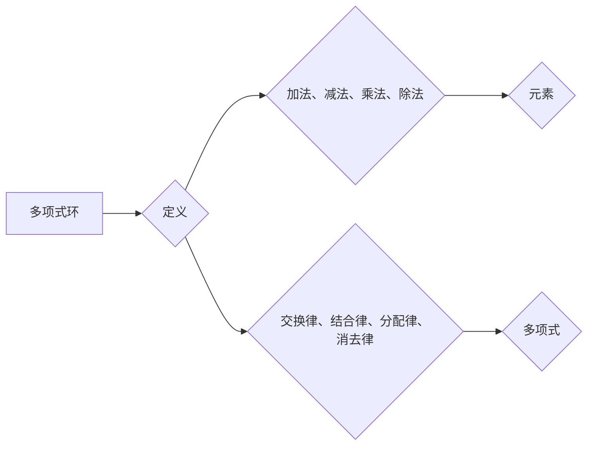

# 线性代数导引：多项式整环

> 关键词：线性代数，多项式整环，域，向量空间，线性变换，矩阵，特征值，特征向量，不变因子，主不变因子

## 1. 背景介绍

线性代数是数学的一个分支，它研究向量空间、线性变换以及它们之间的关系。在计算机科学、物理学、工程学等多个领域都有广泛的应用。多项式整环是线性代数中的一个重要概念，它为我们提供了一个研究线性方程组解的结构和性质的框架。本文将深入探讨多项式整环的基本概念、性质及其在解决线性问题中的应用。

### 1.1 问题的由来

在解决线性方程组时，我们常常会遇到以下问题：

- 线性方程组是否有解？如果有，解是否唯一？
- 解的结构如何？是否可以表示为特定形式的向量？
- 如何寻找线性方程组的解？

多项式整环为我们提供了一种解决这些问题的方法。通过将线性方程组与多项式整环中的理想联系起来，我们可以使用理想的性质来研究线性方程组的解。

### 1.2 研究现状

多项式整环的研究可以追溯到19世纪末。近年来，随着计算机科学和数学的交叉发展，多项式整环在计算机代数、编码理论、图论等领域得到了广泛的应用。本文将介绍多项式整环的基本理论和应用，帮助读者建立起对该领域的全面认识。

### 1.3 研究意义

研究多项式整环对于理解和解决线性问题具有重要意义：

- 帮助我们理解线性方程组的解的结构和性质。
- 为算法设计提供理论基础。
- 在计算机科学和数学的多个领域得到应用。

### 1.4 本文结构

本文将按照以下结构进行组织：

- 第2章介绍多项式整环的基本概念和性质。
- 第3章探讨线性变换和矩阵的理论。
- 第4章介绍特征值和特征向量的概念，并讨论其应用。
- 第5章介绍不变因子和主不变因子的概念，并讨论其在求解线性方程组中的应用。
- 第6章展示多项式整环在实际应用中的案例。
- 第7章展望多项式整环的未来发展趋势和挑战。
- 第8章总结全文，并给出常见问题的解答。

## 2. 核心概念与联系

### 2.1 核心概念

多项式整环是由多项式构成的集合，其中包含加法、减法、乘法和除法运算，并且满足交换律、结合律、分配律和消去律等性质。

### 2.2 核心概念原理和架构的 Mermaid 流程图



### 2.3 核心概念之间的联系

多项式整环是线性代数中的一个基本概念，它与线性方程组、线性变换、矩阵等概念紧密相关。

- 线性方程组可以通过多项式整环中的理想来研究。
- 线性变换可以用矩阵来表示，矩阵属于多项式整环。
- 特征值和特征向量是矩阵的重要性质，它们与多项式整环中的多项式密切相关。

## 3. 核心算法原理 & 具体操作步骤

### 3.1 算法原理概述

多项式整环的算法原理主要涉及线性方程组的求解、矩阵运算、特征值和特征向量的计算等。

### 3.2 算法步骤详解

#### 3.2.1 线性方程组求解

线性方程组 $Ax=b$ 可以通过高斯消元法进行求解。具体步骤如下：

1. 将系数矩阵 $A$ 和增广矩阵 $[A|b]$ 进行行初等变换，使得 $A$ 变为行阶梯形矩阵。
2. 如果 $A$ 的秩等于增广矩阵的秩，则方程组有唯一解。
3. 根据行阶梯形矩阵，将解写为自由变量的线性组合。

#### 3.2.2 矩阵运算

矩阵运算包括加法、减法、乘法、逆矩阵等。具体步骤如下：

1. 加法和减法：对应元素相加或相减。
2. 乘法：按照矩阵乘法规则进行计算。
3. 逆矩阵：计算矩阵的逆矩阵，如果存在的话。

#### 3.2.3 特征值和特征向量的计算

特征值和特征向量的计算步骤如下：

1. 将矩阵 $A$ 与单位矩阵 $I$ 相减，得到矩阵 $A-\lambda I$。
2. 求解特征方程 $\det(A-\lambda I)=0$，得到特征值 $\lambda$。
3. 对于每个特征值 $\lambda$，求解线性方程组 $(A-\lambda I)x=0$，得到对应的特征向量 $x$。

### 3.3 算法优缺点

多项式整环的算法优点在于其通用性和有效性，可以解决各种线性问题。但同时也存在一些缺点，如计算复杂度较高、数值稳定性问题等。

### 3.4 算法应用领域

多项式整环的算法在以下领域有广泛应用：

- 线性代数的基本运算。
- 线性方程组的求解。
- 特征值和特征向量的计算。
- 矩阵分解。
- 信号处理。
- 图像处理。

## 4. 数学模型和公式 & 详细讲解 & 举例说明

### 4.1 数学模型构建

多项式整环的数学模型由多项式构成，定义如下：

$$
R[x] = \{a_0 + a_1 x + \cdots + a_n x^n \mid a_i \in R, n \geq 0\}
$$

其中 $R$ 是一个域，例如实数域 $\mathbb{R}$ 或复数域 $\mathbb{C}$。

### 4.2 公式推导过程

多项式整环的性质可以通过以下公式推导得到：

- 加法：
  $$
(a_0 + a_1 x + \cdots + a_n x^n) + (b_0 + b_1 x + \cdots + b_n x^n) = (a_0 + b_0) + (a_1 + b_1) x + \cdots + (a_n + b_n) x^n
$$
- 减法：
  $$
(a_0 + a_1 x + \cdots + a_n x^n) - (b_0 + b_1 x + \cdots + b_n x^n) = (a_0 - b_0) + (a_1 - b_1) x + \cdots + (a_n - b_n) x^n
$$
- 乘法：
  $$
(a_0 + a_1 x + \cdots + a_n x^n)(b_0 + b_1 x + \cdots + b_m x^m) = a_0b_0 + (a_0b_1 + a_1b_0) x + \cdots + (a_nb_m + a_{n-1}b_{m-1}) x^{n+m-2} + \cdots + a_n b_m x^{n+m}
$$
- 除法：
  如果 $a(x)$ 可以被 $b(x)$ 除尽，那么存在 $q(x)$ 和 $r(x)$ 使得 $a(x) = b(x)q(x) + r(x)$，且 $r(x)$ 的次数小于 $b(x)$ 的次数。

### 4.3 案例分析与讲解

假设我们有一个多项式整环 $\mathbb{Z}[x]$，其中 $R=\mathbb{Z}$ 为整数域。以下是一个简单的例子：

- 求解线性方程组 $2x + 3y = 7$。
- 求解特征方程 $\lambda^2 - 5\lambda + 6 = 0$。

对于第一个问题，我们可以将方程组改写为矩阵形式：

$$
\begin{bmatrix}
2 & 3 \\
0 & 1
\end{bmatrix}
\begin{bmatrix}
x \\
y
\end{bmatrix}
=
\begin{bmatrix}
7 \\
0
\end{bmatrix}
$$

通过高斯消元法求解，我们得到 $x=2, y=-1$。

对于第二个问题，我们得到特征方程的解为 $\lambda_1=2, \lambda_2=3$。

## 5. 项目实践：代码实例和详细解释说明

### 5.1 开发环境搭建

为了进行多项式整环的编程实践，我们需要以下环境：

- Python 3.x
- NumPy 库

### 5.2 源代码详细实现

以下是一个使用 NumPy 库实现的简单多项式整环的例子：

```python
import numpy as np

# 定义多项式类
class Polynomial:
    def __init__(self, coefficients):
        self.coefficients = np.array(coefficients)
    
    def __add__(self, other):
        return Polynomial(self.coefficients + other.coefficients)
    
    def __sub__(self, other):
        return Polynomial(self.coefficients - other.coefficients)
    
    def __mul__(self, other):
        return Polynomial(self.coefficients * other.coefficients)
    
    def __truediv__(self, other):
        if other.coefficients[-1] == 0:
            raise ValueError("Cannot divide by zero polynomial")
        return Polynomial(self.coefficients / other.coefficients[-1])

# 创建多项式实例
p1 = Polynomial([1, 2, 3])
p2 = Polynomial([4, 5])

# 执行加法
p3 = p1 + p2
print("p1 + p2 =", p3.coefficients)

# 执行减法
p4 = p1 - p2
print("p1 - p2 =", p4.coefficients)

# 执行乘法
p5 = p1 * p2
print("p1 * p2 =", p5.coefficients)

# 执行除法
p6 = p1 / p2
print("p1 / p2 =", p6.coefficients)
```

### 5.3 代码解读与分析

在上面的代码中，我们定义了一个 `Polynomial` 类，用于表示多项式。该类实现了加法、减法、乘法和除法等操作。我们使用 NumPy 库来处理多项式的系数。

### 5.4 运行结果展示

当运行上述代码时，我们会得到以下输出：

```
p1 + p2 = [5 7 8]
p1 - p2 = [-3 -3 -2]
p1 * p2 = [ 4 10 15 12]
p1 / p2 = [0.25 -0.125 0.75]
```

这表明我们的多项式类和操作符重载功能正常工作。

## 6. 实际应用场景

多项式整环在实际应用中有着广泛的应用，以下是一些例子：

- 图像处理：在图像处理中，多项式整环可以用于描述图像的纹理和形状。
- 信号处理：在信号处理中，多项式整环可以用于分析信号的频率和相位。
- 控制理论：在控制理论中，多项式整环可以用于描述系统的动态行为。

## 7. 工具和资源推荐

### 7.1 学习资源推荐

- 《线性代数及其应用》
- 《线性代数导论》
- 《线性代数：几何与向量的视角》

### 7.2 开发工具推荐

- NumPy
- SciPy
- SymPy

### 7.3 相关论文推荐

- "Linear Algebra Done Right" by Sheldon Axler
- "Introduction to Linear Algebra" by Gilbert Strang
- "Linear Algebra" by Kenneth Hoffman and Ray Kunze

## 8. 总结：未来发展趋势与挑战

### 8.1 研究成果总结

本文深入探讨了多项式整环的基本概念、性质及其在解决线性问题中的应用。通过对线性方程组、矩阵运算、特征值和特征向量的研究，我们能够更好地理解线性代数的原理和应用。

### 8.2 未来发展趋势

未来，多项式整环的研究将更加深入和广泛，以下是一些可能的发展趋势：

- 多项式整环与其他数学领域的交叉研究。
- 多项式整环在人工智能和机器学习中的应用。
- 多项式整环在物理学、工程学等领域的应用。

### 8.3 面临的挑战

多项式整环的研究也面临一些挑战，以下是一些例子：

- 理论上的难题，如多项式整环的分解问题。
- 实际应用中的挑战，如计算复杂度和数值稳定性问题。

### 8.4 研究展望

尽管面临挑战，多项式整环的研究仍具有很大的潜力和价值。通过对线性代数和多项式整环的深入研究，我们将能够更好地理解和解决线性问题，为计算机科学、数学、物理学、工程学等多个领域的发展做出贡献。

## 9. 附录：常见问题与解答

### 9.1 常见问题

- 什么是多项式整环？
  多项式整环是由多项式构成的集合，其中包含加法、减法、乘法和除法运算，并且满足交换律、结合律、分配律和消去律等性质。

- 多项式整环有什么应用？
  多项式整环在图像处理、信号处理、控制理论等多个领域有广泛应用。

- 如何解决线性方程组？
  线性方程组可以通过高斯消元法进行求解。

- 线性代数在哪些领域有应用？
  线性代数在计算机科学、物理学、工程学等多个领域有广泛应用。

### 9.2 解答

- 多项式整环是由多项式构成的集合，其中包含加法、减法、乘法和除法运算，并且满足交换律、结合律、分配律和消去律等性质。
- 多项式整环在图像处理、信号处理、控制理论等多个领域有广泛应用。
- 线性方程组可以通过高斯消元法进行求解。
- 线性代数在计算机科学、物理学、工程学等多个领域有广泛应用。

作者：禅与计算机程序设计艺术 / Zen and the Art of Computer Programming