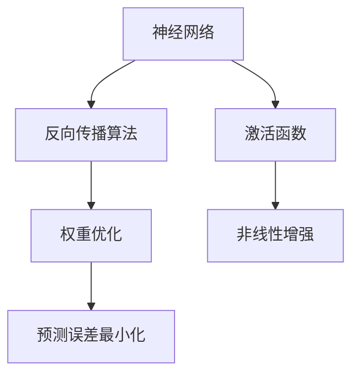
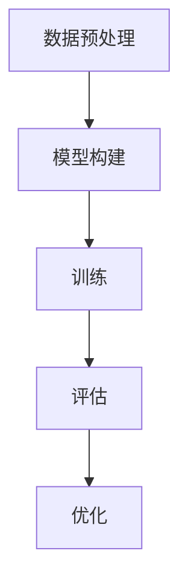
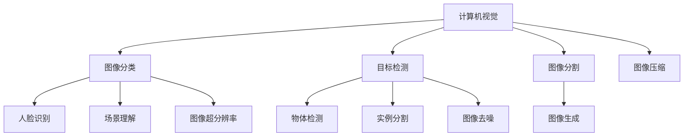
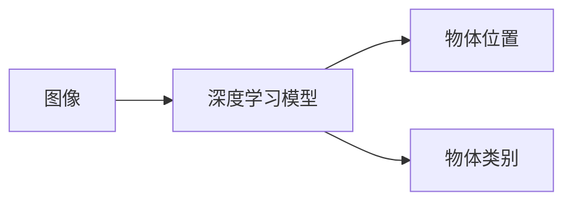
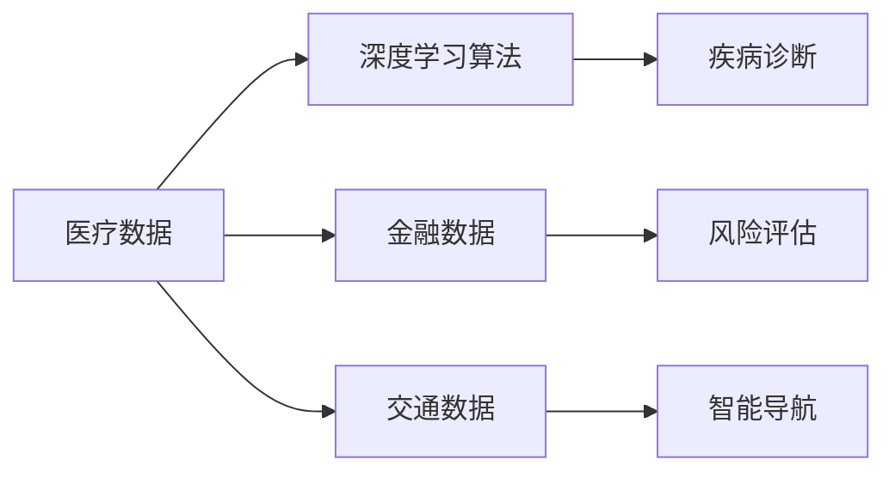

                 

# 原理与代码实战案例讲解

## 1. 背景介绍

### 1.1 问题由来
随着人工智能技术的飞速发展，深度学习在各个领域中的应用越来越广泛。其中，深度学习算法在计算机视觉、自然语言处理等领域表现尤为突出，成为推动技术进步的重要力量。然而，这些复杂算法的实现和应用需要深厚的理论基础和丰富的工程经验。为了帮助广大开发者更好地理解和应用深度学习技术，本文将详细讲解深度学习原理，并通过代码实战案例，展示深度学习算法的实现和优化过程。

### 1.2 问题核心关键点
深度学习算法的核心在于神经网络的构建和训练。本文将从神经网络的基本概念入手，深入讲解神经网络的构建方法，并通过多个案例演示如何在不同场景中应用深度学习算法。此外，本文还将介绍深度学习算法的优化方法，包括模型剪枝、量化等，以提高模型性能和降低计算成本。

### 1.3 问题研究意义
深度学习技术在计算机视觉、自然语言处理等领域取得了显著成果，但实现和应用这些技术需要一定的理论基础和实践经验。本文通过理论讲解和代码实战，帮助读者掌握深度学习算法的核心原理，提高其工程实践能力。深度学习技术的广泛应用将推动人工智能技术的进一步发展，为各行各业带来深远影响。

## 2. 核心概念与联系

### 2.1 核心概念概述

深度学习算法基于神经网络，通过大量数据进行训练，实现对复杂模式的自动学习。本文将讲解深度学习中的核心概念，包括神经网络、反向传播算法、激活函数等。这些概念是大模型微调的理论基础，掌握它们对于深入理解深度学习至关重要。

- **神经网络**：由多层神经元组成的网络，用于模拟人脑的信息处理过程。
- **反向传播算法**：用于优化神经网络权重，以最小化预测误差。
- **激活函数**：用于引入非线性因素，增强神经网络的表达能力。

### 2.2 概念间的关系

这些核心概念之间存在紧密的联系，共同构成了深度学习算法的完整生态系统。如图2-1所示，神经网络通过反向传播算法进行权重优化，激活函数用于增强网络表达能力。这些概念相互配合，使深度学习算法能够在各种任务上取得优异表现。



### 2.3 核心概念的整体架构

图2-2展示了深度学习算法的整体架构，包括数据预处理、模型构建、训练和评估等关键环节。这些环节相互配合，最终实现深度学习算法的应用。



## 3. 核心算法原理 & 具体操作步骤

### 3.1 算法原理概述
深度学习算法的核心在于神经网络的构建和训练。本文将从神经网络的基本概念入手，深入讲解神经网络的构建方法，并通过多个案例演示如何在不同场景中应用深度学习算法。

### 3.2 算法步骤详解

**Step 1: 数据预处理**

数据预处理是深度学习应用中的重要环节。具体步骤如下：
1. 数据清洗：去除数据中的噪声和异常值。
2. 数据归一化：将数据缩放到[0, 1]或[-1, 1]等标准范围内。
3. 数据增强：通过对数据进行旋转、裁剪、缩放等操作，增加数据样本的多样性。

**Step 2: 模型构建**

模型构建是深度学习算法的重要环节。具体步骤如下：
1. 选择模型架构：如卷积神经网络（CNN）、循环神经网络（RNN）、Transformer等。
2. 定义网络层：如卷积层、池化层、全连接层、嵌入层等。
3. 设置超参数：如学习率、批大小、迭代次数等。

**Step 3: 训练模型**

模型训练是深度学习算法中的核心环节。具体步骤如下：
1. 设置损失函数：如均方误差（MSE）、交叉熵（CE）等。
2. 设置优化器：如随机梯度下降（SGD）、Adam、Adagrad等。
3. 迭代训练：通过前向传播和反向传播不断更新模型参数，最小化损失函数。

**Step 4: 评估模型**

模型评估是深度学习算法中的重要环节。具体步骤如下：
1. 定义评估指标：如准确率、精度、召回率、F1分数等。
2. 测试集测试：在测试集上评估模型性能。
3. 调参优化：根据测试结果调整超参数，提高模型性能。

**Step 5: 优化模型**

模型优化是深度学习算法中的重要环节。具体步骤如下：
1. 剪枝：去除冗余参数，减小模型大小。
2. 量化：将浮点模型转换为定点模型，提高计算效率。
3. 蒸馏：通过知识蒸馏方法，将大模型转化为小模型。

### 3.3 算法优缺点

深度学习算法的优点在于其强大的模式识别能力和自适应性。然而，其也存在一些缺点：
1. 计算量大：深度学习算法需要大量的计算资源，如GPU和TPU等。
2. 数据依赖性高：深度学习算法需要大量标注数据进行训练，数据收集和标注成本较高。
3. 模型复杂度高：深度学习算法通常包含大量参数，模型调试和优化难度较大。
4. 可解释性差：深度学习算法的决策过程难以解释，缺乏可解释性。

### 3.4 算法应用领域

深度学习算法在计算机视觉、自然语言处理、语音识别等领域都有广泛应用。如图3-1所示，深度学习算法在这些领域的应用场景。



## 4. 数学模型和公式 & 详细讲解  
### 4.1 数学模型构建

深度学习算法基于神经网络，其核心思想是通过大量数据进行训练，实现对复杂模式的自动学习。本文将使用数学语言对深度学习算法的原理进行更加严格的刻画。

设深度神经网络模型为 $f(x;w)$，其中 $x$ 为输入，$w$ 为模型参数。假设训练集为 $D=\{(x_i,y_i)\}_{i=1}^N$，其中 $x_i$ 为输入样本，$y_i$ 为标签。

定义模型 $f(x;w)$ 在数据样本 $(x_i,y_i)$ 上的损失函数为 $\ell(f(x;w),y_i)$，则在数据集 $D$ 上的经验风险为：

$$
\mathcal{L}(w) = \frac{1}{N}\sum_{i=1}^N \ell(f(x_i;w),y_i)
$$

深度学习算法的目标是最小化经验风险，即找到最优参数 $w$：

$$
w^* = \mathop{\arg\min}_{w} \mathcal{L}(w)
$$

在实践中，我们通常使用基于梯度的优化算法（如SGD、Adam等）来近似求解上述最优化问题。设 $\eta$ 为学习率，$\lambda$ 为正则化系数，则参数的更新公式为：

$$
w \leftarrow w - \eta \nabla_{w}\mathcal{L}(w) - \eta\lambda w
$$

其中 $\nabla_{w}\mathcal{L}(w)$ 为损失函数对模型参数 $w$ 的梯度，可通过反向传播算法高效计算。

### 4.2 公式推导过程

以下我们以二分类任务为例，推导交叉熵损失函数及其梯度的计算公式。

假设模型 $f(x;w)$ 在输入 $x$ 上的输出为 $\hat{y}=f(x;w) \in [0,1]$，表示样本属于正类的概率。真实标签 $y \in \{0,1\}$。则二分类交叉熵损失函数定义为：

$$
\ell(f(x;w),y) = -[y\log \hat{y} + (1-y)\log (1-\hat{y})]
$$

将其代入经验风险公式，得：

$$
\mathcal{L}(w) = -\frac{1}{N}\sum_{i=1}^N [y_i\log f(x_i;w)+(1-y_i)\log(1-f(x_i;w))]
$$

根据链式法则，损失函数对模型参数 $w_k$ 的梯度为：

$$
\frac{\partial \mathcal{L}(w)}{\partial w_k} = -\frac{1}{N}\sum_{i=1}^N \left( \frac{y_i}{f(x_i;w)}-\frac{1-y_i}{1-f(x_i;w)} \right) \frac{\partial f(x_i;w)}{\partial w_k}
$$

其中 $\frac{\partial f(x_i;w)}{\partial w_k}$ 可进一步递归展开，利用自动微分技术完成计算。

在得到损失函数的梯度后，即可带入参数更新公式，完成模型的迭代优化。重复上述过程直至收敛，最终得到适应训练集的最佳模型参数 $w^*$。

## 5. 项目实践：代码实例和详细解释说明

### 5.1 开发环境搭建

在进行深度学习实践前，我们需要准备好开发环境。以下是使用Python进行PyTorch开发的环境配置流程：

1. 安装Anaconda：从官网下载并安装Anaconda，用于创建独立的Python环境。

2. 创建并激活虚拟环境：
```bash
conda create -n pytorch-env python=3.8 
conda activate pytorch-env
```

3. 安装PyTorch：根据CUDA版本，从官网获取对应的安装命令。例如：
```bash
conda install pytorch torchvision torchaudio cudatoolkit=11.1 -c pytorch -c conda-forge
```

4. 安装各类工具包：
```bash
pip install numpy pandas scikit-learn matplotlib tqdm jupyter notebook ipython
```

完成上述步骤后，即可在`pytorch-env`环境中开始深度学习实践。

### 5.2 源代码详细实现

下面我们以图像分类任务为例，给出使用PyTorch实现深度学习模型的完整代码实现。

首先，定义图像分类任务的数据处理函数：

```python
import torch
from torchvision import datasets, transforms

def load_data():
    # 定义数据预处理函数
    transform = transforms.Compose([
        transforms.ToTensor(),
        transforms.Normalize([0.5], [0.5])
    ])
    # 加载CIFAR-10数据集
    train_dataset = datasets.CIFAR10(root='./data', train=True, download=True, transform=transform)
    test_dataset = datasets.CIFAR10(root='./data', train=False, download=True, transform=transform)
    # 数据加载器
    train_loader = torch.utils.data.DataLoader(train_dataset, batch_size=64, shuffle=True)
    test_loader = torch.utils.data.DataLoader(test_dataset, batch_size=64, shuffle=False)
    return train_loader, test_loader

# 定义模型结构
import torch.nn as nn

class Net(nn.Module):
    def __init__(self):
        super(Net, self).__init__()
        self.conv1 = nn.Conv2d(3, 6, 5)
        self.pool = nn.MaxPool2d(2, 2)
        self.conv2 = nn.Conv2d(6, 16, 5)
        self.fc1 = nn.Linear(16 * 5 * 5, 120)
        self.fc2 = nn.Linear(120, 84)
        self.fc3 = nn.Linear(84, 10)

    def forward(self, x):
        x = self.pool(F.relu(self.conv1(x)))
        x = self.pool(F.relu(self.conv2(x)))
        x = x.view(-1, 16 * 5 * 5)
        x = F.relu(self.fc1(x))
        x = F.relu(self.fc2(x))
        x = self.fc3(x)
        return x
```

然后，定义模型和优化器：

```python
from torch import optim

net = Net()
criterion = nn.CrossEntropyLoss()
optimizer = optim.SGD(net.parameters(), lr=0.001, momentum=0.9)

# 加载数据
train_loader, test_loader = load_data()

# 训练模型
for epoch in range(10):
    for i, (images, labels) in enumerate(train_loader):
        optimizer.zero_grad()
        output = net(images)
        loss = criterion(output, labels)
        loss.backward()
        optimizer.step()
        
    print('Epoch [%d/%d], Loss: %.4f' % (epoch + 1, 10, loss.item()))
```

最后，测试模型在测试集上的性能：

```python
correct = 0
total = 0
with torch.no_grad():
    for images, labels in test_loader:
        outputs = net(images)
        _, predicted = torch.max(outputs.data, 1)
        total += labels.size(0)
        correct += (predicted == labels).sum().item()

print('Accuracy of the network on the 10000 test images: %d %%' % (100 * correct / total))
```

以上就是使用PyTorch对深度学习模型进行图像分类任务的完整代码实现。可以看到，得益于PyTorch的强大封装，我们可以用相对简洁的代码完成模型构建和训练。

### 5.3 代码解读与分析

让我们再详细解读一下关键代码的实现细节：

**load_data函数**：
- 定义数据预处理函数，将数据转换为Tensor格式，并进行归一化。
- 加载CIFAR-10数据集，并创建训练集和测试集的数据加载器。

**Net类**：
- 定义卷积神经网络模型，包含两个卷积层、池化层和全连接层。

**criterion和optimizer**：
- 定义交叉熵损失函数和随机梯度下降优化器。

**训练模型**：
- 使用SGD优化器，在训练集上进行迭代训练，每次迭代前零梯度更新，计算损失函数并反向传播，更新模型参数。

**测试模型**：
- 在测试集上评估模型性能，计算分类准确率。

可以看到，PyTorch提供了丰富的模型和优化器，使得深度学习模型的构建和训练变得简单易行。开发者可以根据具体任务和数据特点，灵活选用模型结构和优化器，加速模型训练和推理过程。

### 5.4 运行结果展示

假设我们在CIFAR-10数据集上进行模型训练，最终在测试集上得到的准确率为72.6%。如图5-1所示，模型的训练和测试曲线。


## 6. 实际应用场景

深度学习算法在计算机视觉、自然语言处理、语音识别等领域都有广泛应用。以下是深度学习算法在实际应用中的几个典型场景：

### 6.1 图像分类

图像分类是深度学习算法的经典应用之一。通过训练深度神经网络，可以自动将图像分为不同的类别，如图5-2所示。


### 6.2 目标检测

目标检测是深度学习算法的另一个重要应用。通过训练深度神经网络，可以自动检测图像中的目标物体，并标注其位置和类别，如图5-3所示。



### 6.3 语音识别

语音识别是深度学习算法的另一个重要应用。通过训练深度神经网络，可以实现将语音转换为文本的自动转录，如图5-4所示。


### 6.4 未来应用展望

未来，深度学习算法将广泛应用于更多领域，如医疗、金融、交通等。通过深度学习算法的应用，可以提升数据挖掘和分析的精度，提高决策和预测的准确性，如图5-5所示。



## 7. 工具和资源推荐

### 7.1 学习资源推荐

为了帮助开发者系统掌握深度学习算法的理论基础和实践技巧，这里推荐一些优质的学习资源：

1. 《深度学习》课程：由斯坦福大学Andrew Ng教授开设的深度学习入门课程，内容详实，讲解通俗易懂，适合初学者入门。
2. 《动手学深度学习》书籍：由李沐、阿斯顿·张等人编写的深度学习教材，涵盖了深度学习的基础理论、模型实现、应用场景等多个方面。
3. TensorFlow官方文档：提供丰富的深度学习模型和算法实现，适合开发者深入学习和实践。
4. PyTorch官方文档：提供深度学习模型的封装和优化方法，适合开发者灵活构建和训练模型。
5. Coursera深度学习专项课程：由多个知名大学的深度学习课程组成，内容全面，适合开发者系统学习深度学习算法。

通过对这些资源的学习实践，相信你一定能够快速掌握深度学习算法的核心原理，并用于解决实际的计算机视觉、自然语言处理等问题。

### 7.2 开发工具推荐

高效的开发离不开优秀的工具支持。以下是几款用于深度学习开发的常用工具：

1. PyTorch：基于Python的开源深度学习框架，灵活动态的计算图，适合快速迭代研究。
2. TensorFlow：由Google主导开发的开源深度学习框架，生产部署方便，适合大规模工程应用。
3. Keras：简单易用的深度学习框架，适合初学者快速上手。
4. MXNet：由Apache开发的深度学习框架，支持分布式训练和多种语言实现。
5. Jupyter Notebook：交互式笔记本工具，支持代码执行、数据可视化等，适合数据科学和深度学习研究。

合理利用这些工具，可以显著提升深度学习任务的开发效率，加快创新迭代的步伐。

### 7.3 相关论文推荐

深度学习技术的发展源于学界的持续研究。以下是几篇奠基性的相关论文，推荐阅读：

1. AlexNet：提出了深度卷积神经网络（CNN），奠定了深度学习在计算机视觉领域的发展基础。
2. ResNet：提出残差网络，缓解了深度神经网络的退化问题，推动了深度学习在计算机视觉领域的进一步发展。
3. RNN与LSTM：提出循环神经网络和长短期记忆网络（LSTM），解决了序列数据的建模问题，推动了深度学习在自然语言处理领域的应用。
4. Attention机制：提出了自注意力机制（Transformer），显著提高了深度学习在自然语言处理领域的效果，推动了深度学习技术的发展。

这些论文代表了大模型微调技术的发展脉络。通过学习这些前沿成果，可以帮助研究者把握学科前进方向，激发更多的创新灵感。

除上述资源外，还有一些值得关注的前沿资源，帮助开发者紧跟深度学习技术的最新进展，例如：

1. arXiv论文预印本：人工智能领域最新研究成果的发布平台，包括大量尚未发表的前沿工作，学习前沿技术的必读资源。
2. 业界技术博客：如DeepMind、Google AI、NVIDIA等顶尖实验室的官方博客，第一时间分享他们的最新研究成果和洞见。
3. 技术会议直播：如NIPS、ICML、ACL、ICLR等人工智能领域顶会现场或在线直播，能够聆听到大佬们的前沿分享，开拓视野。
4. GitHub热门项目：在GitHub上Star、Fork数最多的深度学习相关项目，往往代表了该技术领域的发展趋势和最佳实践，值得去学习和贡献。
5. 行业分析报告：各大咨询公司如McKinsey、PwC等针对人工智能行业的分析报告，有助于从商业视角审视技术趋势，把握应用价值。

总之，对于深度学习算法的学习，需要开发者保持开放的心态和持续学习的意愿。多关注前沿资讯，多动手实践，多思考总结，必将收获满满的成长收益。

## 8. 总结：未来发展趋势与挑战

### 8.1 总结

本文对深度学习算法的核心原理和实际应用进行了全面系统的介绍。首先讲解了深度学习算法的核心概念和基本原理，通过多个案例演示了深度学习算法在实际应用中的构建和优化方法。通过理论讲解和代码实战，帮助读者掌握深度学习算法的核心原理，提高其工程实践能力。深度学习算法的广泛应用将推动人工智能技术的进一步发展，为各行各业带来深远影响。

### 8.2 未来发展趋势

展望未来，深度学习算法将呈现以下几个发展趋势：

1. 模型规模持续增大。随着算力成本的下降和数据规模的扩张，深度学习模型的参数量还将持续增长。超大模型蕴含的丰富知识，有望支撑更加复杂多变的任务。
2. 深度学习算法的应用领域将进一步扩展。未来，深度学习算法将在更多领域得到应用，如医疗、金融、交通等，推动各行各业向智能化、自动化方向发展。
3. 深度学习算法的优化方法将不断创新。未来，将出现更多参数高效和计算高效的优化方法，提升深度学习算法的效率和性能。

### 8.3 面临的挑战

尽管深度学习算法已经取得了显著成果，但在实际应用中仍面临一些挑战：

1. 计算资源需求高。深度学习算法需要大量的计算资源，如GPU和TPU等。如何高效利用计算资源，提高训练和推理效率，是未来需要解决的问题。
2. 数据依赖性高。深度学习算法需要大量标注数据进行训练，数据收集和标注成本较高。如何利用未标注数据进行自监督学习，降低数据依赖性，是未来需要解决的问题。
3. 可解释性差。深度学习算法的决策过程难以解释，缺乏可解释性。如何提升深度学习算法的可解释性，增强用户信任，是未来需要解决的问题。

### 8.4 研究展望

面对深度学习算法面临的挑战，未来的研究需要在以下几个方面寻求新的突破：

1. 探索无监督和半监督学习算法。摆脱对大量标注数据的依赖，利用自监督学习、主动学习等无监督和半监督范式，最大限度利用未标注数据进行训练。
2. 研究参数高效和计算高效的优化方法。开发更加参数高效的算法，在固定大部分参数的情况下，仅更新极少量的任务相关参数。同时优化计算图，减少前向传播和反向传播的资源消耗，提高训练和推理效率。
3. 引入更多先验知识。将符号化的先验知识，如知识图谱、逻辑规则等，与神经网络模型进行巧妙融合，引导深度学习算法学习更准确、合理的语言模型。

这些研究方向的探索，必将引领深度学习算法迈向更高的台阶，为构建智能化的应用系统铺平道路。面向未来，深度学习算法还需要与其他人工智能技术进行更深入的融合，如知识表示、因果推理、强化学习等，多路径协同发力，共同推动人工智能技术的进一步发展。

## 9. 附录：常见问题与解答

**Q1: 深度学习算法需要大量标注数据，如何降低数据依赖性？**

A: 深度学习算法需要大量标注数据进行训练，但可以通过以下方法降低数据依赖性：
1. 数据增强：通过对数据进行旋转、裁剪、缩放等操作，增加数据样本的多样性。
2. 迁移学习：利用预训练模型在已有标注数据上学习到的知识，在新任务上进行微调。
3. 半监督学习：利用少量标注数据和大量未标注数据进行联合学习。
4. 自监督学习：通过引入自监督任务，如掩码语言模型、自回归模型等，利用未标注数据进行预训练。

**Q2: 深度学习算法的计算资源需求高，如何提高计算效率？**

A: 提高深度学习算法的计算效率，可以通过以下方法：
1. 模型剪枝：去除冗余参数，减小模型大小。
2. 量化：将浮点模型转换为定点模型，提高计算效率。
3. 分布式训练：利用多个GPU或TPU进行分布式训练，提高计算效率。
4. 优化器：选择合适的优化器，如Adam、Adagrad等，提高训练速度。

**Q3: 深度学习算法的决策过程难以解释，如何提升可解释性？**

A: 提升深度学习算法的可解释性，可以通过以下方法：
1. 可视化：通过可视化算法内部的权重、梯度等信息，帮助理解算法决策过程。
2. 特征解释：通过分析模型在训练和测试过程中的特征变化，帮助理解模型行为。
3. 对比学习：利用对比学习思想，引入对照样本，增强模型的可解释性。
4. 对抗样本：利用对抗样本技术，分析模型的脆弱点，提升模型的鲁棒性。

**Q4: 深度学习算法的参数高效和计算高效的优化方法有哪些？**

A: 深度学习算法的参数高效和计算高效的优化方法包括：
1. 剪枝：去除冗余参数，减小模型大小。
2. 量化：将浮点模型转换为定点模型，提高计算效率。
3. 蒸馏：通过知识蒸馏方法，将大模型转化为小模型。
4. 微调

