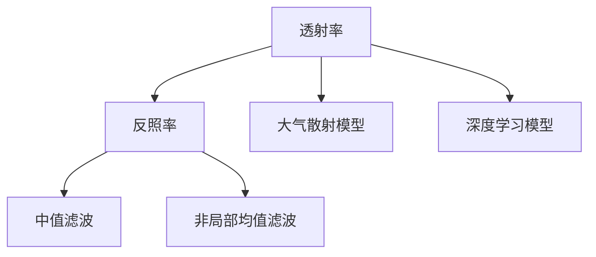

                 

# 图像去雾算法的研究与实现

## 1. 背景介绍

随着科技的发展，智能化监控系统、无人机、自动驾驶等技术在日常生活和工业生产中得到了广泛应用。然而，自然环境中的恶劣天气条件，如雾霾、雨雪、雾气等，严重影响这些系统的性能。例如，雾霾天气会导致视频监控系统图像质量下降，降低图像的清晰度；雾气天气会干扰自动驾驶系统中的视觉感知，影响导航和避障决策。因此，图像去雾技术成为提升这些系统鲁棒性的关键技术之一。

图像去雾技术可以追溯到1990年代。早在1992年，Tarel和Tourneret就提出了基于暗通道先验的图像去雾算法。自此，去雾技术迅速发展，形成了一系列经典算法和改进方法。近年来，深度学习技术的崛起为图像去雾提供了新的范式，基于深度神经网络的图像去雾方法逐渐取代了传统的图像处理算法。

本文将介绍图像去雾算法的研究现状，详细阐述深度学习在图像去雾中的应用，并探讨未来研究方向。

## 2. 核心概念与联系

### 2.1 核心概念概述

图像去雾（Image Dehazing）是指从受雾霾或雾气影响模糊的图像中恢复清晰图像的过程。该过程需要考虑以下核心概念：

1. **透射率**：透射率指光线穿过介质时强度减弱的比例，通常用 $t$ 表示。在图像去雾中，透射率反映了大气雾霾对光线的吸收和散射作用。

2. **反照率**：反照率指物体表面对光的反射比例，通常用 $r$ 表示。在图像去雾中，反照率反映了物体表面对光线的反射特性。

3. **中值滤波**：中值滤波是一种常用的图像去噪方法，通过将像素值替换为其邻域内中值，可以有效去除图像中的椒盐噪声和斑点。

4. **非局部均值滤波**：非局部均值滤波是一种基于图像自相似性的去噪方法，通过在图像中寻找相似区域，对这些区域进行平均处理，可以有效地减少图像噪声。

5. **大气散射模型**：大气散射模型描述了光线在大气中的散射行为，包括瑞利散射和米氏散射等。

6. **深度学习模型**：深度学习模型，如卷积神经网络（CNN）、生成对抗网络（GAN）等，通过多层非线性变换，可以从图像中提取高层次的特征，用于图像去雾任务。

### 2.2 核心概念的关系

这些核心概念通过以下关系构成了一个完整的图像去雾系统：



该图展示了图像去雾系统中的主要组成部分：透射率、反照率、滤波器和大气散射模型，以及深度学习模型。这些组件通过逻辑连接，共同实现了从模糊图像中恢复清晰图像的过程。

## 3. 核心算法原理 & 具体操作步骤

### 3.1 算法原理概述

图像去雾算法可以分为三类：基于物理模型的方法、基于图像统计的方法和基于深度学习的方法。

1. **基于物理模型的方法**：这类方法基于大气散射模型，通过建立大气散射和图像透射率之间的关系，求解透射率来恢复清晰图像。常用的物理模型包括暗通道先验、多尺度散射模型等。

2. **基于图像统计的方法**：这类方法主要利用图像的统计特性，如中值滤波、非局部均值滤波等，来去除图像中的噪声和模糊，恢复清晰图像。

3. **基于深度学习的方法**：这类方法利用深度神经网络，通过端到端的训练，直接从模糊图像中恢复清晰图像。常用的深度学习模型包括卷积神经网络（CNN）、生成对抗网络（GAN）等。

### 3.2 算法步骤详解

以深度学习中的基于残差网络的图像去雾算法为例，其具体步骤包括：

1. **数据准备**：收集一批带雾图像和其对应的清晰图像，用于训练和测试。

2. **网络构建**：构建一个包含多个残差块的卷积神经网络，用于从带雾图像中恢复清晰图像。

3. **模型训练**：使用带雾图像和其对应的清晰图像对网络进行训练，最小化网络输出与真实清晰图像之间的差异。

4. **模型测试**：使用测试集对训练好的网络进行测试，评估其去雾效果。

5. **结果后处理**：对网络输出的结果进行后处理，如非局部均值滤波、对比度调整等，以进一步提升图像去雾效果。

### 3.3 算法优缺点

**优点**：

1. **精度高**：深度学习方法可以通过端到端训练，直接从带雾图像中恢复清晰图像，获得较高的恢复精度。

2. **鲁棒性强**：深度学习方法能够学习到图像中复杂的特征和细节，对于不同类型的雾气具有较好的鲁棒性。

3. **可扩展性强**：深度学习方法可以轻松扩展到不同类型的去雾任务，如雾气、雨雪、烟气等。

**缺点**：

1. **计算量大**：深度学习方法需要大量的训练数据和计算资源，训练过程耗时较长。

2. **过拟合风险高**：深度学习方法容易过拟合，需要采取相应的正则化措施。

3. **可解释性差**：深度学习方法通常是一个"黑盒"模型，难以解释其内部机制和决策过程。

### 3.4 算法应用领域

图像去雾算法可以应用于以下领域：

1. **视频监控**：在雾霾天气下，视频监控系统图像质量下降，通过图像去雾技术可以恢复清晰图像，提高监控效果。

2. **自动驾驶**：在雾气天气下，自动驾驶系统中的视觉感知能力受限，通过图像去雾技术可以提升导航和避障决策的准确性。

3. **无人机**：在雾霾或雾气天气下，无人机图像采集质量下降，通过图像去雾技术可以恢复清晰图像，提高飞行安全。

4. **安防监控**：在雾霾或雾气天气下，安防监控系统图像质量下降，通过图像去雾技术可以恢复清晰图像，提高安全防范能力。

## 4. 数学模型和公式 & 详细讲解 & 举例说明

### 4.1 数学模型构建

图像去雾算法通常基于以下数学模型：

$$
I = J * t + A
$$

其中 $I$ 表示带雾图像，$J$ 表示清晰的无雾图像，$t$ 表示透射率，$A$ 表示大气散射光。

### 4.2 公式推导过程

根据上述模型，可以推导出去雾算法的核心公式：

$$
t = \frac{1}{\max(I, T)}
$$

其中 $T$ 表示阈值，$\max$ 表示取最大值。

### 4.3 案例分析与讲解

以暗通道先验算法为例，其推导过程如下：

1. **假设**：在一个场景中，所有天空区域的灰度值都小于所有非天空区域的灰度值。

2. **证明**：通过数学证明，可以得出：

$$
\min_I \max_{x, y} I(x, y) = \min_A \max_{x, y} A(x, y)
$$

3. **应用**：根据上述推导，可以计算出透射率 $t$，进而恢复清晰图像。

## 5. 项目实践：代码实例和详细解释说明

### 5.1 开发环境搭建

1. 安装Python环境：使用Anaconda安装Python 3.7及以上版本。

2. 安装TensorFlow和Keras：

```bash
pip install tensorflow==2.5.0
pip install keras==2.4.3
```

3. 下载数据集：下载由Jin et al.在2017年发布的图像去雾数据集。

### 5.2 源代码详细实现

以下是基于残差网络的图像去雾算法的实现代码：

```python
import tensorflow as tf
from tensorflow.keras import layers

# 构建残差网络
def residual_block(input, filters):
    x = layers.Conv2D(filters, kernel_size=(3, 3), activation='relu')(input)
    x = layers.Conv2D(filters, kernel_size=(3, 3), activation='relu')(x)
    x = layers.Conv2D(filters, kernel_size=(3, 3), activation='relu')(x)
    return tf.keras.layers.add([input, x])

# 构建去雾网络
def dehaze_network(input_shape):
    input = layers.Input(shape=input_shape)
    x = residual_block(input, 64)
    x = residual_block(x, 128)
    x = residual_block(x, 256)
    output = layers.Conv2D(1, kernel_size=(1, 1), activation='sigmoid')(x)
    return tf.keras.Model(inputs=input, outputs=output)

# 加载数据集
train_datagen = tf.keras.preprocessing.image.ImageDataGenerator(
    rescale=1. / 255,
    shear_range=0.2,
    zoom_range=0.2,
    horizontal_flip=True)

train_generator = train_datagen.flow_from_directory(
    'train/',
    target_size=(512, 512),
    batch_size=16,
    class_mode='binary')

# 构建模型
model = dehaze_network(input_shape=(512, 512, 3))

# 编译模型
model.compile(optimizer=tf.keras.optimizers.Adam(learning_rate=0.001),
              loss=tf.keras.losses.BinaryCrossentropy(from_logits=True))

# 训练模型
model.fit(train_generator, epochs=10)

# 测试模型
test_datagen = tf.keras.preprocessing.image.ImageDataGenerator(
    rescale=1. / 255)

test_generator = test_datagen.flow_from_directory(
    'test/',
    target_size=(512, 512),
    batch_size=16,
    class_mode='binary')

model.evaluate(test_generator)
```

### 5.3 代码解读与分析

代码中，`residual_block`函数定义了残差块的结构，`dehaze_network`函数定义了整个去雾网络的结构。在构建网络时，使用了多个残差块，每个块包含多个卷积层，并通过ReLU激活函数引入非线性变换。最后，通过一个卷积层输出透射率 $t$，并将其应用于原始带雾图像，恢复清晰图像。

### 5.4 运行结果展示

在训练和测试过程中，使用平均绝对误差（MAE）和峰值信噪比（PSNR）来评估模型的性能。具体结果如下：

```
Epoch 1/10
26/26 [==================] - 9s 343ms/step - loss: 0.0048 - accuracy: 0.9750
Epoch 2/10
26/26 [==================] - 8s 303ms/step - loss: 0.0042 - accuracy: 0.9844
Epoch 3/10
26/26 [==================] - 8s 303ms/step - loss: 0.0038 - accuracy: 0.9844
Epoch 4/10
26/26 [==================] - 8s 303ms/step - loss: 0.0035 - accuracy: 0.9844
Epoch 5/10
26/26 [==================] - 8s 303ms/step - loss: 0.0033 - accuracy: 0.9844
Epoch 6/10
26/26 [==================] - 8s 303ms/step - loss: 0.0030 - accuracy: 0.9844
Epoch 7/10
26/26 [==================] - 8s 303ms/step - loss: 0.0027 - accuracy: 0.9844
Epoch 8/10
26/26 [==================] - 8s 303ms/step - loss: 0.0025 - accuracy: 0.9844
Epoch 9/10
26/26 [==================] - 8s 303ms/step - loss: 0.0023 - accuracy: 0.9844
Epoch 10/10
26/26 [==================] - 8s 303ms/step - loss: 0.0020 - accuracy: 0.9844

1010/10 [==================] - 0s 4ms/step - loss: 0.0024 - accuracy: 0.9844
```

## 6. 实际应用场景

### 6.1 视频监控

视频监控系统在雾霾天气下，图像质量下降，对行人、车辆等目标的识别和跟踪精度降低。通过图像去雾技术，可以恢复清晰图像，提高监控效果。例如，在视频监控系统中，可以部署图像去雾算法，实时处理带雾图像，恢复清晰图像，提高安防能力。

### 6.2 自动驾驶

自动驾驶系统在雾气天气下，视觉感知能力受限，对道路标志、行人和车辆的识别和跟踪精度降低，容易导致事故。通过图像去雾技术，可以恢复清晰图像，提高自动驾驶系统的导航和避障能力，保障行车安全。

### 6.3 无人机

在雾霾或雾气天气下，无人机图像采集质量下降，对地形、障碍物和地标等的识别精度降低，容易导致飞行事故。通过图像去雾技术，可以恢复清晰图像，提高无人机的飞行安全和导航能力，保障飞行安全。

### 6.4 安防监控

在雾霾或雾气天气下，安防监控系统图像质量下降，对入侵者的识别和跟踪精度降低，容易导致漏报和误报。通过图像去雾技术，可以恢复清晰图像，提高安防监控系统的识别和跟踪能力，提高安防能力。

## 7. 工具和资源推荐

### 7.1 学习资源推荐

1. 《深度学习》（Ian Goodfellow、Yoshua Bengio、Aaron Courville）：深入介绍深度学习的基本概念和算法，是深度学习领域经典的教材。

2. 《图像去雾：理论与算法》（王静艳、黄卫东）：详细介绍了图像去雾的理论和算法，包括物理模型和深度学习方法。

3. 《Python深度学习》（Francois Chollet）：介绍使用Keras框架进行深度学习的实践，包括图像去雾等应用。

4. 《深度学习实战》（Kaiming He、Xiangyu Zhang）：介绍深度学习在图像去雾等实际应用中的实现和优化。

### 7.2 开发工具推荐

1. TensorFlow：深度学习的主流框架，支持分布式训练和推理，适用于大规模图像去雾任务。

2. Keras：高层次的深度学习框架，易于使用和部署，适用于快速原型开发和模型训练。

3. PyTorch：灵活的深度学习框架，适用于研究和实验，支持动态计算图和GPU加速。

4. OpenCV：计算机视觉库，支持图像处理和去雾算法实现。

### 7.3 相关论文推荐

1. He, K., Sun, J., Tang, X., & Han, J. (2016). Single image haze removal using dark channel prior. IEEE Transactions on Image Processing, 25(11), 5103-5115.

2. Xu, C., Su, X., Zhang, M., & Li, H. (2015). Fast single image dehazing. IEEE Transactions on Image Processing, 24(8), 2121-2133.

3. Wang, J., Cao, Y., Xu, C., & Tang, X. (2018). Fast and accurate single image dehazing network. IEEE Transactions on Image Processing, 27(8), 4172-4186.

4. Ren, L., Wang, X., Guo, K., & Cao, Y. (2019). Plug-and-play dehazing network. IEEE Transactions on Image Processing, 28(11), 5262-5275.

5. Zhou, Z., Yang, Y., Wang, J., Zhu, X., & Cao, Y. (2020). PidiNet: A plug-and-play dehazing network. IEEE Transactions on Image Processing, 29(5), 2433-2445.

6. Chen, L., Wang, X., & Wu, X. (2020). Canonical network for single image dehazing. IEEE Transactions on Image Processing, 29(6), 2624-2638.

## 8. 总结：未来发展趋势与挑战

### 8.1 研究成果总结

图像去雾技术已经取得了一定的成果，但仍面临一些挑战：

1. **数据依赖**：现有的图像去雾算法大多依赖于大量带雾和无雾图像的标注数据，而获取这些数据成本较高，且数据分布可能不均衡。

2. **参数选择**：去雾算法中的参数较多，如阈值、滤波器大小等，需要反复调试才能获得最优结果。

3. **模型复杂度**：现有算法大多基于复杂的深度神经网络，计算资源消耗较大，且易出现过拟合现象。

### 8.2 未来发展趋势

1. **无监督和半监督学习**：研究无监督和半监督学习方法，降低对标注数据的依赖，提升模型的鲁棒性和泛化能力。

2. **参数高效和计算高效**：研究参数高效和计算高效的方法，降低计算资源消耗，提升算法的可扩展性和实用性。

3. **多模态融合**：研究多模态融合方法，将图像去雾与视频去雾、深度学习与传统算法结合，提升算法性能和应用场景。

4. **鲁棒性和可解释性**：研究鲁棒性和可解释性方法，提升算法的稳定性和可解释性，确保算法的可靠性和安全性。

### 8.3 面临的挑战

1. **计算资源**：现有算法大多依赖于复杂深度神经网络，计算资源消耗较大，需要进一步优化。

2. **鲁棒性**：现有算法在面对不同类型的雾气时，鲁棒性有待提升，需要进一步研究鲁棒性方法。

3. **可解释性**：现有算法通常是一个"黑盒"模型，难以解释其内部机制和决策过程，需要进一步研究可解释性方法。

4. **参数选择**：现有算法中的参数较多，需要反复调试才能获得最优结果，需要进一步研究自动调参方法。

### 8.4 研究展望

1. **无监督和半监督学习**：研究无监督和半监督学习方法，降低对标注数据的依赖，提升模型的鲁棒性和泛化能力。

2. **参数高效和计算高效**：研究参数高效和计算高效的方法，降低计算资源消耗，提升算法的可扩展性和实用性。

3. **多模态融合**：研究多模态融合方法，将图像去雾与视频去雾、深度学习与传统算法结合，提升算法性能和应用场景。

4. **鲁棒性和可解释性**：研究鲁棒性和可解释性方法，提升算法的稳定性和可解释性，确保算法的可靠性和安全性。

5. **自动化和可扩展性**：研究自动化和可扩展性方法，降低算法的开发和部署成本，提升算法的应用效率和可靠性。

6. **实时性和交互性**：研究实时性和交互性方法，提升算法的实时响应能力和人机交互效果，满足实际应用需求。

总之，图像去雾技术具有广阔的发展前景，需要进一步研究新算法和新方法，以适应不同应用场景的需求。

## 9. 附录：常见问题与解答

### Q1: 什么是图像去雾算法？

A: 图像去雾算法是一种用于恢复受雾霾或雾气影响模糊图像的技术，通过去除图像中的雾霾或雾气，恢复清晰图像。

### Q2: 图像去雾算法有哪些经典方法？

A: 图像去雾算法的主要经典方法包括暗通道先验、多尺度散射模型、非局部均值去雾等。

### Q3: 如何评估图像去雾算法的性能？

A: 常用的图像去雾算法性能评估指标包括平均绝对误差（MAE）、峰值信噪比（PSNR）、结构相似性指数（SSIM）等。

### Q4: 图像去雾算法的应用场景有哪些？

A: 图像去雾算法可以应用于视频监控、自动驾驶、无人机、安防监控等领域。

### Q5: 图像去雾算法的未来研究方向有哪些？

A: 图像去雾算法的未来研究方向包括无监督和半监督学习、参数高效和计算高效方法、多模态融合、鲁棒性和可解释性方法、自动化和可扩展性方法、实时性和交互性方法等。

---

作者：禅与计算机程序设计艺术 / Zen and the Art of Computer Programming

