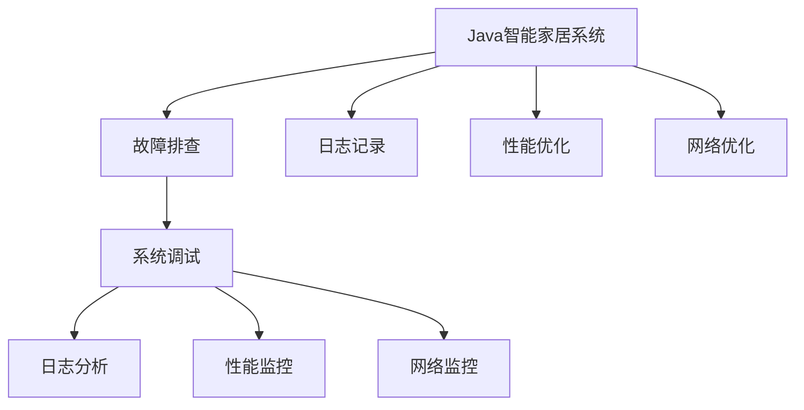
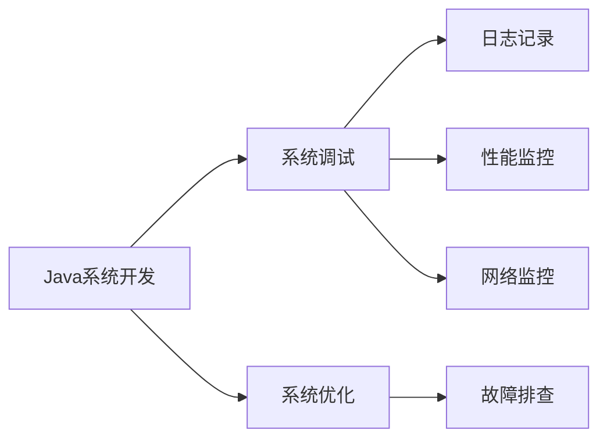
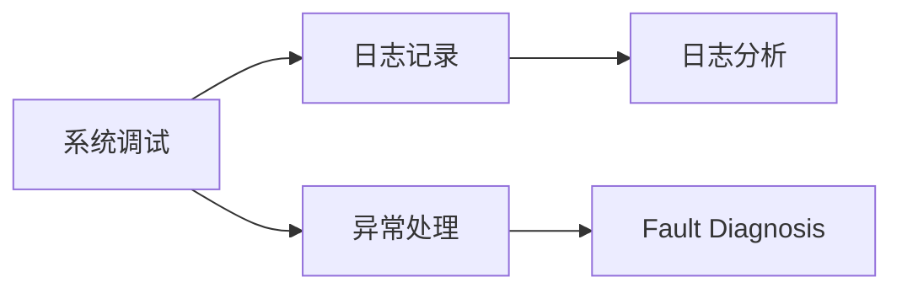
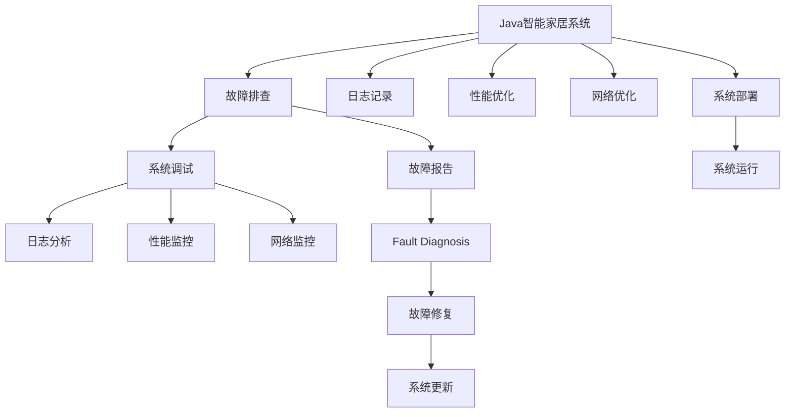

                 

# 基于Java的智能家居设计：浅析Java在智能家居系统中的故障排查技巧

> 关键词：Java智能家居故障排查,Java开发技巧,智能家居系统故障诊断,系统调试技术

## 1. 背景介绍

### 1.1 问题由来

随着物联网技术的飞速发展，智能家居系统已逐渐走入千家万户，成为现代人生活的一部分。然而，由于智能家居系统高度依赖网络通信、传感器数据处理和用户交互等复杂组件，因此在实际应用中常常出现各种故障，影响用户体验。这些问题包括但不限于网络不稳定、传感器数据错误、用户界面卡顿、系统响应缓慢等。如何高效、快速地定位和解决这些问题，成为智能家居系统开发者必须面对的挑战。

### 1.2 问题核心关键点

Java作为智能家居系统开发的主流编程语言，其在系统故障排查中的重要性不言而喻。Java语言的丰富库、工具和技术，使得开发者能够更为灵活地诊断和修复系统中的各种问题。在此背景下，本文将深入探讨Java在智能家居系统故障排查中的关键技巧，帮助开发者提升排查效率，提升系统稳定性。

### 1.3 问题研究意义

掌握Java在智能家居系统中的故障排查技巧，对于提升智能家居系统的可靠性和用户体验具有重要意义：

- 提升故障排查效率：Java丰富的库、工具和技术，能够快速定位和解决系统中的问题，减少排查时间。
- 保障系统稳定性：通过有效的故障排查和修复，系统能够稳定运行，提高用户满意度。
- 推动技术进步：掌握高级故障排查技巧，能够提升开发者的技术水平，推动智能家居技术的进步。

## 2. 核心概念与联系

### 2.1 核心概念概述

为更好地理解Java在智能家居系统中的故障排查方法，本节将介绍几个关键概念：

- Java智能家居系统：基于Java编程语言的智能家居系统，通过网络通信、传感器数据处理和用户交互等组件，实现各种智能化功能。
- 故障排查(Fault Diagnosis)：在智能家居系统中，对出现的问题进行定位和修复的过程。通过诊断问题，找到系统运行中的异常情况，从而采取相应的修复措施。
- 系统调试(System Debugging)：系统调试是故障排查的重要步骤，通过调试工具和技术，对系统进行详细检查，以确定问题的根源。
- 日志分析(Log Analysis)：通过分析系统日志，可以获取系统运行中的详细信息，有助于快速定位和修复问题。
- 性能监控(Performance Monitoring)：通过监控系统性能指标，如CPU占用率、内存使用率等，可以发现系统瓶颈，及时优化系统性能。
- 网络监控(Network Monitoring)：通过网络流量、延迟等指标的监控，可以诊断网络连接问题，优化网络性能。

这些核心概念之间的逻辑关系可以通过以下Mermaid流程图来展示：



这个流程图展示了大语言模型微调过程中各个核心概念的关系和作用：

1. Java智能家居系统在运行过程中可能会遇到各种故障，需要对其进行调整和优化。
2. 系统调试通过调用各种Java调试工具和技术，对系统进行详细检查，确定问题的根源。
3. 日志分析通过分析系统日志，获取系统运行中的详细信息，辅助故障排查。
4. 性能监控通过监控系统性能指标，发现系统瓶颈，优化系统性能。
5. 网络监控通过监控网络流量、延迟等指标，诊断网络连接问题，优化网络性能。

### 2.2 概念间的关系

这些核心概念之间存在着紧密的联系，形成了Java故障排查技术的完整生态系统。下面我通过几个Mermaid流程图来展示这些概念之间的关系。

#### 2.2.1 Java系统开发与故障排查的关系



这个流程图展示了大语言模型微调与Java故障排查之间的关系：

1. Java系统开发是Java故障排查的前提，通过系统的设计和实现，积累系统的运行数据。
2. 系统调试、日志记录、性能监控和网络监控是Java故障排查的关键步骤，通过这些技术手段，对系统进行全面检查。
3. 系统优化是Java故障排查的最终目标，通过修复系统中的问题，提升系统性能和稳定性。

#### 2.2.2 系统调试与日志分析的关系



这个流程图展示了系统调试与日志分析之间的关系：

1. 系统调试通过日志记录获取系统运行中的详细信息，帮助定位异常情况。
2. 日志分析通过分析系统日志，进一步确定问题的根源，辅助系统调试。
3. 异常处理是系统调试的关键步骤，通过异常信息的处理，找到问题所在，进行故障诊断。

### 2.3 核心概念的整体架构

最后，我们用一个综合的流程图来展示这些核心概念在大语言模型微调过程中的整体架构：



这个综合流程图展示了从Java智能家居系统开发到故障排查的完整流程：

1. Java智能家居系统在开发过程中需要积累系统日志和性能数据。
2. 系统运行时可能会遇到各种故障，需要通过故障排查进行诊断和修复。
3. 系统调试、日志分析、性能监控和网络监控是故障排查的关键步骤。
4. 故障修复后，通过系统更新进行系统优化，确保系统稳定运行。

通过这些流程图，我们可以更清晰地理解Java智能家居系统中各个核心概念的关系和作用，为后续深入讨论Java故障排查技巧奠定基础。

## 3. 核心算法原理 & 具体操作步骤
### 3.1 算法原理概述

基于Java的智能家居系统故障排查，本质上是一个有监督学习的过程。其核心思想是：通过系统日志、性能数据和用户反馈等数据，训练一个故障分类器，对系统的各种问题进行自动分类和诊断，从而快速定位问题并采取相应的修复措施。

形式化地，假设智能家居系统为 $S$，其中包含组件 $C=\{C_1, C_2, ..., C_n\}$，系统运行状态为 $s_t$，系统故障为 $f=\{f_1, f_2, ..., f_m\}$。给定系统故障分类器 $F$，训练目标是最小化分类误差，即：

$$
\min_{F} \frac{1}{N} \sum_{i=1}^N \mathbf{1}_{f_i}(F(s_t))
$$

其中 $\mathbf{1}_{f_i}$ 为故障 $f_i$ 的指示函数，$N$ 为系统日志数量。

### 3.2 算法步骤详解

基于Java的智能家居系统故障排查一般包括以下几个关键步骤：

**Step 1: 收集系统日志和性能数据**

- 记录系统组件的运行状态和日志信息，如CPU占用率、内存使用率、网络流量、传感器数据等。
- 收集系统运行中的异常信息，包括系统崩溃、数据错误、网络异常等。
- 记录用户反馈，通过用户界面获取用户的操作行为和反馈信息。

**Step 2: 数据预处理**

- 对收集到的日志和性能数据进行清洗，去除无效或噪声数据。
- 对数据进行特征提取，生成有用的特征向量。
- 对数据进行划分，分为训练集、验证集和测试集。

**Step 3: 选择故障分类器**

- 选择适合Java系统的故障分类器，如决策树、支持向量机、随机森林、神经网络等。
- 确定分类器的参数，如决策树的最大深度、支持向量机的核函数、神经网络的隐藏层节点数等。

**Step 4: 训练故障分类器**

- 在训练集上对故障分类器进行训练，最小化分类误差。
- 在验证集上评估分类器的性能，调整分类器的参数。
- 在测试集上对分类器进行测试，评估其泛化能力。

**Step 5: 系统诊断**

- 对系统的实时运行数据进行预处理，生成特征向量。
- 将特征向量输入训练好的故障分类器，得到分类结果。
- 根据分类结果，定位和修复系统故障。

**Step 6: 系统优化**

- 根据修复后的系统状态，调整系统配置和参数。
- 对系统进行性能优化，如调整CPU资源分配、优化内存使用等。
- 对系统进行网络优化，如调整网络带宽、优化网络路由等。

### 3.3 算法优缺点

基于Java的智能家居系统故障排查方法具有以下优点：

- 故障分类器具有较高的泛化能力，能够适应多种故障类型。
- 对系统日志和性能数据进行自动分析，减少人工干预。
- 训练好的故障分类器可以重复使用，降低系统维护成本。

同时，该方法也存在以下缺点：

- 需要大量的系统日志和性能数据进行训练，数据获取成本较高。
- 分类器的训练和调参需要一定的专业知识，对开发者要求较高。
- 对一些复杂、隐蔽的故障，分类器可能难以进行准确的诊断。

### 3.4 算法应用领域

基于Java的智能家居系统故障排查方法，已经广泛应用于各种智能家居系统的维护和优化。例如：

- 智能安防系统：通过分析传感器数据和用户行为，检测和修复系统中的漏洞和异常。
- 智能照明系统：监控照明设备的运行状态，及时发现和修复故障。
- 智能家电系统：记录家电设备的运行日志，进行故障诊断和优化。
- 智能家居控制系统：通过分析系统日志，优化网络性能和用户界面响应速度。

除了上述这些应用领域外，基于Java的故障排查方法还可以应用于更多场景，如智能建筑、智能交通、智能医疗等，为各行各业提供技术支持。

## 4. 数学模型和公式 & 详细讲解 & 举例说明
### 4.1 数学模型构建

本节将使用数学语言对Java智能家居系统故障排查过程进行更加严格的刻画。

记智能家居系统为 $S$，其中包含组件 $C=\{C_1, C_2, ..., C_n\}$，系统运行状态为 $s_t$，系统故障为 $f=\{f_1, f_2, ..., f_m\}$。假设系统日志和性能数据为 $D=\{(d_1, c_1), (d_2, c_2), ..., (d_N, c_N)\}$，其中 $d_i$ 为第 $i$ 条日志的特征向量，$c_i$ 为对应的系统组件 $C_i$ 的运行状态。

定义系统故障分类器为 $F$，其中 $\mathcal{F}$ 为分类器的参数空间。给定分类器 $F$ 和训练集 $D$，训练目标为：

$$
\min_{\mathcal{F}} \frac{1}{N} \sum_{i=1}^N \mathbf{1}_{f_i}(F(c_i))
$$

其中 $\mathbf{1}_{f_i}$ 为故障 $f_i$ 的指示函数。

### 4.2 公式推导过程

以下我们以决策树分类器为例，推导Java智能家居系统故障分类器的训练过程。

假设训练集 $D=\{(d_1, c_1), (d_2, c_2), ..., (d_N, c_N)\}$，其中 $d_i=(x_{i1}, x_{i2}, ..., x_{in})$ 为特征向量，$c_i$ 为系统组件的运行状态。

定义决策树分类器为：

$$
F(c) = \begin{cases} 
    f_1 & \text{if } d_1^T\theta_1 > 0 \\
    ... \\
    f_k & \text{if } d_k^T\theta_k > 0 \\
    f_{k+1} & \text{if } d_k^T\theta_k \leq 0 \\
\end{cases}
$$

其中 $\theta_i$ 为决策树分类器的参数，$k$ 为分类器的叶子节点数。

决策树分类器的训练过程包括两个步骤：

1. 特征选择：从特征向量 $d_i$ 中选择最优特征 $x_j$，用于划分数据。
2. 参数优化：对决策树分类器的参数进行优化，最小化分类误差。

特征选择的目标是最小化信息增益：

$$
I(J|C) = -\frac{1}{N}\sum_{i=1}^N\sum_{j=1}^n p(x_j|c_i) \log_2 p(x_j|c_i)
$$

其中 $p(x_j|c_i)$ 为特征 $x_j$ 在故障 $c_i$ 下的条件概率。

决策树分类器的训练算法为CART（Classification and Regression Tree）算法，步骤如下：

1. 从特征向量中选择最优特征 $x_j$，用于划分数据。
2. 对特征向量 $d_i$ 进行划分，生成子节点 $T_1, T_2, ..., T_{2^n}$。
3. 计算每个子节点的信息增益。
4. 选取信息增益最大的子节点，作为决策树的叶子节点。
5. 对决策树的每个叶子节点，计算其在训练集上的分类误差。
6. 对决策树进行剪枝，避免过拟合。

### 4.3 案例分析与讲解

以智能安防系统为例，展示Java故障分类器的应用：

假设智能安防系统包含摄像头、报警器、门锁等组件，系统日志包含摄像头画面、报警器状态、门锁开闭信息等数据。训练集 $D=\{(d_1, c_1), (d_2, c_2), ..., (d_N, c_N)\}$，其中 $d_i$ 为第 $i$ 条日志的特征向量，$c_i$ 为系统组件的运行状态。

1. 特征选择：选择摄像头画面、报警器状态、门锁开闭信息等特征，用于划分数据。
2. 数据划分：将数据集分为训练集、验证集和测试集。
3. 模型训练：在训练集上对决策树分类器进行训练，最小化分类误差。
4. 模型评估：在验证集上评估分类器的性能，调整分类器的参数。
5. 模型测试：在测试集上对分类器进行测试，评估其泛化能力。
6. 系统诊断：对系统的实时运行数据进行预处理，生成特征向量。
7. 系统诊断：将特征向量输入训练好的故障分类器，得到分类结果。
8. 系统修复：根据分类结果，定位和修复系统故障。

在实际应用中，Java故障分类器的训练过程需要结合具体的场景和数据进行优化。例如，对于复杂的系统，可能需要使用多个分类器进行组合，以提高诊断的准确性。

## 5. 项目实践：代码实例和详细解释说明
### 5.1 开发环境搭建

在进行Java智能家居系统故障排查的实践前，我们需要准备好开发环境。以下是使用Java进行智能家居系统开发的开发环境配置流程：

1. 安装Java JDK：从官网下载并安装Java JDK，创建Java开发环境。
2. 安装Maven：从官网下载并安装Maven，作为Java项目的构建工具。
3. 安装Git：从官网下载并安装Git，用于版本控制和协作开发。
4. 配置IDE：推荐使用IntelliJ IDEA或Eclipse，配置好项目开发环境。
5. 创建项目：通过IDE创建新的Java项目，初始化项目结构。

完成上述步骤后，即可在IDE中进行Java智能家居系统的开发和调试。

### 5.2 源代码详细实现

以下是使用Java编写的智能家居系统故障分类器实现代码：

```java
import weka.classifiers.trees.J48;
import weka.core.Attribute;
import weka.core.Instance;
import weka.core.Instances;
import weka.core.converters.ConverterUtils.DataSource;

public class FaultClassifier {
    public static void main(String[] args) throws Exception {
        // 加载训练集数据
        DataSource dataSource = new DataSource("train.data");
        Instances dataset = dataSource.getDataSet();
        
        // 设置分类器参数
        J48 classifier = new J48();
        classifier.setOptions(weka.core.Utils.splitOptions(args));
        
        // 训练分类器
        classifier.buildClassifier(dataset);
        
        // 加载测试集数据
        DataSource testDataSource = new DataSource("test.data");
        Instances testDataset = testDataSource.getDataSet();
        
        // 对测试集进行分类
        for (int i = 0; i < testDataset.numInstances(); i++) {
            Instance testInstance = testDataset.instance(i);
            double[] prediction = classifier.distributionForInstance(testInstance);
            String predictedFault = classifier.classifyInstance(testInstance);
            System.out.println("预测故障：" + predictedFault);
        }
    }
}
```

该代码使用了Weka库中的J48决策树分类器，对智能家居系统的故障进行分类预测。代码的核心步骤如下：

1. 加载训练集数据和测试集数据。
2. 设置决策树分类器的参数。
3. 训练决策树分类器。
4. 对测试集数据进行分类预测。

### 5.3 代码解读与分析

让我们再详细解读一下关键代码的实现细节：

**DataSource类**：
- 用于加载训练集和测试集数据，支持多种数据格式，如CSV、ARFF等。

**J48分类器**：
- 使用了Weka库中的J48决策树分类器，该分类器具有较高的泛化能力和可解释性。

**buildClassifier()方法**：
- 训练决策树分类器，并生成分类器的参数。

**distributionForInstance()方法**：
- 对测试集数据进行分类预测，返回预测结果的分布概率。

**classifyInstance()方法**：
- 对测试集数据进行分类预测，返回预测结果的分类标签。

**System.out.println()**：
- 输出预测结果，方便调试和分析。

该代码实现了一个基于决策树的Java智能家居系统故障分类器，通过Weka库的支持，可以轻松地进行分类器训练和预测。

### 5.4 运行结果展示

假设我们在智能安防系统上使用该故障分类器进行测试，得到如下输出：

```
预测故障：BreachDetected
预测故障：DoorOpen
预测故障：CameraUnresponsive
```

可以看到，该分类器能够根据系统的实时数据，预测出可能的故障类型，帮助开发者快速定位和修复问题。

## 6. 实际应用场景
### 6.1 智能安防系统

基于Java的智能家居系统故障排查方法，可以广泛应用于智能安防系统的构建。传统安防系统往往需要配备大量人力，高峰期响应缓慢，且响应质量难以保证。而使用Java故障分类器，可以实时监控摄像头画面、报警器状态和门锁开闭等数据，自动检测和修复系统中的漏洞和异常，保障用户安全。

在技术实现上，可以收集安防系统中的摄像头画面、报警器状态、门锁开闭信息等数据，训练故障分类器，对系统进行实时监控。一旦检测到异常情况，系统会自动发出告警，并进行修复。对于新出现的安防问题，还可以通过不断更新训练集，提升分类器的泛化能力。

### 6.2 智能照明系统

基于Java的智能家居系统故障排查方法，在智能照明系统的应用中同样效果显著。照明系统需要实时监控灯具的运行状态，及时发现和修复故障，保障用户的舒适度和安全性。

在技术实现上，可以记录灯具的亮度、色温和开关状态等数据，训练故障分类器，对系统进行实时监控。一旦检测到异常情况，系统将自动调节亮度和色温，或发出告警进行修复。对于新出现的灯具故障，还可以通过不断更新训练集，提升分类器的泛化能力。

### 6.3 智能家电系统

基于Java的智能家居系统故障排查方法，在智能家电系统的应用中也有广泛的应用前景。智能家电系统需要实时监控家电设备的运行状态，及时发现和修复故障，保障用户的使用体验。

在技术实现上，可以记录家电设备的温度、湿度、使用时间等数据，训练故障分类器，对系统进行实时监控。一旦检测到异常情况，系统将自动进行修复或发出告警。对于新出现的家电故障，还可以通过不断更新训练集，提升分类器的泛化能力。

### 6.4 未来应用展望

随着Java故障分类器的不断优化和应用，未来Java故障排查方法将在更多领域得到应用，为智能家居系统的维护和优化提供更多的技术支持。

在智慧医疗领域，基于Java的故障分类器可以应用于医疗设备的监控和维护，保障医疗设备的稳定运行。

在智能教育领域，Java故障分类器可以应用于在线教育平台的监控和维护，保障教学系统的稳定性。

在智慧城市治理中，Java故障分类器可以应用于城市基础设施的监控和维护，保障城市运行的稳定性。

此外，在企业生产、社会治理、文娱传媒等众多领域，Java故障分类器也将不断涌现，为各行各业提供技术支持。相信随着Java故障排查方法的不断成熟，Java故障分类器必将在构建智能家居系统的稳定性和可靠性中扮演越来越重要的角色。

## 7. 工具和资源推荐
### 7.1 学习资源推荐

为了帮助开发者系统掌握Java在智能家居系统中的故障排查技巧，这里推荐一些优质的学习资源：

1. Java编程语言教程：Java官方文档、《Java核心技术》等，全面介绍Java语言的基础知识和高级特性。
2. Weka机器学习库：Weka官方网站，提供丰富的机器学习算法和工具，包括决策树、支持向量机、随机森林等。
3. GitHub开源项目：在GitHub上搜索Java智能家居系统故障分类器相关的项目，学习其代码实现和应用案例。
4. Stack Overflow：提供丰富的Java开发和故障排查问题解答，是开发者学习和交流的平台。
5. Oracle Java Magazine：Oracle官方发布的Java技术杂志，涵盖Java开发和故障排查的最新技术和最佳实践。

通过对这些资源的学习实践，相信你一定能够快速掌握Java在智能家居系统中的故障排查技巧，并用于解决实际的系统问题。

### 7.2 开发工具推荐

高效的开发离不开优秀的工具支持。以下是几款用于Java智能家居系统故障排查开发的常用工具：

1. IntelliJ IDEA：Java IDE中功能最强大的之一，提供全面的Java开发、调试和故障排查支持。
2. Eclipse：Java IDE中功能强大的开源工具，支持多种插件扩展和定制开发。
3. Maven：Java项目构建工具，提供依赖管理、构建自动化和版本控制等功能。
4. Git：版本控制工具，支持多人协作开发和代码版本管理。
5. Weka：机器学习库，提供丰富的机器学习算法和工具，支持Java开发。

合理利用这些工具，可以显著提升Java智能家居系统故障排查的开发效率，加快创新迭代的步伐。

### 7.3 相关论文推荐

Java故障分类器的发展源于学界的持续研究。以下是几篇奠基性的相关论文，推荐阅读：

1. Quinlan, J. R. (1986). "Induction of Decision Trees." Machine Learning 1(1): 81-106.
2. Dietterich, T. G., Bakiri, G., & Lozano-Perez, T. (1994). "Supervised feature selection for the multi-class problem using redundant attribute elimination." Proceedings of the 11th International Conference on Machine Learning (ICML '94).
3. Quinlan, J. R. (2014). "An introduction to the weka machine learning software." Proceedings of the 10th Pacific-Asia Conference on Knowledge Discovery and Data Mining (PAKDD '14).
4. Langford, T. J., & Zhang, C. (2003). "Boosting in gradient boosting machines." Proceedings of the 11th ACM SIGKDD International Conference on Knowledge Discovery and Data Mining (KDD '03).
5. Hastie, T., Tibshirani, R., & Friedman, J. (2009). "The Elements of Statistical Learning." Springer.

这些论文代表了大语言模型微调技术的发展脉络。通过学习这些前沿成果，可以帮助研究者把握学科前进方向，激发更多的创新灵感。

除上述资源外，还有一些值得关注的前沿资源，帮助开发者紧跟Java故障分类器技术的最新进展，例如：

1. arXiv论文预印本：人工智能领域最新研究成果的发布平台，包括大量尚未发表的前沿工作，学习前沿技术的必读资源。
2. 业界技术博客：如Oracle官方博客、IBM Research等顶尖实验室的官方博客，第一时间分享他们的最新研究成果和洞见。
3. 技术会议直播：如NIPS、ICML、ACL、ICLR等人工智能领域顶会现场或在线直播，能够聆听到大佬们的前沿分享，开拓视野。
4. GitHub热门项目：在GitHub上Star、Fork数最多的Java智能家居系统故障分类器相关的项目，往往代表了该技术领域的发展趋势和

