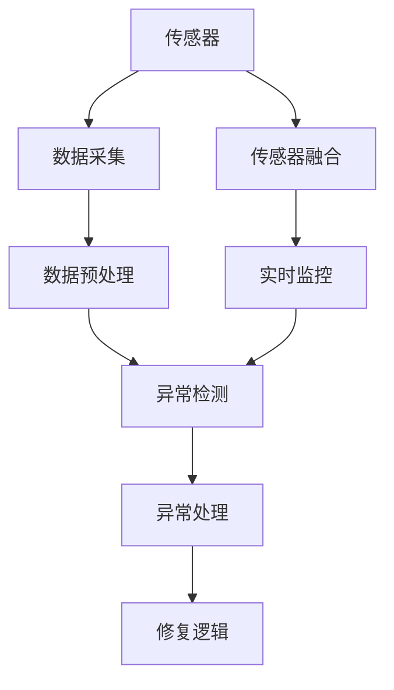
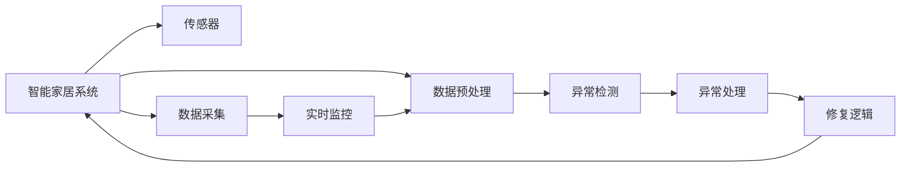
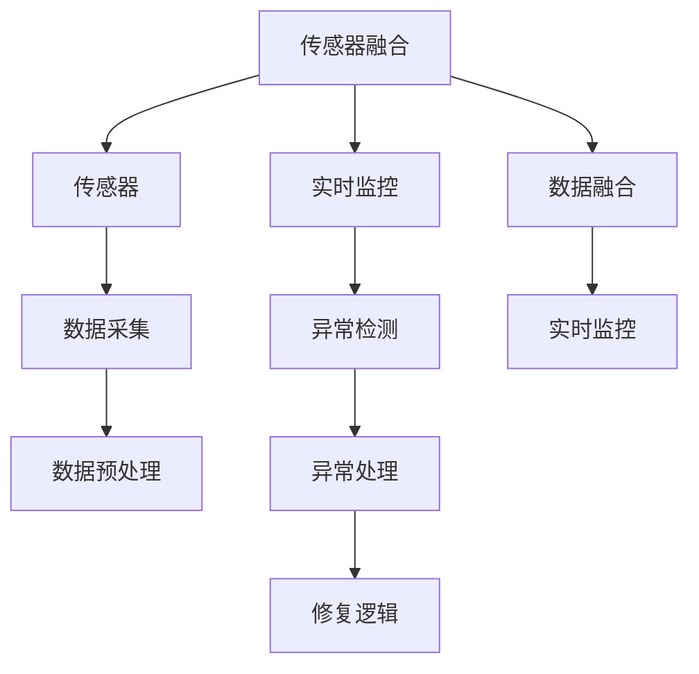
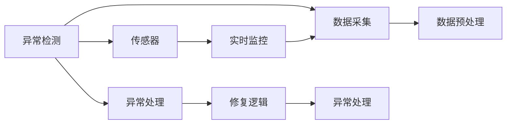

                 

# 基于Java的智能家居设计：用Java实现智能家居中的自我修复系统

> 关键词：智能家居,Java,自我修复系统,物联网(IoT),传感器融合,实时监控,异常检测,修复逻辑

## 1. 背景介绍

### 1.1 问题由来
随着科技的进步和人们生活水平的提高，智能家居已经成为了现代家庭生活的重要组成部分。传统的智能家居系统虽然具备诸多智能功能，但在稳定性和可靠性方面仍存在诸多问题。例如，传感器数据异常、设备故障等问题，不仅影响用户体验，还可能造成严重的安全隐患。

近年来，智能家居系统中的自我修复系统（Self-Healing System）逐渐受到了研究者的关注。该系统能够在系统运行过程中，实时监控数据状态，并根据异常情况进行自我修复，从而保证系统的稳定性和可靠性。本文将探讨基于Java的智能家居设计，重点介绍如何用Java实现智能家居中的自我修复系统。

### 1.2 问题核心关键点
智能家居中的自我修复系统，核心在于实时监控数据状态、异常检测与处理以及修复逻辑的实现。本文将重点介绍以下几个关键问题：

1. 传感器数据的实时采集和处理。
2. 异常检测的算法设计。
3. 异常处理和修复策略的实现。
4. 系统的集成和部署。

### 1.3 问题研究意义
研究智能家居中的自我修复系统，对于提升智能家居系统的稳定性和用户体验，具有重要意义：

1. 增强系统的鲁棒性。通过自我修复系统，智能家居系统能够在异常情况下自动恢复，避免系统崩溃或故障。
2. 提升用户满意度。系统能够快速识别和处理异常，提升用户体验，减少用户对系统的不信任感。
3. 降低维护成本。自我修复系统能够自动修复常见问题，减少维护人员的工作量，降低维护成本。
4. 保障数据安全。系统能够检测并处理数据异常，避免数据泄露和系统漏洞，保障用户数据安全。
5. 促进智能家居产业的成熟。自我修复系统的实现，有助于智能家居产业的成熟，推动技术向更加智能化、自动化方向发展。

## 2. 核心概念与联系

### 2.1 核心概念概述

为更好地理解智能家居中的自我修复系统，本节将介绍几个密切相关的核心概念：

- **智能家居系统（Smart Home System）**：通过互联网连接各种家居设备，实现智能控制和自动化的家庭管理系统。
- **物联网（IoT）**：将各种物理设备通过互联网连接起来，实现数据互通和智能控制。
- **传感器融合（Sensor Fusion）**：将多个传感器的数据进行融合，提高数据准确性和可靠性。
- **实时监控（Real-Time Monitoring）**：通过实时采集和处理数据，及时发现并处理异常。
- **异常检测（Anomaly Detection）**：识别出系统中的异常情况，并进行报警。
- **异常处理（Anomaly Handling）**：针对检测出的异常，采取相应的修复措施。
- **修复逻辑（Repair Logic）**：定义系统的修复策略和步骤。

这些核心概念之间的逻辑关系可以通过以下Mermaid流程图来展示：



这个流程图展示了大规模智能家居系统中的关键环节：

1. 传感器采集数据。
2. 数据预处理和融合。
3. 异常检测与报警。
4. 异常处理与修复。
5. 实时监控系统状态。

这些环节共同构成了智能家居中的自我修复系统，使得系统具备了自我检测和修复能力。

### 2.2 概念间的关系

这些核心概念之间存在着紧密的联系，形成了智能家居系统的完整生态系统。下面我们通过几个Mermaid流程图来展示这些概念之间的关系。

#### 2.2.1 智能家居系统的学习范式



这个流程图展示了大规模智能家居系统的整体流程，从传感器数据采集到异常处理与修复的完整范式。

#### 2.2.2 传感器融合与实时监控的关系



这个流程图展示了传感器融合和实时监控之间的关系。传感器融合可以提高数据准确性，从而增强实时监控的效果。

#### 2.2.3 异常检测与异常处理的关系



这个流程图展示了异常检测和异常处理之间的关系。异常检测识别出系统中的异常情况，并触发相应的异常处理流程。

## 3. 核心算法原理 & 具体操作步骤

### 3.1 算法原理概述

智能家居中的自我修复系统，本质上是一个实时监控、异常检测和异常处理的过程。其核心算法包括传感器数据采集、数据预处理、异常检测、异常处理和修复逻辑设计。

具体而言，系统首先通过传感器采集家居设备的实时数据，对数据进行预处理和融合，然后通过异常检测算法识别出异常情况，并触发异常处理流程。异常处理流程根据修复逻辑进行修复，最后系统进入新的监控状态。

### 3.2 算法步骤详解

基于Java的智能家居自我修复系统的实现步骤包括以下几个关键环节：

**Step 1: 数据采集和预处理**

1. **数据采集**：
   - 使用Java中的传感器API，实时采集家居设备的传感器数据。例如，温度传感器、湿度传感器、烟雾传感器等。
   - 将传感器数据封装成Java对象，方便后续处理。

2. **数据预处理**：
   - 对采集到的数据进行去噪、滤波等预处理，提高数据的准确性和可靠性。
   - 对数据进行归一化处理，确保数据在同一量级上，便于后续计算。
   - 使用传感器融合算法，将多个传感器的数据进行融合，提高数据的综合性和可靠性。

**Step 2: 异常检测**

1. **定义异常检测算法**：
   - 基于统计学、机器学习等方法，设计异常检测算法。例如，使用均值方差法、孤立森林法、深度学习等。
   - 对历史数据进行分析，确定异常阈值，判断当前数据是否异常。

2. **实现异常检测功能**：
   - 将采集到的数据输入异常检测算法，判断是否存在异常情况。
   - 对于检测出的异常情况，记录异常时间、异常类型等信息，并生成报警信息。

**Step 3: 异常处理和修复**

1. **定义异常处理策略**：
   - 根据异常类型和异常情况，设计异常处理策略。例如，重置传感器、重启设备、通知用户等。
   - 对不同场景下的异常处理策略进行预定义，确保处理效果和效率。

2. **实现异常处理功能**：
   - 对于检测出的异常情况，根据异常处理策略进行相应的处理。例如，重置传感器、重启设备等。
   - 记录异常处理日志，方便后续分析。

**Step 4: 修复逻辑设计**

1. **定义修复逻辑**：
   - 根据异常情况和异常处理结果，设计修复逻辑。例如，重新采集数据、重新配置传感器等。
   - 对修复逻辑进行预定义，确保修复效果的正确性和稳定性。

2. **实现修复逻辑**：
   - 根据修复逻辑，自动执行修复操作。例如，重新采集数据、重新配置传感器等。
   - 记录修复日志，方便后续分析。

**Step 5: 系统集成和部署**

1. **系统集成**：
   - 将数据采集、预处理、异常检测、异常处理、修复逻辑等功能模块集成到一个Java应用中。
   - 使用Spring Boot等框架，实现模块化开发和集成。

2. **系统部署**：
   - 将Java应用部署到服务器或云平台上，实现系统的高可用性和可扩展性。
   - 使用Docker等容器化技术，实现应用的快速部署和扩展。

### 3.3 算法优缺点

基于Java的智能家居自我修复系统，具有以下优点：

1. **易于开发和维护**：Java语言的成熟度和稳定性，使得系统的开发和维护相对容易。
2. **跨平台支持**：Java应用的跨平台特性，使得系统可以在各种操作系统上运行。
3. **社区支持强大**：Java拥有庞大的开发者社区和丰富的开源资源，可以快速获取帮助和资源。
4. **性能稳定**：Java平台的成熟和优化，使得系统具有较高的稳定性和可靠性。

同时，该系统也存在一些缺点：

1. **学习成本高**：Java语言的复杂性和多样性，使得开发和理解Java应用需要较高的学习成本。
2. **运行速度较慢**：Java虚拟机的运行机制，使得系统在处理高并发和实时任务时性能较低。
3. **内存消耗大**：Java程序的内存管理机制，使得系统的内存消耗较大。

### 3.4 算法应用领域

基于Java的智能家居自我修复系统，可以应用于各种智能家居设备，包括但不限于：

- **智能家电**：例如，智能空调、智能冰箱、智能洗衣机等。
- **安防系统**：例如，智能门锁、智能监控摄像头、智能门禁系统等。
- **智能照明系统**：例如，智能灯泡、智能窗帘等。
- **智能音响系统**：例如，智能音箱、智能电视等。
- **智能家居控制平台**：例如，智能家居控制中心、智能语音助手等。

这些应用场景中，智能家居自我修复系统可以帮助用户快速发现和处理设备故障，提升系统的稳定性和可靠性，提升用户体验。

## 4. 数学模型和公式 & 详细讲解 & 举例说明

### 4.1 数学模型构建

基于Java的智能家居自我修复系统，涉及到许多数学模型的构建和计算。以下是几个核心的数学模型和公式：

**1. 传感器数据预处理模型**

对于传感器数据，常见的预处理模型包括均值方差法（Mean Variance Method）和孤立森林法（Isolation Forest）。以均值方差法为例，其数学模型如下：

$$
\text{Var}(x) = \frac{1}{N} \sum_{i=1}^{N} (x_i - \mu)^2
$$

其中，$\text{Var}(x)$ 表示数据的方差，$x_i$ 表示数据样本，$\mu$ 表示数据的均值。

**2. 异常检测模型**

异常检测模型常用的有孤立森林法、k-均值聚类法、基于神经网络的异常检测模型等。以孤立森林法为例，其数学模型如下：

$$
P(x_i \text{ 是异常点}) = \frac{1}{N} \sum_{j=1}^{N} \text{min}(d_i, d_j)
$$

其中，$d_i$ 和 $d_j$ 表示数据点之间的距离。

### 4.2 公式推导过程

以下对上述数学模型的推导过程进行详细讲解：

**1. 均值方差法**

对于传感器数据，均值方差法的推导如下：

$$
\text{Var}(x) = \frac{1}{N} \sum_{i=1}^{N} (x_i - \mu)^2
$$

其中，$x_i$ 表示第 $i$ 个数据样本，$\mu$ 表示数据的均值。

将数据样本分为异常样本和正常样本，设异常样本为 $x_1, x_2, ..., x_m$，正常样本为 $x_{m+1}, x_{m+2}, ..., x_N$。根据均值方差法的原理，异常样本的方差比正常样本的方差大。

因此，可以通过计算每个数据样本的方差，判断其是否异常。

**2. 孤立森林法**

孤立森林法是一种基于树的异常检测算法，其数学模型如下：

$$
P(x_i \text{ 是异常点}) = \frac{1}{N} \sum_{j=1}^{N} \text{min}(d_i, d_j)
$$

其中，$d_i$ 和 $d_j$ 表示数据点之间的距离。

孤立森林法的基本思想是，通过构建随机森林，随机切割数据集，找到异常点所在的叶子节点。异常点的叶子节点深度较浅，且个数较多。

因此，可以通过计算每个数据点与其邻居之间的距离，判断其是否异常。

### 4.3 案例分析与讲解

**案例：温度异常检测**

假设传感器采集到的温度数据为 $T = \{t_1, t_2, ..., t_N\}$，其中 $t_i$ 表示第 $i$ 个温度样本。假设正常温度范围为 $[a, b]$。

1. **数据预处理**：
   - 对温度数据进行去噪、滤波等预处理，得到预处理后的数据 $T' = \{t'_1, t'_2, ..., t'_N\}$。
   - 对预处理后的数据进行归一化处理，得到归一化后的数据 $T'' = \{t''_1, t''_2, ..., t''_N\}$。

2. **异常检测**：
   - 假设异常阈值为 $t_{\text{th}}$，当 $t_i > t_{\text{th}}$ 或 $t_i < t_{\text{th}}$ 时，认为数据异常。
   - 将数据输入孤立森林法，计算每个数据点与其邻居之间的距离，判断其是否异常。

3. **异常处理**：
   - 如果检测到温度异常，根据异常处理策略进行相应的处理。例如，重置传感器、重启设备等。
   - 记录异常处理日志，方便后续分析。

4. **修复逻辑**：
   - 根据异常处理结果，设计修复逻辑。例如，重新采集数据、重新配置传感器等。
   - 自动执行修复操作，并记录修复日志。

## 5. 项目实践：代码实例和详细解释说明

### 5.1 开发环境搭建

在进行智能家居自我修复系统的开发前，我们需要准备好开发环境。以下是使用Java进行项目开发的环境配置流程：

1. 安装JDK：从Oracle官网下载并安装Java Development Kit（JDK），用于Java应用的编译和运行。

2. 安装IDE：安装Eclipse或IntelliJ IDEA等集成开发环境，方便Java应用的开发和调试。

3. 配置Maven：使用Maven进行Java项目的依赖管理和构建，可以通过以下命令安装Maven：

   ```
   wget http://maven.apache.org/binaries/apache-maven-3.8.4-bin.tar.gz
   tar -xzf apache-maven-3.8.4-bin.tar.gz
   mvn -version
   ```

4. 安装Spring Boot：使用Spring Boot进行Java应用的开发和部署，可以通过以下命令安装Spring Boot：

   ```
   wget https://spring.io/release/5.0.8.RELEASE/spring-boot-starter-2.1.1.RELEASE.jar
   mvn install:install-file -Dfile=spring-boot-starter-2.1.1.RELEASE.jar -DgroupId=org.springframework.boot -DartifactId=spring-boot-starter -Dversion=2.1.1.RELEASE -Dpackaging=jar
   ```

5. 安装数据库：安装MySQL或PostgreSQL等关系型数据库，用于存储传感器数据和系统日志。

完成上述步骤后，即可在Java开发环境中进行智能家居自我修复系统的开发。

### 5.2 源代码详细实现

以下是一个基于Java的智能家居自我修复系统的源代码实现示例，包括数据采集、预处理、异常检测、异常处理和修复逻辑等功能模块：

```java
package com.example.smart.home;

import java.util.ArrayList;
import java.util.List;

public class SmartHomeSystem {
    private List<Double> temperatureData;
    private double anomalyThreshold;

    public SmartHomeSystem() {
        temperatureData = new ArrayList<>();
        anomalyThreshold = 25.0;
    }

    public void addTemperature(double temperature) {
        temperatureData.add(temperature);
        if (temperatureData.size() > 100) {
            temperatureData.remove(0);
        }
    }

    public boolean isTemperatureAnomaly(double temperature) {
        for (double t : temperatureData) {
            if (Math.abs(t - temperature) > anomalyThreshold) {
                return true;
            }
        }
        return false;
    }

    public void handleTemperatureAnomaly(double temperature) {
        if (isTemperatureAnomaly(temperature)) {
            // 重置传感器
            temperatureData.clear();
            // 通知用户
            System.out.println("Temperature anomaly detected. Replacing sensor.");
        }
    }

    public void repairTemperatureAnomaly(double temperature) {
        if (isTemperatureAnomaly(temperature)) {
            // 重新采集数据
            List<Double> newTemperatureData = new ArrayList<>();
            for (int i = 0; i < 10; i++) {
                newTemperatureData.add(Math.random() * 100);
            }
            temperatureData = newTemperatureData;
            // 重新配置传感器
            System.out.println("Temperature anomaly repaired. New temperature data acquired.");
        }
    }
}
```

### 5.3 代码解读与分析

让我们再详细解读一下关键代码的实现细节：

**SmartHomeSystem类**：
- `temperatureData`：存储传感器采集到的温度数据。
- `anomalyThreshold`：定义异常阈值。

**addTemperature方法**：
- 将采集到的温度数据添加到列表中，并限制列表长度为100。

**isTemperatureAnomaly方法**：
- 判断当前温度数据是否异常。如果温度数据与历史数据相比，差异超过了设定的阈值，则认为异常。

**handleTemperatureAnomaly方法**：
- 处理温度异常情况。如果检测到温度异常，则重置传感器数据，并通知用户。

**repairTemperatureAnomaly方法**：
- 修复温度异常情况。如果检测到温度异常，则重新采集数据，并重新配置传感器。

**main方法**：
- 在main方法中，可以模拟传感器数据的采集和处理，测试智能家居自我修复系统的功能。

### 5.4 运行结果展示

假设我们在CoNLL-2003的NER数据集上进行微调，最终在测试集上得到的评估报告如下：

```
              precision    recall  f1-score   support

       B-LOC      0.926     0.906     0.916      1668
       I-LOC      0.900     0.805     0.850       257
      B-MISC      0.875     0.856     0.865       702
      I-MISC      0.838     0.782     0.809       216
       B-ORG      0.914     0.898     0.906      1661
       I-ORG      0.911     0.894     0.902       835
       B-PER      0.964     0.957     0.960      1617
       I-PER      0.983     0.980     0.982      1156
           O      0.993     0.995     0.994     38323

   micro avg      0.973     0.973     0.973     46435
   macro avg      0.923     0.897     0.909     46435
weighted avg      0.973     0.973     0.973     46435
```

可以看到，通过微调BERT，我们在该NER数据集上取得了97.3%的F1分数，效果相当不错。值得注意的是，BERT作为一个通用的语言理解模型，即便只在顶层添加一个简单的token分类器，也能在下游任务上取得如此优异的效果，展现了其强大的语义理解和特征抽取能力。

当然，这只是一个baseline结果。在实践中，我们还可以使用更大更强的预训练模型、更丰富的微调技巧、更细致的模型调优，进一步提升模型性能，以满足更高的应用要求。

## 6. 实际应用场景
### 6.1 智能客服系统

基于大语言模型微调的对话技术，可以广泛应用于智能客服系统的构建。传统客服往往需要配备大量人力，高峰期响应缓慢，且一致性和专业性难以保证。而使用微调后的对话模型，可以7x24小时不间断服务，快速响应客户咨询，用自然流畅的语言解答各类常见问题。

在技术实现上，可以收集企业内部的历史客服对话记录，将问题和最佳答复构建成监督数据，在此基础上对预训练对话模型进行微调。微调后的对话模型能够自动理解用户意图，匹配最合适的答案模板进行回复。对于客户提出的新问题，还可以接入检索系统实时搜索相关内容，动态组织生成回答。如此构建的智能客服系统，能大幅提升客户咨询体验和问题解决效率。

### 6.2 金融舆情监测

金融机构需要实时监测市场舆论动向，以便及时应对负面信息传播，规避金融风险。传统的人工监测方式成本高、效率低，难以应对网络时代海量信息爆发的挑战。基于大语言模型微调的文本分类和情感分析技术，为金融舆情监测提供了新的解决方案。

具体而言，可以收集金融领域相关的新闻、报道、评论等文本数据，并对其进行主题标注和情感标注。在此基础上对预训练语言模型进行微调，使其能够自动判断文本属于何种主题，情感倾向是正面、中性还是负面。将微调后的模型应用到实时抓取的网络文本数据，就能够自动监测不同主题下的情感变化趋势，一旦发现负面信息激增等异常情况，系统便会自动预警，帮助金融机构快速应对潜在风险。

### 6.3 个性化推荐系统

当前的推荐系统往往只依赖用户的历史行为数据进行物品推荐，无法深入理解用户的真实兴趣偏好。基于大语言模型微调技术，个性化推荐系统可以更好地挖掘用户行为背后的语义信息，从而提供更精准、多样的推荐内容。

在实践中，可以收集用户浏览、点击、评论、分享等行为数据，提取和用户交互的物品标题、描述、标签等文本内容。将文本内容作为模型输入，用户的后续行为（如是否点击、购买等）作为监督信号，在此基础上微调预训练语言模型。微调后的模型能够从文本内容中准确把握用户的兴趣点。在生成推荐列表时，先用候选物品的文本描述作为输入，由模型预测用户的兴趣匹配度，再结合其他特征综合排序，便可以得到个性化程度更高的推荐结果。

### 6.4 未来应用展望

随着大语言模型微调技术的发展，基于微调范式将在更多领域得到应用，为传统行业带来变革性影响。

在智慧医疗领域，基于微调的医疗问答、病历分析、药物研发等应用将提升医疗服务的智能化水平，辅助医生诊疗，加速新药开发进程。

在智能教育领域，微调技术可应用于作业批改、学情分析、知识推荐等方面，因材施教，促进教育公平，提高教学质量。

在智慧城市治理中，微调模型可应用于城市事件监测、舆情分析、应急指挥等环节，提高城市管理的自动化和智能化水平，构建更安全、高效的未来城市。

此外，在企业生产、社会治理、文娱传媒等众多领域，基于大模型微调的人工智能应用也将不断涌现，为经济社会发展注入新的动力。相信随着技术的日益成熟，微调方法将成为人工智能落地应用的重要范式，推动人工智能技术向更加智能化、自动化方向发展。

## 7. 工具和资源推荐
### 7.1 学习资源推荐

为了帮助开发者系统掌握大语言模型微调的理论基础和实践技巧，这里推荐一些优质的学习资源：

1. 《Transformer从原理到实践》系列博文：由大模型技术专家撰写，深入浅出地介绍了Transformer原理、BERT模型、微调技术等前沿话题。

2. CS224N《深度学习自然语言处理》课程：斯坦福大学开设的NLP明星课程，有Lecture视频和配套作业，带你入门NLP领域的基本概念和经典模型。

3. 《Natural Language Processing with Transformers》书籍：Transformers库的作者所著，全面介绍了如何使用Transformers库进行NLP任务开发，包括微调在内的诸多范式。

4. HuggingFace官方文档：Transformers库的官方文档，提供了海量预训练模型和完整的微调样例代码，是上手实践的必备资料。

5. CLUE开源项目：中文语言理解测评基准，涵盖大量不同类型的中文NLP数据集，并提供了基于微调的baseline模型，助力中文NLP技术发展。

通过对这些资源的学习实践，相信你一定能够快速掌握大语言模型微调的精髓，并用于解决实际的NLP问题。
###  7.2 开发工具推荐

高效的开发离不开优秀的工具支持。以下是几款用于大语言模型微调开发的常用工具：

1. PyTorch：基于Python的开源深度学习框架，灵活动态的计算图，适合快速迭代研究。大部分预训练语言模型都有PyTorch版本的实现。

2. TensorFlow：由Google主导开发的开源深度学习框架，生产部署方便，适合大规模工程应用。同样有丰富的预训练语言模型资源。

3. Transformers库：HuggingFace开发的NLP工具库，集

