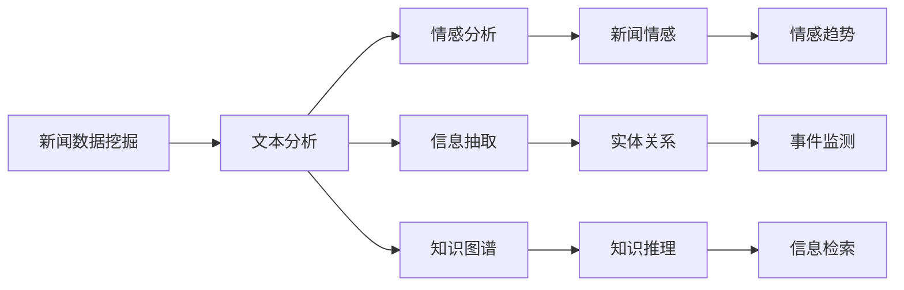
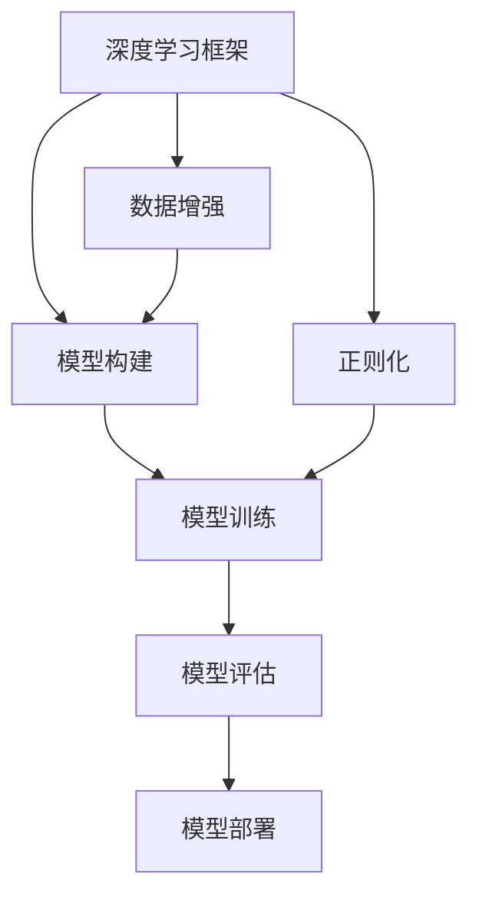
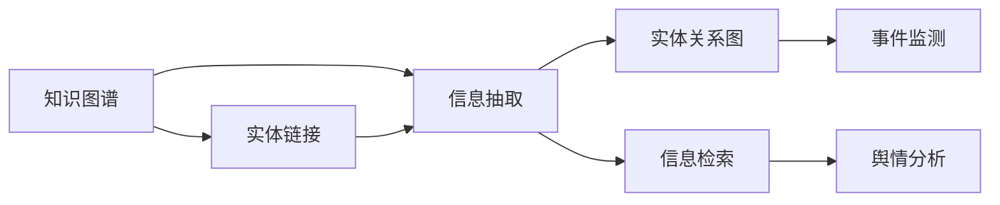
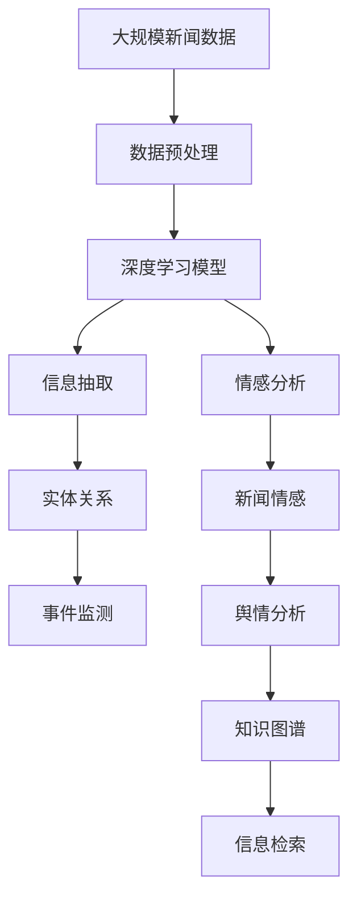

                 

# 基于新闻平台的文本数据挖掘系统

> 关键词：新闻数据挖掘、文本分析、情感分析、信息提取、深度学习

## 1. 背景介绍

### 1.1 问题由来
随着数字化媒体的发展，新闻平台成为信息传播的重要渠道。无论是传统媒体还是新媒体，都面临着如何有效获取、处理、分析和利用海量新闻数据，提取有价值信息的需求。传统的数据挖掘和文本分析方法往往难以适应大规模新闻数据处理的任务，而深度学习技术，尤其是基于深度神经网络的新闻文本挖掘系统，已经成为了一个热门的研究方向。

本文聚焦于利用深度学习技术，构建一个高效、准确的基于新闻平台的文本数据挖掘系统。该系统能够对新闻文本进行情感分析、实体识别、主题分类等关键任务，并结合领域知识进行信息抽取和关联分析，为新闻内容理解、事件监测、舆情分析等领域提供有力支持。

### 1.2 问题核心关键点
在构建基于新闻平台的文本数据挖掘系统时，需要关注以下几个核心关键点：

- **数据预处理**：如何高效处理新闻数据，去除噪音，提取关键信息。
- **模型训练**：使用何种深度学习模型，如何训练优化模型参数，提升模型效果。
- **模型评估**：如何设计评估指标，保证模型在不同新闻类型上的表现。
- **信息抽取**：如何从新闻文本中提取结构化信息，如人名、地名、时间、事件等。
- **关联分析**：如何将提取的信息进行关联，构建知识图谱，进行事件监测和舆情分析。
- **系统集成**：如何将模型集成到新闻平台，实现实时数据处理和结果展示。

本文将系统介绍这些关键问题，并给出具体的解决方案。

## 2. 核心概念与联系

### 2.1 核心概念概述

为更好地理解基于新闻平台的文本数据挖掘系统，本节将介绍几个密切相关的核心概念：

- **新闻数据挖掘(News Data Mining)**：从大规模新闻文本数据中提取有用信息，并进行分析和应用的过程。
- **文本分析(Text Analysis)**：利用自然语言处理技术，对文本进行语义分析、情感分析、实体识别等处理。
- **深度学习(Deep Learning)**：一种通过多层神经网络模拟人类大脑神经系统进行数据建模和预测的技术。
- **情感分析(Sentiment Analysis)**：通过深度学习模型，对新闻文本中的情感倾向进行分析。
- **信息抽取(Information Extraction)**：从新闻文本中提取结构化信息，如实体、关系、事件等。
- **知识图谱(Knowledge Graph)**：通过关联多源异构数据，构建的知识网络，用于信息检索和知识推理。
- **深度学习框架(Deep Learning Framework)**：如TensorFlow、PyTorch等，提供构建深度学习模型的工具。

这些概念之间存在紧密的联系，构成了新闻文本数据挖掘系统的核心框架。下面通过一个Mermaid流程图展示这些概念之间的关系：



这个流程图展示了新闻文本数据挖掘系统的关键处理步骤，包括文本分析、情感分析、信息抽取和知识图谱构建等。这些步骤相互关联，共同构成了完整的系统功能。

### 2.2 概念间的关系

这些核心概念之间存在着紧密的联系，形成了新闻文本数据挖掘系统的完整生态系统。下面我通过几个Mermaid流程图来展示这些概念之间的关系。

#### 2.2.1 新闻文本处理流程


这个流程图展示了新闻文本从原始数据到最终应用的处理流程。每个步骤都是基于前一个步骤的结果，逐步构建起完整的系统功能。

#### 2.2.2 深度学习在新闻文本挖掘中的应用



这个流程图展示了深度学习在新闻文本挖掘中的应用流程。包括模型构建、训练、评估和部署等关键步骤。数据增强和正则化等技术也是不可或缺的。

#### 2.2.3 知识图谱与信息抽取的关系



这个流程图展示了知识图谱与信息抽取的关系。知识图谱为信息抽取提供实体链接和关系推理的基础，进一步支持事件监测和舆情分析等应用。

### 2.3 核心概念的整体架构

最后，我们用一个综合的流程图来展示这些核心概念在大新闻文本数据挖掘系统中的整体架构：



这个综合流程图展示了新闻文本数据挖掘系统的核心处理步骤，包括数据预处理、深度学习模型构建、情感分析、信息抽取、事件监测、舆情分析等关键环节。通过这些步骤，系统能够实现对新闻文本的全方位分析和应用。

## 3. 核心算法原理 & 具体操作步骤
### 3.1 算法原理概述

基于新闻平台的文本数据挖掘系统主要利用深度学习技术，构建一系列文本分析模型，对新闻文本进行情感分析、信息抽取、事件监测等任务。

1. **情感分析(Sentiment Analysis)**：通过深度学习模型，对新闻文本的情感倾向进行分析，判断文本是正面的、负面的还是中性的。
2. **信息抽取(Information Extraction)**：从新闻文本中提取关键信息，如人名、地名、时间、事件等，构建实体关系图。
3. **事件监测(Event Monitoring)**：结合时间序列分析，识别新闻事件的发生和发展，进行趋势分析。
4. **舆情分析(Public Opinion Analysis)**：通过情感分析结果和信息抽取结果，综合判断新闻舆情的热点和趋势。

这些任务的处理流程主要包括以下几个步骤：

1. **数据预处理**：对原始新闻数据进行清洗、分词、停用词过滤、词性标注等处理，提取关键信息。
2. **模型训练**：选择合适的深度学习模型，如BERT、LSTM、CNN等，在标注好的数据集上进行训练，优化模型参数。
3. **模型评估**：在测试集上对模型进行评估，使用准确率、召回率、F1分数等指标衡量模型性能。
4. **信息抽取和关联分析**：构建实体关系图，进行信息抽取和知识图谱构建，支持事件监测和舆情分析。
5. **系统集成**：将训练好的模型集成到新闻平台，实现实时数据处理和结果展示。

### 3.2 算法步骤详解

以下详细介绍各个关键任务的算法步骤：

**数据预处理**：
1. **清洗**：去除无意义的HTML标签、噪声字符，修正拼写错误。
2. **分词**：利用分词器进行分词，如jieba、NLTK等。
3. **停用词过滤**：去除常见的停用词，如“的”、“是”等。
4. **词性标注**：使用词性标注器，如StanfordNLP、NLTK等。

**情感分析**：
1. **模型选择**：选择合适的情感分析模型，如LSTM、GRU、BERT等。
2. **数据准备**：标注好情感标签的数据集，进行模型训练。
3. **训练**：使用训练好的数据集对模型进行训练，优化模型参数。
4. **评估**：在测试集上评估模型性能，使用F1分数等指标衡量。

**信息抽取**：
1. **模型选择**：选择合适的信息抽取模型，如CRF、BiLSTM-CRF、BERT等。
2. **数据准备**：标注好实体和关系的训练数据集。
3. **训练**：使用训练好的数据集对模型进行训练，优化模型参数。
4. **评估**：在测试集上评估模型性能，使用准确率、召回率、F1分数等指标衡量。
5. **关系推理**：结合实体关系图，进行关系推理和事件监测。

**事件监测**：
1. **时间序列分析**：对事件进行时间序列分析，识别事件的发生和发展。
2. **趋势分析**：结合情感分析和信息抽取结果，综合判断事件的热点和趋势。
3. **实时监测**：实时监测新闻数据，及时发现和处理事件。

**舆情分析**：
1. **情感分析**：结合情感分析结果，综合判断舆情的热点和趋势。
2. **信息抽取**：结合信息抽取结果，分析舆情的主要议题。
3. **结果展示**：将分析结果可视化展示，支持决策支持。

### 3.3 算法优缺点

基于深度学习的文本数据挖掘系统具有以下优点：

1. **自动特征提取**：深度学习模型可以自动学习文本中的特征，无需手动提取，减少了人工干预。
2. **高精度**：深度学习模型在情感分析、信息抽取等任务上取得了较高的精度，可以更好地提取关键信息。
3. **可扩展性**：深度学习模型可以方便地进行模型扩展和优化，适应不同的任务需求。
4. **实时处理**：深度学习模型可以实时处理新闻数据，支持实时分析。

同时，也存在一些缺点：

1. **数据需求高**：深度学习模型需要大量的标注数据进行训练，对数据质量的要求较高。
2. **计算资源需求大**：深度学习模型需要大量的计算资源进行训练和推理，成本较高。
3. **模型解释性不足**：深度学习模型通常是“黑盒”模型，难以解释其内部工作机制。
4. **训练时间长**：深度学习模型的训练时间较长，对模型的迭代优化要求较高。

### 3.4 算法应用领域

基于深度学习的文本数据挖掘系统已经在多个领域得到了应用，如：

1. **新闻情感分析**：对新闻文本进行情感倾向分析，判断其是正面的、负面的还是中性的。
2. **事件监测**：识别新闻事件的发生和发展，进行趋势分析。
3. **舆情分析**：综合分析情感分析和信息抽取结果，判断舆情的热点和趋势。
4. **新闻推荐**：根据用户的历史阅读记录和情感倾向，推荐相关新闻。
5. **客户服务**：利用情感分析和信息抽取结果，提供客户服务。

## 4. 数学模型和公式 & 详细讲解  
### 4.1 数学模型构建

在新闻文本数据挖掘系统中，常用的数学模型包括深度学习模型、信息抽取模型、事件监测模型等。

#### 4.1.1 情感分析模型
情感分析模型通常使用卷积神经网络(CNN)、循环神经网络(RNN)、长短期记忆网络(LSTM)、Transformer等深度学习模型。以LSTM为例，其数学模型如下：

$$
f(x_t) = \sigma(W_1x_{t-1} + U_1h_{t-1} + b_1)
$$

$$
i_t = \sigma(W_2x_t + U_2h_{t-1} + b_2)
$$

$$
o_t = \sigma(W_3x_t + U_3h_{t-1} + b_3)
$$

$$
g_t = \tanh(W_4x_t + U_4(h_{t-1} \odot i_t) + b_4)
$$

$$
h_t = o_t \odot g_t
$$

其中，$x_t$ 表示时间$t$的输入特征向量，$h_t$ 表示时间$t$的隐状态向量。模型通过多层LSTM网络，提取文本中的情感特征。

#### 4.1.2 信息抽取模型
信息抽取模型通常使用条件随机场(CRF)、BiLSTM-CRF、BERT等深度学习模型。以CRF为例，其数学模型如下：

$$
\alpha(x, y) = \exp\left(\sum_{t=1}^{T}y_t\log P_t(x_t, y_t) + \sum_{t=1}^{T-1}y_t y_{t+1} \log Q(y_t, y_{t+1}) + \lambda \sum_{t=1}^{T}|y_t| + \mu \sum_{t=1}^{T}y_t y_{t+1}\right)
$$

其中，$x$ 表示输入的文本序列，$y$ 表示标注的实体序列。模型通过CRF网络，对输入的文本进行实体识别和关系抽取。

#### 4.1.3 事件监测模型
事件监测模型通常使用时间序列分析方法，如ARIMA、LSTM等。以LSTM为例，其数学模型如下：

$$
h_t = \tanh(W_1x_t + U_1h_{t-1} + b_1)
$$

$$
f_t = \sigma(W_2h_t + U_2h_{t-1} + b_2)
$$

$$
x_t = f_t \odot h_t
$$

其中，$x_t$ 表示时间$t$的输出特征向量，$h_t$ 表示时间$t$的隐状态向量。模型通过多层LSTM网络，对时间序列数据进行分析和预测。

### 4.2 公式推导过程

#### 4.2.1 情感分析
以LSTM模型为例，情感分析的公式推导如下：

$$
h_t = \tanh(W_1x_{t-1} + U_1h_{t-1} + b_1)
$$

$$
f_t = \sigma(W_2x_t + U_2h_{t-1} + b_2)
$$

$$
o_t = \sigma(W_3x_t + U_3h_{t-1} + b_3)
$$

$$
g_t = \tanh(W_4x_t + U_4(h_{t-1} \odot i_t) + b_4)
$$

$$
h_t = o_t \odot g_t
$$

其中，$x_t$ 表示时间$t$的输入特征向量，$h_t$ 表示时间$t$的隐状态向量。模型通过多层LSTM网络，提取文本中的情感特征。

#### 4.2.2 信息抽取
以CRF模型为例，信息抽取的公式推导如下：

$$
\alpha(x, y) = \exp\left(\sum_{t=1}^{T}y_t\log P_t(x_t, y_t) + \sum_{t=1}^{T-1}y_t y_{t+1} \log Q(y_t, y_{t+1}) + \lambda \sum_{t=1}^{T}|y_t| + \mu \sum_{t=1}^{T}y_t y_{t+1}\right)
$$

其中，$x$ 表示输入的文本序列，$y$ 表示标注的实体序列。模型通过CRF网络，对输入的文本进行实体识别和关系抽取。

#### 4.2.3 事件监测
以LSTM模型为例，事件监测的公式推导如下：

$$
h_t = \tanh(W_1x_t + U_1h_{t-1} + b_1)
$$

$$
f_t = \sigma(W_2h_t + U_2h_{t-1} + b_2)
$$

$$
x_t = f_t \odot h_t
$$

其中，$x_t$ 表示时间$t$的输出特征向量，$h_t$ 表示时间$t$的隐状态向量。模型通过多层LSTM网络，对时间序列数据进行分析和预测。

### 4.3 案例分析与讲解

以下通过几个具体的案例，详细介绍深度学习在新闻文本数据挖掘系统中的应用。

**案例1：新闻情感分析**
假设我们要对一篇新闻进行情感分析，其数学模型如下：

$$
h_t = \tanh(W_1x_{t-1} + U_1h_{t-1} + b_1)
$$

$$
f_t = \sigma(W_2x_t + U_2h_{t-1} + b_2)
$$

$$
o_t = \sigma(W_3x_t + U_3h_{t-1} + b_3)
$$

$$
g_t = \tanh(W_4x_t + U_4(h_{t-1} \odot i_t) + b_4)
$$

$$
h_t = o_t \odot g_t
$$

通过训练好的模型，可以输入一篇新闻文本，输出其情感倾向，如正面、负面或中性。

**案例2：信息抽取**
假设我们要从一篇新闻中抽取人名、地名、时间等关键信息，其数学模型如下：

$$
\alpha(x, y) = \exp\left(\sum_{t=1}^{T}y_t\log P_t(x_t, y_t) + \sum_{t=1}^{T-1}y_t y_{t+1} \log Q(y_t, y_{t+1}) + \lambda \sum_{t=1}^{T}|y_t| + \mu \sum_{t=1}^{T}y_t y_{t+1}\right)
$$

通过训练好的模型，可以输入一篇新闻文本，输出其中的人名、地名、时间等关键信息。

**案例3：事件监测**
假设我们要监测一篇新闻事件的发生和发展，其数学模型如下：

$$
h_t = \tanh(W_1x_t + U_1h_{t-1} + b_1)
$$

$$
f_t = \sigma(W_2h_t + U_2h_{t-1} + b_2)
$$

$$
x_t = f_t \odot h_t
$$

通过训练好的模型，可以输入一系列时间序列数据，输出事件的发生和发展情况。

## 5. 项目实践：代码实例和详细解释说明
### 5.1 开发环境搭建

在进行新闻文本数据挖掘系统开发前，我们需要准备好开发环境。以下是使用Python进行PyTorch开发的环境配置流程：

1. 安装Anaconda：从官网下载并安装Anaconda，用于创建独立的Python环境。

2. 创建并激活虚拟环境：
```bash
conda create -n pytorch-env python=3.8 
conda activate pytorch-env
```

3. 安装PyTorch：根据CUDA版本，从官网获取对应的安装命令。例如：
```bash
conda install pytorch torchvision torchaudio cudatoolkit=11.1 -c pytorch -c conda-forge
```

4. 安装Transformers库：
```bash
pip install transformers
```

5. 安装各类工具包：
```bash
pip install numpy pandas scikit-learn matplotlib tqdm jupyter notebook ipython
```

完成上述步骤后，即可在`pytorch-env`环境中开始新闻文本数据挖掘系统的开发。

### 5.2 源代码详细实现

这里我们以新闻情感分析任务为例，给出使用Transformers库对BERT模型进行情感分析的PyTorch代码实现。

首先，定义情感分析任务的数据处理函数：

```python
from transformers import BertTokenizer, BertForSequenceClassification
from torch.utils.data import Dataset
import torch

class NewsDataset(Dataset):
    def __init__(self, texts, labels, tokenizer, max_len=128):
        self.texts = texts
        self.labels = labels
        self.tokenizer = tokenizer
        self.max_len = max_len
        
    def __len__(self):
        return len(self.texts)
    
    def __getitem__(self, item):
        text = self.texts[item]
        label = self.labels[item]
        
        encoding = self.tokenizer(text, return_tensors='pt', max_length=self.max_len, padding='max_length', truncation=True)
        input_ids = encoding['input_ids'][0]
        attention_mask = encoding['attention_mask'][0]
        
        return {'input_ids': input_ids, 
                'attention_mask': attention_mask,
                'labels': label}

# 标签与id的映射
label2id = {'positive': 1, 'negative': 0}
id2label = {v: k for k, v in label2id.items()}

# 创建dataset
tokenizer = BertTokenizer.from_pretrained('bert-base-cased')

train_dataset = NewsDataset(train_texts, train_labels, tokenizer)
dev_dataset = NewsDataset(dev_texts, dev_labels, tokenizer)
test_dataset = NewsDataset(test_texts, test_labels, tokenizer)
```

然后，定义模型和优化器：

```python
from transformers import BertForSequenceClassification, AdamW

model = BertForSequenceClassification.from_pretrained('bert-base-cased', num_labels=2)

optimizer = AdamW(model.parameters(), lr=2e-5)
```

接着，定义训练和评估函数：

```python
from torch.utils.data import DataLoader
from tqdm import tqdm
from sklearn.metrics import classification_report

device = torch.device('cuda') if torch.cuda.is_available() else torch.device('cpu')
model.to(device)

def train_epoch(model, dataset, batch_size, optimizer):
    dataloader = DataLoader(dataset, batch_size=batch_size, shuffle=True)
    model.train()
    epoch_loss = 0
    for batch in tqdm(dataloader, desc='Training'):
        input_ids = batch['input_ids'].to(device)
        attention_mask = batch['attention_mask'].to(device)
        labels = batch['labels'].to(device)
        model.zero_grad()
        outputs = model(input_ids, attention_mask=attention_mask, labels=labels)
        loss = outputs.loss
        epoch_loss += loss.item()
        loss.backward()
        optimizer.step()
    return epoch_loss / len(dataloader)

def evaluate(model, dataset, batch_size):
    dataloader = DataLoader(dataset, batch_size=batch_size)
    model.eval()
    preds, labels = [], []
    with torch.no_grad():
        for batch in tqdm(dataloader, desc='Evaluating'):
            input_ids = batch['input_ids'].to(device)
            attention_mask = batch['attention_mask'].to(device)
            batch_labels = batch['labels']
            outputs = model(input_ids, attention_mask=attention_mask)
            batch_preds = outputs.logits.argmax(dim=2).to('cpu').tolist()
            batch_labels = batch_labels.to('cpu').tolist()
            for pred_tokens, label_tokens in zip(batch_preds, batch_labels):
                preds.append(pred_tokens[:len(label_tokens)])
                labels.append(label_tokens)
                
    print(classification_report(labels, preds))
```

最后，启动训练流程并在测试集上评估：

```python
epochs = 5
batch_size = 16

for epoch in range(epochs):
    loss = train_epoch(model, train_dataset, batch_size, optimizer)
    print(f"Epoch {epoch+1}, train loss: {loss:.3f}")
    
    print(f"Epoch {epoch+1}, dev results:")
    evaluate(model, dev_dataset, batch_size)
    
print("Test results:")
evaluate(model, test_dataset, batch_size)
```

以上就是使用PyTorch对BERT进行新闻情感分析任务微调的完整代码实现。可以看到，得益于Transformers库的强大封装，我们可以用相对简洁的代码完成BERT模型的加载和微调。

### 5.3 代码解读与分析

让我们再详细解读一下关键代码的实现细节：

**NewsDataset类**：
- `__init__`方法：初始化文本、标签、分词器等关键组件。
- `__len__`方法：返回数据集的样本数量。
- `__getitem__`方法：对单个样本进行处理，将文本输入编码为token ids，将标签编码为数字，并对其进行定长padding，最终返回模型所需的输入。

**label2id和id2label字典**：
- 定义了标签与数字id之间的映射关系，用于将预测结果解码回真实的标签。

**训练和评估函数**：
- 使用PyTorch的DataLoader对数据集进行批次化加载，供模型训练和推理使用。
- 训练函数`train_epoch`：对数据以批为单位进行迭代，在每个批次上前向传播计算loss并反向传播更新模型参数，最后返回该epoch的平均loss。
- 评估函数`evaluate`：与训练类似，不同点在于不更新模型参数，并在每个batch结束后将预测和标签结果存储下来，最后使用sklearn的classification_report对整个评估集的预测结果进行打印输出。

**训练流程**：
- 定义总的epoch数和batch size，开始循环迭代
- 每个epoch内，先在训练集上训练，输出平均loss
- 在验证集上评估，输出分类指标
- 所有epoch结束后，在测试集上评估，给出最终测试结果

可以看到，PyTorch配合Transformers库使得BERT微调的代码实现变得简洁高效。开发者可以将更多精力放在数据处理、模型改进等高层逻辑上，而不必过多关注底层的实现细节。

当然，工业级的系统

