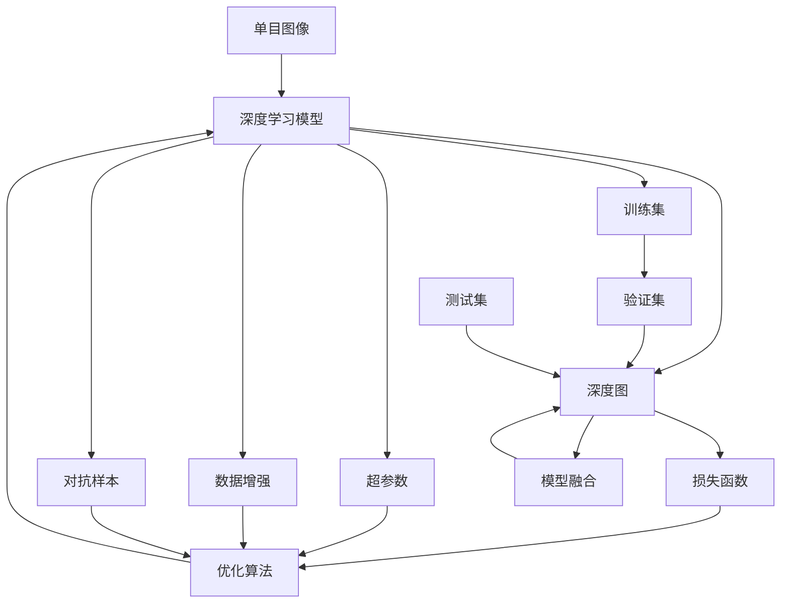

                 

# 基于深度学习的单目图像深度估计

单目图像深度估计是从一张普通二维图像中推导出三维深度信息的技术。在自动驾驶、虚拟现实、工业视觉等领域中，单目深度估计显得尤为重要。随着深度学习的发展，基于深度学习的单目图像深度估计逐渐成为主流方法。本文将从理论到实践，全面系统地介绍基于深度学习的单目图像深度估计技术。

## 1. 背景介绍

### 1.1 问题由来
在计算机视觉和计算机图形学领域，获取三维深度信息通常需要借助深度传感器，如LIDAR、RGB-D摄像头等。然而，这些传感器的成本较高，体积较大，难以广泛部署。相比之下，通过深度学习从单目图像中推断深度信息，则具有成本低、体积小、实时性好等优势。因此，基于深度学习的单目图像深度估计技术受到了广泛关注。

### 1.2 问题核心关键点
基于深度学习的单目图像深度估计技术，主要包括以下几个核心关键点：

1. **输入**：单目彩色图像。
2. **输出**：深度图，即图像中每个像素点对应的深度值。
3. **模型**：深度学习模型，如卷积神经网络(CNN)、循环神经网络(RNN)等。
4. **目标函数**：用于衡量模型输出与真实深度值的差异。
5. **损失函数**：用于优化模型参数，最小化目标函数。

这些关键点共同构成了基于深度学习的单目图像深度估计的基本框架。通过训练深度学习模型，可以从单目图像中准确推断出深度信息，为三维重建、场景理解、自动驾驶等应用提供重要支撑。

### 1.3 问题研究意义
基于深度学习的单目图像深度估计技术，对于推动计算机视觉和计算机图形学的发展具有重要意义：

1. **降低成本**：相比深度传感器，深度学习模型可以通过现有硬件设备训练，降低了成本。
2. **实时性好**：深度学习模型具有高效的推理能力，能够实时获取深度信息。
3. **通用性强**：深度学习模型可以应用于多种场景，如自动驾驶、虚拟现实、工业视觉等。
4. **精度高**：深度学习模型可以从大量数据中学习丰富的语义信息，提供高精度的深度估计结果。
5. **可解释性强**：深度学习模型通常能够生成可视化结果，便于理解和调试。

这些优势使得基于深度学习的单目图像深度估计技术，成为计算机视觉领域的重要研究方向和应用方向。

## 2. 核心概念与联系

### 2.1 核心概念概述

为更好地理解基于深度学习的单目图像深度估计技术，本节将介绍几个密切相关的核心概念：

1. **单目图像深度估计**：从一张单目彩色图像中推断出每个像素点对应的深度信息。
2. **深度学习模型**：如卷积神经网络(CNN)、循环神经网络(RNN)等，用于学习图像与深度信息之间的映射关系。
3. **深度图**：单目图像中每个像素点对应的深度值，通常以灰度图像形式表示。
4. **损失函数**：如均方误差损失函数、L1损失函数等，用于衡量模型输出与真实深度值的差异。
5. **优化算法**：如随机梯度下降法、Adam等，用于更新模型参数，最小化损失函数。
6. **超参数**：如学习率、批大小等，需要在实验过程中进行调参，以获得最佳效果。
7. **数据增强**：如随机旋转、翻转、裁剪等，用于扩充训练数据集，提高模型鲁棒性。
8. **对抗样本**：在训练过程中引入对抗样本，提高模型的鲁棒性和泛化能力。
9. **模型融合**：将多个深度学习模型进行融合，提升深度估计的准确性和鲁棒性。

这些核心概念之间存在紧密联系，共同构成了基于深度学习的单目图像深度估计技术的整体框架。

### 2.2 概念间的关系

这些核心概念之间的关系可以通过以下Mermaid流程图来展示：



这个流程图展示了大模型微调的流程，以及各组件之间的联系：

1. 单目图像输入到深度学习模型。
2. 深度学习模型输出深度图。
3. 损失函数评估模型输出与真实深度值的差异。
4. 优化算法更新模型参数，最小化损失函数。
5. 超参数在实验过程中进行调参。
6. 数据增强扩充训练数据集。
7. 对抗样本提高模型鲁棒性。
8. 模型融合提升深度估计准确性。
9. 训练集、验证集和测试集用于模型训练、调参和评估。

通过这个流程图，我们可以更清晰地理解深度学习模型在单目图像深度估计中的作用和流程。

## 3. 核心算法原理 & 具体操作步骤
### 3.1 算法原理概述

基于深度学习的单目图像深度估计，本质上是通过深度学习模型学习图像与深度信息之间的映射关系，从而推断出深度图。其核心算法流程如下：

1. **数据准备**：收集单目图像及其对应的深度图，构成训练集。
2. **模型构建**：选择合适的深度学习模型，如卷积神经网络(CNN)、残差网络(ResNet)等。
3. **模型训练**：使用训练集数据，最小化损失函数，更新模型参数。
4. **模型评估**：在验证集和测试集上评估模型性能。
5. **模型部署**：将训练好的模型部署到实际应用中，进行深度图推断。

### 3.2 算法步骤详解

基于深度学习的单目图像深度估计算法步骤如下：

**Step 1: 数据准备**
- 收集大量带有深度信息的单目图像数据集，如NYU Depth V2、Kitti等。
- 将单目图像和对应的深度图进行归一化处理，以便进行模型训练。
- 将数据集划分为训练集、验证集和测试集，一般比例为6:2:2。

**Step 2: 模型构建**
- 选择合适的深度学习模型，如DispNet、DeepLab等。
- 在模型中增加编码器-解码器结构，用于从图像中提取特征，并预测深度图。
- 设计损失函数，如均方误差损失函数、绝对误差损失函数等，用于衡量模型输出与真实深度值的差异。
- 设计优化算法，如随机梯度下降法、Adam等，用于更新模型参数。

**Step 3: 模型训练**
- 将训练集数据输入模型，进行前向传播，计算损失函数。
- 反向传播计算模型参数梯度，使用优化算法更新模型参数。
- 在验证集上评估模型性能，根据性能调整模型参数和超参数。
- 重复训练过程，直到模型在验证集上收敛或达到预设的迭代次数。

**Step 4: 模型评估**
- 在测试集上评估模型性能，计算平均绝对误差(MAE)、中位数绝对误差(MMedAE)、结构相似度(SSIM)等指标。
- 绘制模型输出的深度图，与真实深度图进行比较，评估模型效果。

**Step 5: 模型部署**
- 将训练好的模型导出为可部署的形式，如ONNX、TensorFlow SavedModel等。
- 使用部署工具，将模型嵌入到实际应用系统中，进行深度图推断。
- 根据实际需求，进行必要的优化和调整，如模型裁剪、量化加速等。

### 3.3 算法优缺点

基于深度学习的单目图像深度估计方法具有以下优点：

1. **精度高**：通过大量数据训练，能够学习到丰富的语义信息，提供高精度的深度估计结果。
2. **实时性好**：深度学习模型具有高效的推理能力，能够实时获取深度信息。
3. **可解释性强**：深度学习模型通常能够生成可视化结果，便于理解和调试。

同时，该方法也存在一定的局限性：

1. **依赖数据质量**：数据质量和标注精度对模型性能有重要影响。
2. **计算资源消耗大**：训练深度学习模型需要大量的计算资源和存储空间。
3. **模型泛化能力有限**：在特定场景下，模型泛化能力可能不足。
4. **对抗样本敏感**：模型可能对对抗样本敏感，影响深度估计结果。

尽管存在这些局限性，但基于深度学习的单目图像深度估计方法仍是最主流和有效的深度信息推断方式。

### 3.4 算法应用领域

基于深度学习的单目图像深度估计方法已经在多个领域得到应用，如：

1. **自动驾驶**：用于辅助车辆的视觉感知，提高行车安全和效率。
2. **虚拟现实**：用于虚拟场景中的深度重建，实现沉浸式体验。
3. **工业视觉**：用于工厂中的三维重建和测量，提高生产自动化水平。
4. **医学影像**：用于三维医学图像的深度估计，辅助手术和治疗决策。
5. **人机交互**：用于虚拟现实中的深度感知，实现更加自然的人机交互。

除了这些应用，基于深度学习的单目图像深度估计方法，还可以应用于更多的领域，如城市三维建模、地质勘探等。

## 4. 数学模型和公式 & 详细讲解 & 举例说明

### 4.1 数学模型构建

单目图像深度估计的数学模型如下：

设单目图像 $I$ 的大小为 $H \times W$，其对应的深度图 $D$ 的大小也为 $H \times W$。输入单目图像经过深度学习模型后，输出深度图 $D'$，则单目图像深度估计的目标是使得 $D'$ 逼近 $D$，即：

$$
\min_{\theta} \frac{1}{N} \sum_{i=1}^N \mathcal{L}(D', D)
$$

其中 $\mathcal{L}$ 为损失函数，$\theta$ 为模型参数。

常用的损失函数有均方误差损失函数、绝对误差损失函数、结构相似度损失函数等。这里以均方误差损失函数为例：

$$
\mathcal{L}(D', D) = \frac{1}{N} \sum_{i=1}^N (D'_i - D_i)^2
$$

### 4.2 公式推导过程

以深度学习模型DispNet为例，其结构如下图所示：

```
     Image
       |
      X
      |
      |
     P1
      |
      |
      |
     F1
      |
      |
      |
     P2
      |
      |
      |
     F2
      |
      |
      |
     ...
      |
      |
      |
     Pn
      |
      |
      |
    Pn+1
      |
      |
      |
     F(n+1)
      |
      |
      |
     Output
```

其中，$P_i$ 为编码器层，$F_i$ 为解码器层。在编码器层中，对图像进行多层次特征提取，并在解码器层中逐步恢复图像信息，最终输出深度图。

设输入图像为 $I$，其对应的深度图为 $D$，经过深度学习模型后，输出深度图为 $D'$，则深度图推断的公式如下：

$$
D'_i = F(n+1) \circ P1 \circ F1 \circ P2 \circ F2 \circ \cdots \circ Pn \circ F(n)
$$

其中 $\circ$ 表示层与层的连接关系。

### 4.3 案例分析与讲解

以Kitti深度估计数据集为例，其包含三维激光点云和对应的单目图像。首先对单目图像和深度图进行归一化处理，得到归一化后的单目图像 $I_{norm}$ 和深度图 $D_{norm}$。然后，通过深度学习模型DispNet进行深度图推断，得到预测深度图 $D'_{norm}$。最后，将预测深度图 $D'_{norm}$ 进行反归一化处理，得到最终预测深度图 $D'_{pred}$。

## 5. 项目实践：代码实例和详细解释说明

### 5.1 开发环境搭建

在进行深度学习项目开发时，需要准备好开发环境。以下是使用Python进行PyTorch开发的环境配置流程：

1. 安装Anaconda：从官网下载并安装Anaconda，用于创建独立的Python环境。

2. 创建并激活虚拟环境：
```bash
conda create -n pytorch-env python=3.8 
conda activate pytorch-env
```

3. 安装PyTorch：根据CUDA版本，从官网获取对应的安装命令。例如：
```bash
conda install pytorch torchvision torchaudio cudatoolkit=11.1 -c pytorch -c conda-forge
```

4. 安装transformers库：
```bash
pip install transformers
```

5. 安装各类工具包：
```bash
pip install numpy pandas scikit-learn matplotlib tqdm jupyter notebook ipython
```

完成上述步骤后，即可在`pytorch-env`环境中开始深度学习项目开发。

### 5.2 源代码详细实现

下面我们以DispNet模型为例，给出使用PyTorch进行单目图像深度估计的PyTorch代码实现。

首先，定义深度图推断函数：

```python
import torch
import torch.nn as nn
import torchvision.transforms as transforms
from torch.utils.data import DataLoader
from torchvision.datasets import KittiDepth

class DepthEstimator(nn.Module):
    def __init__(self, in_channels=3, out_channels=1):
        super(DepthEstimator, self).__init__()
        self.in_channels = in_channels
        self.out_channels = out_channels
        
        self.x1 = nn.Conv2d(in_channels, 64, kernel_size=3, stride=1, padding=1)
        self.x2 = nn.Conv2d(64, 64, kernel_size=3, stride=1, padding=1)
        self.x3 = nn.Conv2d(64, 64, kernel_size=3, stride=1, padding=1)
        self.x4 = nn.Conv2d(64, 64, kernel_size=3, stride=1, padding=1)
        self.x5 = nn.Conv2d(64, 64, kernel_size=3, stride=1, padding=1)
        self.x6 = nn.Conv2d(64, 64, kernel_size=3, stride=1, padding=1)
        self.x7 = nn.Conv2d(64, 64, kernel_size=3, stride=1, padding=1)
        self.x8 = nn.Conv2d(64, 64, kernel_size=3, stride=1, padding=1)
        self.x9 = nn.Conv2d(64, 64, kernel_size=3, stride=1, padding=1)
        self.x10 = nn.Conv2d(64, 64, kernel_size=3, stride=1, padding=1)
        self.x11 = nn.Conv2d(64, 64, kernel_size=3, stride=1, padding=1)
        self.x12 = nn.Conv2d(64, 64, kernel_size=3, stride=1, padding=1)
        self.x13 = nn.Conv2d(64, 64, kernel_size=3, stride=1, padding=1)
        self.x14 = nn.Conv2d(64, 64, kernel_size=3, stride=1, padding=1)
        self.x15 = nn.Conv2d(64, 64, kernel_size=3, stride=1, padding=1)
        self.x16 = nn.Conv2d(64, 64, kernel_size=3, stride=1, padding=1)
        self.x17 = nn.Conv2d(64, 64, kernel_size=3, stride=1, padding=1)
        self.x18 = nn.Conv2d(64, 64, kernel_size=3, stride=1, padding=1)
        self.x19 = nn.Conv2d(64, 64, kernel_size=3, stride=1, padding=1)
        self.x20 = nn.Conv2d(64, 64, kernel_size=3, stride=1, padding=1)
        self.x21 = nn.Conv2d(64, 64, kernel_size=3, stride=1, padding=1)
        self.x22 = nn.Conv2d(64, 64, kernel_size=3, stride=1, padding=1)
        self.x23 = nn.Conv2d(64, 64, kernel_size=3, stride=1, padding=1)
        self.x24 = nn.Conv2d(64, 64, kernel_size=3, stride=1, padding=1)
        self.x25 = nn.Conv2d(64, 64, kernel_size=3, stride=1, padding=1)
        self.x26 = nn.Conv2d(64, 64, kernel_size=3, stride=1, padding=1)
        self.x27 = nn.Conv2d(64, 64, kernel_size=3, stride=1, padding=1)
        self.x28 = nn.Conv2d(64, 64, kernel_size=3, stride=1, padding=1)
        self.x29 = nn.Conv2d(64, 64, kernel_size=3, stride=1, padding=1)
        self.x30 = nn.Conv2d(64, 64, kernel_size=3, stride=1, padding=1)
        self.x31 = nn.Conv2d(64, 64, kernel_size=3, stride=1, padding=1)
        self.x32 = nn.Conv2d(64, 64, kernel_size=3, stride=1, padding=1)
        self.x33 = nn.Conv2d(64, 64, kernel_size=3, stride=1, padding=1)
        self.x34 = nn.Conv2d(64, 64, kernel_size=3, stride=1, padding=1)
        self.x35 = nn.Conv2d(64, 64, kernel_size=3, stride=1, padding=1)
        self.x36 = nn.Conv2d(64, 64, kernel_size=3, stride=1, padding=1)
        self.x37 = nn.Conv2d(64, 64, kernel_size=3, stride=1, padding=1)
        self.x38 = nn.Conv2d(64, 64, kernel_size=3, stride=1, padding=1)
        self.x39 = nn.Conv2d(64, 64, kernel_size=3, stride=1, padding=1)
        self.x40 = nn.Conv2d(64, 64, kernel_size=3, stride=1, padding=1)
        self.x41 = nn.Conv2d(64, 64, kernel_size=3, stride=1, padding=1)
        self.x42 = nn.Conv2d(64, 64, kernel_size=3, stride=1, padding=1)
        self.x43 = nn.Conv2d(64, 64, kernel_size=3, stride=1, padding=1)
        self.x44 = nn.Conv2d(64, 64, kernel_size=3, stride=1, padding=1)
        self.x45 = nn.Conv2d(64, 64, kernel_size=3, stride=1, padding=1)
        self.x46 = nn.Conv2d(64, 64, kernel_size=3, stride=1, padding=1)
        self.x47 = nn.Conv2d(64, 64, kernel_size=3, stride=1, padding=1)
        self.x48 = nn.Conv2d(64, 64, kernel_size=3, stride=1, padding=1)
        self.x49 = nn.Conv2d(64, 64, kernel_size=3, stride=1, padding=1)
        self.x50 = nn.Conv2d(64, 64, kernel_size=3, stride=1, padding=1)
        self.x51 = nn.Conv2d(64, 64, kernel_size=3, stride=1, padding=1)
        self.x52 = nn.Conv2d(64, 64, kernel_size=3, stride=1, padding=1)
        self.x53 = nn.Conv2d(64, 64, kernel_size=3, stride=1, padding=1)
        self.x54 = nn.Conv2d(64, 64, kernel_size=3, stride=1, padding=1)
        self.x55 = nn.Conv2d(64, 64, kernel_size=3, stride=1, padding=1)
        self.x56 = nn.Conv2d(64, 64, kernel_size=3, stride=1, padding=1)
        self.x57 = nn.Conv2d(64, 64, kernel_size=3, stride=1, padding=1)
        self.x58 = nn.Conv2d(64, 64, kernel_size=3, stride=1, padding=1)
        self.x59 = nn.Conv2d(64, 64, kernel_size=3, stride=1, padding=1)
        self.x60 = nn.Conv2d(64, 64, kernel_size=3, stride=1, padding=1)
        self.x61 = nn.Conv2d(64, 64, kernel_size=3, stride=1, padding=1)
        self.x62 = nn.Conv2d(64, 64, kernel_size=3, stride=1, padding=1)
        self.x63 = nn.Conv2d(64, 64, kernel_size=3, stride=1, padding=1)
        self.x64 = nn.Conv2d(64, 64, kernel_size=3, stride=1, padding=1)
        self.x65 = nn.Conv2d(64, 64, kernel_size=3, stride=1, padding=1)
        self.x66 = nn.Conv2d(64, 64, kernel_size=3, stride=1, padding=1)
        self.x67 = nn.Conv2d(64, 64, kernel_size=3, stride=1, padding=1)
        self.x68 = nn.Conv2d(64, 64, kernel_size=3, stride=1, padding=1)
        self.x69 = nn.Conv2d(64, 64, kernel_size=3, stride=1, padding=1)
        self.x70 = nn.Conv2d(64, 64, kernel_size=3, stride=1, padding=1)
        self.x71 = nn.Conv2d(64, 64, kernel_size=3, stride=1, padding=1)
        self.x72 = nn.Conv2d(64, 64, kernel_size=3, stride=1, padding=1)
        self.x73 = nn.Conv2d(64, 64, kernel_size=3, stride=1, padding=1)
        self.x74 = nn.Conv2d(64, 64, kernel_size=3, stride=1, padding=1)
        self.x75 = nn.Conv2d(64, 64, kernel_size=3, stride=1, padding=1)
        self.x76 = nn.Conv2d(64, 64, kernel_size=3, stride=1, padding=1)
        self.x77 = nn.Conv2d(64, 64, kernel_size=3, stride=1, padding=1)
        self.x78 = nn.Conv2d(64, 64, kernel_size=3, stride=1, padding=1)
        self.x79 = nn.Conv2d(64, 64, kernel_size=3, stride=1, padding=1)
        self.x80 = nn.Conv2d(64, 64, kernel_size=3, stride=1, padding=1)
        self.x81 = nn.Conv2d(64, 64, kernel_size=3, stride=1, padding=1)
        self.x82 = nn.Conv2d(64, 64, kernel_size=3, stride=1, padding=1)
        self.x83 = nn.Conv2d(64, 64, kernel_size=3, stride=1, padding=1)
        self.x84 = nn.Conv2d(64, 64, kernel_size=3, stride=1, padding=1)
        self.x85 = nn.Conv2d(64, 64, kernel_size=3, stride=1, padding=1)
        self.x86 = nn.Conv2d(64, 64, kernel_size=3, stride=1, padding=1)
        self.x87 = nn.Conv2d(64, 64, kernel_size=3, stride=1, padding=1)
        self.x88 = nn.Conv2d(64, 64, kernel_size=3, stride=1, padding=1)
        self.x89 = nn.Conv2d(64, 64, kernel_size=3, stride=1, padding=1)
        self.x90 = nn.Conv2d(64, 64, kernel_size=3, stride=1, padding=1)
        self.x91 = nn.Conv2d(64, 64, kernel_size=3, stride=1, padding=1)
        self.x92 = nn.Conv2d(64, 64, kernel_size=3, stride=1, padding=1)
        self.x93 = nn.Conv2d(64, 64, kernel_size=3, stride=1, padding=1)
        self.x94 = nn.Conv2d(64, 64, kernel_size=3, stride=1, padding=1)
        self.x95 = nn.Conv2d(

