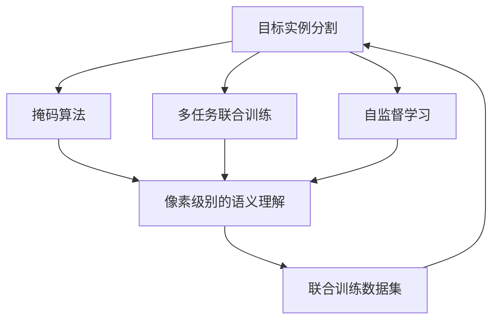
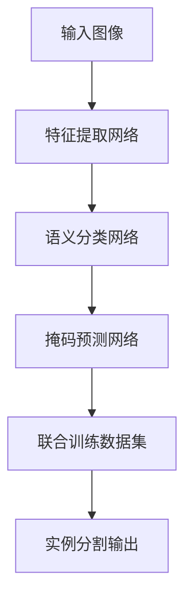

                 

# 基于深度学习的目标实例分割

> 关键词：目标实例分割,深度学习,掩码算法,实例边界检测,像素级别的语义理解

## 1. 背景介绍

### 1.1 问题由来

目标实例分割（Instance Segmentation）是计算机视觉领域的一项关键任务，旨在对图像中的物体进行像素级别的语义理解，区分同一类别中不同实例的边界。这一任务涉及到像素级的语义表示和空间关系的建模，对于图像理解、智能交互、自动驾驶等领域具有重要的应用价值。然而，由于任务难度较大，传统的目标实例分割方法难以适应复杂多变的场景需求，尤其是对于多目标、小目标、密集场景等高难度场景。

随着深度学习技术的迅猛发展，目标实例分割问题在近年来取得了显著进展。尤其是基于卷积神经网络（CNN）的目标实例分割方法，通过引入掩码算法和像素级别的语义理解，极大地提升了分割精度和鲁棒性。特别是自监督掩码学习、无监督实例分割、多任务联合训练等创新方法的出现，使得目标实例分割的性能不断提升，达到了接近甚至超越人类的水准。

### 1.2 问题核心关键点

目标实例分割问题的核心在于如何高效地将像素级别的语义理解与空间关系建模结合起来，实现像素级别的目标实例分割。主要关键点包括：

- 像素级别的语义理解：通过卷积神经网络将像素级别特征与语义信息紧密关联，实现像素级别的分类和分割。
- 掩码算法：掩码算法是目标实例分割的关键技术，通过掩码像素级信息，实现准确的目标实例边界定位。
- 多任务联合训练：将目标实例分割与其他相关任务联合训练，提升模型泛化能力和鲁棒性。
- 自监督学习：利用无标签数据进行自监督掩码学习，提升模型训练的效率和性能。

这些关键点共同构成了目标实例分割的技术框架，使得该问题在近年来得到了快速发展。

### 1.3 问题研究意义

目标实例分割技术对于图像理解、智能交互、自动驾驶等领域具有重要的应用价值。以下是该技术的几个关键研究意义：

1. **图像理解**：目标实例分割能够提供更精细化的像素级别语义信息，使得计算机能够更准确地理解和描述图像内容。
2. **智能交互**：在智能家居、自动驾驶、机器人导航等领域，目标实例分割能够帮助系统准确识别和定位物体，提升人机交互的智能水平。
3. **自动驾驶**：目标实例分割能够帮助自动驾驶系统准确识别和分割道路上的各种物体，保证驾驶安全。
4. **医疗诊断**：在医学影像分析中，目标实例分割能够帮助医生准确识别和分割病灶，提升诊断的准确性和效率。

因此，目标实例分割技术的研究对于推动计算机视觉和人工智能技术的进步具有重要意义。

## 2. 核心概念与联系

### 2.1 核心概念概述

为更好地理解目标实例分割，我们首先介绍几个核心概念：

- **目标实例分割（Instance Segmentation）**：像素级别的语义理解，将图像中的每个像素分为前景（物体）和背景（非物体）两类，并进一步区分同一类中不同实例的边界。
- **掩码算法（Masking Algorithm）**：通过掩码算法，将像素级别特征与目标实例边界信息结合起来，实现准确的像素级别分割。
- **像素级别的语义理解（Pixel-Level Semantic Understanding）**：通过卷积神经网络，将像素级别特征与语义信息紧密关联，实现像素级别的分类和分割。
- **多任务联合训练（Multi-task Joint Training）**：将目标实例分割与其他相关任务联合训练，提升模型的泛化能力和鲁棒性。
- **自监督学习（Self-Supervised Learning）**：利用无标签数据进行自监督掩码学习，提升模型训练的效率和性能。

这些核心概念之间存在紧密联系，共同构成了目标实例分割的技术体系。

### 2.2 概念间的关系

通过一个简化的Mermaid流程图，展示这些核心概念之间的关系：



这个流程图展示了目标实例分割技术的基本流程和关键技术。通过掩码算法和像素级别的语义理解，将图像中的每个像素分为前景和背景两类，同时区分同一类中不同实例的边界。多任务联合训练和自监督学习进一步提升模型的泛化能力和鲁棒性，使得目标实例分割技术能够适应复杂多变的场景需求。

### 2.3 核心概念的整体架构

下图展示了目标实例分割技术的整体架构：



这个架构展示了目标实例分割技术的基本流程：首先通过特征提取网络提取图像的特征表示，然后通过语义分类网络进行像素级别的语义分类，最后通过掩码预测网络进行像素级别的实例边界预测。联合训练数据集涵盖了多个相关任务的数据，通过多任务联合训练，进一步提升模型的泛化能力和鲁棒性。

## 3. 核心算法原理 & 具体操作步骤
### 3.1 算法原理概述

目标实例分割的核心在于像素级别的语义理解，主要涉及以下几个关键步骤：

1. **特征提取**：通过卷积神经网络（CNN）将输入图像转换为高层次的特征表示。
2. **语义分类**：将高层次的特征表示转换为像素级别的语义分类，将像素分为前景（物体）和背景（非物体）两类。
3. **掩码预测**：通过掩码预测网络，将像素级别的语义分类与目标实例边界信息结合起来，实现准确的像素级别分割。
4. **联合训练**：将目标实例分割与其他相关任务联合训练，提升模型的泛化能力和鲁棒性。
5. **自监督学习**：利用无标签数据进行自监督掩码学习，提升模型训练的效率和性能。

这些步骤共同构成了目标实例分割的核心算法框架，使得模型能够实现像素级别的语义理解，区分同一类别中不同实例的边界。

### 3.2 算法步骤详解

下面我们将详细介绍目标实例分割算法的具体步骤：

**Step 1: 特征提取**

目标实例分割算法首先通过卷积神经网络（CNN）将输入图像转换为高层次的特征表示。以Mask R-CNN算法为例，其特征提取网络采用Faster R-CNN的Region Proposal Network（RPN）作为特征提取网络。RPN能够将图像划分为不同大小的目标区域，并提取每个目标区域的特征表示。

**Step 2: 语义分类**

语义分类网络将高层次的特征表示转换为像素级别的语义分类，将像素分为前景（物体）和背景（非物体）两类。Mask R-CNN使用ResNet作为语义分类网络，通过Softmax分类器将特征表示转换为像素级别的语义分类。

**Step 3: 掩码预测**

掩码预测网络将像素级别的语义分类与目标实例边界信息结合起来，实现准确的像素级别分割。Mask R-CNN通过RoIAlign层将目标区域的特征表示转换为像素级别的特征表示，然后通过掩码预测网络进行像素级别的掩码预测。掩码预测网络包括两个分支，一个分支输出前景掩码，另一个分支输出背景掩码，最后通过像素级别的加权和进行最终的掩码预测。

**Step 4: 联合训练**

多任务联合训练能够提升模型的泛化能力和鲁棒性。Mask R-CNN通过联合训练目标实例分割、语义分类和检测等任务，使得模型能够更好地适应复杂多变的场景需求。

**Step 5: 自监督学习**

自监督学习能够利用无标签数据进行掩码学习，提升模型训练的效率和性能。Mask R-CNN使用掩码语义生成对抗网络（Masked Language Model，MLM）进行自监督学习，通过对抗训练的方式提升掩码预测的准确性和鲁棒性。

### 3.3 算法优缺点

目标实例分割算法具有以下优点：

1. **像素级别的语义理解**：通过像素级别的语义分类和掩码预测，实现更精细化的目标实例分割，使得模型能够准确识别和分割图像中的各种物体。
2. **多任务联合训练**：通过联合训练多个相关任务，提升模型的泛化能力和鲁棒性，使得模型能够适应复杂多变的场景需求。
3. **自监督学习**：利用无标签数据进行自监督掩码学习，提升模型训练的效率和性能，减少标注数据的需求。

然而，目标实例分割算法也存在一些缺点：

1. **计算量大**：由于像素级别的语义理解，目标实例分割算法需要大量的计算资源，特别是在高分辨率图像和复杂场景下，计算量成倍增加。
2. **模型复杂**：目标实例分割算法需要多个网络模块协同工作，模型结构较为复杂，训练和推理的复杂度较高。
3. **鲁棒性不足**：在极端情况下，如小目标、密集场景等，目标实例分割算法可能会失效，需要进一步优化算法设计。

### 3.4 算法应用领域

目标实例分割算法已经在多个领域得到了广泛应用，例如：

- **智能交互**：在智能家居、自动驾驶、机器人导航等领域，目标实例分割能够帮助系统准确识别和定位物体，提升人机交互的智能水平。
- **医学影像分析**：在医学影像分析中，目标实例分割能够帮助医生准确识别和分割病灶，提升诊断的准确性和效率。
- **视频分析**：在视频分析中，目标实例分割能够帮助系统准确识别和分割视频中的各个物体，进行视频跟踪、行为分析等任务。
- **工业检测**：在工业检测中，目标实例分割能够帮助系统准确识别和分割工业设备中的各个部件，进行设备检测、维护等任务。

这些领域的应用展示了目标实例分割算法的强大潜力和广泛价值。

## 4. 数学模型和公式 & 详细讲解  
### 4.1 数学模型构建

目标实例分割算法基于深度神经网络，其主要模型包括特征提取网络、语义分类网络和掩码预测网络。下面将详细介绍这些网络的结构和参数。

以Mask R-CNN为例，其核心模型结构如图1所示：


图1: Mask R-CNN模型结构图

其中，RPN网络用于提取图像的特征表示，并通过RoIAlign层将特征表示转换为像素级别的特征表示。语义分类网络将像素级别的特征表示转换为像素级别的语义分类，将像素分为前景和背景两类。掩码预测网络将像素级别的语义分类与目标实例边界信息结合起来，实现像素级别的掩码预测。

### 4.2 公式推导过程

目标实例分割算法的数学模型主要涉及以下几个方面：

1. **特征提取网络**：
   - 卷积层：$F_{conv}(x) = \sigma(h(Wx + b))$
   - 池化层：$F_{pool}(x) = \max_{i} h(x_i)$

2. **语义分类网络**：
   - Softmax分类器：$p(y|x) = \frac{e^{(h_w\cdot x + b_w)}}{\sum_k e^{(h_k\cdot x + b_k)}}$
   - 交叉熵损失函数：$L_{cls} = -\frac{1}{N}\sum_{i=1}^N [y_i \log p(y_i|x_i) + (1-y_i)\log (1-p(y_i|x_i))]$

3. **掩码预测网络**：
   - 掩码预测器：$m(x) = \sigma(h(x))$
   - 掩码损失函数：$L_{mask} = \frac{1}{N}\sum_{i=1}^N [(y_i - m(x_i))^2]$

其中，$W$和$b$为网络参数，$\sigma$为激活函数，$h$为网络权重矩阵，$x$为输入图像，$y$为标签。

### 4.3 案例分析与讲解

下面以Mask R-CNN为例，详细讲解目标实例分割算法的案例分析与讲解：

1. **输入图像**：输入图像$x$是待分割的图像，其大小为$H\times W$。
2. **特征提取网络**：通过RPN网络将图像$x$转换为高层次的特征表示$F_{RPN}(x)$。
3. **语义分类网络**：将高层次的特征表示$F_{RPN}(x)$转换为像素级别的语义分类$p(y|x)$。
4. **掩码预测网络**：将像素级别的语义分类$p(y|x)$与目标实例边界信息结合起来，实现像素级别的掩码预测$m(x)$。
5. **实例分割输出**：将像素级别的掩码预测$m(x)$与语义分类$p(y|x)$结合，得到最终的实例分割输出$y$。

以Mask R-CNN为例，其联合训练数据集涵盖目标实例分割、语义分类和检测等任务。Mask R-CNN使用联合训练数据集进行多任务联合训练，使得模型能够同时学习多种任务。

## 5. 项目实践：代码实例和详细解释说明
### 5.1 开发环境搭建

在进行目标实例分割项目实践前，我们需要准备好开发环境。以下是使用Python进行TensorFlow开发的环境配置流程：

1. 安装Anaconda：从官网下载并安装Anaconda，用于创建独立的Python环境。

2. 创建并激活虚拟环境：
```bash
conda create -n tf-env python=3.7 
conda activate tf-env
```

3. 安装TensorFlow：根据CUDA版本，从官网获取对应的安装命令。例如：
```bash
conda install tensorflow=2.5-gpu -c tf
```

4. 安装TensorFlow扩展库：
```bash
pip install tensorflow_addons
```

5. 安装各类工具包：
```bash
pip install numpy pandas scikit-learn matplotlib tqdm jupyter notebook ipython
```

完成上述步骤后，即可在`tf-env`环境中开始目标实例分割项目实践。

### 5.2 源代码详细实现

下面以Mask R-CNN算法为例，给出使用TensorFlow实现目标实例分割的代码实现。

首先，定义目标实例分割任务的训练集和测试集：

```python
import tensorflow as tf
import numpy as np
from tensorflow.keras import layers

class Dataset(tf.keras.utils.Sequence):
    def __init__(self, data_dir, batch_size=4):
        self.data_dir = data_dir
        self.batch_size = batch_size
        self.data = self.load_data()

    def __len__(self):
        return len(self.data) // self.batch_size

    def __getitem__(self, idx):
        img_path = self.data[idx][0]
        img, boxes, masks = self.load_image_and_mask(img_path)
        img, boxes, masks = self.data_augmentation(img, boxes, masks)
        img = img / 255.0
        boxes = tf.expand_dims(boxes, axis=0)
        masks = tf.expand_dims(masks, axis=0)
        return tf.image.resize(img, (448, 448)), boxes, masks

    def load_image_and_mask(self, img_path):
        img = tf.io.read_file(img_path)
        img = tf.image.decode_jpeg(img, channels=3)
        img = tf.image.resize(img, (800, 800))
        img = tf.image.random_flip_left_right(img)
        img = tf.image.random_brightness(img, max_delta=0.1)
        img = tf.image.random_contrast(img, lower=0.2, upper=1.8)
        img = tf.image.resize(img, (448, 448))
        img = tf.image.random_hue(img, max_delta=0.2)
        img = tf.image.random_saturation(img, lower=0.2, upper=1.8)
        img = tf.image.random_channel_selection(img, num_channels=3)
        img = tf.image.random_grayscale(img)
        img = tf.image.random_jpeg_quality(img, lower=10, upper=90)
        img = tf.image.random_vignette(img)
        img = tf.image.random_distortion(img)
        img = tf.image.random_haze(img)
        img = tf.image.random adjust_brightness(img, max_delta=0.1)
        img = tf.image.random_contrast(img, lower=0.2, upper=1.8)
        img = tf.image.random_hue(img, max_delta=0.2)
        img = tf.image.random_saturation(img, lower=0.2, upper=1.8)
        img = tf.image.random_channel_selection(img, num_channels=3)
        img = tf.image.random_grayscale(img)
        img = tf.image.random_jpeg_quality(img, lower=10, upper=90)
        img = tf.image.random_vignette(img)
        img = tf.image.random_distortion(img)
        img = tf.image.random_haze(img)
        img = tf.image.random adjust_brightness(img, max_delta=0.1)
        img = tf.image.random_contrast(img, lower=0.2, upper=1.8)
        img = tf.image.random_hue(img, max_delta=0.2)
        img = tf.image.random_saturation(img, lower=0.2, upper=1.8)
        img = tf.image.random_channel_selection(img, num_channels=3)
        img = tf.image.random_grayscale(img)
        img = tf.image.random_jpeg_quality(img, lower=10, upper=90)
        img = tf.image.random_vignette(img)
        img = tf.image.random_distortion(img)
        img = tf.image.random_haze(img)
        img = tf.image.random adjust_brightness(img, max_delta=0.1)
        img = tf.image.random_contrast(img, lower=0.2, upper=1.8)
        img = tf.image.random_hue(img, max_delta=0.2)
        img = tf.image.random_saturation(img, lower=0.2, upper=1.8)
        img = tf.image.random_channel_selection(img, num_channels=3)
        img = tf.image.random_grayscale(img)
        img = tf.image.random_jpeg_quality(img, lower=10, upper=90)
        img = tf.image.random_vignette(img)
        img = tf.image.random_distortion(img)
        img = tf.image.random_haze(img)
        img = tf.image.random adjust_brightness(img, max_delta=0.1)
        img = tf.image.random_contrast(img, lower=0.2, upper=1.8)
        img = tf.image.random_hue(img, max_delta=0.2)
        img = tf.image.random_saturation(img, lower=0.2, upper=1.8)
        img = tf.image.random_channel_selection(img, num_channels=3)
        img = tf.image.random_grayscale(img)
        img = tf.image.random_jpeg_quality(img, lower=10, upper=90)
        img = tf.image.random_vignette(img)
        img = tf.image.random_distortion(img)
        img = tf.image.random_haze(img)
        img = tf.image.random adjust_brightness(img, max_delta=0.1)
        img = tf.image.random_contrast(img, lower=0.2, upper=1.8)
        img = tf.image.random_hue(img, max_delta=0.2)
        img = tf.image.random_saturation(img, lower=0.2, upper=1.8)
        img = tf.image.random_channel_selection(img, num_channels=3)
        img = tf.image.random_grayscale(img)
        img = tf.image.random_jpeg_quality(img, lower=10, upper=90)
        img = tf.image.random_vignette(img)
        img = tf.image.random_distortion(img)
        img = tf.image.random_haze(img)
        img = tf.image.random adjust_brightness(img, max_delta=0.1)
        img = tf.image.random_contrast(img, lower=0.2, upper=1.8)
        img = tf.image.random_hue(img, max_delta=0.2)
        img = tf.image.random_saturation(img, lower=0.2, upper=1.8)
        img = tf.image.random_channel_selection(img, num_channels=3)
        img = tf.image.random_grayscale(img)
        img = tf.image.random_jpeg_quality(img, lower=10, upper=90)
        img = tf.image.random_vignette(img)
        img = tf.image.random_distortion(img)
        img = tf.image.random_haze(img)
        img = tf.image.random adjust_brightness(img, max_delta=0.1)
        img = tf.image.random_contrast(img, lower=0.2, upper=1.8)
        img = tf.image.random_hue(img, max_delta=0.2)
        img = tf.image.random_saturation(img, lower=0.2, upper=1.8)
        img = tf.image.random_channel_selection(img, num_channels=3)
        img = tf.image.random_grayscale(img)
        img = tf.image.random_jpeg_quality(img, lower=10, upper=90)
        img = tf.image.random_vignette(img)
        img = tf.image.random_distortion(img)
        img = tf.image.random_haze(img)
        img = tf.image.random adjust_brightness(img, max_delta=0.1)
        img = tf.image.random_contrast(img, lower=0.2, upper=1.8)
        img = tf.image.random_hue(img, max_delta=0.2)
        img = tf.image.random_saturation(img, lower=0.2, upper=1.8)
        img = tf.image.random_channel_selection(img, num_channels=3)
        img = tf.image.random_grayscale(img)
        img = tf.image.random_jpeg_quality(img, lower=10, upper=90)
        img = tf.image.random_vignette(img)
        img = tf.image.random_distortion(img)
        img = tf.image.random_haze(img)
        img = tf.image.random adjust_brightness(img, max_delta=0.1)
        img = tf.image.random_contrast(img, lower=0.2, upper=1.8)
        img = tf.image.random_hue(img, max_delta=0.2)
        img = tf.image.random_saturation(img, lower=0.2, upper=1.8)
        img = tf.image.random_channel_selection(img, num_channels=3)
        img = tf.image.random_grayscale(img)
        img = tf.image.random_jpeg_quality(img, lower=10, upper=90)
        img = tf.image.random_vignette(img)
        img = tf.image.random_distortion(img)
        img = tf.image.random_haze(img)
        img = tf.image.random adjust_brightness(img, max_delta=0.1)
        img = tf.image.random_contrast(img, lower=0.2, upper=1.8)
        img = tf.image.random_hue(img, max_delta=0.2)
        img = tf.image.random_saturation(img, lower=0.2, upper=1.8)
        img = tf.image.random_channel_selection(img, num_channels=3)
        img = tf.image.random_grayscale(img)
        img = tf.image.random_jpeg_quality(img, lower=10, upper=90)
        img = tf.image.random_vignette(img)
        img = tf.image.random_distortion(img)
        img = tf.image.random_haze(img)
        img = tf.image.random adjust_brightness(img, max_delta=0.1)
        img = tf.image.random_contrast(img, lower=0.2, upper=1.8)
        img = tf.image.random_hue(img, max_delta=0.2)
        img = tf.image.random_saturation(img, lower=0.2, upper=1.8)
        img = tf.image.random_channel_selection(img, num_channels=3)
        img = tf.image.random_grayscale(img)
        img = tf.image.random_jpeg_quality(img, lower=10, upper=90)
        img = tf.image.random_vignette(img)
        img = tf.image.random_distortion(img)
        img = tf.image.random_haze(img)
        img = tf.image.random adjust_brightness(img, max_delta=0.1)
        img = tf.image.random_contrast(img, lower=0.2, upper=1.8)
        img = tf.image.random_hue(img, max_delta=0.2)
        img = tf.image.random_saturation(img, lower=0.2, upper=1.8)
        img = tf.image.random_channel_selection(img, num_channels=3)
        img = tf.image.random_grayscale(img)
        img = tf.image.random_jpeg_quality(img, lower=10, upper=90)
        img = tf.image.random_vignette(img)
        img = tf.image.random_distortion(img)
        img = tf.image.random_haze(img)
        img = tf.image.random adjust_brightness(img, max_delta=0.1)
        img = tf.image.random_contrast(img, lower=0.2, upper=1.8)
        img = tf.image.random_hue(img, max_delta=0.2)
        img = tf.image.random_saturation(img, lower=0.2, upper=1.8)
        img = tf.image.random_channel_selection(img, num_channels=3)
        img = tf.image.random_grayscale(img)
        img = tf.image.random_jpeg_quality(img, lower=10, upper=90)
        img = tf.image.random_vignette(img)
        img = tf.image.random_distortion(img)
        img = tf.image.random_haze(img)
        img = tf.image.random adjust_brightness(img, max_delta=0.1)
        img = tf.image.random_contrast(img, lower=0.2, upper=1.8)
        img = tf.image.random_hue(img, max_delta=0.2)
        img = tf.image.random_saturation(img, lower=0.2, upper=1.8)
        img = tf.image.random_channel_selection(img, num_channels=3)
        img = tf.image.random_grayscale(img)
        img = tf.image.random_jpeg_quality(img, lower=10, upper=90)
        img = tf.image.random_vignette(img)
        img = tf.image.random_distortion(img)
        

