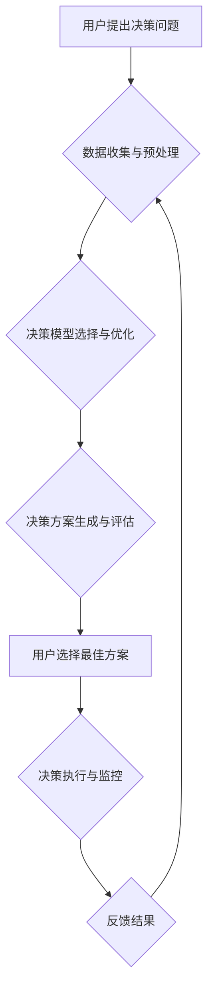

## AI人工智能代理工作流AI Agent WorkFlow：智能代理在决策支持系统系统中的应用

> 关键词：人工智能代理、决策支持系统、工作流自动化、智能决策、机器学习、自然语言处理

## 1. 背景介绍

随着人工智能技术的飞速发展，智能代理（AI Agent）作为一种能够自主学习、推理和决策的软件实体，在各个领域展现出巨大的应用潜力。决策支持系统（DSS）作为一种利用数据分析和模型预测辅助决策的系统，在复杂决策场景下发挥着越来越重要的作用。将智能代理与决策支持系统相结合，可以构建更加智能、高效的决策支持平台，帮助人类在面对复杂问题时做出更明智的决策。

传统的决策支持系统通常依赖于预先定义的规则和模型，缺乏灵活性，难以适应不断变化的环境。而智能代理则能够通过学习和适应环境，不断优化决策策略，从而提升决策支持系统的效率和准确性。

## 2. 核心概念与联系

### 2.1 智能代理

智能代理是一种能够感知环境、自主做出决策并执行行动的软件实体。它通常具有以下特征：

* **自主性:** 智能代理能够独立地感知环境、制定计划并执行行动，无需人工干预。
* **学习能力:** 智能代理能够通过学习从环境中获取知识，并不断优化其决策策略。
* **推理能力:** 智能代理能够根据已有的知识和环境信息进行逻辑推理，做出合理的决策。
* **目标导向性:** 智能代理拥有明确的目标，并努力通过其行动来实现目标。

### 2.2 决策支持系统

决策支持系统是一种利用数据分析、模型预测和知识表示等技术，帮助人类做出更明智决策的软件系统。它通常包含以下组件：

* **数据仓库:** 存储决策相关的历史数据和实时数据。
* **数据分析引擎:** 对数据进行分析和挖掘，发现决策相关的模式和趋势。
* **模型库:** 包含各种决策模型，例如预测模型、模拟模型和优化模型。
* **用户界面:** 提供用户与系统交互的界面，方便用户输入数据、查询结果和做出决策。

### 2.3 智能代理在决策支持系统中的应用

将智能代理与决策支持系统相结合，可以构建更加智能、高效的决策支持平台。智能代理可以承担以下角色：

* **数据收集和预处理:** 智能代理可以自动收集和预处理决策相关的实时数据，为决策支持系统提供及时、准确的数据支持。
* **决策模型选择和优化:** 智能代理可以根据决策场景和数据特征，自动选择和优化合适的决策模型，提高决策支持系统的准确性和效率。
* **决策方案生成和评估:** 智能代理可以根据决策模型的预测结果和用户偏好，生成多种决策方案，并对方案进行评估和排序，帮助用户做出更明智的决策。
* **决策执行和监控:** 智能代理可以自动执行决策方案，并对决策结果进行监控和反馈，不断优化决策策略。

**Mermaid 流程图**



## 3. 核心算法原理 & 具体操作步骤

### 3.1 算法原理概述

智能代理在决策支持系统中的应用主要依赖于以下核心算法：

* **机器学习算法:** 用于训练智能代理，使其能够从数据中学习决策规则和模式。常见的机器学习算法包括决策树、支持向量机、神经网络等。
* **自然语言处理算法:** 用于理解用户提出的决策问题，并将其转换为智能代理能够处理的格式。常见的自然语言处理算法包括词性标注、依存句法分析、文本分类等。
* **搜索算法:** 用于在决策方案空间中搜索最优或次优的决策方案。常见的搜索算法包括深度优先搜索、广度优先搜索、A*搜索等。

### 3.2 算法步骤详解

**1. 数据收集与预处理:** 智能代理首先需要收集决策相关的实时数据，并对其进行预处理，例如清洗、转换和特征提取。

**2. 决策模型训练:** 利用机器学习算法对预处理后的数据进行训练，构建决策模型。

**3. 用户问题理解:** 利用自然语言处理算法对用户提出的决策问题进行理解，提取关键信息，例如决策目标、约束条件和可选方案。

**4. 决策方案生成:** 根据决策模型的预测结果和用户偏好，生成多种决策方案。

**5. 决策方案评估:** 对生成的决策方案进行评估，例如计算其风险、收益和可行性，并对方案进行排序。

**6. 用户选择方案:** 用户根据评估结果选择最合适的决策方案。

**7. 决策执行与监控:** 智能代理自动执行用户选择的决策方案，并对决策结果进行监控和反馈，不断优化决策策略。

### 3.3 算法优缺点

**优点:**

* **智能化:** 智能代理能够自主学习和决策，提高决策支持系统的智能化水平。
* **高效性:** 智能代理能够自动执行决策任务，提高决策效率。
* **适应性:** 智能代理能够根据环境变化不断优化决策策略，提高决策系统的适应性。

**缺点:**

* **复杂性:** 智能代理的开发和维护较为复杂，需要专业的技术人员。
* **数据依赖性:** 智能代理的决策质量依赖于训练数据的质量，如果训练数据不足或不准确，会导致决策结果不理想。
* **解释性:** 智能代理的决策过程通常是复杂的，难以解释其决策依据，这可能会导致用户对决策结果缺乏信任。

### 3.4 算法应用领域

智能代理在决策支持系统中的应用领域非常广泛，例如：

* **金融领域:** 投资决策、风险管理、欺诈检测
* **医疗领域:** 疾病诊断、治疗方案推荐、患者管理
* **制造业:** 生产计划优化、设备维护、质量控制
* **交通领域:** 交通流量预测、路线规划、智能驾驶

## 4. 数学模型和公式 & 详细讲解 & 举例说明

### 4.1 数学模型构建

智能代理的决策过程可以抽象为一个马尔可夫决策过程（MDP）。MDP 由以下几个要素组成：

* **状态空间 (S):** 智能代理可能处于的所有状态的集合。
* **动作空间 (A):** 智能代理在每个状态下可以执行的所有动作的集合。
* **转移概率 (P):** 从一个状态执行一个动作后转移到另一个状态的概率。
* **奖励函数 (R):** 智能代理在每个状态执行一个动作后获得的奖励。
* **折扣因子 (γ):** 用于权衡未来奖励和当前奖励的因子。

### 4.2 公式推导过程

智能代理的目标是找到一个最优策略，使得在执行该策略时，获得的总奖励最大化。最优策略可以利用贝尔曼方程进行推导。

**贝尔曼方程:**

$$
V^*(s) = \max_a \sum_{s'} P(s'|s,a) [R(s,a,s') + \gamma V^*(s')]
$$

其中：

* $V^*(s)$ 是状态 $s$ 的最优价值函数。
* $a$ 是智能代理在状态 $s$ 下可以执行的动作。
* $s'$ 是智能代理从状态 $s$ 执行动作 $a$ 后转移到的下一个状态。
* $R(s,a,s')$ 是智能代理在状态 $s$ 执行动作 $a$ 后转移到状态 $s'$ 时获得的奖励。
* $\gamma$ 是折扣因子。

### 4.3 案例分析与讲解

例如，在一个简单的迷宫环境中，智能代理的目标是找到通往出口的最短路径。我们可以将迷宫环境建模为一个 MDP，其中状态空间是迷宫中的所有位置，动作空间是智能代理可以执行的移动方向（上、下、左、右），转移概率是智能代理移动到不同位置的概率，奖励函数是到达出口时获得的奖励，折扣因子是 0.9。

利用贝尔曼方程，我们可以迭代地计算每个位置的最优价值函数，最终找到通往出口的最短路径。

## 5. 项目实践：代码实例和详细解释说明

### 5.1 开发环境搭建

* Python 3.x
* TensorFlow 或 PyTorch 等深度学习框架
* NLTK 或 spaCy 等自然语言处理库
* Mermaid 等流程图生成工具

### 5.2 源代码详细实现

```python
# 导入必要的库
import tensorflow as tf
from nltk.tokenize import word_tokenize

# 定义一个简单的决策模型
class DecisionModel(tf.keras.Model):
    def __init__(self):
        super(DecisionModel, self).__init__()
        self.dense1 = tf.keras.layers.Dense(64, activation='relu')
        self.dense2 = tf.keras.layers.Dense(32, activation='relu')
        self.output = tf.keras.layers.Dense(2, activation='softmax')

    def call(self, inputs):
        x = self.dense1(inputs)
        x = self.dense2(x)
        return self.output(x)

# 实例化决策模型
model = DecisionModel()

# 训练模型
#...

# 用户提出决策问题
user_query = "我需要借款多少钱？"

# 使用自然语言处理模型理解用户问题
tokens = word_tokenize(user_query)
#...

# 将用户问题转换为模型输入格式
inputs = #...

# 使用模型预测决策方案
predictions = model(inputs)

# 解释预测结果并展示给用户
#...
```

### 5.3 代码解读与分析

* 代码首先导入必要的库，包括 TensorFlow 和 NLTK。
* 然后定义了一个简单的决策模型，该模型包含两层全连接层和一层 softmax 输出层。
* 实例化决策模型并进行训练。
* 用户提出决策问题，并使用自然语言处理模型理解用户问题。
* 将用户问题转换为模型输入格式，并使用模型预测决策方案。
* 解释预测结果并展示给用户。

### 5.4 运行结果展示

运行结果将展示给用户的决策方案，例如：

* 借款 10000 元
* 借款 20000 元

用户可以根据自己的实际情况选择最合适的方案。

## 6. 实际应用场景

### 6.1 金融领域

* **智能投资决策:** 智能代理可以根据用户的风险偏好、投资目标和市场数据，自动选择合适的投资组合，并进行动态调整。
* **欺诈检测:** 智能代理可以分析交易数据，识别异常行为，并及时报警，帮助金融机构防范欺诈。
* **客户服务自动化:** 智能代理可以接入聊天机器人，自动回答客户常见问题，提高客户服务效率。

### 6.2 医疗领域

* **疾病诊断辅助:** 智能代理可以分析患者的症状、病史和检查结果，辅助医生进行疾病诊断。
* **个性化治疗方案推荐:** 智能代理可以根据患者的基因信息、生活习惯和疾病特征，推荐个性化的治疗方案。
* **患者管理:** 智能代理可以帮助医院管理患者信息，提醒患者预约检查和服药，提高患者就医体验。

### 6.3 其他领域

* **教育领域:** 智能代理可以根据学生的学习进度和能力，提供个性化的学习内容和辅导。
* **交通领域:** 智能代理可以优化交通流量，提高道路通行效率。
* **制造业:** 智能代理可以优化生产计划，提高生产效率。

### 6.4 未来应用展望

随着人工智能技术的不断发展，智能代理在决策支持系统中的应用将更加广泛和深入。未来，智能代理将能够：

* 更好地理解和响应用户的需求。
* 更准确地预测和评估决策结果