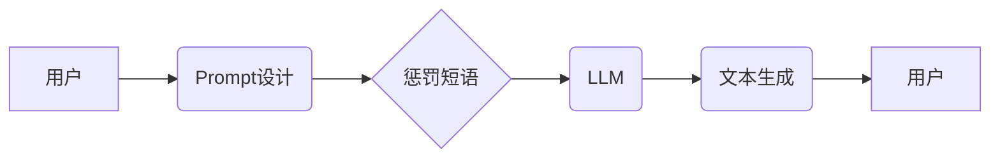

## AI大模型Prompt提示词最佳实践：使用惩罚短语

> 关键词：AI大模型、Prompt提示词、惩罚短语、文本生成、模型优化、自然语言处理

### 1. 背景介绍

近年来，大语言模型（LLM）在自然语言处理领域取得了令人瞩目的成就，例如文本生成、翻译、问答等。这些模型的强大能力源于其海量数据训练和复杂的架构。然而，LLM的性能仍然受到Prompt提示词的设计限制。一个精心设计的Prompt可以引导模型生成更准确、更相关的输出，而一个糟糕的Prompt则可能导致模型产生错误、无关或低质量的文本。

Prompt提示词是与LLM交互的关键环节，它决定了模型的输入和输出方向。传统的Prompt设计往往依赖于人工经验和试错法，效率低下且难以保证效果。为了提升Prompt设计效率和模型性能，研究者们提出了各种优化方法，其中之一便是使用惩罚短语。

### 2. 核心概念与联系

#### 2.1 核心概念

* **Prompt提示词:** 指向LLM的输入指令或文本片段，用于引导模型生成特定类型的输出。
* **惩罚短语:**  嵌入在Prompt中的特定文本片段，旨在抑制模型生成某些不希望出现的输出。

#### 2.2 架构关系



### 3. 核心算法原理 & 具体操作步骤

#### 3.1 算法原理概述

惩罚短语的原理基于模型的训练过程。在训练过程中，LLM学习到语言的规律和模式，并通过最大化似然估计来预测下一个词。惩罚短语通过在模型的损失函数中加入惩罚项，降低模型生成特定短语的概率。

#### 3.2 算法步骤详解

1. **识别目标短语:** 首先需要确定哪些短语是不希望模型生成的，例如敏感词、低俗词、重复词等。
2. **设计惩罚短语:**  根据目标短语的特点，设计相应的惩罚短语。惩罚短语可以是与目标短语相关的反义词、否定词或其他抑制性的文本片段。
3. **嵌入惩罚短语:** 将惩罚短语嵌入到Prompt中，可以将其作为独立的句子、短语或关键词。
4. **调整惩罚力度:**  惩罚短语的力度可以通过调整惩罚项的权重来控制。

#### 3.3 算法优缺点

**优点:**

* **简单易行:**  惩罚短语的实现相对简单，不需要复杂的模型调整。
* **效果显著:**  在抑制特定短语生成方面，惩罚短语可以取得显著效果。
* **可定制性强:**  可以根据不同的应用场景和需求，设计不同的惩罚短语。

**缺点:**

* **局限性:**  惩罚短语只能抑制已知的目标短语，无法应对未知的恶意生成。
* **误判风险:**  过于严格的惩罚可能会导致模型生成过于保守或缺乏灵活性。

#### 3.4 算法应用领域

* **文本生成:**  抑制模型生成敏感词、低俗词、重复词等不恰当内容。
* **对话系统:**  引导对话朝着期望的方向发展，避免模型生成无关或不礼貌的回复。
* **机器翻译:**  避免模型翻译出错误或不自然的内容。

### 4. 数学模型和公式 & 详细讲解 & 举例说明

#### 4.1 数学模型构建

假设我们有一个文本生成模型，其输出概率分布为 $P(w|h)$，其中 $w$ 是生成的词， $h$ 是输入的上下文信息。

惩罚短语的加入可以修改模型的损失函数，使其更加倾向于避免生成目标短语。

#### 4.2 公式推导过程

损失函数通常采用交叉熵损失，其公式为：

$$
L = -\sum_{i=1}^{n} \log P(w_i|h_i)
$$

其中 $n$ 是文本长度。

加入惩罚短语后，损失函数可以修改为：

$$
L' = -\sum_{i=1}^{n} \log P(w_i|h_i) + \lambda \sum_{i=1}^{n} \mathbb{I}(w_i \in S)
$$

其中 $\lambda$ 是惩罚力度， $S$ 是目标短语集合， $\mathbb{I}(w_i \in S)$ 是指示函数，当 $w_i$ 属于 $S$ 时取值为 1，否则取值为 0。

#### 4.3 案例分析与讲解

假设我们希望抑制模型生成“敏感词”这个目标短语。我们可以将“敏感词”作为惩罚短语 $S$，并设置一个惩罚力度 $\lambda$。当模型生成包含“敏感词”的文本时，损失函数会增加惩罚项，从而降低模型生成该文本的概率。

### 5. 项目实践：代码实例和详细解释说明

#### 5.1 开发环境搭建

* Python 3.7+
* TensorFlow 或 PyTorch
* 其他必要的库，例如 NLTK、spaCy 等

#### 5.2 源代码详细实现

```python
import tensorflow as tf

# 定义模型
model = tf.keras.Sequential([
    tf.keras.layers.Embedding(vocab_size, embedding_dim),
    tf.keras.layers.LSTM(units),
    tf.keras.layers.Dense(vocab_size, activation='softmax')
])

# 定义损失函数
def custom_loss(y_true, y_pred):
    # 计算交叉熵损失
    ce_loss = tf.keras.losses.CategoricalCrossentropy()(y_true, y_pred)
    # 计算惩罚项
    penalty_loss = tf.reduce_sum(lambda x: tf.cast(tf.math.equal(x, target_word), tf.float32) * penalty_weight for x in y_true)
    # 返回总损失
    return ce_loss + penalty_loss

# 设置惩罚力度
penalty_weight = 1.0

# 训练模型
model.compile(optimizer='adam', loss=custom_loss, metrics=['accuracy'])
model.fit(train_data, train_labels, epochs=10)

```

#### 5.3 代码解读与分析

*  自定义损失函数 `custom_loss`，将交叉熵损失和惩罚项相加。
*  `penalty_weight` 控制惩罚的力度。
*  训练模型时使用自定义损失函数。

#### 5.4 运行结果展示

通过训练和测试，可以观察到模型在生成文本时，目标短语出现的频率降低。

### 6. 实际应用场景

#### 6.1 文本生成

* **内容创作:**  使用惩罚短语抑制模型生成低俗、重复或不原创的内容，提高内容质量。
* **代码生成:**  引导模型生成符合规范、安全可靠的代码，避免生成恶意代码。

#### 6.2 对话系统

* **聊天机器人:**  抑制模型生成不礼貌、冒犯性的回复，提高用户体验。
* **客服机器人:**  引导模型提供准确、专业的客服服务，避免生成错误或不相关的信息。

#### 6.3 其他应用

* **机器翻译:**  抑制模型翻译出错误或不自然的内容。
* **文本摘要:**  引导模型生成简洁、准确的文本摘要。

#### 6.4 未来应用展望

随着大语言模型的不断发展，惩罚短语的应用场景将会更加广泛。未来，我们可以期待看到：

* 更智能的惩罚短语设计，能够识别和抑制更复杂的恶意生成。
* 更灵活的惩罚机制，能够根据不同的应用场景和需求进行调整。
* 更深入的理论研究，揭示惩罚短语在模型训练和文本生成中的作用机制。

### 7. 工具和资源推荐

#### 7.1 学习资源推荐

* **论文:**  
    * "Prompt Engineering for Large Language Models"
    * "Fine-tuning Language Models from Scratch"
* **博客:**  
    * OpenAI Blog
    * Hugging Face Blog

#### 7.2 开发工具推荐

* **TensorFlow:**  https://www.tensorflow.org/
* **PyTorch:**  https://pytorch.org/
* **Hugging Face Transformers:**  https://huggingface.co/docs/transformers/index

#### 7.3 相关论文推荐

* "BERT: Pre-training of Deep Bidirectional Transformers for Language Understanding"
* "GPT-3: Language Models are Few-Shot Learners"
* "T5: Text-to-Text Transfer Transformer"

### 8. 总结：未来发展趋势与挑战

#### 8.1 研究成果总结

惩罚短语是一种简单有效的方法，可以提升大语言模型的文本生成质量。它通过在模型训练过程中加入惩罚项，抑制模型生成特定短语，从而提高模型的安全性、准确性和可靠性。

#### 8.2 未来发展趋势

* **更智能的惩罚短语设计:**  利用自然语言理解和机器学习技术，设计更智能、更灵活的惩罚短语。
* **个性化惩罚机制:**  根据用户的需求和偏好，定制个性化的惩罚机制。
* **跨模态惩罚:**  将惩罚机制扩展到多模态数据，例如文本、图像、音频等。

#### 8.3 面临的挑战

* **对抗性攻击:**  攻击者可能会设计对抗性Prompt，绕过惩罚机制。
* **数据偏差:**  惩罚短语的设计可能会受到训练数据的偏差影响。
* **伦理问题:**  惩罚机制可能会导致模型产生偏见或歧视。

#### 8.4 研究展望

未来，我们需要继续深入研究惩罚短语的原理和应用，开发更智能、更安全的惩罚机制，并解决相关伦理问题，推动大语言模型的健康发展。

### 9. 附录：常见问题与解答

* **如何选择合适的惩罚短语？**

  需要根据目标短语的特点和应用场景进行选择。可以参考已有研究成果或进行实验测试。

* **如何调整惩罚力度？**

  可以通过调整惩罚项的权重来控制惩罚力度。需要根据实际情况进行调整，避免过大或过小的惩罚。

* **惩罚短语是否会影响模型的泛化能力？**

  过度使用惩罚短语可能会导致模型过拟合，影响泛化能力。需要合理使用惩罚短语，并进行充分的测试和验证。


作者：禅与计算机程序设计艺术 / Zen and the Art of Computer Programming 
