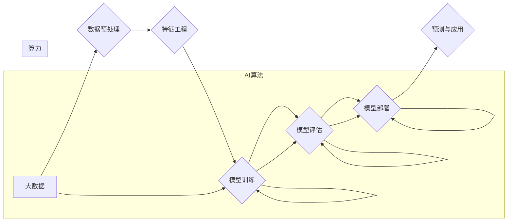

## AI算法、算力与大数据的结合

> 关键词：人工智能、算法、算力、大数据、机器学习、深度学习、模型训练

## 1. 背景介绍

人工智能（AI）正以惊人的速度发展，深刻地改变着我们生活的方方面面。从自动驾驶汽车到智能语音助手，从医疗诊断到金融风险评估，AI技术的应用场景日益广泛。 

然而，AI技术的进步离不开三个关键要素的协同作用：**算法、算力和数据**。这三个要素相互依存，共同推动着AI的发展。

* **算法**是AI的核心，它提供了一种解决问题的逻辑和步骤。不同的算法适用于不同的任务，例如分类、预测、识别等。
* **算力**是AI训练和运行算法所需的计算能力。随着AI模型的复杂性不断增加，对算力的需求也越来越高。
* **数据**是AI学习和训练的燃料。高质量的数据可以帮助AI模型更好地理解世界，并做出更准确的预测。

近年来，随着大数据时代的到来，海量数据为AI算法的训练提供了充足的素材。同时，计算技术的飞速发展也使得AI模型的规模和复杂度不断提升。

## 2. 核心概念与联系

AI算法、算力和大数据的结合，构成了一个相互促进、共同发展的生态系统。

**Mermaid 流程图：**



**核心概念原理和架构：**

* **大数据**：指海量、高速、多样化的数据。大数据时代，数据量呈指数级增长，为AI算法的训练提供了充足的素材。
* **数据预处理**：对原始数据进行清洗、转换、整合等操作，使其符合AI算法的输入要求。
* **特征工程**：从原始数据中提取有价值的特征，并将其转换为AI算法可以理解的形式。
* **模型训练**：利用算法和数据，训练AI模型，使其能够学习数据中的规律。
* **模型评估**：评估模型的性能，并根据评估结果进行模型优化。
* **模型部署**：将训练好的模型部署到实际应用场景中。
* **预测与应用**：利用部署的模型进行预测和分析，并将其应用于实际问题解决。

**算力**是整个过程中的关键支撑，它决定了模型训练的速度和效率。随着AI模型的复杂性不断增加，对算力的需求也越来越高。

## 3. 核心算法原理 & 具体操作步骤

### 3.1  算法原理概述

**机器学习**是AI领域的核心技术之一，它通过算法学习数据中的规律，并根据学习到的规律进行预测或分类。机器学习算法可以分为监督学习、无监督学习和强化学习三大类。

* **监督学习**：利用标记数据训练模型，例如图像分类、文本识别等。
* **无监督学习**：利用未标记数据发现数据中的隐藏结构，例如聚类分析、异常检测等。
* **强化学习**：通过试错学习，让模型在环境中获得最大奖励，例如游戏AI、机器人控制等。

**深度学习**是机器学习的一个子领域，它利用多层神经网络模拟人类大脑的学习过程。深度学习算法在图像识别、语音识别、自然语言处理等领域取得了突破性的进展。

### 3.2  算法步骤详解

以**线性回归**算法为例，详细说明其步骤：

1. **数据收集和预处理**: 收集相关数据，并进行清洗、转换、整合等操作。
2. **特征选择**: 选择与目标变量相关的特征。
3. **模型构建**: 建立线性回归模型，即假设目标变量与特征之间存在线性关系。
4. **模型训练**: 利用训练数据，通过最小化模型误差，调整模型参数，使模型能够更好地拟合数据。
5. **模型评估**: 利用测试数据，评估模型的性能，例如预测准确率、平均绝对误差等。
6. **模型优化**: 根据评估结果，对模型进行优化，例如选择不同的特征、调整模型参数等。
7. **模型部署**: 将训练好的模型部署到实际应用场景中。

### 3.3  算法优缺点

**优点**:

* 算法简单易懂，易于实现。
* 计算效率高，训练速度快。
* 可解释性强，模型参数易于理解。

**缺点**:

* 只能处理线性关系，对于非线性关系的预测效果较差。
* 对数据噪声敏感，容易受到异常值的影响。

### 3.4  算法应用领域

线性回归算法广泛应用于以下领域：

* **预测分析**: 预测销售额、股票价格、客户流失率等。
* **风险评估**: 评估贷款风险、信用风险、投资风险等。
* **定价策略**: 确定产品价格、服务价格等。

## 4. 数学模型和公式 & 详细讲解 & 举例说明

### 4.1  数学模型构建

**线性回归模型**的数学表达式为：

$$y = \beta_0 + \beta_1x_1 + \beta_2x_2 +... + \beta_nx_n + \epsilon$$

其中：

* $y$ 是目标变量
* $x_1, x_2,..., x_n$ 是特征变量
* $\beta_0, \beta_1, \beta_2,..., \beta_n$ 是模型参数
* $\epsilon$ 是误差项

### 4.2  公式推导过程

模型参数的估计可以通过**最小二乘法**来实现。最小二乘法旨在最小化模型预测值与实际值之间的平方误差。

**损失函数**:

$$J(\beta) = \sum_{i=1}^{n}(y_i - \hat{y}_i)^2$$

其中：

* $J(\beta)$ 是损失函数
* $\beta$ 是模型参数
* $y_i$ 是实际值
* $\hat{y}_i$ 是模型预测值

**参数估计**:

通过求解损失函数的最小值，可以得到模型参数的最佳估计值。

### 4.3  案例分析与讲解

假设我们想要预测房屋价格，特征变量包括房屋面积、房间数量、地理位置等。我们可以使用线性回归模型来建立房屋价格预测模型。

通过训练模型，我们可以得到模型参数，例如：

* $\beta_0 = 100000$
* $\beta_1 = 500$ (房屋面积每增加1平方米，价格增加500元)
* $\beta_2 = 10000$ (每增加一间房间，价格增加10000元)

根据这些参数，我们可以预测不同房屋价格。例如，如果一个房屋面积为100平方米，房间数量为3间，那么其预测价格为：

$$y = 100000 + 500 * 100 + 10000 * 3 = 200000$$

## 5. 项目实践：代码实例和详细解释说明

### 5.1  开发环境搭建

* Python 3.x
* scikit-learn 库

### 5.2  源代码详细实现

```python
import pandas as pd
from sklearn.linear_model import LinearRegression
from sklearn.model_selection import train_test_split

# 加载数据
data = pd.read_csv('house_price.csv')

# 选择特征和目标变量
X = data[['area', 'rooms']]
y = data['price']

# 将数据分为训练集和测试集
X_train, X_test, y_train, y_test = train_test_split(X, y, test_size=0.2, random_state=42)

# 创建线性回归模型
model = LinearRegression()

# 训练模型
model.fit(X_train, y_train)

# 预测测试集数据
y_pred = model.predict(X_test)

# 评估模型性能
from sklearn.metrics import mean_squared_error
mse = mean_squared_error(y_test, y_pred)
print(f'Mean Squared Error: {mse}')
```

### 5.3  代码解读与分析

* 首先，我们加载数据并选择特征和目标变量。
* 然后，我们将数据分为训练集和测试集，用于训练和评估模型。
* 接下来，我们创建线性回归模型并训练模型。
* 训练完成后，我们使用模型预测测试集数据，并评估模型性能。

### 5.4  运行结果展示

运行代码后，会输出模型的均方误差（MSE）值。MSE值越小，模型的预测性能越好。

## 6. 实际应用场景

AI算法、算力和大数据的结合在各个领域都有广泛的应用场景：

* **医疗保健**: 疾病诊断、药物研发、个性化医疗等。
* **金融服务**: 欺诈检测、风险评估、投资决策等。
* **制造业**: 预测性维护、质量控制、生产优化等。
* **零售业**: 个性化推荐、库存管理、客户服务等。

## 6.4  未来应用展望

随着AI技术的不断发展，其应用场景将更加广泛，例如：

* **自动驾驶**: 利用深度学习算法，实现车辆自动驾驶。
* **智能机器人**: 利用强化学习算法，训练机器人完成复杂的任务。
* **虚拟助手**: 利用自然语言处理算法，开发更智能的虚拟助手。

## 7. 工具和资源推荐

### 7.1  学习资源推荐

* **在线课程**: Coursera, edX, Udacity 等平台提供丰富的AI课程。
* **书籍**: 《深度学习》、《机器学习实战》等经典书籍。
* **博客**: Towards Data Science, Machine Learning Mastery 等技术博客。

### 7.2  开发工具推荐

* **Python**: 广泛应用于AI开发，拥有丰富的库和框架。
* **TensorFlow**: Google开发的开源深度学习框架。
* **PyTorch**: Facebook开发的开源深度学习框架。

### 7.3  相关论文推荐

* **《ImageNet Classification with Deep Convolutional Neural Networks》**: AlexNet论文，标志着深度学习的兴起。
* **《Attention Is All You Need》**: Transformer论文，提出了一种新的神经网络架构，在自然语言处理领域取得了突破性进展。

## 8. 总结：未来发展趋势与挑战

### 8.1  研究成果总结

近年来，AI技术取得了显著的进展，例如：

* 深度学习算法在图像识别、语音识别、自然语言处理等领域取得了突破性进展。
* 算力不断提升，使得训练更复杂、更大型的AI模型成为可能。
* 大数据时代的到来，为AI算法的训练提供了充足的素材。

### 8.2  未来发展趋势

* **模型更加强大**: 训练更复杂、更大型的AI模型，提高模型的性能和泛化能力。
* **应用更加广泛**: AI技术将应用于更多领域，例如自动驾驶、医疗保健、金融服务等。
* **算法更加高效**: 开发更加高效的AI算法，降低训练成本和时间。

### 8.3  面临的挑战

* **数据安全和隐私**: AI算法的训练需要大量数据，如何保证数据安全和隐私是一个重要的挑战。
* **算法可解释性**: 许多AI算法是黑箱模型，难以解释其决策过程，这可能会导致信任问题。
* **伦理问题**: AI技术的应用可能会带来一些伦理问题，例如算法偏见、工作岗位替代等。

### 8.4  研究展望

未来，AI研究将继续朝着更强大、更安全、更可解释的方向发展。

## 9. 附录：常见问题与解答

* **什么是AI算法？**

AI算法是指用于解决