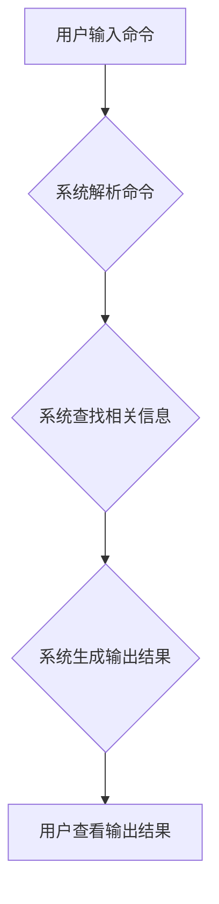

## CUI对信息架构设计的详细影响

> 关键词：CUI, 信息架构, 用户体验, 交互设计, 可访问性, 人机交互,  信息组织

## 1. 背景介绍

随着科技的飞速发展，人类与计算机的交互方式也在不断演变。传统的图形用户界面 (GUI) 已经逐渐被更直观、更自然的交互方式所取代，其中命令行界面 (CLI) 和自然语言界面 (NLI) 逐渐崭露头角。而作为一种介于 CLI 和 GUI 之间的全新交互方式，基于文本的交互界面 (CUI) 凭借其简洁、高效、可定制等特点，在近年来得到了广泛的关注和应用。

CUI 的出现对信息架构设计提出了新的挑战和机遇。传统的 GUI 依赖于视觉元素和图形化布局来组织信息，而 CUI 则更多地依赖于文本和命令来引导用户操作。因此，如何有效地利用文本信息来构建清晰、易懂、易于导航的信息架构，成为 CUI 设计的关键问题。

## 2. 核心概念与联系

### 2.1 信息架构

信息架构 (IA) 是指组织、结构化和标记信息以使其易于理解、查找和使用。它涉及到信息分类、标签、导航、搜索等多个方面，旨在为用户提供一个清晰、逻辑、易于浏览的信息空间。

### 2.2 CUI

CUI 是指基于文本的交互界面，用户通过输入文本命令或指令与系统进行交互。它通常以命令行或聊天窗口的形式呈现，并以文本形式返回结果。CUI 的特点包括：

* **简洁高效:** CUI 界面简洁明了，用户只需输入简单的命令即可完成操作，提高了操作效率。
* **可定制性强:** CUI 可以根据用户的需求进行定制，例如自定义命令、快捷键等，提高用户体验。
* **跨平台性:** CUI 界面通常与特定操作系统无关，可以在不同的平台上运行。
* **可访问性:** CUI 界面对视力障碍用户更加友好，可以通过语音合成和文本转语音等技术实现无障碍交互。

### 2.3 CUI与信息架构的联系

CUI 的文本化交互方式对信息架构设计提出了新的要求。传统的 GUI 依赖于视觉元素和图形化布局来组织信息，而 CUI 则需要通过文本命令、提示和输出结果来引导用户操作和理解信息。因此，CUI 信息架构的设计需要更加注重以下几个方面：

* **清晰简洁的命令结构:** CUI 命令应该简洁明了，易于理解和记忆。
* **合理的命令层次结构:** 命令应该按照逻辑层次进行组织，方便用户查找和使用。
* **有效的提示和帮助信息:** CUI 应该提供足够的提示和帮助信息，帮助用户理解命令和操作。
* **可预测的输出结果:** CUI 的输出结果应该清晰、准确、易于理解，并与用户的输入命令保持一致性。

**Mermaid 流程图**



## 3. 核心算法原理 & 具体操作步骤

### 3.1 算法原理概述

CUI 信息架构的核心算法主要涉及以下几个方面：

* **自然语言处理 (NLP):** 用于理解用户的自然语言输入，将其转换为系统可理解的指令。
* **知识图谱:** 用于存储和组织信息，并根据用户输入进行关联和查询。
* **信息检索:** 用于根据用户输入检索相关信息，并将其排序和展示。
* **文本生成:** 用于根据系统处理结果生成清晰、简洁的文本输出。

### 3.2 算法步骤详解

1. **用户输入命令:** 用户通过文本输入框输入命令或查询。
2. **命令解析:** 系统使用 NLP 算法解析用户的自然语言输入，识别命令类型、参数和意图。
3. **信息检索:** 根据解析后的命令信息，系统从知识图谱中检索相关信息。
4. **信息排序:** 系统根据检索结果的 relevance 和用户历史行为等因素对信息进行排序。
5. **文本生成:** 系统使用文本生成算法生成清晰、简洁的文本输出，并将其显示在用户界面中。

### 3.3 算法优缺点

**优点:**

* **高效准确:** NLP 算法可以理解用户的自然语言输入，提高信息检索的效率和准确性。
* **可扩展性强:** 知识图谱可以不断扩展和更新，支持更多类型的命令和信息。
* **用户友好:** 文本化交互方式更加直观、自然，提高了用户体验。

**缺点:**

* **NLP 算法复杂:** NLP 算法的训练和维护需要大量的计算资源和专业知识。
* **知识图谱构建困难:** 构建一个完整的知识图谱需要大量的语料和人工标注。
* **语义理解问题:** NLP 算法在理解复杂语义和上下文信息方面仍然存在挑战。

### 3.4 算法应用领域

CUI 信息架构算法在以下领域具有广泛的应用前景:

* **搜索引擎:** 提高搜索结果的准确性和相关性。
* **智能客服:** 提供更自然、更智能的客户服务体验。
* **虚拟助理:** 帮助用户完成各种任务，例如日程安排、信息查询等。
* **编程工具:** 提供更便捷、更高效的编程体验。

## 4. 数学模型和公式 & 详细讲解 & 举例说明

### 4.1 数学模型构建

CUI 信息架构的数学模型可以基于信息检索和文本分类等领域的研究成果构建。例如，可以使用 TF-IDF (Term Frequency-Inverse Document Frequency) 模型来计算信息检索的 relevance，并使用支持向量机 (SVM) 或深度学习模型来进行文本分类。

### 4.2 公式推导过程

**TF-IDF 公式:**

$$TF-IDF(t, d) = TF(t, d) \times IDF(t)$$

其中:

* $TF(t, d)$ 表示词语 $t$ 在文档 $d$ 中的词频。
* $IDF(t)$ 表示词语 $t$ 在整个语料库中的逆文档频率。

**SVM 分类公式:**

$$f(x) = \text{sign}(\sum_{i=1}^{n} \alpha_i y_i K(x_i, x) + b)$$

其中:

* $x$ 是待分类的样本。
* $x_i$ 是训练样本。
* $y_i$ 是训练样本的类别标签。
* $\alpha_i$ 是 SVM 模型的参数。
* $K(x_i, x)$ 是核函数。
* $b$ 是 SVM 模型的偏置项。

### 4.3 案例分析与讲解

**案例:** 假设我们有一个 CUI 系统用于搜索书籍信息。用户输入 "人工智能" 作为查询词。

**TF-IDF 应用:**

系统会根据用户输入的查询词 "人工智能" 在书籍标题、作者、摘要等文本中计算 TF-IDF 值，并选择 TF-IDF 值最高的书籍作为检索结果。

**SVM 应用:**

系统可以训练一个 SVM 模型，使用书籍的文本特征作为输入，并根据书籍的类别标签进行分类。当用户输入 "人工智能" 时，系统会将该词语作为输入，并根据 SVM 模型的预测结果返回相关书籍类别。

## 5. 项目实践：代码实例和详细解释说明

### 5.1 开发环境搭建

* 操作系统: Linux/macOS/Windows
* 编程语言: Python
* 依赖库:

    * NLTK (自然语言处理)
    * SpaCy (自然语言处理)
    * Gensim (主题建模)
    * Flask (Web 框架)

### 5.2 源代码详细实现

```python
from flask import Flask, request, jsonify

app = Flask(__name__)

#... (NLP 模型加载和知识图谱构建代码)

@app.route('/search', methods=['POST'])
def search():
    query = request.json.get('query')
    #... (使用 NLP 模型解析用户查询)
    results = search_knowledge_graph(query)
    return jsonify(results)

if __name__ == '__main__':
    app.run(debug=True)
```

### 5.3 代码解读与分析

* **Flask 框架:** 使用 Flask 框架构建一个简单的 Web 应用程序，提供 RESTful API 接口。
* **NLP 模型:** 使用 NLTK 或 SpaCy 等 NLP 库加载预训练模型，用于解析用户输入的自然语言查询。
* **知识图谱:** 使用 Gensim 或其他工具构建知识图谱，存储和组织信息。
* **信息检索:** 根据用户查询，从知识图谱中检索相关信息。
* **API 接口:** 提供 `/search` 接口，接收用户查询并返回检索结果。

### 5.4 运行结果展示

当用户向 CUI 系统发送 "人工智能" 作为查询词时，系统会返回与 "人工智能" 相关的书籍信息，例如书籍标题、作者、摘要等。

## 6. 实际应用场景

### 6.1 智能客服

CUI 可以用于构建智能客服系统，帮助用户解决常见问题，例如查询订单状态、修改个人信息等。

### 6.2 命令行工具

CUI 可以用于构建命令行工具，例如文本编辑器、代码编译器等，提供更便捷、更高效的操作体验。

### 6.3 数据分析

CUI 可以用于数据分析，帮助用户通过文本命令查询和分析数据，例如统计数据、生成图表等。

### 6.4 未来应用展望

随着 NLP 和 AI 技术的不断发展，CUI 信息架构将在更多领域得到应用，例如：

* **个性化学习:** 提供个性化的学习体验，根据用户的学习进度和需求提供相应的学习内容和指导。
* **医疗诊断:** 帮助医生进行疾病诊断，例如根据用户的症状和病史进行分析和判断。
* **科学研究:** 帮助科学家进行数据分析和模型构建，加速科学研究的进程。

## 7. 工具和资源推荐

### 7.1 学习资源推荐

* **书籍:**

    * "Speech and Language Processing" by Jurafsky and Martin
    * "Natural Language Processing with Python" by Bird, Klein, and Loper

* **在线课程:**

    * Coursera: Natural Language Processing Specialization
    * edX: Artificial Intelligence

### 7.2 开发工具推荐

* **Python:** 广泛应用于 NLP 和 AI 开发。
* **NLTK:** Python 的自然语言处理库。
* **SpaCy:** 高性能的 Python 自然语言处理库。
* **Gensim:** 主题建模和词嵌入库。
* **Flask:** Python 的 Web 框架。

### 7.3 相关论文推荐

* "BERT: Pre-training of Deep Bidirectional Transformers for Language Understanding"
* "Attention Is All You Need"
* "A Survey of Text Summarization Methods"

## 8. 总结：未来发展趋势与挑战

### 8.1 研究成果总结

CUI 信息架构的研究取得了显著进展，NLP 和 AI 技术的不断发展为 CUI 的应用提供了强大的技术支撑。

### 8.2 未来发展趋势

* **更智能的 CUI:** 利用深度学习等先进算法，构建更智能的 CUI 系统，能够理解更复杂的自然语言输入，并提供更个性化的服务。
* **多模态 CUI:** 将文本与其他模态信息 (例如语音、图像、视频) 相结合，构建更丰富的 CUI 体验。
* **跨平台 CUI:** 打破平台限制，实现 CUI 的跨平台应用。

### 8.3 面临的挑战

* **语义理解问题:** CUI 系统在理解复杂语义和上下文信息方面仍然存在挑战。
* **数据标注问题:** 训练高质量的 NLP 模型需要大量的标注数据，而数据标注成本较高。
* **可解释性问题:** 深度学习模型的决策过程难以解释，这可能会影响 CUI 系统的信任度。

### 8.4 研究展望

未来 CUI 信息架构的研究将继续探索以下方向:

* **更有效的语义理解方法:** 研究更有效的语义理解方法，例如基于知识图谱的语义理解、基于