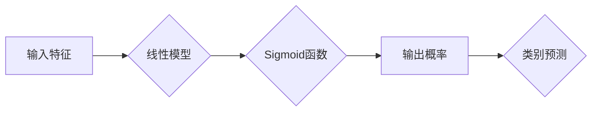

## Python机器学习实战：逻辑回归在分类问题中的应用

> 关键词：逻辑回归、机器学习、分类问题、Python、scikit-learn、线性模型、概率模型

## 1. 背景介绍

在当今数据爆炸的时代，机器学习作为一种强大的数据分析工具，在各个领域得到了广泛应用。其中，分类问题是机器学习中最常见且重要的任务之一，它旨在将数据点划分为预定义的类别。逻辑回归作为一种经典的分类算法，凭借其简单易懂、易于实现和解释的优势，在许多实际应用场景中表现出色。

本文将深入探讨逻辑回归算法在分类问题中的应用，从核心概念和原理到代码实现和实际应用场景，全面介绍逻辑回归的知识体系。通过结合Python语言和scikit-learn库，我们将带领读者一步步理解和掌握逻辑回归算法，并激发读者对机器学习的兴趣和探索精神。

## 2. 核心概念与联系

### 2.1 逻辑回归的本质

逻辑回归是一种用于二分类问题的线性模型，它通过学习输入特征与输出类别之间的关系，预测数据点属于特定类别的概率。虽然名字中包含“回归”，但逻辑回归实际上是一种分类算法，它将线性模型的输出映射到0到1之间的概率区间，从而实现对类别进行预测。

### 2.2 逻辑回归与线性回归的关系

逻辑回归和线性回归都是线性模型，但它们在输出结果和应用场景上有所区别。

* **线性回归**：预测连续数值输出，例如房价、温度等。
* **逻辑回归**：预测离散类别输出，例如是否购买商品、是否患病等。

逻辑回归通过Sigmoid函数将线性模型的输出映射到概率区间，从而实现对类别进行预测。

### 2.3 逻辑回归的流程图



## 3. 核心算法原理 & 具体操作步骤

### 3.1 算法原理概述

逻辑回归的核心思想是使用Sigmoid函数将线性模型的输出映射到概率区间，从而实现对类别进行预测。Sigmoid函数的输出范围为0到1，可以被解释为数据点属于特定类别的概率。

### 3.2 算法步骤详解

1. **数据预处理**: 对输入数据进行清洗、转换和特征工程，例如处理缺失值、编码类别特征等。
2. **模型训练**: 使用训练数据训练逻辑回归模型，通过最大似然估计法求解模型参数，使得模型能够最大化预测正确率。
3. **模型评估**: 使用测试数据评估模型的性能，常用的评估指标包括准确率、召回率、F1-score等。
4. **模型调参**: 根据模型评估结果，调整模型参数，例如学习率、正则化参数等，以提高模型性能。
5. **模型部署**: 将训练好的模型部署到实际应用场景中，用于对新数据进行预测。

### 3.3 算法优缺点

**优点**:

* **简单易懂**: 逻辑回归模型结构简单，易于理解和解释。
* **易于实现**: 逻辑回归算法的实现代码简洁易写，可以使用现成的机器学习库进行快速实现。
* **解释性强**: 逻辑回归模型的系数可以解释为特征对输出的影响程度，有助于理解模型的决策边界。

**缺点**:

* **假设线性关系**: 逻辑回归假设输入特征与输出类别之间存在线性关系，对于非线性关系的数据可能效果不佳。
* **容易过拟合**: 当训练数据量较小或特征数量较多时，逻辑回归模型容易过拟合训练数据，导致泛化能力下降。
* **只能处理二分类问题**: 逻辑回归只能处理二分类问题，对于多分类问题需要进行扩展。

### 3.4 算法应用领域

逻辑回归在各个领域都有广泛的应用，例如：

* **金融**: 欺诈检测、信用评分、客户流失预测
* **医疗**: 疾病诊断、患者风险评估、药物副作用预测
* **电商**: 商品推荐、用户画像、点击率预测
* **广告**: 广告点击率预测、用户兴趣分析、广告投放优化

## 4. 数学模型和公式 & 详细讲解 & 举例说明

### 4.1 数学模型构建

逻辑回归模型的数学模型可以表示为：

$$
p(y=1|x) = \frac{1}{1 + e^{-(w^T x + b)}}
$$

其中：

* $p(y=1|x)$ 表示数据点 $x$ 属于类别 1 的概率。
* $w$ 是模型参数向量，代表特征的权重。
* $x$ 是输入特征向量。
* $b$ 是模型参数，代表偏置项。
* $e$ 是自然对数的底数。

### 4.2 公式推导过程

逻辑回归模型的输出概率 $p(y=1|x)$ 通过Sigmoid函数将线性模型的输出映射到0到1之间的区间。Sigmoid函数的表达式为：

$$
\sigma(z) = \frac{1}{1 + e^{-z}}
$$

其中 $z = w^T x + b$ 是线性模型的输出。

### 4.3 案例分析与讲解

假设我们有一个二分类问题，用于预测用户是否会点击广告。输入特征包括用户年龄、性别、浏览历史等。

我们可以使用逻辑回归模型来学习用户特征与点击行为之间的关系。通过训练模型，得到模型参数 $w$ 和 $b$。

对于一个新的用户，我们可以输入其特征向量 $x$，计算 $z = w^T x + b$，然后通过Sigmoid函数得到该用户点击广告的概率 $p(y=1|x)$。

如果 $p(y=1|x) > 0.5$，则预测该用户会点击广告；否则，预测该用户不会点击广告。

## 5. 项目实践：代码实例和详细解释说明

### 5.1 开发环境搭建

本项目使用Python语言和scikit-learn库进行实现。

需要安装Python和scikit-learn库。

```bash
pip install scikit-learn
```

### 5.2 源代码详细实现

```python
from sklearn.linear_model import LogisticRegression
from sklearn.model_selection import train_test_split
from sklearn.metrics import accuracy_score

# 加载数据
#...

# 将数据分为训练集和测试集
X_train, X_test, y_train, y_test = train_test_split(X, y, test_size=0.2, random_state=42)

# 创建逻辑回归模型
model = LogisticRegression()

# 训练模型
model.fit(X_train, y_train)

# 预测测试集结果
y_pred = model.predict(X_test)

# 计算模型准确率
accuracy = accuracy_score(y_test, y_pred)
print(f"模型准确率: {accuracy}")
```

### 5.3 代码解读与分析

1. **导入库**: 导入必要的库，包括逻辑回归模型、数据分割、模型评估等。
2. **加载数据**: 加载训练数据和测试数据。
3. **数据分割**: 将数据分为训练集和测试集，用于模型训练和评估。
4. **创建模型**: 创建逻辑回归模型实例。
5. **模型训练**: 使用训练数据训练模型，学习模型参数。
6. **预测测试集**: 使用训练好的模型预测测试集结果。
7. **模型评估**: 计算模型准确率，评估模型性能。

### 5.4 运行结果展示

运行代码后，会输出模型的准确率。

## 6. 实际应用场景

### 6.1 欺诈检测

逻辑回归可以用于检测信用卡欺诈交易。通过学习用户交易行为特征，例如交易金额、交易时间、交易地点等，模型可以识别异常交易，从而降低欺诈风险。

### 6.2 医疗诊断

逻辑回归可以用于辅助医生诊断疾病。通过学习患者症状、病史、检查结果等特征，模型可以预测患者患病概率，帮助医生做出更准确的诊断。

### 6.3 客户流失预测

逻辑回归可以用于预测客户流失风险。通过学习客户行为特征，例如购买频率、消费金额、客户服务交互等，模型可以识别高风险客户，从而采取措施挽留客户。

### 6.4 未来应用展望

随着机器学习技术的不断发展，逻辑回归在更多领域将发挥重要作用。例如，在个性化推荐、自然语言处理、图像识别等领域，逻辑回归可以作为基础模型，与其他机器学习算法结合，实现更强大的应用。

## 7. 工具和资源推荐

### 7.1 学习资源推荐

* **书籍**:
    * 《Python机器学习实战》
    * 《机器学习》
* **在线课程**:
    * Coursera: Machine Learning
    * edX: Introduction to Artificial Intelligence

### 7.2 开发工具推荐

* **Python**: 
* **scikit-learn**: Python机器学习库
* **TensorFlow**: 深度学习框架
* **PyTorch**: 深度学习框架

### 7.3 相关论文推荐

* **Logistic Regression: A Review**
* **A Gentle Introduction to Logistic Regression**

## 8. 总结：未来发展趋势与挑战

### 8.1 研究成果总结

逻辑回归作为一种经典的分类算法，在实际应用中取得了显著的成果。其简单易懂、易于实现和解释的优势使其成为许多机器学习任务的首选算法。

### 8.2 未来发展趋势

未来，逻辑回归的研究将继续朝着以下方向发展：

* **提升模型性能**: 研究新的优化算法和正则化方法，提高逻辑回归模型的准确率和泛化能力。
* **扩展应用场景**: 将逻辑回归应用于更多领域，例如自然语言处理、图像识别等。
* **结合深度学习**: 将逻辑回归与深度学习算法结合，构建更强大的机器学习模型。

### 8.3 面临的挑战

逻辑回归也面临一些挑战：

* **处理非线性关系**: 逻辑回归假设输入特征与输出类别之间存在线性关系，对于非线性关系的数据可能效果不佳。
* **过拟合问题**: 当训练数据量较小或特征数量较多时，逻辑回归模型容易过拟合训练数据，导致泛化能力下降。

### 8.4 研究展望

未来，研究人员将继续探索新的方法来解决逻辑回归面临的挑战，例如使用核函数扩展模型的表达能力、使用正则化技术防止过拟合等。

## 9. 附录：常见问题与解答

### 9.1 如何选择逻辑回归的正则化参数？

正则化参数的选择需要根据实际数据和模型性能进行调整。常用的方法包括交叉验证和网格搜索。

### 9.2 如何处理逻辑回归模型的过拟合问题？

可以使用正则化技术、数据增强、模型简化等方法来解决逻辑回归模型的过拟合问题。

### 9.3 逻辑回归模型的输出结果如何解释？

逻辑回归模型的输出结果是一个概率值，表示数据点属于特定类别的概率。

作者：禅与计算机程序设计艺术 / Zen and the Art of Computer Programming


