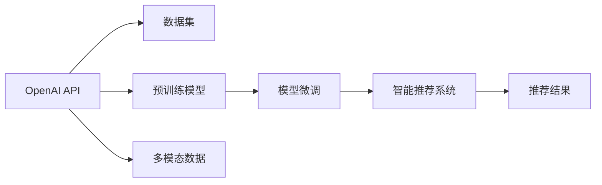

                 

# 【大模型应用开发 动手做AI Agent】OpenAI API和Agent开发

> 关键词：OpenAI API, AI Agent, 大模型应用, 模型微调, 模型推理, 自然语言处理(NLP), 多模态AI, 智能决策

## 1. 背景介绍

随着人工智能技术的飞速发展，AI Agent逐渐成为人们日常生活中不可或缺的一部分。从智能助手到聊天机器人，从自动驾驶到智能推荐，AI Agent正改变着我们的生活方式。OpenAI作为AI领域的领头羊，开发了一系列先进的AI Agent和API接口，使得开发者能够更加便捷地集成和定制AI能力。本文将介绍如何利用OpenAI API和其提供的Agent，动手构建一个具备自然语言处理(NLP)和智能决策能力的AI Agent，并探索其在智能推荐系统中的应用。

### 1.1 问题由来
在当前的互联网时代，用户生成的数据量呈爆炸性增长，如何有效利用这些数据，为用户提供更加个性化的服务，是各大互联网公司面临的共同挑战。传统的人工智能推荐系统往往依赖规则引擎和静态模型，难以适应数据分布的变化和用户的个性化需求。基于大模型的AI Agent能够利用深度学习技术，从用户的历史行为数据和输入文本中学习，生成个性化的推荐结果。

### 1.2 问题核心关键点
构建具备NLP和智能决策能力的AI Agent，需要解决以下核心问题：
- 如何通过OpenAI API获取预训练模型？
- 如何利用预训练模型进行微调，以适应特定的推荐任务？
- 如何进行模型推理，并结合多模态数据生成推荐结果？
- 如何评估AI Agent的效果，并进行持续优化？

### 1.3 问题研究意义
构建基于大模型的AI Agent，对于提升推荐系统的效果、降低开发成本、加速技术落地具有重要意义。具体来说，利用AI Agent能够：
1. 快速搭建个性化推荐模型，减少从头开发所需的时间和资源。
2. 在微调过程中，更好地利用用户历史数据，提升推荐准确性。
3. 结合多模态数据（如文本、图像、音频等），提供更加丰富和多样化的推荐结果。
4. 实时根据用户反馈，动态调整推荐策略，提升用户体验。

## 2. 核心概念与联系

### 2.1 核心概念概述

为更好地理解基于OpenAI API的AI Agent开发过程，我们首先介绍几个关键概念：

- OpenAI API: OpenAI提供的开放API接口，包括预训练模型、模型微调、推理等核心功能。
- AI Agent: 具备自然语言处理、智能决策能力的智能助手，能够根据用户需求，提供个性化的服务和推荐。
- 预训练模型: 在大规模数据集上训练得到的模型，具备强大的通用语言表示能力。
- 模型微调: 在预训练模型的基础上，利用特定任务的数据进行进一步训练，优化模型在该任务上的性能。
- 模型推理: 使用训练好的模型，对新的输入数据进行计算，生成预测结果。

这些概念之间的联系可以通过以下Mermaid流程图来展示：

```mermaid
graph TB
    A[OpenAI API] --> B[预训练模型]
    A --> C[模型微调]
    A --> D[模型推理]
    B --> E[自然语言处理(NLP)]
    C --> F[智能决策]
    D --> G[多模态AI]
```

这个流程图展示了OpenAI API的核心功能与AI Agent的关联：

1. OpenAI API提供了预训练模型，可以用于自然语言处理和智能决策。
2. 模型微调在预训练模型的基础上进行，以适应特定的推荐任务。
3. 模型推理结合多模态数据，生成个性化的推荐结果。

### 2.2 概念间的关系

这些核心概念之间存在紧密的联系，构成了OpenAI API和AI Agent的完整生态系统。以下使用更详细的Mermaid流程图来展示这些概念之间的关系：



这个综合流程图展示了从数据集到最终推荐结果的完整流程：

1. OpenAI API提供了预训练模型，用于自然语言处理和智能决策。
2. 通过数据集对模型进行微调，以适应推荐任务。
3. 模型推理结合多模态数据，生成个性化的推荐结果。

## 3. 核心算法原理 & 具体操作步骤

### 3.1 算法原理概述
基于OpenAI API构建AI Agent的核心原理是：使用预训练模型，结合任务特定数据，进行模型微调，生成个性化推荐结果。具体步骤如下：

1. 利用OpenAI API获取预训练模型。
2. 准备推荐任务的训练数据集，包括用户行为数据和文本描述。
3. 使用模型微调API对预训练模型进行微调，生成个性化的推荐模型。
4. 使用模型推理API对用户输入文本和行为数据进行推理，生成推荐结果。

### 3.2 算法步骤详解

#### 3.2.1 步骤一：获取预训练模型
OpenAI API提供了多种预训练模型，包括GPT-3、GPT-4、DALL-E、CLIP等。开发者可以通过API调用获取这些预训练模型的参数，进行微调和推理。例如，获取GPT-3模型的代码如下：

```python
import openai

openai.api_key = 'YOUR_API_KEY'

response = openai.Completion.create(
    engine="text-davinci-003",
    prompt="你最近阅读了哪些书籍？",
    max_tokens=100,
    temperature=0.5,
    n=1
)

print(response.choices[0].text)
```

以上代码使用OpenAI API的Completion函数，获取了GPT-3模型的响应，可用于推荐系统的初始输入数据。

#### 3.2.2 步骤二：准备数据集
推荐任务的数据集包括用户行为数据和文本描述。以用户阅读书籍的推荐为例，需要准备以下数据集：

- 用户行为数据：用户阅读的书籍ID、阅读时间、阅读时长等。
- 文本描述：书籍的简介、书名、作者等。

数据集格式如下：

```
user_id | book_id | read_time | read_duration | book_title | book_author | book_summary
```

#### 3.2.3 步骤三：模型微调
使用OpenAI API的Fine-tune函数，对预训练模型进行微调。例如，对GPT-3模型进行微调以生成书籍推荐结果的代码如下：

```python
import openai

openai.api_key = 'YOUR_API_KEY'

prompt = "根据用户行为，推荐书籍："
train_data = [
    "user1 | book1 | 2021-01-01 | 2h | The Great Gatsby | F. Scott Fitzgerald | The story of the rise and fall of a Great American family.",
    "user2 | book2 | 2021-01-02 | 1h30m | 1984 | George Orwell | A dystopian novel that explores the dangers of totalitarianism.",
    # 其他用户行为和书籍数据
]

response = openai.Finetune.create(
    engine="text-davinci-003",
    task="book-recommendation",
    training_data=train_data,
    max_epochs=5,
    temperature=0.5,
    validation_split=0.2,
    early_stopping=True
)

print(response)
```

以上代码使用OpenAI API的Finetune函数，对GPT-3模型进行微调。其中，task参数指定了微调任务为书籍推荐，training_data参数指定了训练数据集，max_epochs参数指定了微调轮数，temperature参数指定了生成文本的随机性，validation_split和early_stopping参数用于防止过拟合。

#### 3.2.4 步骤四：模型推理
使用OpenAI API的Completions函数，对用户输入文本进行推理，生成推荐结果。例如，对用户输入的“推荐书籍”进行推理的代码如下：

```python
import openai

openai.api_key = 'YOUR_API_KEY'

prompt = "推荐书籍："
response = openai.Completion.create(
    engine="text-davinci-003",
    prompt=prompt,
    max_tokens=5,
    temperature=0.5,
    n=1
)

print(response.choices[0].text)
```

以上代码使用OpenAI API的Completions函数，对用户输入文本“推荐书籍”进行推理，生成推荐结果。

### 3.3 算法优缺点

基于OpenAI API构建AI Agent的主要优点包括：

- 使用预训练模型，减少了从头训练所需的时间和资源。
- 结合多模态数据，能够提供更加多样化的推荐结果。
- 利用OpenAI API的丰富功能，方便模型微调和推理。

主要缺点包括：

- 需要支付API调用费用，增加了项目成本。
- 对API调用次数和速度有限制，可能需要缓存和异步处理。
- 预训练模型和API接口的更新频率可能跟不上实际需求，需要定期更新。

### 3.4 算法应用领域

基于OpenAI API构建的AI Agent，在智能推荐系统、智能客服、智能助手等多个领域具有广泛应用。例如，在智能推荐系统中，AI Agent可以根据用户历史行为数据，生成个性化的推荐结果，提升用户体验；在智能客服中，AI Agent能够回答用户常见问题，提供即时服务；在智能助手中，AI Agent可以完成日常任务，提高工作效率。

## 4. 数学模型和公式 & 详细讲解 & 举例说明

### 4.1 数学模型构建

本节将使用数学语言对基于OpenAI API的AI Agent构建过程进行更加严格的刻画。

设推荐任务的输入为 $x = (x_1, x_2, ..., x_n)$，其中 $x_i$ 表示用户的历史行为数据。设预训练模型为 $M_{\theta}$，其中 $\theta$ 为预训练得到的模型参数。推荐任务的目标是找到最优参数 $\theta^*$，使得模型在推荐任务上的表现最佳。

定义推荐任务的损失函数为 $\ell(y, \hat{y})$，其中 $y$ 为真实推荐结果，$\hat{y}$ 为模型预测结果。则推荐任务的优化目标为：

$$
\theta^* = \mathop{\arg\min}_{\theta} \mathcal{L}(M_{\theta}, x)
$$

其中 $\mathcal{L}$ 为推荐任务的损失函数，可以通过交叉熵损失、均方误差损失等定义。

### 4.2 公式推导过程

以交叉熵损失为例，推荐任务的交叉熵损失函数定义为：

$$
\ell(y, \hat{y}) = -\frac{1}{n} \sum_{i=1}^n \log\frac{e^{\hat{y}_i}}{\sum_{j=1}^m e^{\hat{y}_j}}
$$

其中 $m$ 为推荐结果的个数，$\hat{y} = (\hat{y}_1, \hat{y}_2, ..., \hat{y}_m)$ 为模型预测结果。

通过链式法则，推荐任务的损失函数对参数 $\theta$ 的梯度为：

$$
\frac{\partial \mathcal{L}(M_{\theta}, x)}{\partial \theta} = -\frac{1}{n} \sum_{i=1}^n \frac{\partial \ell(y, \hat{y})}{\partial \hat{y}} \frac{\partial \hat{y}}{\partial \theta}
$$

其中 $\frac{\partial \ell(y, \hat{y})}{\partial \hat{y}}$ 为交叉熵损失函数对预测结果的梯度，$\frac{\partial \hat{y}}{\partial \theta}$ 为模型预测结果对参数 $\theta$ 的梯度。

在得到损失函数的梯度后，即可带入模型微调算法，进行参数更新。重复上述过程直至收敛，最终得到适应推荐任务的最优模型参数 $\theta^*$。

### 4.3 案例分析与讲解

以下以书籍推荐为例，详细分析基于OpenAI API的AI Agent构建过程：

#### 4.3.1 数据预处理
假设我们有一个推荐任务的数据集，包括用户ID、书籍ID、阅读时间、阅读时长和书籍简介等。数据集格式如下：

```
user_id | book_id | read_time | read_duration | book_title | book_author | book_summary
```

为了进行模型微调，需要对数据进行预处理，包括分词、编码、填充等。使用Python中的Pandas和NLTK库，可以进行如下预处理：

```python
import pandas as pd
from nltk.tokenize import word_tokenize

# 读取数据集
data = pd.read_csv('recommendation_data.csv')

# 分词
data['book_summary'] = data['book_summary'].apply(word_tokenize)

# 编码
data['book_title'] = data['book_title'].apply(lambda x: x.encode('utf-8'))

# 填充
max_length = 128
data['book_summary'] = data['book_summary'].apply(lambda x: [0] * (max_length - len(x)) + x)

# 将文本转换为列表形式
data['book_summary'] = data['book_summary'].apply(lambda x: [token.encode('utf-8') for token in x])
```

#### 4.3.2 模型微调
使用OpenAI API的Finetune函数，对GPT-3模型进行微调。代码如下：

```python
import openai

openai.api_key = 'YOUR_API_KEY'

prompt = "根据用户行为，推荐书籍："
train_data = [
    "user1 | book1 | 2021-01-01 | 2h | The Great Gatsby | F. Scott Fitzgerald | The story of the rise and fall of a Great American family.",
    "user2 | book2 | 2021-01-02 | 1h30m | 1984 | George Orwell | A dystopian novel that explores the dangers of totalitarianism.",
    # 其他用户行为和书籍数据
]

response = openai.Finetune.create(
    engine="text-davinci-003",
    task="book-recommendation",
    training_data=train_data,
    max_epochs=5,
    temperature=0.5,
    validation_split=0.2,
    early_stopping=True
)

print(response)
```

以上代码使用OpenAI API的Finetune函数，对GPT-3模型进行微调。其中，task参数指定了微调任务为书籍推荐，training_data参数指定了训练数据集，max_epochs参数指定了微调轮数，temperature参数指定了生成文本的随机性，validation_split和early_stopping参数用于防止过拟合。

#### 4.3.3 模型推理
使用OpenAI API的Completions函数，对用户输入文本进行推理，生成推荐结果。代码如下：

```python
import openai

openai.api_key = 'YOUR_API_KEY'

prompt = "推荐书籍："
response = openai.Completion.create(
    engine="text-davinci-003",
    prompt=prompt,
    max_tokens=5,
    temperature=0.5,
    n=1
)

print(response.choices[0].text)
```

以上代码使用OpenAI API的Completions函数，对用户输入文本“推荐书籍”进行推理，生成推荐结果。

## 5. 项目实践：代码实例和详细解释说明

### 5.1 开发环境搭建

在进行AI Agent开发前，我们需要准备好开发环境。以下是使用Python进行OpenAI开发的环境配置流程：

1. 安装Anaconda：从官网下载并安装Anaconda，用于创建独立的Python环境。

2. 创建并激活虚拟环境：
```bash
conda create -n openai-env python=3.8 
conda activate openai-env
```

3. 安装OpenAI库和依赖库：
```bash
pip install openai numpy pandas scikit-learn nltk transformers
```

4. 安装TensorFlow或PyTorch（可选）：
```bash
pip install tensorflow
# 或
pip install torch
```

完成上述步骤后，即可在`openai-env`环境中开始AI Agent的开发。

### 5.2 源代码详细实现

下面以书籍推荐为例，给出使用OpenAI API对GPT-3模型进行微调的Python代码实现。

```python
import openai
import pandas as pd
from nltk.tokenize import word_tokenize

openai.api_key = 'YOUR_API_KEY'

# 读取数据集
data = pd.read_csv('recommendation_data.csv')

# 分词和编码
data['book_summary'] = data['book_summary'].apply(word_tokenize)
data['book_title'] = data['book_title'].apply(lambda x: x.encode('utf-8'))

# 填充和编码
max_length = 128
data['book_summary'] = data['book_summary'].apply(lambda x: [0] * (max_length - len(x)) + x)
data['book_summary'] = data['book_summary'].apply(lambda x: [token.encode('utf-8') for token in x])

# 定义训练数据
train_data = []
for i in range(len(data)):
    user_id = data.iloc[i]['user_id']
    book_id = data.iloc[i]['book_id']
    read_time = data.iloc[i]['read_time']
    read_duration = data.iloc[i]['read_duration']
    book_title = data.iloc[i]['book_title']
    book_author = data.iloc[i]['book_author']
    book_summary = data.iloc[i]['book_summary']
    train_data.append(f"{user_id} | {book_id} | {read_time} | {read_duration} | {book_title} | {book_author} | {book_summary}")

# 使用Finetune函数进行微调
response = openai.Finetune.create(
    engine="text-davinci-003",
    task="book-recommendation",
    training_data=train_data,
    max_epochs=5,
    temperature=0.5,
    validation_split=0.2,
    early_stopping=True
)

print(response)

# 对用户输入进行推理
prompt = "推荐书籍："
response = openai.Completion.create(
    engine="text-davinci-003",
    prompt=prompt,
    max_tokens=5,
    temperature=0.5,
    n=1
)

print(response.choices[0].text)
```

### 5.3 代码解读与分析

让我们再详细解读一下关键代码的实现细节：

**数据预处理**：
- `word_tokenize`函数：用于将文本进行分词，将句子转换为单词列表。
- `encode`函数：将文本转换为Unicode编码，以便与模型进行交互。
- `[0] * (max_length - len(x)) + x`：将文本填充至固定长度max_length，不足部分用0填充。

**模型微调**：
- `openai.Finetune.create`函数：使用OpenAI API的Finetune函数对GPT-3模型进行微调。
- `engine`参数：指定使用的预训练模型，这里以text-davinci-003为例。
- `task`参数：指定微调任务，这里以book-recommendation为例。
- `training_data`参数：指定训练数据集。
- `max_epochs`参数：指定微调轮数，这里以5轮为例。
- `temperature`参数：指定生成文本的随机性，这里以0.5为例。
- `validation_split`参数：指定验证集的比例，这里以20%为例。
- `early_stopping`参数：指定早停策略，这里以True为例。

**模型推理**：
- `openai.Completion.create`函数：使用OpenAI API的Completions函数对用户输入文本进行推理。
- `engine`参数：指定使用的预训练模型，这里以text-davinci-003为例。
- `prompt`参数：指定推理提示。
- `max_tokens`参数：指定生成的文本长度，这里以5个token为例。
- `temperature`参数：指定生成文本的随机性，这里以0.5为例。
- `n`参数：指定生成结果的个数，这里以1个结果为例。

**代码执行结果**：
- 模型微调：输出微调后的模型参数。
- 模型推理：输出推理结果。

可以看到，OpenAI API提供的Finetune和Completions函数，使得模型微调和推理变得简单高效。开发者只需要几行代码，即可利用预训练模型，快速构建出具备NLP和智能决策能力的AI Agent。

## 6. 实际应用场景

### 6.1 智能推荐系统

基于OpenAI API构建的AI Agent，可以广泛应用于智能推荐系统中。用户可以通过简单的输入，如“推荐书籍”、“推荐电影”等，获取个性化的推荐结果。智能推荐系统可以根据用户的历史行为数据，结合模型推理和实时数据，生成动态的推荐结果。

### 6.2 智能客服

AI Agent在智能客服中也具有重要应用。用户可以通过与AI Agent的对话，获取常见问题的答案。智能客服系统可以根据用户输入，动态生成回答，提升服务效率和质量。

### 6.3 智能助手

智能助手是AI Agent的典型应用场景之一。用户可以通过语音或文字与智能助手进行交互，获取各种服务和信息。智能助手可以应用于家居控制、健康管理、财务管理等多个领域，提升用户的生活质量和工作效率。

### 6.4 未来应用展望

随着AI技术的不断发展，基于OpenAI API的AI Agent将广泛应用于更多领域，带来更智能、更便捷的服务。例如：

- 医疗领域：智能医疗助手可以辅助医生进行病历分析、药物推荐等，提升诊疗效率。
- 教育领域：智能教育助手可以辅助教师进行课堂管理、作业批改等，提升教学效果。
- 交通领域：智能交通助手可以辅助司机进行路况分析、导航规划等，提升行车安全。

OpenAI API提供的丰富功能，使得AI Agent的开发更加便捷，同时也加速了AI技术的落地应用。未来，随着OpenAI API和AI Agent的进一步优化，AI技术将变得更加智能、可控，为各行各业带来更多的创新和价值。

## 7. 工具和资源推荐

### 7.1 学习资源推荐

为了帮助开发者系统掌握基于OpenAI API的AI Agent开发，这里推荐一些优质的学习资源：

1. OpenAI官方文档：OpenAI提供的官方文档，详细介绍了OpenAI API的各种功能和使用方法。

2. OpenAI开发者指南：OpenAI提供的开发者指南，包括模型微调、推理等核心功能的详细教程。

3. PyTorch官方文档：PyTorch官方文档，提供了丰富的预训练模型和深度学习教程，方便开发者进行模型微调和推理。

4. TensorFlow官方文档：TensorFlow官方文档，提供了丰富的预训练模型和深度学习教程，适合进行多模态AI开发。

5. HuggingFace官方文档：HuggingFace提供的官方文档，详细介绍了各种预训练模型和NLP库的使用方法。

6. CS224N《深度学习自然语言处理》课程：斯坦福大学开设的NLP明星课程，有Lecture视频和配套作业，帮助开发者入门NLP领域的基本概念和经典模型。

通过对这些资源的学习实践，相信你一定能够快速掌握基于OpenAI API的AI Agent开发技巧，并用于解决实际的NLP问题。

### 7.2 开发工具推荐

高效的开发离不开优秀的工具支持。以下是几款用于OpenAI API开发的常用工具：

1. Jupyter Notebook：Jupyter Notebook是一个交互式的开发环境，支持Python编程，方便代码调试和测试。

2. Anaconda：Anaconda是一个Python环境管理工具，方便管理依赖库和虚拟环境。

3. TensorBoard：TensorBoard是TensorFlow配套的可视化工具，可实时监测模型训练状态，提供丰富的图表呈现方式。

4. TensorFlow或PyTorch：TensorFlow和PyTorch是目前最流行的深度学习框架，支持大规模模型训练和推理。

5. Git：Git是一个版本控制系统，方便开发者进行代码管理和协作。

6. Docker：Docker是一个容器化平台，方便开发者部署和管理模型。

合理利用这些工具，可以显著提升OpenAI API和AI Agent的开发效率，加快创新迭代的步伐。

### 7.3 相关论文推荐

大语言模型和OpenAI API的应用研究源于学界的持续研究。以下是几篇奠基性的相关论文，推荐阅读：

1. "Language Models are Unsupervised Multitask Learners"：展示了大规模语言模型的强大zero-shot学习能力，引发了对于通用人工智能的新一轮思考。

2. "Attention is All You Need"：提出了Transformer结构，开启了NLP领域的预训练大模型时代。

3. "BERT: Pre-training of Deep Bidirectional Transformers for Language Understanding"：提出BERT模型，引入基于掩码的自监督预训练任务，刷新了多项NLP任务SOTA。

4. "Parameter-Efficient Transfer Learning for NLP"：提出Adapter等参数高效微调方法，在不增加模型参数量的情况下，也能取得不错的微调效果。

5. "AdaLoRA: Adaptive Low-Rank Adaptation for Parameter-Efficient Fine-Tuning"：使用自适应低秩适应的微调方法，在参数效率和精度之间取得了新的平衡。

这些论文代表了大语言模型和OpenAI API的发展脉络。通过学习这些前沿成果，可以帮助研究者把握学科前进方向，激发更多的创新灵感。

除上述资源外，还有一些值得关注的前沿资源，帮助开发者紧跟大语言模型和OpenAI API的最新进展，例如：

1. arXiv论文预印本：人工智能领域最新研究成果的发布平台，包括大量尚未发表的前沿工作，学习前沿技术的必读资源。

2. 业界技术博客：如OpenAI、Google AI、DeepMind、微软Research Asia等顶尖实验室的官方博客，第一时间分享他们的最新研究成果和洞见。

3. 技术会议直播：如NIPS、

