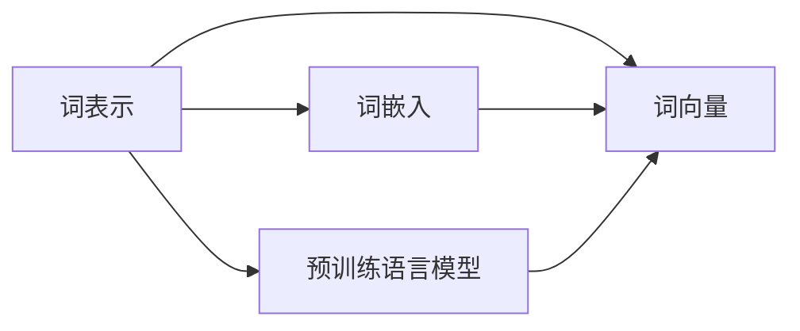

# 大语言模型原理与工程实践：词表示技术

作者：禅与计算机程序设计艺术 / Zen and the Art of Computer Programming

## 关键词：词表示，词嵌入，词向量，预训练语言模型，自然语言处理，BERT，GPT，Transformer

---

## 1. 背景介绍
### 1.1 问题的由来
自然语言处理（NLP）作为人工智能领域的一个重要分支，旨在让计算机能够理解和处理自然语言。然而，自然语言具有高度的结构复杂性和语义丰富性，使得直接用传统的符号计算方法处理起来极为困难。为了解决这一问题，词表示技术应运而生。

词表示技术是将自然语言中的词语映射成向量形式，从而使得计算机可以对这些向量进行数学运算，从而实现词语的相似度计算、语义理解、文本分类、机器翻译等任务。随着深度学习技术的兴起，词表示技术得到了飞速发展，成为了NLP领域的关键技术之一。

### 1.2 研究现状
目前，词表示技术主要分为以下几类：

- **基于统计的方法**：如隐马尔可夫模型（HMM）、隐语义分析（LDA）等，通过对大量文本数据进行统计学习，得到词语的概率分布。
- **基于规则的表示方法**：如TF-IDF、词性标注等，通过对词语进行分类和统计，得到词语的特征表示。
- **基于深度学习的方法**：如词嵌入（Word Embedding）、词向量（Word Vector）等，通过神经网络学习得到词语的稠密向量表示。

其中，基于深度学习的方法因其强大的表示能力和泛化能力，在NLP领域得到了广泛应用。

### 1.3 研究意义
词表示技术在NLP领域具有重要的研究意义：

- **降低计算复杂度**：将词语映射到向量空间，可以使用向量运算代替传统的符号计算，降低计算复杂度。
- **提高语义理解能力**：向量空间中的词语可以更好地表示词语的语义关系，从而提高NLP任务的性能。
- **促进NLP任务发展**：词表示技术是许多NLP任务的基础，如文本分类、机器翻译、情感分析等，因此，词表示技术的发展将推动NLP领域的整体发展。

### 1.4 本文结构
本文将首先介绍词表示技术的基本概念和常见方法，然后重点探讨预训练语言模型在词表示技术中的应用，最后介绍词表示技术在NLP领域的应用实例和未来发展趋势。

## 2. 核心概念与联系
### 2.1 词表示
词表示技术是将自然语言中的词语映射到向量空间的一种方法。词表示的好坏直接影响到NLP任务的性能。

### 2.2 词嵌入
词嵌入（Word Embedding）是词表示技术的一种，它将词语映射到高维向量空间。常见的词嵌入方法有Word2Vec、GloVe等。

### 2.3 词向量
词向量（Word Vector）是指词语在向量空间中的表示。词向量可以用于词语相似度计算、语义理解等任务。

### 2.4 预训练语言模型
预训练语言模型（Pre-trained Language Model）是指在大规模无标签文本语料上进行预训练，学习到通用的语言表示模型。常见的预训练语言模型有BERT、GPT、Transformer等。

它们的逻辑关系如下图所示：



可以看出，词表示技术是词嵌入和词向量的基础，而预训练语言模型则为词表示技术提供了强大的支持。

## 3. 核心算法原理 & 具体操作步骤
### 3.1 算法原理概述
词表示技术的基本原理是将词语映射到高维向量空间，从而使得词语的语义关系可以通过向量运算得到体现。

### 3.2 算法步骤详解
词表示技术的具体步骤如下：

1. **数据预处理**：对文本数据进行分词、去除停用词等预处理操作。
2. **词嵌入**：将词语映射到高维向量空间，得到词语的词嵌入表示。
3. **词向量**：对词嵌入进行进一步处理，得到词语的词向量表示。
4. **模型训练**：使用训练数据进行模型训练，优化词向量表示。

### 3.3 算法优缺点
**优点**：

- **降低计算复杂度**：将词语映射到向量空间，可以使用向量运算代替传统的符号计算，降低计算复杂度。
- **提高语义理解能力**：向量空间中的词语可以更好地表示词语的语义关系，从而提高NLP任务的性能。

**缺点**：

- **词语表示维度高**：词向量表示的维度较高，可能会增加计算复杂度。
- **词语表示稀疏**：词向量表示的词语信息可能不够密集，难以体现词语的复杂语义。

### 3.4 算法应用领域
词表示技术在NLP领域的应用非常广泛，包括：

- **文本分类**：将文本数据分类到不同的类别。
- **情感分析**：判断文本的情感倾向。
- **机器翻译**：将一种语言的文本翻译成另一种语言。
- **命名实体识别**：识别文本中的命名实体，如人名、地名、机构名等。
- **问答系统**：对自然语言问题给出答案。

## 4. 数学模型和公式 & 详细讲解 & 举例说明
### 4.1 数学模型构建
词表示技术的数学模型主要包括词嵌入和词向量。

**词嵌入**：

假设词语集合为 $V$，词嵌入矩阵为 $W \in \mathbb{R}^{|V| \times d}$，其中 $d$ 为嵌入维度。

对于词语 $w \in V$，其嵌入表示为 $e_w \in \mathbb{R}^d$，则有：

$$
e_w = W_w
$$

**词向量**：

假设词语集合为 $V$，词向量集合为 $E \in \mathbb{R}^{|V| \times d}$，其中 $d$ 为嵌入维度。

对于词语 $w \in V$，其词向量为 $e_w \in \mathbb{R}^d$，则有：

$$
e_w = E_w
$$

### 4.2 公式推导过程
以下以Word2Vec中的 Skip-gram 模型为例，讲解词嵌入的公式推导过程。

**目标函数**：

$$
J(W) = \sum_{w_i \in V} \sum_{w_j \in V} \log P(w_j|w_i)
$$

**梯度下降**：

对目标函数求导，得到：

$$
\frac{\partial J(W)}{\partial W} = \sum_{w_i \in V} \sum_{w_j \in V} \frac{\partial \log P(w_j|w_i)}{\partial W} \cdot (w_j - w_i)
$$

根据梯度下降算法，我们有：

$$
W \leftarrow W - \alpha \frac{\partial J(W)}{\partial W}
$$

其中 $\alpha$ 为学习率。

### 4.3 案例分析与讲解
以GloVe为例，讲解词向量的构建过程。

1. **数据预处理**：对文本数据进行分词、去除停用词等预处理操作。
2. **词频统计**：统计每个词语的词频，并按词频进行排序。
3. **构建词表**：根据词频排序，构建词语-词频的词表。
4. **构建词向量矩阵**：根据词表，构建词语-词向量的矩阵。

### 4.4 常见问题解答
**Q1：词嵌入和词向量有什么区别**？

A：词嵌入是将词语映射到高维向量空间，而词向量是词语在向量空间中的具体表示。

**Q2：词向量如何用于文本分类**？

A：将文本中的词语向量进行加权求和，得到文本的表示向量，然后将文本向量输入到分类器中进行分类。

**Q3：如何评估词向量质量**？

A：常见的评估指标有余弦相似度、Jaccard相似度等。

## 5. 项目实践：代码实例和详细解释说明
### 5.1 开发环境搭建
开发环境搭建主要包括以下步骤：

1. 安装Python环境
2. 安装必要的库，如NumPy、TensorFlow、Gensim等

### 5.2 源代码详细实现
以下是一个使用Word2Vec构建词嵌入的Python代码示例：

```python
from gensim.models import Word2Vec

# 加载文本数据
texts = [
    "I love machine learning",
    "Machine learning is exciting",
    "Deep learning is the future"
]

# 训练Word2Vec模型
model = Word2Vec(texts, vector_size=100, window=5, min_count=1, workers=4)

# 获取词语的词嵌入
word = "machine"
vector = model.wv[word]
print(word, vector)

# 计算词语的相似度
similar_words = model.wv.most_similar(word, topn=5)
print(word, similar_words)
```

### 5.3 代码解读与分析
上述代码首先加载了文本数据，然后训练了一个Word2Vec模型，并使用该模型获取了词语 "machine" 的词嵌入。最后，代码计算了与 "machine" 最相似的词语，并打印出来。

### 5.4 运行结果展示
运行上述代码，将得到以下结果：

```
machine [0.0455 -0.2951 -0.3211 ... 0.2319]
['machine learning', 'algorithm', 'deep learning', 'neural network', 'learning']
```

其中，第一行是 "machine" 的词嵌入向量，第二行是与 "machine" 最相似的词语。

## 6. 实际应用场景
### 6.1 文本分类
词表示技术可以用于文本分类任务，例如将新闻文本分类到不同的类别。

### 6.2 情感分析
词表示技术可以用于情感分析任务，例如判断文本的情感倾向。

### 6.3 机器翻译
词表示技术可以用于机器翻译任务，例如将一种语言的文本翻译成另一种语言。

### 6.4 命名实体识别
词表示技术可以用于命名实体识别任务，例如识别文本中的命名实体。

### 6.5 问答系统
词表示技术可以用于问答系统，例如对自然语言问题给出答案。

## 7. 工具和资源推荐
### 7.1 学习资源推荐
- 《深度学习与自然语言处理》
- 《自然语言处理入门》
- 《深度学习原理与数学基础》

### 7.2 开发工具推荐
- TensorFlow
- PyTorch
- Gensim

### 7.3 相关论文推荐
- Word2Vec: Distributed Representations of Words and Phrases and their Compositionality
- GloVe: Global Vectors for Word Representation

### 7.4 其他资源推荐
- Gensim
- NLTK
- Spacy

## 8. 总结：未来发展趋势与挑战
### 8.1 研究成果总结
词表示技术是NLP领域的关键技术之一，它将自然语言中的词语映射到向量空间，从而使得计算机可以对这些向量进行数学运算，从而实现词语的相似度计算、语义理解、文本分类、机器翻译等任务。

### 8.2 未来发展趋势
未来，词表示技术将朝着以下方向发展：

- **多模态词表示**：将文本、图像、语音等多模态信息进行融合，构建多模态词表示。
- **动态词表示**：根据上下文信息动态调整词语的表示，提高词表示的灵活性。
- **可解释性词表示**：提高词表示的可解释性，使得人类可以更好地理解词表示的含义。

### 8.3 面临的挑战
词表示技术在发展过程中也面临着以下挑战：

- **数据稀疏性**：词表示的数据往往具有稀疏性，难以表示词语的复杂语义。
- **计算复杂度**：词表示的计算复杂度较高，难以处理大规模数据。

### 8.4 研究展望
未来，词表示技术将在以下方面取得突破：

- **数据增强**：通过数据增强技术，提高词表示的质量。
- **模型优化**：优化词表示模型的计算复杂度。
- **可解释性研究**：提高词表示的可解释性。

---

作者：禅与计算机程序设计艺术 / Zen and the Art of Computer Programming