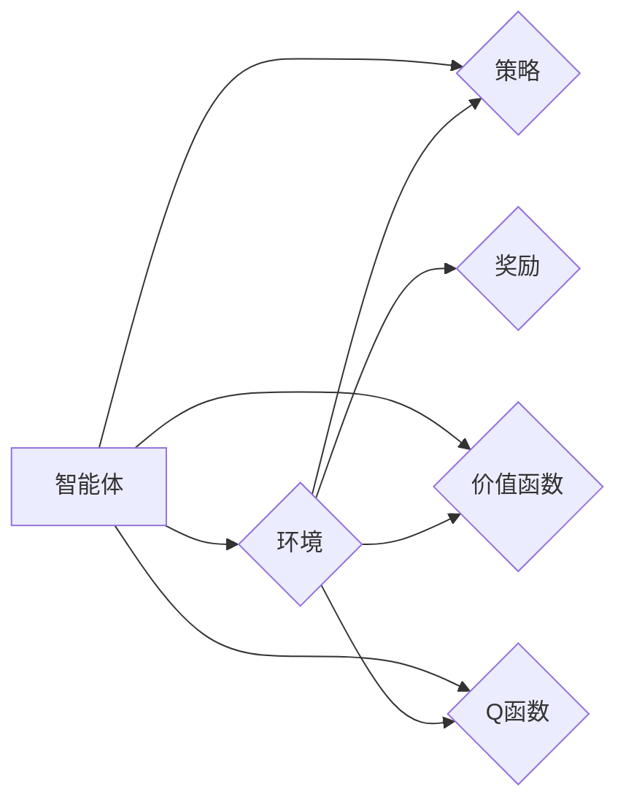

# AI人工智能 Agent：利用强化学习进行决策优化

作者：禅与计算机程序设计艺术 / Zen and the Art of Computer Programming

## 1. 背景介绍
### 1.1 问题的由来

在人工智能领域，智能体（Agent）是研究的核心概念之一。智能体是指能够感知环境、进行决策并采取行动的实体。在现实世界中，智能体无处不在，从简单的机器人到复杂的生物体，再到人类自身，都具备智能体特征。随着人工智能技术的不断发展，如何设计出能够自主学习和适应环境变化的智能体，成为了人工智能领域的重要研究方向。

强化学习（Reinforcement Learning，RL）作为一种重要的机器学习范式，为智能体的决策优化提供了强有力的技术支持。强化学习通过智能体与环境之间的交互，使智能体不断学习并优化其决策策略，最终实现长期目标。

### 1.2 研究现状

近年来，强化学习在学术界和工业界都取得了显著的进展。以下是一些强化学习研究现状的关键点：

- 强化学习在多个领域取得了突破性成果，如游戏、机器人、自动驾驶、自然语言处理等。
- 以深度强化学习（Deep Reinforcement Learning，DRL）为代表的新兴技术，将深度学习与强化学习相结合，取得了更好的效果。
- 强化学习算法和框架不断完善，如Proximal Policy Optimization（PPO）、Deep Q-Network（DQN）、Trust Region Policy Optimization（TRPO）等。
- 强化学习在实际应用中取得了成功，如AlphaGo、OpenAI Five等。

### 1.3 研究意义

研究利用强化学习进行决策优化的智能体，具有以下重要意义：

- 提升智能体在复杂环境中的适应能力，使其能够自主学习和优化决策策略。
- 降低对人工设计的决策规则和策略的依赖，提高智能体的自主性和灵活性。
- 推动人工智能技术在各个领域的应用，促进智能化水平的提升。

### 1.4 本文结构

本文将围绕强化学习在智能体决策优化中的应用，展开以下内容：

- 介绍强化学习的基本概念和核心算法。
- 分析强化学习算法的原理、步骤和优缺点。
- 展示强化学习在实际应用中的案例和成果。
- 探讨强化学习的未来发展趋势和挑战。

## 2. 核心概念与联系

本节将介绍强化学习涉及的核心概念，并阐述它们之间的关系。

- **智能体（Agent）**：能够感知环境、进行决策并采取行动的实体。
- **环境（Environment）**：智能体所处的环境，包括状态空间、动作空间和奖励函数。
- **状态（State）**：智能体当前所处的环境状态。
- **动作（Action）**：智能体可以采取的行动。
- **奖励（Reward）**：智能体采取某个动作后，从环境中获得的奖励。
- **策略（Policy）**：智能体在特定状态下的行动决策规则。
- **价值函数（Value Function）**：评估智能体在某个状态下采取某个动作所能获得的期望回报。
- **Q函数（Q-Function）**：评估智能体在某个状态下采取某个动作所能获得的期望回报。
- **模型（Model）**：智能体对环境状态的预测模型。

它们之间的逻辑关系如下所示：



可以看出，智能体通过感知环境状态，根据策略选择动作，并从环境中获得奖励。同时，智能体会根据价值函数和Q函数评估动作的效果，不断优化其策略。

## 3. 核心算法原理 & 具体操作步骤
### 3.1 算法原理概述

强化学习算法的核心思想是：通过智能体与环境之间的交互，使智能体不断学习并优化其决策策略，最终实现长期目标。

强化学习算法通常包含以下步骤：

1. 初始化：设置智能体的初始参数和策略。
2. 感知：智能体感知环境状态。
3. 决策：智能体根据策略选择动作。
4. 执行：智能体执行所选动作。
5. 观察：智能体观察环境变化，并获得奖励。
6. 学习：根据奖励和历史经验，更新智能体的策略参数。

### 3.2 算法步骤详解

以下是一些常见的强化学习算法及其步骤：

- **Q学习（Q-Learning）**：
  - 初始化Q值函数Q(s,a)。
  - 在状态s下，选择动作a。
  - 执行动作a，获得奖励r和下一个状态s'。
  - 更新Q值：Q(s,a) = Q(s,a) + α[r + γmax(Q(s',a')) - Q(s,a)]，其中α为学习率，γ为折扣因子。
  - 迭代上述步骤，直至满足终止条件。

- **深度Q网络（Deep Q-Network，DQN）**：
  - 使用深度神经网络作为Q值函数Q(s,a)。
  - 初始化网络参数。
  - 迭代上述步骤，并在每个步骤中，使用经验回放（Experience Replay）和目标网络（Target Network）技术来提高学习效率和稳定性。

- **策略梯度方法**：
  - 使用策略网络π(s)来表示策略。
  - 计算策略梯度：∇_π[logπ(a|s)]∇_θJ(θ)，其中J(θ)为预期收益函数，θ为策略网络的参数。
  - 使用梯度下降或其他优化算法更新策略网络参数。

### 3.3 算法优缺点

以下是常见强化学习算法的优缺点：

- **Q学习**：
  - 优点：简单易实现，对环境要求不高。
  - 缺点：收敛速度慢，容易陷入局部最优。

- **DQN**：
  - 优点：结合深度神经网络，能够处理高维状态空间和动作空间。
  - 缺点：训练不稳定，需要经验回放和目标网络等技术来提高稳定性。

- **策略梯度方法**：
  - 优点：直接优化策略，收敛速度较快。
  - 缺点：梯度计算困难，对探索-利用问题敏感。

### 3.4 算法应用领域

强化学习在多个领域都取得了显著的成果，以下是一些应用领域：

- **游戏**：例如，AlphaGo在围棋比赛中战胜人类顶尖高手。
- **机器人**：例如，机器人足球、自动驾驶等。
- **自然语言处理**：例如，机器翻译、问答系统等。
- **推荐系统**：例如，个性化推荐、广告投放等。
- **金融**：例如，资产定价、风险管理等。

## 4. 数学模型和公式 & 详细讲解 & 举例说明
### 4.1 数学模型构建

以下是基于Q学习的强化学习数学模型：

- **状态空间**：S
- **动作空间**：A
- **策略**：π(a|s)
- **价值函数**：V(s)
- **Q函数**：Q(s,a)
- **奖励函数**：R(s,a)

**状态转移概率**：

$$
P(s'|s,a) = P(s'|s,a) + (1-P(s'|s,a))\times\epsilon
$$

其中，$P(s'|s,a)$ 为在状态s下采取动作a后转移到状态s'的概率，$\epsilon$ 为随机扰动项。

**奖励函数**：

$$
R(s,a) = r + \gamma \times \max_{a'} Q(s',a')
$$

其中，r 为立即奖励，$\gamma$ 为折扣因子。

**价值函数**：

$$
V(s) = \max_{a} Q(s,a)
$$

**Q函数**：

$$
Q(s,a) = \sum_{s'} P(s'|s,a) \times [R(s,a) + \gamma \times \max_{a'} Q(s',a')]
$$

### 4.2 公式推导过程

以下是对Q函数公式的推导：

$$
Q(s,a) = \sum_{s'} P(s'|s,a) \times [R(s,a) + \gamma \times \max_{a'} Q(s',a')]
$$

首先，考虑在状态s下采取动作a后，转移到状态s'的概率为 $P(s'|s,a)$。根据期望的定义，可以得到：

$$
E[R(s,a)] = \sum_{s'} P(s'|s,a) \times R(s,a)
$$

然后，根据状态转移概率，可以得到：

$$
E[Q(s',a')] = \sum_{s'} P(s'|s,a) \times Q(s',a')
$$

将上述两个期望值代入奖励函数，可以得到：

$$
R(s,a) = E[R(s,a)] + \gamma \times E[Q(s',a')]
$$

将期望值展开，可以得到：

$$
R(s,a) = \sum_{s'} P(s'|s,a) \times R(s,a) + \gamma \times \sum_{s'} P(s'|s,a) \times Q(s',a')
$$

由于 $R(s,a)$ 是在状态s下采取动作a后立即获得的奖励，所以 $E[R(s,a)] = R(s,a)$。因此，可以得到：

$$
R(s,a) = R(s,a) + \gamma \times \sum_{s'} P(s'|s,a) \times Q(s',a')
$$

整理上述公式，可以得到：

$$
Q(s,a) = \sum_{s'} P(s'|s,a) \times [R(s,a) + \gamma \times \max_{a'} Q(s',a')]
$$

这就是Q函数的公式。

### 4.3 案例分析与讲解

以下是一个简单的例子，说明如何使用Q学习进行强化学习。

假设有一个智能体在一个简单的网格世界中，需要学习走到目标点并获得奖励。状态空间为网格的坐标，动作空间为上下左右四个方向。奖励函数为到达目标点获得100分，否则获得-1分。

首先，初始化Q值函数Q(s,a)：

```python
def initialize_q_values(state_space, action_space):
    q_values = {}
    for s in state_space:
        for a in action_space:
            q_values[(s, a)] = 0
    return q_values
```

然后，使用Q学习算法进行训练：

```python
def q_learning(q_values, state_space, action_space, reward_function, learning_rate=0.1, discount_factor=0.99, episodes=100):
    for episode in range(episodes):
        state = random.choice(state_space)
        while not is_goal_state(state):
            action = choose_action(q_values, state, action_space)
            next_state, reward = step(state, action, reward_function)
            q_values[(state, action)] = q_values[(state, action)] + learning_rate * (reward + discount_factor * max(q_values[next_state]) - q_values[(state, action)])
            state = next_state
    return q_values
```

最后，使用训练好的Q值函数进行决策：

```python
def choose_action(q_values, state, action_space):
    return max(q_values[state], key=lambda a: q_values[state][a])
```

通过上述代码，我们可以实现一个简单的强化学习算法，使智能体学会在网格世界中找到目标点并获得奖励。

### 4.4 常见问题解答

**Q1：什么是探索-利用问题？**

A：探索-利用问题是强化学习中一个重要的概念。它指的是在强化学习中，智能体需要在探索未知动作和利用已知知识之间取得平衡。如果过度探索，可能导致智能体无法快速收敛到最优策略；如果过度利用，可能导致智能体无法学习到更好的策略。因此，如何平衡探索和利用，是强化学习中的一个关键问题。

**Q2：什么是经验回放？**

A：经验回放（Experience Replay）是DQN等强化学习算法中常用的技术。它通过将智能体在训练过程中遇到的经验（状态、动作、奖励、下一个状态）存储在经验池中，随机抽取经验进行训练，从而提高学习效率和稳定性。

**Q3：什么是目标网络？**

A：目标网络（Target Network）是DQN等强化学习算法中的一种技术。它通过维护一个与策略网络结构相同的目标网络，并定期从策略网络复制参数到目标网络，以保证目标网络能够跟踪策略网络的变化，从而提高算法的稳定性。

## 5. 项目实践：代码实例和详细解释说明
### 5.1 开发环境搭建

以下是在Python中实现强化学习项目的环境搭建步骤：

1. 安装Python 3.8及以上版本。
2. 安装PyTorch：`pip install torch torchvision torchaudio`
3. 安装DQN算法实现库：`pip install gym dqn`
4. 安装可视化库：`pip install matplotlib`

### 5.2 源代码详细实现

以下是一个使用DQN算法实现简单的CartPole游戏的代码实例：

```python
import gym
import torch
import torch.nn as nn
import torch.optim as optim
from dqn import DQN

# 创建环境
env = gym.make('CartPole-v1')

# 初始化DQN模型
model = DQN(
    state_space=env.observation_space.shape[0],
    action_space=env.action_space.n
)

# 定义优化器
optimizer = optim.Adam(model.parameters(), lr=0.001)

# 定义损失函数
criterion = nn.MSELoss()

# 训练模型
for episode in range(1000):
    state = torch.tensor(env.reset(), dtype=torch.float32).unsqueeze(0)
    done = False
    total_reward = 0
    while not done:
        action = model(state)
        next_state, reward, done, _ = env.step(action.item())
        reward = torch.tensor([reward], dtype=torch.float32)
        next_state = torch.tensor(next_state, dtype=torch.float32).unsqueeze(0)
        model.memory.push(state, action, reward, next_state, done)
        state = next_state
        total_reward += reward.item()
        if model.memory.is_full():
            optimizer.zero_grad()
            loss = model.train()
            loss.backward()
            optimizer.step()
    print(f'Episode {episode}: Total Reward = {total_reward}')
```

### 5.3 代码解读与分析

以上代码实现了使用DQN算法在CartPole游戏环境中进行训练。以下是代码的主要部分：

- `import`语句：导入所需的库和模块。
- `gym.make('CartPole-v1')`：创建CartPole游戏环境。
- `DQN`：导入自定义的DQN模型类。
- `model = DQN(...)`：初始化DQN模型，设置状态空间和动作空间的大小。
- `optimizer`：初始化优化器，设置学习率。
- `criterion`：初始化损失函数，使用均方误差损失。
- `for episode in range(1000):`：进行1000个回合的训练。
- `state = torch.tensor(env.reset(), dtype=torch.float32).unsqueeze(0)`：获取初始状态，并将其转换为张量。
- `while not done:`：进行游戏回合。
- `action = model(state)`：根据当前状态，使用DQN模型选择动作。
- `next_state, reward, done, _ = env.step(action.item())`：执行动作，获取下一个状态和奖励。
- `reward = torch.tensor([reward], dtype=torch.float32)`：将奖励转换为张量。
- `next_state = torch.tensor(next_state, dtype=torch.float32).unsqueeze(0)`：将下一个状态转换为张量。
- `model.memory.push(state, action, reward, next_state, done)`：将经验存入经验池。
- `state = next_state`：更新当前状态。
- `if model.memory.is_full():`：检查经验池是否已满。
- `optimizer.zero_grad()`：清空梯度。
- `loss = model.train()`：训练模型，计算损失。
- `loss.backward()`：反向传播计算梯度。
- `optimizer.step()`：更新模型参数。

### 5.4 运行结果展示

在以上代码的基础上，运行CartPole游戏，观察DQN模型在游戏中的表现。随着训练的进行，模型的表现将逐渐提高，直至学会在CartPole游戏中稳定平衡。

## 6. 实际应用场景
### 6.1 游戏领域

强化学习在游戏领域取得了显著的成果，以下是一些应用案例：

- **AlphaGo**：AlphaGo是一种使用强化学习算法的围棋程序，曾在2016年战胜世界围棋冠军李世石。
- **OpenAI Five**：OpenAI Five是一种使用强化学习算法的Dota 2团队，曾在2019年战胜世界顶尖Dota 2选手。

### 6.2 机器人领域

强化学习在机器人领域也有着广泛的应用，以下是一些应用案例：

- **自动驾驶**：自动驾驶汽车可以通过强化学习算法学习如何安全驾驶。
- **机器人足球**：机器人足球比赛可以通过强化学习算法训练机器人球员的协作策略。

### 6.3 自然语言处理领域

强化学习在自然语言处理领域也有着一些应用，以下是一些应用案例：

- **机器翻译**：强化学习算法可以用于训练机器翻译模型，提高翻译质量。
- **对话系统**：强化学习算法可以用于训练对话系统，使其能够更好地与人类进行对话。

### 6.4 未来应用展望

随着强化学习技术的不断发展，未来将会在更多领域得到应用，以下是一些可能的未来应用场景：

- **智能客服**：通过强化学习算法，智能客服可以更好地理解用户需求，提供更优质的客户服务。
- **智慧城市**：强化学习算法可以用于优化交通信号灯控制、垃圾回收等城市管理问题。
- **医疗健康**：强化学习算法可以用于辅助诊断、药物研发等医疗领域问题。

## 7. 工具和资源推荐
### 7.1 学习资源推荐

以下是一些关于强化学习的学习资源：

- 《Reinforcement Learning: An Introduction》
- 《Reinforcement Learning: A Statistical Perspective》
- 《Deep Reinforcement Learning》
- 《Deep Reinforcement Learning with Python》

### 7.2 开发工具推荐

以下是一些用于强化学习开发的工具：

- PyTorch：一种开源的深度学习框架，支持强化学习算法的实现。
- TensorFlow：另一种开源的深度学习框架，也支持强化学习算法的实现。
- OpenAI Gym：一个开源的强化学习环境库，提供多种预定义的环境，方便进行强化学习实验。
- Stable Baselines：一个基于PyTorch的强化学习库，提供多种预定义的强化学习算法实现。

### 7.3 相关论文推荐

以下是一些关于强化学习的重要论文：

- **Sutton, R. S., & Barto, A. G. (1998). Introduction to reinforcement learning. MIT press**.
- **Silver, D., Huang, A., Maddison, C. J., Guez, A., Sifre, L., Van Den Driessche, G., ... & Schrittwieser, J. (2016). Mastering the game of Go with deep neural networks and tree search. Nature, 529(7587), 484-489**.
- **Baird, L. L. (1994). The choice of the initial policy in reinforcement learning. In Advances in neural information processing systems (pp. 511-518)**.
- **Mnih, V., Kavukcuoglu, K., Silver, D., Rusu, A. A., Veness, J., Bellemare, M. G., ... & Hessel, M. (2015). Human-level control through deep reinforcement learning. nature, 518(7540), 529-533**.

### 7.4 其他资源推荐

以下是一些其他关于强化学习的资源：

- **Reinforcement Learning Blog**：一个关于强化学习的博客，提供最新的研究和应用信息。
- **Stability AI**：一个开源的强化学习研究机构，提供各种强化学习资源和工具。
- **DeepMind**：一个专注于人工智能研究的公司，提供了一系列关于强化学习的论文和开源项目。

## 8. 总结：未来发展趋势与挑战
### 8.1 研究成果总结

本文介绍了强化学习在智能体决策优化中的应用，从核心概念、算法原理、实际应用等方面进行了详细讲解。通过本文的学习，读者可以了解强化学习的基本原理和实现方法，并能够将其应用于实际的决策优化问题。

### 8.2 未来发展趋势

未来，强化学习在以下方面有望取得进一步的发展：

- **更高效的算法**：研究更高效的强化学习算法，提高学习效率和稳定性。
- **多智能体强化学习**：研究多智能体强化学习算法，使多个智能体能够协同完成任务。
- **强化学习与其他学习范式的结合**：将强化学习与其他学习范式（如监督学习、无监督学习）相结合，提高学习效果和泛化能力。
- **强化学习在更多领域的应用**：将强化学习应用于更多领域，如机器人、自动驾驶、自然语言处理、医疗健康等。

### 8.3 面临的挑战

尽管强化学习取得了显著的进展，但仍面临着以下挑战：

- **探索-利用问题**：如何平衡探索和利用，是强化学习中的一个重要挑战。
- **样本效率**：如何提高样本效率，减少对训练数据的需求。
- **收敛速度**：如何提高收敛速度，缩短训练时间。
- **可解释性**：如何提高强化学习算法的可解释性，使其更容易被理解和接受。
- **安全性**：如何确保强化学习算法在真实世界中的应用安全性。

### 8.4 研究展望

未来，强化学习研究需要从以下几个方面进行探索：

- **理论基础**：深入研究强化学习的基本理论，提高算法的稳定性和可解释性。
- **算法创新**：研究更高效的算法，提高学习效率和稳定性。
- **跨领域应用**：将强化学习应用于更多领域，拓展其应用范围。
- **安全性研究**：研究强化学习在真实世界中的应用安全性，确保其应用的安全性。

通过不断努力，相信强化学习将会在未来发挥更大的作用，为人类社会创造更多的价值。

---

作者：禅与计算机程序设计艺术 / Zen and the Art of Computer Programming