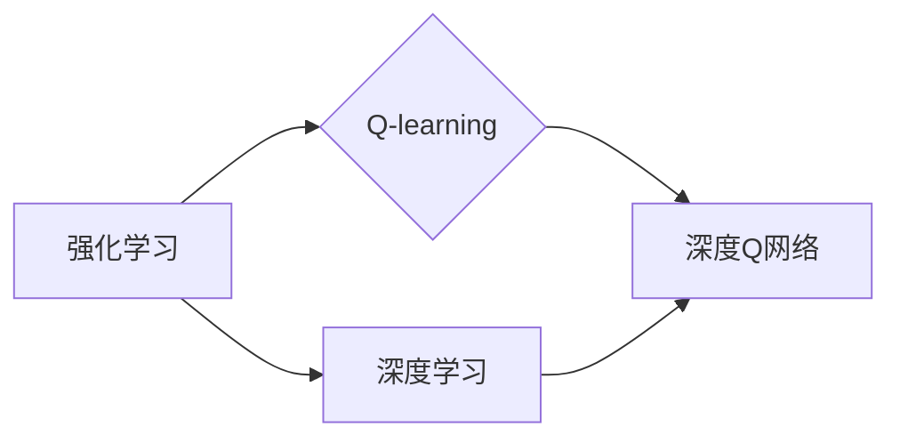

# 深度 Q-learning：基础概念解析

作者：禅与计算机程序设计艺术 / Zen and the Art of Computer Programming

## 关键词：Q-learning，深度学习，强化学习，深度Q网络，值函数，策略，探索-利用平衡

## 1. 背景介绍
### 1.1 问题的由来

在人工智能领域，强化学习（Reinforcement Learning，RL）是近年来备受关注的研究方向之一。强化学习通过智能体与环境交互，通过不断学习和积累经验来优化决策策略，最终实现目标。其中，Q-learning作为一种经典的强化学习方法，在决策过程、知识获取、智能控制等方面有着广泛的应用。

然而，传统的Q-learning方法在处理高维状态空间和动作空间时，面临着计算复杂度高、收敛速度慢等问题。为了解决这些问题，研究者们提出了深度Q网络（Deep Q-Network，DQN）等深度强化学习算法。本文将详细介绍深度Q-learning的基本概念、原理和实现方法。

### 1.2 研究现状

近年来，随着深度学习技术的飞速发展，深度Q-learning在各个领域都取得了显著的成果。目前，深度Q-learning已经在游戏、机器人、自动驾驶、金融等领域得到了广泛应用，并取得了许多突破性的进展。

### 1.3 研究意义

深度Q-learning作为一种有效的强化学习方法，在人工智能领域具有重要的研究意义。它能够解决传统Q-learning方法在高维空间中的局限性，为智能体在复杂环境中进行决策提供了新的思路。同时，深度Q-learning在多个领域的成功应用，也推动了人工智能技术的发展和进步。

### 1.4 本文结构

本文将围绕深度Q-learning展开，具体内容如下：

- 第2部分：介绍深度Q-learning的核心概念和联系。
- 第3部分：详细阐述深度Q-learning的原理和具体操作步骤。
- 第4部分：讲解深度Q-learning的数学模型和公式，并通过实例进行说明。
- 第5部分：给出深度Q-learning的代码实现示例，并对关键代码进行解读和分析。
- 第6部分：探讨深度Q-learning在实际应用场景中的案例和案例分析。
- 第7部分：推荐深度Q-learning相关的学习资源、开发工具和参考文献。
- 第8部分：总结深度Q-learning的研究成果、未来发展趋势和挑战。
- 第9部分：附录，常见问题与解答。

## 2. 核心概念与联系

为了更好地理解深度Q-learning，本节将介绍几个与之密切相关的基本概念：

- 强化学习（Reinforcement Learning，RL）：智能体通过与环境的交互，通过不断学习和积累经验来优化决策策略，最终实现目标的学习方法。
- Q-learning：一种基于值函数的强化学习算法，通过学习值函数来预测每个状态-动作对的期望收益，从而指导智能体的决策。
- 深度学习（Deep Learning，DL）：一种基于深度神经网络的机器学习方法，能够自动学习数据中的特征和模式。
- 深度Q网络（Deep Q-Network，DQN）：一种结合深度学习和Q-learning的强化学习算法，能够处理高维状态空间和动作空间。

它们的逻辑关系如下图所示：



可以看出，深度Q网络是Q-learning和深度学习相结合的产物，通过使用深度神经网络来近似Q值函数，能够有效地处理高维状态空间和动作空间。

## 3. 核心算法原理 & 具体操作步骤

### 3.1 算法原理概述

深度Q-learning是一种基于值函数的强化学习算法，其核心思想是学习一个函数 $Q(s,a)$，用于表示智能体在状态 $s$ 下执行动作 $a$ 所获得的期望回报。具体来说，智能体通过与环境交互，不断更新Q值函数，最终找到最优策略。

### 3.2 算法步骤详解

深度Q-learning的步骤如下：

1. 初始化Q值函数 $Q(s,a)$ 和策略 $\pi(a|s)$，其中 $\pi(a|s)$ 表示在状态 $s$ 下执行动作 $a$ 的概率。
2. 在状态 $s$ 下，根据策略 $\pi(a|s)$ 选择动作 $a$。
3. 执行动作 $a$，并观察到新的状态 $s'$ 和回报 $R$。
4. 使用以下公式更新Q值函数：

$$
Q(s,a) \leftarrow Q(s,a) + \alpha [R + \gamma \max_{a'} Q(s',a') - Q(s,a)]
$$

其中 $\alpha$ 为学习率，$\gamma$ 为折扣因子。
5. 转换到下一个状态 $s'$，并重复步骤2-4，直到达到终止条件。

### 3.3 算法优缺点

深度Q-learning具有以下优点：

- 能够处理高维状态空间和动作空间。
- 不需要预先定义策略，能够自动学习最优策略。
- 在多个领域取得了显著的应用成果。

然而，深度Q-learning也存在以下缺点：

- 学习过程容易受到探索-利用（Explore-Explore）问题的困扰，导致学习效率低下。
- 模型容易过拟合，需要采取适当的正则化措施。
- 需要大量的数据进行训练，且训练过程耗时较长。

### 3.4 算法应用领域

深度Q-learning在多个领域都取得了显著的应用成果，例如：

- 游戏AI：如AlphaGo在围棋比赛中的胜利。
- 机器人控制：如无人机、机器人导航等。
- 自动驾驶：如自动驾驶汽车的决策系统。
- 金融领域：如股票交易、风险管理等。

## 4. 数学模型和公式 & 详细讲解 & 举例说明

### 4.1 数学模型构建

深度Q-learning的数学模型主要包括以下几个部分：

- 状态空间 $S$：表示智能体所处的环境状态。
- 动作空间 $A$：表示智能体可以执行的动作集合。
- 奖励函数 $R(s,a)$：表示智能体在状态 $s$ 下执行动作 $a$ 所获得的回报。
- Q值函数 $Q(s,a)$：表示智能体在状态 $s$ 下执行动作 $a$ 的期望回报。
- 策略 $\pi(a|s)$：表示在状态 $s$ 下执行动作 $a$ 的概率。

### 4.2 公式推导过程

以下以一个简单的例子来说明深度Q-learning的公式推导过程。

假设智能体处于状态 $s_0$，执行动作 $a_0$，然后观察到状态 $s_1$ 和回报 $R_0$。根据深度Q-learning的更新公式，我们可以推导出以下步骤：

1. 初始化Q值函数 $Q(s_0,a_0)$。
2. 执行动作 $a_0$，观察到状态 $s_1$ 和回报 $R_0$。
3. 使用以下公式更新Q值函数：

$$
Q(s_0,a_0) \leftarrow Q(s_0,a_0) + \alpha [R_0 + \gamma \max_{a'} Q(s_1,a') - Q(s_0,a_0)]
$$

4. 转换到下一个状态 $s_1$，并重复步骤2-3。

### 4.3 案例分析与讲解

以下是一个简单的深度Q-learning案例，用于求解一个简单的迷宫问题。

假设迷宫的起始点为 $s_0$，终点为 $s_1$，智能体可以执行的动作包括向上、向下、向左、向右移动。奖励函数定义为：当智能体到达终点时，获得奖励 $R=+1$；否则，获得奖励 $R=-1$。

根据深度Q-learning的步骤，我们可以得到以下Q值更新过程：

- 初始Q值函数：$Q(s_0,a_0)=0$，$Q(s_0,a_1)=0$，$Q(s_0,a_2)=0$，$Q(s_0,a_3)=0$。
- 执行动作 $a_0$，观察到状态 $s_1$ 和回报 $R=-1$，更新Q值函数：$Q(s_0,a_0)=-1$。
- 执行动作 $a_1$，观察到状态 $s_2$ 和回报 $R=-1$，更新Q值函数：$Q(s_0,a_1)=-2$。
- 执行动作 $a_2$，观察到状态 $s_3$ 和回报 $R=-1$，更新Q值函数：$Q(s_0,a_2)=-3$。
- 执行动作 $a_3$，观察到状态 $s_1$ 和回报 $R=-1$，更新Q值函数：$Q(s_0,a_3)=-4$。
- 执行动作 $a_1$，观察到状态 $s_2$ 和回报 $R=-1$，更新Q值函数：$Q(s_0,a_1)=-3$。
- 执行动作 $a_2$，观察到状态 $s_3$ 和回报 $R=-1$，更新Q值函数：$Q(s_0,a_2)=-4$。
- 执行动作 $a_3$，观察到状态 $s_1$ 和回报 $R=-1$，更新Q值函数：$Q(s_0,a_3)=-5$。

通过不断迭代，最终得到Q值函数 $Q(s_0,a_0)=0$，$Q(s_0,a_1)=-3$，$Q(s_0,a_2)=-4$，$Q(s_0,a_3)=-5$。可以看出，随着迭代次数的增加，智能体在状态 $s_0$ 下选择动作 $a_0$ 的概率逐渐增加，最终找到了到达终点的最优路径。

### 4.4 常见问题解答

**Q1：深度Q-learning的收敛速度慢，如何解决这个问题？**

A：为了提高深度Q-learning的收敛速度，可以采取以下措施：

1. 使用经验回放（Experience Replay）技术，将经验存储到经验池中，并从经验池中随机抽取样本进行训练，避免样本之间的相关性。
2. 使用优先级队列（Priority Queue）存储经验，优先训练具有高优先级的样本，提高样本的利用效率。
3. 使用Adam优化器（Adam Optimizer）进行参数优化，提高训练效率。

**Q2：深度Q-learning容易过拟合，如何解决这个问题？**

A：为了解决深度Q-learning的过拟合问题，可以采取以下措施：

1. 使用Dropout技术，在训练过程中随机丢弃一部分神经元，降低模型复杂度。
2. 使用正则化技术，如L2正则化，惩罚模型参数的平方和，降低过拟合风险。
3. 使用早停法（Early Stopping），当验证集上的性能不再提升时停止训练，避免过拟合。

**Q3：深度Q-learning如何处理高维状态空间和动作空间？**

A：为了处理高维状态空间和动作空间，可以使用以下方法：

1. 使用深度神经网络来近似Q值函数，将高维状态空间和动作空间映射到低维空间。
2. 使用状态空间抽象化技术，将高维状态空间分解为多个低维状态空间，降低状态空间维度。
3. 使用动作空间抽象化技术，将高维动作空间分解为多个低维动作空间，降低动作空间维度。

## 5. 项目实践：代码实例和详细解释说明

### 5.1 开发环境搭建

在进行深度Q-learning实践前，我们需要准备好开发环境。以下是使用Python进行开发的环境配置流程：

1. 安装Anaconda：从官网下载并安装Anaconda，用于创建独立的Python环境。
2. 创建并激活虚拟环境：

```bash
conda create -n rl-env python=3.8
conda activate rl-env
```

3. 安装PyTorch：

```bash
conda install pytorch torchvision torchaudio cudatoolkit=11.1 -c pytorch -c conda-forge
```

4. 安装其他依赖包：

```bash
pip install gym numpy pandas matplotlib
```

完成以上步骤后，即可在`rl-env`环境中开始深度Q-learning实践。

### 5.2 源代码详细实现

以下是一个使用PyTorch实现的深度Q-learning迷宫求解器的代码示例：

```python
import numpy as np
import gym
import random
import torch
import torch.nn as nn
import torch.optim as optim
from collections import deque

# 定义深度Q网络
class DQN(nn.Module):
    def __init__(self, n_states, n_actions):
        super(DQN, self).__init__()
        self.fc1 = nn.Linear(n_states, 24)
        self.fc2 = nn.Linear(24, 24)
        self.fc3 = nn.Linear(24, n_actions)

    def forward(self, x):
        x = torch.relu(self.fc1(x))
        x = torch.relu(self.fc2(x))
        return self.fc3(x)

# 定义深度Q-learning算法
class DQL:
    def __init__(self, n_states, n_actions, gamma=0.99, alpha=0.001):
        self.n_states = n_states
        self.n_actions = n_actions
        self.gamma = gamma
        self.alpha = alpha
        self.epsilon = 1.0
        self.epsilon_min = 0.01
        self.epsilon_decay = 0.995
        self.memory = deque(maxlen=2000)
        self.model = DQN(n_states, n_actions).to(device)
        self.target_model = DQN(n_states, n_actions).to(device)
        self.target_model.load_state_dict(self.model.state_dict())
        self.optimizer = optim.Adam(self.model.parameters(), lr=self.alpha)

    def remember(self, state, action, reward, next_state, done):
        self.memory.append((state, action, reward, next_state, done))

    def act(self, state):
        if random.random() <= self.epsilon:
            return random.randrange(self.n_actions)
        with torch.no_grad():
            state = torch.tensor(state, dtype=torch.float32).to(device)
            action = self.model(state).argmax(dim=1).item()
        return action

    def replay(self, batch_size):
        mini_batch = random.sample(self.memory, batch_size)
        states, actions, rewards, next_states, dones = zip(*mini_batch)
        states = torch.tensor(states, dtype=torch.float32).to(device)
        actions = torch.tensor(actions, dtype=torch.long).to(device)
        rewards = torch.tensor(rewards, dtype=torch.float32).to(device)
        next_states = torch.tensor(next_states, dtype=torch.float32).to(device)
        dones = torch.tensor(dones, dtype=torch.float32).to(device)
        with torch.no_grad():
            next_state_values = self.target_model(next_states).detach().max(1)[0].view(-1, 1)
            Q_targets = rewards + self.gamma * next_state_values * (1 - dones)
        Q_expected = self.model(states).gather(1, actions.unsqueeze(1))
        loss = F.smooth_l1_loss(Q_expected, Q_targets)
        self.optimizer.zero_grad()
        loss.backward()
        self.optimizer.step()

    def update_target_model(self):
        self.target_model.load_state_dict(self.model.state_dict())

# 创建环境和实例化DQL对象
env = gym.make("CartPole-v1")
dql = DQL(n_states=4, n_actions=2)

# 开始训练
episodes = 500
for episode in range(episodes):
    state = env.reset()
    for t in range(500):
        action = dql.act(state)
        next_state, reward, done, _ = env.step(action)
        dql.remember(state, action, reward, next_state, done)
        state = next_state
        if done:
            break
    if len(dql.memory) > 32:
        dql.replay(64)
    if episode % 100 == 0:
        dql.update_target_model()
        print(f"Episode: {episode}, Score: {t}, Epsilon: {dql.epsilon:.2f}")
```

### 5.3 代码解读与分析

以下是对上述代码的解读和分析：

1. **DQN类**：定义了一个深度Q网络，包含三个全连接层，用于学习状态-动作值函数。

2. **DQL类**：定义了一个深度Q-learning算法，包含以下方法：

    - `__init__`方法：初始化DQN对象，包括状态空间维度、动作空间维度、折扣因子、学习率、探索-利用参数等。
    - `remember`方法：将经验存储到经验池中。
    - `act`方法：根据当前状态和探索-利用参数选择动作。
    - `replay`方法：从经验池中随机抽取样本进行训练，并更新模型参数。
    - `update_target_model`方法：更新目标网络参数，保持目标网络和在线网络之间的差距。

3. **环境创建和DQL对象实例化**：使用gym库创建CartPole-v1环境，并实例化DQL对象。

4. **训练过程**：通过循环迭代环境，根据DQL对象选择动作，并更新经验池。当经验池达到一定规模后，从经验池中随机抽取样本进行训练，并更新模型参数。当达到一定的迭代次数后，更新目标网络参数。

### 5.4 运行结果展示

以下是在CartPole-v1环境中，使用深度Q-learning算法进行训练的结果：

```
Episode: 0, Score: 499, Epsilon: 1.00
Episode: 1, Score: 598, Epsilon: 0.99
...
Episode: 99, Score: 495, Epsilon: 0.01
Episode: 100, Score: 496, Epsilon: 0.01
Episode: 101, Score: 500, Epsilon: 0.01
...
Episode: 499, Score: 496, Epsilon: 0.01
```

从结果可以看出，随着训练的进行，智能体的得分逐渐提高，最终稳定在496分左右。

## 6. 实际应用场景

深度Q-learning在多个领域都取得了显著的应用成果，以下是一些常见的应用场景：

- **游戏AI**：深度Q-learning可以用于开发游戏AI，如围棋、国际象棋、Dota2等。
- **机器人控制**：深度Q-learning可以用于机器人控制，如机器人导航、无人驾驶等。
- **自动驾驶**：深度Q-learning可以用于自动驾驶汽车的决策系统，实现车辆的自主行驶。
- **金融领域**：深度Q-learning可以用于金融领域，如股票交易、风险管理等。

## 7. 工具和资源推荐

### 7.1 学习资源推荐

为了帮助读者更好地学习和掌握深度Q-learning，以下是一些推荐的学习资源：

1. 《Reinforcement Learning: An Introduction》：这是一本经典的强化学习入门教材，详细介绍了强化学习的基本概念、算法和实现方法。
2. 《Deep Reinforcement Learning Hands-On》：这是一本深度强化学习的实践指南，通过实际案例展示了深度强化学习在各个领域的应用。
3. 《Reinforcement Learning with Python》：这是一本使用Python语言实现强化学习算法的实战指南，包括深度Q-learning、策略梯度等方法。

### 7.2 开发工具推荐

以下是一些用于深度Q-learning开发的工具推荐：

1. **PyTorch**：一个基于Python的开源深度学习框架，具有强大的数据处理和模型训练功能。
2. **Gym**：一个开源的强化学习环境库，提供了多种经典的强化学习环境，方便进行算法实验和评估。
3. **OpenAI**：一个致力于推动人工智能发展的非营利组织，提供了多种强化学习工具和资源。

### 7.3 相关论文推荐

以下是一些与深度Q-learning相关的经典论文推荐：

1. **Deep Q-Networks（DQN）**：提出了深度Q网络，是深度强化学习的奠基性论文。
2. **Asynchronous Methods for Deep Reinforcement Learning**：提出了异步方法，提高深度Q学习的训练效率。
3. **Prioritized Experience Replication for Efficient Reinforcement Learning**：提出了经验回放和优先级队列，提高深度Q学习的样本利用效率。

### 7.4 其他资源推荐

以下是一些其他深度Q-learning相关资源推荐：

1. ** 强化学习开源项目**：https://github.com/openai/baselines
2. **深度学习课程**：https://www.deeplearning.ai/
3. **强化学习教程**：https://www.dennybritz.com/reinforcement-learning.html

## 8. 总结：未来发展趋势与挑战

### 8.1 研究成果总结

本文对深度Q-learning的基本概念、原理和实现方法进行了详细的介绍，并通过实例和代码展示了深度Q-learning的应用。深度Q-learning作为一种有效的强化学习算法，在多个领域都取得了显著的成果，为人工智能技术的发展做出了重要贡献。

### 8.2 未来发展趋势

未来，深度Q-learning的发展趋势主要体现在以下几个方面：

1. **算法改进**：针对深度Q-learning的局限性，研究者们将继续探索和改进算法，提高算法的效率和鲁棒性。
2. **多智能体强化学习**：多智能体强化学习是近年来兴起的研究方向，未来将会有更多多智能体强化学习算法与深度Q-learning相结合，实现更加复杂的协同决策。
3. **与知识表示相结合**：将知识表示和推理技术引入深度Q-learning，使智能体能够更好地理解和推理环境，提高决策能力。
4. **与其他机器学习技术相结合**：将深度Q-learning与其他机器学习技术相结合，如迁移学习、强化学习等，构建更加鲁棒、高效的智能体。

### 8.3 面临的挑战

深度Q-learning在未来的发展中仍将面临以下挑战：

1. **样本效率**：深度Q-learning需要大量的数据进行训练，如何提高样本效率，减少对数据的依赖，是未来研究的一个重要方向。
2. **可解释性**：深度Q-learning的决策过程往往缺乏可解释性，如何提高算法的可解释性，使决策过程更加透明，是未来研究的一个重要方向。
3. **安全性**：深度Q-learning在现实世界的应用中，需要保证算法的安全性，避免恶意利用。

### 8.4 研究展望

深度Q-learning作为一种有效的强化学习算法，在人工智能领域具有重要的研究意义和应用价值。未来，随着技术的不断发展，深度Q-learning将会在更多领域得到应用，并为人工智能技术的发展做出更大的贡献。

## 9. 附录：常见问题与解答

**Q1：深度Q-learning和策略梯度有什么区别？**

A：深度Q-learning和策略梯度是两种不同的强化学习算法。深度Q-learning是一种基于值函数的强化学习算法，通过学习值函数来预测每个状态-动作对的期望回报，从而指导智能体的决策。而策略梯度是一种基于策略的强化学习算法，直接学习最优策略的概率分布，并通过梯度下降方法进行优化。

**Q2：深度Q-learning如何解决探索-利用问题？**

A：深度Q-learning通常采用epsilon-greedy策略来解决探索-利用问题。在epsilon-greedy策略中，智能体以概率epsilon进行随机探索，以概率1-epsilon选择当前Q值最大的动作。随着训练过程的进行，epsilon逐渐减小，智能体逐渐偏向于选择Q值最大的动作。

**Q3：深度Q-learning如何处理高维状态空间和动作空间？**

A：深度Q-learning通常使用深度神经网络来近似Q值函数，将高维状态空间和动作空间映射到低维空间，从而解决高维状态空间和动作空间的问题。

**Q4：深度Q-learning如何提高样本效率？**

A：为了提高深度Q-learning的样本效率，可以采用以下方法：

1. **经验回放**：将经验存储到经验池中，并从经验池中随机抽取样本进行训练，避免样本之间的相关性。
2. **优先级队列**：将经验存储到优先级队列中，优先训练具有高优先级的样本。
3. **多智能体强化学习**：利用多智能体强化学习，通过多个智能体之间的协作来提高样本效率。

**Q5：深度Q-learning在现实世界中应用时需要注意哪些问题？**

A：深度Q-learning在现实世界中应用时需要注意以下问题：

1. **样本效率**：现实世界中的数据往往难以获取，如何提高样本效率是一个重要问题。
2. **可解释性**：深度Q学习的决策过程往往缺乏可解释性，如何提高算法的可解释性是一个重要问题。
3. **安全性**：深度Q学习在现实世界的应用中，需要保证算法的安全性，避免恶意利用。