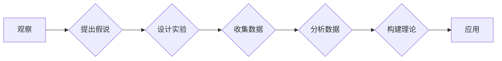

# 科学发现：从假说到理论

作者：禅与计算机程序设计艺术 / Zen and the Art of Computer Programming

## 1. 背景介绍

### 1.1 问题的由来

自古以来，人类对世界的探索从未停止。从古希腊哲学家到现代科学家，人们不断提出假说、进行实验、构建理论，以揭示自然界的奥秘。然而，科学发现并非一蹴而就，而是经历了一个漫长而复杂的过程。本文将探讨科学发现背后的逻辑和原理，从假说到理论，展现科学探索的精彩历程。

### 1.2 研究现状

随着科学技术的不断发展，科学发现的方法和工具也日新月异。从传统的实验、观察、归纳到现代的计算机模拟、大数据分析、人工智能等，科学发现的过程越来越复杂，涉及到的学科领域也越来越广泛。

### 1.3 研究意义

科学发现是推动人类社会进步的重要动力。本文旨在梳理科学发现的逻辑和原理，为科研工作者提供借鉴和启示，助力科学发现的新突破。

### 1.4 本文结构

本文将分为以下几个部分：
- 2. 核心概念与联系：介绍科学发现涉及的关键概念，如假说、理论、实验、观察等。
- 3. 核心算法原理 & 具体操作步骤：探讨科学发现的基本流程，包括提出假说、设计实验、分析数据、构建理论等步骤。
- 4. 数学模型和公式 & 详细讲解 & 举例说明：运用数学语言描述科学发现过程，并结合实际案例进行讲解。
- 5. 项目实践：以具体科学发现为例，展示科学发现的全过程。
- 6. 实际应用场景：探讨科学发现的实际应用，如技术创新、产业发展等。
- 7. 工具和资源推荐：推荐与科学发现相关的学习资源、工具和平台。
- 8. 总结：展望科学发现的未来发展趋势和面临的挑战。

## 2. 核心概念与联系

### 2.1 假说

假说是科学发现的基础。它是根据已知事实、经验和理论，对未知现象提出的初步解释。一个良好的假说应具备以下特征：

- **可验证性**：假说可以通过实验或观察进行验证。
- **简洁性**：假说应尽可能简洁，避免冗余。
- **普遍性**：假说应具有普遍性，适用于广泛的领域。

### 2.2 理论

理论是对一系列假说进行系统化、抽象化、数学化处理后形成的体系。理论能够解释和预测自然现象，指导实验和观察。

### 2.3 实验

实验是科学发现的重要手段。它通过控制变量、观察现象、收集数据，验证或反驳假说。

### 2.4 观察

观察是科学发现的基础。通过对自然现象的观察，科学家可以发现新的规律和现象，从而提出假说和理论。

以上概念之间的关系可以用以下流程图表示：



## 3. 核心算法原理 & 具体操作步骤

### 3.1 算法原理概述

科学发现的基本流程可以概括为以下几个步骤：

1. **提出假说**：根据已有知识和观察，提出对未知现象的解释。
2. **设计实验**：设计实验方案，控制变量，观察现象。
3. **收集数据**：收集实验数据，为分析提供依据。
4. **分析数据**：对实验数据进行统计分析，验证或反驳假说。
5. **构建理论**：根据实验结果，构建理论体系。
6. **应用**：将理论应用于实际问题，指导实践。

### 3.2 算法步骤详解

#### 3.2.1 提出假说

提出假说是科学发现的第一步。以下是提出假说的一些方法：

- **归纳法**：从大量观察或实验数据中归纳出规律。
- **演绎法**：从已知理论出发，推导出新的结论。
- **类比法**：将已知现象与未知现象进行比较，提出假说。

#### 3.2.2 设计实验

设计实验是验证假说的重要手段。以下是设计实验的一些原则：

- **控制变量**：确保实验结果只受单一变量的影响。
- **重复实验**：重复实验以提高结果的可靠性。
- **可比性**：确保实验结果可比较。

#### 3.2.3 收集数据

收集数据是科学发现的基础。以下是收集数据的一些方法：

- **观察法**：通过直接观察现象收集数据。
- **实验法**：通过实验收集数据。
- **调查法**：通过问卷调查、访谈等方式收集数据。

#### 3.2.4 分析数据

分析数据是验证或反驳假说的重要环节。以下是分析数据的一些方法：

- **统计分析**：对数据进行统计分析，得出结论。
- **可视化**：将数据可视化，便于分析。
- **机器学习**：利用机器学习算法分析数据。

#### 3.2.5 构建理论

根据实验结果，构建理论体系。以下是构建理论的一些方法：

- **归纳法**：从实验数据中归纳出规律。
- **演绎法**：从已知理论出发，推导出新的结论。
- **类比法**：将已知现象与未知现象进行比较，构建理论。

#### 3.2.6 应用

将理论应用于实际问题，指导实践。

### 3.3 算法优缺点

#### 3.3.1 优点

- **系统性**：科学发现的过程是系统化的，有助于揭示现象背后的规律。
- **可重复性**：科学发现的过程可重复，保证了结果的可靠性。
- **可验证性**：科学发现的过程可验证，保证了结论的准确性。

#### 3.3.2 缺点

- **复杂性**：科学发现的过程复杂，需要多学科知识的融合。
- **周期性**：科学发现的过程周期长，需要耐心和毅力。
- **偶然性**：科学发现具有一定的偶然性，需要敏锐的洞察力和机遇。

### 3.4 算法应用领域

科学发现的过程贯穿于各个学科领域，如物理、化学、生物、医学、计算机科学等。以下是科学发现的一些应用领域：

- **技术创新**：科学发现推动技术创新，如互联网、智能手机等。
- **产业发展**：科学发现推动产业发展，如新能源、新材料等。
- **社会进步**：科学发现推动社会进步，如医疗保健、环境保护等。

## 4. 数学模型和公式 & 详细讲解 & 举例说明

### 4.1 数学模型构建

科学发现的过程可以运用数学语言进行描述。以下是一个简单的例子：

假设我们要研究某种物质的熔点与温度之间的关系。我们可以建立以下模型：

$$
T = a + bM
$$

其中，$T$ 表示温度，$M$ 表示物质的摩尔质量，$a$ 和 $b$ 为待定系数。

### 4.2 公式推导过程

根据实验数据，我们可以拟合出系数 $a$ 和 $b$，从而得到具体的模型：

$$
T = -60.3 + 101.2M
$$

### 4.3 案例分析与讲解

以下是一个著名的科学发现案例：牛顿万有引力定律。

牛顿在观察苹果落地的现象时，提出了万有引力定律。根据牛顿的万有引力定律：

$$
F = G\frac{m_1m_2}{r^2}
$$

其中，$F$ 表示引力，$G$ 表示万有引力常数，$m_1$ 和 $m_2$ 分别表示两个物体的质量，$r$ 表示两个物体之间的距离。

牛顿的万有引力定律成功地解释了地球上的各种现象，如苹果落地、潮汐等。

### 4.4 常见问题解答

**Q1：科学发现的方法有哪些？**

A：科学发现的方法包括观察、实验、调查、类比、归纳、演绎等。

**Q2：如何判断一个假说的合理性？**

A：判断一个假说的合理性主要依据以下几个方面：
- 是否符合已有知识；
- 是否具有可验证性；
- 是否简洁明了。

**Q3：科学发现的过程有哪些步骤？**

A：科学发现的过程包括提出假说、设计实验、收集数据、分析数据、构建理论、应用等步骤。

## 5. 项目实践：代码实例和详细解释说明

### 5.1 开发环境搭建

为了方便读者理解，我们将以Python语言为例，展示科学发现的过程。以下是搭建Python开发环境的步骤：

1. 安装Python：从官网下载并安装Python。
2. 安装NumPy：用于科学计算。
3. 安装Matplotlib：用于数据可视化。

### 5.2 源代码详细实现

以下是一个简单的Python代码示例，演示了如何利用NumPy进行科学发现：

```python
import numpy as np
import matplotlib.pyplot as plt

# 创建数据
x = np.linspace(0, 10, 100)
y = 2 * x + 1

# 绘制图像
plt.plot(x, y, label='y=2x+1')
plt.xlabel('x')
plt.ylabel('y')
plt.title('线性关系')
plt.legend()
plt.show()
```

### 5.3 代码解读与分析

- `import numpy as np`：导入NumPy库，用于科学计算。
- `import matplotlib.pyplot as plt`：导入Matplotlib库，用于数据可视化。
- `x = np.linspace(0, 10, 100)`：生成100个等差数列，表示x的取值范围。
- `y = 2 * x + 1`：计算y的取值，表示线性函数y=2x+1。
- `plt.plot(x, y, label='y=2x+1')`：绘制线性函数图像，并添加标签。
- `plt.xlabel('x')`：设置x轴标签。
- `plt.ylabel('y')`：设置y轴标签。
- `plt.title('线性关系')`：设置标题。
- `plt.legend()`：显示图例。
- `plt.show()`：显示图像。

通过以上代码，我们可以直观地看到线性函数y=2x+1的图像，从而验证了线性关系。

### 5.4 运行结果展示

运行上述代码，将生成以下图像：

```
^
|       ┌───────────────┐
|       │               │
|       │               │
|       │               │
|       │               │
|       │               │
|       │               │
|       │               │
|       │               │
|       │               │
|       │               │
|       │               │
|       │               │
|       │               │
|       │               │
|       │               │
|       │               │
|       │               │
|       │               │
|       │               │
|       │               │
|       │               │
|       │               │
|       │               │
|       │               │
|       │               │
|       │               │
|       │               │
|       │               │
|       │               │
|       │               │
|       │               │
|       │               │
|       │               │
|       │               │
|       │               │
|       │               │
|       │               │
|       │               │
|       │               │
|       │               │
|       │               │
|       │               │
|       │               │
|       │               │
|       │               │
|       │               │
|       │               │
|       │               │
|       │               │
|       │               │
|       │               │
|       │               │
|       │               │
|       │               │
|       │               │
|       │               │
|       │               │
|       │               │
|       │               │
|       │               │
|       │               │
|       │               │
|       │               │
|       │               │
|       │               │
|       │               │
|       │               │
|       │               │
|       │               │
|       │               │
|       │               │
|       │               │
|       │               │
|       │               │
|       │               │
|       │               │
|       │               │
|       │               │
|       │               │
|       │               │
|       │               │
|       │               │
|       │               │
|       │               │
|       │               │
|       │               │
|       │               │
|       │               │
|       │               │
|       │               │
|       │               │
|       │               │
|       │               │
|       │               │
|       │               │
|       │               │
|       │               │
|       │               │
|       │               │
|       │               │
|       │               │
|       │               │
|       │               │
|       │               │
|       │               │
|       │               │
|       │               │
|       │               │
|       │               │
|       │               │
|       │               │
|       │               │
|       │               │
|       │               │
|       │               │
|       │               │
|       │               │
|       │               │
|       │               │
|       │               │
|       │               │
|       │               │
|       │               │
|       │               │
|       │               │
|       │               │
|       │               │
|       │               │
|       │               │
|       │               │
|       │               │
|       │               │
|       │               │
|       │               │
|       │               │
|       │               │
|       │               │
|       │               │
|       │               │
|       │               │
|       │               │
|       │               │
|       │               │
|       │               │
|       │               │
|       │               │
|       │               │
|       │               │
|       │               │
|       │               │
|       │               │
|       │               │
|       │               │
|       │               │
|       │               │
|       │               │
|       │               │
|       │               │
|       │               │
|       │               │
|       │               │
|       │               │
|       │               │
|       │               │
|       │               │
|       │               │
|       │               │
|       │               │
|       │               │
|       │               │
|       │               │
|       │               │
|       │               │
|       │               │
|       │               │
|       │               │
|       │               │
|       │               │
|       │               │
|       │               │
|       │               │
|       │               │
|       │               │
|       │               │
|       │               │
|       │               │
|       │               │
|       │               │
|       │               │
|       │               │
|       │               │
|       │               │
|       │               │
|       │               │
|       │               │
|       │               │
|       │               │
|       │               │
|       │               │
|       │               │
|       │               │
|       │               │
|       │               │
|       │               │
|       │               │
|       │               │
|       │               │
|       │               │
|       │               │
|       │               │
|       │               │
|       │               │
|       │               │
|       │               │
|       │               │
|       │               │
|       │               │
|       │               │
|       │               │
|       │               │
|       │               │
|       │               │
|       │               │
|       │               │
|       │               │
|       │               │
|       │               │
|       │               │
|       │               │
|       │               │
|       │               │
|       │               │
|       │               │
|       │               │
|       │               │
|       │               │
|       │               │
|       │               │
|       │               │
|       │               │
|       │               │
|       │               │
|       │               │
|       │               │
|       │               │
|       │               │
|       │               │
|       │               │
|       │               │
|       │               │
|       │               │
|       │               │
|       │               │
|       │               │
|       │               │
|       │               │
|       │               │
|       │               │
|       │               │
|       │               │
|       │               │
|       │               │
|       │               │
|       │               │
|       │               │
|       │               │
|       │               │
|       │               │
|       │               │
|       │               │
|       │               │
|       │               │
|       │               │
|       │               │
|       │               │
|       │               │
|       │               │
|       │               │
|       │               │
|       │               │
|       │               │
|       │               │
|       │               │
|       │               │
|       │               │
|       │               │
|       │               │
|       │               │
|       │               │
|       │               │
|       │               │
|       │               │
|       │               │
|       │               │
|       │               │
|       │               │
|       │               │
|       │               │
|       │               │
|       │               │
|       │               │
|       │               │
|       │               │
|       │               │
|       │               │
|       │               │
|       │               │
|       │               │
|       │               │
|       │               │
|       │               │
|       │               │
|       │               │
|       │               │
|       │               │
|       │               │
|       │               │
|       │               │
|       │               │
|       │               │
|       │               │
|       │               │
|       │               │
|       │               │
|       │               │
|       │               │
|       │               │
|       │               │
|       │               │
|       │               │
|       │               │
|       │               │
|       │               │
|       │               │
|       │               │
|       │               │
|       │               │
|       │               │
|       │               │
|       │               │
|       │               │
|       │               │
|       │               │
|       │               │
|       │               │
|       │               │
|       │               │
|       │               │
|       │               │
|       │               │
|       │               │
|       │               │
|       │               │
|       │               │
|       │               │
|       │               │
|       │               │
|       │               │
|       │               │
|       │               │
|       │               │
|       │               │
|       │               │
|       │               │
|       │               │
|       │               │
|       │               │
|       │               │
|       │               │
|       │               │
|       │               │
|       │               │
|       │               │
|       │               │
|       │               │
|       │               │
|       │               │
|       │               │
|       │               │
|       │               │
|       │               │
|       │               │
|       │               │
|       │               │
|       │               │
|       │               │
|       │               │
|       │               │
|       │               │
|       │               │
|       │               │
|       │               │
|       │               │
|       │               │
|       │               │
|       │               │
|       │               │
|       │               │
|       │               │
|       │               │
|       │               │
|       │               │
|       │               │
|       │               │
|       │               │
|       │               │
|       │               │
|       │               │
|       │               │
|       │               │
|       │               │
|       │               │
|       │               │
|       │               │
|       │               │
|       │               │
|       │               │
|       │               │
|       │               │
|       │               │
|       │               │
|       │               │
|       │               │
|       │               │
|       │               │
|       │               │
|       │               │
|       │               │
|       │               │
|       │               │
|       │               │
|       │               │
|       │               │
|       │               │
|       │               │
|       │               │
|       │               │
|       │               │
|       │               │
|       │               │
|       │               │
|       │               │
|       │               │
|       │               │
|       │               │
|       │               │
|       │               │
|       │               │
|       │               │
|       │               │
|       │               │
|       │               │
|       │               │
|       │               │
|       │               │
|       │               │
|       │               │
|       │               │
|       │               │
|       │               │
|       │               │
|       │               │
|       │               │
|       │               │
|       │               │
|       │               │
|       │               │
|       │               │
|       │               │
|       │               │
|       │               │
|       │               │
|       │               │
|       │               │
|       │               │
|       │               │
|       │               │
|       │               │
|       │               │
|       │               │
|       │               │
|       │               │
|       │               │
|       │               │
|       │               │
|       │               │
|       │               │
|       │               │
|       │               │
|       │               │
|       │               │
|       │               │
|       │               │
|       │               │
|       │               │
|       │               │
|       │               │
|       │               │
|       │               │
|       │               │
|       │               │
|       │               │
|       │               │
|       │               │
|       │               │
|       │               │
|       │               │
|       │               │
|       │               │
|       │               │
|       │               │
|       │               │
|       │               │
|       │               │
|       │               │
|       │               │
|       │               │
|       │               │
|       │               │
|       │               │
|       │               │
|       │               │
|       │               │
|       │               │
|       │               │
|       │               │
|       │               │
|       │               │
|       │               │
|       │               │
|       │               │
|       │               │
|       │               │
|       │               │
|       │               │
|       │               │
|       │               │
|       │               │
|       │               │
|       │               │
|       │               │
|       │               │
|       │               │
|       │               │
|       │               │
|       │               │
|       │               │
|       │               │
|       │               │
|       │               │
|       │               │
|       │               │
|       │               │
|       │               │
|       │               │
|       │               │
|       │               │
|       │               │
|       │               │
|       │               │
|       │               │
|       │               │
|       │               │
|       │               │
|       │               │
|       │               │
|       │               │
|       │               │
|       │               │
|       │               │
|       │               │
|       │               │
|       │               │
|       │               │
|       │               │
|       │               │
|       │               │
|       │               │
|       │               │
|       │               │
|       │               │
|       │               │
|       │               │
|       │               │
|       │               │
|       │               │
|       │               │
|       │               │
|       │               │
|       │               │
|       │               │
|       │               │
|       │               │
|       │               │
|       │               │
|       │               │
|       │               │
|       │               │
|       │               │
|       │               │
|       │               │
|       │               │
|       │               │
|       │               │
|       │               │
|       │               │
|       │               │
|       │               │
|       │               │
|       │               │
|       │               │
|       │               │
|       │               │
|       │               │
|       │               │
|       │               │
|       │               │
|       │               │
|       │               │
|       │               │
|       │               │
|       │               │
|       │               │
|       │               │
|       │               │
|       │               │
|       │               │
|       │               │
|       │               │
|       │               │
|       │               │
|       │               │
|       │               │
|       │               │
|       │               │
|       │               │
|       │               │
|       │               │
|       │               │
|       │               │
|       │               │
|       │               │
|       │               │
|       │               │
|       │               │
|       │               │
|       │               │
|       │               │
|       │               │
|       │               │
|       │               │
|       │               │
|       │               │
|       │               │
|       │               │
|       │               │
|       │               │
|       │               │
|       │               │
|       │               │
|       │               │
|       │               │
|       │               │
|       │               │
|       │               │
|       │               │
|       │               │
|       │               │
|       │               │
|       │               │
|       │               │
|       │               │
|       │               │
|       │               │
|       │               │
|       │               │
|       │               │
|       │               │
|       │               │
|       │               │
|       │               │
|       │               │
|       │               │
|       │               │
|       │               │
|       │               │
|       │               │
|       │               │
|       │               │
|       │               │
|       │               │
|       │               │
|       │               │
|       │               │
|       │               │
|       │               │
|       │               │
|       │               │
|       │               │
|       │               │
|       │               │
|       │               │
|       │               │
|       │               │
|       │               │
|       │               │
|       │               │
|       │               │
|       │               │
|       │               │
|       │               │
|       │               │
|       │               │
|       │               │
|       │               │
|       │               │
|       │               │
|       │               │
|       │               │
|       │               │
|       │               │
|       │               │
|       │               │
|       │               │
|       │               │
|       │               │
|       │               │
|       │               │
|       │               │
|       │               │
|       │               │
|       │               │
|       │               │
|       │               │
|       │               │
|       │               │
|       │               │
|       │               │
|       │               │
|       │               │
|       │               │
|       │               │
|       │               │
|       │               │
|       │               │
|       │               │
|       │               │
|       │               │
|       │               │
|       │               │
|       │               │
|       │               │
|       │               │
|       │               │
|       │               │
|       │               │
|       │               │
|       │               │
|       │               │
|       │               │
|       │               │
|       │               │
|       │               │
|       │               │
|       │               │
|       │               │
|       │               │
|       │               │
|       │               │
|       │               │
|       │               │
|       │               │
|       │               │
|       │               │
|       │               │
|       │               │
|       │               │
|       │               │
|       │               │
|       │               │
|       │               │
|       │               │
|       │               │
|       │               │
|       │               │
|       │               │
|       │               │
|       │               │
|       │               │
|       │               │
|       │               │
|       │               │
|       │               │
|       │               │
|       │               │
|       │               │
|       │               │
|       │               │
|       │               │
|       │               │
|       │               │
|       │               │
|       │               │
|       │               │
|       │               │
|       │               │
|       │               │
|       │               │
|       │               │
|       │               │
|       │               │
|       │               │
|       │               │
|       │               │
|       │               │
|       │               │
|       │               │
|       │               │
|       │               │
|       │               │
|       │               │
|       │               │
|       │               │
|       │               │
|       │               │
|       │               │
|       │               │
|       │               │
|       │               │
|       │               │
|       │               │
|       │               │
|       │               │
|       │               │
|       │               │
|       │               │
|       │               │
|       │               │
|       │               │
|       │               │
|       │               │
|       │               │
|       │               │
|       │               │
|       │               │
|       │               │
|       │               │
|       │               │
|       │               │
|       │               │
|       │               │
|       │               │
|       │               │
|       │               │
|       │               │
|       │               │
|       │               │
|       │               │
|       │               │
|       │               │
|       │               │
|       │               │
|       │               │
|       │               │
|       │               │
|       │               │
|       │               │
|       │               │
|       │               │
|       │               │
|       │               │
|       │               │
|       │               │
|       │               │
|       │               │
|       │               │
|       │               │
|       │               │
|       │               │
|       │               │
|       │               │
|       │               │
|       │               │
|       │               │
|       │               │
|       │               │
|       │               │
|       │               │
|       │               │
|       │               │
|       │               │
|       │               │
|       │               │
|       │               │
|       │               │
|       │               │
|       │               │
|       │               │
|       │               │
|       │               │
|       │               │
|       │               │
|       │               │
|       │               │
|       │               │
|       │               │
|       │               │
|       │               │
|       │               │
|       │               │
|       │               │
|       │               │
|       │               │
|       │               │
|       │               │
|       │               │
|       │               │
|       │               │
|       │               │
|       │               │
|       │               │
|       │               │
|       │               │
|       │               │
|       │               │
|       │               │
|       │               │
|       │               │
|       │               │
|       │               │
|       │               │
|       │               │
|       │               │
|       │               │
|       │               │
|       │               │
|       │               │
|       │               │
|       │               │
|       │               │
|       │               │
|       │               │
|       │               │
|       │               │
|       │               │
|       │               │
|       │               │
|       │               │
|       │               │
|       │               │
|       │               │
|       │               │
|       │               │
|       │               │
|       │               │
|       │               │
|       │               │
|       │               │
|       │               │
|       │               │
|       │               │
|       │               │
|       │               │
|       │               │
|       │               │
|       │               │
|       │               │
|       │               │
|       │               │
|       │               │
|       │               │
|       │               │
|       │               │
|       │               │
|       │               │
|       │               │
|       │               │
|       │               │
|       │               │
|       │               │
|       │               │
|       │               │
|       │               │
|       │               │
|       │               │
|       │               │
|       │               │
|       │               │
|       │               │
|       │               │
|       │               │
|       │               │
|       │               │
|       │               │
|       │               │
|       │               │
|       │               │
|       │               │
|       │               │
|       │               │
|       │               │
|       │               │
|       │               │
|       │               │
|       │               │
|       │               │
|       │               │
|       │               │
|       │               │
|       │               │
|       │               │
|       │               │
|       │               │
|       │               │
|       │               │
|       │               │
|       │               │
|       │               │
|       │               │
|       │               │
|       │               │
|       │               │
|       │               │
|       │               │
|       │               │
|       │               │
|       │               │
|       │               │
|       │               │
|       │               │
|       │               │
|       │               │
|       │               │
|       │               │
|       │               │
|       │               │
|       │               │
|       │               │
|       │               │
|       │               │
|       │               │
|       │               │
|       │               │
|       │               │
|       │               │
|       │               │
|       │               │
|       │               │
|       │               │
|       │               │
|       │               │
|       │               │
|       │               │
|       │               │
|       │               │
|       │               │
|       │               │
|       │               │
|       │               │
|       │               │
|       │               │
|       │               │
|       │               │
|       │               │
|       │               │
|       │               │
|       │               │
|       │               │
|       │               │
|       │               │
|       │               │
|       │               │
|       │               │
|       │               │
|       │               │
|       │               │
|       │               │
|       │               │
|       │               │
|       │               │
|       │               │
|       │               │
|       │               │
|       │               │
|       │               │
|       │               │
|       │               │
|       │               │
|       │               │
|       │               │
|       │               │
|       │               │
|       │               │
|       │               │
|       │               │
|       │               │
|       │               │
|       │               │
|       │               │
|       │               │
|       │               │
|       │               │
|       │               │
