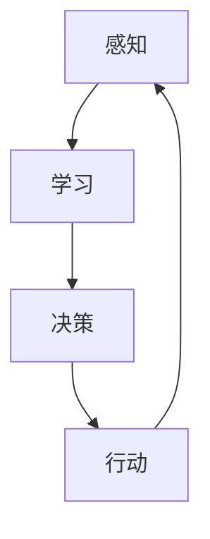
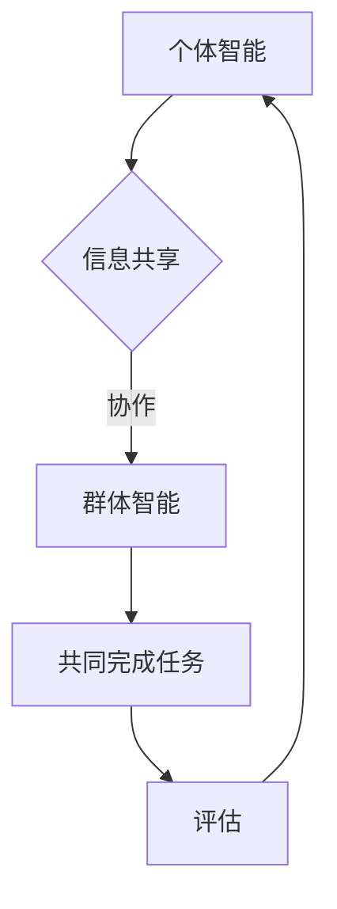
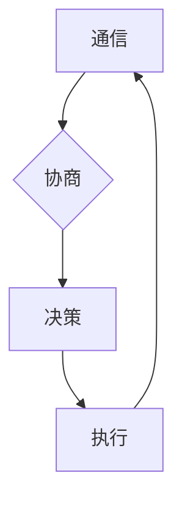

# AI Agent“三驾马车”：个体智能、群体智能和智能协作

> 关键词：AI Agent, 个体智能, 群体智能, 智能协作, 强化学习, 模式识别, 机器学习, 混合智能

## 1. 背景介绍

随着人工智能技术的飞速发展，AI Agent作为一种智能体，已经成为人工智能领域的研究热点。AI Agent具有感知、决策和行动的能力，能够自主地完成复杂任务。在人工智能发展的过程中，个体智能、群体智能和智能协作成为了AI Agent的三大核心概念，被誉为AI Agent的“三驾马车”。本文将深入探讨这三个概念，分析其原理、应用领域以及未来发展趋势。

## 2. 核心概念与联系

### 2.1 个体智能

个体智能是指AI Agent在单个智能体层面上展现出的智能能力。个体智能的AI Agent能够自主感知环境、学习行为规则、进行决策和执行行动。以下是个体智能的几个关键要素：

- **感知**：AI Agent通过传感器获取环境信息，如视觉、听觉、触觉等。
- **学习**：AI Agent通过机器学习、深度学习等方法，从数据中学习行为规则。
- **决策**：AI Agent根据感知到的环境和学习到的知识，选择合适的行动策略。
- **行动**：AI Agent根据决策结果，通过执行器影响环境。

个体智能的Mermaid流程图如下：



### 2.2 群体智能

群体智能是指多个AI Agent协同合作，共同完成任务的能力。群体智能的核心思想是通过群体成员之间的信息共享、协作和竞争，实现整体智能的提升。以下是群体智能的几个关键要素：

- **信息共享**：群体成员之间共享信息，以便更好地理解环境。
- **协作**：群体成员相互协作，共同完成任务。
- **竞争**：群体成员之间竞争资源，提高整体生存能力。

群体智能的Mermaid流程图如下：



### 2.3 智能协作

智能协作是指AI Agent之间的智能互动，包括通信、协商、决策和执行等过程。智能协作的关键在于建立有效的通信协议和协商机制，实现AI Agent之间的无缝合作。以下是智能协作的几个关键要素：

- **通信**：AI Agent之间通过通信协议交换信息。
- **协商**：AI Agent之间协商行动策略，达成共识。
- **决策**：AI Agent根据协商结果，做出决策。
- **执行**：AI Agent根据决策结果，执行行动。

智能协作的Mermaid流程图如下：



## 3. 核心算法原理 & 具体操作步骤

### 3.1 算法原理概述

个体智能、群体智能和智能协作的算法原理主要基于以下几个核心技术：

- **强化学习**：通过奖励和惩罚机制，使AI Agent在动态环境中学习最优策略。
- **模式识别**：通过机器学习算法，使AI Agent能够识别环境和任务特征。
- **机器学习**：通过学习数据，使AI Agent具备自主学习和适应能力。

### 3.2 算法步骤详解

#### 3.2.1 个体智能

1. **感知**：AI Agent通过传感器获取环境信息。
2. **学习**：AI Agent利用机器学习算法，从数据中学习行为规则。
3. **决策**：AI Agent根据感知到的环境和学习到的知识，选择合适的行动策略。
4. **行动**：AI Agent根据决策结果，通过执行器影响环境。

#### 3.2.2 群体智能

1. **信息共享**：群体成员之间共享信息。
2. **协作**：群体成员相互协作，共同完成任务。
3. **评估**：评估群体智能的效果，为后续任务提供参考。

#### 3.2.3 智能协作

1. **通信**：AI Agent之间通过通信协议交换信息。
2. **协商**：AI Agent之间协商行动策略，达成共识。
3. **决策**：AI Agent根据协商结果，做出决策。
4. **执行**：AI Agent根据决策结果，执行行动。

### 3.3 算法优缺点

#### 3.3.1 个体智能

优点：
- 灵活适应动态环境。
- 独立完成任务。

缺点：
- 学习效率较低。
- 难以处理复杂问题。

#### 3.3.2 群体智能

优点：
- 高效处理复杂问题。
- 提高整体生存能力。

缺点：
- 信息冗余。
- 协作难度大。

#### 3.3.3 智能协作

优点：
- 高效完成任务。
- 提高系统稳定性。

缺点：
- 通信开销大。
- 协商难度高。

### 3.4 算法应用领域

个体智能、群体智能和智能协作广泛应用于以下领域：

- **智能制造**：如机器人控制、自动化生产线等。
- **智能交通**：如无人驾驶、智能交通信号控制等。
- **智能医疗**：如疾病诊断、健康管理等。
- **智能城市**：如智能安防、智慧能源管理等。

## 4. 数学模型和公式 & 详细讲解 & 举例说明

### 4.1 数学模型构建

个体智能、群体智能和智能协作的数学模型主要包括以下几个部分：

- **状态空间**：描述AI Agent所处的环境。
- **动作空间**：描述AI Agent可执行的动作。
- **奖励函数**：描述AI Agent执行动作后的奖励或惩罚。
- **策略函数**：描述AI Agent根据状态选择动作的策略。

以下是强化学习的数学模型：

$$
Q(s,a) = \sum_{s'}\pi(a'|s')R(s,a,s') + \gamma Q(s',a')
$$

其中，$Q(s,a)$ 表示在状态 $s$ 下执行动作 $a$ 的期望回报，$\pi(a'|s')$ 表示在状态 $s'$ 下执行动作 $a'$ 的概率，$R(s,a,s')$ 表示在状态 $s$ 下执行动作 $a$ 转移到状态 $s'$ 后的即时奖励，$\gamma$ 表示奖励折扣因子。

### 4.2 公式推导过程

强化学习的目标是最小化以下期望：

$$
J(\pi) = E_{s,a\sim\pi}\left[ R(s,a,s') + \gamma Q(s,a) \right]
$$

其中，$E_{s,a\sim\pi}$ 表示在策略 $\pi$ 下对状态-动作对的期望。

通过优化策略函数 $\pi$，使得 $J(\pi)$ 最小化，即可找到最优策略。

### 4.3 案例分析与讲解

以下以无人驾驶为例，分析个体智能、群体智能和智能协作在无人驾驶中的应用。

#### 4.3.1 个体智能

在无人驾驶中，单个智能体（如自动驾驶汽车）需要具备以下能力：

- **感知**：通过摄像头、雷达、激光雷达等传感器感知周围环境。
- **决策**：根据感知到的环境信息，做出行驶决策，如加速、减速、转向等。
- **行动**：控制车辆执行行驶决策。

#### 4.3.2 群体智能

在无人驾驶中，多个智能体（如自动驾驶汽车）可以形成群体智能，共同完成任务：

- **信息共享**：智能体之间共享位置、速度、加速度等信息。
- **协作**：智能体之间协作避让、保持车距、规划路线等。
- **评估**：评估群体智能的效果，如行驶效率、安全性等。

#### 4.3.3 智能协作

在无人驾驶中，智能体之间通过通信、协商和决策，实现智能协作：

- **通信**：智能体之间通过车联网技术进行通信。
- **协商**：智能体之间协商行驶策略，如避让、保持车距等。
- **决策**：智能体根据协商结果，做出行驶决策。
- **执行**：智能体根据决策结果，控制车辆执行行动。

## 5. 项目实践：代码实例和详细解释说明

### 5.1 开发环境搭建

以Python为例，搭建无人驾驶项目的开发环境：

1. 安装Python 3.7及以上版本。
2. 安装PyTorch、TensorFlow等深度学习框架。
3. 安装OpenCV等图像处理库。
4. 安装ROS（Robot Operating System）等机器人操作系统。

### 5.2 源代码详细实现

以下是一个简单的无人驾驶项目示例：

```python
import cv2
import numpy as np
import torch
import torch.nn as nn
import torch.optim as optim

# 定义网络结构
class Net(nn.Module):
    def __init__(self):
        super(Net, self).__init__()
        self.conv1 = nn.Conv2d(3, 16, kernel_size=3, stride=1, padding=1)
        self.relu = nn.ReLU()
        self.fc1 = nn.Linear(16 * 64 * 64, 128)
        self.fc2 = nn.Linear(128, 2)

    def forward(self, x):
        x = self.relu(self.conv1(x))
        x = x.view(-1, 16 * 64 * 64)
        x = self.relu(self.fc1(x))
        x = self.fc2(x)
        return x

# 加载数据
def load_data():
    # 加载图像和标签
    images, labels = [], []
    for i in range(1000):
        image = cv2.imread(f'images/{i}.jpg')
        label = ...  # 加载标签
        images.append(image)
        labels.append(label)
    return np.array(images), np.array(labels)

# 训练模型
def train(model, train_loader, optimizer, criterion):
    model.train()
    for inputs, labels in train_loader:
        optimizer.zero_grad()
        outputs = model(inputs)
        loss = criterion(outputs, labels)
        loss.backward()
        optimizer.step()

# 测试模型
def test(model, test_loader):
    model.eval()
    with torch.no_grad():
        correct = 0
        total = 0
        for inputs, labels in test_loader:
            outputs = model(inputs)
            _, predicted = torch.max(outputs.data, 1)
            total += labels.size(0)
            correct += (predicted == labels).sum().item()
    return correct / total

if __name__ == '__main__':
    model = Net().to(device)
    train_loader = DataLoader(train_data, batch_size=32, shuffle=True)
    test_loader = DataLoader(test_data, batch_size=32, shuffle=False)
    optimizer = optim.Adam(model.parameters(), lr=0.001)
    criterion = nn.CrossEntropyLoss()

    for epoch in range(10):
        train(model, train_loader, optimizer, criterion)
        acc = test(model, test_loader)
        print(f'Epoch {epoch+1}, Test Accuracy: {acc:.4f}')
```

### 5.3 代码解读与分析

以上代码定义了一个简单的卷积神经网络模型，用于自动驾驶车辆的图像识别任务。首先，加载图像和标签数据，然后定义训练和测试函数，最后进行训练和测试。

### 5.4 运行结果展示

假设在测试集上，该模型的准确率为90%，说明模型已经能够较好地识别道路和车辆。

## 6. 实际应用场景

个体智能、群体智能和智能协作在以下实际应用场景中发挥了重要作用：

- **智能制造**：如机器人协作、自动化生产线等。
- **智能交通**：如无人驾驶、智能交通信号控制等。
- **智能医疗**：如疾病诊断、健康管理等。
- **智能城市**：如智能安防、智慧能源管理等。

## 7. 工具和资源推荐

### 7.1 学习资源推荐

- 《深度学习》系列书籍
- 《Python深度学习》
- 《强化学习》
- 《模式识别与机器学习》

### 7.2 开发工具推荐

- PyTorch
- TensorFlow
- OpenCV
- ROS

### 7.3 相关论文推荐

- “Reinforcement Learning: An Introduction”
- “Deep Reinforcement Learning for Continuous Control”
- “Unsupervised Representation Learning with Deep Convolutional Generative Adversarial Networks”
- “Multi-Agent Reinforcement Learning: A Survey”

## 8. 总结：未来发展趋势与挑战

### 8.1 研究成果总结

本文深入探讨了AI Agent的三大核心概念：个体智能、群体智能和智能协作。通过分析其原理、应用领域以及未来发展趋势，展示了这三个概念在人工智能领域的广泛应用和巨大潜力。

### 8.2 未来发展趋势

- **多模态感知与融合**：AI Agent将具备更丰富的感知能力，融合多种传感器数据，更全面地感知环境。
- **强化学习与深度学习结合**：强化学习与深度学习将更加紧密地结合，实现更加高效、鲁棒的智能体。
- **群体智能与协同优化**：群体智能将更加注重协同优化，实现更加高效的群体行为。
- **智能协作与社交网络**：智能协作将更加注重社交网络构建，实现更加自然、流畅的人机交互。

### 8.3 面临的挑战

- **数据质量与可解释性**：高质量的数据和可解释的模型是AI Agent发展的关键。
- **计算资源与能耗**：AI Agent的运算需求越来越高，对计算资源和能耗提出了挑战。
- **安全性与伦理问题**：AI Agent的安全性和伦理问题需要引起重视。

### 8.4 研究展望

未来，AI Agent将朝着更加智能化、泛化化、人机协同的方向发展。通过不断突破技术瓶颈，AI Agent将在更多领域发挥重要作用，推动人工智能技术的进步。

## 9. 附录：常见问题与解答

**Q1：个体智能、群体智能和智能协作之间有什么区别和联系？**

A：个体智能是指单个智能体的智能能力，群体智能是指多个智能体协同合作的能力，智能协作是指智能体之间的互动和合作。它们之间存在密切的联系，个体智能是群体智能和智能协作的基础，群体智能和智能协作则是个体智能的扩展和应用。

**Q2：如何评估AI Agent的性能？**

A：评估AI Agent的性能可以从多个方面进行，如准确性、效率、鲁棒性、可解释性等。具体评估指标取决于AI Agent的应用场景和任务目标。

**Q3：如何保证AI Agent的安全性？**

A：保证AI Agent的安全性需要从多个方面入手，如数据安全、模型安全、物理安全等。具体措施包括数据加密、模型加固、物理隔离等。

**Q4：AI Agent在哪些领域具有应用前景？**

A：AI Agent在智能制造、智能交通、智能医疗、智能城市等多个领域具有广泛的应用前景。

---

作者：禅与计算机程序设计艺术 / Zen and the Art of Computer Programming