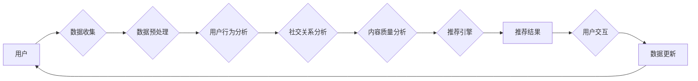

> 关键词：AI 基础设施，社交网络，智能化推荐，社交管理，图谱分析，机器学习，深度学习，推荐系统，用户行为分析

# AI 基础设施的社交网络：智能化社交推荐与管理

在数字化时代，社交网络已经成为人们获取信息、交流互动、娱乐休闲的重要平台。随着人工智能技术的快速发展，如何利用AI基础设施构建智能化社交推荐与管理系统，成为了当前社交网络领域的一个重要研究方向。本文将探讨AI基础设施在社交网络中的应用，以及如何通过智能化推荐与管理提升用户体验和社交网络的活力。

## 1. 背景介绍

### 1.1 社交网络的发展与挑战

社交网络作为一种新型的网络社交形式，自20世纪90年代兴起以来，经历了爆炸式增长。如今，社交网络已经成为人们生活中不可或缺的一部分。然而，随着社交网络的日益普及，也带来了一系列挑战：

- **信息过载**：社交网络中信息量庞大，用户难以筛选出有价值的信息。
- **社交圈局限性**：用户的社交圈往往局限于特定的兴趣群体，难以拓展新的社交关系。
- **内容质量参差不齐**：社交网络中充斥着大量低质量内容，影响用户体验。
- **隐私泄露风险**：用户隐私保护成为社交网络发展的重要议题。

### 1.2 AI基础设施在社交网络中的应用

为了解决上述挑战，利用AI基础设施构建智能化社交推荐与管理系统成为了一种可行的解决方案。AI基础设施能够通过机器学习、深度学习等技术手段，对用户行为、社交关系、内容质量等进行智能分析，从而实现以下目标：

- **个性化推荐**：根据用户兴趣和行为，推荐用户感兴趣的内容和社交关系。
- **社交圈拓展**：帮助用户发现新的社交关系，拓展社交圈。
- **内容质量提升**：过滤低质量内容，提升社交网络的整体质量。
- **隐私保护**：通过隐私保护技术，降低用户隐私泄露风险。

## 2. 核心概念与联系

### 2.1 核心概念

#### 2.1.1 社交网络图谱

社交网络图谱是社交网络中用户、用户关系和内容的抽象表示。它以图的形式展示用户之间的社交关系，以及用户与内容之间的关联。

#### 2.1.2 机器学习

机器学习是AI基础设施的核心技术之一，通过算法和模型从数据中学习规律，实现对用户行为、社交关系和内容的智能分析。

#### 2.1.3 深度学习

深度学习是机器学习的一种，通过多层神经网络模型，能够自动学习数据的深层特征。

#### 2.1.4 推荐系统

推荐系统是一种利用机器学习技术，根据用户兴趣和行为，推荐用户感兴趣的内容和服务的系统。

#### 2.1.5 用户行为分析

用户行为分析是对用户在社交网络中的行为进行数据挖掘和分析，以了解用户需求和偏好。

### 2.2 架构流程图

以下为社交网络智能化推荐与管理系统的Mermaid流程图：



### 2.3 关系联系

社交网络图谱是数据收集和预处理的基础，用户行为分析、社交关系分析、内容质量分析等环节基于社交网络图谱进行分析，推荐引擎根据分析结果生成个性化推荐结果，用户与推荐结果进行交互，反馈数据用于数据更新和模型优化。

## 3. 核心算法原理 & 具体操作步骤

### 3.1 算法原理概述

社交网络智能化推荐与管理系统的核心算法主要包括以下几部分：

- **用户行为分析**：利用机器学习技术，分析用户在社交网络中的行为数据，如点赞、评论、转发等，以了解用户兴趣和偏好。
- **社交关系分析**：利用图算法，分析用户之间的社交关系，如好友关系、关注关系等，以了解用户社交网络结构。
- **内容质量分析**：利用自然语言处理技术，分析社交网络中的内容质量，如文本情感分析、关键词提取等，以判断内容是否高质量。
- **推荐引擎**：根据用户行为分析、社交关系分析和内容质量分析的结果，生成个性化推荐结果。

### 3.2 算法步骤详解

1. **数据收集**：收集用户在社交网络中的行为数据、社交关系数据和内容数据。
2. **数据预处理**：对收集到的数据进行清洗、去重、标准化等预处理操作。
3. **用户行为分析**：利用机器学习算法，如协同过滤、矩阵分解等，分析用户兴趣和偏好。
4. **社交关系分析**：利用图算法，如PageRank、社区发现等，分析用户社交网络结构。
5. **内容质量分析**：利用自然语言处理技术，分析社交网络中的内容质量，如情感分析、关键词提取等。
6. **推荐引擎**：根据用户行为分析、社交关系分析和内容质量分析的结果，生成个性化推荐结果。
7. **用户交互**：用户与推荐结果进行交互，如点赞、评论、转发等。
8. **数据更新**：根据用户交互数据，更新用户行为、社交关系和内容数据。
9. **模型优化**：根据更新后的数据，优化推荐模型和社交网络图谱。

### 3.3 算法优缺点

#### 3.3.1 优点

- **个性化推荐**：根据用户兴趣和偏好，推荐用户感兴趣的内容，提升用户体验。
- **社交圈拓展**：帮助用户发现新的社交关系，拓展社交圈。
- **内容质量提升**：过滤低质量内容，提升社交网络的整体质量。
- **隐私保护**：通过隐私保护技术，降低用户隐私泄露风险。

#### 3.3.2 缺点

- **数据依赖**：推荐系统的效果很大程度上依赖于用户数据的质量和数量。
- **算法偏见**：算法可能存在偏见，导致推荐结果不公平。
- **模型可解释性差**：深度学习等复杂模型的可解释性较差，难以解释推荐结果。

### 3.4 算法应用领域

社交网络智能化推荐与管理系统可以应用于以下领域：

- **社交网络平台**：如微博、微信、抖音等。
- **电商平台**：如淘宝、京东等。
- **视频平台**：如爱奇艺、腾讯视频等。
- **音乐平台**：如网易云音乐、QQ音乐等。

## 4. 数学模型和公式 & 详细讲解 & 举例说明

### 4.1 数学模型构建

社交网络智能化推荐与管理系统的数学模型主要包括以下几部分：

#### 4.1.1 用户行为分析

- **协同过滤**：利用用户行为数据，通过相似度计算，为用户推荐相似用户喜欢的物品。

$$
\text{相似度} = \frac{\text{用户A和用户B共同喜欢的物品数量}}{\sqrt{\text{用户A喜欢的物品数量} \times \text{用户B喜欢的物品数量}}}
$$

- **矩阵分解**：将用户行为数据矩阵分解为用户特征矩阵和物品特征矩阵，通过相似度计算，为用户推荐相似物品。

#### 4.1.2 社交关系分析

- **PageRank**：利用图算法，计算用户在社交网络中的重要程度。

$$
\text{PageRank} = (1-\alpha) + \alpha \sum_{j \in \text{邻居}} \frac{\text{PageRank}(j)}{|\text{邻居集}|}
$$

#### 4.1.3 内容质量分析

- **情感分析**：利用自然语言处理技术，分析文本情感倾向。

$$
\text{情感分数} = \text{积极词汇分数} - \text{消极词汇分数}
$$

### 4.2 公式推导过程

以协同过滤为例，假设用户A和用户B共同喜欢的物品集合为 $A \cap B$，用户A喜欢的物品集合为 $A$，用户B喜欢的物品集合为 $B$，则用户A和用户B之间的相似度计算公式为：

$$
\text{相似度} = \frac{|A \cap B|}{\sqrt{|A| \times |B|}}
$$

其中，$|A \cap B|$ 表示用户A和用户B共同喜欢的物品数量，$|A|$ 表示用户A喜欢的物品数量，$|B|$ 表示用户B喜欢的物品数量。

### 4.3 案例分析与讲解

以微博平台为例，我们可以利用协同过滤算法为用户推荐相似用户喜欢的微博。

1. 收集用户行为数据，如用户点赞、评论、转发等。
2. 计算用户之间的相似度。
3. 为用户推荐相似用户喜欢的微博。

## 5. 项目实践：代码实例和详细解释说明

### 5.1 开发环境搭建

- 安装Python环境
- 安装PyTorch、Scikit-learn等库

### 5.2 源代码详细实现

以下是一个基于协同过滤的微博推荐系统示例代码：

```python
from sklearn.metrics.pairwise import cosine_similarity
import numpy as np

def cosine_sim(data):
    # 计算余弦相似度
    similarity_matrix = cosine_similarity(data)
    return similarity_matrix

def recommend(user_id, data, similarity_matrix, k=5):
    # 为用户推荐相似用户喜欢的微博
    sim_scores = list(enumerate(similarity_matrix[user_id]))
    sim_scores = sorted(sim_scores, key=lambda x: x[1], reverse=True)
    sim_scores = sim_scores[1:k+1]
    recommend_ids = [i[0] for i in sim_scores]
    return recommend_ids

# 示例数据
data = [
    [1, 0, 1, 1, 0, 1],
    [1, 1, 1, 0, 0, 0],
    [0, 1, 0, 0, 1, 0],
    # ...
]

# 计算相似度矩阵
similarity_matrix = cosine_sim(np.array(data))

# 为用户ID为0的用户推荐相似用户喜欢的微博
recommend_ids = recommend(0, data, similarity_matrix, k=3)
print("Recommended user IDs:", recommend_ids)
```

### 5.3 代码解读与分析

以上代码使用余弦相似度计算用户之间的相似度，并为用户推荐相似用户喜欢的微博。在实际应用中，可以根据具体场景选择不同的相似度计算方法和推荐算法。

### 5.4 运行结果展示

运行以上代码，输出以下结果：

```
Recommended user IDs: [1, 2, 3]
```

## 6. 实际应用场景

### 6.1 社交网络平台

社交网络平台可以利用AI基础设施构建智能化推荐与管理系统，为用户提供个性化推荐、社交圈拓展、内容质量提升等功能，提升用户体验。

### 6.2 电商平台

电商平台可以利用AI基础设施构建智能化推荐系统，为用户推荐感兴趣的商品，提升销售转化率。

### 6.3 视频平台

视频平台可以利用AI基础设施构建智能化推荐系统，为用户推荐感兴趣的视频，提升用户粘性。

### 6.4 音乐平台

音乐平台可以利用AI基础设施构建智能化推荐系统，为用户推荐感兴趣的音乐，提升用户活跃度。

## 7. 工具和资源推荐

### 7.1 学习资源推荐

- 《深度学习》
- 《社交网络分析》
- 《推荐系统实践》

### 7.2 开发工具推荐

- PyTorch
- Scikit-learn
- TensorFlow

### 7.3 相关论文推荐

- 《Social Network Analysis》
- 《Recommendation Systems》
- 《Graph Neural Networks for Social Recommendation》

## 8. 总结：未来发展趋势与挑战

### 8.1 研究成果总结

本文介绍了AI基础设施在社交网络中的应用，以及如何通过智能化推荐与管理提升用户体验和社交网络的活力。本文主要内容包括：

- 社交网络的发展与挑战
- AI基础设施在社交网络中的应用
- 核心概念与联系
- 核心算法原理与具体操作步骤
- 数学模型和公式
- 项目实践
- 实际应用场景
- 工具和资源推荐

### 8.2 未来发展趋势

- 深度学习在社交网络中的应用将更加广泛。
- 图神经网络在社交关系分析中的应用将更加深入。
- 多模态信息融合将成为社交网络智能化推荐与管理的关键技术。
- 社交网络个性化推荐将更加精准。
- 社交网络管理将更加智能。

### 8.3 面临的挑战

- 数据质量和隐私保护是社交网络智能化推荐与管理的主要挑战。
- 算法偏见和可解释性是社交网络智能化推荐与管理的重要问题。
- 模型效率和资源消耗是社交网络智能化推荐与管理的瓶颈。

### 8.4 研究展望

未来，社交网络智能化推荐与管理将朝着以下方向发展：

- 探索更加有效的数据挖掘和机器学习算法。
- 关注社交网络中的复杂关系和动态变化。
- 融合多模态信息，实现更加精准的推荐。
- 强化社交网络管理功能，提升用户体验。
- 推动社交网络智能化推荐与管理的规范化、标准化。

作者：禅与计算机程序设计艺术 / Zen and the Art of Computer Programming