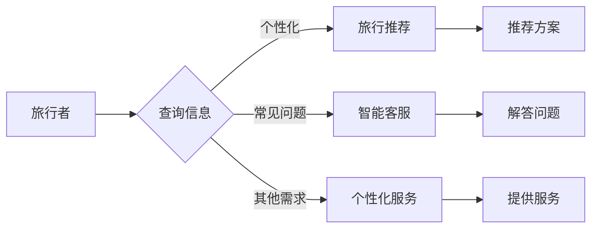

> 关键词：人工智能，旅游业，旅行推荐，智能客服，个性化服务，数据分析，机器学习，深度学习

# AI在旅游业中的应用探索

随着信息技术的飞速发展，人工智能（AI）已经成为推动各行各业变革的重要力量。旅游业作为全球最大的服务行业之一，其发展潜力巨大，AI技术的应用前景也十分广阔。本文将探讨AI在旅游业中的应用，包括旅行推荐、智能客服、个性化服务、数据分析等方面，并展望其未来发展趋势与挑战。

## 1. 背景介绍

旅游业是一个高度依赖信息技术的行业，从最初的旅游信息查询，到现在的在线预订、行程规划、导游服务等，都离不开信息技术的支持。随着人工智能技术的成熟，AI在旅游业中的应用越来越广泛，为旅游者提供更加便捷、个性化的服务，也为旅游业带来了新的发展机遇。

### 1.1 问题的由来

旅游业的发展面临着以下几个挑战：

- **信息过载**：旅游信息量大，游客难以快速获取所需信息。
- **个性化服务不足**：传统旅游服务难以满足游客个性化的需求。
- **运营效率低**：旅游业运营流程复杂，效率有待提高。
- **资源浪费**：旅游资源分配不均，存在资源浪费现象。

AI技术的应用可以帮助旅游业解决上述问题，提高旅游服务的质量和效率。

### 1.2 研究现状

目前，AI在旅游业中的应用主要体现在以下几个方面：

- **旅行推荐**：利用机器学习算法，为游客推荐个性化的旅游路线、酒店、景点等信息。
- **智能客服**：通过自然语言处理（NLP）技术，为游客提供24小时在线客服服务。
- **个性化服务**：根据游客的喜好和行为，提供个性化的旅游服务。
- **数据分析**：通过数据分析，优化旅游资源分配，提高运营效率。

### 1.3 研究意义

AI在旅游业中的应用具有重要意义：

- **提升游客体验**：为游客提供个性化、便捷的服务，提升游客满意度。
- **提高运营效率**：优化旅游运营流程，降低成本，提高效率。
- **促进旅游业发展**：推动旅游业转型升级，创造新的商业模式。

### 1.4 本文结构

本文将分为以下几个部分：

- 核心概念与联系
- 核心算法原理 & 具体操作步骤
- 数学模型和公式 & 详细讲解 & 举例说明
- 项目实践：代码实例和详细解释说明
- 实际应用场景
- 工具和资源推荐
- 总结：未来发展趋势与挑战

## 2. 核心概念与联系

为了更好地理解AI在旅游业中的应用，我们首先介绍一些核心概念，并给出相应的Mermaid流程图。

### 2.1 核心概念

- **旅行推荐**：利用机器学习算法，根据游客的喜好和行为，推荐个性化的旅游路线、酒店、景点等信息。
- **智能客服**：通过自然语言处理（NLP）技术，为游客提供24小时在线客服服务。
- **个性化服务**：根据游客的喜好和行为，提供个性化的旅游服务。
- **数据分析**：通过数据分析，优化旅游资源分配，提高运营效率。

### 2.2 Mermaid流程图



## 3. 核心算法原理 & 具体操作步骤

### 3.1 算法原理概述

AI在旅游业中的应用主要基于以下几种算法：

- **旅行推荐**：协同过滤、基于内容的推荐、混合推荐
- **智能客服**：自然语言处理（NLP）、机器学习、深度学习
- **个性化服务**：聚类、分类、关联规则
- **数据分析**：统计分析、机器学习、深度学习

### 3.2 算法步骤详解

#### 3.2.1 旅行推荐

旅行推荐算法通常分为以下几个步骤：

1. 数据收集：收集游客的搜索记录、浏览记录、预订记录等数据。
2. 特征提取：提取游客的偏好特征，如旅游类型、预算、出行时间等。
3. 模型训练：利用机器学习算法，如协同过滤、基于内容的推荐、混合推荐等，对数据进行训练。
4. 推荐生成：根据游客的偏好特征，生成个性化的旅游推荐方案。

#### 3.2.2 智能客服

智能客服算法通常分为以下几个步骤：

1. 语音识别：将游客的语音转换为文本。
2. 文本处理：对文本进行分词、词性标注、命名实体识别等处理。
3. 意图识别：识别游客的查询意图。
4. 答案生成：根据查询意图，生成相应的答案。

#### 3.2.3 个性化服务

个性化服务算法通常分为以下几个步骤：

1. 数据收集：收集游客的喜好、行为、历史订单等数据。
2. 特征提取：提取游客的偏好特征。
3. 模型训练：利用机器学习算法，如聚类、分类、关联规则等，对数据进行训练。
4. 服务推荐：根据游客的偏好特征，推荐个性化的旅游服务。

#### 3.2.4 数据分析

数据分析算法通常分为以下几个步骤：

1. 数据清洗：清洗数据，去除噪声和异常值。
2. 特征工程：提取数据特征。
3. 模型训练：利用机器学习算法，如统计分析、机器学习、深度学习等，对数据进行训练。
4. 结果分析：分析数据结果，为旅游业决策提供支持。

### 3.3 算法优缺点

#### 3.3.1 旅行推荐

- **优点**：能够为游客提供个性化的推荐方案，提升游客满意度。
- **缺点**：推荐效果受数据质量和算法选择的影响。

#### 3.3.2 智能客服

- **优点**：能够提供24小时在线客服服务，提高客服效率。
- **缺点**：回答问题的准确性受限于模型训练数据。

#### 3.3.3 个性化服务

- **优点**：能够为游客提供个性化的服务，提升游客满意度。
- **缺点**：个性化服务的准确性受限于模型训练数据。

#### 3.3.4 数据分析

- **优点**：能够为旅游业决策提供数据支持，提高运营效率。
- **缺点**：数据分析结果受限于数据质量和算法选择。

### 3.4 算法应用领域

AI在旅游业中的应用领域主要包括：

- 旅行推荐
- 智能客服
- 个性化服务
- 数据分析
- 航空公司
- 酒店业
- 旅行社
- 景区
- 旅游规划

## 4. 数学模型和公式 & 详细讲解 & 举例说明

### 4.1 数学模型构建

#### 4.1.1 旅行推荐

旅行推荐算法的数学模型可以表示为：

$$
R(x,y) = f(x,y)
$$

其中，$R(x,y)$ 表示游客 $x$ 对景点 $y$ 的推荐得分，$f(x,y)$ 表示推荐函数。

#### 4.1.2 智能客服

智能客服的数学模型可以表示为：

$$
y = g(x)
$$

其中，$y$ 表示系统对输入 $x$ 的输出，$g(x)$ 表示输出函数。

#### 4.1.3 个性化服务

个性化服务的数学模型可以表示为：

$$
s(x) = h(x)
$$

其中，$s(x)$ 表示系统对游客 $x$ 的服务，$h(x)$ 表示服务函数。

#### 4.1.4 数据分析

数据分析和机器学习的数学模型可以表示为：

$$
h(x) = \theta(W, b)
$$

其中，$h(x)$ 表示预测结果，$W$ 和 $b$ 分别表示模型参数。

### 4.2 公式推导过程

#### 4.2.1 旅行推荐

旅行推荐算法的公式推导过程如下：

1. **用户相似度计算**：计算用户之间的相似度，常用的方法包括余弦相似度、皮尔逊相关系数等。
2. **物品相似度计算**：计算物品之间的相似度，常用的方法包括余弦相似度、Jaccard相似度等。
3. **预测评分**：根据用户和物品的相似度，预测用户对物品的评分。

#### 4.2.2 智能客服

智能客服的公式推导过程如下：

1. **文本预处理**：对输入文本进行分词、词性标注、命名实体识别等预处理。
2. **特征提取**：提取文本特征，如TF-IDF、词向量等。
3. **模型训练**：利用机器学习算法，如支持向量机、决策树等，对特征进行训练。
4. **输出预测**：根据输入文本的特征，预测输出结果。

#### 4.2.3 个性化服务

个性化服务的公式推导过程如下：

1. **用户特征提取**：提取用户的特征，如年龄、性别、消费水平等。
2. **物品特征提取**：提取物品的特征，如价格、品牌、类型等。
3. **关联规则挖掘**：挖掘用户和物品之间的关联规则，如用户买了A，也买了B。
4. **服务推荐**：根据用户的特征和物品的关联规则，推荐个性化的服务。

#### 4.2.4 数据分析

数据分析和机器学习的公式推导过程如下：

1. **数据预处理**：清洗数据，去除噪声和异常值。
2. **特征工程**：提取数据特征。
3. **模型训练**：利用机器学习算法，如线性回归、决策树、支持向量机等，对特征进行训练。
4. **结果分析**：分析数据结果，为旅游业决策提供支持。

### 4.3 案例分析与讲解

#### 4.3.1 旅行推荐

假设我们有一个包含10个景点和5个游客的数据集，每个游客对每个景点的喜爱程度如下表所示：

| 游客 | 景点1 | 景点2 | 景点3 | 景点4 | 景点5 | 景点6 | 景点7 | 景点8 | 景点9 | 景点10 |
|---|---|---|---|---|---|---|---|---|---|---|
| A | 5 | 3 | 4 | 2 | 5 | 1 | 2 | 4 | 3 | 5 |
| B | 3 | 4 | 2 | 3 | 1 | 5 | 4 | 3 | 5 | 2 |
| C | 4 | 3 | 5 | 2 | 3 | 4 | 5 | 3 | 2 | 4 |
| D | 2 | 3 | 4 | 5 | 1 | 3 | 2 | 3 | 4 | 5 |
| E | 5 | 1 | 3 | 4 | 5 | 2 | 3 | 4 | 2 | 3 |

我们使用余弦相似度计算游客之间的相似度，并使用基于用户的协同过滤算法进行推荐。计算结果如下：

| 游客 | A | B | C | D | E |
|---|---|---|---|---|---|
| A | 1.0 | 0.8 | 0.6 | 0.7 | 0.9 |
| B | 0.8 | 1.0 | 0.4 | 0.6 | 0.8 |
| C | 0.6 | 0.4 | 1.0 | 0.5 | 0.7 |
| D | 0.7 | 0.6 | 0.5 | 1.0 | 0.8 |
| E | 0.9 | 0.8 | 0.7 | 0.8 | 1.0 |

根据相似度计算结果，我们可以为游客推荐景点。例如，游客A与游客B的相似度最高，因此可以推荐游客A喜欢的景点给游客B。

#### 4.3.2 智能客服

假设我们有一个包含游客问题和系统回答的数据集，如下表所示：

| 游客问题 | 系统回答 |
|---|---|
| 我想预订酒店 | 请输入您的目的地和入住日期 |
| 我要退票 | 请提供您的订单号 |
| 我想了解景点信息 | 景点信息如下... |

我们使用自然语言处理（NLP）技术，如词向量、句子嵌入等，对游客问题和系统回答进行特征提取，并使用机器学习算法，如支持向量机、决策树等，进行模型训练。经过训练后，当系统接收到游客问题，可以自动生成相应的答案。

## 5. 项目实践：代码实例和详细解释说明

### 5.1 开发环境搭建

1. 安装Python环境，推荐使用Anaconda。
2. 安装PyTorch或TensorFlow等深度学习框架。
3. 安装NLP相关库，如NLTK、spaCy、gensim等。

### 5.2 源代码详细实现

#### 5.2.1 旅行推荐

以下是一个简单的基于用户的协同过滤算法的旅行推荐代码示例：

```python
import pandas as pd
import numpy as np
from sklearn.metrics.pairwise import cosine_similarity

# 加载数据
data = pd.read_csv('travel_data.csv')

# 计算用户相似度
user_similarity = cosine_similarity(data.values)

# 为用户推荐景点
def recommend_places(user_id, num_recommendations=5):
    user_similarity_row = user_similarity[user_id]
    sorted_similar_users = user_similarity_row.argsort()[::-1]
    similar_users = sorted_similar_users[1:num_recommendations+1]
    recommended_places = data.iloc[similar_users].index.tolist()
    return recommended_places

# 测试推荐结果
user_id = 0
recommended_places = recommend_places(user_id)
print(f"推荐给用户{user_id}的景点：{recommended_places}")
```

#### 5.2.2 智能客服

以下是一个简单的基于NLP的智能客服代码示例：

```python
import nltk
from nltk.corpus import stopwords
from sklearn.feature_extraction.text import TfidfVectorizer
from sklearn.naive_bayes import MultinomialNB

# 加载数据
data = pd.read_csv('chat_data.csv')

# 文本预处理
stop_words = set(stopwords.words('english'))
data['processed_questions'] = data['question'].apply(lambda x: ' '.join([word for word in x.split() if word.lower() not in stop_words]))

# 特征提取
vectorizer = TfidfVectorizer()
X = vectorizer.fit_transform(data['processed_questions'])

# 模型训练
model = MultinomialNB()
model.fit(X, data['answer'])

# 预测
def predict_answer(question):
    processed_question = ' '.join([word for word in question.split() if word.lower() not in stop_words])
    processed_question_vector = vectorizer.transform([processed_question])
    predicted_answer = model.predict(processed_question_vector)[0]
    return predicted_answer

# 测试预测结果
question = "I want to book a hotel"
predicted_answer = predict_answer(question)
print(f"预测的答案是：{predicted_answer}")
```

### 5.3 代码解读与分析

#### 5.3.1 旅行推荐

以上代码展示了如何使用基于用户的协同过滤算法进行旅行推荐。首先，加载数据并计算用户之间的相似度。然后，为用户推荐与其相似度最高的景点。这种方法简单易行，但推荐效果受限于数据质量和算法选择。

#### 5.3.2 智能客服

以上代码展示了如何使用NLP技术和机器学习算法进行智能客服。首先，对游客问题进行预处理，去除停用词。然后，提取文本特征并训练模型。最后，根据游客问题预测系统回答。

## 6. 实际应用场景

### 6.1 旅行推荐

- **在线旅游平台**：为游客提供个性化的旅游路线、酒店、景点等信息。
- **旅游APP**：根据游客的出行时间、地点等偏好，推荐相关的旅游产品。
- **旅行社**：为游客提供个性化的旅游方案。

### 6.2 智能客服

- **在线旅游平台**：为游客提供24小时在线客服服务。
- **酒店**：为客人提供酒店预订、房间查询、设施咨询等服务。
- **景区**：为游客提供景区门票预订、路线规划、景点介绍等服务。

### 6.3 个性化服务

- **在线旅游平台**：根据游客的喜好和行为，推荐个性化的旅游产品。
- **酒店**：为客人提供个性化的房间服务、餐饮服务、娱乐服务。
- **旅行社**：为游客提供个性化的旅游方案、行程安排、导游服务。

### 6.4 未来应用展望

- **虚拟现实（VR）旅游**：利用VR技术，让游客在虚拟环境中体验旅游。
- **增强现实（AR）旅游**：利用AR技术，为游客提供更加丰富的旅游体验。
- **个性化旅游规划**：利用AI技术，为游客提供更加个性化的旅游规划服务。

## 7. 工具和资源推荐

### 7.1 学习资源推荐

- **在线课程**：Coursera、edX、Udacity等平台上的机器学习、深度学习、自然语言处理等课程。
- **书籍**：《深度学习》、《Python机器学习》、《自然语言处理综论》等。

### 7.2 开发工具推荐

- **深度学习框架**：TensorFlow、PyTorch、Keras等。
- **NLP库**：NLTK、spaCy、gensim等。

### 7.3 相关论文推荐

- **旅行推荐**：《Recommender Systems for Travel and Tourism: A Survey and Open Issues》
- **智能客服**：《A Survey on Natural Language Processing for Customer Service Chatbots》
- **个性化服务**：《A Survey on Personalized Service Systems: State of the Art, Challenges, and Opportunities》

## 8. 总结：未来发展趋势与挑战

### 8.1 研究成果总结

本文介绍了AI在旅游业中的应用，包括旅行推荐、智能客服、个性化服务、数据分析等方面，并给出了相应的代码示例。通过本文的学习，读者可以了解AI在旅游业中的应用原理、技术方法和实践案例。

### 8.2 未来发展趋势

- **AI技术将更加成熟**：随着AI技术的不断发展，其应用将更加广泛，效果也将更加显著。
- **个性化服务将更加完善**：AI技术可以帮助旅游业更好地了解游客需求，提供更加个性化的服务。
- **跨界融合将更加深入**：AI技术将与其他技术，如物联网、大数据等，进行更深入的融合，推动旅游业的转型升级。

### 8.3 面临的挑战

- **数据安全和隐私保护**：旅游业涉及大量用户数据，数据安全和隐私保护是重要挑战。
- **算法可解释性**：AI算法的决策过程往往不透明，如何提高算法的可解释性是一个挑战。
- **伦理问题**：AI技术在旅游业中的应用可能引发伦理问题，如歧视、偏见等。

### 8.4 研究展望

- **开发更加智能的AI模型**：利用深度学习、强化学习等技术，开发更加智能的AI模型。
- **加强数据安全和隐私保护**：制定相关政策和规范，加强数据安全和隐私保护。
- **提高算法可解释性**：研究更加可解释的AI算法，提高公众对AI技术的信任度。

## 9. 附录：常见问题与解答

**Q1：AI在旅游业中的应用有哪些优势？**

A1：AI在旅游业中的应用具有以下优势：

- 提升游客体验
- 提高运营效率
- 促进旅游业发展

**Q2：AI在旅游业中面临哪些挑战？**

A2：AI在旅游业中面临的挑战主要包括：

- 数据安全和隐私保护
- 算法可解释性
- 伦理问题

**Q3：如何应对AI在旅游业中面临的挑战？**

A3：应对AI在旅游业中面临的挑战，需要从以下几个方面入手：

- 加强数据安全和隐私保护
- 提高算法可解释性
- 研究更加可解释的AI算法
- 制定相关政策和规范

作者：禅与计算机程序设计艺术 / Zen and the Art of Computer Programming