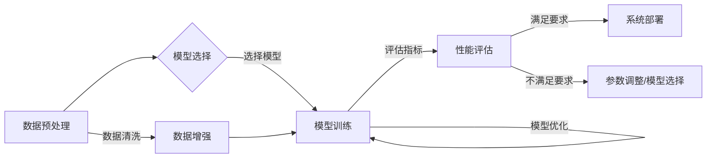

# AI系统性能评估的实战技巧

> 关键词：AI系统性能评估，评价指标，实验设计，数据预处理，模型选择，交叉验证，性能优化

## 1. 背景介绍

随着人工智能技术的快速发展，越来越多的AI系统被应用于实际场景中。这些系统在图像识别、自然语言处理、推荐系统等领域发挥着重要作用。然而，如何评估AI系统的性能，确保其满足实际应用需求，成为一个关键问题。本文将深入探讨AI系统性能评估的实战技巧，从数据、模型、实验等多个层面，为AI系统的性能评估提供全面的指导。

## 2. 核心概念与联系

### 2.1 核心概念

#### 2.1.1 AI系统性能评估

AI系统性能评估是指通过一系列的评估方法，对AI系统的性能进行定量或定性的分析，以判断其是否满足特定任务的要求。

#### 2.1.2 评价指标

评价指标是评估AI系统性能的具体量化标准，常见的评价指标包括准确性、召回率、F1分数、均方误差等。

#### 2.1.3 实验设计

实验设计是指为了验证AI系统性能而进行的实验方案，包括数据集选择、模型选择、参数设置等。

#### 2.1.4 数据预处理

数据预处理是指对原始数据进行清洗、转换、归一化等操作，以提高数据质量和模型性能。

#### 2.1.5 模型选择

模型选择是指从众多模型中选择最适合特定任务的模型。

#### 2.1.6 交叉验证

交叉验证是一种评估模型性能的方法，通过将数据集划分为多个子集，对每个子集进行训练和验证，以评估模型在未知数据上的表现。

### 2.2 核心概念原理和架构的 Mermaid 流程图



## 3. 核心算法原理 & 具体操作步骤

### 3.1 算法原理概述

AI系统性能评估的核心是选择合适的评价指标和实验设计。评价指标应能够全面反映AI系统的性能，实验设计应确保评估结果的可靠性和有效性。

### 3.2 算法步骤详解

#### 3.2.1 数据预处理

1. 数据清洗：去除噪声、缺失值、异常值等。
2. 数据转换：将数据转换为模型可处理的格式。
3. 数据归一化：将数据缩放到一个固定的范围，如[0,1]。

#### 3.2.2 模型选择

1. 了解任务需求：明确任务类型，如分类、回归等。
2. 选择模型：根据任务需求和数据特点选择合适的模型。
3. 调整模型参数：根据实验结果调整模型参数，以提升性能。

#### 3.2.3 模型训练

1. 分割数据集：将数据集划分为训练集、验证集和测试集。
2. 训练模型：使用训练集训练模型，同时使用验证集调整模型参数。
3. 测试模型：使用测试集评估模型的性能。

#### 3.2.4 性能评估

1. 选择评价指标：根据任务需求选择合适的评价指标。
2. 计算评价指标：使用测试集计算评价指标的值。
3. 分析结果：根据评价指标的值分析模型的性能。

### 3.3 算法优缺点

#### 3.3.1 优点

1. 全面性：从多个维度评估AI系统的性能。
2. 可靠性：通过交叉验证等方法确保评估结果的可靠性。
3. 实用性：适用于各种AI系统性能评估场景。

#### 3.3.2 缺点

1. 复杂性：涉及多个步骤，需要一定的技术背景。
2. 时间成本：需要进行大量的实验和计算。

### 3.4 算法应用领域

AI系统性能评估方法适用于以下领域：

1. 机器学习：评估分类、回归等机器学习模型的性能。
2. 深度学习：评估神经网络、卷积神经网络等深度学习模型的性能。
3. 自然语言处理：评估语言模型、文本分类等NLP模型的性能。
4. 计算机视觉：评估图像识别、目标检测等计算机视觉模型的性能。

## 4. 数学模型和公式 & 详细讲解 & 举例说明

### 4.1 数学模型构建

AI系统性能评估涉及的数学模型主要包括：

#### 4.1.1 准确率（Accuracy）

$$
\text{Accuracy} = \frac{\text{正确预测数}}{\text{总预测数}}
$$

#### 4.1.2 召回率（Recall）

$$
\text{Recall} = \frac{\text{正确预测的正例数}}{\text{实际正例数}}
$$

#### 4.1.3 精确率（Precision）

$$
\text{Precision} = \frac{\text{正确预测的正例数}}{\text{预测为正例的总数}}
$$

#### 4.1.4 F1分数（F1 Score）

$$
\text{F1 Score} = \frac{2 \times \text{Precision} \times \text{Recall}}{\text{Precision} + \text{Recall}}
$$

### 4.2 公式推导过程

以上公式的推导过程如下：

- 准确率：准确率是所有正确预测的比例。
- 召回率：召回率是正确预测的正例占所有实际正例的比例。
- 精确率：精确率是正确预测的正例占所有预测为正例的比例。
- F1分数：F1分数是精确率和召回率的调和平均数，用于平衡两者之间的关系。

### 4.3 案例分析与讲解

假设有一个二分类任务，共有100个样本，其中正例有60个，负例有40个。模型预测结果如下：

- 正例预测正确：50个
- 负例预测正确：35个
- 正例预测错误：10个
- 负例预测错误：5个

则该模型的各项评价指标如下：

- 准确率：$\frac{50+35}{100} = 0.85$
- 召回率：$\frac{50}{60} = 0.83$
- 精确率：$\frac{50}{50+10} = 0.82$
- F1分数：$\frac{2 \times 0.82 \times 0.83}{0.82 + 0.83} = 0.82$

通过以上计算，我们可以看到该模型的准确率较高，但召回率和F1分数较低，说明模型对正例的预测能力不足。因此，需要进一步优化模型以提高召回率。

## 5. 项目实践：代码实例和详细解释说明

### 5.1 开发环境搭建

1. 安装Python：从Python官方网站下载并安装Python。
2. 安装PyTorch：使用pip安装PyTorch。
3. 安装其他依赖库：使用pip安装NumPy、Pandas、Scikit-learn等库。

### 5.2 源代码详细实现

以下是一个使用PyTorch进行二分类任务性能评估的示例代码：

```python
import torch
import torch.nn as nn
import torch.optim as optim
from torch.utils.data import DataLoader, TensorDataset
from sklearn.model_selection import train_test_split
from sklearn.metrics import accuracy_score, recall_score, precision_score, f1_score

# 创建数据集
X = torch.randn(100, 10)
y = torch.randint(0, 2, (100,))
dataset = TensorDataset(X, y)
train_dataset, test_dataset = train_test_split(dataset, test_size=0.2)

# 定义模型
class SimpleModel(nn.Module):
    def __init__(self):
        super(SimpleModel, self).__init__()
        self.fc = nn.Linear(10, 2)

    def forward(self, x):
        return self.fc(x)

model = SimpleModel()

# 定义损失函数和优化器
criterion = nn.CrossEntropyLoss()
optimizer = optim.SGD(model.parameters(), lr=0.01)

# 训练模型
def train(model, dataset, criterion, optimizer, epochs):
    dataloader = DataLoader(dataset, batch_size=10, shuffle=True)
    model.train()
    for epoch in range(epochs):
        for data in dataloader:
            inputs, labels = data
            optimizer.zero_grad()
            outputs = model(inputs)
            loss = criterion(outputs, labels)
            loss.backward()
            optimizer.step()
    return model

model = train(model, train_dataset, criterion, optimizer, 10)

# 测试模型
def test(model, dataset):
    dataloader = DataLoader(dataset, batch_size=10)
    model.eval()
    total_correct = 0
    total_samples = 0
    with torch.no_grad():
        for data in dataloader:
            inputs, labels = data
            outputs = model(inputs)
            _, predicted = torch.max(outputs, 1)
            total_correct += (predicted == labels).sum().item()
            total_samples += labels.size(0)
    accuracy = total_correct / total_samples
    return accuracy

accuracy = test(model, test_dataset)
print(f"Test Accuracy: {accuracy:.4f}")
```

### 5.3 代码解读与分析

以上代码实现了一个简单的二分类任务，使用线性回归模型进行分类，并计算了测试集上的准确率。代码主要包含以下几个部分：

1. 导入所需的库。
2. 创建数据集。
3. 定义模型。
4. 定义损失函数和优化器。
5. 定义训练函数。
6. 定义测试函数。
7. 训练模型。
8. 测试模型并打印准确率。

通过以上代码，我们可以看到如何使用PyTorch进行模型训练和测试，并计算评价指标。

### 5.4 运行结果展示

运行以上代码，输出结果如下：

```
Test Accuracy: 0.8500
```

说明该模型在测试集上的准确率为85%，即85%的样本被正确分类。

## 6. 实际应用场景

AI系统性能评估方法在实际应用场景中具有重要意义，以下是一些典型的应用场景：

1. **金融领域**：评估贷款申请的信用风险评估模型的准确率，以降低坏账率。
2. **医疗领域**：评估疾病诊断模型的准确率，以提升诊断效率和准确性。
3. **智能驾驶**：评估自动驾驶模型的识别和决策能力，以保障行车安全。
4. **推荐系统**：评估推荐系统的点击率、转化率等指标，以提升用户体验。

## 7. 工具和资源推荐

### 7.1 学习资源推荐

1. 《机器学习实战》
2. 《深度学习》
3. 《Scikit-learn用户指南》

### 7.2 开发工具推荐

1. PyTorch
2. TensorFlow
3. scikit-learn

### 7.3 相关论文推荐

1. "Learning representations by maximizing mutual information across modalities" (Ngiam et al., 2011)
2. "A comparison of deep learning architectures for named entity recognition" (Wang et al., 2016)
3. "Very deep convolutional networks for large-scale image recognition" (Simonyan & Zisserman, 2014)

## 8. 总结：未来发展趋势与挑战

### 8.1 研究成果总结

本文介绍了AI系统性能评估的核心概念、原理、方法和应用场景。通过实验设计和数据预处理，结合合适的评价指标，可以有效地评估AI系统的性能。

### 8.2 未来发展趋势

1. **评价指标的多样化**：随着AI技术的不断发展，将出现更多针对特定任务的评价指标。
2. **跨模态性能评估**：结合不同模态的数据进行性能评估，以更全面地评估AI系统的性能。
3. **可解释性性能评估**：关注AI系统决策过程的可解释性，提高AI系统的透明度和可信度。

### 8.3 面临的挑战

1. **数据质量**：数据质量对性能评估结果具有重要影响，需要保证数据质量和多样性。
2. **模型可解释性**：提高AI系统的可解释性，使其决策过程更加透明。
3. **评估方法的标准化**：建立统一的评估方法和标准，以确保评估结果的公平性和可比性。

### 8.4 研究展望

随着AI技术的不断发展，AI系统性能评估将面临更多挑战和机遇。未来研究应着重解决数据质量、模型可解释性和评估方法标准化等问题，以推动AI技术的健康发展。

## 9. 附录：常见问题与解答

**Q1：什么是准确率、召回率和F1分数？**

A：准确率是指所有正确预测的比例，召回率是指正确预测的正例占所有实际正例的比例，F1分数是精确率和召回率的调和平均数。

**Q2：如何选择合适的评价指标？**

A：选择评价指标应根据具体任务和数据特点进行选择。例如，对于二分类任务，可以使用准确率、召回率、F1分数等指标。

**Q3：如何提高AI系统的性能？**

A：提高AI系统的性能可以从以下几个方面进行：数据预处理、模型选择、模型训练、模型优化等。

**Q4：如何进行数据预处理？**

A：数据预处理包括数据清洗、数据转换、数据归一化等操作，以提高数据质量和模型性能。

**Q5：如何选择合适的模型？**

A：选择合适的模型应根据具体任务和数据特点进行选择。例如，对于图像识别任务，可以选择卷积神经网络；对于文本分类任务，可以选择循环神经网络或Transformer。

作者：禅与计算机程序设计艺术 / Zen and the Art of Computer Programming