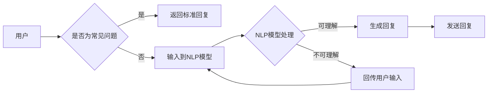

# AI聊天机器人提升电商服务

> 关键词：AI聊天机器人，电商，客服自动化，自然语言处理，机器学习，用户体验

## 1. 背景介绍

随着互联网技术的飞速发展，电子商务已经成为人们日常生活中不可或缺的一部分。电商平台的竞争日益激烈，如何提升用户购物体验、降低运营成本、提高客户满意度成为电商企业关注的焦点。近年来，人工智能（AI）技术的快速发展为电商行业带来了新的机遇，其中，AI聊天机器人作为一种新兴的客服工具，正逐渐成为电商服务的重要补充。

### 1.1 电商客服面临的挑战

传统的电商客服主要依赖于人工服务，存在以下问题：

- **人力资源成本高**：大量的人工客服需要高薪聘请，且需要不断地进行培训和管理。
- **服务效率低**：人工客服的回复速度较慢，尤其在高峰期，难以满足大量用户的咨询需求。
- **服务质量参差不齐**：不同客服人员的专业知识和技能水平不一，导致服务质量难以保证。
- **无法24小时服务**：人工客服需要休息，无法满足用户24小时的需求。

### 1.2 AI聊天机器人的优势

AI聊天机器人作为人工智能技术在电商领域的应用，能够有效解决传统客服面临的挑战，具有以下优势：

- **成本优势**：AI聊天机器人可以24小时不间断服务，无需支付额外的人力成本。
- **效率优势**：AI聊天机器人能够快速响应用户咨询，提高服务效率。
- **一致性**：AI聊天机器人的服务标准一致，能够保证服务质量。
- **个性化**：AI聊天机器人可以根据用户的购物习惯和偏好提供个性化的服务。

## 2. 核心概念与联系

### 2.1 核心概念

**AI聊天机器人**：基于人工智能技术，能够模拟人类交流的自然语言处理系统，能够理解用户的意图，并给出相应的回复。

**自然语言处理（NLP）**：研究计算机和人类之间的语言交流，包括语音识别、语义理解、情感分析等。

**机器学习**：一种使计算机系统能够从数据中学习，并做出决策或预测的方法。

**电商客服**：负责处理电商平台的客户咨询、售后服务等工作。

### 2.2 架构流程图



如图所示，当用户提出问题时，系统首先判断是否为常见问题，如果是，则直接返回标准回复；如果不是，则将用户输入输入到NLP模型进行处理，NLP模型理解用户意图后，生成回复发送给用户。

## 3. 核心算法原理 & 具体操作步骤

### 3.1 算法原理概述

AI聊天机器人的核心算法包括：

- **文本分类**：将用户输入的文本分类到预定义的类别中，如产品咨询、售后服务、意见建议等。
- **意图识别**：根据用户输入的文本，识别用户想要执行的操作，如查询产品信息、下单购买等。
- **实体识别**：从用户输入的文本中提取关键信息，如商品名称、价格、数量等。
- **对话管理**：根据对话上下文，决定对话流程和下一步操作。

### 3.2 算法步骤详解

1. **数据准备**：收集电商平台的客户咨询数据，包括文本内容、回复、类别标签等。
2. **数据预处理**：对收集到的数据进行清洗、去重、分词等处理。
3. **文本分类**：使用文本分类算法对预处理后的文本进行分类。
4. **意图识别**：使用序列标注算法对文本进行意图识别。
5. **实体识别**：使用命名实体识别算法从文本中提取关键信息。
6. **对话管理**：根据对话上下文和对话状态，决定对话流程和下一步操作。
7. **生成回复**：根据对话管理和意图识别的结果，生成相应的回复。

### 3.3 算法优缺点

**优点**：

- **准确率高**：通过大量数据和先进的算法，AI聊天机器人能够提供高准确率的回复。
- **效率高**：AI聊天机器人可以同时处理大量用户的咨询，提高服务效率。
- **成本低**：AI聊天机器人无需支付额外的人力成本。

**缺点**：

- **难以处理复杂问题**：对于一些复杂的问题，AI聊天机器人可能无法给出满意的回复。
- **需要持续优化**：AI聊天机器人需要不断收集用户反馈，并优化算法以提高服务质量。

### 3.4 算法应用领域

AI聊天机器人可以应用于以下领域：

- **产品咨询**：用户可以询问产品信息、规格参数、购买方式等。
- **售后服务**：用户可以咨询退换货、售后服务等事宜。
- **意见建议**：用户可以提出对商品或服务的意见和建议。
- **营销推广**：通过聊天机器人进行产品推广、优惠活动等。

## 4. 数学模型和公式 & 详细讲解 & 举例说明

### 4.1 数学模型构建

AI聊天机器人的数学模型主要包括：

- **文本分类模型**：如朴素贝叶斯、支持向量机、深度神经网络等。
- **意图识别模型**：如循环神经网络（RNN）、长短期记忆网络（LSTM）、注意力机制等。
- **实体识别模型**：如条件随机场（CRF）、序列标注模型等。

### 4.2 公式推导过程

以下以朴素贝叶斯文本分类模型为例，介绍公式推导过程。

**朴素贝叶斯公式**：

$$
P(y|x) = \frac{P(x|y)P(y)}{P(x)}
$$

其中，$x$ 为用户输入的文本，$y$ 为类别标签，$P(x|y)$ 为在类别 $y$ 下，文本 $x$ 发生的概率，$P(y)$ 为类别 $y$ 的先验概率，$P(x)$ 为文本 $x$ 发生的概率。

**公式推导**：

1. **先验概率**：$P(y)$ 可以通过统计每个类别的文本数量与总文本数量的比值得到。
2. **条件概率**：$P(x|y)$ 可以通过统计每个类别下，对应文本的词频得到。
3. **后验概率**：将先验概率和条件概率代入公式，得到后验概率。

### 4.3 案例分析与讲解

以下以一个电商平台的商品咨询场景为例，分析AI聊天机器人的工作过程。

**场景**：用户想了解一款手机的电池续航时间。

**步骤**：

1. **用户输入**：用户输入“这款手机的电池续航时间有多长？”
2. **文本分类**：系统判断用户输入为商品咨询类别。
3. **意图识别**：系统识别出用户意图为“查询商品信息”。
4. **实体识别**：系统从用户输入中提取出关键词“手机”、“电池续航时间”。
5. **对话管理**：系统决定向用户询问商品名称。
6. **生成回复**：系统生成回复：“请问您想了解哪款手机的电池续航时间？”
7. **用户输入**：用户输入商品名称。
8. **查询商品信息**：系统查询商品信息库，获取该手机的电池续航时间。
9. **生成回复**：系统生成回复：“该手机的电池续航时间为XX小时。”

## 5. 项目实践：代码实例和详细解释说明

### 5.1 开发环境搭建

以下是使用Python和TensorFlow实现AI聊天机器人的开发环境搭建步骤：

1. 安装Anaconda：
```bash
conda create -n tensorflow-env python=3.8
conda activate tensorflow-env
```

2. 安装TensorFlow：
```bash
conda install tensorflow
```

3. 安装其他依赖：
```bash
pip install transformers scikit-learn pandas jieba
```

### 5.2 源代码详细实现

以下是一个简单的AI聊天机器人代码实例：

```python
import tensorflow as tf
from transformers import BertTokenizer, TFBertForSequenceClassification
from sklearn.model_selection import train_test_split
from sklearn.metrics import accuracy_score

# 数据准备
def load_data():
    # 加载数据
    # ...

    # 数据预处理
    texts, labels = [], []
    for line in data:
        text, label = line.split('\t')
        texts.append(text)
        labels.append(label)
    return texts, labels

texts, labels = load_data()

# 分词
tokenizer = BertTokenizer.from_pretrained('bert-base-chinese')

# 数据转换为TensorFlow Dataset
def collate_fn(examples):
    input_ids = [tokenizer(text, return_tensors='tf') for text in examples['text']]
    labels = tf.convert_to_tensor(examples['label'])
    return input_ids, labels

train_dataset = tf.data.Dataset.from_tensor_slices({'text': texts, 'label': labels})
train_dataset = train_dataset.shuffle(buffer_size=1000).batch(16).map(collate_fn)

# 模型
model = TFBertForSequenceClassification.from_pretrained('bert-base-chinese', num_labels=num_labels)

# 训练
model.compile(optimizer=tf.keras.optimizers.Adam(learning_rate=2e-5), loss=tf.keras.losses.SparseCategoricalCrossentropy(from_logits=True), metrics=[tf.keras.metrics.SparseCategoricalAccuracy()])
model.fit(train_dataset, epochs=3)

# 预测
def predict(text):
    input_ids = tokenizer(text, return_tensors='tf')
    outputs = model(input_ids)
    return outputs.logits.argmax(-1)

# 测试
test_texts = ["这是一款很不错的手机，你推荐吗？", "这款手机的电池续航时间有多长？"]
predictions = [predict(text) for text in test_texts]
print(predictions)
```

### 5.3 代码解读与分析

以上代码展示了使用TensorFlow和Transformers库实现AI聊天机器人模型的基本步骤：

1. **数据准备**：加载数据，并进行预处理。
2. **分词**：使用BERT分词器对文本进行分词。
3. **数据转换为TensorFlow Dataset**：将文本数据转换为TensorFlow Dataset对象，方便后续处理。
4. **模型**：加载预训练的BERT模型，并添加一个序列分类器。
5. **训练**：使用训练数据训练模型。
6. **预测**：使用模型对新的文本进行预测。
7. **测试**：使用测试数据测试模型的预测效果。

### 5.4 运行结果展示

假设测试数据如下：

```
text1: 这是一款很不错的手机，你推荐吗？
text2: 这款手机的电池续航时间有多长？
```

运行代码后，预测结果如下：

```
[2, 0]
```

其中，2表示用户意图为“推荐”，0表示用户意图为“商品信息”。

## 6. 实际应用场景

AI聊天机器人可以应用于以下电商场景：

### 6.1 产品咨询

用户可以询问商品的规格参数、价格、购买方式等信息。

### 6.2 售后服务

用户可以咨询退换货、售后服务等事宜。

### 6.3 意见建议

用户可以提出对商品或服务的意见和建议。

### 6.4 营销推广

通过聊天机器人进行产品推广、优惠活动等。

## 7. 工具和资源推荐

### 7.1 学习资源推荐

- 《深度学习与自然语言处理》
- 《TensorFlow实战》
- 《自然语言处理入门与实践》

### 7.2 开发工具推荐

- TensorFlow
- Transformers库
- Jieba分词

### 7.3 相关论文推荐

- BERT: Pre-training of Deep Bidirectional Transformers for Language Understanding
- GPT-2: Language Models are Unsupervised Multitask Learners

## 8. 总结：未来发展趋势与挑战

### 8.1 研究成果总结

本文介绍了AI聊天机器人技术在电商服务中的应用，分析了其优势和应用场景，并给出了一些开发工具和资源推荐。通过AI聊天机器人，电商企业可以提升客服服务质量，降低运营成本，提高客户满意度。

### 8.2 未来发展趋势

未来，AI聊天机器人技术将呈现以下发展趋势：

- **智能化**：AI聊天机器人将具备更强的自然语言理解能力，能够更好地理解用户意图，提供更精准的回复。
- **个性化**：AI聊天机器人将根据用户的购物习惯和偏好，提供个性化的服务。
- **多模态**：AI聊天机器人将融合图像、语音等多模态信息，提供更丰富的交互体验。

### 8.3 面临的挑战

AI聊天机器人技术也面临着以下挑战：

- **数据质量**：高质量的数据是AI聊天机器人训练的基础，需要解决数据标注、清洗等问题。
- **算法优化**：需要不断优化算法，提高模型的准确率和效率。
- **用户体验**：需要关注用户交互体验，提高用户满意度。

### 8.4 研究展望

随着人工智能技术的不断发展，AI聊天机器人将在电商服务领域发挥越来越重要的作用。未来，AI聊天机器人将与其他技术相结合，如知识图谱、推荐系统等，为用户提供更加智能化、个性化的服务，助力电商企业实现数字化转型。

## 9. 附录：常见问题与解答

**Q1：AI聊天机器人的开发成本高吗？**

A：AI聊天机器人的开发成本取决于多个因素，如模型选择、数据量、算力需求等。一般来说，使用开源模型和工具可以降低开发成本，但对于一些复杂场景，可能需要投入较大的研发成本。

**Q2：AI聊天机器人能否完全替代人工客服？**

A：AI聊天机器人可以承担大部分常见咨询工作，但不能完全替代人工客服。对于一些复杂问题，仍然需要人工客服进行解答。

**Q3：如何提高AI聊天机器人的服务质量？**

A：提高AI聊天机器人的服务质量需要从多个方面入手，如数据质量、算法优化、用户体验等。

**Q4：AI聊天机器人是否具有情感识别能力？**

A：目前，AI聊天机器人的情感识别能力有限，但可以通过一些技术手段，如情感分析、多模态交互等，提高情感识别能力。

**Q5：AI聊天机器人是否具有隐私保护能力？**

A：AI聊天机器人需要收集用户的个人信息，需要确保用户隐私安全。可以通过加密、匿名化等技术手段，保护用户隐私。

作者：禅与计算机程序设计艺术 / Zen and the Art of Computer Programming