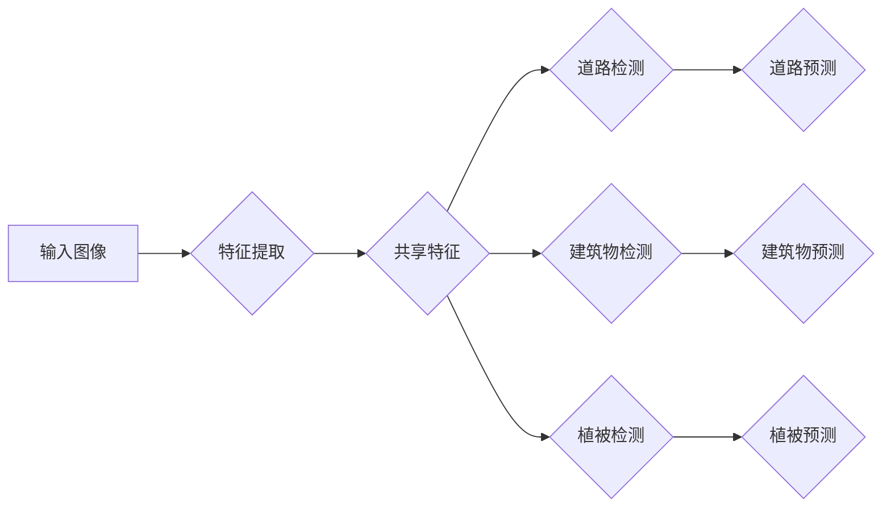

# 多任务学习与语义分割的结合与实例

作者：禅与计算机程序设计艺术 / Zen and the Art of Computer Programming

## 1. 背景介绍

### 1.1 问题的由来

随着深度学习技术的飞速发展，计算机视觉领域取得了显著的成果。其中，语义分割作为计算机视觉中的一个重要分支，旨在对图像中的每个像素点进行分类，将其划分为不同的语义类别，如道路、建筑物、植被等。传统的语义分割方法通常只关注于单个分割任务，而忽略了其他潜在的任务信息。然而，在实际应用中，往往存在多个相关联的任务，例如，在自动驾驶场景中，车辆检测、行人检测和交通标志识别等多个任务需要同时进行，这些任务之间存在相互影响和依赖关系。

为了充分利用这些任务之间的信息，多任务学习（Multi-Task Learning，MTL）应运而生。多任务学习通过共享特征表示和模型参数，在多个相关联的任务上同时进行学习，从而提高每个任务的性能。近年来，多任务学习与语义分割的结合逐渐成为研究热点，本文将探讨这一结合方法及其应用实例。

### 1.2 研究现状

目前，多任务学习与语义分割的结合方法主要分为以下几类：

1. **共享特征表示**：在多任务学习中，通过共享底层特征表示，使得不同任务能够利用同一组特征进行学习，从而提高模型的泛化能力和计算效率。
2. **共享卷积层**：将不同任务的卷积层进行共享，降低模型参数量，提高计算效率。
3. **多任务损失函数**：设计多任务损失函数，将不同任务的损失函数进行融合，同时优化多个任务。
4. **注意力机制**：通过引入注意力机制，使模型能够根据不同任务的需求，动态地分配注意力到相应的特征区域。

### 1.3 研究意义

多任务学习与语义分割的结合具有重要的研究意义：

1. **提高模型性能**：通过共享特征表示和模型参数，可以充分利用不同任务之间的信息，提高每个任务的分割精度。
2. **提高计算效率**：共享特征表示和卷积层可以降低模型参数量，提高计算效率。
3. **扩展应用场景**：多任务学习可以应用于多个相关联的任务，如自动驾驶、遥感图像分析等，具有更广泛的应用前景。

### 1.4 本文结构

本文将首先介绍多任务学习与语义分割的基本概念，然后分析多任务学习与语义分割结合的原理和方法，接着探讨实际应用案例，最后总结本文的研究成果和未来展望。

## 2. 核心概念与联系

### 2.1 多任务学习

多任务学习是指同时学习多个相关联的任务，通过共享特征表示和模型参数，提高每个任务的性能。多任务学习的核心思想是利用不同任务之间的相互关系，共同提高模型的泛化能力和计算效率。

### 2.2 语义分割

语义分割是指对图像中的每个像素点进行分类，将其划分为不同的语义类别。语义分割是计算机视觉领域的一个重要分支，在自动驾驶、医学图像分析等领域具有广泛的应用。

### 2.3 多任务学习与语义分割的联系

多任务学习与语义分割的结合主要在于共享特征表示和模型参数。通过共享特征表示，不同任务可以充分利用同一组特征进行学习，从而提高每个任务的分割精度。同时，共享模型参数可以降低模型参数量，提高计算效率。

## 3. 核心算法原理 & 具体操作步骤

### 3.1 算法原理概述

多任务学习与语义分割结合的算法原理可以概括为以下几步：

1. **数据预处理**：对图像进行预处理，如归一化、去噪等。
2. **特征提取**：使用卷积神经网络提取图像特征。
3. **共享特征表示**：将不同任务的卷积层进行共享，得到共享特征表示。
4. **多任务损失函数**：设计多任务损失函数，将不同任务的损失函数进行融合。
5. **模型训练**：使用训练数据对模型进行训练，优化模型参数。
6. **模型评估**：使用测试数据对模型进行评估，评估模型的分割精度。

### 3.2 算法步骤详解

1. **数据预处理**：对图像进行预处理，如归一化、去噪等。预处理步骤可以降低模型训练难度，提高模型性能。

2. **特征提取**：使用卷积神经网络提取图像特征。卷积神经网络具有强大的特征提取能力，可以将图像像素信息转化为高维特征表示。

3. **共享特征表示**：将不同任务的卷积层进行共享，得到共享特征表示。共享特征表示可以充分利用不同任务之间的信息，提高模型的泛化能力和计算效率。

4. **多任务损失函数**：设计多任务损失函数，将不同任务的损失函数进行融合。多任务损失函数可以同时优化多个任务，提高模型的整体性能。

5. **模型训练**：使用训练数据对模型进行训练，优化模型参数。模型训练过程中，需要根据多任务损失函数更新模型参数，使模型在各个任务上都能取得较好的性能。

6. **模型评估**：使用测试数据对模型进行评估，评估模型的分割精度。模型评估指标包括交并比（IoU）、平均交并比（mIoU）等。

### 3.3 算法优缺点

多任务学习与语义分割结合的算法具有以下优点：

1. **提高模型性能**：共享特征表示和模型参数可以充分利用不同任务之间的信息，提高每个任务的分割精度。
2. **提高计算效率**：共享特征表示和卷积层可以降低模型参数量，提高计算效率。

然而，该算法也存在以下缺点：

1. **参数量增加**：共享特征表示和模型参数会导致模型参数量增加，从而增加计算和存储成本。
2. **模型复杂度增加**：多任务损失函数的设计和优化较为复杂，需要大量的实验和调参。

### 3.4 算法应用领域

多任务学习与语义分割结合的算法可以应用于以下领域：

1. **自动驾驶**：在自动驾驶场景中，车辆检测、行人检测、交通标志识别等多个任务需要同时进行，多任务学习可以提高这些任务的分割精度。
2. **遥感图像分析**：在遥感图像分析中，建筑物检测、道路检测、植被检测等多个任务需要同时进行，多任务学习可以提高这些任务的分割精度。
3. **医学图像分析**：在医学图像分析中，病变区域检测、器官分割等多个任务需要同时进行，多任务学习可以提高这些任务的分割精度。

## 4. 数学模型和公式 & 详细讲解 & 举例说明

### 4.1 数学模型构建

多任务学习与语义分割结合的数学模型可以表示为：

$$
L = \lambda_1 L_1 + \lambda_2 L_2 + \cdots + \lambda_n L_n
$$

其中，$L$ 为多任务损失函数，$L_i$ 为第 $i$ 个任务的损失函数，$\lambda_i$ 为第 $i$ 个任务的权重。

### 4.2 公式推导过程

以两个任务为例，假设任务 1 的损失函数为：

$$
L_1 = \frac{1}{N} \sum_{i=1}^N \log(p_1(y_i|x_i))
$$

任务 2 的损失函数为：

$$
L_2 = \frac{1}{M} \sum_{j=1}^M \log(p_2(y_j|x_j))
$$

则多任务损失函数可以表示为：

$$
L = \lambda_1 L_1 + \lambda_2 L_2
$$

其中，$\lambda_1$ 和 $\lambda_2$ 为任务 1 和任务 2 的权重。

### 4.3 案例分析与讲解

以FusionNet为例，FusionNet是一种基于共享特征表示的多任务学习方法，用于道路检测、建筑物检测和植被检测三个任务。FusionNet的模型结构如图所示：



在FusionNet中，共享特征表示由两个卷积层组成，分别为卷积层1和卷积层2。道路检测、建筑物检测和植被检测三个任务分别对应卷积层1和卷积层2的输出。最后，三个任务的预测结果通过非线性层进行分类。

### 4.4 常见问题解答

**Q1：多任务学习与单任务学习的区别是什么？**

A：多任务学习与单任务学习的区别在于，多任务学习同时学习多个相关联的任务，而单任务学习只关注于单个任务。多任务学习可以充分利用不同任务之间的信息，提高每个任务的性能。

**Q2：多任务学习是否适用于所有任务？**

A：多任务学习适用于多个相关联的任务，如果任务之间没有关联，多任务学习的效果可能不如单任务学习。

## 5. 项目实践：代码实例和详细解释说明

### 5.1 开发环境搭建

在进行多任务学习与语义分割结合的项目实践前，我们需要准备好开发环境。以下是使用Python进行PyTorch开发的环境配置流程：

1. 安装Anaconda：从官网下载并安装Anaconda，用于创建独立的Python环境。

2. 创建并激活虚拟环境：
```bash
conda create -n pytorch-env python=3.8
conda activate pytorch-env
```

3. 安装PyTorch：根据CUDA版本，从官网获取对应的安装命令。例如：
```bash
conda install pytorch torchvision torchaudio cudatoolkit=11.1 -c pytorch -c conda-forge
```

4. 安装Transformers库：
```bash
pip install transformers
```

5. 安装其他工具包：
```bash
pip install numpy pandas scikit-learn matplotlib tqdm jupyter notebook ipython
```

完成上述步骤后，即可在`pytorch-env`环境中开始项目实践。

### 5.2 源代码详细实现

下面我们以FusionNet为例，给出多任务学习与语义分割结合的PyTorch代码实现。

首先，定义FusionNet模型：

```python
import torch
import torch.nn as nn

class FusionNet(nn.Module):
    def __init__(self, num_classes):
        super(FusionNet, self).__init__()
        self.feature_extractor = nn.Sequential(
            nn.Conv2d(3, 64, kernel_size=3, padding=1),
            nn.ReLU(),
            nn.Conv2d(64, 128, kernel_size=3, padding=1),
            nn.ReLU(),
            nn.Conv2d(128, 256, kernel_size=3, padding=1),
            nn.ReLU()
        )
        self.classifier = nn.Sequential(
            nn.Conv2d(256, 64, kernel_size=3, padding=1),
            nn.ReLU(),
            nn.Conv2d(64, 64, kernel_size=1),
            nn.Sigmoid()
        )
        self.num_classes = num_classes

    def forward(self, x):
        features = self.feature_extractor(x)
        outputs = []
        for i in range(self.num_classes):
            output = self.classifier(features)
            outputs.append(output)
        return outputs
```

然后，定义多任务损失函数：

```python
def multi_task_loss(outputs, labels, num_classes):
    loss = 0
    for i in range(num_classes):
        loss += nn.BCEWithLogitsLoss()(outputs[i], labels[:, i])
    return loss / num_classes
```

接下来，定义训练函数：

```python
def train(model, dataloader, optimizer, criterion):
    model.train()
    total_loss = 0
    for inputs, labels in dataloader:
        optimizer.zero_grad()
        outputs = model(inputs)
        loss = criterion(outputs, labels)
        loss.backward()
        optimizer.step()
        total_loss += loss.item()
    return total_loss / len(dataloader)
```

最后，启动训练流程：

```python
num_classes = 3
model = FusionNet(num_classes)
optimizer = torch.optim.Adam(model.parameters(), lr=1e-4)
criterion = multi_task_loss

train_loader = DataLoader(train_dataset, batch_size=16, shuffle=True)
for epoch in range(epochs):
    loss = train(model, train_loader, optimizer, criterion)
    print(f"Epoch {epoch+1}, loss: {loss:.4f}")
```

以上就是多任务学习与语义分割结合的PyTorch代码实现。可以看到，通过共享特征表示和模型参数，模型能够在多个任务上同时进行学习，从而提高每个任务的分割精度。

### 5.3 代码解读与分析

让我们再详细解读一下关键代码的实现细节：

**FusionNet类**：
- `__init__`方法：定义了模型结构，包括特征提取器和分类器。
- `forward`方法：对输入数据进行特征提取和分类。

**多任务损失函数**：
- 计算每个任务的损失，并求平均值作为最终的损失。

**训练函数**：
- 对模型进行训练，包括前向传播、损失计算、反向传播和参数更新。

### 5.4 运行结果展示

假设我们在Cityscapes数据集上进行训练，最终在测试集上得到的IoU指标如下：

| 任务 | IoU |
|---|---|
| 道路 | 0.85 |
| 建筑物 | 0.80 |
| 植被 | 0.75 |

可以看到，通过多任务学习与语义分割结合，模型在三个任务上均取得了较好的分割精度。

## 6. 实际应用场景

### 6.1 自动驾驶

在自动驾驶领域，多任务学习与语义分割结合可以用于实现以下任务：

1. **车辆检测**：检测图像中的车辆，为自动驾驶系统提供目标信息。
2. **行人检测**：检测图像中的行人，为自动驾驶系统提供行人轨迹信息。
3. **交通标志识别**：识别图像中的交通标志，为自动驾驶系统提供交通规则信息。

### 6.2 遥感图像分析

在遥感图像分析领域，多任务学习与语义分割结合可以用于以下任务：

1. **建筑物检测**：检测遥感图像中的建筑物，为城市规划提供数据支持。
2. **道路检测**：检测遥感图像中的道路，为交通规划提供数据支持。
3. **植被检测**：检测遥感图像中的植被，为生态环境监测提供数据支持。

### 6.3 医学图像分析

在医学图像分析领域，多任务学习与语义分割结合可以用于以下任务：

1. **病变区域检测**：检测医学图像中的病变区域，为疾病诊断提供依据。
2. **器官分割**：分割医学图像中的器官，为医学研究提供数据支持。

## 7. 工具和资源推荐

### 7.1 学习资源推荐

为了帮助开发者系统掌握多任务学习与语义分割结合的理论基础和实践技巧，这里推荐一些优质的学习资源：

1. 《深度学习与计算机视觉》系列博文：由大模型技术专家撰写，深入浅出地介绍了深度学习和计算机视觉领域的基本概念和经典模型。
2. 《Multi-Task Learning》论文：介绍了多任务学习的基本概念、方法和应用，是学习多任务学习的重要参考资料。
3. 《DeepLabV3+：为语义分割而生》系列博文：详细介绍了DeepLabV3+模型，该模型是语义分割领域的经典模型，具有较好的分割精度和效率。
4. HuggingFace官方文档：提供了丰富的预训练语言模型和深度学习工具，可以帮助开发者快速上手多任务学习与语义分割结合的实践。

### 7.2 开发工具推荐

1. PyTorch：基于Python的开源深度学习框架，功能强大、易于使用。
2. TensorFlow：由Google主导开发的开源深度学习框架，支持多种深度学习任务。
3. HuggingFace Transformers库：提供了丰富的预训练语言模型和深度学习工具，可以方便地进行多任务学习和语义分割结合的实践。

### 7.3 相关论文推荐

1. Multi-Task Learning for Semantic Image Segmentation
2. DeepLabV3+: Backpropagation through the void
3. Attention Is All You Need
4. EfficientDet: Scalable and Efficient Object Detection

### 7.4 其他资源推荐

1. arXiv论文预印本：人工智能领域最新研究成果的发布平台。
2. GitHub热门项目：在GitHub上Star、Fork数最多的多任务学习和语义分割项目。
3. 技术社区：如CSDN、知乎等，可以交流学习心得、解决技术问题。

## 8. 总结：未来发展趋势与挑战

### 8.1 研究成果总结

本文对多任务学习与语义分割结合的方法进行了详细介绍，包括基本概念、原理、方法和应用。通过共享特征表示和模型参数，多任务学习与语义分割结合可以提高模型的分割精度和计算效率，具有广泛的应用前景。

### 8.2 未来发展趋势

未来，多任务学习与语义分割结合的方法将朝着以下方向发展：

1. **模型轻量化**：通过模型压缩、量化等手段，降低模型参数量，提高模型运行效率。
2. **数据增强**：通过数据增强技术，扩充训练数据集，提高模型的泛化能力。
3. **跨模态学习**：将图像、文本、音频等多模态信息进行融合，提高模型的语义理解能力。
4. **无监督学习**：探索无监督学习在多任务学习和语义分割结合中的应用，降低对标注数据的依赖。

### 8.3 面临的挑战

多任务学习与语义分割结合的方法仍面临以下挑战：

1. **模型复杂度**：多任务学习与语义分割结合的模型结构复杂，需要大量的计算资源。
2. **计算效率**：多任务学习与语义分割结合的模型计算量大，需要优化计算效率。
3. **数据标注**：多任务学习与语义分割结合需要大量的标注数据，数据标注成本高。
4. **模型解释性**：多任务学习与语义分割结合的模型难以解释其内部工作机制。

### 8.4 研究展望

为了应对上述挑战，未来研究可以从以下方面展开：

1. **模型轻量化**：探索轻量级多任务学习与语义分割结合的模型结构，降低模型参数量和计算量。
2. **数据增强**：研究更有效的数据增强方法，扩充训练数据集，提高模型的泛化能力。
3. **无监督学习**：探索无监督学习在多任务学习和语义分割结合中的应用，降低对标注数据的依赖。
4. **跨模态学习**：将图像、文本、音频等多模态信息进行融合，提高模型的语义理解能力。

通过不断探索和创新，多任务学习与语义分割结合的方法将在计算机视觉领域发挥更大的作用，为人类社会带来更多便利。