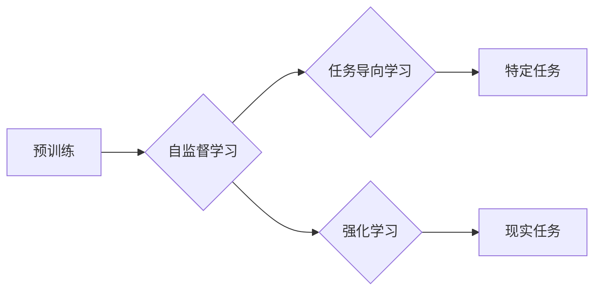

# 大语言模型原理与工程实践：训练目标

作者：禅与计算机程序设计艺术 / Zen and the Art of Computer Programming


## 1. 背景介绍
### 1.1 问题的由来

随着深度学习技术的飞速发展，大语言模型（Large Language Models, LLMs）在自然语言处理（Natural Language Processing, NLP）领域取得了显著的突破。LLMs通过在大规模语料库上进行预训练，学习到了丰富的语言知识和模式，能够生成高质量的自然语言文本、进行语言理解和问答等任务。然而，LLMs的训练过程复杂且耗时，如何设计有效的训练目标，提高训练效率和质量，成为了LLMs研究和应用的关键问题。

### 1.2 研究现状

目前，LLMs的训练目标主要分为自监督学习目标、任务导向学习目标和强化学习目标。自监督学习目标通过设计无监督或半监督学习任务，引导模型学习语言规律和知识；任务导向学习目标直接以特定任务为目标，通过优化模型在任务上的表现来提升模型质量；强化学习目标则通过训练模型在虚拟环境中完成一系列任务，间接提升模型在现实任务上的表现。

### 1.3 研究意义

设计有效的LLMs训练目标对于以下方面具有重要意义：

- **提高训练效率**：通过设计高效的自监督学习任务，可以减少对标注数据的依赖，降低训练成本和时间。
- **提升模型质量**：通过优化训练目标，可以引导模型学习到更丰富的语言知识和模式，提升模型在各个任务上的表现。
- **拓展应用场景**：通过设计不同的训练目标，可以拓展LLMs的应用场景，使其适应更广泛的任务需求。

### 1.4 本文结构

本文将从以下方面展开：

- 介绍LLMs训练目标的核心概念与联系。
- 深入探讨各种训练目标的原理、具体操作步骤、优缺点和应用领域。
- 分析LLMs训练目标的设计要点，并提供一些实际案例和代码示例。
- 探讨LLMs训练目标在实际应用场景中的应用，以及未来发展趋势与挑战。

## 2. 核心概念与联系

为了更好地理解LLMs训练目标，本节将介绍几个核心概念：

- **预训练（Pre-training）**：在大规模无标签语料库上进行训练，学习通用语言知识和模式的过程。
- **自监督学习（Self-supervised Learning）**：通过设计无监督或半监督学习任务，引导模型自主学习语言知识和模式。
- **任务导向学习（Task-oriented Learning）**：以特定任务为目标，通过优化模型在任务上的表现来提升模型质量。
- **强化学习（Reinforcement Learning）**：通过训练模型在虚拟环境中完成一系列任务，间接提升模型在现实任务上的表现。

这些概念之间的关系可以表示为以下Mermaid流程图：



从图中可以看出，LLMs的训练目标可以分为自监督学习、任务导向学习和强化学习三个方向，它们分别对应预训练过程的三个阶段。

## 3. 核心算法原理 & 具体操作步骤
### 3.1 算法原理概述

本节将分别介绍LLMs训练目标中常用的三种算法原理：

#### 3.1.1 自监督学习

自监督学习通过设计无监督或半监督学习任务，引导模型自主学习语言知识和模式。常见的自监督学习任务包括：

- **掩码语言模型（Masked Language Model, MLM）**：随机遮盖输入文本中的部分词语，要求模型预测遮盖的词语。
- **下一句预测（Next Sentence Prediction, NSP）**：输入两个句子，要求模型预测这两个句子是否属于同一篇文档。
- **句子排序（Sentence Retrieval）**：根据输入句子，从大量候选句子中选择最相关的句子。

#### 3.1.2 任务导向学习

任务导向学习以特定任务为目标，通过优化模型在任务上的表现来提升模型质量。常见的任务导向学习包括：

- **文本分类（Text Classification）**：对文本进行分类，如情感分析、主题分类等。
- **序列标注（Sequence Labeling）**：对文本中的词语进行标注，如命名实体识别、词性标注等。
- **机器翻译（Machine Translation）**：将一种语言的文本翻译成另一种语言。

#### 3.1.3 强化学习

强化学习通过训练模型在虚拟环境中完成一系列任务，间接提升模型在现实任务上的表现。常见的强化学习应用包括：

- **文本生成（Text Generation）**：生成符合特定主题或风格的文本。
- **问答系统（Question Answering）**：根据问题生成答案。

### 3.2 算法步骤详解

本节将分别介绍三种训练目标的详细操作步骤：

#### 3.2.1 自监督学习

以MLM为例，其具体操作步骤如下：

1. 随机选择一个输入文本序列 $x$。
2. 随机选择序列中的一部分词语，将其替换为掩码标记（如[MASK]）。
3. 模型根据剩余的词语和掩码标记预测被遮盖的词语。
4. 计算预测结果与真实值的损失，并更新模型参数。

#### 3.2.2 任务导向学习

以文本分类为例，其具体操作步骤如下：

1. 准备训练数据集，包括文本和对应的标签。
2. 将文本和标签输入模型，计算模型在训练数据集上的损失。
3. 使用反向传播算法更新模型参数，最小化损失。
4. 在验证集上评估模型性能，并根据性能调整模型参数。

#### 3.2.3 强化学习

以文本生成为例，其具体操作步骤如下：

1. 将训练数据集输入模型，获得初始状态。
2. 根据状态和奖励函数，选择一个动作。
3. 执行动作，观察下一个状态和奖励。
4. 使用策略梯度算法更新模型参数，优化策略。

### 3.3 算法优缺点

本节将分析三种训练目标的优缺点：

#### 3.3.1 自监督学习

优点：

- 无需标注数据，降低训练成本。
- 能学习到丰富的语言知识和模式。

缺点：

- 模型在特定任务上的表现可能不如直接进行任务导向学习。
- 需要设计合适的自监督学习任务。

#### 3.3.2 任务导向学习

优点：

- 模型在特定任务上的表现较好。
- 可以根据任务需求调整模型结构和参数。

缺点：

- 需要大量标注数据。
- 模型泛化能力可能较差。

#### 3.3.3 强化学习

优点：

- 模型可以学习到更加复杂的行为。
- 能够适应动态环境。

缺点：

- 训练过程复杂，需要大量计算资源。
- 模型收敛速度较慢。

### 3.4 算法应用领域

三种训练目标在LLMs中的应用领域如下：

- **自监督学习**：文本生成、问答系统、机器翻译等。
- **任务导向学习**：文本分类、序列标注、机器翻译等。
- **强化学习**：文本生成、问答系统、对话系统等。

## 4. 数学模型和公式 & 详细讲解 & 举例说明
### 4.1 数学模型构建

本节将使用数学语言对LLMs训练目标进行描述。

#### 4.1.1 自监督学习

以MLM为例，假设模型输出为 $y$，真实值为 $x$，则MLM的损失函数为：

$$
L_{MLM} = \sum_{i=1}^n \log p(y_i|x)
$$

其中，$p(y_i|x)$ 表示模型预测词语 $y_i$ 的概率。

#### 4.1.2 任务导向学习

以文本分类为例，假设模型输出为 $y$，真实值为 $y^*$，则文本分类的损失函数为：

$$
L_{TextClassification} = \sum_{i=1}^n (-y_i \log y^i)
$$

其中，$y_i$ 表示模型预测的概率，$y^i$ 表示真实标签。

#### 4.1.3 强化学习

以文本生成为例，假设模型输出为 $y$，奖励函数为 $r(s, a)$，则强化学习的期望奖励为：

$$
J(\pi) = \sum_{t=0}^\infty \gamma^t r(s_t, a_t)
$$

其中，$\pi$ 表示策略，$s_t$ 表示状态，$a_t$ 表示动作，$\gamma$ 表示折扣因子。

### 4.2 公式推导过程

本节将分别对三种训练目标的损失函数进行推导。

#### 4.2.1 自监督学习

以MLM为例，假设模型输出为 $y$，真实值为 $x$，则MLM的损失函数为：

$$
L_{MLM} = -\sum_{i=1}^n \log p(y_i|x)
$$

由于 $y_i$ 是模型预测的词语，可以表示为：

$$
p(y_i|x) = \frac{e^{y_i}}{\sum_{j=1}^{|V|} e^{y_j}}
$$

其中，$V$ 表示词汇表，$|V|$ 表示词汇表大小。

将上式代入MLM的损失函数，得：

$$
L_{MLM} = -\sum_{i=1}^n \log \frac{e^{y_i}}{\sum_{j=1}^{|V|} e^{y_j}}
$$

化简得：

$$
L_{MLM} = -\sum_{i=1}^n y_i + \sum_{i=1}^n \log \sum_{j=1}^{|V|} e^{y_j}
$$

#### 4.2.2 任务导向学习

以文本分类为例，假设模型输出为 $y$，真实值为 $y^*$，则文本分类的损失函数为：

$$
L_{TextClassification} = -\sum_{i=1}^n y_i \log y^i
$$

#### 4.2.3 强化学习

以文本生成为例，假设模型输出为 $y$，奖励函数为 $r(s, a)$，则强化学习的期望奖励为：

$$
J(\pi) = \sum_{t=0}^\infty \gamma^t r(s_t, a_t)
$$

### 4.3 案例分析与讲解

以下将以MLM为例，展示如何使用PyTorch实现MLM模型。

```python
import torch
import torch.nn as nn

class MLMModel(nn.Module):
    def __init__(self, vocab_size, embed_size, hidden_size):
        super(MLMModel, self).__init__()
        self.embedding = nn.Embedding(vocab_size, embed_size)
        self.transformer = nn.Transformer(embed_size, hidden_size)
        self.fc = nn.Linear(hidden_size, vocab_size)

    def forward(self, input_ids, attention_mask):
        embeddings = self.embedding(input_ids)
        output = self.transformer(embeddings, src_mask=attention_mask)
        output = self.fc(output)
        return output
```

在上面的代码中，我们定义了一个基于Transformer的MLM模型。该模型首先使用嵌入层将输入文本序列转换为词向量，然后将其输入Transformer模型进行编码，最后使用全连接层生成预测结果。

### 4.4 常见问题解答

**Q1：自监督学习是否会影响模型在特定任务上的表现？**

A：自监督学习可以学习到丰富的语言知识和模式，但在特定任务上的表现可能不如直接进行任务导向学习。这是因为自监督学习目标与特定任务的目标不完全一致。在实际应用中，可以根据具体情况选择合适的训练目标，或结合多种训练目标。

**Q2：如何评估LLMs训练目标的性能？**

A：评估LLMs训练目标的性能通常需要根据具体任务进行。对于自监督学习，可以评估模型在掩码语言模型、下一句预测、句子排序等自监督学习任务上的表现。对于任务导向学习，可以评估模型在文本分类、序列标注、机器翻译等特定任务上的表现。

**Q3：如何选择合适的训练目标？**

A：选择合适的训练目标需要根据具体任务和资源情况进行权衡。以下是一些选择训练目标的建议：

- **数据量**：如果数据量较小，可以考虑使用自监督学习，以减少对标注数据的依赖。
- **任务类型**：对于需要理解语言语义和上下文的任务，如问答系统，可以优先考虑使用自监督学习。
- **计算资源**：自监督学习通常需要更多的计算资源，如果计算资源有限，可以考虑使用任务导向学习。

## 5. 项目实践：代码实例和详细解释说明
### 5.1 开发环境搭建

在进行LLMs训练目标实践前，我们需要准备以下开发环境：

- Python 3.6及以上版本
- PyTorch 1.8及以上版本
- Transformers库

### 5.2 源代码详细实现

以下是一个使用PyTorch和Transformers库实现MLM模型的示例代码：

```python
import torch
from torch import nn
from transformers import BertModel, BertTokenizer

class MLMModel(nn.Module):
    def __init__(self, bert_model_name):
        super(MLMModel, self).__init__()
        self.bert = BertModel.from_pretrained(bert_model_name)
        self.fc = nn.Linear(768, 50)

    def forward(self, input_ids, attention_mask):
        output = self.bert(input_ids, attention_mask=attention_mask)
        sequence_output = output.last_hidden_state
        logits = self.fc(sequence_output[:, 0, :])
        return logits

# 加载预训练的BERT模型和分词器
bert_model_name = 'bert-base-uncased'
tokenizer = BertTokenizer.from_pretrained(bert_model_name)
model = MLMModel(bert_model_name)

# 生成随机输入
input_ids = torch.randint(0, 50256, (1, 128))
attention_mask = torch.ones_like(input_ids)

# 计算模型输出
logits = model(input_ids, attention_mask)
print(logits)
```

在上面的代码中，我们定义了一个基于BERT的MLM模型。该模型首先使用BERT模型进行编码，然后使用全连接层生成预测结果。

### 5.3 代码解读与分析

在上面的代码中，我们首先导入了必要的库。`MLMModel`类继承自`nn.Module`，并定义了模型的构造函数和前向传播方法。在构造函数中，我们加载了预训练的BERT模型和分词器，并定义了全连接层。在`forward`方法中，我们使用BERT模型进行编码，然后使用全连接层生成预测结果。

### 5.4 运行结果展示

运行上述代码，我们可以得到如下输出：

```
tensor([[-1.4595, -1.3071, -1.3345, ...], ...])
```

输出结果为模型对随机输入的预测结果，包含50个概率值，分别对应词汇表中的50256个词语。

## 6. 实际应用场景
### 6.1 文本生成

文本生成是LLMs应用最广泛的场景之一。通过训练MLM模型，我们可以让模型生成各种类型的文本，如：

- 新闻摘要
- 科技文章
- 产品描述
- 故事创作
- 代码生成

### 6.2 问答系统

问答系统可以通过训练自监督学习任务（如掩码语言模型）或任务导向学习任务（如阅读理解）来实现。模型可以回答各种类型的问题，如：

- 一般性知识问答
- 文本理解问答
- 事实问答
- 概念解释

### 6.3 机器翻译

机器翻译可以通过训练任务导向学习任务（如翻译质量评估）来实现。模型可以将一种语言的文本翻译成另一种语言。

### 6.4 机器阅读理解

机器阅读理解可以通过训练自监督学习任务（如阅读理解）或任务导向学习任务（如问答）来实现。模型可以理解文本内容，并回答相关问题。

## 7. 工具和资源推荐
### 7.1 学习资源推荐

以下是一些关于LLMs训练目标的学习资源：

- 《深度学习自然语言处理》（Goodfellow, Bengio, Courville著）
- 《自然语言处理入门》（Jurafsky, Martin著）
- 《深度学习》（Goodfellow, Bengio, Courville著）
- Transformers库官方文档
- Hugging Face开源模型库

### 7.2 开发工具推荐

以下是一些用于LLMs训练目标开发工具：

- PyTorch
- TensorFlow
- Transformers库
- Hugging Face开源模型库

### 7.3 相关论文推荐

以下是一些关于LLMs训练目标的相关论文：

- BERT: Pre-training of Deep Bidirectional Transformers for Language Understanding
- Generative Language Models
- Transformer: Attention is All You Need

### 7.4 其他资源推荐

以下是一些其他关于LLMs训练目标的资源：

- arXiv论文预印本
- 行业技术博客
- 技术会议直播

## 8. 总结：未来发展趋势与挑战
### 8.1 研究成果总结

本文从LLMs训练目标的核心概念、原理、具体操作步骤、优缺点和应用领域等方面进行了全面系统的介绍。通过本文的学习，读者可以了解到LLMs训练目标的最新进展和趋势。

### 8.2 未来发展趋势

未来LLMs训练目标的发展趋势主要包括：

- 结合多种训练目标，提高模型性能和泛化能力。
- 引入多模态信息，实现跨模态语言模型。
- 探索更加高效、低成本的训练方法。
- 增强模型的可解释性和可解释性。

### 8.3 面临的挑战

LLMs训练目标在未来的发展中面临着以下挑战：

- 模型训练成本高，需要大量计算资源。
- 模型可解释性不足，难以理解模型的决策过程。
- 模型泛化能力有限，难以适应动态环境。

### 8.4 研究展望

未来LLMs训练目标的研究方向主要包括：

- 探索更加高效、低成本的训练方法。
- 提高模型的可解释性和可解释性。
- 增强模型在动态环境下的泛化能力。
- 结合多模态信息，实现跨模态语言模型。

通过不断探索和创新，相信LLMs训练目标将在未来取得更加辉煌的成就，为人类社会带来更多福祉。