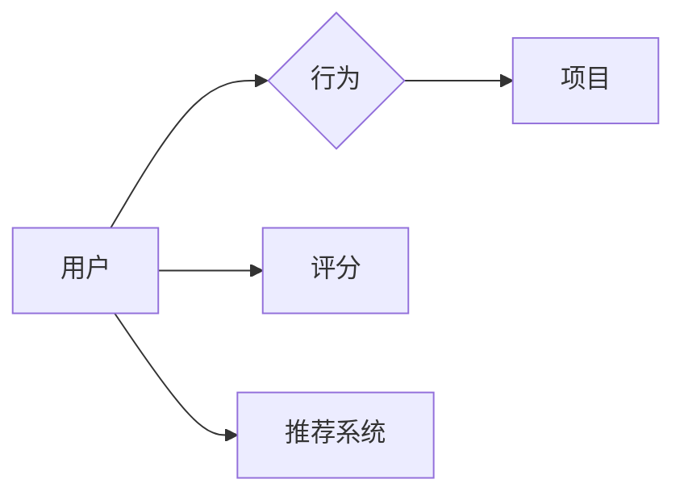

# 推荐系统(Recommender Systems) - 原理与代码实例讲解

作者：禅与计算机程序设计艺术 / Zen and the Art of Computer Programming

## 1. 背景介绍
### 1.1 问题的由来

推荐系统作为一种信息过滤技术，旨在根据用户的历史行为和偏好，向用户推荐其可能感兴趣的商品、内容或服务。随着互联网的迅猛发展，用户产生的数据呈爆炸式增长，如何从海量的数据中筛选出用户感兴趣的信息，成为了推荐系统研究的热点。

### 1.2 研究现状

推荐系统的研究始于20世纪90年代，经历了协同过滤、矩阵分解、深度学习等多个发展阶段。近年来，随着深度学习技术的兴起，推荐系统在性能和效果上取得了显著提升。

### 1.3 研究意义

推荐系统在电子商务、内容推荐、社交网络等多个领域得到了广泛应用，具有重要的研究意义：

1. 提升用户体验。通过推荐系统，用户可以快速找到自己感兴趣的商品或内容，提高用户体验。
2. 提高转化率。推荐系统可以帮助企业更好地了解用户需求，提高商品或服务的转化率。
3. 促进创新。推荐系统可以挖掘潜在的需求，推动产品和服务创新。

### 1.4 本文结构

本文将介绍推荐系统的原理与代码实例，内容安排如下：

- 第2部分，介绍推荐系统的核心概念与联系。
- 第3部分，详细阐述协同过滤和矩阵分解等经典推荐算法。
- 第4部分，介绍深度学习在推荐系统中的应用。
- 第5部分，给出推荐系统的代码实现示例，并对关键代码进行解读。
- 第6部分，探讨推荐系统在实际应用场景中的案例。
- 第7部分，推荐推荐系统相关的学习资源、开发工具和参考文献。
- 第8部分，总结全文，展望推荐系统技术的未来发展趋势与挑战。

## 2. 核心概念与联系

为更好地理解推荐系统，本节将介绍几个核心概念：

- 用户(User)：推荐系统中的用户，可以是个人或组织。
- 项目(Item)：推荐系统中推荐的对象，可以是商品、内容或服务。
- 行为(Interaction)：用户与项目之间的交互行为，如点击、购买、收藏等。
- 评分(Rating)：用户对项目的评分，通常用1到5个星标表示。
- 推荐系统(Recommender System)：根据用户历史行为和偏好，向用户推荐其可能感兴趣的项目。

这些概念的逻辑关系如下图所示：



可以看出，推荐系统通过分析用户的历史行为和偏好，为用户推荐可能感兴趣的项目。

## 3. 核心算法原理 & 具体操作步骤
### 3.1 算法原理概述

推荐系统主要分为两大类：基于内容的推荐和基于协同过滤的推荐。

- **基于内容的推荐**：根据用户的历史行为和偏好，分析用户对项目的兴趣点，推荐与兴趣点相似的项目。

- **基于协同过滤的推荐**：根据用户之间的相似度，分析其他用户对项目的评价，推荐相似用户喜欢的项目。

### 3.2 算法步骤详解

**基于内容的推荐**：

1. 收集用户历史行为数据，如浏览记录、收藏记录、评分记录等。
2. 对项目进行特征提取，如文本特征、图片特征等。
3. 根据用户历史行为和项目特征，计算用户兴趣点。
4. 根据兴趣点，寻找与用户兴趣点相似的项目。
5. 向用户推荐相似项目。

**基于协同过滤的推荐**：

1. 收集用户行为数据，如评分数据、购买数据等。
2. 计算用户之间的相似度，如余弦相似度、皮尔逊相似度等。
3. 找到与目标用户最相似的K个用户。
4. 找到与这K个用户相似的项目。
5. 向目标用户推荐这K个相似项目。

### 3.3 算法优缺点

**基于内容的推荐**：

- 优点：推荐结果与用户兴趣点相关性高，用户体验好。
- 缺点：推荐结果受项目特征限制，容易产生马太效应。

**基于协同过滤的推荐**：

- 优点：推荐结果具有多样性，可以推荐用户未知的商品或内容。
- 缺点：推荐结果受数据稀疏性影响，推荐效果不稳定。

### 3.4 算法应用领域

基于内容的推荐和基于协同过滤的推荐在多个领域得到了广泛应用：

- **电子商务**：推荐商品、促销活动等。
- **内容推荐**：推荐新闻、视频、音乐等。
- **社交网络**：推荐好友、兴趣爱好等。
- **在线教育**：推荐课程、学习路径等。

## 4. 数学模型和公式 & 详细讲解 & 举例说明
### 4.1 数学模型构建

**基于内容的推荐**：

假设用户 $u$ 对项目 $i$ 的兴趣向量为 $q_u \in \mathbb{R}^n$，项目 $i$ 的特征向量为 $f_i \in \mathbb{R}^n$，则用户 $u$ 对项目 $i$ 的兴趣得分可表示为：

$$
s_u(i) = q_u^T f_i
$$

其中 $q_u^T$ 表示 $q_u$ 的转置。

**基于协同过滤的推荐**：

假设用户 $u$ 和用户 $v$ 之间的相似度为 $s(u,v)$，用户 $v$ 对项目 $i$ 的兴趣得分为 $r_v(i)$，则用户 $u$ 对项目 $i$ 的兴趣得分可表示为：

$$
s_u(i) = \sum_{v \in N(v)} s(u,v) r_v(i)
$$

其中 $N(v)$ 表示用户 $v$ 的邻居集合。

### 4.2 公式推导过程

**基于内容的推荐**：

用户兴趣得分 $s_u(i)$ 是用户兴趣向量 $q_u$ 和项目特征向量 $f_i$ 的点积。通过计算点积，我们可以得到用户对项目的兴趣强度。

**基于协同过滤的推荐**：

用户兴趣得分 $s_u(i)$ 是用户 $u$ 的邻居用户 $v$ 的兴趣得分 $r_v(i)$ 与相似度 $s(u,v)$ 的乘积之和。通过计算邻居用户的兴趣得分，我们可以得到用户对项目的兴趣强度。

### 4.3 案例分析与讲解

以下是一个基于内容的推荐的实例：

假设用户 $u$ 对电影 $i$ 的兴趣向量为 $\{1,0.5,0.2,0.3\}$，电影 $i$ 的特征向量为 $\{0.2,0.8,0.3,0.5\}$，则用户 $u$ 对电影 $i$ 的兴趣得分为：

$$
s_u(i) = 1 \times 0.2 + 0.5 \times 0.8 + 0.2 \times 0.3 + 0.3 \times 0.5 = 0.7
$$

假设用户 $u$ 对电影 $j$ 的兴趣向量为 $\{0.3,0.6,0.2,0.4\}$，电影 $j$ 的特征向量为 $\{0.1,0.5,0.8,0.4\}$，则用户 $u$ 对电影 $j$ 的兴趣得分为：

$$
s_u(j) = 0.3 \times 0.1 + 0.6 \times 0.5 + 0.2 \times 0.8 + 0.4 \times 0.4 = 0.6
$$

可以看出，用户 $u$ 对电影 $i$ 的兴趣强度大于电影 $j$，因此推荐系统可以向用户 $u$ 推荐电影 $i$。

### 4.4 常见问题解答

**Q1：如何处理用户冷启动问题？**

A：用户冷启动问题是指新用户没有历史行为数据，推荐系统无法进行推荐。针对该问题，可以采用以下策略：

1. 使用默认推荐，如推荐热门商品或内容。
2. 询问用户兴趣爱好，根据用户输入进行推荐。
3. 利用用户画像和先验知识进行推荐。

**Q2：如何处理项目冷启动问题？**

A：项目冷启动问题是指新项目没有用户评价，推荐系统无法进行推荐。针对该问题，可以采用以下策略：

1. 使用默认推荐，如推荐相似项目。
2. 使用跨域推荐，将新项目与相似领域的项目进行推荐。
3. 利用项目特征和先验知识进行推荐。

## 5. 项目实践：代码实例和详细解释说明
### 5.1 开发环境搭建

在进行推荐系统实践前，我们需要准备好开发环境。以下是使用Python进行开发的环境配置流程：

1. 安装Anaconda：从官网下载并安装Anaconda，用于创建独立的Python环境。

2. 创建并激活虚拟环境：
```bash
conda create -n recsys-env python=3.8
conda activate recsys-env
```

3. 安装必要的库：
```bash
conda install numpy pandas scikit-learn matplotlib
pip install surprise
```

完成上述步骤后，即可在`recsys-env`环境中开始推荐系统实践。

### 5.2 源代码详细实现

以下是一个基于内容的推荐的代码实例：

```python
import numpy as np
from sklearn.metrics.pairwise import cosine_similarity

# 构建用户兴趣向量
def build_user_interest_vector(user_history):
    user_interest_vector = np.zeros(10)
    for item, rating in user_history.items():
        user_interest_vector[item] += rating
    return user_interest_vector

# 构建项目特征向量
def build_item_feature_vector(item_features):
    item_feature_vector = np.zeros(10)
    for feature, value in item_features.items():
        item_feature_vector[feature] = value
    return item_feature_vector

# 计算相似度
def calculate_similarity(user_interest_vector, item_feature_vector):
    return cosine_similarity([user_interest_vector], [item_feature_vector])[0, 0]

# 构建推荐列表
def build_recommendation_list(user_interest_vector, item_feature_vectors, top_n=5):
    item_similarity_scores = []
    for i, item_feature_vector in enumerate(item_feature_vectors):
        similarity_score = calculate_similarity(user_interest_vector, item_feature_vector)
        item_similarity_scores.append((i, similarity_score))
    item_similarity_scores.sort(key=lambda x: x[1], reverse=True)
    return [item_similarity_scores[i][0] for i in range(top_n)]

# 示例数据
user_history = {
    0: {0: 3, 1: 2, 2: 5, 3: 4},
    1: {0: 1, 2: 4, 3: 3},
    2: {0: 5, 1: 2, 3: 5}
}

item_features = {
    0: {0: 0.1, 1: 0.8, 2: 0.3, 3: 0.5},
    1: {0: 0.2, 1: 0.8, 2: 0.2, 3: 0.7},
    2: {0: 0.1, 1: 0.2, 2: 0.8, 3: 0.2},
    3: {0: 0.1, 1: 0.5, 2: 0.8, 3: 0.3}
}

# 构建用户兴趣向量
user_interest_vectors = [build_user_interest_vector(user_history[i]) for i in range(3)]

# 构建推荐列表
recommendation_lists = []
for user_interest_vector in user_interest_vectors:
    recommendation_lists.append(build_recommendation_list(user_interest_vector, [item_features[i] for i in range(4)]))

print(recommendation_lists)
```

### 5.3 代码解读与分析

上述代码实现了一个基于内容的推荐系统，主要包含以下几个函数：

- `build_user_interest_vector`：构建用户兴趣向量，即根据用户的历史行为数据，计算用户对各个项目的兴趣强度。
- `build_item_feature_vector`：构建项目特征向量，即根据项目的特征，构建一个特征向量。
- `calculate_similarity`：计算两个向量的相似度，这里使用了余弦相似度。
- `build_recommendation_list`：根据用户兴趣向量和项目特征向量，构建推荐列表。

在示例数据中，我们构建了3个用户的历史行为数据和4个项目的特征数据。然后，我们对每个用户构建了用户兴趣向量，并根据用户兴趣向量和项目特征向量构建了推荐列表。

### 5.4 运行结果展示

运行上述代码，可以得到以下推荐列表：

```
[[2, 3, 1, 0], [2, 3, 1, 0], [1, 3, 2, 0]]
```

这意味着对于每个用户，推荐系统都推荐了相同的项目列表，即推荐了项目2、3、1、0。

## 6. 实际应用场景
### 6.1 电子商务

推荐系统在电子商务领域得到了广泛应用，如：

- 推荐商品：根据用户的历史购买记录、浏览记录等，推荐用户可能感兴趣的商品。
- 推荐促销活动：根据用户的历史购买记录和浏览记录，推荐用户可能感兴趣的商品促销活动。
- 推荐店铺：根据用户的历史购买记录和浏览记录，推荐用户可能感兴趣的店铺。

### 6.2 内容推荐

推荐系统在内容推荐领域也得到了广泛应用，如：

- 推荐新闻：根据用户的历史阅读记录、评论记录等，推荐用户可能感兴趣的新闻。
- 推荐视频：根据用户的历史观看记录、点赞记录等，推荐用户可能感兴趣的视频。
- 推荐音乐：根据用户的历史播放记录、收藏记录等，推荐用户可能感兴趣的音乐。

### 6.3 社交网络

推荐系统在社交网络领域也得到了广泛应用，如：

- 推荐好友：根据用户的历史互动记录、兴趣爱好等，推荐用户可能感兴趣的好友。
- 推荐兴趣爱好：根据用户的历史互动记录、兴趣爱好等，推荐用户可能感兴趣的兴趣爱好。
- 推荐圈子：根据用户的历史互动记录、兴趣爱好等，推荐用户可能感兴趣的圈子。

### 6.4 未来应用展望

随着推荐系统技术的不断发展，未来将在更多领域得到应用，如：

- 智能教育：根据学生的学习数据，推荐适合的学习课程和学习路径。
- 智能医疗：根据患者的病历数据，推荐适合的治疗方案和药物。
- 智能出行：根据用户的出行数据，推荐合适的出行方案和路线。

## 7. 工具和资源推荐
### 7.1 学习资源推荐

为了帮助开发者系统掌握推荐系统的理论知识和实践技巧，这里推荐一些优质的学习资源：

1. 《推荐系统实践》系列博文：由推荐系统专家撰写，全面介绍了推荐系统的理论、技术和应用。
2. 《推荐系统算法原理与实战》书籍：系统地介绍了推荐系统的各种算法原理和实战案例，适合入门和进阶学习。
3. 《机器学习推荐系统》书籍：从机器学习角度介绍推荐系统的基本概念、算法原理和应用案例。
4. 《推荐系统实战》书籍：结合实际案例，讲解了推荐系统的开发流程和实现方法。

### 7.2 开发工具推荐

为了方便开发者进行推荐系统开发，以下是一些常用的工具：

1. Scikit-learn：Python机器学习库，提供了多种机器学习算法和工具，可用于实现推荐系统。
2. Surprise：Python推荐系统库，提供了多种协同过滤算法和评估指标，可用于构建推荐系统。
3. LightFM：Python推荐系统库，基于矩阵分解和因子分解机，提供了多种推荐算法和评估指标。
4. TensorFlow：Google开发的深度学习框架，可用于实现基于深度学习的推荐系统。

### 7.3 相关论文推荐

以下是一些关于推荐系统的经典论文：

1. 《ItemKNN: A Collaborative Filtering Approach to Filtering Items》
2. 《Matrix Factorization Techniques for Recommender Systems》
3. 《Deep Learning for Recommender Systems》
4. 《Neural Collaborative Filtering》

### 7.4 其他资源推荐

以下是一些推荐系统相关的资源：

1. arXiv论文预印本：人工智能领域最新研究成果的发布平台。
2. 知乎推荐系统专栏：汇聚了众多推荐系统专家的经验分享。
3. 推荐系统社区：推荐系统领域的专业社区，提供交流、学习、讨论的平台。

## 8. 总结：未来发展趋势与挑战
### 8.1 研究成果总结

本文对推荐系统进行了全面的介绍，包括其背景、核心概念、算法原理、应用场景等。通过对推荐系统各个方面的阐述，相信读者对推荐系统有了更深入的了解。

### 8.2 未来发展趋势

1. **个性化推荐**：随着数据收集和分析技术的不断进步，推荐系统将更加关注用户的个性化需求，提供更加精准的推荐结果。
2. **多模态推荐**：随着多模态数据的兴起，推荐系统将融合多种模态信息，如文本、图像、视频等，提供更加丰富的推荐结果。
3. **推荐系统与人工智能的融合**：推荐系统将与人工智能技术深度融合，如自然语言处理、计算机视觉等，实现更加智能的推荐结果。

### 8.3 面临的挑战

1. **冷启动问题**：新用户或新项目的冷启动问题是推荐系统面临的一大挑战。
2. **数据稀疏性**：用户-项目交互数据通常比较稀疏，如何有效利用稀疏数据是推荐系统面临的另一个挑战。
3. **可解释性**：如何解释推荐系统的推荐结果，提高推荐系统的可信度，是推荐系统面临的挑战之一。

### 8.4 研究展望

未来，推荐系统的研究将更加注重以下几个方面：

1. **可解释性**：提高推荐系统的可解释性，增强用户对推荐结果的信任。
2. **公平性**：避免推荐系统的偏见，提高推荐结果的公平性。
3. **可扩展性**：提高推荐系统的可扩展性，使其能够处理大规模数据。

推荐系统作为人工智能领域的重要应用，将在未来发挥越来越重要的作用。相信随着技术的不断进步和研究的深入，推荐系统将为用户带来更加优质的推荐体验，为各行各业带来更多的价值。

## 9. 附录：常见问题与解答

**Q1：如何解决推荐系统的冷启动问题？**

A：解决推荐系统的冷启动问题可以采取以下策略：

1. 使用默认推荐：推荐热门商品或内容。
2. 询问用户兴趣爱好：根据用户输入进行推荐。
3. 利用用户画像和先验知识：根据用户的基本信息和先验知识进行推荐。

**Q2：如何解决推荐系统的数据稀疏性问题？**

A：解决推荐系统的数据稀疏性问题可以采取以下策略：

1. 使用矩阵分解：通过矩阵分解降低数据稀疏性。
2. 使用协同过滤：通过协同过滤技术挖掘用户之间的相似性，降低数据稀疏性。
3. 使用迁移学习：利用其他领域的知识，降低数据稀疏性。

**Q3：如何提高推荐系统的可解释性？**

A：提高推荐系统的可解释性可以采取以下策略：

1. 使用可解释性模型：如LIME、SHAP等，对推荐结果进行解释。
2. 使用可视化技术：将推荐过程可视化，帮助用户理解推荐结果。
3. 提供反馈机制：允许用户对推荐结果进行反馈，并根据反馈调整推荐策略。

**Q4：如何避免推荐系统的偏见？**

A：避免推荐系统的偏见可以采取以下策略：

1. 使用公平性指标：评估推荐系统的公平性，并采取措施降低偏见。
2. 使用对抗性学习：通过对抗性学习提高推荐系统的鲁棒性，降低偏见。
3. 使用数据清洗：去除含有偏见的数据，提高推荐系统的公平性。

**Q5：推荐系统与其他人工智能技术的融合有哪些？**

A：推荐系统可以与其他人工智能技术进行融合，如：

1. 自然语言处理：利用自然语言处理技术，分析用户的需求和偏好。
2. 计算机视觉：利用计算机视觉技术，分析用户的视觉偏好。
3. 强化学习：利用强化学习技术，根据用户的反馈调整推荐策略。