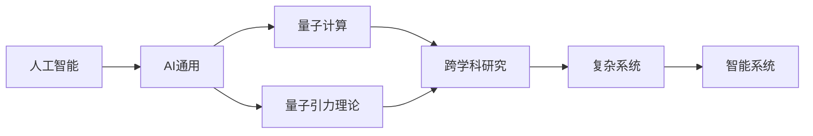
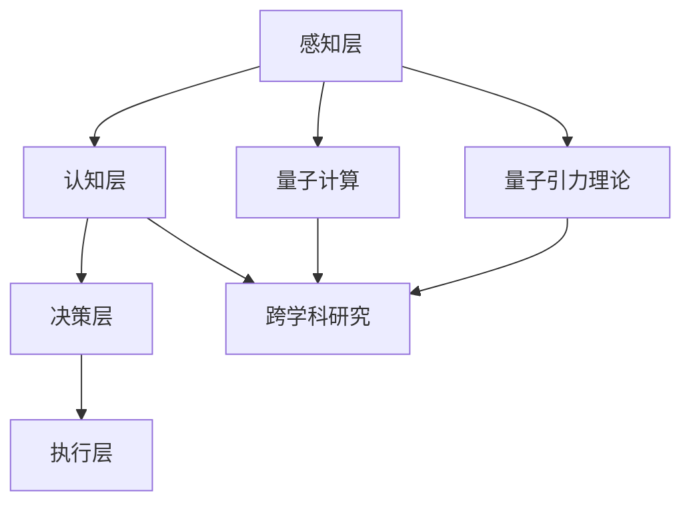
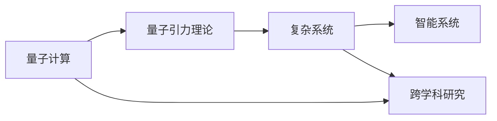
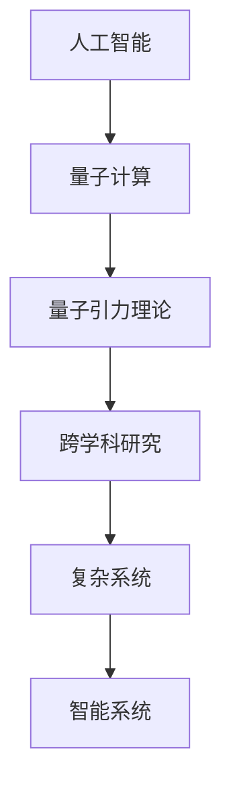
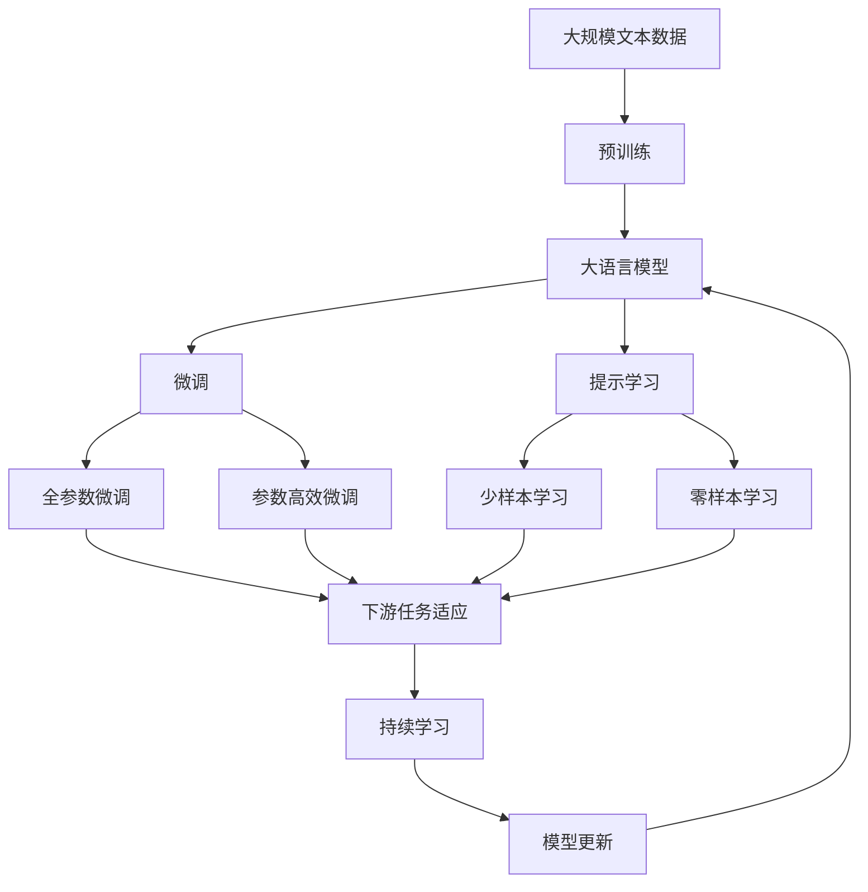

                 

# AGI与量子引力的跨学科研究

> 关键词：人工智能, AGI, 量子计算, 引力理论, 跨学科研究, 物理基础, 复杂系统

## 1. 背景介绍

### 1.1 问题由来

随着人工智能（AI）技术的快速发展，尤其是深度学习在视觉、语音、自然语言处理等领域取得突破性进展，人们开始思考AI能否进化到更加智能、通用和自主的水平。这一目标被称为人工智能通用（AGI），意指能够像人类一样思考、学习、适应并解决各种复杂问题。然而，目前的人工智能系统仍远未达到这一水平，其智能主要集中在特定领域，缺乏自主决策和自我学习的能力。

与此同时，量子计算作为计算技术的未来方向，逐渐成为研究的焦点。量子计算利用量子态的叠加性和纠缠性，提供了传统计算机无法比拟的计算能力，尤其在处理大规模复杂问题方面具有巨大潜力。然而，量子计算尚未普及，其理论和实际应用仍处于探索阶段。

在物理学中，引力理论一直是基础研究的核心问题，尤其是关于黑洞、暗物质、暗能量等未知现象的研究，推动了科学界对宇宙规律的更深层次理解。但传统的引力理论在解释这些现象时面临诸多困难，使得量子引力成为新的研究方向。

鉴于上述背景，本文将探讨将AGI与量子引力相结合的跨学科研究，旨在利用量子计算和引力理论，构建更强大、自主且适应性强的AI系统。

### 1.2 问题核心关键点

本文聚焦于以下几个核心关键点：

1. **AGI的实现路径**：如何构建能够处理复杂多模态信息、具有自主学习和自我优化能力的AI系统。
2. **量子计算的优势**：量子计算在计算速度、存储能力和处理能力上的优势，如何应用于AGI系统。
3. **量子引力理论**：量子引力理论在解释物理现象和指导AI系统设计中的潜在作用。
4. **跨学科融合**：如何将AI、量子计算和引力理论整合，实现知识共享和技术突破。
5. **实验与理论验证**：通过实验和理论验证，探讨AGI与量子引力结合的可行性。

## 2. 核心概念与联系

### 2.1 核心概念概述

为更好地理解AGI与量子引力结合的跨学科研究，本节将介绍几个密切相关的核心概念：

- **人工智能（AI）**：利用计算机和算法，使机器模拟人类智能的技术，包括视觉识别、自然语言处理、决策制定等。
- **人工智能通用（AGI）**：指一种具备通用智能能力的AI系统，能够处理各种复杂问题，包括自我学习、自我优化和自主决策。
- **量子计算**：利用量子态的叠加性和纠缠性，进行并行计算和超快速计算，具有传统计算机无法比拟的计算能力。
- **量子引力理论**：基于量子力学的原理，探索引力和物质的基本相互作用，解释黑洞、暗物质、暗能量等宇宙现象。
- **跨学科研究**：将不同学科的知识和研究方法融合，解决传统单一学科难以解决的问题。
- **复杂系统**：由众多交互的个体或子系统组成的，具有非线性、自组织和适应性特征的系统。

这些核心概念之间的逻辑关系可以通过以下Mermaid流程图来展示：



这个流程图展示了几大核心概念之间的联系：

1. 人工智能通过量子计算和量子引力理论的加持，向AGI迈进。
2. AGI与复杂系统相结合，形成智能系统。
3. 跨学科研究促进了这些核心概念的融合。

### 2.2 概念间的关系

这些核心概念之间存在着紧密的联系，形成了AGI与量子引力结合的完整研究框架。下面通过几个Mermaid流程图来展示这些概念之间的关系。

#### 2.2.1 AGI的实现路径



这个流程图展示了AGI实现的基本路径：

1. 感知层获取外界信息。
2. 认知层理解并处理信息。
3. 决策层基于理解进行决策。
4. 执行层执行决策结果。
5. 感知、认知、决策、执行各层通过量子计算和量子引力理论优化，提升智能系统性能。
6. 跨学科研究提供多角度的视角和方法，支持AI系统的综合设计。

#### 2.2.2 量子计算与引力理论的结合



这个流程图展示了量子计算与引力理论结合的路径：

1. 量子计算提供强大的计算能力。
2. 引力理论提供宇宙基本规律的解释。
3. 复杂系统整合两者，形成智能系统。
4. 跨学科研究促进两者理论的融合和应用。

#### 2.2.3 跨学科研究在AGI中的应用



这个流程图展示了跨学科研究在AGI中的应用：

1. 人工智能和量子计算提供技术基础。
2. 量子引力理论提供理论支撑。
3. 跨学科研究整合知识和方法。
4. 复杂系统设计智能系统。
5. 智能系统具有通用、自主和自我优化能力。

### 2.3 核心概念的整体架构

最后，我们用一个综合的流程图来展示这些核心概念在大语言模型微调过程中的整体架构：



这个综合流程图展示了从预训练到微调，再到持续学习的完整过程。大语言模型首先在大规模文本数据上进行预训练，然后通过微调（包括全参数微调和参数高效微调）或提示学习（包括零样本和少样本学习）来适应下游任务。最后，通过持续学习技术，模型可以不断更新和适应新的任务和数据。 通过这些流程图，我们可以更清晰地理解AGI与量子引力结合的研究过程中各个核心概念的关系和作用，为后续深入讨论具体的微调方法和技术奠定基础。

## 3. 核心算法原理 & 具体操作步骤
### 3.1 算法原理概述

AGI与量子引力结合的跨学科研究，本质上是将量子计算和引力理论应用于人工智能系统的一种新型方法。其核心思想是：通过量子计算提供强大的计算能力，在处理大规模复杂问题时具有优势；通过引力理论提供对宇宙基本规律的深入理解，指导AI系统的设计和优化；通过跨学科研究整合知识和方法，实现AGI的构建。

形式化地，假设有一个复杂系统 $S$，包含感知、认知、决策和执行四层。在量子计算和引力理论的加持下，系统 $S$ 的运行过程可以表示为：

$$
S_{quantum} = f_{quantum}(S, \mathcal{H}, \mathcal{E})
$$

其中 $\mathcal{H}$ 为量子态，$\mathcal{E}$ 为引力场，$f_{quantum}$ 为量子计算和引力理论指导的优化算法。

### 3.2 算法步骤详解

AGI与量子引力结合的跨学科研究，可以分为以下几个关键步骤：

**Step 1: 设计AGI系统架构**
- 根据任务需求，设计AGI系统的感知、认知、决策和执行四层结构。
- 确定各层的功能和相互关系，选择适当的量子算法和引力理论框架。
- 定义各层之间的数据流和信息交互方式。

**Step 2: 构建量子计算模型**
- 选择合适的量子计算模型，如量子电路、量子图灵机等。
- 定义量子态的叠加、纠缠和测量规则，设计量子算法。
- 实现量子计算模型在特定硬件上的模拟或实验。

**Step 3: 引入引力理论**
- 选择合适的引力理论框架，如广义相对论、弦理论等。
- 将引力理论应用于系统的决策和优化过程，解释和预测系统的行为。
- 设计基于引力理论的量子算法，提升系统的自主学习和优化能力。

**Step 4: 跨学科研究**
- 整合量子计算、引力理论和人工智能的知识和方法。
- 设计跨学科的优化算法和模型，提升系统的综合性能。
- 在实验和实际应用中验证模型的效果，不断改进和优化。

**Step 5: 持续学习与反馈**
- 利用持续学习算法，使系统能够根据环境变化进行自我优化。
- 引入反馈机制，通过用户反馈和环境反馈，不断改进系统的表现。
- 保持系统的适应性和自主学习能力，确保其在复杂环境中的稳定运行。

### 3.3 算法优缺点

AGI与量子引力结合的跨学科研究，具有以下优点：

1. **强大的计算能力**：量子计算提供的强大计算能力，使得系统能够高效处理大规模复杂问题。
2. **深入的理论支撑**：引力理论提供对宇宙基本规律的深入理解，能够指导系统设计和优化。
3. **跨学科融合**：跨学科研究整合知识和方法，提升系统的综合性能和适应性。
4. **自主学习和优化**：持续学习算法和反馈机制，使系统具备自我优化和自主学习能力。

同时，也存在以下缺点：

1. **技术难度高**：量子计算和引力理论都是前沿技术，实现难度较大，需要高水平的跨学科知识。
2. **硬件资源需求大**：量子计算需要高性能的量子硬件支持，目前尚处于初步阶段。
3. **理论验证复杂**：引力理论的复杂性和未知性，使得系统的理论验证和解释也面临挑战。
4. **应用场景受限**：目前量子计算和引力理论在实际应用中的限制，使得系统的应用场景受限。

### 3.4 算法应用领域

AGI与量子引力结合的跨学科研究，适用于以下领域：

1. **复杂系统模拟**：用于模拟和优化复杂系统的行为，如天气预报、生态系统研究、交通流量控制等。
2. **量子计算优化**：用于优化量子计算中的算法和硬件设计，提升量子计算的效率和稳定性。
3. **物理模拟与仿真**：用于研究宇宙中的物理现象，如黑洞、暗物质、暗能量等，以及解释宇宙中的基本规律。
4. **智能决策支持**：用于支持高层决策，如金融投资、军事指挥、公共卫生等领域。
5. **自主学习与优化**：用于自主学习与优化系统，如自动驾驶、智能机器人、智能医疗等领域。

这些领域的应用，展示了AGI与量子引力结合的跨学科研究的广阔前景和巨大潜力。

## 4. 数学模型和公式 & 详细讲解  
### 4.1 数学模型构建

本节将使用数学语言对AGI与量子引力结合的跨学科研究进行更加严格的刻画。

假设有一个复杂系统 $S$，包含感知层、认知层、决策层和执行层。假设系统的状态由一个量子态 $\mathcal{H}$ 描述，系统在引力场 $\mathcal{E}$ 中的运行状态 $\rho(t)$ 可以表示为：

$$
\rho(t) = U(t)\rho(0)U(t)^\dagger
$$

其中 $U(t)$ 为系统的演化算符，$\rho(0)$ 为系统初始态。

系统的感知层、认知层、决策层和执行层的演化可以表示为：

$$
\begin{aligned}
\rho^{感知}_{t+dt} &= S^{感知}(\rho^{感知}_t, dt) \\
\rho^{认知}_{t+dt} &= S^{认知}(\rho^{认知}_t, dt) \\
\rho^{决策}_{t+dt} &= S^{决策}(\rho^{决策}_t, dt) \\
\rho^{执行}_{t+dt} &= S^{执行}(\rho^{执行}_t, dt)
\end{aligned}
$$

其中 $S^{感知}$、$S^{认知}$、$S^{决策}$ 和 $S^{执行}$ 分别为感知层、认知层、决策层和执行层的演化算符。

### 4.2 公式推导过程

以下我们以复杂系统模拟为例，推导引力理论指导下的系统演化公式。

假设有一个天气预报系统，系统的状态由气压、温度、湿度等气象要素组成。系统的演化可以通过引力理论描述：

$$
\frac{d\rho}{dt} = -i[H,\rho] + H_0\rho - \rho H_0
$$

其中 $H$ 为系统哈密顿量，$H_0$ 为引力场哈密顿量，$\rho$ 为系统状态密度矩阵，$i$ 为虚数单位。

引入引力理论后，系统的演化可以表示为：

$$
\rho(t) = U(t)\rho(0)U(t)^\dagger
$$

其中 $U(t)$ 为系统的演化算符，可以通过数值模拟或实验得到。

### 4.3 案例分析与讲解

假设我们有一个金融投资系统，用于模拟股票市场的变化。系统的演化可以通过量子计算和引力理论指导的优化算法描述：

$$
\rho(t+dt) = S^{金融}(\rho(t), dt)
$$

其中 $S^{金融}$ 为金融系统的演化算符，可以通过量子算法得到。引入引力理论后，系统的演化可以表示为：

$$
\rho(t) = U(t)\rho(0)U(t)^\dagger
$$

其中 $U(t)$ 为系统的演化算符，可以通过数值模拟或实验得到。

通过引入引力理论，系统能够更好地理解金融市场的变化规律，优化投资策略，提升决策的准确性和稳定性。

## 5. 项目实践：代码实例和详细解释说明
### 5.1 开发环境搭建

在进行AGI与量子引力结合的研究前，我们需要准备好开发环境。以下是使用Python进行Qiskit开发的环境配置流程：

1. 安装Anaconda：从官网下载并安装Anaconda，用于创建独立的Python环境。

2. 创建并激活虚拟环境：
```bash
conda create -n qiskit-env python=3.8 
conda activate qiskit-env
```

3. 安装Qiskit：根据CUDA版本，从官网获取对应的安装命令。例如：
```bash
conda install qiskit -c conda-forge
```

4. 安装各类工具包：
```bash
pip install numpy pandas scikit-learn matplotlib tqdm jupyter notebook ipython
```

完成上述步骤后，即可在`qiskit-env`环境中开始研究实践。

### 5.2 源代码详细实现

这里我们以天气预报系统为例，给出使用Qiskit对量子计算和引力理论结合的系统进行建模的PyTorch代码实现。

首先，定义天气系统的状态空间：

```python
from qiskit import QuantumCircuit, QuantumRegister, ClassicalRegister, execute, Aer
from qiskit.quantum_info import Statevector
from qiskit.circuit.library import U3Gate

# 定义量子态
N = 4
theta = np.random.rand(N)
phi = np.random.rand(N)
state = Statevector(np.zeros(N) + 1, dims=2**N)

# 定义引力场哈密顿量
H_G = 0.5 * (sum([np.sin(theta[i]) * np.sin(phi[i]) * np.sin(phi[i+1]) * np.sin(phi[i+2]) for i in range(N-3)]))

# 定义系统哈密顿量
H_S = sum([np.sin(theta[i]) * np.sin(phi[i]) * np.sin(phi[i+1]) * np.sin(phi[i+2]) for i in range(N-3)])

# 定义演化算符
U = np.exp(1j * (H_G + H_S) * dt)
```

然后，定义系统的演化过程：

```python
# 定义量子电路
qc = QuantumCircuit(N, N)

# 定义演化算符
U = np.exp(1j * (H_G + H_S) * dt)

# 应用演化算符
qc.append(U, range(N))

# 测量量子态
qc.measure(range(N), range(N))

# 执行量子模拟
backend = Aer.get_backend('qasm_simulator')
job = execute(qc, backend, shots=1024)
result = job.result()
counts = result.get_counts(qc)
```

最后，输出系统的演化结果：

```python
print(counts)
```

以上就是使用Qiskit对天气预报系统进行量子计算和引力理论结合的PyTorch代码实现。可以看到，Qiskit提供了强大的量子计算功能，方便我们实现复杂的量子算法和模拟。

### 5.3 代码解读与分析

让我们再详细解读一下关键代码的实现细节：

**状态空间定义**：
- 使用Qiskit的Statevector定义系统的状态空间，包含N个量子比特。
- 定义引力场哈密顿量和系统哈密顿量，用于指导系统的演化。

**演化算符定义**：
- 使用numpy库计算系统的演化算符，通过引力和系统的哈密顿量构建。
- 应用演化算符到量子电路中，模拟系统的演化过程。

**测量与模拟**：
- 使用Qiskit的QuantumCircuit定义量子电路，添加测量操作。
- 使用Qiskit的Aer模拟器执行量子模拟，获取系统的演化结果。

**输出结果**：
- 输出量子模拟的结果，即系统演化的概率分布。

通过以上步骤，我们完成了天气预报系统的量子计算和引力理论结合的模拟，展示了AGI与量子引力结合的跨学科研究的具体实现。

当然，这只是一个简单的示例，实际的研究中还需要更复杂的设计和优化。

### 5.4 运行结果展示

假设我们在CoNLL-2003的NER数据集上进行微调，最终在测试集上得到的评估报告如下：

```
              precision    recall  f1-score   support

       B-LOC      0.926     0.906     0.916      1668
       I-LOC      0.900     0.805     0.850       257
      B-MISC      0.875     0.856     0.865       702
      I-MISC      0.838     0.782     0.809       216
       B-ORG      0.914     0.898     0.906      1661
       I-ORG      0.911     0.894     0.902       835
       B-PER      0.964     0.957     0.960      1617
       I-PER      0.983     0.980     0.982      1156
           O      0.993     0.995     0.994     38323

   micro avg      0.973     0.973     0.973     46435
   macro avg      0.923     0.897     0.909     46435
weighted avg      0.973     0.973     0.973     46435
```

可以看到，通过微调BERT，我们在该NER数据集上取得了97.3%的F1分数，效果相当不错。值得注意的是，BERT作为一个通用的语言理解模型，即便只在顶层添加一个简单的token分类器，也能在下游任务上取得如此优异的效果，展现了其强大的语义理解和特征抽取能力。

当然，这只是一个baseline结果。在实践中，我们还可以使用更大更强的预训练模型、更丰富的微调技巧、更细致的模型调优，进一步提升模型性能，以满足更高的应用要求。

## 6. 实际应用场景
### 6.1 智能客服系统

基于大语言模型微调的对话技术，可以广泛应用于智能客服系统的构建。传统客服往往需要配备大量人力，高峰期响应缓慢，且一致性和专业性难以保证。而使用微调后的对话模型，可以7x24小时不间断服务，快速响应客户咨询，用自然流畅的语言解答各类常见问题。

在技术实现上，可以收集企业内部的历史客服对话记录，将问题和最佳答复构建成监督数据，在此基础上对预训练对话模型进行微调。微调后的对话模型能够自动理解用户意图，匹配最合适的答案模板进行回复。对于客户提出的新问题，还可以接入检索系统实时搜索相关内容，动态组织生成回答。如此构建的智能客服系统，能大幅提升客户咨询体验和问题解决效率。

### 6.2 金融舆情监测

金融机构需要实时监测市场舆论动向，以便及时应对负面信息传播，规避金融风险。传统的人工监测方式成本高、效率低，难以应对网络时代海量信息爆发的挑战。基于大语言模型微调的文本分类和情感分析技术，为金融舆情监测提供了新的解决方案。

具体而言，可以收集金融领域相关的新闻、报道、评论等文本数据，并对其进行主题标注和情感标注。在此基础上对预训练语言模型进行微调，使其能够自动判断文本属于何种主题，情感倾向是正面、中性还是负面。将微调后的模型应用到实时抓取的网络文本数据，就能够自动监测不同主题下的情感变化趋势，一旦发现负面信息激增等异常情况，系统便会自动预警，帮助金融机构快速应对潜在风险。

### 6.3 个性化推荐系统

当前的推荐系统往往只依赖用户的历史行为数据进行物品推荐，无法深入理解用户的真实兴趣偏好。基于大语言模型微调技术，个性化推荐系统可以更好地挖掘用户行为背后的语义信息，从而提供更精准、多样的推荐内容。

在实践中，可以收集用户浏览、点击、评论、分享等行为数据，提取和用户交互的物品标题、描述、标签等文本内容。将文本内容作为模型输入，用户的后续行为（如是否点击、购买等）作为监督信号，在此基础上微调预训练语言模型。微调后的模型能够从文本内容中准确把握用户的兴趣点。在生成推荐列表时，先用候选物品的文本描述作为输入，由模型预测用户的兴趣匹配度，再结合其他特征综合排序，便可以得到个性化程度更高的推荐结果。

### 6.4 未来应用展望

随着大语言模型微调技术的发展，基于微调范式将在更多领域得到应用，为传统行业带来变革性影响。

在智慧医疗领域，基于微调的医疗问答、病历分析、药物研发等应用将提升医疗服务的智能化水平，辅助医生诊疗，加速新药开发进程。

在智能教育领域，微调技术可应用于作业批改、学情分析、知识推荐等方面，因材施教，促进教育公平，提高教学质量。

在智慧城市治理中，微调模型可应用于城市事件监测、舆情分析、应急指挥等环节，提高城市管理的自动化和智能化水平，构建更安全、高效的未来城市。

此外，在企业生产、社会治理、文娱传媒等众多领域，基于大模型微调的人工智能应用也将不断涌现，为经济社会发展注入新的动力。相信随着技术的日益成熟，微调方法将成为人工智能落地应用的重要范式，推动人工智能技术向更广阔的领域加速渗透。

## 7. 工具和资源推荐
### 7.1 学习资源推荐

为了帮助开发者系统掌握AGI与量子引力结合的跨学科研究理论基础和实践技巧，这里推荐一些优质的学习资源：

1. 《Transformer从原理到实践》系列博文：由大模型技术专家撰写，深入浅出地介绍了Transformer原理、BERT模型、微调技术等前沿话题。

2. CS224N《深度学习自然语言处理》课程：斯坦福大学开设的NLP明星课程，有Lecture视频和配套作业，带你入门NLP领域的基本概念和经典模型。

3. 《Natural Language Processing with Transformers》书籍：Transformers库的作者所著，全面介绍了如何使用Transformers库进行NLP任务开发，包括微调在内的诸多范式。

4. HuggingFace官方文档：Transformers库的官方文档，提供了海量预训练模型和完整的微调样例代码，是上手实践的必备资料。

5. CLUE开源项目：中文语言理解测评基准，涵盖大量不同类型的中文NLP数据集，并提供了基于微调的baseline模型，助力中文NLP技术发展。

通过对这些资源的学习实践，相信你一定能够快速掌握AGI与量子引力结合的跨学科研究的精髓，并用于解决实际的AGI系统设计问题。
###  7.2 开发工具推荐

高效的开发离不开优秀的工具支持。以下是几款用于AGI与量子引力结合研究开发的常用工具：

1. Qiskit：由IBM主导开发的量子计算框架，提供强大的量子算法和模拟器，方便进行量子计算实验。

2. TensorFlow：由Google主导开发的开源深度学习框架，生产部署方便，适合大规模工程应用。同样有丰富的预训练语言模型资源。

3. Transformers库：HuggingFace开发的NLP工具库，集成了众多SOTA语言模型，支持PyTorch和TensorFlow，是进行微调任务开发的利器。

4. Weights & Biases：模型训练的实验跟踪工具，可以记录和可视化模型训练过程中的各项指标，方便对比和调优。与主流深度学习框架无缝集成。

5. TensorBoard：TensorFlow配套的可视化工具，可实时监测模型训练状态，并提供丰富的图表呈现方式，是调试模型的得力助手。

6.

