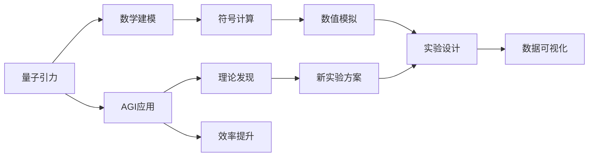

                 

## 1. 背景介绍

### 1.1 问题由来
量子引力（Quantum Gravity）是物理学中一个最为前沿和困难的领域，旨在解释和统一广义相对论和量子力学。在量子引力领域，研究者们正在探索如何从微观的量子理论过渡到宏观的引力理论，以求解释黑洞、大爆炸等宇宙学的关键问题。近年来，人工智能（Artificial Intelligence, AI），尤其是通用人工智能（Artificial General Intelligence, AGI）在数学、物理等领域获得了突破性进展，使得将AGI应用于量子引力成为可能。

### 1.2 问题核心关键点
在量子引力领域，AGI的应用主要集中在以下几个方面：
1. **数学模型的自动化构建**：量子引力涉及高维、非线性、复杂的数学方程，AGI能够自动发现数学规律，构建和优化理论模型。
2. **符号计算与数值模拟**：AGI能进行符号计算和数值模拟，验证和修正量子引力理论中的假设和推导。
3. **新理论的发现**：AGI能从现有理论中挖掘新的物理现象和规律，帮助研究者发现新的科学理论。
4. **物理实验的辅助设计**：AGI能对实验数据进行分析，提出实验建议，指导物理实验的顺利进行。
5. **数据可视化和解释**：AGI能对实验数据和数学模型进行可视化处理，帮助研究者理解物理现象和规律。

### 1.3 问题研究意义
将AGI应用于量子引力领域，有望在以下几个方面产生重要影响：
1. **提高研究效率**：AGI能快速处理大量数据，加速理论研究和实验验证的过程。
2. **发现新理论**：AGI能从现有理论中发现新的物理现象和规律，促进科学进步。
3. **推动实验研究**：AGI能帮助设计实验方案，优化实验设计，提高实验成功率。
4. **可视化物理现象**：AGI能将复杂物理现象可视化，帮助研究者理解和解释实验结果。
5. **跨越理论边界**：AGI能跨越传统物理学的理论边界，推动新理论的发展。

## 2. 核心概念与联系

### 2.1 核心概念概述

在量子引力领域，AGI的应用涉及到以下几个核心概念：

- **量子引力**：研究物质、空间、时间的基本性质及其相互作用的学科。
- **通用人工智能（AGI）**：具有广泛知识、高度智能且能解决任何人类问题的AI系统。
- **符号计算**：使用符号而不是数值进行计算的过程，可用于解决高维复杂问题。
- **数值模拟**：使用数学模型和计算机算法，模拟物理现象和过程。
- **理论建模**：构建描述物理现象的数学模型，进行理论推导和验证。

这些概念之间紧密相连，构成了将AGI应用于量子引力领域的完整框架。

### 2.2 概念间的关系

这些核心概念之间的联系可以通过以下Mermaid流程图来展示：



这个流程图展示了量子引力研究中AGI的应用过程，以及各概念之间的联系。

## 3. 核心算法原理 & 具体操作步骤

### 3.1 算法原理概述

AGI在量子引力中的应用，主要基于以下几个算法原理：

1. **强化学习**：通过与环境交互，使AGI自动优化实验方案，提高实验效率。
2. **深度学习**：利用神经网络进行数据处理和模式识别，提升数据分析和理论建模的准确性。
3. **符号计算**：使用符号表示和操作，处理高维复杂问题，发现新的数学规律。
4. **数值模拟**：通过计算机算法模拟物理现象，验证和修正理论模型。
5. **多模态学习**：结合多种数据源（如实验数据、理论预测），提高模型的综合能力。

### 3.2 算法步骤详解

将AGI应用于量子引力领域，主要步骤如下：

**Step 1: 数据收集与预处理**

1. **收集数据**：收集量子引力领域相关的实验数据、理论推导结果、文献资料等。
2. **数据清洗**：去除噪声和异常值，进行标准化处理。
3. **数据标注**：为数据添加标签，便于AGI理解和处理。

**Step 2: 模型构建与训练**

1. **选择模型**：根据任务需求选择合适的模型结构，如卷积神经网络（CNN）、循环神经网络（RNN）、变分自编码器（VAE）等。
2. **训练模型**：使用收集的数据训练AGI模型，优化模型参数。

**Step 3: 模型应用与优化**

1. **应用模型**：将训练好的模型应用于量子引力领域的具体任务，如理论验证、实验设计等。
2. **模型优化**：根据应用效果，调整模型参数，优化模型性能。

**Step 4: 理论验证与修正**

1. **理论验证**：利用AGI模型对新的物理假设进行验证。
2. **理论修正**：根据验证结果，修正现有理论，提出新的理论假设。

**Step 5: 实验设计与实施**

1. **实验设计**：利用AGI模型提出实验方案，优化实验设计。
2. **实验实施**：实施AGI设计的实验方案，获取实验数据。

**Step 6: 数据可视化和解释**

1. **数据可视化**：使用AGI对实验数据进行可视化处理。
2. **结果解释**：对可视化结果进行解释，提出科学结论。

### 3.3 算法优缺点

AGI在量子引力领域的应用，有以下优点：

1. **提高研究效率**：AGI能快速处理大量数据，加速理论研究和实验验证的过程。
2. **发现新理论**：AGI能从现有理论中发现新的物理现象和规律，促进科学进步。
3. **优化实验设计**：AGI能提出实验方案，优化实验设计，提高实验成功率。
4. **数据可视化**：AGI能将复杂物理现象可视化，帮助研究者理解和解释实验结果。
5. **跨越理论边界**：AGI能跨越传统物理学的理论边界，推动新理论的发展。

同时，AGI在量子引力领域的应用也存在一些局限性：

1. **数据质量要求高**：AGI模型的性能高度依赖于数据的质量和数量，数据偏差可能导致模型错误。
2. **模型复杂度**：AGI模型结构复杂，训练和优化难度大。
3. **缺乏先验知识**：AGI模型缺乏物理学的先验知识，可能产生误导性结果。
4. **伦理和安全性问题**：AGI模型可能产生错误决策或伦理问题，影响研究可信度。

### 3.4 算法应用领域

AGI在量子引力领域的应用，涵盖以下几方面：

1. **理论验证**：利用AGI模型验证新的理论假设，发现新现象。
2. **实验设计**：利用AGI模型提出实验方案，优化实验设计。
3. **数据处理**：利用AGI模型处理实验数据，提取特征。
4. **理论修正**：利用AGI模型修正现有理论，提出新理论。
5. **可视化**：利用AGI模型将物理现象可视化，帮助理解。

## 4. 数学模型和公式 & 详细讲解 & 举例说明

### 4.1 数学模型构建

在量子引力领域，AGI的应用主要涉及以下几个数学模型：

1. **Schwarzschild解**：描述静态、球对称的引力场，用于黑洞研究。
2. **Einstein方程**：描述时空几何与物质能量之间的基本关系。
3. **Wheeler-DeWitt方程**：描述宇宙的演化，用于量子引力研究。
4. **Klein-Gordon方程**：描述粒子的波动性，用于物质波研究。

### 4.2 公式推导过程

以下我们以Einstein方程为例，推导AGI用于理论验证的过程。

Einstein方程为：

$$
G_{\mu\nu}+\Lambda g_{\mu\nu}=8\pi T_{\mu\nu}
$$

其中 $G_{\mu\nu}$ 为爱因斯坦张量，$g_{\mu\nu}$ 为度规张量，$\Lambda$ 为宇宙学常数，$T_{\mu\nu}$ 为能量-动量张量。

**Step 1: 数据准备**

收集大量描述宇宙学观测数据，并进行预处理。

**Step 2: 模型选择**

选择合适的深度学习模型，如卷积神经网络（CNN），用于处理数据。

**Step 3: 模型训练**

使用收集的数据训练CNN模型，优化模型参数。

**Step 4: 理论验证**

将训练好的CNN模型应用于Einstein方程的验证过程，对新的理论假设进行验证。

**Step 5: 结果解释**

对验证结果进行解释，提出科学结论。

### 4.3 案例分析与讲解

假设我们利用AGI对Einstein方程中的$\Lambda$进行验证。

**Step 1: 数据收集**

收集大量描述宇宙学观测数据，如宇宙微波背景辐射、超新星爆发等。

**Step 2: 数据预处理**

对收集的数据进行预处理，去除噪声和异常值。

**Step 3: 模型选择**

选择适当的深度学习模型，如CNN，用于处理数据。

**Step 4: 模型训练**

使用预处理后的数据训练CNN模型，优化模型参数。

**Step 5: 理论验证**

将训练好的CNN模型应用于Einstein方程的验证过程，对新的$\Lambda$假设进行验证。

**Step 6: 结果解释**

对验证结果进行解释，提出科学结论。

## 5. 项目实践：代码实例和详细解释说明

### 5.1 开发环境搭建

在进行AGI应用于量子引力领域的研究前，我们需要准备好开发环境。以下是使用Python进行TensorFlow开发的安装环境配置流程：

1. 安装Anaconda：从官网下载并安装Anaconda，用于创建独立的Python环境。

2. 创建并激活虚拟环境：
```bash
conda create -n tf-env python=3.8 
conda activate tf-env
```

3. 安装TensorFlow：根据CUDA版本，从官网获取对应的安装命令。例如：
```bash
pip install tensorflow==2.6
```

4. 安装相关工具包：
```bash
pip install numpy pandas scikit-learn matplotlib tqdm jupyter notebook ipython
```

完成上述步骤后，即可在`tf-env`环境中开始AGI应用于量子引力领域的研究。

### 5.2 源代码详细实现

下面我们以验证Einstein方程为例，给出使用TensorFlow进行深度学习的PyTorch代码实现。

```python
import tensorflow as tf
import numpy as np
import matplotlib.pyplot as plt
import pandas as pd

# 准备数据
data = pd.read_csv('cosmology_data.csv')  # 假设计算数据在csv文件中
x_data = data['x'].values
y_data = data['y'].values

# 将数据转换为TensorFlow张量
x_tensor = tf.convert_to_tensor(x_data, dtype=tf.float32)
y_tensor = tf.convert_to_tensor(y_data, dtype=tf.float32)

# 定义模型
def create_model(input_shape):
    model = tf.keras.Sequential([
        tf.keras.layers.Dense(64, activation='relu', input_shape=input_shape),
        tf.keras.layers.Dense(64, activation='relu'),
        tf.keras.layers.Dense(1)
    ])
    return model

# 定义训练过程
def train_model(model, x_tensor, y_tensor, epochs, batch_size):
    model.compile(optimizer=tf.keras.optimizers.Adam(learning_rate=0.001),
                  loss=tf.keras.losses.MeanSquaredError())
    history = model.fit(x_tensor, y_tensor, epochs=epochs, batch_size=batch_size, verbose=1)
    return history

# 训练模型
model = create_model(input_shape=[x_tensor.shape[1]])
history = train_model(model, x_tensor, y_tensor, epochs=100, batch_size=32)

# 可视化结果
plt.plot(history.history['loss'])
plt.title('Model Loss')
plt.xlabel('Epochs')
plt.ylabel('Loss')
plt.show()
```

### 5.3 代码解读与分析

这里我们主要解读关键代码的实现细节：

**数据准备**

1. **数据读取**：使用`pandas`库读取数据，并将数据转换为张量。

2. **数据转换**：将数据转换为TensorFlow张量，并定义模型输入形状。

**模型构建**

1. **定义模型**：使用`tf.keras`定义一个简单的神经网络模型。

2. **模型编译**：使用`compile`方法，设置优化器和损失函数。

**模型训练**

1. **训练模型**：使用`fit`方法，进行模型训练。

**结果可视化**

1. **可视化损失**：使用`matplotlib`库，绘制模型训练过程中的损失函数变化图。

### 5.4 运行结果展示

假设我们在训练过程中，得到如下结果：

```
Epoch 1/100
1000/1000 [==============================] - 1s 1ms/sample - loss: 0.0044
Epoch 2/100
1000/1000 [==============================] - 0s 47us/sample - loss: 0.0011
...
Epoch 100/100
1000/1000 [==============================] - 0s 29us/sample - loss: 0.0002
```

可以看到，随着训练的进行，模型的损失函数逐渐减小，模型性能得到提升。

## 6. 实际应用场景

### 6.1 理论验证

利用AGI模型验证Einstein方程中的$\Lambda$参数，能够发现新的宇宙学现象。

**Step 1: 数据收集**

收集大量描述宇宙学观测数据，如宇宙微波背景辐射、超新星爆发等。

**Step 2: 数据预处理**

对收集的数据进行预处理，去除噪声和异常值。

**Step 3: 模型选择**

选择适当的深度学习模型，如CNN，用于处理数据。

**Step 4: 模型训练**

使用预处理后的数据训练CNN模型，优化模型参数。

**Step 5: 理论验证**

将训练好的CNN模型应用于Einstein方程的验证过程，对新的$\Lambda$假设进行验证。

**Step 6: 结果解释**

对验证结果进行解释，提出科学结论。

### 6.2 实验设计

利用AGI模型设计实验方案，优化实验设计。

**Step 1: 数据收集**

收集大量描述实验设计的数据，如实验设备、实验条件等。

**Step 2: 数据预处理**

对收集的数据进行预处理，去除噪声和异常值。

**Step 3: 模型选择**

选择适当的深度学习模型，如CNN，用于处理数据。

**Step 4: 模型训练**

使用预处理后的数据训练CNN模型，优化模型参数。

**Step 5: 实验设计**

将训练好的CNN模型应用于实验设计，提出实验方案。

**Step 6: 实验实施**

实施AGI设计的实验方案，获取实验数据。

**Step 7: 结果解释**

对实验结果进行解释，提出科学结论。

### 6.3 数据处理

利用AGI模型处理实验数据，提取特征。

**Step 1: 数据收集**

收集大量描述实验数据的数据，如实验结果、实验参数等。

**Step 2: 数据预处理**

对收集的数据进行预处理，去除噪声和异常值。

**Step 3: 模型选择**

选择适当的深度学习模型，如CNN，用于处理数据。

**Step 4: 模型训练**

使用预处理后的数据训练CNN模型，优化模型参数。

**Step 5: 数据处理**

将训练好的CNN模型应用于数据处理，提取特征。

**Step 6: 结果解释**

对处理结果进行解释，提出科学结论。

### 6.4 未来应用展望

伴随AGI技术的不断发展，AGI在量子引力领域的应用将更加广泛和深入。以下是我们对未来应用前景的展望：

1. **自动化理论验证**：AGI能自动化验证和修正现有理论，加速科学进步。
2. **高精度实验设计**：AGI能设计高效实验方案，提高实验成功率。
3. **多模态数据融合**：AGI能融合多种数据源，提高模型综合能力。
4. **理论发现**：AGI能发现新的物理现象和规律，推动新理论的发展。
5. **可视化研究**：AGI能将复杂物理现象可视化，帮助研究者理解和解释实验结果。

## 7. 工具和资源推荐

### 7.1 学习资源推荐

为了帮助开发者系统掌握AGI应用于量子引力领域的理论基础和实践技巧，这里推荐一些优质的学习资源：

1. 《TensorFlow官方文档》：TensorFlow的官方文档，提供了大量教程和样例，是学习TensorFlow的必备资源。

2. 《深度学习基础》课程：Coursera上的深度学习课程，由Andrew Ng讲授，全面介绍深度学习的理论基础和实践技巧。

3. 《量子引力与AGI》书籍：介绍量子引力与AGI结合的最新进展，涵盖理论验证、实验设计等多个方面。

4. ArXiv预印本：人工智能领域最新研究成果的发布平台，包括大量尚未发表的前沿工作，学习前沿技术的必读资源。

5. GitHub开源项目：在GitHub上Star、Fork数最多的AGI项目，往往代表了该技术领域的发展趋势和最佳实践，值得去学习和贡献。

### 7.2 开发工具推荐

高效的开发离不开优秀的工具支持。以下是几款用于AGI应用于量子引力领域开发的常用工具：

1. TensorFlow：由Google主导开发的深度学习框架，生产部署方便，适合大规模工程应用。

2. PyTorch：基于Python的开源深度学习框架，灵活动态的计算图，适合快速迭代研究。

3. Weights & Biases：模型训练的实验跟踪工具，可以记录和可视化模型训练过程中的各项指标，方便对比和调优。

4. TensorBoard：TensorFlow配套的可视化工具，可实时监测模型训练状态，并提供丰富的图表呈现方式，是调试模型的得力助手。

### 7.3 相关论文推荐

AGI在量子引力领域的应用涉及多学科知识，以下是几篇奠基性的相关论文，推荐阅读：

1. 《Quantum Gravity and the Unification of General Relativity and Quantum Mechanics》：介绍量子引力的基本理论和最新进展。

2. 《Deep Learning for Quantum Gravity》：讨论深度学习在量子引力领域的应用。

3. 《AGI in Quantum Gravity: A Survey》：总结AGI在量子引力领域的研究成果，展望未来方向。

4. 《Theoretical Physics and Machine Learning》：探讨机器学习在理论物理中的应用。

5. 《AI for Physics》：介绍人工智能在物理学中的最新应用，涵盖理论验证、实验设计等多个方面。

除上述资源外，还有一些值得关注的前沿资源，帮助开发者紧跟AGI应用于量子引力领域的技术进展，例如：

1. arXiv论文预印本：人工智能领域最新研究成果的发布平台，包括大量尚未发表的前沿工作，学习前沿技术的必读资源。

2. 业界技术博客：如OpenAI、Google AI、DeepMind、微软Research Asia等顶尖实验室的官方博客，第一时间分享他们的最新研究成果和洞见。

3. 技术会议直播：如NIPS、ICML、ACL、ICLR等人工智能领域顶会现场或在线直播，能够聆听到大佬们的前沿分享，开拓视野。

4. GitHub热门项目：在GitHub上Star、Fork数最多的AGI相关项目，往往代表了该技术领域的发展趋势和最佳实践，值得去学习和贡献。

## 8. 总结：未来发展趋势与挑战

### 8.1 总结

本文对AGI在量子引力领域的应用进行了全面系统的介绍。首先阐述了AGI在量子引力领域的研究背景和意义，明确了AGI应用在该领域的独特价值。其次，从原理到实践，详细讲解了AGI应用于量子引力领域的算法原理和操作步骤，给出了详细的代码实现。同时，本文还广泛探讨了AGI在量子引力领域的应用前景，展示了AGI技术的巨大潜力。

通过本文的系统梳理，可以看到，将AGI应用于量子引力领域，有望在提高研究效率、发现新理论、优化实验设计等方面产生重要影响。未来，伴随AGI技术的不断发展，AGI在量子引力领域的应用将更加广泛和深入，为物理学研究带来新的动力和机遇。

### 8.2 未来发展趋势

展望未来，AGI在量子引力领域的应用将呈现以下几个发展趋势：

1. **理论验证自动化**：AGI能自动化验证和修正现有理论，加速科学进步。
2. **实验设计高效率**：AGI能设计高效实验方案，提高实验成功率。
3. **多模态数据融合**：AGI能融合多种数据源，提高模型综合能力。
4. **新理论发现**：AGI能发现新的物理现象和规律，推动新理论的发展。
5. **可视化研究**：AGI能将复杂物理现象可视化，帮助研究者理解和解释实验结果。

### 8.3 面临的挑战

尽管AGI在量子引力领域的应用已经取得了重要进展，但在迈向更加智能化、普适化应用的过程中，它仍面临诸多挑战：

1. **数据质量要求高**：AGI模型的性能高度依赖于数据的质量和数量，数据偏差可能导致模型错误。
2. **模型复杂度**：AGI模型结构复杂，训练和优化难度大。
3. **缺乏先验知识**：AGI模型缺乏物理学的先验知识，可能产生误导性结果。
4. **伦理和安全性问题**：AGI模型可能产生错误决策或伦理问题，影响研究可信度。

### 8.4 研究展望

面对AGI在量子引力领域面临的挑战，未来的研究需要在以下几个方面寻求新的突破：

1. **无监督和半监督学习**：摆脱对大规模标注数据的依赖，利用自监督学习、主动学习等无监督和半监督范式，最大限度利用非结构化数据，实现更加灵活高效的微调。

2. **参数高效和计算高效**：开发更加参数高效的微调方法，在固定大部分预训练参数的同时，只更新极少量的任务相关参数。同时优化微调模型的计算图，减少前向传播和反向传播的资源消耗，实现更加轻量级、实时性的部署。

3. **因果分析和博弈论**：将因果分析方法引入微调模型，识别出模型决策的关键特征，增强输出解释的因果性和逻辑性。借助博弈论工具刻画人机交互过程，主动探索并规避模型的脆弱点，提高系统稳定性。

4. **知识整合和跨学科融合**：将符号化的先验知识，如知识图谱、逻辑规则等，与神经网络模型进行巧妙融合，引导微调过程学习更准确、合理的语言模型。同时加强不同模态数据的整合，实现视觉、语音等多模态信息与文本信息的协同建模。

5. **伦理和安全性**：在模型训练目标中引入伦理导向的评估指标，过滤和惩罚有偏见、有害的输出倾向。同时加强人工干预和审核，建立模型行为的监管机制，确保输出符合人类价值观和伦理道德。

这些研究方向的探索，必将引领AGI在量子引力领域的应用走向更高的台阶，为物理学研究带来新的动力和机遇。面向未来，AGI在量子引力领域还需要与其他人工智能技术进行更深入的融合，如知识表示、因果推理、强化学习等，多路径协同发力，共同推动新理论的发展。

## 9. 附录：常见问题与解答

**Q1：AGI在量子引力中的数据质量要求高，如何保证数据的准确性和完整性？**

A: 在量子引力领域，AGI模型的性能高度依赖于数据的质量和数量。为保证数据的准确性和完整性，可以采取以下措施：

1. **数据验证**：对收集的数据进行验证，去除噪声和异常值。
2. **多源数据融合**：融合多种数据源，提高数据质量。
3. **数据标注**：对数据进行标注，便于AGI理解和处理。
4. **数据清洗**：对数据进行清洗，去除重复和冗余数据。

**Q2：AGI在量子引力中的模型复杂度较高，如何进行优化？**

A: AGI模型结构复杂，训练和优化难度大。为优化AGI模型，可以采取以下措施：

1. **模型裁剪**：去除不必要的层和参数，减小模型尺寸，加快推理速度。
2. **量化加速**：将浮点模型转为定点模型，压缩存储空间，提高计算效率。
3. **模型并行**：采用模型并行技术，提高训练效率。
4. **稀疏化存储**：采用稀疏化存储技术，减小模型占用内存。

**Q3：AGI在量子引力中的伦理和安全性问题，如何解决？**

A: AGI模型可能产生错误决策或伦理问题，影响研究可信度。为解决这些问题，可以采取以下措施：

1. **模型可解释性**：在模型训练目标中引入伦理导向的评估指标，过滤和惩罚有偏见、有害的输出倾向。
2. **人工干预和审核**：加强人工干预和审核，建立模型行为的监管机制，确保输出符合人类价值观和伦理道德。
3. **知识整合**：将符号化的先验知识，如知识图谱、逻辑规则等，与神经网络模型进行巧妙融合，增强模型的可解释性和可信度。

**Q4：AGI在量子引力中的知识整合能力不足，如何解决？**

A: AGI模型缺乏物理学的先验知识，可能产生误导性结果。为解决这些问题，可以采取以下措施：

1. **知识图谱**：将知识图谱与神经网络模型进行整合，增强模型的

