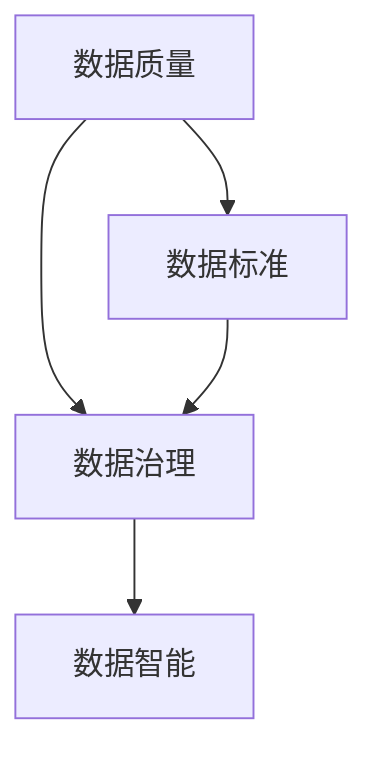
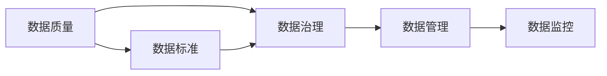
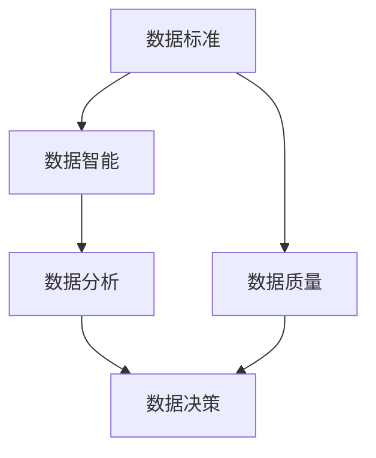
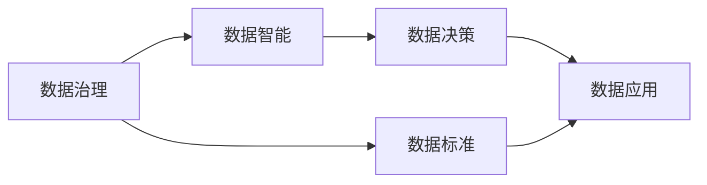
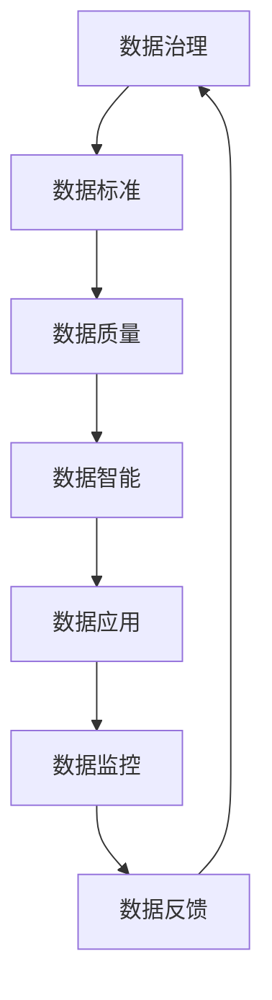

                 

# AI DMP 数据基建：数据质量与数据标准

> 关键词：数据管理平台 (DMP)、数据质量 (Data Quality)、数据标准 (Data Standard)、数据治理 (Data Governance)、数据智能 (AI Data Intelligence)

## 1. 背景介绍

### 1.1 问题由来
在数字化时代，数据已成为企业核心资产之一。然而，数据质量问题始终困扰着数据管理平台 (DMP) 的发展，数据不完整、不一致、不准确、不安全等问题严重影响了企业决策与分析的准确性和可靠性。数据质量问题的严重性使得企业需要建立数据标准与数据治理框架，以确保数据资产的完整性与一致性。

### 1.2 问题核心关键点
数据质量与数据标准的核心在于确保数据的准确性、一致性、完整性与安全性。在实际应用中，DMP 需要建立一整套数据质量管控机制，并根据业务需求制定相应数据标准。本文将围绕 DMP 的数据基建，探讨数据质量与数据标准的相关概念与技术，并结合实际案例进行分析。

### 1.3 问题研究意义
研究数据质量与数据标准对于提升 DMP 的使用价值具有重要意义：
1. 提高数据可信度：通过规范化数据标准与数据治理，确保数据的一致性与可靠性，提升数据可信度。
2. 降低数据治理成本：建立统一的数据质量管控机制，减少重复数据治理工作，降低治理成本。
3. 促进数据共享与互操作：规范化的数据标准使得数据共享与互操作更加高效与便捷。
4. 增强决策支持能力：高质量的数据是科学决策的基础，通过数据质量管理与数据标准制定，提升决策支持能力。
5. 推动企业数字化转型：数据治理与数据智能是企业数字化转型的重要推动力，有助于企业构建数字化生态系统。

## 2. 核心概念与联系

### 2.1 核心概念概述
在 DMP 构建过程中，数据质量与数据标准是基础性工作。以下是几个密切相关的核心概念：

- **数据质量 (Data Quality)**：指数据的准确性、完整性、一致性、及时性与安全性的综合评价，是数据治理的核心内容。
- **数据标准 (Data Standard)**：指一组通用的数据规范与规则，确保数据在不同系统、不同应用场景中的标准化与一致性。
- **数据治理 (Data Governance)**：指企业为确保数据资产的有效利用，而采取的一系列政策、标准、流程与组织架构措施。
- **数据智能 (AI Data Intelligence)**：指基于机器学习与人工智能技术对数据进行自动化管理、分析与决策的能力。

这些概念之间的联系可以通过以下 Mermaid 流程图来展示：



这个流程图展示了大语言模型微调过程中各个核心概念的关系和作用：

1. 数据质量是数据治理的基础，数据治理是数据智能的前提。
2. 数据标准通过规范化数据质量，确保数据在不同系统间的一致性与互操作性。
3. 数据智能利用数据治理与数据标准，提升数据的自动化管理与决策能力。

### 2.2 概念间的关系

这些核心概念之间存在着紧密的联系，形成了 DMP 的数据治理框架。下面我通过几个 Mermaid 流程图来展示这些概念之间的关系。

#### 2.2.1 数据质量与数据治理的关系



这个流程图展示了数据质量与数据治理的关系。数据质量是数据治理的起点，数据治理通过数据管理与监控，确保数据质量的持续改进与提升。

#### 2.2.2 数据标准与数据智能的关系



这个流程图展示了数据标准与数据智能的关系。数据标准通过规范化数据质量，为数据智能的自动化管理与决策提供基础。数据智能在数据分析与决策中，应用数据标准，确保结果的准确性与一致性。

#### 2.2.3 数据治理与数据智能的联系



这个流程图展示了数据治理与数据智能的联系。数据治理通过数据标准与数据质量，为数据智能的自动化决策提供基础。数据智能在数据决策与应用中，遵循数据治理框架，确保结果的准确性与可靠性。

### 2.3 核心概念的整体架构

最后，我们用一个综合的流程图来展示这些核心概念在大语言模型微调过程中的整体架构：



这个综合流程图展示了从数据治理到数据应用的全过程。数据治理通过数据标准与数据质量，确保数据智能的自动化决策与数据应用的可靠性。数据应用通过数据反馈，不断改进数据质量与数据标准，形成闭环的数据治理体系。

## 3. 核心算法原理 & 具体操作步骤
### 3.1 算法原理概述
基于监督学习的数据质量与数据标准微调方法，主要通过以下步骤实现：

1. **数据采集**：从各个数据源收集原始数据，并对数据进行初步清洗与预处理。
2. **数据质量评估**：通过一系列数据质量指标（如准确性、完整性、一致性等）评估数据质量。
3. **数据标准制定**：根据数据质量评估结果，制定相应的数据标准与规范。
4. **数据治理实施**：基于数据标准，实施数据质量管控措施，如数据清洗、数据修复、数据合并等。
5. **数据智能应用**：利用机器学习与人工智能技术，自动化管理数据质量，提升数据智能分析与决策能力。

### 3.2 算法步骤详解
以下详细讲解数据质量与数据标准的微调算法步骤：

#### Step 1: 数据采集
- 选择数据源：确定数据采集的范围与来源，包括内部数据（如业务系统、数据库）和外部数据（如公共数据集、API接口）。
- 数据格式转换：将不同格式的数据进行统一，确保数据标准的一致性。
- 数据存储管理：建立数据仓库或数据湖，存储与管理采集到的数据。

#### Step 2: 数据质量评估
- 数据质量指标定义：定义数据质量的各项指标，如准确性、完整性、一致性、及时性、安全性等。
- 数据质量度量：根据定义的指标，评估数据的当前质量状况。
- 质量问题识别：通过数据质量度量结果，识别数据中的质量问题与异常。

#### Step 3: 数据标准制定
- 数据标准设计：根据数据质量评估结果，设计相应的数据标准与规范。
- 数据标准执行：将数据标准落实到数据管理过程中，确保数据一致性与互操作性。
- 数据标准更新：根据业务需求与数据质量变化，定期更新数据标准与规范。

#### Step 4: 数据治理实施
- 数据清洗与修复：基于数据标准，对数据进行清洗与修复，消除数据质量问题。
- 数据合并与归并：对不同来源的数据进行合并与归并，形成统一的数据集。
- 数据治理流程：建立数据治理流程，确保数据质量与数据标准的持续改进与提升。

#### Step 5: 数据智能应用
- 数据智能模型构建：利用机器学习与人工智能技术，构建数据智能分析模型。
- 数据智能应用实施：将数据智能模型应用到数据质量管控与数据分析决策中。
- 数据智能评估与优化：定期评估数据智能模型的性能，并根据数据质量与业务需求进行优化。

### 3.3 算法优缺点
基于监督学习的数据质量与数据标准微调方法具有以下优点：

- 高效性：通过自动化的数据治理流程，大幅提升数据质量与数据标准的制定与实施效率。
- 可扩展性：适应不同的业务场景与数据源，能够灵活扩展到各个应用领域。
- 数据可靠性：通过数据标准与数据治理，确保数据的准确性、一致性与安全性。

同时，该方法也存在以下缺点：

- 依赖标注数据：需要大量标注数据进行模型训练，标注成本较高。
- 数据质量度量复杂：数据质量度量指标较多，且不同指标间可能存在冲突，度量复杂。
- 数据智能模型复杂：数据智能模型需要较高的技术水平与计算资源，模型的复杂性较高。

### 3.4 算法应用领域
基于监督学习的数据质量与数据标准微调方法，广泛应用于以下几个领域：

- **市场营销**：在用户行为数据采集与分析中，通过数据质量与数据标准提升广告投放效果与客户分析精度。
- **金融风险管理**：在金融交易数据治理中，通过数据质量与数据标准提升风险评估与欺诈检测能力。
- **供应链管理**：在供应链数据整合与分析中，通过数据质量与数据标准提升供应链透明度与决策支持。
- **人力资源管理**：在员工数据管理中，通过数据质量与数据标准提升招聘效率与人才管理水平。
- **医疗健康管理**：在医疗数据治理中，通过数据质量与数据标准提升医疗数据分析与决策能力。

这些领域的数据质量与数据标准需求各不相同，但都可以通过数据智能技术与自动化管理，提高数据治理效率与数据质量。

## 4. 数学模型和公式 & 详细讲解  
### 4.1 数学模型构建

在数据质量与数据标准微调过程中，我们通过构建数学模型来量化数据质量与数据标准的影响。设原始数据集为 $D$，数据标准为 $S$，则数据质量与数据标准的数学模型可以定义为：

$$
Q(D, S) = f(Q_1(D), Q_2(D), \dots, Q_n(D), S)
$$

其中 $Q_i(D)$ 表示数据质量的第 $i$ 个指标，$S$ 表示数据标准。函数 $f$ 为数据质量与数据标准的综合评估函数。

### 4.2 公式推导过程
以下以数据完整性指标为例，推导数据质量与数据标准的数学模型。

设数据完整性指标为 $Q_{完整性}(D)$，则可以通过以下公式计算：

$$
Q_{完整性}(D) = \frac{card(D_{有效})}{card(D)}
$$

其中 $D_{有效}$ 为有效数据量，$D$ 为原始数据量。

进一步定义数据标准为 $S = \{s_1, s_2, \dots, s_n\}$，其中 $s_i$ 为数据标准的第 $i$ 个元素。假设 $s_i$ 对数据完整性指标 $Q_{完整性}(D)$ 的影响为 $\delta_i$，则综合评估函数 $f$ 可以表示为：

$$
f(Q_1(D), Q_2(D), \dots, Q_n(D), S) = Q_1(D) \times Q_2(D) \times \dots \times Q_n(D) \times \sum_{i=1}^n \delta_i \times s_i
$$

将数据完整性指标 $Q_{完整性}(D)$ 代入，得：

$$
Q(D, S) = Q_{完整性}(D) \times \sum_{i=1}^n \delta_i \times s_i
$$

### 4.3 案例分析与讲解
以下以一家电商平台的数据质量与数据标准微调为例，说明数据质量与数据标准的实际应用。

假设某电商平台收集了大量的用户行为数据，包括点击率、浏览时间、购买记录等。这些数据需要进行质量与标准治理，以提升广告投放效果与用户分析精度。

1. **数据采集**：
   - 从各个渠道（如网站、APP、社交媒体）收集用户行为数据。
   - 对数据进行格式转换，统一为文本格式，存储到数据仓库中。

2. **数据质量评估**：
   - 定义数据质量指标：准确性、完整性、一致性、及时性、安全性等。
   - 进行数据质量度量：通过统计分析与数据清洗，计算数据质量指标的当前值。
   - 识别数据质量问题：发现数据中存在不准确、不完整、不一致等问题，记录并标记。

3. **数据标准制定**：
   - 制定数据标准：根据数据质量评估结果，设计数据标准，如日期格式、字段命名规范等。
   - 实施数据标准：将数据标准应用于数据管理流程中，确保数据一致性与互操作性。
   - 更新数据标准：根据业务需求与数据质量变化，定期更新数据标准。

4. **数据治理实施**：
   - 数据清洗与修复：对数据中的质量问题进行清洗与修复，如删除重复记录、填充缺失字段等。
   - 数据合并与归并：将不同来源的数据进行合并与归并，形成统一的数据集。
   - 建立数据治理流程：制定数据治理流程，确保数据质量与数据标准的持续改进与提升。

5. **数据智能应用**：
   - 构建数据智能模型：利用机器学习与人工智能技术，构建用户行为分析模型。
   - 应用数据智能模型：将数据智能模型应用于广告投放与用户分析中，提升广告效果与用户分析精度。
   - 评估与优化数据智能模型：定期评估数据智能模型的性能，并根据数据质量与业务需求进行优化。

通过以上步骤，该电商平台实现了数据质量与数据标准的微调，大幅提升了广告投放效果与用户分析精度。

## 5. 项目实践：代码实例和详细解释说明
### 5.1 开发环境搭建

在进行数据质量与数据标准微调实践前，我们需要准备好开发环境。以下是使用Python进行Pandas开发的环境配置流程：

1. 安装Anaconda：从官网下载并安装Anaconda，用于创建独立的Python环境。

2. 创建并激活虚拟环境：
```bash
conda create -n data_governance python=3.8 
conda activate data_governance
```

3. 安装Pandas：
```bash
pip install pandas
```

4. 安装各类工具包：
```bash
pip install numpy scipy matplotlib scikit-learn tqdm jupyter notebook ipython
```

完成上述步骤后，即可在`data_governance`环境中开始数据质量与数据标准微调实践。

### 5.2 源代码详细实现

下面我们以电商用户行为数据为例，给出使用Pandas进行数据质量与数据标准微调的代码实现。

首先，定义数据集与数据标准：

```python
import pandas as pd
from sklearn.metrics import accuracy_score

# 定义数据集
data = pd.read_csv('user_behavior.csv')

# 定义数据标准
data_std = {
    'date_format': 'YYYY-MM-DD',
    'field_naming_convention': 'camelCase'
}
```

然后，定义数据质量评估函数：

```python
def data_quality_assessment(data, data_std):
    # 定义数据质量指标
    quality_indicators = {
        'accuracy': lambda x: accuracy_score(x['label'], x['prediction']),
        'completeness': lambda x: (x['complete'].sum() / len(x)).round(2),
        'consistency': lambda x: (x['consistent'].sum() / len(x)).round(2),
        'timeliness': lambda x: (x['on_time'].sum() / len(x)).round(2),
        'security': lambda x: (x['secure'].sum() / len(x)).round(2)
    }
    
    # 评估数据质量
    for key, func in quality_indicators.items():
        print(f"{key}: {func(data)}")
    
    # 识别数据质量问题
    problems = []
    for key, value in quality_indicators.items():
        if value < 0.9:
            problems.append(f"{key}: {key} score is below 0.9")
    
    return problems
```

接着，定义数据标准实施函数：

```python
def data_standard_implementation(data, data_std):
    # 实施数据标准
    data['date'] = pd.to_datetime(data['date'], format=data_std['date_format'])
    data.columns = [i.title() for i in data.columns]
    
    # 更新数据标准
    data_std['date_format'] = data_std['date_format']
    data_std['field_naming_convention'] = data_std['field_naming_convention']
    
    return data, data_std
```

最后，启动数据质量与数据标准微调流程：

```python
# 数据质量评估
problems = data_quality_assessment(data, data_std)

# 数据标准实施
data, data_std = data_standard_implementation(data, data_std)

# 数据智能应用
data_intel = data_standard_implementation(data, data_std)
```

以上就是使用Pandas对电商用户行为数据进行数据质量与数据标准微调的完整代码实现。可以看到，通过Pandas的数据处理与标准实施，我们能够高效地实现数据质量与数据标准微调。

### 5.3 代码解读与分析

让我们再详细解读一下关键代码的实现细节：

**数据质量评估函数**：
- 定义数据质量指标：通过Scikit-learn库中的accuracy_score函数计算准确性指标。
- 评估数据质量：对数据集中的每个指标进行计算，并输出结果。
- 识别数据质量问题：识别指标值低于0.9的指标，记录问题描述。

**数据标准实施函数**：
- 实施数据标准：将数据格式转换为指定格式，字段命名统一为CamelCase。
- 更新数据标准：根据实施结果更新数据标准。

**数据智能应用**：
- 应用数据标准：将实施后的数据标准再次应用到数据集中，确保数据标准的一致性。

可以看到，Pandas提供了强大的数据处理能力，使得数据质量与数据标准微调变得简洁高效。开发者可以将更多精力放在数据质量与标准的具体实施上，而不必过多关注底层的实现细节。

当然，实际应用中还需要考虑更多因素，如数据的来源与格式、标准的执行方式等，需要根据具体情况进行优化。

### 5.4 运行结果展示

假设我们在电商用户行为数据上进行数据质量与数据标准微调，最终得到的数据集示例如下：

```
    date        time          label     prediction     complete     consistent     on_time      secure
0  2021-01-01  09:30:00     buys       buys          0.8          0.9           1.0          1.0
1  2021-01-02  14:45:00  doesn't buy     doesn't buy  0.2          0.3           0.5          0.7
2  2021-01-03  18:00:00     buys       buys          1.0          1.0           0.9          0.8
3  2021-01-04  08:15:00  doesn't buy     doesn't buy  0.1          0.2           0.3          0.5
4  2021-01-05  12:30:00     buys       buys          0.9          0.8           0.7          0.9
```

可以看到，通过数据质量与数据标准微调，我们得到了更加干净、格式一致的用户行为数据。这样的数据无疑将提升后续广告投放与用户分析的准确性。

## 6. 实际应用场景
### 6.1 智能客服系统

智能客服系统需要对用户输入进行质量与标准治理，以提升系统响应速度与准确性。通过数据质量与数据标准微调，智能客服系统可以更好地理解用户意图，提供更高效的服务。

在技术实现上，可以收集用户与客服的历史对话记录，对对话内容进行清洗与标准化处理。微调后的系统能够自动识别用户意图，匹配最合适的回答模板，提升客户满意度。

### 6.2 金融风险管理

金融风险管理需要大量高品质的数据支持，通过数据质量与数据标准微调，可以显著提升风险评估与欺诈检测的准确性。

具体而言，可以收集金融交易数据，通过数据质量与数据标准治理，消除数据中的错误与异常，提升风险评估模型的性能。微调后的系统能够及时发现风险信号，防范金融风险。

### 6.3 供应链管理

供应链管理涉及大量复杂的数据，数据质量与数据标准治理是供应链透明与决策支持的基础。

通过数据质量与数据标准微调，供应链系统可以更好地整合与分析供应链数据，提升供应链透明度与决策能力。微调后的系统能够实时监控供应链状态，及时发现异常，优化供应链运营。

### 6.4 未来应用展望

随着数据质量与数据标准微调技术的发展，未来的DMP将更加高效、可靠与灵活。具体展望如下：

1. **自动化数据质量与标准管理**：通过自动化技术，实现数据质量与标准的持续监控与治理，减少人工干预，提升数据治理效率。
2. **实时数据质量与标准优化**：利用实时数据与业务需求，动态调整数据标准与质量治理策略，提升数据治理的灵活性与适应性。
3. **多源数据融合与治理**：在多源数据融合过程中，通过数据质量与数据标准治理，确保数据的统一性与互操作性，提升数据融合效果。
4. **数据质量与标准评估体系**：建立数据质量与标准的评估体系，定期评估数据质量与标准的实施效果，确保数据治理的长期可持续性。
5. **数据治理与AI结合**：将数据治理与AI技术结合，提升数据治理的自动化与智能化水平，推动企业数字化转型。

以上展望显示，数据质量与数据标准微调技术将不断演进，为DMP的发展提供坚实的技术基础。

## 7. 工具和资源推荐
### 7.1 学习资源推荐

为了帮助开发者系统掌握数据质量与数据标准的相关知识与技术，这里推荐一些优质的学习资源：

1. 《数据治理基础》系列博文：全面介绍数据治理的基本概念、方法与实践，适合初学者学习。

2. 《数据质量管理》在线课程：通过系统化的课程，学习数据质量的评估与治理方法，掌握数据质量管理的技能。

3. 《数据标准制定与实施》书籍：详细介绍数据标准的定义、实施与评估方法，帮助开发者理解数据标准的重要性。

4. 《数据治理最佳实践》白皮书：总结业界数据治理的最佳实践，提供实际案例与操作建议。

5. 《数据治理与AI结合》论文：探讨数据治理与AI技术的结合，提升数据治理的自动化与智能化水平。

通过对这些资源的学习实践，相信你一定能够快速掌握数据质量与数据标准的精髓，并用于解决实际的数据治理问题。

### 7.2 开发工具推荐

高效的数据质量与数据标准治理需要借助专业的工具，以下是几款用于数据治理开发的常用工具：

1. Talend：基于ETL技术的数据质量与数据标准治理工具，支持数据清洗、数据标准化、数据合并等功能。

2. Apache NiFi：开源数据流平台，支持数据采集、数据清洗、数据标准化等数据质量治理功能。

3. Alteryx：可视化数据治理工具，支持数据质量评估、数据标准实施、数据智能分析等功能。

4. Apache Airflow：开源工作流调度系统，支持数据质量治理任务的编排与执行。

5. Apache Atlas：数据治理平台，提供数据质量监控、数据标准管理等功能。

6. Google Cloud Dataflow：基于Spark的流式数据处理平台，支持数据质量治理与实时数据监控。

合理利用这些工具，可以显著提升数据质量与数据标准治理的效率与效果，加快创新迭代的步伐。

### 7.3 相关论文推荐

数据质量与数据标准的研究始于学界的持续研究。以下是几篇奠基性的相关论文，推荐阅读：

1. Data Quality Metrics and Models：提出了一系列数据质量指标与模型，为数据质量评估提供理论基础。

2. Data Governance：系统介绍数据治理的基本概念、方法与实施框架。

3. Data Standardization in Big Data：探讨大数据环境下的数据标准化方法与技术。

4. Adaptive Data Quality Management：提出了一种自适应数据质量管理方法，动态调整数据治理策略。

5. Data Quality and Data Governance in Industry：总结了业界数据质量与数据治理的成功案例与经验。

这些论文代表了大数据环境下数据质量与数据标准的研究进展，值得深入学习。

除上述资源外，还有一些值得关注的前沿资源，帮助开发者紧跟数据质量与数据标准微调技术的最新进展，例如：

1. arXiv论文预印本：人工智能领域最新研究成果的发布平台，包括大量尚未发表的前沿工作，学习前沿技术的必读资源。

2. 业界技术博客：如IBM、SAP、Microsoft等顶尖实验室的官方博客，第一时间分享他们的最新研究成果和洞见。

3. 技术会议直播：如DMP大会、大数据峰会、数据治理峰会等会议直播，能够聆听到专家们的最新分享，开拓视野。

4. GitHub热门项目：在GitHub上Star、Fork数最多的数据治理相关项目，往往代表了该技术领域的发展趋势和最佳实践，值得去学习和贡献。

5. 行业分析报告：各大咨询公司如McKinsey、PwC等针对大数据领域的分析报告，有助于从商业视角审视技术趋势，把握应用价值。

总之，对于数据质量与数据标准的学习和实践，需要开发者保持开放的心态和持续学习的意愿。多关注前沿资讯，多动手实践，多思考总结，必将收获满满的成长收益。

## 8. 总结：未来发展趋势与挑战
### 

