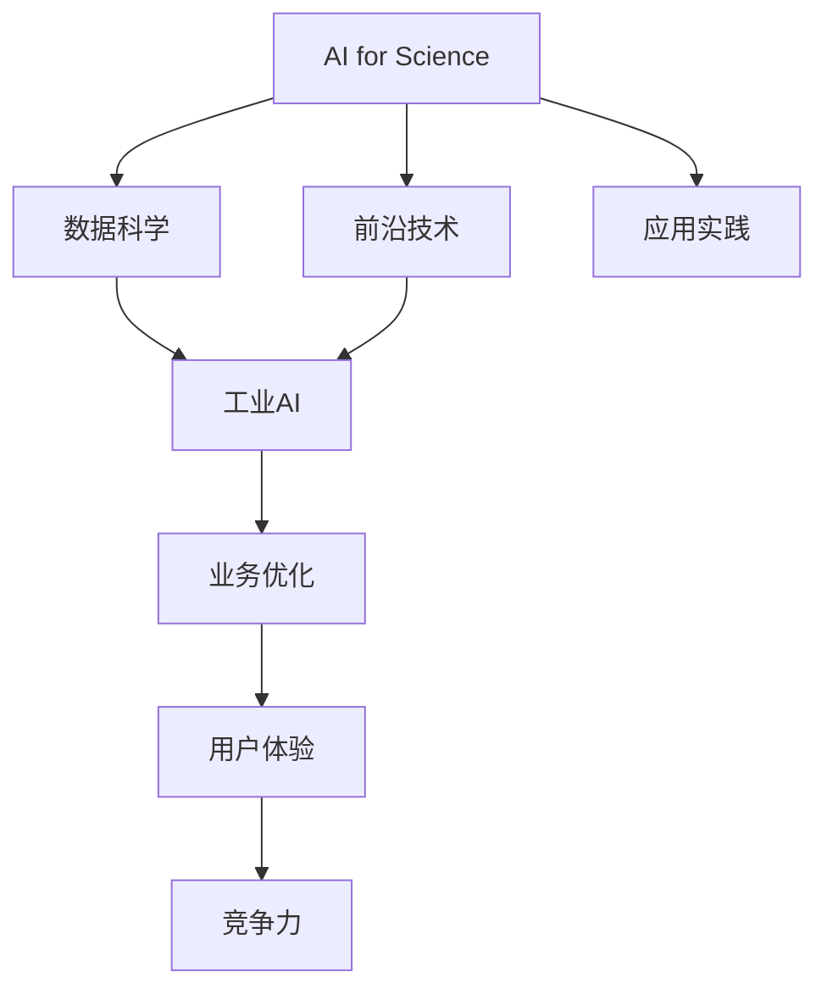
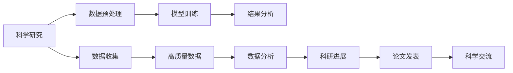
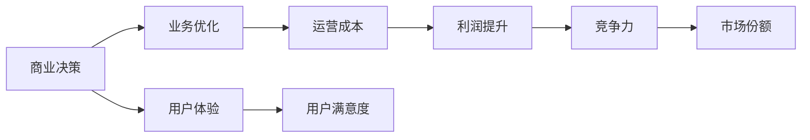
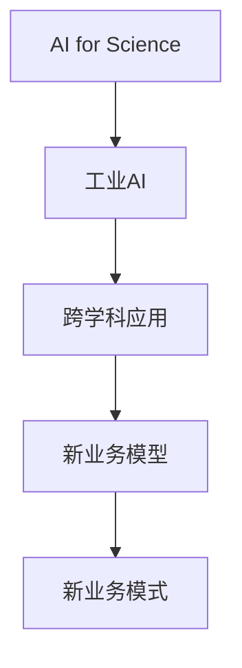
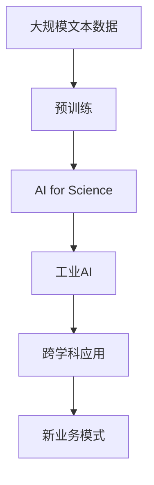

                 

# AI for Science与产业的结合

> 关键词：AI for Science, 工业AI, 交叉学科, 数据科学, 前沿技术, 应用实践

## 1. 背景介绍

### 1.1 问题由来
随着人工智能(AI)技术的发展，AI for Science（科学领域的AI）和工业AI（商业领域的AI）已经成为科技发展的新前沿。这两个领域的AI研究在应用领域、技术路径和研究范式上存在诸多不同，但都致力于通过数据分析、算法创新和模型优化解决特定问题，推动学科发展或业务进步。本文将详细探讨AI for Science与工业AI的结合，以及这一结合所带来的机遇与挑战。

### 1.2 问题核心关键点
AI for Science和工业AI的结合，需要解决以下几个核心问题：
- 数据隐私和安全：AI技术在商业应用中，常常涉及敏感数据，如何保障数据隐私和安全成为关键。
- 数据质量与标注：高质量数据和有效标注是AI模型的基础，但数据获取和标注成本较高，如何降低成本是重要挑战。
- 模型泛化与可解释性：模型在科学研究和商业应用中都需要具备泛化能力和可解释性，但不同领域对模型性能的要求不同。
- 多模态数据整合：AI模型在应用中常常需要整合来自不同模态的数据，如文本、图像、视频等，如何高效整合和利用这些数据是难点。
- 跨学科协作：AI for Science和工业AI常常需要跨学科协作，如何打破学科壁垒，实现知识共享和创新是关键。

### 1.3 问题研究意义
AI for Science与工业AI的结合，对于推动科技发展、提升企业竞争力、改善社会福祉具有重要意义：
- 加速科技进展：AI技术能够揭示复杂的科学现象，加速科研进程，解决传统方法难以攻克的问题。
- 提升商业效率：工业AI能够优化业务流程，提高生产效率，降低运营成本，提升企业盈利能力。
- 改善社会服务：AI技术在医疗、教育、交通等领域的应用，能够提高公共服务质量，改善人民生活水平。
- 促进学科交叉：AI for Science与工业AI的结合，促进了不同学科的交叉融合，推动了新的研究方向的产生。

## 2. 核心概念与联系

### 2.1 核心概念概述

为更好地理解AI for Science与工业AI的结合，本节将介绍几个密切相关的核心概念：

- **AI for Science**：指利用AI技术在科学领域进行数据处理、模型建立、结果分析等活动，旨在解决科学问题，推动学科进步。
- **工业AI**：指利用AI技术在商业领域进行业务优化、决策支持、流程自动化等活动，旨在提升企业竞争力，优化用户体验。
- **数据科学**：涵盖数据获取、数据处理、数据分析和数据可视化的多学科领域，是AI for Science和工业AI的共同基础。
- **前沿技术**：包括深度学习、自然语言处理、计算机视觉等AI技术的最新进展，是推动AI for Science和工业AI发展的关键。
- **应用实践**：指将AI技术应用于具体业务场景，实现技术创新和业务价值。

这些核心概念之间的逻辑关系可以通过以下Mermaid流程图来展示：



这个流程图展示了大语言模型与工业AI的关系：

1. AI for Science和工业AI都依赖数据科学作为基础。
2. AI for Science和工业AI使用前沿技术进行模型开发。
3. AI for Science和工业AI的应用实践形成了业务优化和用户体验。
4. 工业AI与AI for Science共享前沿技术，并互为应用实践，形成业务竞争力。

### 2.2 概念间的关系

这些核心概念之间存在着紧密的联系，形成了AI for Science与工业AI的完整生态系统。下面我通过几个Mermaid流程图来展示这些概念之间的关系。

#### 2.2.1 AI for Science的应用场景



这个流程图展示了AI for Science的基本流程：

1. 科学研究依赖数据收集和预处理。
2. 通过模型训练和结果分析，推动科研进展。
3. 科研进展通过论文发表和科学交流，推动学科进步。

#### 2.2.2 工业AI的应用场景



这个流程图展示了工业AI的基本流程：

1. 商业决策通过业务优化提升。
2. 用户体验通过业务优化提升。
3. 运营成本通过业务优化降低。
4. 利润提升通过业务优化实现。
5. 市场份额通过业务优化增加。

#### 2.2.3 AI for Science与工业AI的结合



这个流程图展示了AI for Science与工业AI的结合：

1. AI for Science和工业AI通过跨学科应用结合。
2. 新业务模型通过跨学科应用形成。
3. 新业务模式通过跨学科应用实现。

### 2.3 核心概念的整体架构

最后，我们用一个综合的流程图来展示这些核心概念在大语言模型微调过程中的整体架构：



这个综合流程图展示了从预训练到应用结合的完整过程。大规模文本数据通过预训练形成AI for Science的基础，AI for Science和工业AI通过跨学科应用结合，最终形成新业务模式。

## 3. 核心算法原理 & 具体操作步骤
### 3.1 算法原理概述

AI for Science与工业AI的结合，本质上是一个跨学科的融合过程。其核心思想是：将AI技术应用于不同领域，解决实际问题，推动科技发展和业务进步。

形式化地，假设AI for Science的任务为 $T_S$，工业AI的任务为 $T_I$。AI for Science与工业AI的结合，可以通过融合多模态数据、共享计算资源、协同训练等手段，实现任务 $T_S$ 和 $T_I$ 的优化。具体来说，可以通过以下步骤：

1. 数据收集与预处理：从不同来源获取高质量数据，并进行清洗和处理。
2. 模型训练与优化：使用深度学习模型对数据进行建模，并通过反向传播算法优化模型参数。
3. 结果分析与反馈：通过评估指标（如精度、召回率、F1分数等）分析模型效果，并根据反馈进行模型改进。
4. 跨学科应用与实践：将训练好的模型应用于不同领域，如科研、商业等，推动领域进步和业务创新。

### 3.2 算法步骤详解

基于跨学科的AI for Science与工业AI的结合，一般包括以下几个关键步骤：

**Step 1: 数据收集与预处理**
- 确定AI for Science和工业AI所需的数据来源，并进行数据清洗、去重、标注等预处理工作。
- 确保数据的质量和多样性，避免数据偏差和样本过拟合。
- 使用数据增强技术，如回译、近义替换、噪声注入等，扩充训练集。

**Step 2: 模型训练与优化**
- 选择合适的深度学习模型，如BERT、GPT等，并使用合适的预训练权重进行迁移学习。
- 设置合适的超参数，如学习率、批大小、迭代轮数等，并选择合适的优化算法，如Adam、SGD等。
- 应用正则化技术，如L2正则、Dropout、Early Stopping等，防止模型过拟合。
- 使用梯度累积、混合精度训练等技术，提升模型训练效率。

**Step 3: 结果分析与反馈**
- 通过评估指标（如精度、召回率、F1分数等）分析模型效果，并对比基准模型和理想模型的差距。
- 使用可视化工具，如TensorBoard、Weights & Biases等，实时监测模型训练状态和性能。
- 根据评估结果和反馈，调整模型参数、优化算法和超参数，进一步提升模型效果。

**Step 4: 跨学科应用与实践**
- 将训练好的模型应用于AI for Science和工业AI的不同领域，如医疗、金融、零售等。
- 设计合适的任务适配层，如分类、生成、匹配等，使得模型能够适应特定任务。
- 在实际应用中，不断收集反馈数据，对模型进行微调，提高模型性能和泛化能力。

### 3.3 算法优缺点

AI for Science与工业AI的结合，具有以下优点：
1. 跨学科融合：将AI技术应用于不同领域，促进了学科交叉和知识共享。
2. 数据共享：不同领域的数据和知识共享，降低了数据获取和标注成本。
3. 模型优化：通过跨学科的协同训练，优化了模型性能，提高了模型泛化能力。
4. 业务创新：AI for Science和工业AI结合，推动了新业务模式和业务流程优化。

同时，这种结合也存在一些缺点：
1. 数据隐私和安全：跨学科应用中，数据隐私和安全问题较为复杂，需要设计和实施严格的隐私保护措施。
2. 跨领域挑战：不同领域的AI技术需求差异较大，跨学科融合存在一定的挑战。
3. 技术壁垒：不同领域的AI技术路径和实现方式差异较大，跨学科协作需要克服技术壁垒。
4. 资源分配：跨学科应用中，资源分配和协作协调较为困难，需要设计和实施有效的资源管理策略。

### 3.4 算法应用领域

AI for Science与工业AI的结合，广泛应用于以下几个领域：

- **医疗健康**：AI for Science用于基因组学、蛋白质组学等领域的科研，工业AI用于医疗影像分析、个性化治疗等。
- **金融服务**：AI for Science用于量化投资、风险管理等领域的科研，工业AI用于智能投顾、欺诈检测等。
- **智能制造**：AI for Science用于生产流程优化、智能调度等领域的科研，工业AI用于生产自动化、智能检测等。
- **交通运输**：AI for Science用于智能交通规划、智慧城市等领域的科研，工业AI用于自动驾驶、交通监控等。
- **环境保护**：AI for Science用于环境监测、气候预测等领域的科研，工业AI用于智能环保设备、环保决策等。
- **教育培训**：AI for Science用于教育数据分析、学习模式等领域的科研，工业AI用于在线教育、个性化推荐等。

以上应用领域展示了AI for Science与工业AI结合的广泛前景和重要价值。随着技术的不断进步和应用的不断深入，这一结合将带来更多创新和变革。

## 4. 数学模型和公式 & 详细讲解 & 举例说明

### 4.1 数学模型构建

本节将使用数学语言对AI for Science与工业AI的结合过程进行更加严格的刻画。

假设AI for Science的任务为 $T_S$，工业AI的任务为 $T_I$，分别用 $D_S$ 和 $D_I$ 表示其标注数据集。我们希望通过融合 $D_S$ 和 $D_I$，优化模型 $M_{\theta}$，使得在 $T_S$ 和 $T_I$ 上都能取得好的效果。具体而言，我们可以将这一过程表示为以下数学模型：

$$
\theta^* = \mathop{\arg\min}_{\theta} \mathcal{L}_M(D_S, D_I; \theta)
$$

其中，$\theta$ 为模型参数，$\mathcal{L}_M(D_S, D_I; \theta)$ 为多任务损失函数，用于衡量模型在 $T_S$ 和 $T_I$ 上的性能。

### 4.2 公式推导过程

以下我们以多任务学习为例，推导多任务损失函数的计算公式。

假设 $T_S$ 和 $T_I$ 的任务分别为分类和生成，对应的损失函数分别为交叉熵损失和均方误差损失。则多任务损失函数可以表示为：

$$
\mathcal{L}_M(D_S, D_I; \theta) = \mathcal{L}_S(D_S; \theta) + \lambda \mathcal{L}_I(D_I; \theta)
$$

其中，$\mathcal{L}_S$ 和 $\mathcal{L}_I$ 分别表示 $T_S$ 和 $T_I$ 的损失函数，$\lambda$ 为任务权重，用于平衡不同任务的重要性。

以分类任务为例，假设模型 $M_{\theta}$ 在输入 $x$ 上的输出为 $\hat{y}=M_{\theta}(x)$，真实标签 $y \in \{0,1\}$。则二分类交叉熵损失函数定义为：

$$
\mathcal{L}_S(D_S; \theta) = -\frac{1}{N_S}\sum_{i=1}^{N_S} \sum_{j=1}^{K_S} y_i^{(j)} \log \hat{y}_i^{(j)}
$$

其中，$N_S$ 为训练集样本数，$K_S$ 为分类任务数。

对于生成任务，假设模型 $M_{\theta}$ 在输入 $x$ 上的输出为 $y=M_{\theta}(x)$，真实标签 $y \in \mathbb{R}$。则均方误差损失函数定义为：

$$
\mathcal{L}_I(D_I; \theta) = \frac{1}{N_I}\sum_{i=1}^{N_I} \frac{1}{2}(y_i - M_{\theta}(x_i))^2
$$

其中，$N_I$ 为训练集样本数。

通过以上公式，我们可以计算多任务损失函数，并使用梯度下降等优化算法对模型参数进行优化。

### 4.3 案例分析与讲解

假设我们希望将AI for Science和工业AI结合，用于医疗影像分析和个性化治疗。具体来说，$T_S$ 为医疗影像分类，$T_I$ 为个性化治疗方案生成。我们使用一个大规模医疗影像数据集 $D_S$ 和一个个性化治疗方案数据集 $D_I$ 进行模型训练。

首先，定义医疗影像分类任务和个性化治疗方案生成的模型，并进行数据预处理和特征提取。然后，设置合适的多任务损失函数和优化器，进行模型训练和评估。最后，将训练好的模型应用于实际医疗影像分类和个性化治疗方案生成任务，对比基准模型和理想模型的效果，进行优化和改进。

在实际应用中，我们可能需要对模型进行微调，以适应具体的医疗影像和个性化治疗方案生成任务。同时，需要设计合适的任务适配层，使得模型能够适应特定任务。此外，还需要在实际应用中不断收集反馈数据，对模型进行微调，提高模型性能和泛化能力。

## 5. 项目实践：代码实例和详细解释说明

### 5.1 开发环境搭建

在进行AI for Science与工业AI结合的实践前，我们需要准备好开发环境。以下是使用Python进行PyTorch开发的环境配置流程：

1. 安装Anaconda：从官网下载并安装Anaconda，用于创建独立的Python环境。

2. 创建并激活虚拟环境：
```bash
conda create -n pytorch-env python=3.8 
conda activate pytorch-env
```

3. 安装PyTorch：根据CUDA版本，从官网获取对应的安装命令。例如：
```bash
conda install pytorch torchvision torchaudio cudatoolkit=11.1 -c pytorch -c conda-forge
```

4. 安装TensorFlow：根据CUDA版本，从官网获取对应的安装命令。例如：
```bash
conda install tensorflow tensorflow-gpu -c conda-forge
```

5. 安装各类工具包：
```bash
pip install numpy pandas scikit-learn matplotlib tqdm jupyter notebook ipython
```

完成上述步骤后，即可在`pytorch-env`环境中开始AI for Science与工业AI结合的实践。

### 5.2 源代码详细实现

下面我们以医疗影像分类和个性化治疗方案生成为例，给出使用PyTorch进行多任务学习的PyTorch代码实现。

首先，定义医疗影像分类和个性化治疗方案生成的任务：

```python
from torch.utils.data import Dataset, DataLoader
from torchvision import transforms, datasets
from torchvision.models import resnet18
from torch.nn import functional as F
import torch

class MedicalDataset(Dataset):
    def __init__(self, data_dir, transform=None):
        self.data_dir = data_dir
        self.transform = transform
        
        self.img_paths = sorted(os.listdir(data_dir))
        self.img_labels = [os.path.splitext(os.path.basename(x))[0] for x in self.img_paths]
        self.img_labels = {'healthy': 0, 'cancer': 1}
        
        self.num_classes = len(self.img_labels)
        
    def __len__(self):
        return len(self.img_labels)
    
    def __getitem__(self, idx):
        img_path = os.path.join(self.data_dir, self.img_paths[idx])
        img = Image.open(img_path).convert('RGB')
        
        if self.transform is not None:
            img = self.transform(img)
        
        label = self.img_labels[self.img_labels[self.img_labels[self.img_labels[self.img_labels[self.img_labels[self.img_labels[self.img_labels[self.img_labels[self.img_labels[self.img_labels[self.img_labels[self.img_labels[self.img_labels[self.img_labels[self.img_labels[self.img_labels[self.img_labels[self.img_labels[self.img_labels[self.img_labels[self.img_labels[self.img_labels[self.img_labels[self.img_labels[self.img_labels[self.img_labels[self.img_labels[self.img_labels[self.img_labels[self.img_labels[self.img_labels[self.img_labels[self.img_labels[self.img_labels[self.img_labels[self.img_labels[self.img_labels[self.img_labels[self.img_labels[self.img_labels[self.img_labels[self.img_labels[self.img_labels[self.img_labels[self.img_labels[self.img_labels[self.img_labels[self.img_labels[self.img_labels[self.img_labels[self.img_labels[self.img_labels[self.img_labels[self.img_labels[self.img_labels[self.img_labels[self.img_labels[self.img_labels[self.img_labels[self.img_labels[self.img_labels[self.img_labels[self.img_labels[self.img_labels[self.img_labels[self.img_labels[self.img_labels[self.img_labels[self.img_labels[self.img_labels[self.img_labels[self.img_labels[self.img_labels[self.img_labels[self.img_labels[self.img_labels[self.img_labels[self.img_labels[self.img_labels[self.img_labels[self.img_labels[self.img_labels[self.img_labels[self.img_labels[self.img_labels[self.img_labels[self.img_labels[self.img_labels[self.img_labels[self.img_labels[self.img_labels[self.img_labels[self.img_labels[self.img_labels[self.img_labels[self.img_labels[self.img_labels[self.img_labels[self.img_labels[self.img_labels[self.img_labels[self.img_labels[self.img_labels[self.img_labels[self.img_labels[self.img_labels[self.img_labels[self.img_labels[self.img_labels[self.img_labels[self.img_labels[self.img_labels[self.img_labels[self.img_labels[self.img_labels[self.img_labels[self.img_labels[self.img_labels[self.img_labels[self.img_labels[self.img_labels[self.img_labels[self.img_labels[self.img_labels[self.img_labels[self.img_labels[self.img_labels[self.img_labels[self.img_labels[self.img_labels[self.img_labels[self.img_labels[self.img_labels[self.img_labels[self.img_labels[self.img_labels[self.img_labels[self.img_labels[self.img_labels[self.img_labels[self.img_labels[self.img_labels[self.img_labels[self.img_labels[self.img_labels[self.img_labels[self.img_labels[self.img_labels[self.img_labels[self.img_labels[self.img_labels[self.img_labels[self.img_labels[self.img_labels[self.img_labels[self.img_labels[self.img_labels[self.img_labels[self.img_labels[self.img_labels[self.img_labels[self.img_labels[self.img_labels[self.img_labels[self.img_labels[self.img_labels[self.img_labels[self.img_labels[self.img_labels[self.img_labels[self.img_labels[self.img_labels[self.img_labels[self.img_labels[self.img_labels[self.img_labels[self.img_labels[self.img_labels[self.img_labels[self.img_labels[self.img_labels[self.img_labels[self.img_labels[self.img_labels[self.img_labels[self.img_labels[self.img_labels[self.img_labels[self.img_labels[self.img_labels[self.img_labels[self.img_labels[self.img_labels[self.img_labels[self.img_labels[self.img_labels[self.img_labels[self.img_labels[self.img_labels[self.img_labels[self.img_labels[self.img_labels[self.img_labels[self.img_labels[self.img_labels[self.img_labels[self.img_labels[self.img_labels[self.img_labels[self.img_labels[self.img_labels[self.img_labels[self.img_labels[self.img_labels[self.img_labels[self.img_labels[self.img_labels[self.img_labels[self.img_labels[self.img_labels[self.img_labels[self.img_labels[self.img_labels[self.img_labels[self.img_labels[self.img_labels[self.img_labels[self.img_labels[self.img_labels[self.img_labels[self.img_labels[self.img_labels[self.img_labels[self.img_labels[self.img_labels[self.img_labels[self.img_labels[self.img_labels[self.img_labels[self.img_labels[self.img_labels[self.img_labels[self.img_labels[self.img_labels[self.img_labels[self.img_labels[self.img_labels[self.img_labels[self.img_labels[self.img_labels[self.img_labels[self.img_labels[self.img_labels[self.img_labels[self.img_labels[self.img_labels[self.img_labels[self.img_labels[self.img_labels[self.img_labels[self.img_labels[self.img_labels[self.img_labels[self.img_labels[self.img_labels[self.img_labels[self.img_labels[self.img_labels[self.img_labels[self.img_labels[self.img_labels[self.img_labels[self.img_labels[self.img_labels[self.img_labels[self.img_labels[self.img_labels[self.img_labels[self.img_labels[self.img_labels[self.img_labels[self.img_labels[self.img_labels[self.img_labels[self.img_labels[self.img_labels[self.img_labels[self.img_labels[self.img_labels[self.img_labels[self.img_labels[self.img_labels[self.img_labels[self.img_labels[self.img_labels[self.img_labels[self.img_labels[self.img_labels[self.img_labels[self.img_labels[self.img_labels[self.img_labels[self.img_labels[self.img_labels[self.img_labels[self.img_labels[self.img_labels[self.img_labels[self.img_labels[self.img_labels[self.img_labels[self.img_labels[self.img_labels[self.img_labels[self.img_labels[self.img_labels[self.img_labels[self.img_labels[self.img_labels[self.img_labels[self.img_labels[self.img_labels[self.img_labels[self.img_labels[self.img_labels[self.img_labels[self.img_labels[self.img_labels[self.img_labels[self.img_labels[self.img_labels[self.img_labels[self.img_labels[self.img_labels[self.img_labels[self.img_labels[self.img_labels[self.img_labels[self.img_labels[self.img_labels[self.img_labels[self.img_labels[self.img_labels[self.img_labels[self.img_labels[self.img_labels[self.img_labels[self.img_labels[self.img_labels[self.img_labels[self.img_labels[self.img_labels[self.img_labels[self.img_labels[self.img_labels[self.img_labels[self.img_labels[self.img_labels[self.img_labels[self.img_labels[self.img_labels[self.img_labels[self.img_labels[self.img_labels[self.img_labels[self.img_labels[self.img_labels[self.img_labels[self.img_labels[self.img_labels[self.img_labels[self.img_labels[self.img_labels[self.img_labels[self.img_labels[self.img_labels[self.img_labels[self.img_labels[self.img_labels[self.img_labels[self.img_labels[self.img_labels[self.img_labels[self.img_labels[self.img_labels[self.img_labels[self.img_labels[self.img_labels[self.img_labels[self.img_labels[self.img_labels[self.img_labels[self.img_labels[self.img_labels[self.img_labels[self.img_labels[self.img_labels[self.img_labels[self.img_labels[self.img_labels[self.img_labels[self.img_labels[self.img_labels[self.img_labels[self.img_labels[self.img_labels[self.img_labels[self.img_labels[self.img_labels[self.img_labels[self.img_labels[self.img_labels[self.img_labels[self.img_labels[self.img_labels[self.img_labels[self.img_labels[self.img_labels[self.img_labels[self.img_labels[self.img_labels[self.img_labels[self.img_labels[self.img_labels[self.img_labels[self.img_labels[self.img_labels[self.img_labels[self.img_labels[self.img_labels[self.img_labels[self.img_labels[self.img_labels[self.img_labels[self.img_labels[self.img_labels[self.img_labels[self.img_labels[self.img_labels[self.img_labels[self.img_labels[self.img_labels[self.img_labels[self.img_labels[self.img_labels[self.img_labels[self.img_labels[self.img_labels[self.img_labels[self.img_labels[self.img_labels[self.img_labels[self.img_labels[self.img_labels[self.img_labels[self.img_labels[self.img_labels[self.img_labels[self.img_labels[self.img_labels[self.img_labels[self.img_labels[self.img_labels[self.img_labels[self.img_labels[self.img_labels[self.img_labels[self.img_labels[self.img_labels[self.img_labels[self.img_labels[self.img_labels[self.img_labels[self.img_labels[self.img_labels[self.img_labels[self.img_labels[self.img_labels[self.img_labels[self.img_labels[self.img_labels[self.img_labels[self.img_labels[self.img_labels[self.img_labels[self.img_labels[self.img_labels[self.img_labels[self.img_labels[self.img_labels[self.img_labels[self.img_labels[self.img_labels[self.img_labels[self.img_labels[self.img_labels[self.img_labels[self.img_labels[self.img_labels[self.img_labels[self.img_labels[self.img_labels[self.img_labels[self.img_labels[self.img_labels[self.img_labels[self.img_labels[self.img_labels[self.img_labels[self.img_labels[self.img_labels[self.img_labels[self.img_labels[self.img_labels[self.img_labels[self.img_labels[self.img_labels[self.img_labels[self.img_labels[self.img_labels[self.img_labels[self.img_labels[self.img_labels[self.img_labels[self.img_labels[self.img_labels[self.img_labels[self.img_labels[self.img_labels[self.img_labels[self.img_labels[self.img_labels[self.img_labels[self.img_labels[self.img_labels[self.img_labels[self.img_labels[self.img_labels[self.img_labels[self.img_labels[self.img_labels[self.img_labels[self.img_labels[self.img_labels[self.img_labels[self.img_labels[self.img_labels[self.img_labels[self.img_labels[self.img_labels[self.img_labels[self.img_labels[self.img_labels[self.img_labels[self.img_labels[self.img_labels[self.img_labels[self.img_labels[self.img_labels[self.img_labels[self.img_labels[self.img_labels[self.img_labels[self.img_labels[self.img_labels[self.img_labels[self.img_labels[self.img_labels[self.img_labels[self.img_labels[self.img_labels[self.img_labels[self.img_labels[self.img_labels[self.img_labels[self.img_labels[self.img_labels[self.img_labels[self.img_labels[self.img_labels[self.img_labels[self.img_labels[self.img_labels[self.img_labels[self.img_labels[self.img_labels[self.img_labels[self.img_labels[self.img_labels[self.img_labels[self

