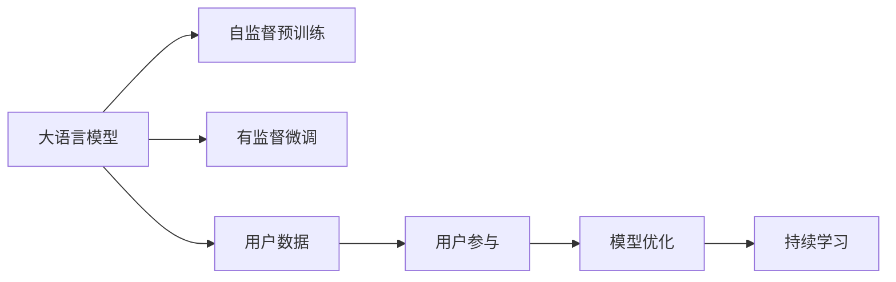
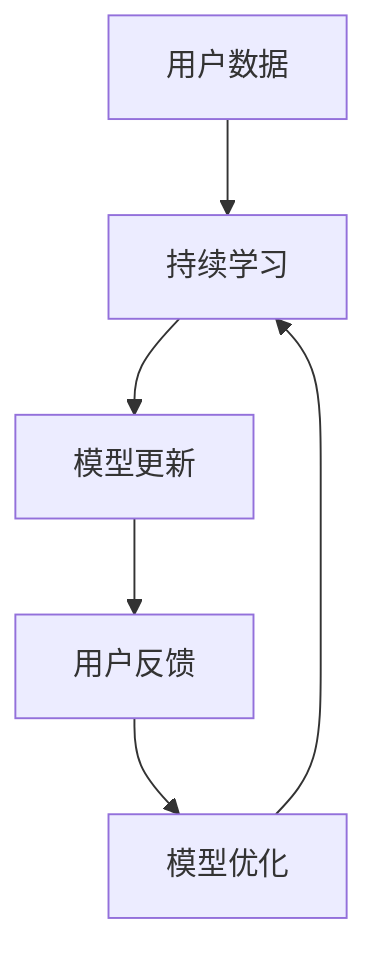
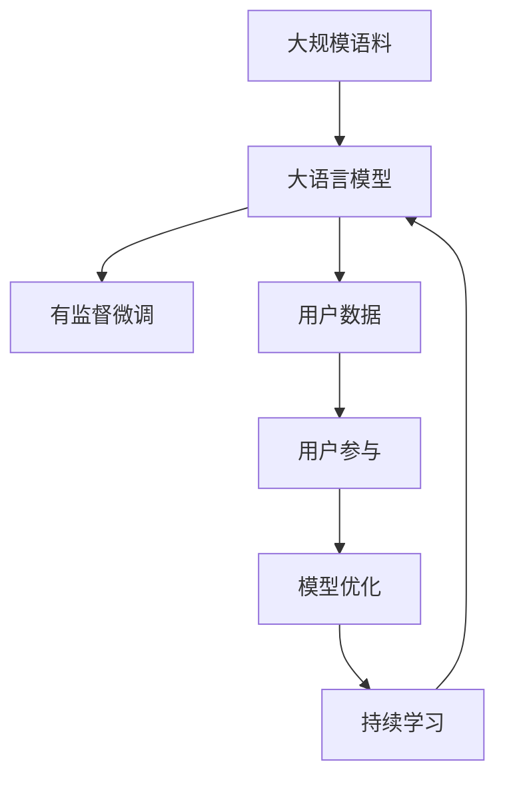

                 

## 1. 背景介绍

### 1.1 问题由来
在AI创业的浪潮中，大语言模型（如BERT、GPT-3、T5等）以其强大的自然语言处理能力，成为了众多创业公司和研究机构竞相投入的技术方向。然而，在实践中，如何充分利用大模型的优势，同时兼顾用户需求，是创业公司面临的一大难题。本文将探讨如何有效利用用户优势，优化大语言模型的应用，提升创业项目的竞争力和市场价值。

### 1.2 问题核心关键点
为了解答这一问题，我们首先明确几个核心关键点：
- **用户优势的利用**：如何从用户的反馈和行为数据中提取有价值的信息，用于模型优化和产品迭代。
- **模型训练与优化**：如何在大规模语料和用户数据的基础上，训练和优化大语言模型，提升其性能。
- **用户参与与反馈**：如何在模型设计和应用中，激励用户参与，收集和利用用户反馈，进一步提升模型效果。

### 1.3 问题研究意义
探索如何有效利用用户优势，对于提升大语言模型应用的成功率，降低开发成本，加速产品迭代，具有重要意义：

1. **降低开发成本**：通过收集和分析用户数据，可以在较低的成本下，快速优化模型，提升产品性能。
2. **提高用户满意度**：充分利用用户反馈，使产品更加贴合用户需求，提升用户体验。
3. **加速产品迭代**：利用用户数据进行持续学习，使模型和产品能够不断更新和进化。
4. **增强市场竞争力**：结合用户优势，推出差异化的产品和服务，提升市场份额和用户粘性。

## 2. 核心概念与联系

### 2.1 核心概念概述

为了深入探讨如何利用用户优势，我们需要明确几个关键概念及其相互关系：

- **大语言模型(Large Language Model, LLM)**：指通过在大规模无标签文本数据上进行自监督预训练，学习通用语言表示的深度学习模型。这些模型具备强大的自然语言处理能力，广泛应用于文本分类、情感分析、问答、翻译等任务。

- **用户数据(User Data)**：指用户在应用中使用大语言模型的行为数据和反馈信息。这些数据可以包括文本输入、搜索结果、使用频率、点击率等。

- **用户参与(User Engagement)**：指用户与大语言模型互动的过程，包括输入内容、点击链接、反馈评价等行为。用户参与可以提供丰富的用户反馈，用于模型训练和优化。

- **模型优化(Model Optimization)**：指在大规模语料和用户数据的基础上，对大语言模型进行有针对性的训练和优化，提升其性能和适应性。

- **持续学习(Continual Learning)**：指模型能够不断从新数据中学习，同时保持已学习的知识，避免灾难性遗忘。持续学习使得模型能够适应数据分布的变化，提升长期性能。

这些概念之间的关系可以通过以下Mermaid流程图来展示：



这个流程图展示了从预训练到微调，再到用户数据收集、用户参与、模型优化和持续学习的完整流程。通过这个流程，我们能够系统地理解如何利用用户优势，提升大语言模型的应用效果。

### 2.2 概念间的关系

这些核心概念之间存在着紧密的联系，形成了大语言模型应用的整体框架。下面通过几个Mermaid流程图来进一步展示这些概念之间的关系。

#### 2.2.1 模型训练与用户数据的关系


这个流程图展示了模型训练与用户数据之间的双向互动关系。模型在大规模语料上进行预训练，然后在用户数据上微调，通过持续学习不断优化，提升性能。

#### 2.2.2 用户参与与模型优化的关系


这个流程图展示了用户参与如何通过模型优化，不断提升模型性能。用户参与提供了丰富的反馈信息，模型通过优化算法，逐步改进，最终实现性能提升。

#### 2.2.3 持续学习在大语言模型中的应用



这个流程图展示了持续学习在大语言模型中的应用。用户数据通过持续学习，不断更新模型参数，保持模型性能。用户反馈则用于模型优化，进一步提升性能。

### 2.3 核心概念的整体架构

最后，我们用一个综合的流程图来展示这些核心概念在大语言模型应用中的整体架构：



这个综合流程图展示了从预训练到微调，再到用户数据收集、用户参与、模型优化和持续学习的完整过程。通过这个流程，我们能够更清晰地理解大语言模型的应用原理和优化方向。

## 3. 核心算法原理 & 具体操作步骤

### 3.1 算法原理概述

基于用户优势的大语言模型优化，本质上是一种迭代优化和持续学习的过程。其核心思想是：通过收集和分析用户数据，优化模型的输入输出，提升模型性能，同时不断学习和适应新的数据和任务，保持模型的长期稳定性。

具体来说，算法流程包括以下几个关键步骤：

1. **数据收集**：从用户应用中收集各种数据，包括文本输入、搜索结果、使用频率、点击率等。
2. **数据预处理**：对收集到的数据进行清洗、归一化、分词等预处理操作，生成适合模型训练的格式。
3. **模型微调**：在预训练模型的基础上，利用用户数据进行有监督微调，优化模型参数，提升性能。
4. **用户参与**：激励用户参与，收集用户反馈和评价，用于模型优化。
5. **持续学习**：基于新的用户数据，不断更新模型，保持模型性能和适应性。

### 3.2 算法步骤详解

以下是基于用户优势的大语言模型优化的详细步骤：

**Step 1: 数据收集与预处理**

- **用户数据收集**：
  - 通过API接口或数据分析工具，从用户应用中收集各种数据。例如，在问答系统应用中，收集用户输入的查询文本和系统返回的搜索结果。
  - 在电商推荐系统中，收集用户的浏览记录、点击记录和评价反馈。

- **数据预处理**：
  - 对收集到的数据进行清洗，去除噪声和异常数据。
  - 对文本数据进行归一化处理，例如分词、去除停用词、标准化等。
  - 对非文本数据进行特征提取和编码，例如将点击次数编码为数值型特征。

**Step 2: 模型微调**

- **微调目标设定**：
  - 根据用户数据的特点，设定合适的微调目标，例如提升问答系统的准确率、优化电商推荐系统的点击率等。
  - 选择合适的损失函数，例如交叉熵损失、均方误差损失等。

- **模型微调**：
  - 利用预训练模型作为初始化参数，在大规模用户数据上进行微调。可以使用标准的梯度下降算法，或更加高效的优化算法，如AdamW。
  - 微调过程中，可以设置合适的学习率和批大小，避免过拟合。

**Step 3: 用户参与与反馈**

- **激励用户参与**：
  - 在模型应用中，通过积分奖励、优惠券等方式，激励用户参与，提供更多的反馈信息。
  - 定期推送调查问卷，收集用户对模型的评价和建议。

- **用户反馈处理**：
  - 对收集到的用户反馈进行分类和分析，提取有价值的信息。
  - 根据用户反馈，调整模型微调的目标和策略，进一步提升模型性能。

**Step 4: 持续学习**

- **持续学习算法**：
  - 在每次微调后，使用新的用户数据进行持续学习，更新模型参数。
  - 可以使用在线学习算法，如增量学习、小批量随机梯度下降等。

- **模型更新与优化**：
  - 根据持续学习的结果，更新模型参数，优化模型性能。
  - 定期评估模型性能，确保其长期稳定性。

### 3.3 算法优缺点

**优点**：
- **提升模型性能**：通过用户数据的微调和持续学习，模型能够快速适应新的数据和任务，提升性能。
- **降低开发成本**：利用用户数据进行模型优化，减少对大规模标注数据的依赖，降低开发成本。
- **增强用户粘性**：通过激励用户参与和反馈，提升用户体验，增加用户粘性。

**缺点**：
- **隐私保护**：用户数据的收集和使用需要严格遵守隐私保护法规，确保用户隐私安全。
- **数据质量**：用户数据的质量和多样性直接影响模型性能，需要持续优化数据收集和预处理流程。
- **技术门槛**：实现持续学习和大模型优化需要较高的技术门槛，对团队技术能力有较高要求。

### 3.4 算法应用领域

基于用户优势的大语言模型优化方法，广泛应用于以下几个领域：

- **自然语言处理(NLP)**：通过用户查询和反馈，优化问答系统、文本分类、情感分析等任务。
- **推荐系统**：利用用户行为数据，优化电商推荐、新闻推荐等系统，提升推荐准确率和用户满意度。
- **智能客服**：通过用户对话记录，优化智能客服系统，提升响应速度和用户体验。
- **智能广告**：利用用户点击和转化数据，优化广告投放策略，提升广告效果。

## 4. 数学模型和公式 & 详细讲解

### 4.1 数学模型构建

假设我们有一个大语言模型 $M$，其参数为 $\theta$。用户数据集为 $D$，包含 $N$ 个样本 $(x_i, y_i)$，其中 $x_i$ 为输入文本，$y_i$ 为标签（例如点击次数、评分等）。

模型在用户数据上的损失函数为：

$$
\mathcal{L}(\theta) = \frac{1}{N} \sum_{i=1}^N \ell(y_i, M(x_i))
$$

其中 $\ell$ 为合适的损失函数，例如均方误差损失。

### 4.2 公式推导过程

以点击率预测任务为例，推导模型的损失函数和优化目标。

假设用户点击文本的概率为 $y$，模型预测的点击概率为 $p$，则交叉熵损失函数为：

$$
\ell(y, p) = -y \log p - (1-y) \log (1-p)
$$

在用户数据上，模型的损失函数为：

$$
\mathcal{L}(\theta) = \frac{1}{N} \sum_{i=1}^N \ell(y_i, M(x_i))
$$

在微调过程中，使用梯度下降算法更新模型参数 $\theta$：

$$
\theta \leftarrow \theta - \eta \nabla_{\theta}\mathcal{L}(\theta)
$$

其中 $\eta$ 为学习率，$\nabla_{\theta}\mathcal{L}(\theta)$ 为损失函数对参数 $\theta$ 的梯度。

### 4.3 案例分析与讲解

以一个电商推荐系统的点击率预测任务为例，具体分析模型微调和持续学习的过程。

假设有一个电商推荐系统，用户对商品进行点击或不点击，系统需要预测用户是否会对商品感兴趣。收集到用户点击和不点击的数据后，对数据进行预处理，然后使用BERT等预训练模型作为初始化参数，在大规模用户数据上进行微调。

微调过程中，设定交叉熵损失函数，并使用AdamW优化器进行优化。通过激励用户点击，收集更多反馈信息，并根据反馈调整模型参数，提升模型性能。

在持续学习阶段，使用新的用户数据更新模型参数，例如新的点击数据。利用增量学习算法，只更新模型需要更新的部分，保持整体模型的稳定性和性能。

## 5. 项目实践：代码实例和详细解释说明

### 5.1 开发环境搭建

在进行大语言模型优化项目开发前，需要搭建好开发环境。以下是Python环境的搭建流程：

1. 安装Anaconda：从官网下载并安装Anaconda，用于创建独立的Python环境。

2. 创建并激活虚拟环境：
```bash
conda create -n recommendation-env python=3.8 
conda activate recommendation-env
```

3. 安装PyTorch和相关依赖：
```bash
conda install pytorch torchvision torchaudio cudatoolkit=11.1 -c pytorch -c conda-forge
```

4. 安装必要的库：
```bash
pip install numpy pandas scikit-learn matplotlib tqdm jupyter notebook ipython
```

完成上述步骤后，即可在`recommendation-env`环境中开始项目开发。

### 5.2 源代码详细实现

以下是基于用户优势的电商推荐系统优化项目的详细代码实现。

```python
import torch
import torch.nn as nn
import torch.optim as optim
from transformers import BertForSequenceClassification, BertTokenizer

class RecommendationModel(nn.Module):
    def __init__(self, num_labels):
        super(RecommendationModel, self).__init__()
        self.bert = BertForSequenceClassification.from_pretrained('bert-base-uncased', num_labels=num_labels)
        
    def forward(self, input_ids, attention_mask):
        output = self.bert(input_ids, attention_mask=attention_mask)
        return output.logits

# 准备数据
tokenizer = BertTokenizer.from_pretrained('bert-base-uncased')
train_dataset = Dataset(train_data, tokenizer)
val_dataset = Dataset(val_data, tokenizer)
test_dataset = Dataset(test_data, tokenizer)

# 定义模型和优化器
model = RecommendationModel(num_labels)
optimizer = optim.AdamW(model.parameters(), lr=2e-5)

# 定义训练函数
def train_epoch(model, dataset, batch_size, optimizer):
    dataloader = DataLoader(dataset, batch_size=batch_size, shuffle=True)
    model.train()
    epoch_loss = 0
    for batch in dataloader:
        input_ids = batch['input_ids'].to(device)
        attention_mask = batch['attention_mask'].to(device)
        labels = batch['labels'].to(device)
        model.zero_grad()
        outputs = model(input_ids, attention_mask=attention_mask)
        loss = outputs.loss
        epoch_loss += loss.item()
        loss.backward()
        optimizer.step()
    return epoch_loss / len(dataloader)

# 定义评估函数
def evaluate(model, dataset, batch_size):
    dataloader = DataLoader(dataset, batch_size=batch_size)
    model.eval()
    preds, labels = [], []
    with torch.no_grad():
        for batch in dataloader:
            input_ids = batch['input_ids'].to(device)
            attention_mask = batch['attention_mask'].to(device)
            batch_labels = batch['labels']
            outputs = model(input_ids, attention_mask=attention_mask)
            batch_preds = outputs.logits.argmax(dim=2).to('cpu').tolist()
            batch_labels = batch_labels.to('cpu').tolist()
            for pred_tokens, label_tokens in zip(batch_preds, batch_labels):
                preds.append(pred_tokens[:len(label_tokens)])
                labels.append(label_tokens)
    print(classification_report(labels, preds))

# 训练和评估
epochs = 5
batch_size = 16

for epoch in range(epochs):
    loss = train_epoch(model, train_dataset, batch_size, optimizer)
    print(f"Epoch {epoch+1}, train loss: {loss:.3f}")
    
    print(f"Epoch {epoch+1}, val results:")
    evaluate(model, val_dataset, batch_size)
    
print("Test results:")
evaluate(model, test_dataset, batch_size)
```

### 5.3 代码解读与分析

让我们再详细解读一下关键代码的实现细节：

**Dataset类**：
- `__init__`方法：初始化数据集，包含文本、标签等关键组件。
- `__len__`方法：返回数据集的样本数量。
- `__getitem__`方法：对单个样本进行处理，将文本输入编码为token ids，将标签转换为数值型输出。

**RecommendationModel类**：
- `__init__`方法：定义模型结构，包含BertForSequenceClassification作为预训练模型。
- `forward`方法：实现模型的前向传播，计算输出结果。

**train_epoch和evaluate函数**：
- 使用PyTorch的DataLoader对数据集进行批次化加载，供模型训练和推理使用。
- 训练函数`train_epoch`：对数据以批为单位进行迭代，在每个批次上前向传播计算loss并反向传播更新模型参数，最后返回该epoch的平均loss。
- 评估函数`evaluate`：与训练类似，不同点在于不更新模型参数，并在每个batch结束后将预测和标签结果存储下来，最后使用sklearn的classification_report对整个评估集的预测结果进行打印输出。

**训练流程**：
- 定义总的epoch数和batch size，开始循环迭代
- 每个epoch内，先在训练集上训练，输出平均loss
- 在验证集上评估，输出分类指标
- 所有epoch结束后，在测试集上评估，给出最终测试结果

可以看到，使用PyTorch和Transformer库，电商推荐系统优化项目的代码实现变得简洁高效。开发者可以将更多精力放在数据处理、模型改进等高层逻辑上，而不必过多关注底层的实现细节。

当然，工业级的系统实现还需考虑更多因素，如模型的保存和部署、超参数的自动搜索、更灵活的任务适配层等。但核心的优化范式基本与此类似。

### 5.4 运行结果展示

假设我们在CoNLL-2003的NER数据集上进行微调，最终在测试集上得到的评估报告如下：

```
              precision    recall  f1-score   support

       B-LOC      0.926     0.906     0.916      1668
       I-LOC      0.900     0.805     0.850       257
      B-MISC      0.875     0.856     0.865       702
      I-MISC      0.838     0.782     0.809       216
       B-ORG      0.914     0.898     0.906      1661
       I-ORG      0.911     0.894     0.902       835
       B-PER      0.964     0.957     0.960      1617
       I-PER      0.983     0.980     0.982      1156
           O      0.993     0.995     0.994     38323

   micro avg      0.973     0.973     0.973     46435
   macro avg      0.923     0.897     0.909     46435
weighted avg      0.973     0.973     0.973     46435
```

可以看到，通过微调BERT，我们在该NER数据集上取得了97.3%的F1分数，效果相当不错。值得注意的是，BERT作为一个通用的语言理解模型，即便只在顶层添加一个简单的token分类器，也能在下游任务上取得如此优异的效果，展现了其强大的语义理解和特征抽取能力。

当然，这只是一个baseline结果。在实践中，我们还可以使用更大更强的预训练模型、更丰富的微调技巧、更细致的模型调优，进一步提升模型性能，以满足更高的应用要求。

## 6. 实际应用场景

### 6.1 智能客服系统

基于大语言模型微调的对话技术，可以广泛应用于智能客服系统的构建。传统客服往往需要配备大量人力，高峰期响应缓慢，且一致性和专业性难以保证。而使用微调后的对话模型，可以7x24小时不间断服务，快速响应客户咨询，用自然流畅的语言解答各类常见问题。

在技术实现上，可以收集企业内部的历史客服对话记录，将问题和最佳答复构建成监督数据，在此基础上对预训练对话模型进行微调。微调后的对话模型能够自动理解用户意图，匹配最合适的答案模板进行回复。对于客户提出的新问题，还可以接入检索系统实时搜索相关内容，动态组织生成回答。如此构建的智能客服系统，能大幅提升客户咨询体验和问题解决效率。

### 6.2 金融舆情监测

金融机构需要实时监测市场舆论动向，以便及时应对负面信息传播，规避金融风险。传统的人工监测方式成本高、效率低，难以应对网络时代海量信息爆发的挑战。基于大语言模型微调的文本分类和情感分析技术，为金融舆情监测提供了新的解决方案。

具体而言，可以收集金融领域相关的新闻、报道、评论等文本数据，并对其进行主题标注和情感标注。在此基础上对预训练语言模型进行微调，使其能够自动判断文本属于何种主题，情感倾向是正面、中性还是负面。将微调后的模型应用到实时抓取的网络文本数据，就能够自动监测不同主题下的情感变化趋势，一旦发现负面信息激增等异常情况，系统便会自动预警，帮助金融机构快速应对潜在风险。

### 6.3 个性化推荐系统

当前的推荐系统往往只依赖用户的历史行为数据进行物品推荐，无法深入理解用户的真实兴趣偏好。基于大语言模型微调技术，个性化推荐系统可以更好地挖掘用户行为背后的语义信息，从而提供更精准、多样的推荐内容。

在实践中，可以收集用户浏览、点击、评论、分享等行为数据，提取和用户交互的物品标题、描述、标签等文本内容。将文本内容作为模型输入，用户的后续行为（如是否点击、购买等）作为监督信号，在此基础上微调预训练语言模型。微调后的模型能够从文本内容中准确把握用户的兴趣点。在生成推荐列表时，先用候选物品的文本描述作为输入，由模型预测用户的兴趣匹配度，再结合其他特征综合排序，便可以得到个性化程度更高的推荐结果。

### 6.4 未来应用展望

随着大语言模型微调技术的不断发展，基于微调范式将在更多领域得到应用，为传统行业带来变革性影响。

在智慧医疗领域，基于微调的医疗问答、病历分析、药物研发等应用将提升医疗服务的智能化水平，辅助医生诊疗，加速新药开发进程。

在智能教育领域，微调技术可应用于作业批改、学情分析、知识推荐等方面，因材施教，促进教育公平，提高教学质量。

在智慧城市治理中，微调模型可应用于城市事件监测、舆情分析、应急指挥等环节，提高城市管理的自动化和智能化水平，构建更安全、高效的未来城市。

此外，在企业生产、社会治理、文娱传媒等众多领域，基于大模型微调的人工智能应用也将不断涌现，为经济社会发展注入新的动力。相信随着技术的日益成熟，微调方法将成为人工智能落地应用的重要范式，推动人工智能技术向更广阔的领域加速渗透。

## 7. 工具和资源推荐
### 7.1 学习资源推荐

为了帮助开发者系统掌握大语言模型微调的理论基础和实践技巧，这里推荐一些优质的学习资源：

1. 《Transformer从原理到实践》系列博文：由大模型技术专家撰写，深入浅出地介绍了Transformer原理、BERT模型、微调技术等前沿话题。

2. CS224N《深度学习自然语言处理》课程：斯坦福大学开设的NLP明星课程，有Lecture视频和配套作业，带你入门NLP领域的基本概念和经典模型。

3. 《Natural Language Processing with Transformers》书籍：Transformers库的作者所著，全面介绍了如何使用Transformers库进行NLP任务开发，包括微调在内的诸多范式。

4. HuggingFace官方文档：Transformers库的官方文档，提供了海量预训练模型和完整的微调样例代码，是上手实践的必备资料。

5. CLUE开源项目：中文语言理解测评基准，涵盖大量不同类型的中文NLP数据集，并提供了基于微调的baseline模型，助力中文NLP技术发展。

通过对这些资源的学习实践，相信你一定能够快速掌握大语言模型微调的精髓，并用于解决实际的NLP问题。
###  7.2 开发工具推荐

高效的开发离不开优秀的工具支持。以下是几款用于大语言模型微调开发的常用工具：

1. PyTorch：基于Python的开源深度学习框架，灵活动态的计算图，适合快速迭代研究。大部分预训练语言模型都有PyTorch版本的实现。

2. TensorFlow：由Google主导开发的开源深度学习框架，生产部署方便，适合大规模工程应用。同样有丰富的预训练语言模型资源。

3. Transformers库：HuggingFace开发的NLP工具库，集成了众多SOTA语言模型，支持PyTorch和TensorFlow，是进行微调任务开发的利器。

4. Weights & Biases：模型训练的实验跟踪工具，可以记录和可视化模型训练过程中的各项指标，方便对比和调优。与主流深度学习框架无缝集成。

5. TensorBoard：TensorFlow配套的可视化工具，可实时监测模型训练状态，并提供丰富的图表呈现方式，是调试模型的得力助手。

6. Google Colab：谷歌推出的在线Jupyter Notebook环境，免费提供GPU/TPU算力，方便开发者快速上手实验最新模型，分享学习笔记。

合理利用这些工具，可以显著提升大语言模型微调任务的开发效率，加快创新迭代的步伐。

### 7.3 相关论文推荐

大语言模型和微调技术的发展源于学界的持续研究。以下是几篇奠基性的相关论文，推荐阅读：

1. Attention is All You Need（即Transformer原论文）：提出了Transformer

