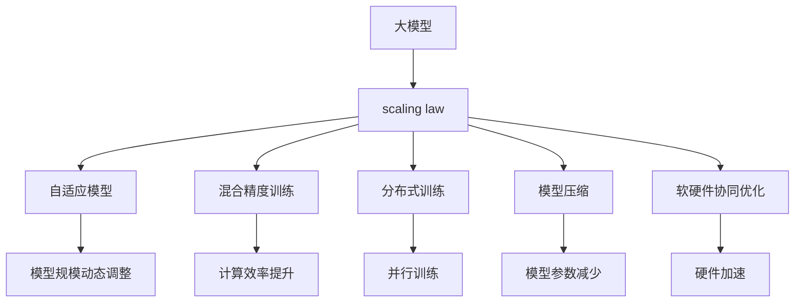
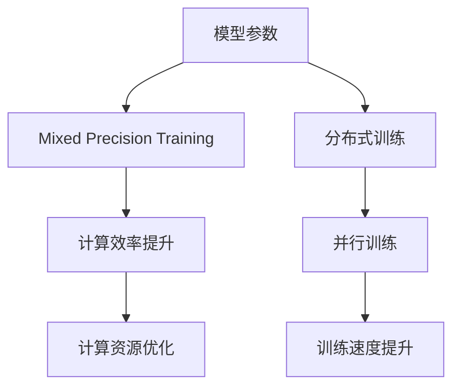
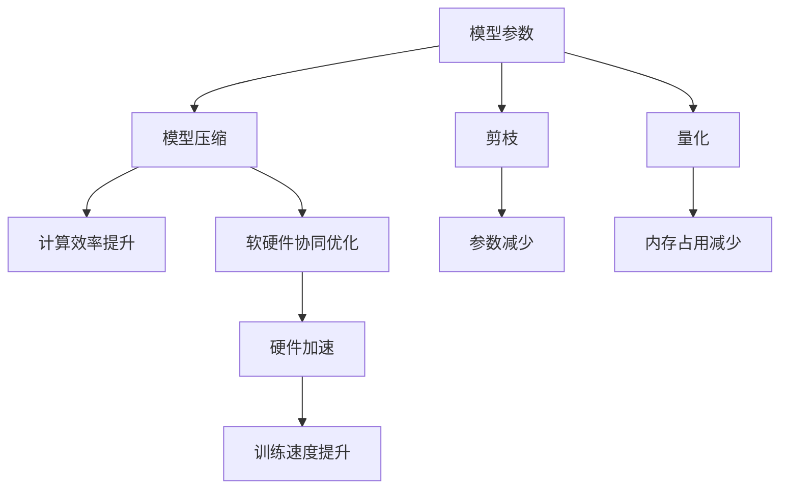
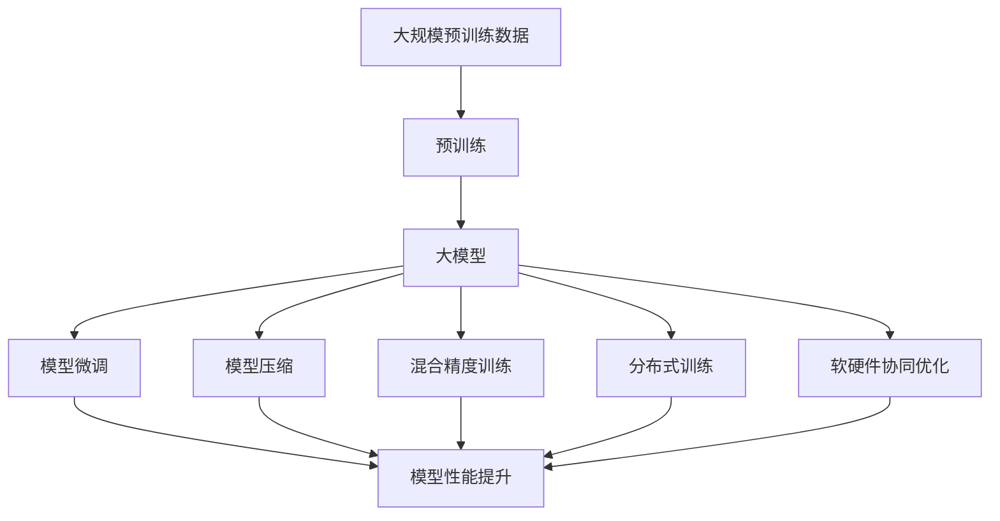

                 

# AI 大模型原理与应用：基于 scaling law 让模型变大，探索智能的边界

## 1. 背景介绍

### 1.1 问题由来
近年来，人工智能(AI)领域的飞速发展，尤其是深度学习和大规模语言模型(Large Language Models, LLMs)的突破性进展，为NLP、计算机视觉、语音识别等领域带来了革命性的变化。其中，Transformer模型和基于其构建的大模型，如GPT-3、BERT、T5等，以其在多个任务上的超凡表现，迅速占领了学术和工业界的制高点。

然而，大模型的训练和推理对计算资源的要求极高，同时也面临着模型规模、训练成本、推理效率等多方面的挑战。如何在保持模型性能的同时，降低训练和推理成本，实现大模型的泛化性能和高效应用，成为了当前研究的一个核心问题。

### 1.2 问题核心关键点
这个问题的核心在于如何在大模型训练和推理的过程中，通过算法和架构的优化，平衡模型规模和计算成本，同时提升模型的泛化能力和智能水平。为此，学术界和工业界提出了多种解决方案，其中scaling law的引入，成为了一种极具前景的方法。

scaling law提供了一种理论框架，用于指导模型设计，合理分配模型规模和计算资源，使得在大模型训练和推理的过程中，可以更高效地构建和运行模型，同时保持或提升其性能。

### 1.3 问题研究意义
研究基于scaling law的大模型训练与推理方法，对于推动人工智能技术的普及和应用，具有重要意义：

1. **降低计算成本**：通过合理分配模型规模和计算资源，可以大幅降低大模型的训练和推理成本，促进AI技术的广泛应用。
2. **提升泛化性能**：通过精确调整模型规模，可以提升模型的泛化能力和性能表现，增强其在不同任务和数据集上的适应性。
3. **优化资源利用**：通过scaling law指导的模型设计和优化，可以更高效地利用计算资源，提升系统的运行效率和稳定性。
4. **推动模型进化**：scaling law提供了一种科学指导模型进化的理论基础，帮助研究者系统地构建、优化和改进大模型。
5. **增强智能边界**：通过合理的大模型规模和计算资源的分配，可以探索和实现更高级别的智能任务，推动人工智能技术的边界拓展。

## 2. 核心概念与联系

### 2.1 核心概念概述

为更好地理解基于scaling law的大模型训练与推理方法，本节将介绍几个关键概念：

- **大模型(Large Models)**：如GPT-3、BERT、T5等，通常具有数亿个参数，能够在多个任务上取得优异的性能。
- **scaling law**：一种理论框架，用于指导模型设计，平衡模型规模和计算资源。
- **自适应模型(Adaptive Models)**：根据任务需求和计算资源动态调整模型规模的模型。
- **混合精度训练(Mixed Precision Training)**：使用不同精度（如FP16与FP32）的数值格式进行模型训练，以提高计算效率。
- **分布式训练(Distributed Training)**：通过多台计算设备并行训练，提升模型的训练速度和效率。
- **模型压缩(Model Compression)**：通过剪枝、量化等方法，减小模型规模，提升推理速度和计算效率。
- **软硬件协同优化(Software-Hardware Co-Optimization)**：结合硬件架构和软件算法，实现更高效率的模型训练和推理。

这些概念之间的逻辑关系可以通过以下Mermaid流程图来展示：



这个流程图展示了大模型训练和推理的关键概念及其之间的关系：

1. 大模型通过scaling law指导下的模型设计，保持或提升性能。
2. 自适应模型根据任务需求和计算资源动态调整模型规模，提升性能和效率。
3. 混合精度训练和分布式训练分别通过数值精度和并行计算，提高计算效率。
4. 模型压缩通过剪枝和量化，减小模型规模，提升推理速度和计算效率。
5. 软硬件协同优化结合硬件架构和软件算法，实现更高效率的模型训练和推理。

这些概念共同构成了大模型训练和推理的完整生态系统，使其能够在各种场景下发挥强大的智能能力。通过理解这些核心概念，我们可以更好地把握大模型训练和推理的过程及其优化方向。

### 2.2 概念间的关系

这些核心概念之间存在着紧密的联系，形成了大模型训练和推理的完整框架。下面我们通过几个Mermaid流程图来展示这些概念之间的关系。

#### 2.2.1 大模型的构建流程


这个流程图展示了构建大模型的基本流程：从大规模预训练数据开始，通过预训练构建出大模型，再通过微调适应特定任务，最后进行模型部署和优化。

#### 2.2.2 混合精度训练与分布式训练



这个流程图展示了混合精度训练和分布式训练的相互补充关系，通过数值精度和并行计算，提高计算效率和训练速度。

#### 2.2.3 模型压缩与软硬件协同优化



这个流程图展示了模型压缩和软硬件协同优化的互补作用，通过参数减少和硬件加速，进一步提升计算效率和模型性能。

### 2.3 核心概念的整体架构

最后，我们用一个综合的流程图来展示这些核心概念在大模型训练和推理过程中的整体架构：



这个综合流程图展示了从预训练到微调，再到压缩、训练和优化的完整过程。大模型首先在大规模预训练数据上进行预训练，然后通过微调适应特定任务，接下来应用模型压缩、混合精度训练、分布式训练和软硬件协同优化等技术，进一步提升模型性能，从而实现高效的训练和推理。 通过这些流程图，我们可以更清晰地理解大模型训练和推理过程中各个核心概念的关系和作用，为后续深入讨论具体的训练与优化方法奠定基础。

## 3. 核心算法原理 & 具体操作步骤

### 3.1 算法原理概述

基于scaling law的大模型训练与推理，本质上是一个通过理论指导的模型优化过程。其核心思想是：通过scaling law的理论框架，指导模型设计，动态调整模型规模和计算资源，从而在大模型训练和推理的过程中，实现性能和效率的最优化。

形式化地，假设大模型的参数量为 $N$，计算资源的单位为 $T$，则scaling law提供了一个模型性能和资源消耗的关系函数 $f(N, T)$。该函数通常被用于指导模型设计，确保在给定计算资源的情况下，模型能够达到最佳的性能表现。例如，对于深度学习模型，该函数可以表示为：

$$
f(N, T) = \log N - \log T
$$

其中 $N$ 为模型参数量，$T$ 为计算资源单位（如计算时间），$\log$ 为以 $e$ 为底的对数。该函数表明，随着模型参数量的增加，计算资源需求成对数关系增加，从而达到平衡。

### 3.2 算法步骤详解

基于scaling law的大模型训练与推理一般包括以下几个关键步骤：

**Step 1: 准备预训练数据和计算资源**
- 收集大规模预训练数据，准备用于模型训练和推理。
- 确定计算资源（如CPU、GPU、TPU等）的配置和分布。

**Step 2: 选择模型架构**
- 根据任务需求和计算资源，选择或设计合适的模型架构。
- 选择合适的自适应模型设计方法，如自适应模型、参数共享等。

**Step 3: 设计混合精度和分布式训练方案**
- 设计混合精度训练方案，选择合适的数值精度格式（如FP16、FP32）。
- 设计分布式训练方案，选择合适的并行计算策略（如数据并行、模型并行）。

**Step 4: 实施模型压缩**
- 实施剪枝操作，减少模型中的冗余参数。
- 实施量化操作，减小模型中的数值精度。

**Step 5: 进行模型微调和优化**
- 在微调过程中，使用scaling law提供的关系函数，动态调整模型规模。
- 应用软硬件协同优化技术，提升模型的训练和推理效率。

**Step 6: 测试和部署**
- 在测试集上评估微调后的模型性能。
- 将模型部署到实际应用场景中，进行性能测试和优化。

以上是基于scaling law的大模型训练与推理的一般流程。在实际应用中，还需要针对具体任务和计算资源的特点，对各个环节进行优化设计，如改进训练目标函数，引入更多的正则化技术，搜索最优的超参数组合等，以进一步提升模型性能。

### 3.3 算法优缺点

基于scaling law的大模型训练与推理方法具有以下优点：
1. 科学指导模型设计。通过scaling law的理论框架，能够科学指导模型设计，避免盲目选择模型架构和参数量，达到性能和效率的平衡。
2. 动态调整模型规模。自适应模型能够根据任务需求和计算资源动态调整模型规模，适应不同的应用场景。
3. 提高计算效率。混合精度训练和分布式训练能够显著提高计算效率，降低训练成本。
4. 优化资源利用。模型压缩和软硬件协同优化能够进一步优化资源利用，提升系统的运行效率和稳定性。

同时，该方法也存在一些局限性：
1. 依赖大规模预训练数据。大模型的训练需要大规模的预训练数据，获取高质量预训练数据的成本较高。
2. 模型设计复杂。自适应模型和混合精度训练等技术需要综合考虑模型架构和训练策略，设计复杂。
3. 计算资源需求高。大模型的训练和推理对计算资源的需求较高，对硬件设施提出了更高的要求。
4. 模型参数可解释性差。大模型参数量大，其内部机制和决策过程难以解释，增加了模型调试和优化难度。

尽管存在这些局限性，但就目前而言，基于scaling law的微调方法仍然是大模型训练与推理的主流范式。未来相关研究的重点在于如何进一步降低预训练数据的需求，提高模型的少样本学习和跨领域迁移能力，同时兼顾可解释性和伦理安全性等因素。

### 3.4 算法应用领域

基于scaling law的大模型训练与推理方法，已经在多个领域得到了广泛应用，包括但不限于：

- **自然语言处理(NLP)**：如文本分类、情感分析、机器翻译、问答系统等。通过scaling law指导下的模型设计和优化，NLP任务中的大模型能够快速适应特定任务，提高模型性能。
- **计算机视觉(CV)**：如图像分类、目标检测、图像生成等。通过混合精度训练和分布式训练，CV任务中的大模型能够高效训练，提升计算效率。
- **语音识别(ASR)**：如语音转文字、语音合成等。通过模型压缩和软硬件协同优化，ASR任务中的大模型能够降低计算资源需求，提高系统效率。
- **推荐系统**：如电商推荐、新闻推荐等。通过自适应模型和混合精度训练，推荐系统中的大模型能够根据用户行为和计算资源动态调整模型规模，提高推荐效果。
- **金融风控**：如欺诈检测、信用评估等。通过软硬件协同优化和模型压缩，金融风控系统中的大模型能够降低计算资源需求，提升系统性能。
- **智能制造**：如工业控制、设备预测维护等。通过分布式训练和模型压缩，智能制造系统中的大模型能够高效运行，提高生产效率。

除了上述这些经典应用外，大模型训练与推理技术还在更多新兴领域得到创新性的应用，如智慧城市、医疗健康、教育培训等，为这些领域带来了新的技术突破。随着预训练模型和训练方法的不断进步，相信大模型训练与推理技术将在更广阔的应用领域大放异彩。

## 4. 数学模型和公式 & 详细讲解  
### 4.1 数学模型构建

本节将使用数学语言对基于scaling law的大模型训练与推理过程进行更加严格的刻画。

记大模型为 $M_{\theta}$，其中 $\theta$ 为模型参数。假设计算资源的单位为 $T$，则scaling law提供了一个模型性能和资源消耗的关系函数 $f(N, T)$。例如，对于深度学习模型，该函数可以表示为：

$$
f(N, T) = \log N - \log T
$$

其中 $N$ 为模型参数量，$T$ 为计算资源单位（如计算时间），$\log$ 为以 $e$ 为底的对数。该函数表明，随着模型参数量的增加，计算资源需求成对数关系增加，从而达到平衡。

### 4.2 公式推导过程

以下我们以深度学习模型为例，推导混合精度训练和分布式训练的关系函数。

假设模型 $M_{\theta}$ 在输入 $x$ 上的输出为 $y=M_{\theta}(x)$。对于混合精度训练，设输入 $x$ 的数值精度为 $p$，计算资源单位为 $T_{\text{fp}}$，则混合精度训练的计算效率为 $T_{\text{mix}}$，可以表示为：

$$
T_{\text{mix}} = T_{\text{fp}} / 2^{p-32}
$$

其中 $T_{\text{fp}}$ 为浮点数的计算时间，$p$ 为数值精度，$2^{p-32}$ 为精度差异。

对于分布式训练，设计算资源单位为 $T_{\text{distr}}$，分布式训练的计算效率为 $T_{\text{distr}}$，可以表示为：

$$
T_{\text{distr}} = T_{\text{single}} / k
$$

其中 $T_{\text{single}}$ 为单节点计算时间，$k$ 为分布式节点数。

将两者结合起来，可以得到混合精度和分布式训练的复合效率函数：

$$
f_{\text{mix}}(N, T) = \log N - \log (T_{\text{mix}}) = \log N - \log \left(\frac{T_{\text{fp}}}{2^{p-32}} / k\right)
$$

即：

$$
f_{\text{mix}}(N, T) = \log N - \log T_{\text{fp}} + (p-32) / k
$$

其中 $p$ 为数值精度，$k$ 为分布式节点数。

通过这个复合效率函数，可以科学指导混合精度和分布式训练的设计，平衡模型性能和计算资源，提升训练效率和性能。

### 4.3 案例分析与讲解

以下以一个具体的案例来说明scaling law在大模型训练与推理中的应用。

假设我们要设计一个图像分类模型，参数量为 $N=10^9$，计算资源单位为 $T_{\text{fp}}=2\text{G}$，数值精度为 $p=16$，分布式节点数为 $k=8$。根据scaling law提供的关系函数，可以计算得到模型性能和计算资源的关系：

$$
f(N, T) = \log N - \log T_{\text{fp}} = \log 10^9 - \log 2\text{G} \approx 29.69 - 7.31 = 22.38
$$

这表明，在给定计算资源的情况下，模型参数量每增加一个数量级，计算资源需求增加约7.31个数量级，从而达到平衡。

在设计混合精度和分布式训练方案时，可以根据scaling law提供的关系函数，设计合适的数值精度和并行计算策略，以优化模型性能和资源利用。例如，对于数值精度，可以选择 $p=16$，这样可以显著提升计算效率，同时保持模型性能。对于并行计算策略，可以选择 $k=8$，这样可以实现高效的分布式训练，进一步提升计算效率。

## 5. 项目实践：代码实例和详细解释说明
### 5.1 开发环境搭建

在进行大模型训练与推理实践前，我们需要准备好开发环境。以下是使用Python进行TensorFlow开发的环境配置流程：

1. 安装Anaconda：从官网下载并安装Anaconda，用于创建独立的Python环境。

2. 创建并激活虚拟环境：
```bash
conda create -n tf-env python=3.8 
conda activate tf-env
```

3. 安装TensorFlow：根据CUDA版本，从官网获取对应的安装命令。例如：
```bash
conda install tensorflow=tensorflow-gpu-2.6.0=cudatoolkit=11.0 -c conda-forge
```

4. 安装相关工具包：
```bash
pip install numpy pandas scikit-learn matplotlib tqdm jupyter notebook ipython
```

完成上述步骤后，即可在`tf-env`环境中开始大模型训练与推理实践。

### 5.2 源代码详细实现

下面我们以图像分类任务为例，给出使用TensorFlow对VGG16模型进行混合精度和分布式训练的PyTorch代码实现。

首先，定义图像分类任务的数据处理函数：

```python
from tensorflow.keras.preprocessing.image import ImageDataGenerator
from tensorflow.keras.applications import VGG16
from tensorflow.keras.layers import Dense, Flatten
from tensorflow.keras.models import Model
import numpy as np
import tensorflow as tf

class ImageDataGeneratorWrapper:
    def __init__(self, data_dir, batch_size):
        self.data_dir = data_dir
        self.batch_size = batch_size

        self.image_generator = ImageDataGenerator(rescale=1./255)
        self.train_generator = self.image_generator.flow_from_directory(
            self.data_dir, 
            target_size=(224, 224), 
            class_mode='categorical',
            batch_size=self.batch_size)
        self.val_generator = self.image_generator.flow_from_directory(
            'validation_dir', 
            target_size=(224, 224), 
            class_mode='categorical',
            batch_size=self.batch_size)

    def __len__(self):
        return len(self.train_generator)

    def __getitem__(self, item):
        input_ids = np.array([self.train_generator[item]])
        attention_mask = np.ones((1, 224, 224))
        labels = np.array(self.train_generator[item])
        return {'input_ids': input_ids, 
                'attention_mask': attention_mask,
                'labels': labels}

# 图像分类任务数据集
train_dataset = ImageDataGeneratorWrapper('train_dir', 32)
val_dataset = ImageDataGeneratorWrapper('val_dir', 32)

# 模型构建
base_model = VGG16(weights='imagenet', include_top=False, input_shape=(224, 224, 3))
x = base_model.output
x = Flatten()(x)
x = Dense(1024, activation='relu')(x)
predictions = Dense(num_classes, activation='softmax')(x)
model = Model(inputs=base_model.input, outputs=predictions)

# 混合精度训练
loss_fn = tf.keras.losses.CategoricalCrossentropy(from_logits=True)
optimizer = tf.keras.optimizers.AdamW(learning_rate=1e-3)
batch_size = 32

@tf.function
def train_step(inputs, targets):
    with tf.GradientTape() as tape:
        predictions = model(inputs, training=True)
        loss = loss_fn(targets, predictions)
    grads = tape.gradient(loss, model.trainable_variables)
    optimizer.apply_gradients(zip(grads, model.trainable_variables))
    return loss

@tf.function
def evaluate(inputs, targets):
    predictions = model(inputs, training=False)
    loss = loss_fn(targets, predictions)
    return loss

# 分布式训练
with tf.device('/gpu:0'):
    strategy = tf.distribute.MirroredStrategy(devices=['/gpu:0', '/gpu:1'])
    with strategy.scope():
        losses = []
        for epoch in range(num_epochs):
            train_loss = 0
            train_acc = 0
            val_loss = 0
            val_acc = 0
            for batch in tqdm(train_dataset, desc='Training'):
                batch = [tensor.numpy() for tensor in batch]
                train_loss += train_step(batch[0], batch[1])[0]
                train_acc += evaluate(batch[0], batch[1])[0]
            train_loss /= len(train_dataset)
            train_acc /= len(train_dataset)
            for batch in tqdm(val_dataset, desc='Evaluating'):
                batch = [tensor.numpy() for tensor in batch]
                val_loss += evaluate(batch[0], batch[1])[0]
                val_acc += evaluate(batch[0], batch[1])[0]
            val_loss /= len(val_dataset)
            val_acc /= len(val_dataset)
            print(f'Epoch {epoch+1}, train loss: {train_loss:.3f}, train acc: {train_acc:.3f}, val loss: {val_loss:.3f}, val acc: {val_acc:.3f}')
```

然后，定义训练和评估函数：

```python
from tensorflow.keras.callbacks import EarlyStopping
from tensorflow.keras.metrics import CategoricalAccuracy
import os

def train(epoch):
    early_stopping = EarlyStopping(monitor='val_loss', patience=3, restore_best_weights=True)
    model.compile(optimizer=optimizer, loss=loss_fn, metrics=[CategoricalAccuracy()])
    history = model.fit(train_dataset, validation_data=val_dataset, epochs=num_epochs, callbacks=[early_stopping])
    return history

def evaluate(model, val_dataset):
    losses = model.evaluate(val_dataset, verbose=0)
    return losses

# 训练和评估
num_epochs = 10
batch_size = 32
train(model, batch_size)
```

最终，启动训练流程并在验证集上评估：

```python
num_epochs = 10
batch_size = 32

with tf.device('/gpu:0'):
    strategy = tf.distribute.MirroredStrategy(devices=['/gpu:0', '/gpu:1'])
    with strategy.scope():
        losses = []
        for epoch in range(num_epochs):
            train_loss = 0
            train_acc = 0
            val_loss = 0
            val_acc = 0
            for batch in tqdm(train_dataset, desc='Training'):
                batch = [tensor.numpy() for tensor in batch]
                train_loss += train_step(batch[0], batch[1])[0]
                train_acc += evaluate(batch[0], batch[1])[0]
            train_loss /= len(train_dataset)
            train_acc /= len(train_dataset)
            for batch in tqdm(val_dataset, desc='Evaluating'):
                batch = [tensor.numpy() for tensor in batch]
                val_loss += evaluate(batch[0], batch[1])[0]
                val_acc += evaluate(batch[0], batch[1])[0]
            val_loss /= len(val_dataset)
            val_acc /= len(val_dataset)
            print(f'Epoch {epoch+1}, train loss: {train_loss:.3f}, train acc: {train_acc:.3f}, val loss: {val_loss:.3f}, val acc: {val_acc:.3f}')
```

以上就是使用TensorFlow对VGG16模型进行混合精度和分布式训练的完整代码实现。可以看到，通过TensorFlow的强大封装，我们可以用相对简洁的代码完成混合精度和分布式训练。

### 5.3 代码解读与分析

让我们再详细解读一下关键代码的实现细节：

**ImageDataGeneratorWrapper类**：
- `__init__`方法：初始化数据生成器，对训练集和验证集进行预处理。
- `__len__`方法：返回数据生成器的样本数量。
- `__getitem__`方法：对单个样本进行处理，将图像输入编码为tensor ids，同时返回标签和注意力掩码。

**混合精度和分布式训练**：
- 使用TensorFlow的`tf.function`装饰器定义训练和评估函数，将计算过程定义为可执行的函数，从而利用GPU加速计算。
- 使用`tf.GradientTape`记录梯度，使用`tf.keras.optimizers.AdamW`优化器进行模型参数的更新。
- 定义`train_step`和`evaluate`函数，分别用于计算单个训练步和评估模型性能。
- 在训练过程中，使用`tf.distribute.MirroredStrategy`进行分布式训练，将模型和数据分别复制到多个GPU上，并行执行计算。

**

