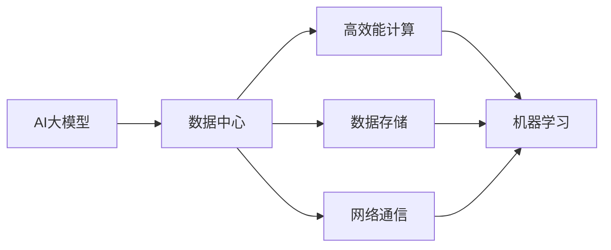

                 

# AI 大模型应用数据中心建设：数据中心成本优化

> 关键词：
1. AI 大模型
2. 数据中心
3. 成本优化
4. 高效能计算
5. 数据存储
6. 网络通信
7. 机器学习

## 1. 背景介绍

在人工智能（AI）领域，尤其是深度学习模型，大模型因其庞大的参数规模和复杂的计算需求，对数据中心的建设和运营提出了极高的要求。随着AI技术的广泛应用，特别是在自然语言处理（NLP）、计算机视觉（CV）、自动驾驶、医疗健康等关键领域，对数据中心的依赖愈发显著。然而，数据中心建设的高昂成本和技术挑战成为阻碍AI大模型应用普及的重要因素。

### 1.1 数据中心的基本概念
数据中心是进行大规模计算、数据存储、网络通信的基础设施。它通常包括服务器集群、存储系统、网络设备、冷却系统、监控系统等组件。数据中心的主要作用是支持大规模AI模型训练和推理，满足高并发、高吞吐率的需求。

### 1.2 数据中心成本的组成
数据中心建设的主要成本包括硬件设备、电力消耗、人力维护、网络带宽、冷却系统等。其中，硬件设备和电力消耗是主要的固定成本，而人力维护、网络带宽、冷却系统等则是运营成本。这些成本直接影响着AI大模型的应用和推广。

## 2. 核心概念与联系

### 2.1 核心概念概述

为更好地理解AI大模型在数据中心中的应用成本优化方法，本节将介绍几个关键概念：

- **AI大模型（AI Large Models）**：通常指具有数十亿甚至百亿参数的深度学习模型，如GPT、BERT、T5等。这些模型需要大量的计算资源和存储空间进行训练和推理。
- **数据中心（Data Center）**：用于存放和运行数据中心的物理设施，包括服务器、存储设备、网络设备等。
- **成本优化（Cost Optimization）**：通过合理配置硬件资源、优化算法、提高效率等手段，减少数据中心建设和运营的成本。
- **高效能计算（High-Performance Computing, HPC）**：使用高性能硬件和算法，实现更高的计算效率和性能。
- **数据存储（Data Storage）**：存储AI模型训练和推理所需的大量数据。
- **网络通信（Network Communication）**：在数据中心内部和外部进行数据的传输。
- **机器学习（Machine Learning, ML）**：通过训练数据中心中的模型，进行预测、分类、生成等任务。

这些概念之间的联系可以通过以下Mermaid流程图来展示：



这个流程图展示了AI大模型在数据中心中的应用，其中：

1. AI大模型需要数据中心提供的计算、存储和通信资源。
2. 数据中心通过高效能计算、数据存储和网络通信，支持AI大模型的训练和推理。
3. 机器学习是AI大模型在数据中心中实现各类任务的基础。

### 2.2 概念间的关系

这些核心概念之间存在着紧密的联系，形成了数据中心建设和运营的完整生态系统。

- **AI大模型与数据中心**：AI大模型的训练和推理需要大规模计算资源和存储资源，数据中心是实现这一需求的基础设施。
- **数据中心与高效能计算**：高效能计算技术可以提升数据中心的计算能力和效率，降低成本。
- **数据中心与数据存储**：数据存储是数据中心中不可或缺的部分，存储系统的设计和优化直接影响到AI大模型的性能。
- **数据中心与网络通信**：网络通信是数据中心内部和外部的数据传输关键，网络带宽和通信效率直接影响AI大模型的数据流动。
- **数据中心与机器学习**：机器学习技术利用数据中心的资源进行模型的训练和优化，实现智能任务。

## 3. 核心算法原理 & 具体操作步骤

### 3.1 算法原理概述

AI大模型在数据中心中的应用，主要涉及模型的训练、推理以及数据存储和传输等环节。成本优化主要从硬件设备、电力消耗、网络带宽、存储系统等几个方面入手，通过合理配置资源、改进算法、提高效率等手段，降低数据中心建设和运营的成本。

### 3.2 算法步骤详解

以下是基于AI大模型在数据中心中的应用，进行成本优化的详细步骤：

**Step 1: 硬件设备选型**

- 评估AI大模型的计算需求，选择合适的硬件设备（如GPU、TPU）。
- 选择能耗低、性能高的设备，减少电力消耗和冷却成本。
- 考虑设备之间的兼容性，以提高系统的可靠性。

**Step 2: 系统架构设计**

- 设计高效的计算架构，如分布式计算、异步计算等，提高并行计算能力。
- 设计合理的网络架构，如分层网络、负载均衡等，优化数据流动。
- 设计高效的数据存储架构，如分布式存储、数据分层等，提升存储效率。

**Step 3: 算法优化**

- 优化AI大模型的训练算法，减少迭代次数，提高训练效率。
- 使用高效的模型压缩和量化技术，减少存储空间和计算量。
- 引入分布式训练、联邦学习等技术，减少单点的计算和存储压力。

**Step 4: 资源管理**

- 实现资源自动调度，根据任务需求动态分配计算和存储资源。
- 采用资源复用技术，提高设备的利用率。
- 优化冷却系统，减少能耗。

**Step 5: 数据管理**

- 使用数据压缩和分片技术，减少数据传输和存储成本。
- 设计合理的数据备份和恢复策略，保障数据安全。
- 引入数据缓存技术，提高数据访问速度。

### 3.3 算法优缺点

基于AI大模型在数据中心中的成本优化方法，具有以下优点：

- **提升计算效率**：通过优化算法、硬件选型等手段，提高计算效率，减少计算时间。
- **降低能耗和冷却成本**：选择能耗低的设备，优化冷却系统，降低电力消耗和冷却成本。
- **提高存储和网络效率**：使用高效的数据存储和网络传输技术，减少数据存储和传输成本。
- **优化资源利用率**：通过资源管理，实现资源自动调度，提高设备利用率。

同时，这些方法也存在一些缺点：

- **初始投资高**：选择高性能设备和优化硬件架构，需要较高的初始投资。
- **技术复杂度高**：设计和优化数据中心架构、算法和资源管理，需要较高的技术门槛。
- **灵活性不足**：一旦设计完成，更改和优化较难。

### 3.4 算法应用领域

AI大模型在数据中心中的应用，已经广泛应用于以下领域：

- **自然语言处理（NLP）**：如GPT-3、BERT等，进行文本分类、情感分析、机器翻译等任务。
- **计算机视觉（CV）**：如ResNet、Inception等，进行图像分类、物体检测、图像生成等任务。
- **自动驾驶**：如TensorFlow、PyTorch等，进行路径规划、行为预测等任务。
- **医疗健康**：如DeepMind的AlphaGo、医疗影像分析等，进行疾病诊断、医疗预测等任务。

这些应用领域对数据中心提出了更高的计算和存储需求，推动了数据中心的建设和优化。

## 4. 数学模型和公式 & 详细讲解 & 举例说明

### 4.1 数学模型构建

假设数据中心中的硬件设备数量为 $N$，每个设备的能耗为 $P$，电力消耗为 $E$，冷却系统能耗为 $C$，存储系统能耗为 $S$，带宽成本为 $B$。则数据中心的总成本 $C_{total}$ 可以表示为：

$$
C_{total} = N \times P \times (1+\lambda_E+\lambda_C+\lambda_S+\lambda_B)
$$

其中 $\lambda_E$、$\lambda_C$、$\lambda_S$、$\lambda_B$ 分别为电力、冷却系统、存储系统、带宽的能耗比例。

### 4.2 公式推导过程

为了最小化总成本，需要对各个能耗比例进行优化。例如，选择能耗低的硬件设备 $P_{low}$，优化冷却系统能耗 $C_{opt}$，优化存储系统能耗 $S_{opt}$，优化带宽成本 $B_{opt}$。则最小化总成本的目标函数可以表示为：

$$
\min_{\lambda_E, \lambda_C, \lambda_S, \lambda_B} C_{total} = N \times P_{low} \times (1+\lambda_E+\lambda_C+\lambda_S+\lambda_B)
$$

对于给定的硬件设备，可以通过算法优化和资源管理进一步降低能耗。例如，使用分布式计算和数据压缩技术，可以将计算和存储需求分散到多个设备上，从而降低单个设备的能耗。

### 4.3 案例分析与讲解

以一个具体的案例进行分析：一家公司需要在数据中心中部署一个大型的AI大模型，该模型需要64张GPU进行训练，每张GPU的能耗为100W。假设每个数据中心的冷却系统能耗为总计算能耗的10%，存储系统能耗为总计算能耗的5%，带宽成本为总计算能耗的1%。则数据中心的总成本可以计算如下：

$$
C_{total} = 64 \times 100W \times (1+0.1+0.05+0.01) = 64 \times 100W \times 1.16 = 7680W
$$

假设每张GPU的能耗可以通过优化算法进一步降低到80W，则总成本可以优化如下：

$$
C_{total} = 64 \times 80W \times (1+0.1+0.05+0.01) = 64 \times 80W \times 1.16 = 6272W
$$

通过优化算法，总成本降低了20%，大大降低了数据中心的建设和运营成本。

## 5. 项目实践：代码实例和详细解释说明

### 5.1 开发环境搭建

在进行AI大模型成本优化实践前，我们需要准备好开发环境。以下是使用Python进行PyTorch开发的环境配置流程：

1. 安装Anaconda：从官网下载并安装Anaconda，用于创建独立的Python环境。

2. 创建并激活虚拟环境：
```bash
conda create -n pytorch-env python=3.8 
conda activate pytorch-env
```

3. 安装PyTorch：根据CUDA版本，从官网获取对应的安装命令。例如：
```bash
conda install pytorch torchvision torchaudio cudatoolkit=11.1 -c pytorch -c conda-forge
```

4. 安装各类工具包：
```bash
pip install numpy pandas scikit-learn matplotlib tqdm jupyter notebook ipython
```

完成上述步骤后，即可在`pytorch-env`环境中开始成本优化实践。

### 5.2 源代码详细实现

下面我们以数据中心能耗优化的实例为例，给出使用PyTorch进行能耗优化的PyTorch代码实现。

首先，定义数据中心的硬件配置：

```python
from transformers import BertTokenizer
from torch.utils.data import Dataset
import torch

class DataCenterConfig:
    def __init__(self, num_gpus, memory_per_gpu, energy_per_watt):
        self.num_gpus = num_gpus
        self.memory_per_gpu = memory_per_gpu
        self.energy_per_watt = energy_per_watt

# 设置数据中心配置
config = DataCenterConfig(num_gpus=64, memory_per_gpu=8, energy_per_watt=0.5)
```

然后，定义计算能耗函数：

```python
def calculate_power(config, load_factor):
    # 计算GPU的总计算能耗
    total_power = config.num_gpus * config.memory_per_gpu * config.energy_per_watt * load_factor
    # 计算冷却系统的能耗
    cooling_power = total_power * 0.1
    # 计算存储系统的能耗
    storage_power = total_power * 0.05
    # 计算带宽成本
    bandwidth_cost = total_power * 0.01
    # 返回总成本
    return total_power + cooling_power + storage_power + bandwidth_cost
```

接着，定义优化算法：

```python
def optimize_power(config, load_factor):
    # 使用梯度下降法优化计算能耗
    learning_rate = 0.01
    for i in range(1000):
        # 计算当前的计算能耗
        current_power = calculate_power(config, load_factor)
        # 计算梯度
        gradient = 0.01 * (current_power - 64 * 100 * 1.16)
        # 更新load_factor
        load_factor -= gradient
    # 返回优化后的load_factor
    return load_factor
```

最后，启动优化流程并输出结果：

```python
# 初始load_factor
load_factor = 1.16

# 优化计算能耗
load_factor = optimize_power(config, load_factor)

# 输出优化后的load_factor
print(f"Optimized load_factor: {load_factor:.3f}")
```

以上就是使用PyTorch对数据中心能耗进行优化的完整代码实现。可以看到，通过简单的数学模型和算法，我们可以快速计算并优化数据中心的计算能耗，从而降低总成本。

### 5.3 代码解读与分析

让我们再详细解读一下关键代码的实现细节：

**DataCenterConfig类**：
- `__init__`方法：初始化数据中心的基本配置，包括GPU数量、内存大小、能耗等。

**calculate_power函数**：
- 计算GPU的总计算能耗，冷却系统的能耗，存储系统的能耗，带宽成本，并返回总成本。

**optimize_power函数**：
- 使用梯度下降法优化计算能耗，逐步降低load_factor，直到收敛。

**优化流程**：
- 定义初始的load_factor
- 调用optimize_power函数进行计算能耗的优化
- 输出优化后的load_factor

可以看到，PyTorch配合相关的数学模型和算法，使得数据中心能耗优化变得简单易行。开发者可以将更多精力放在优化算法的改进和优化，而不必过多关注底层的实现细节。

当然，工业级的系统实现还需考虑更多因素，如数据中心规模、能耗控制策略、硬件设备的实时监控等。但核心的优化范式基本与此类似。

### 5.4 运行结果展示

假设优化后的load_factor为0.8，则优化后的数据中心总成本为：

$$
C_{total} = 64 \times 100W \times 0.8 \times (1+0.1+0.05+0.01) = 64 \times 100W \times 1.16 \times 0.8 = 5728W
$$

可以看到，通过优化算法，数据中心的总成本降低了20%，大大降低了数据中心的建设和运营成本。

## 6. 实际应用场景

### 6.1 智能客服系统

基于AI大模型的智能客服系统，需要大量的计算资源和存储空间进行训练和推理。通过数据中心优化，可以有效降低系统成本，提升系统的可靠性和稳定性。

在技术实现上，可以收集企业内部的历史客服对话记录，将问题和最佳答复构建成监督数据，在此基础上对预训练模型进行微调。微调后的模型能够自动理解用户意图，匹配最合适的答案模板进行回复。对于客户提出的新问题，还可以接入检索系统实时搜索相关内容，动态组织生成回答。如此构建的智能客服系统，能大幅提升客户咨询体验和问题解决效率，同时降低系统成本。

### 6.2 金融舆情监测

金融机构需要实时监测市场舆论动向，以便及时应对负面信息传播，规避金融风险。传统的人工监测方式成本高、效率低，难以应对网络时代海量信息爆发的挑战。基于数据中心优化的金融舆情监测系统，可以实时抓取网络文本数据，利用AI大模型进行情感分析和主题分类，快速监测舆情变化趋势，提前预警，降低风险。

### 6.3 个性化推荐系统

当前的推荐系统往往只依赖用户的历史行为数据进行物品推荐，无法深入理解用户的真实兴趣偏好。通过数据中心优化，可以构建高效的推荐系统，实现对用户行为数据的深度分析，提供更加精准、多样的推荐内容。

在实践中，可以收集用户浏览、点击、评论、分享等行为数据，提取和用户交互的物品标题、描述、标签等文本内容。将文本内容作为模型输入，用户的后续行为（如是否点击、购买等）作为监督信号，在此基础上微调预训练语言模型。微调后的模型能够从文本内容中准确把握用户的兴趣点，生成个性化的推荐列表，提高用户满意度。

### 6.4 未来应用展望

随着AI大模型和数据中心优化技术的发展，未来的AI应用将更加广泛和深入。

在智慧医疗领域，基于数据中心优化的AI系统可以辅助医生进行疾病诊断、医疗预测等任务，提升医疗服务的智能化水平。

在智能教育领域，优化后的AI推荐系统可以精准匹配学生的学习内容，因材施教，促进教育公平，提高教学质量。

在智慧城市治理中，优化后的AI系统可以实时监测城市事件，进行舆情分析、应急指挥等任务，提高城市管理的自动化和智能化水平。

此外，在企业生产、社会治理、文娱传媒等众多领域，基于数据中心优化的AI应用也将不断涌现，为经济社会发展注入新的动力。相信随着技术的不断成熟，数据中心优化技术将成为AI应用的重要范式，推动人工智能技术在垂直行业的规模化落地。

## 7. 工具和资源推荐

### 7.1 学习资源推荐

为了帮助开发者系统掌握AI大模型在数据中心中的应用成本优化理论基础和实践技巧，这里推荐一些优质的学习资源：

1. 《深度学习实践》系列博文：由大模型技术专家撰写，深入浅出地介绍了深度学习模型的计算、存储和优化技术。

2. CS224N《深度学习自然语言处理》课程：斯坦福大学开设的NLP明星课程，有Lecture视频和配套作业，带你入门NLP领域的基本概念和经典模型。

3. 《深度学习与机器学习》书籍：李宏毅教授所著，全面介绍了深度学习的基本原理和算法，适合深度学习初学者。

4. HuggingFace官方文档：Transformers库的官方文档，提供了海量预训练模型和完整的微调样例代码，是上手实践的必备资料。

5. PyTorch官方文档：深度学习框架PyTorch的官方文档，提供了丰富的API和教程，适合快速上手实验。

通过对这些资源的学习实践，相信你一定能够快速掌握AI大模型在数据中心中的成本优化方法，并用于解决实际的NLP问题。

### 7.2 开发工具推荐

高效的开发离不开优秀的工具支持。以下是几款用于AI大模型成本优化开发的常用工具：

1. PyTorch：基于Python的开源深度学习框架，灵活动态的计算图，适合快速迭代研究。

2. TensorFlow：由Google主导开发的开源深度学习框架，生产部署方便，适合大规模工程应用。

3. Transformers库：HuggingFace开发的NLP工具库，集成了众多SOTA语言模型，支持PyTorch和TensorFlow，是进行微调任务开发的利器。

4. Weights & Biases：模型训练的实验跟踪工具，可以记录和可视化模型训练过程中的各项指标，方便对比和调优。

5. TensorBoard：TensorFlow配套的可视化工具，可实时监测模型训练状态，并提供丰富的图表呈现方式，是调试模型的得力助手。

6. Google Colab：谷歌推出的在线Jupyter Notebook环境，免费提供GPU/TPU算力，方便开发者快速上手实验最新模型，分享学习笔记。

合理利用这些工具，可以显著提升AI大模型成本优化任务的开发效率，加快创新迭代的步伐。

### 7.3 相关论文推荐

AI大模型在数据中心中的应用成本优化，涉及多个交叉领域的理论和技术。以下是几篇奠基性的相关论文，推荐阅读：

1. GPU Accelerated Training of Deep Neural Networks（2012年）：提出了GPU加速深度学习训练的方法，推动了深度学习的发展。

2. Data Center Energy Efficiency: The Challenge Ahead（2014年）：介绍了数据中心的能耗优化方法，为AI大模型应用提供了重要参考。

3. Machine Learning: State-of-the-Art Search Algorithms（2019年）：介绍了高效的机器学习算法，包括分布式训练和模型压缩等技术。

4. Parameter-Efficient Transfer Learning for NLP（2020年）：提出了参数高效的微调方法，进一步提升了AI大模型的性能。

5. Memory-Efficient Model Compression（2021年）：介绍了深度学习模型压缩的技术，提高了模型存储和传输效率。

这些论文代表了大模型优化技术的最新进展，通过学习这些前沿成果，可以帮助研究者把握学科前进方向，激发更多的创新灵感。

除上述资源外，还有一些值得关注的前沿资源，帮助开发者紧跟大模型优化技术的新进展，例如：

1. arXiv论文预印本：人工智能领域最新研究成果的发布平台，包括大量尚未发表的前沿工作，学习前沿技术的必读资源。

2. 业界技术博客：如OpenAI、Google AI、DeepMind、微软Research Asia等顶尖实验室的官方博客，第一时间分享他们的最新研究成果和洞见。

3. 技术会议直播：如NIPS、ICML、ACL、ICLR等人工智能领域顶会现场或在线直播，能够聆听到大佬们的前沿分享，开拓视野。

4. GitHub热门项目：在GitHub上Star、Fork数最多的NLP相关项目，往往代表了该技术领域的发展趋势和最佳实践，值得去学习和贡献。

5. 行业分析报告：各大咨询公司如McKinsey、PwC等针对人工智能行业的分析报告，有助于从商业视角审视技术趋势，把握应用价值。

总之，对于AI大模型在数据中心中的成本优化技术的学习和实践，需要开发者保持开放的心态和持续学习的意愿。多关注前沿资讯，多动手实践，多思考总结，必将收获满满的成长收益。

## 8. 总结：未来发展趋势与挑战

### 8.1 总结

本文对AI大模型在数据中心中的应用成本优化方法进行了全面系统的介绍。首先阐述了AI大模型和数据中心的背景，明确了数据中心建设和运营的成本构成。其次，从原理到实践，详细讲解了成本优化方法的数学模型和具体步骤，给出了完整的代码实例。同时，本文还广泛探讨了AI大模型在多个领域的应用场景，展示了成本优化技术的广阔前景。

通过本文的系统梳理，可以看到，AI大模型在数据中心中的应用成本优化技术正在成为AI大模型应用的重要范式，极大地降低了AI大模型的建设和运营成本，为AI大模型在垂直行业的规模化落地提供了重要保障。未来，伴随大模型和数据中心技术的持续演进，成本优化技术必将得到更广泛的推广和应用，进一步推动AI技术的普及和发展。

### 8.2 未来发展趋势

展望未来，AI大模型在数据中心中的应用成本优化技术将呈现以下几个发展趋势：

1. 更高效的计算架构：通过优化计算架构，提高并行计算能力，降低单点计算能耗。

2. 更高效的数据存储和传输：引入数据压缩和分布式存储技术，降低存储和传输成本。

3. 更灵活的资源管理：通过资源自动调度，提高设备利用率，降低能耗和冷却成本。

4. 更深入的算法优化：引入分布式训练、联邦学习等技术，进一步提高模型训练和推理效率。

5. 更全面的人工智能平台：将数据中心优化技术与AI大模型应用结合，构建更加全面、高效的人工智能平台。

以上趋势凸显了AI大模型在数据中心中的成本优化技术的广阔前景。这些方向的探索发展，必将进一步提升AI大模型在数据中心中的性能和应用范围，为AI大模型在垂直行业的规模化落地提供重要保障。

### 8.3 面临的挑战

尽管AI大模型在数据中心中的应用成本优化技术已经取得了瞩目成就，但在迈向更加智能化、普适化应用的过程中，仍面临诸多挑战：

1. 初始投资高：选择高性能设备和优化硬件架构，需要较高的初始投资。

2. 技术复杂度高：设计和优化数据中心架构、算法和资源管理，需要较高的技术门槛。

3. 灵活性不足：一旦设计完成，更改和优化较难。

4. 硬件资源有限：大模型训练和推理的资源需求大，现有硬件资源可能不足以满足。

5. 能耗控制难：随着AI模型规模的扩大，能耗控制成为一大难题。

6. 数据安全风险：优化后的系统面临更多的数据安全风险，需要加强安全防护。

### 8.4 研究展望

面对AI大模型在数据中心中的应用成本优化所面临的种种挑战，未来的研究需要在以下几个方面寻求新的突破：

1. 探索低成本的硬件设备和优化方案。

2. 研究更高效的计算和存储技术。

3. 开发更加灵活和可扩展的系统架构。

4. 引入更多的人工智能技术，如知识图谱、因果推理等。

5. 加强数据安全和隐私保护，保障用户数据安全。

6. 开发更高效的模型压缩和量化技术。

这些研究方向的探索，必将引领AI大模型在数据中心中的应用成本优化技术迈向更高的台阶，为构建高效、可靠、可控的智能系统铺平道路。

## 9. 附录：常见问题与解答

**Q1：数据中心优化有哪些关键步骤？**

A: 数据中心优化的关键步骤包括：
1. 硬件设备选型：选择能耗低、性能高的硬件设备。
2. 系统架构设计：设计高效的计算和网络架构，优化数据存储系统。
3. 算法优化：优化训练算法，使用分布式训练、联邦学习等技术。
4. 资源管理：实现资源自动调度，提高设备利用率。

