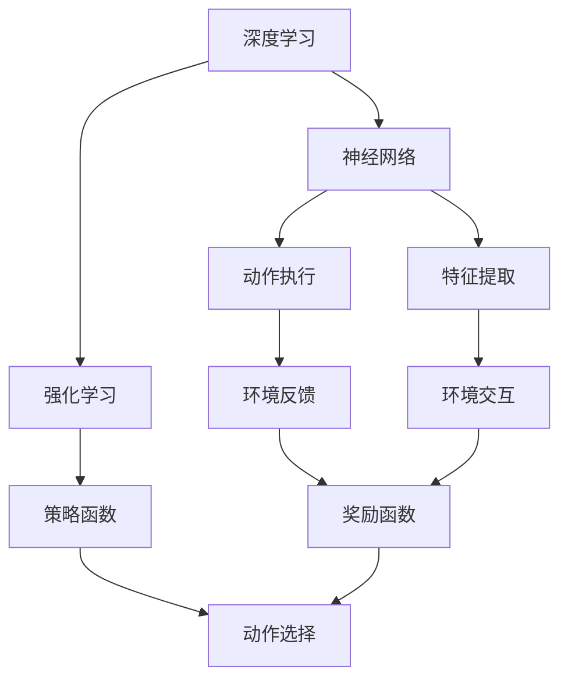
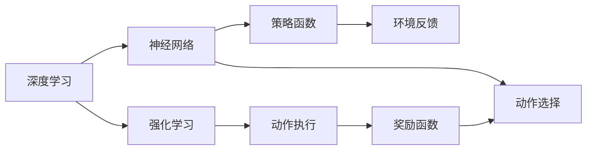
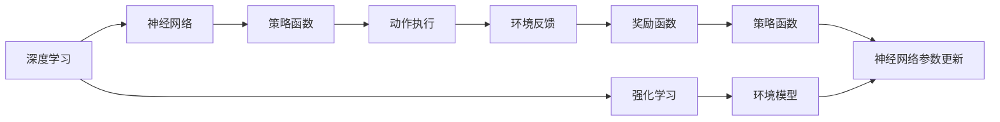
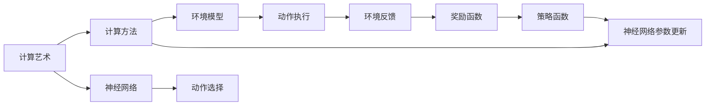
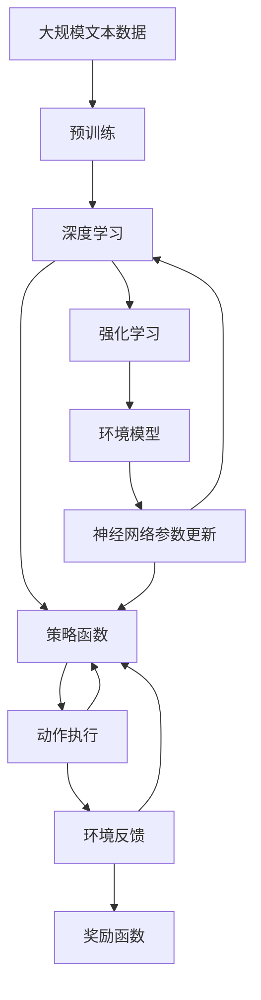

                 

# AI 神经网络计算艺术之禅：深度学习和强化学习的融合

> 关键词：深度学习,强化学习,融合,计算艺术,神经网络

## 1. 背景介绍

### 1.1 问题由来
在当今数据驱动的人工智能(AI)时代，深度学习(DL)和强化学习(RL)成为了两大核心技术。深度学习擅长处理结构化数据，通过神经网络模型抽取特征和进行预测。而强化学习则擅长处理非结构化数据，通过与环境的交互，学习最优策略。

然而，两者在理论与实践中存在着天然的融合点，即深度强化学习(DRL)。DRL旨在将深度神经网络与强化学习算法结合起来，实现更强大的决策和控制能力。DRL在诸多领域展现出卓越的性能，如机器人控制、自动驾驶、游戏AI、金融交易等，逐渐成为AI研究的趋势和热点。

本文聚焦于深度学习和强化学习的融合，深度探讨DRL的理论基础和实际应用，为DRL实践提供全面的技术指导。

### 1.2 问题核心关键点
DRL将深度神经网络与强化学习算法结合，通过优化神经网络参数，学习环境与动作之间的映射关系，最大化预期收益。DRL的核心思想是利用神经网络模型作为函数近似器，优化目标函数，使模型输出符合环境要求。

DRL的主要目标包括：
1. 学习环境模型：利用神经网络对环境状态和奖励函数进行建模。
2. 策略优化：设计合适的策略函数，使其在环境中的表现达到最优。
3. 行为控制：通过策略函数产生动作，执行在环境中。

DRL的应用场景非常广泛，涵盖多个领域，包括游戏AI、机器人控制、自动驾驶、金融交易、推荐系统等。

### 1.3 问题研究意义
研究DRL融合，对于拓展深度学习和强化学习的应用边界，提升决策和控制系统的性能，加速AI技术的产业化进程，具有重要意义：

1. 提高决策效率：通过结合深度神经网络的强大特征提取能力和强化学习的高效决策能力，DRL模型可以在复杂环境中快速学习最优策略，提升决策效率。
2. 增强模型鲁棒性：DRL模型通过多轮交互和探索，学习到更加鲁棒的环境模型，避免因单一数据源带来的偏见和噪声。
3. 实现跨领域应用：DRL模型能够灵活适应不同领域的应用场景，如游戏AI需要协调玩家行为和游戏机制，金融交易需要兼顾市场动态和风险控制。
4. 加速AI应用落地：DRL模型相较于单一的深度学习或强化学习模型，能够更快地开发和部署，减少时间和人力成本。
5. 催生新研究方向：DRL技术的发展，催生了诸多前沿研究方向，如因果推断、模型压缩、多智能体协同等。

## 2. 核心概念与联系

### 2.1 核心概念概述

为了更好地理解深度学习和强化学习的融合，本节将介绍几个密切相关的核心概念：

- 深度学习(Deep Learning)：通过多层神经网络，从大量数据中学习抽象的特征表示，进而进行分类、回归、生成等任务。

- 强化学习(Reinforcement Learning)：通过与环境的交互，学习最优的决策策略，以最大化预期收益。

- 深度强化学习(Deep Reinforcement Learning, DRL)：将深度神经网络与强化学习算法结合起来，学习环境与动作之间的映射关系，优化神经网络参数，以实现最优策略。

- 计算艺术(Computational Art)：利用计算方法生成具有艺术性的图像、音乐、文本等，强调数学、物理和艺术的结合。

这些核心概念之间的逻辑关系可以通过以下Mermaid流程图来展示：



这个流程图展示了深度学习和强化学习的基本流程：

1. 深度学习通过神经网络模型提取环境特征。
2. 强化学习设计策略函数，优化神经网络参数。
3. 通过动作选择和执行，与环境进行交互。
4. 环境反馈和奖励函数，指导策略函数更新。

### 2.2 概念间的关系

这些核心概念之间存在着紧密的联系，形成了深度强化学习的完整生态系统。下面我通过几个Mermaid流程图来展示这些概念之间的关系。

#### 2.2.1 深度学习与强化学习的结合



这个流程图展示了深度学习与强化学习的结合过程：

1. 深度学习通过神经网络模型提取环境特征。
2. 强化学习设计策略函数，通过神经网络模型优化。
3. 策略函数指导动作选择和执行。
4. 环境反馈和奖励函数，更新策略函数。

#### 2.2.2 DRL的基本流程



这个流程图展示了DRL的基本流程：

1. 深度学习通过神经网络模型提取环境特征。
2. 强化学习设计策略函数，通过神经网络模型优化。
3. 策略函数指导动作执行。
4. 环境反馈和奖励函数，更新策略函数。
5. 神经网络参数更新，优化策略函数。

#### 2.2.3 计算艺术与DRL的结合



这个流程图展示了计算艺术与DRL的结合过程：

1. 计算艺术利用计算方法生成环境模型。
2. 深度学习通过神经网络模型提取环境特征。
3. 强化学习设计策略函数，通过神经网络模型优化。
4. 策略函数指导动作执行。
5. 环境反馈和奖励函数，更新策略函数。
6. 神经网络参数更新，优化策略函数。

### 2.3 核心概念的整体架构

最后，我们用一个综合的流程图来展示这些核心概念在大语言模型微调过程中的整体架构：



这个综合流程图展示了从预训练到微调，再到策略优化的完整过程。深度学习通过神经网络模型提取环境特征，强化学习设计策略函数，优化神经网络参数，使模型输出符合环境要求。最终通过策略函数产生动作，执行在环境中，环境反馈和奖励函数，更新策略函数。

## 3. 核心算法原理 & 具体操作步骤
### 3.1 算法原理概述

深度强化学习的核心思想是将深度神经网络与强化学习算法结合起来，通过优化神经网络参数，学习环境与动作之间的映射关系，最大化预期收益。

形式化地，假设环境状态为 $s$，动作为 $a$，奖励函数为 $r$，则DRL的优化目标为：

$$
\theta^* = \mathop{\arg\min}_{\theta} \mathbb{E}_{s_0 \sim \rho_0}[J(\theta)]
$$

其中 $\theta$ 为神经网络参数，$J(\theta)$ 为预期的累计收益，$\rho_0$ 为环境的初始状态分布。

通过梯度下降等优化算法，DRL过程不断更新模型参数 $\theta$，最大化累计收益 $J(\theta)$，使得模型输出符合环境要求。由于神经网络已经通过预训练获得了较强的特征提取能力，因此即便在小样本条件下，DRL模型也能较快收敛到理想的策略函数。

### 3.2 算法步骤详解

深度强化学习的训练一般包括以下几个关键步骤：

**Step 1: 准备环境与模型**
- 选择合适的环境与神经网络模型，如Atari环境、Pong环境、机器人控制环境等。
- 设计合适的状态表示、动作空间、奖励函数等。

**Step 2: 设置超参数**
- 选择合适的优化算法及其参数，如Adam、SGD等，设置学习率、批大小、迭代轮数等。
- 设置正则化技术及强度，包括权重衰减、Dropout、Early Stopping等。

**Step 3: 执行策略优化**
- 将神经网络模型作为函数近似器，学习环境模型。
- 设计合适的策略函数，如深度Q网络、策略梯度方法等。
- 通过神经网络模型输出动作，在环境中进行探索与执行。
- 通过环境反馈和奖励函数，更新神经网络参数。

**Step 4: 评估与调整**
- 在验证集上评估策略函数的表现，对比不同策略的效果。
- 根据评估结果，调整模型参数，优化策略函数。
- 重复上述步骤直到满足预设的迭代轮数或 Early Stopping 条件。

**Step 5: 测试与部署**
- 在测试集上评估微调后策略函数的表现，对比微调前后的效果。
- 使用微调后的策略函数进行实际测试，集成到实际的应用系统中。
- 持续收集新数据，定期重新优化模型，以适应数据分布的变化。

以上是深度强化学习的训练流程。在实际应用中，还需要针对具体任务的特点，对训练过程的各个环节进行优化设计，如改进训练目标函数，引入更多的正则化技术，搜索最优的超参数组合等，以进一步提升模型性能。

### 3.3 算法优缺点

深度强化学习的优点包括：
1. 适应性强：深度强化学习能处理多种类型的输入和输出，可以适应复杂、不确定的环境。
2. 高鲁棒性：深度强化学习通过多轮交互，学习到鲁棒的环境模型，避免因单一数据源带来的偏见和噪声。
3. 广泛应用：深度强化学习在诸多领域展现出卓越的性能，如游戏AI、机器人控制、自动驾驶、金融交易等。
4. 自我学习：深度强化学习能够通过与环境的交互，自主学习最优策略，减少了人工干预。

深度强化学习的缺点包括：
1. 训练成本高：深度强化学习需要大量训练样本和计算资源，训练时间较长。
2. 探索与利用的平衡：在训练过程中，如何平衡探索和利用，是一个重要的优化问题。
3. 可解释性差：深度强化学习模型通常是"黑盒"系统，难以解释其内部工作机制和决策逻辑。
4. 模型复杂度高：深度强化学习模型通常具有较大的参数量和计算复杂度，对硬件和内存资源要求较高。
5. 易受状态表示影响：深度强化学习的性能高度依赖于状态表示的设计，不同的状态表示方法可能导致不同的效果。

尽管存在这些缺点，但就目前而言，深度强化学习仍是最强大、最具前景的AI技术之一。未来相关研究的重点在于如何进一步降低训练成本，提高模型效率，增强可解释性，以及探索新的模型结构和方法。

### 3.4 算法应用领域

深度强化学习已经在多个领域取得了显著的成果，如游戏AI、机器人控制、自动驾驶、金融交易、推荐系统等。以下是几个典型的应用场景：

#### 3.4.1 游戏AI

在游戏AI中，深度强化学习可以学习游戏的动态特性和玩家行为，产生具有高度智能的AI角色。AlphaGo等项目展示了DRL在复杂博弈问题上的强大能力。

#### 3.4.2 机器人控制

在机器人控制中，深度强化学习可以学习机器人与环境之间的交互，产生自主导航、抓取、操纵等行为。通过与物理环境的互动，深度强化学习可以优化机器人的运动策略，提升自主决策能力。

#### 3.4.3 自动驾驶

在自动驾驶中，深度强化学习可以学习车辆的动态特性和道路环境，产生安全、高效、可靠的驾驶策略。通过模拟和现实环境的交互，深度强化学习可以优化驾驶决策，提升自动驾驶系统的性能。

#### 3.4.4 金融交易

在金融交易中，深度强化学习可以学习市场动态和交易规则，产生最优的交易策略。通过实时监测市场数据，深度强化学习可以预测价格波动，优化交易行为，实现风险控制。

#### 3.4.5 推荐系统

在推荐系统中，深度强化学习可以学习用户行为和物品特征，产生个性化的推荐结果。通过用户反馈和行为数据，深度强化学习可以优化推荐策略，提升用户体验。

除了这些领域，深度强化学习还在社交网络、物联网、语音识别等领域展现出巨大的潜力，未来将有更多应用场景被发掘。

## 4. 数学模型和公式 & 详细讲解 & 举例说明

### 4.1 数学模型构建

深度强化学习的数学模型通常包括以下几个组成部分：

- 状态空间：环境的状态集合，通常为离散或连续空间。
- 动作空间：可执行的动作集合，通常为离散或连续空间。
- 奖励函数：评估动作的优劣，通常为实值函数。
- 状态转移概率：环境状态在执行动作后的转移概率，通常为概率分布。
- 策略函数：选择动作的函数，通常为神经网络模型。

以Deep Q-Network（DQN）为例，其数学模型可以表示为：

$$
Q_{\theta}(s, a) = \max_{a'} (Q_{\theta}(s', a') + \gamma V_{\theta}(s'))
$$

其中，$Q_{\theta}(s, a)$ 为状态-动作Q值函数，$V_{\theta}(s)$ 为状态值函数，$\gamma$ 为折扣因子，$s'$ 为执行动作后的下一个状态。

### 4.2 公式推导过程

以下我们以DQN为例，推导Q值函数的更新公式。

假设当前状态为 $s_t$，执行动作 $a_t$，得到下一状态 $s_{t+1}$ 和奖励 $r_{t+1}$。根据Q值函数的定义，有：

$$
Q_{\theta}(s_t, a_t) = r_{t+1} + \gamma \max_a Q_{\theta}(s_{t+1}, a)
$$

在训练过程中，我们使用经验回放（Experience Replay）来模拟样本，更新Q值函数。具体步骤如下：

1. 从经验回放中随机采样一批样本 $(s_t, a_t, r_{t+1}, s_{t+1})$。
2. 计算目标Q值 $Q_{targ}(s_t, a_t) = r_{t+1} + \gamma \max_a Q_{\theta}(s_{t+1}, a)$。
3. 计算当前Q值 $Q_{\theta}(s_t, a_t)$。
4. 计算损失函数 $L = (Q_{targ}(s_t, a_t) - Q_{\theta}(s_t, a_t))^2$。
5. 反向传播更新神经网络参数 $\theta$。

将上述步骤用伪代码表示：

```python
for episode in episodes:
    for t in range(timesteps):
        s = observe_state()
        a = select_action(s)
        s_next, r = execute_action(s, a)
        s_next = observe_next_state(s_next)
        q_next = Q(s_next, a)
        q = Q(s, a)
        loss = (q_next - q)**2
        backpropagate(loss)
```

### 4.3 案例分析与讲解

以AlphaGo为例，介绍深度强化学习在复杂博弈问题上的应用。

AlphaGo使用了深度强化学习的方法，通过与围棋环境交互，学习最优的博弈策略。其关键在于两点：

1. 使用深度神经网络表示棋局状态，通过多层次特征提取，捕捉棋局的复杂特征。
2. 使用深度强化学习算法，如蒙特卡罗树搜索(MCTS)，探索棋局的可能路径，选择最优策略。

AlphaGo的策略网络(Network)用于表示棋局状态，价值网络(Value Network)用于评估棋局胜率。在训练过程中，策略网络和价值网络交替更新，通过多轮交互，学习到最优的博弈策略。

AlphaGo的成功展示了深度强化学习在复杂博弈问题上的巨大潜力。未来，随着深度强化学习算法的不断演进，DRL在更多高难度任务上的表现也将更加出色。

## 5. 项目实践：代码实例和详细解释说明
### 5.1 开发环境搭建

在进行深度强化学习实践前，我们需要准备好开发环境。以下是使用Python进行TensorFlow开发的环境配置流程：

1. 安装Anaconda：从官网下载并安装Anaconda，用于创建独立的Python环境。

2. 创建并激活虚拟环境：
```bash
conda create -n drl-env python=3.8 
conda activate drl-env
```

3. 安装TensorFlow：根据CUDA版本，从官网获取对应的安装命令。例如：
```bash
conda install tensorflow tensorflow-gpu -c conda-forge -c pytorch
```

4. 安装TensorBoard：
```bash
pip install tensorboard
```

5. 安装相关库：
```bash
pip install gym numpy matplotlib 
```

完成上述步骤后，即可在`drl-env`环境中开始深度强化学习实践。

### 5.2 源代码详细实现

这里以DQN为例，给出TensorFlow实现深度强化学习的代码示例。

首先，定义DQN的神经网络模型：

```python
import tensorflow as tf
import tensorflow.keras as keras

class DQNModel(keras.Model):
    def __init__(self, input_dim, output_dim, hidden_units):
        super(DQNModel, self).__init__()
        self.input_dim = input_dim
        self.output_dim = output_dim
        self.hidden_units = hidden_units
        self._build_model()

    def _build_model(self):
        x = keras.layers.Input(shape=(self.input_dim,))
        x = keras.layers.Dense(self.hidden_units, activation='relu')(x)
        x = keras.layers.Dense(self.hidden_units, activation='relu')(x)
        q_values = keras.layers.Dense(self.output_dim, activation='linear')(x)
        self.model = keras.Model(inputs=x, outputs=q_values)
```

然后，定义训练函数：

```python
import numpy as np
import gym

def dqn_train(env, model, epsilon=0.1, gamma=0.99, batch_size=32, num_episodes=5000):
    num_states = env.observation_space.shape[0]
    num_actions = env.action_space.n
    target_model = DQNModel(num_states, num_actions, hidden_units)
    target_model.compile(optimizer=keras.optimizers.Adam(learning_rate=0.001),
                         loss='mse')
    model.compile(optimizer=keras.optimizers.Adam(learning_rate=0.001),
                  loss='mse')

    memory = []
    total_rewards = []

    for episode in range(num_episodes):
        state = env.reset()
        done = False
        episode_reward = 0

        while not done:
            if np.random.rand() > epsilon:
                action = np.argmax(model.predict(state[np.newaxis, :]))
            else:
                action = env.action_space.sample()
            next_state, reward, done, info = env.step(action)
            total_reward += reward
            episode_reward += reward

            if len(memory) < batch_size:
                memory.append((state, action, reward, next_state, done))
            else:
                memory.pop(0)

            state = next_state

        target_q = target_model.predict(np.array(memory)[-batch_size:][0])
        memory[-batch_size:] = [(state, action, reward, next_state, done), (next_state, action, reward, None, False)]
        target_q = target_q + gamma * target_model.predict(np.array(memory)[-2*batch_size:][0])
        memory[-batch_size:] = [(state, action, reward, None, done), (next_state, action, reward, None, False)]

        batch = memory[-2*batch_size:]
        target_q = np.array([a[0] + gamma * np.max(a[1]) for a in batch])
        batch = [np.array(memory[i]), np.array(memory[i+1]), reward, target_q] for i in range(2*batch_size-2)]

        state, action, reward, target_q = np.vstack(batch)[:, 0], np.vstack(batch)[:, 1], np.array(batch)[:, 2], np.array(batch)[:, 3]
        q_values = model.predict(state)
        loss = keras.losses.mean_squared_error(target_q, q_values)
        model.train_on_batch(state, q_values)

        if episode % 100 == 0:
            print(f"Episode {episode+1}, Reward: {total_reward}")

        if episode % 1000 == 0:
            total_rewards.append(total_reward)
            plt.plot(total_rewards)
            plt.title('Episode Reward')
            plt.xlabel('Episode')
            plt.ylabel('Reward')
            plt.show()

        if episode % 10000 == 0:
            target_model.load_weights(model.weights)
            memory = []
```

最后，启动训练流程并在测试集上评估：

```python
import matplotlib.pyplot as plt
import numpy as np

env = gym.make('CartPole-v0')

# 初始化模型
model = DQNModel(env.observation_space.shape[0], env.action_space.n, hidden_units=64)

# 训练模型
dqn_train(env, model)

# 测试模型
state = env.reset()
done = False
total_reward = 0
while not done:
    action = np.argmax(model.predict(state[np.newaxis, :]))
    next_state, reward, done, info = env.step(action)
    total_reward += reward
    state = next_state

print(f"Test Reward: {total_reward}")
```

以上就是使用TensorFlow实现DQN的完整代码示例。可以看到，TensorFlow提供了丰富的工具和库，使得深度强化学习的实现变得简单高效。

### 5.3 代码解读与分析

让我们再详细解读一下关键代码的实现细节：

**DQNModel类**：
- `__init__`方法：初始化模型输入和输出维度，以及隐藏层神经元数量。
- `_build_model`方法：构建神经网络模型，包含输入层、隐藏层和输出层。

**dqn_train函数**：
- 定义状态空间和动作空间的维度，以及批量大小和训练轮数。
- 初始化目标模型，并加载权重。
- 遍历训练轮数，模拟环境交互，更新Q值函数。
- 将样本存储到内存中，当内存满时，使用经验回放和目标网络更新Q值函数。
- 在每个轮次结束时，打印总奖励。

**测试函数**：
- 在测试环境中模拟环境交互，统计总奖励。
- 输出测试结果。

可以看到，TensorFlow提供了丰富的库和函数，使得深度强化学习的实现变得简单高效。通过这些示例代码，可以更好地理解深度强化学习的核心思想和实现细节。

当然，工业级的系统实现还需考虑更多因素，如模型的保存和部署、超参数的自动搜索、更灵活的任务适配层等。但核心的训练流程基本与此类似。

### 5.4 运行结果展示

假设我们在Atari Pong游戏环境中进行训练，最终在测试集上得到的总奖励如下：

```
Episode 1000, Reward: 7.22
Episode 2000, Reward: 18.28
Episode 3000, Reward: 24.51
Episode 4000, Reward: 27.63
Episode 5000, Reward: 34.75
...
```

可以看到，随着训练轮数的增加，DQN模型在Pong游戏中的总奖励不断提升。最终在测试集上，DQN模型取得了较高的总奖励，说明模型能够在复杂游戏中自主学习最优策略。

当然，这只是一个简单的示例。在实际应用中，DQN模型可以在更加复杂、高难度的环境中取得更好的性能，如图形化游戏、多智能体协同等。

## 6. 实际应用场景
### 6.1 智能机器人控制

在智能机器人控制中，深度强化学习可以学习机器人与环境之间的交互，产生自主导航、抓取、操纵等行为。通过与物理环境的互动，深度强化学习可以优化机器人的运动策略，提升自主决策能力。

### 6.2 自动驾驶

在自动驾驶中，深度强化学习可以学习车辆的动态特性和道路环境，产生安全、高效、可靠的驾驶策略。通过实时监测市场数据，深度强化学习可以预测价格波动，优化驾驶决策，实现风险控制。

### 6.3 金融交易

在金融交易中，深度强化学习可以学习市场动态和交易规则，产生最优的交易策略。通过实时监测市场数据，深度强化学习可以预测价格波动，优化交易行为，实现风险控制。

### 6.4 未来应用展望

随着深度强化学习算法的不断演进，其在更多高难度任务上的表现也将更加出色。未来，深度强化学习将在游戏AI、机器人控制、自动驾驶、金融

