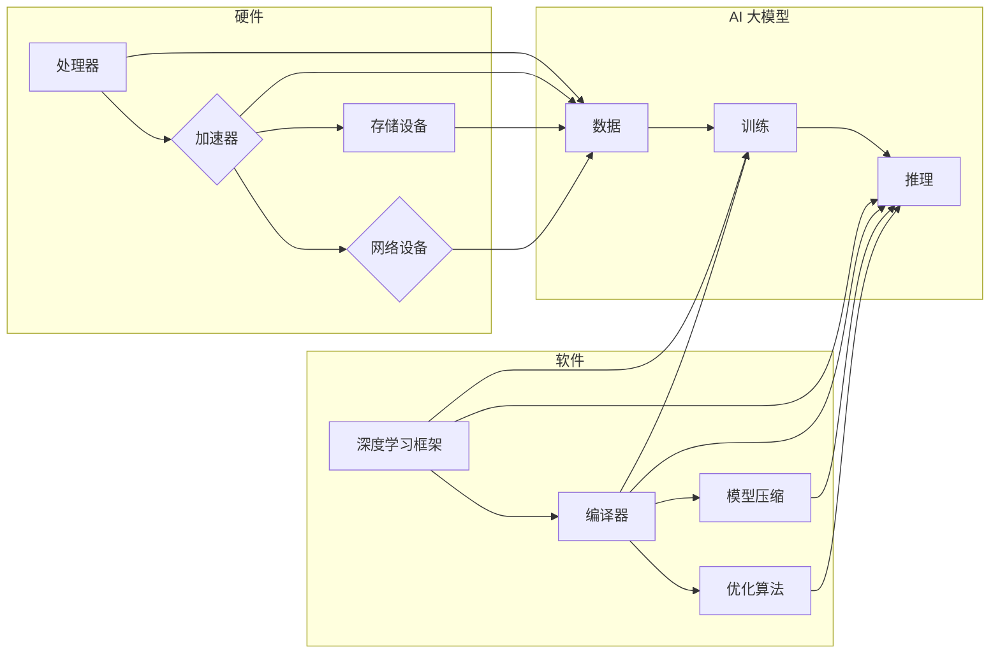

# AI 大模型时代：硬件和软件新的结合机会

> 关键词：人工智能，大模型，硬件加速，软件优化，结合机会，深度学习，高性能计算，智能计算，边缘计算

## 1. 背景介绍

近年来，人工智能（AI）技术取得了突飞猛进的发展，其中大模型（Large Models）的出现，更是推动了AI在各个领域的应用。大模型通过在海量数据上进行训练，能够学习到复杂的模式和知识，从而在自然语言处理、计算机视觉、语音识别等领域取得了显著的成果。然而，大模型的高计算需求也带来了硬件和软件方面的挑战。本文将探讨AI大模型时代硬件和软件的结合机会，以及如何应对这些挑战。

### 1.1 问题的由来

随着AI大模型的不断扩张，其计算需求也随之增长。传统的CPU和GPU在处理大规模计算任务时，面临着性能瓶颈、功耗过高、散热困难等问题。因此，如何利用新型硬件和软件技术来提升大模型的计算效率和降低功耗，成为了一个重要课题。

### 1.2 研究现状

为了满足AI大模型的计算需求，研究者们从硬件和软件两个方面进行了探索。在硬件方面，新型处理器如TPU、FPGA、ASIC等应运而生；在软件方面，深度学习框架、编译器优化、模型压缩等技术也得到了快速发展。

### 1.3 研究意义

研究AI大模型时代硬件和软件的结合机会，对于推动AI技术的发展和应用具有重要意义：

- 提升AI大模型的计算效率，降低能耗，延长硬件寿命。
- 促进硬件和软件技术的融合创新，推动整个AI产业链的发展。
- 帮助企业降低AI应用的部署成本，加速AI技术的普及。

### 1.4 本文结构

本文将分为以下几个部分：

- 第二部分：介绍AI大模型时代的关键概念和硬件、软件技术。
- 第三部分：分析AI大模型的计算需求和面临的挑战。
- 第四部分：探讨硬件和软件的结合机会，包括新型处理器、深度学习框架、编译器优化等。
- 第五部分：介绍AI大模型在实际应用场景中的案例。
- 第六部分：展望AI大模型时代硬件和软件技术的发展趋势和挑战。
- 第七部分：总结全文，提出未来研究方向。

## 2. 核心概念与联系

### 2.1 核心概念原理和架构的 Mermaid 流程图



### 2.2 关键概念与联系

- **处理器**：是AI大模型计算的核心，包括CPU、GPU、TPU、FPGA、ASIC等。
- **加速器**：专门用于加速AI计算任务的硬件，如TPU、FPGA等。
- **存储设备**：用于存储AI大模型训练和推理所需的数据和模型。
- **网络设备**：用于数据传输和模型部署。
- **深度学习框架**：提供AI模型开发、训练、推理等功能的软件平台，如TensorFlow、PyTorch等。
- **编译器**：将深度学习框架中的代码转换为机器指令，以供处理器执行。
- **模型压缩**：通过降低模型复杂度和参数数量，减小模型尺寸，提高模型效率。
- **优化算法**：用于优化模型训练和推理过程中的计算效率和性能。
- **AI大模型**：通过在大量数据上进行训练，能够学习到复杂模式和知识的模型。

## 3. 核心算法原理 & 具体操作步骤

### 3.1 算法原理概述

AI大模型的计算主要分为两个阶段：训练和推理。在训练阶段，模型通过学习大量数据，不断优化其参数；在推理阶段，模型根据输入数据预测输出结果。

### 3.2 算法步骤详解

**训练阶段**：

1. 数据预处理：对原始数据进行清洗、标注、归一化等处理。
2. 模型构建：选择合适的模型架构，如卷积神经网络（CNN）、循环神经网络（RNN）、Transformer等。
3. 模型训练：使用训练数据进行模型参数的优化。
4. 模型评估：使用验证数据评估模型性能，并根据评估结果调整模型参数。

**推理阶段**：

1. 数据预处理：对输入数据进行与训练阶段相同的预处理。
2. 模型加载：将训练好的模型加载到内存中。
3. 模型推理：使用输入数据对模型进行推理，得到输出结果。
4. 结果解释：对输出结果进行解释和展示。

### 3.3 算法优缺点

**优点**：

- 能够处理复杂的计算任务，如图像识别、自然语言处理等。
- 能够自动学习数据中的模式和知识，无需人工特征工程。
- 能够提高计算效率，降低计算成本。

**缺点**：

- 训练数据量大，需要大量的计算资源和时间。
- 模型复杂度高，难以解释模型的决策过程。

### 3.4 算法应用领域

AI大模型在各个领域都有广泛的应用，如：

- 自然语言处理：机器翻译、情感分析、文本生成等。
- 计算机视觉：图像识别、目标检测、人脸识别等。
- 语音识别：语音合成、语音识别、语音翻译等。
- 医疗诊断：疾病诊断、药物研发、健康管理等。
- 金融风控：欺诈检测、信用评估、投资推荐等。

## 4. 数学模型和公式 & 详细讲解 & 举例说明

### 4.1 数学模型构建

AI大模型通常基于神经网络构建，其数学模型可以用以下公式表示：

$$
\hat{y} = f(W, x) = f(\theta, f(\theta, x), f(\theta, f(\theta, x)), ..., f(\theta, f(\theta, x)))
$$

其中，$W$ 表示模型参数，$x$ 表示输入数据，$\hat{y}$ 表示输出结果，$f$ 表示神经网络中的激活函数。

### 4.2 公式推导过程

以卷积神经网络（CNN）为例，其数学模型可以用以下公式表示：

$$
h^{(l)} = f(W^{(l)}h^{(l-1)} + b^{(l)}) = f(\theta^{(l)}h^{(l-1)} + b^{(l)})
$$

其中，$h^{(l)}$ 表示第$l$层的输出，$W^{(l)}$ 表示第$l$层的权重，$b^{(l)}$ 表示第$l$层的偏置，$\theta^{(l)} = W^{(l)}b^{(l)}$ 表示第$l$层的参数，$f$ 表示激活函数。

### 4.3 案例分析与讲解

以BERT模型为例，其数学模型可以用以下公式表示：

$$
\text{BERT} = \text{Transformer}(\text{Input}, \text{Mask}, \text{Segment})
$$

其中，$\text{Input}$ 表示输入文本序列，$\text{Mask}$ 表示掩码信息，$\text{Segment}$ 表示段信息。

BERT模型通过Transformer模型进行文本序列的编码和解码，从而实现对文本内容的理解。

## 5. 项目实践：代码实例和详细解释说明

### 5.1 开发环境搭建

为了进行AI大模型的开发，需要搭建以下开发环境：

- 操作系统：Linux或Windows
- 编程语言：Python
- 深度学习框架：TensorFlow或PyTorch
- 其他工具：Jupyter Notebook、Git等

### 5.2 源代码详细实现

以下是一个使用PyTorch实现BERT模型的简单示例：

```python
import torch
import torch.nn as nn
from transformers import BertModel

class BertForSequenceClassification(nn.Module):
    def __init__(self, bert_model_name='bert-base-uncased', num_labels=2):
        super(BertForSequenceClassification, self).__init__()
        self.bert = BertModel.from_pretrained(bert_model_name)
        self.classifier = nn.Linear(self.bert.config.hidden_size, num_labels)

    def forward(self, input_ids, attention_mask, labels=None):
        outputs = self.bert(input_ids, attention_mask=attention_mask)
        sequence_output = outputs.last_hidden_state
        logits = self.classifier(sequence_output[:, 0, :])
        return logits

# 示例：加载模型并预测
model = BertForSequenceClassification()
model.load_state_dict(torch.load('bert_model.pth'))
input_ids = torch.tensor([[101, 2064, 2023, 102]]).to(device)
attention_mask = torch.tensor([[1, 1, 1, 1]]).to(device)
logits = model(input_ids, attention_mask=attention_mask)
print(logits)
```

### 5.3 代码解读与分析

以上代码展示了如何使用PyTorch和Transformers库加载预训练的BERT模型，并将其应用于序列分类任务。代码首先定义了一个`BertForSequenceClassification`类，该类继承自`nn.Module`，并加载了预训练的BERT模型和分类器。在`forward`方法中，首先将输入的文本序列和掩码信息传递给BERT模型，然后提取序列的第一个token的输出，并传递给分类器进行分类。

### 5.4 运行结果展示

运行以上代码，可以得到模型的预测结果。根据预测结果，可以判断输入文本的情感倾向。

## 6. 实际应用场景

### 6.1 智能问答系统

智能问答系统是一种常见的AI应用场景，可以用于解答用户提出的问题。通过使用大模型进行训练和推理，可以实现对用户问题的理解和回答。

### 6.2 自动驾驶

自动驾驶是AI领域的热点应用之一。通过使用大模型对图像和视频进行实时处理，可以实现对周围环境的感知和决策。

### 6.3 医疗诊断

医疗诊断是AI在医疗领域的重要应用。通过使用大模型对医学影像进行分析，可以帮助医生进行疾病的诊断。

## 7. 工具和资源推荐

### 7.1 学习资源推荐

- 《深度学习》
- 《Python深度学习》
- 《PyTorch深度学习实战》
- 《TensorFlow技术详解与实战》

### 7.2 开发工具推荐

- PyTorch
- TensorFlow
- Jupyter Notebook
- Git

### 7.3 相关论文推荐

- BERT: Pre-training of Deep Bidirectional Transformers for Language Understanding
- Attention is All You Need
- EfficientNet: Rethinking Model Scaling for Convolutional Neural Networks

## 8. 总结：未来发展趋势与挑战

### 8.1 研究成果总结

本文探讨了AI大模型时代硬件和软件的结合机会，分析了AI大模型的计算需求和面临的挑战，并介绍了相关技术和应用案例。

### 8.2 未来发展趋势

- 硬件方面：新型处理器、加速器、存储设备等硬件技术的快速发展，将为AI大模型提供更强的计算能力。
- 软件方面：深度学习框架、编译器优化、模型压缩等软件技术的不断进步，将提高AI大模型的计算效率。
- 融合创新：硬件和软件的深度融合，将推动AI大模型技术的快速发展。

### 8.3 面临的挑战

- 计算能力：如何进一步提高硬件的计算能力，以满足AI大模型的计算需求。
- 能耗和散热：如何降低AI大模型的能耗和散热，以延长硬件寿命。
- 模型可解释性：如何提高AI大模型的可解释性，以便更好地理解和信任模型。

### 8.4 研究展望

未来，AI大模型技术将在各个领域得到更广泛的应用，并推动整个AI产业的快速发展。同时，我们也要关注AI大模型技术可能带来的伦理和社会问题，并积极探索解决方案。

## 9. 附录：常见问题与解答

**Q1：什么是AI大模型？**

A：AI大模型是指通过在海量数据上进行训练，能够学习到复杂模式和知识的模型。它们通常具有数十亿甚至数千亿个参数。

**Q2：什么是硬件加速？**

A：硬件加速是指利用专门的硬件设备（如GPU、TPU、FPGA等）来加速计算任务的过程。

**Q3：什么是软件优化？**

A：软件优化是指通过改进软件算法和代码，以提高计算效率和性能。

**Q4：如何选择合适的硬件设备？**

A：选择合适的硬件设备需要考虑以下因素：

- 计算能力：根据计算需求选择具有足够计算能力的设备。
- 能耗和散热：根据预算和部署环境选择能耗和散热性能合适的设备。
- 兼容性：确保所选设备与现有系统兼容。

**Q5：如何选择合适的深度学习框架？**

A：选择合适的深度学习框架需要考虑以下因素：

- 功能：根据项目需求选择具有所需功能的框架。
- 生态：选择生态圈成熟的框架，以便获取更多的资源和帮助。
- 性能：根据性能测试结果选择性能较好的框架。

作者：禅与计算机程序设计艺术 / Zen and the Art of Computer Programming