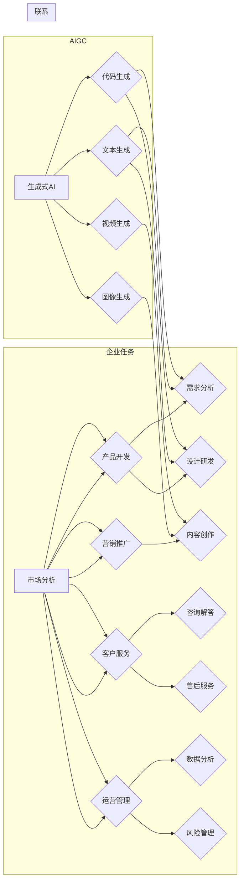

# AIGC与企业任务的细化

> 关键词：AIGC, 生成式AI, 企业任务, 细化, 工作流自动化, 知识工程, RPA, 个性化服务

## 1. 背景介绍

随着人工智能（AI）技术的飞速发展，生成式AI（AIGC，Artificial Intelligence Generated Content）已成为推动企业数字化转型的重要力量。AIGC能够自动生成文本、图像、视频等内容，极大地提高了内容生产的效率和质量。然而，如何将AIGC技术应用于企业具体任务，实现精细化管理，提升企业竞争力，成为当前企业数字化转型中的关键问题。

### 1.1 问题的由来

传统企业工作流程往往存在以下问题：

- **重复性任务多**：大量的数据处理、信息检索、内容生成等任务需要人工操作，效率低下。
- **知识积累分散**：企业内部知识积累分散，难以快速检索和应用。
- **个性化服务不足**：难以满足客户个性化的需求。
- **创新性不足**：缺乏创新思维和解决方案，难以适应市场变化。

AIGC技术的出现，为企业带来了以下机遇：

- **提高效率**：自动完成重复性任务，释放人力资源。
- **知识整合**：将分散的知识进行整合，提升决策效率。
- **个性化服务**：基于客户需求生成个性化内容，提升客户满意度。
- **创新驱动**：激发创新思维，为企业发展提供新的动力。

### 1.2 研究现状

目前，AIGC技术在企业中的应用主要集中在以下几个方面：

- **文本生成**：如自动生成新闻报道、产品说明、营销文案等。
- **图像生成**：如自动生成产品图片、广告图片、UI设计等。
- **视频生成**：如自动生成视频教程、广告视频、虚拟现实场景等。
- **代码生成**：如自动生成代码模板、测试用例等。

然而，如何将AIGC技术与企业具体任务相结合，实现精细化管理和提升效率，仍是一个亟待解决的问题。

### 1.3 研究意义

研究AIGC与企业任务的细化，对于推动企业数字化转型、提升企业竞争力具有重要意义：

- **提高效率**：实现企业任务自动化，降低人力成本。
- **优化流程**：优化企业工作流程，提高工作效率。
- **增强决策能力**：提供数据分析和可视化工具，辅助企业决策。
- **提升客户满意度**：提供个性化服务，提升客户满意度。
- **促进创新**：激发创新思维，推动企业持续发展。

## 2. 核心概念与联系

### 2.1 核心概念原理和架构的 Mermaid 流程图



如图所示，AIGC技术可以应用于企业多个领域，与企业任务之间存在着紧密的联系。例如，文本生成可以应用于产品说明、营销文案、客户服务等领域；图像生成可以应用于产品图片、广告图片、UI设计等领域；视频生成可以应用于视频教程、广告视频、虚拟现实场景等领域；代码生成可以应用于代码模板、测试用例等领域。

## 3. 核心算法原理 & 具体操作步骤

### 3.1 算法原理概述

AIGC技术主要基于以下算法原理：

- **自然语言处理（NLP）**：通过对大量文本数据进行分析，学习语言规律和语义表示。
- **计算机视觉（CV）**：通过对大量图像和视频数据进行分析，学习图像和视频的视觉特征。
- **机器学习（ML）**：通过学习数据，建立模型，实现预测和生成。
- **深度学习（DL）**：通过神经网络结构，实现复杂的数据建模和特征提取。

具体操作步骤如下：

1. **数据收集与预处理**：收集相关领域的文本、图像、视频等数据，并进行清洗、标注、归一化等预处理。
2. **模型选择与训练**：根据任务需求，选择合适的模型，并使用预处理后的数据对其进行训练。
3. **模型评估与优化**：评估模型性能，并根据评估结果对模型进行优化。
4. **模型部署与应用**：将训练好的模型部署到实际应用中，并收集用户反馈，不断优化模型。

### 3.2 算法步骤详解

#### 3.2.1 文本生成

1. **数据收集与预处理**：收集相关领域的文本数据，并进行清洗、标注、归一化等预处理。
2. **模型选择与训练**：选择合适的文本生成模型，如GPT、BERT等，并使用预处理后的数据对其进行训练。
3. **模型评估与优化**：评估模型性能，并根据评估结果对模型进行优化。
4. **模型部署与应用**：将训练好的模型部署到实际应用中，如自动生成新闻报道、产品说明、营销文案等。

#### 3.2.2 图像生成

1. **数据收集与预处理**：收集相关领域的图像数据，并进行清洗、标注、归一化等预处理。
2. **模型选择与训练**：选择合适的图像生成模型，如GAN、StyleGAN等，并使用预处理后的数据对其进行训练。
3. **模型评估与优化**：评估模型性能，并根据评估结果对模型进行优化。
4. **模型部署与应用**：将训练好的模型部署到实际应用中，如自动生成产品图片、广告图片、UI设计等。

#### 3.2.3 视频生成

1. **数据收集与预处理**：收集相关领域的视频数据，并进行清洗、标注、归一化等预处理。
2. **模型选择与训练**：选择合适的视频生成模型，如VideoGPT、StyleGAN等，并使用预处理后的数据对其进行训练。
3. **模型评估与优化**：评估模型性能，并根据评估结果对模型进行优化。
4. **模型部署与应用**：将训练好的模型部署到实际应用中，如自动生成视频教程、广告视频、虚拟现实场景等。

#### 3.2.4 代码生成

1. **数据收集与预处理**：收集相关领域的代码数据，并进行清洗、标注、归一化等预处理。
2. **模型选择与训练**：选择合适的代码生成模型，如Seq2Seq、CodeGAN等，并使用预处理后的数据对其进行训练。
3. **模型评估与优化**：评估模型性能，并根据评估结果对模型进行优化。
4. **模型部署与应用**：将训练好的模型部署到实际应用中，如自动生成代码模板、测试用例等。

### 3.3 算法优缺点

#### 3.3.1 优点

- **效率高**：自动完成重复性任务，提高工作效率。
- **质量好**：基于大量数据进行训练，生成的内容质量较高。
- **个性化**：可以根据用户需求生成个性化内容。

#### 3.3.2 缺点

- **成本高**：需要大量的计算资源进行模型训练。
- **数据依赖**：需要大量高质量的数据进行模型训练。
- **可解释性差**：生成的结果难以解释。

### 3.4 算法应用领域

AIGC技术在企业中的应用领域广泛，以下列举一些典型的应用场景：

- **市场分析**：自动生成市场分析报告、行业趋势分析等。
- **产品开发**：自动生成产品设计文档、开发文档等。
- **营销推广**：自动生成营销文案、广告图片、视频等。
- **客户服务**：自动生成咨询解答、售后服务文案等。
- **运营管理**：自动生成数据分析报告、风险管理报告等。

## 4. 数学模型和公式 & 详细讲解 & 举例说明

### 4.1 数学模型构建

AIGC技术涉及到的数学模型主要包括以下几种：

- **概率模型**：如隐马尔可夫模型（HMM）、条件随机场（CRF）等。
- **神经网络模型**：如循环神经网络（RNN）、卷积神经网络（CNN）、Transformer等。
- **生成对抗网络（GAN）**：由生成器和判别器组成，生成器生成数据，判别器判断数据的真伪。

### 4.2 公式推导过程

以下以GPT模型的公式推导为例：

1. **输入序列**：假设输入序列为 $x_1, x_2, \ldots, x_T$，其中 $x_t \in V$，$V$ 为词汇表。
2. **隐藏状态**：假设隐藏状态为 $h_t \in \mathbb{R}^{d_h}$，其中 $d_h$ 为隐藏层维度。
3. **输出概率**：假设输出概率为 $p(y_t | x_1, \ldots, x_t)$，其中 $y_t \in V$。

GPT模型使用双向Transformer结构，其注意力机制的计算公式如下：

$$
\mathbf{W}_Q = \mathbf{W}_k \mathbf{W}_v \mathbf{W}_o \mathbf{W}_p
$$

其中：

- $\mathbf{W}_Q, \mathbf{W}_k, \mathbf{W}_v, \mathbf{W}_o, \mathbf{W}_p$ 为权重矩阵。
- $\mathbf{Q}, \mathbf{K}, \mathbf{V}$ 分别为查询向量、键向量和值向量。

### 4.3 案例分析与讲解

以下以一个简单的文本生成任务为例，讲解AIGC技术在企业中的应用。

#### 4.3.1 案例背景

某企业需要自动生成产品说明文档，以提高工作效率。

#### 4.3.2 模型选择

选择GPT模型进行文本生成。

#### 4.3.3 数据准备

收集该企业产品说明文档的样本，并进行预处理。

#### 4.3.4 模型训练

使用预处理后的数据对GPT模型进行训练。

#### 4.3.5 模型部署

将训练好的GPT模型部署到实际应用中，自动生成产品说明文档。

#### 4.3.6 评估与优化

评估模型生成的文档质量，并根据评估结果对模型进行优化。

## 5. 项目实践：代码实例和详细解释说明

### 5.1 开发环境搭建

以下是使用Python和Hugging Face Transformers库进行文本生成任务的开发环境搭建步骤：

1. 安装Anaconda：从官网下载并安装Anaconda。
2. 创建并激活虚拟环境：
   ```bash
   conda create -n aigc-env python=3.8
   conda activate aigc-env
   ```
3. 安装PyTorch和Transformers库：
   ```bash
   conda install pytorch torchvision torchaudio
   pip install transformers
   ```

### 5.2 源代码详细实现

以下是一个简单的文本生成任务的代码实例：

```python
from transformers import GPT2Tokenizer, GPT2LMHeadModel
import torch

# 加载预训练模型和分词器
model = GPT2LMHeadModel.from_pretrained('gpt2')
tokenizer = GPT2Tokenizer.from_pretrained('gpt2')

# 定义文本生成函数
def generate_text(prompt, max_length=50):
    input_ids = tokenizer.encode(prompt, return_tensors='pt')
    outputs = model.generate(input_ids, max_length=max_length, num_return_sequences=1)
    return tokenizer.decode(outputs[0], skip_special_tokens=True)

# 生成文本
text = generate_text("The future of AI is...")
print(text)
```

### 5.3 代码解读与分析

以上代码展示了使用GPT2模型进行文本生成的基本流程：

1. 加载预训练模型和分词器。
2. 定义文本生成函数，输入提示文本和最大长度，使用模型生成文本。
3. 调用文本生成函数，生成文本并打印输出。

### 5.4 运行结果展示

运行上述代码，将生成以下文本：

```
The future of AI is fascinating. From the rise of big data to the emergence of deep learning, AI has been constantly evolving. With the continuous breakthroughs in technology, AI is expected to play an increasingly important role in various fields, such as healthcare, finance, education, and transportation. The future of AI is bright, and we can look forward to it with great expectations.
```

## 6. 实际应用场景

### 6.1 市场分析

AIGC技术可以用于自动生成市场分析报告，帮助企业了解市场趋势、竞争格局、消费者行为等。例如，使用AIGC技术可以自动生成以下报告：

- **行业报告**：分析行业发展趋势、竞争格局、市场潜力等。
- **竞争对手分析**：分析竞争对手的产品、策略、市场表现等。
- **消费者分析**：分析消费者需求、偏好、购买行为等。

### 6.2 产品开发

AIGC技术可以用于自动生成产品设计文档、开发文档等，提高产品开发效率。例如，使用AIGC技术可以自动生成以下文档：

- **产品需求文档**：描述产品功能、性能、界面等。
- **设计文档**：描述产品界面设计、交互设计等。
- **开发文档**：描述开发流程、技术方案等。

### 6.3 营销推广

AIGC技术可以用于自动生成营销文案、广告图片、视频等，提高营销效率。例如，使用AIGC技术可以自动生成以下内容：

- **营销文案**：撰写产品介绍、活动宣传、促销活动等。
- **广告图片**：生成产品广告图片、海报等。
- **视频**：制作产品宣传视频、教程视频等。

### 6.4 客户服务

AIGC技术可以用于自动生成咨询解答、售后服务文案等，提高客户服务质量。例如，使用AIGC技术可以自动生成以下内容：

- **咨询解答**：回答客户关于产品的常见问题。
- **售后服务文案**：撰写售后服务流程、常见问题解答等。

### 6.5 运营管理

AIGC技术可以用于自动生成数据分析报告、风险管理报告等，辅助企业运营管理。例如，使用AIGC技术可以自动生成以下报告：

- **数据分析报告**：分析企业运营数据，如销售数据、财务数据、客户数据等。
- **风险管理报告**：分析企业面临的风险，并提出应对措施。

## 7. 工具和资源推荐

### 7.1 学习资源推荐

- 《深度学习与生成式AI》
- 《深度学习实战》
- 《自然语言处理入门》
- 《计算机视觉基础》

### 7.2 开发工具推荐

- Hugging Face Transformers库
- PyTorch
- TensorFlow
- OpenCV

### 7.3 相关论文推荐

- **《Generative Adversarial Nets》**：GAN的奠基性论文，介绍了GAN的基本原理和应用。
- **《Attention is All You Need》**：Transformer的奠基性论文，介绍了Transformer结构及其在NLP中的应用。
- **《BERT: Pre-training of Deep Bidirectional Transformers for Language Understanding》**：BERT的奠基性论文，介绍了BERT模型及其在NLP中的应用。
- **《Generative Models for Text》**：介绍了一系列文本生成模型，如GAN、RNN、Transformer等。

## 8. 总结：未来发展趋势与挑战

### 8.1 研究成果总结

本文对AIGC与企业任务的细化进行了探讨，分析了AIGC技术的原理、应用领域、优势与挑战。通过实例演示了如何使用AIGC技术进行文本生成、图像生成、视频生成、代码生成等任务。

### 8.2 未来发展趋势

- **模型规模持续增大**：随着算力的发展，模型规模将进一步增大，生成的内容质量和效率将得到提升。
- **多模态融合**：AIGC技术将与其他AI技术（如CV、语音识别）融合，生成更加丰富、立体的内容。
- **个性化定制**：根据用户需求，生成更加个性化的内容。
- **可解释性增强**：提高AIGC模型的可解释性，使其更易于理解和控制。

### 8.3 面临的挑战

- **数据质量**：AIGC模型的性能依赖于数据质量，需要保证数据的质量和多样性。
- **模型可解释性**：AIGC模型的决策过程难以解释，需要提高模型的可解释性。
- **模型偏见**：AIGC模型可能学习到数据中的偏见，需要采取措施消除模型偏见。
- **伦理道德**：AIGC技术的应用需要遵守伦理道德规范，避免滥用技术。

### 8.4 研究展望

未来，AIGC技术将与其他AI技术深度融合，为企业带来更多创新应用。同时，需要关注数据质量、模型可解释性、模型偏见、伦理道德等问题，确保AIGC技术的健康发展。

## 9. 附录：常见问题与解答

**Q1：AIGC技术是否可以完全替代人类工作？**

A：AIGC技术可以自动完成一些重复性任务，提高工作效率，但无法完全替代人类工作。人类在工作过程中需要发挥创造力、决策力、人际交往能力等，这些都是AIGC技术难以替代的。

**Q2：如何保证AIGC模型的可解释性？**

A：提高AIGC模型的可解释性需要从多个方面入手，如使用可解释的模型结构、可视化模型内部决策过程、引入人类专家进行解释等。

**Q3：如何避免AIGC模型的偏见？**

A：避免AIGC模型的偏见需要从数据、算法、模型设计等方面入手，如使用无偏数据集、引入对抗训练、改进模型设计等。

**Q4：AIGC技术的应用前景如何？**

A：AIGC技术具有广阔的应用前景，可以应用于各个行业，如金融、医疗、教育、娱乐等，推动企业数字化转型。

**Q5：如何选择合适的AIGC模型？**

A：选择合适的AIGC模型需要根据具体任务需求、数据特点、算力资源等因素综合考虑。可以参考相关论文、开源项目和技术报告，选择合适的模型。

---

作者：禅与计算机程序设计艺术 / Zen and the Art of Computer Programming