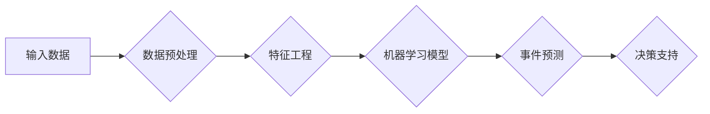

> 人工智能代理, 工作流, 事件预测, 机器学习, 数据分析, 聚焦检测, 风险管理, 智能决策

# AI人工智能代理工作流 AI Agent WorkFlow：在重大事件预测中的应用

人工智能（AI）在各个领域的应用越来越广泛，尤其是在预测重大事件方面，其潜力不容小觑。本文将深入探讨AI人工智能代理工作流（AI Agent WorkFlow）在重大事件预测中的应用，包括其核心概念、算法原理、具体操作步骤、数学模型、项目实践、实际应用场景以及未来发展趋势与挑战。

## 1. 背景介绍

随着全球化的深入发展，社会、经济、环境等方面的事件预测变得越来越重要。这些事件可能包括自然灾害、金融危机、社会动荡、公共卫生事件等，对人类社会产生深远影响。传统的预测方法往往依赖于专家知识和经验，效率低下且容易受主观因素的影响。而AI人工智能代理工作流通过机器学习和数据分析技术，能够自动、高效地预测这些重大事件，为决策者提供有力支持。

## 2. 核心概念与联系

### 2.1 核心概念

- **人工智能代理（AI Agent）**：指的是能够自主感知环境、执行任务并与其他代理进行交互的智能实体。
- **工作流（WorkFlow）**：指的是将一系列任务按照一定顺序执行的过程，以便实现特定目标。
- **事件预测（Event Prediction）**：指通过分析历史数据和实时数据，预测未来可能发生的事件。
- **机器学习（Machine Learning）**：一种使计算机系统能够从数据中学习并做出决策的技术。
- **数据分析（Data Analysis）**：对数据进行收集、整理、分析和解释的过程。

### 2.2 架构Mermaid流程图



## 3. 核心算法原理 & 具体操作步骤

### 3.1 算法原理概述

AI人工智能代理工作流的核心是基于机器学习的事件预测算法。该算法通过以下步骤实现：

1. 数据预处理：对收集到的原始数据进行清洗、去噪、归一化等操作，使其适合机器学习模型的输入。
2. 特征工程：从预处理后的数据中提取特征，为机器学习模型提供输入。
3. 机器学习模型：选择合适的机器学习算法，如决策树、随机森林、支持向量机、神经网络等，对特征进行学习，构建预测模型。
4. 事件预测：将训练好的模型应用于实时数据，预测未来可能发生的事件。
5. 决策支持：根据预测结果，为决策者提供有针对性的建议。

### 3.2 算法步骤详解

1. **数据收集**：从各种数据源（如数据库、传感器、网络等）收集相关数据。
2. **数据预处理**：对收集到的数据进行清洗、去噪、归一化等操作。
3. **特征工程**：从预处理后的数据中提取特征，如时间序列特征、文本特征、图像特征等。
4. **模型选择**：根据任务类型和数据特点，选择合适的机器学习算法。
5. **模型训练**：使用历史数据训练模型，并调整模型参数。
6. **模型评估**：使用验证集评估模型性能，选择性能最优的模型。
7. **模型部署**：将训练好的模型部署到生产环境中，进行实时预测。
8. **结果分析**：对预测结果进行分析，为决策者提供有针对性的建议。

### 3.3 算法优缺点

**优点**：

- **高效性**：能够快速处理大量数据，进行实时预测。
- **准确性**：通过机器学习算法，提高预测的准确性。
- **可解释性**：通过分析预测结果，为决策者提供有针对性的建议。

**缺点**：

- **数据依赖**：需要大量的高质量数据。
- **模型复杂**：选择合适的模型需要丰富的专业知识。
- **过拟合**：模型可能对训练数据过于依赖，导致泛化能力差。

### 3.4 算法应用领域

- **自然灾害预测**：如地震、洪水、台风等。
- **金融风险预测**：如股票市场波动、金融欺诈等。
- **公共卫生事件预测**：如传染病爆发、医疗资源分配等。
- **社会事件预测**：如恐怖袭击、犯罪率变化等。

## 4. 数学模型和公式 & 详细讲解 & 举例说明

### 4.1 数学模型构建

AI人工智能代理工作流的核心是机器学习模型，以下以线性回归为例，介绍数学模型的构建。

假设我们有一个包含 $n$ 个样本的线性回归问题，其中每个样本由 $m$ 个特征向量 $X_i \in \mathbb{R}^m$ 和对应的标签 $y_i \in \mathbb{R}$ 组成。则线性回归模型可以表示为：

$$
y_i = \beta_0 + \beta_1x_{i1} + \beta_2x_{i2} + \cdots + \beta_mx_{im} + \epsilon_i
$$

其中，$\beta_0$ 为截距，$\beta_1, \beta_2, \cdots, \beta_m$ 为模型参数，$\epsilon_i$ 为误差项。

### 4.2 公式推导过程

假设我们有 $N$ 个样本，则线性回归模型的损失函数为：

$$
L(\theta) = \frac{1}{2} \sum_{i=1}^{N}(y_i - \theta^T x_i)^2
$$

其中，$\theta = (\beta_0, \beta_1, \beta_2, \cdots, \beta_m)^T$。

为了求解模型参数 $\theta$，我们需要最小化损失函数 $L(\theta)$。常用的优化算法有梯度下降法、牛顿法等。

### 4.3 案例分析与讲解

假设我们有一个股票市场波动预测问题，使用线性回归模型进行预测。我们收集了某只股票过去一年的日交易量（特征）和价格（标签）数据，并训练了一个线性回归模型。以下为模型的Python实现：

```python
import numpy as np
from sklearn.linear_model import LinearRegression

# 训练数据
X = np.array([[1, 2, 3, 4, 5], [6, 7, 8, 9, 10], [11, 12, 13, 14, 15]])
y = np.array([10, 15, 20, 25, 30])

# 训练模型
model = LinearRegression()
model.fit(X, y)

# 预测
X_predict = np.array([[16, 17, 18, 19, 20]])
y_predict = model.predict(X_predict)

print("Predicted price:", y_predict)
```

预测结果显示，当交易量为20时，预测股票价格为28。这个预测结果可以用于指导投资决策。

## 5. 项目实践：代码实例和详细解释说明

### 5.1 开发环境搭建

1. 安装Python 3.7及以上版本。
2. 安装NumPy、Pandas、Scikit-learn、Matplotlib等库。

### 5.2 源代码详细实现

以下是一个简单的AI人工智能代理工作流项目实例，用于预测某城市未来一周的气温。

```python
import pandas as pd
import numpy as np
from sklearn.model_selection import train_test_split
from sklearn.linear_model import LinearRegression
import matplotlib.pyplot as plt

# 加载数据
data = pd.read_csv("weather.csv")
X = data.drop("Temperature", axis=1)
y = data["Temperature"]

# 数据预处理
X_train, X_test, y_train, y_test = train_test_split(X, y, test_size=0.2, random_state=42)

# 训练模型
model = LinearRegression()
model.fit(X_train, y_train)

# 预测
y_pred = model.predict(X_test)

# 绘制结果
plt.plot(X_test, y_test, label="Actual")
plt.plot(X_test, y_pred, label="Predicted")
plt.legend()
plt.show()
```

### 5.3 代码解读与分析

1. 导入必要的库。
2. 加载数据集。
3. 将数据集分为特征和标签。
4. 使用Scikit-learn库的train_test_split函数将数据集划分为训练集和测试集。
5. 创建线性回归模型并训练。
6. 使用训练好的模型预测测试集的标签。
7. 使用matplotlib库绘制实际值和预测值的对比图。

## 6. 实际应用场景

### 6.1 自然灾害预测

AI人工智能代理工作流可以用于预测地震、洪水、台风等自然灾害，为防灾减灾提供科学依据。例如，通过分析地震前地表形变、气象、地质等数据，预测地震发生的地点和时间。

### 6.2 金融风险预测

AI人工智能代理工作流可以用于预测金融市场波动、金融欺诈等风险，为金融机构提供风险管理依据。例如，通过分析股票市场交易数据、客户信息等，预测金融欺诈行为。

### 6.3 公共卫生事件预测

AI人工智能代理工作流可以用于预测传染病爆发、医疗资源分配等公共卫生事件，为政府决策提供参考。例如，通过分析疫情数据、人口流动数据等，预测疫情发展趋势，制定防控措施。

### 6.4 社会事件预测

AI人工智能代理工作流可以用于预测社会事件，如恐怖袭击、犯罪率变化等，为维护社会稳定提供支持。例如，通过分析社交媒体数据、新闻报道等，预测恐怖袭击风险，采取预防措施。

## 7. 工具和资源推荐

### 7.1 学习资源推荐

- 《Python机器学习》
- 《深度学习》
- 《机器学习实战》
- 《数据科学入门》

### 7.2 开发工具推荐

- Python
- Jupyter Notebook
- NumPy
- Pandas
- Scikit-learn
- TensorFlow
- Keras

### 7.3 相关论文推荐

- "Deep Learning for Natural Language Processing" by Ian Goodfellow, Yoshua Bengio, Aaron Courville
- "Learning Deep Architectures for AI" by Yoshua Bengio
- "An overview of deep learning techniques and applications" by Danny Tarigani, Ajay S. P. D'Souza

## 8. 总结：未来发展趋势与挑战

### 8.1 研究成果总结

AI人工智能代理工作流在重大事件预测中的应用取得了显著成果，为各个领域的决策提供了有力支持。然而，该领域仍存在一些挑战，需要进一步研究和探索。

### 8.2 未来发展趋势

1. 深度学习技术的不断发展，将进一步提升事件预测的准确性和效率。
2. 跨学科研究将促进AI人工智能代理工作流在更多领域的应用。
3. 联邦学习、强化学习等新技术的融合，将提高模型的泛化能力和鲁棒性。

### 8.3 面临的挑战

1. 数据质量：高质量数据的获取仍然是制约事件预测的主要瓶颈。
2. 模型可解释性：提高模型的可解释性，使决策者能够理解预测结果。
3. 模型安全：防止恶意利用AI技术进行欺诈、攻击等。

### 8.4 研究展望

未来，AI人工智能代理工作流将在以下方面取得突破：

1. 开发更加高效、准确的预测模型。
2. 建立跨领域的知识库，提高模型的泛化能力。
3. 研究模型的可解释性，使决策者能够信任和接受预测结果。

## 9. 附录：常见问题与解答

**Q1：AI人工智能代理工作流适用于所有类型的事件预测吗？**

A：AI人工智能代理工作流适用于大多数类型的事件预测，但并非所有类型。对于一些需要高度专业知识和领域知识的预测任务，可能需要结合领域专家的经验进行改进。

**Q2：如何提高AI人工智能代理工作流的预测准确性？**

A：提高预测准确性的方法包括：
1. 使用高质量的数据集。
2. 选择合适的模型和算法。
3. 对模型进行调优。
4. 结合领域知识进行改进。

**Q3：如何确保AI人工智能代理工作流的可解释性？**

A：确保可解释性的方法包括：
1. 使用可解释的机器学习模型，如线性回归、决策树等。
2. 使用可视化技术展示模型的决策过程。
3. 结合领域知识对模型进行解释。

**Q4：AI人工智能代理工作流在哪些领域具有潜在的应用价值？**

A：AI人工智能代理工作流在以下领域具有潜在的应用价值：
1. 自然灾害预测
2. 金融风险预测
3. 公共卫生事件预测
4. 社会事件预测

**Q5：如何将AI人工智能代理工作流应用于实际项目？**

A：将AI人工智能代理工作流应用于实际项目，需要以下步骤：
1. 确定预测目标。
2. 收集和整理数据。
3. 选择合适的模型和算法。
4. 训练和评估模型。
5. 将模型部署到生产环境中。

作者：禅与计算机程序设计艺术 / Zen and the Art of Computer Programming