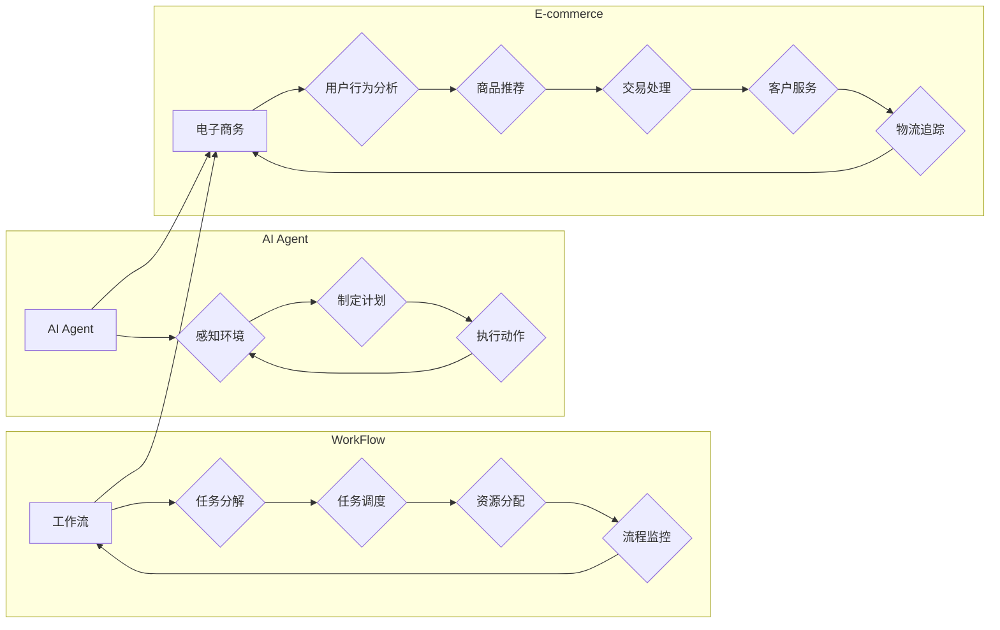

> 关键词：人工智能代理，工作流，电子商务，策略，机器学习，决策树，深度学习，强化学习

# AI人工智能代理工作流AI Agent WorkFlow：在电子商务中应用AI代理的策略

## 1. 背景介绍

随着电子商务的飞速发展，企业对个性化、自动化和智能化的需求日益增长。人工智能（AI）技术，尤其是人工智能代理（AI Agent），为电子商务的变革提供了新的动力。AI代理工作流（AI Agent WorkFlow）作为AI代理在电子商务中的应用形式，通过模拟人类决策过程，自动化处理复杂的业务流程，从而提高效率、降低成本并提升用户体验。

### 1.1 问题的由来

电子商务中常见的业务流程包括用户行为分析、商品推荐、交易处理、客户服务、物流追踪等。这些流程往往涉及多个步骤，需要大量的人工干预，不仅效率低下，而且容易出错。AI代理工作流的出现，旨在通过自动化和智能化的方式，优化这些流程，使其更加高效和精准。

### 1.2 研究现状

目前，AI代理工作流在电子商务中的应用主要基于以下几种技术：

- **机器学习**：通过分析历史数据，学习用户行为和偏好，实现个性化推荐和智能决策。
- **决策树**：构建决策树模型，对用户行为进行分类，指导营销策略和客户服务。
- **深度学习**：利用神经网络模型，从大量数据中提取特征，进行复杂的模式识别和预测。
- **强化学习**：通过与环境交互，不断学习最优策略，优化业务流程。

### 1.3 研究意义

AI代理工作流在电子商务中的应用具有重要意义：

- **提高效率**：自动化处理业务流程，减少人工干预，提高工作效率。
- **降低成本**：减少人力成本，优化资源分配，降低运营成本。
- **提升用户体验**：提供个性化的服务，提升用户满意度和忠诚度。
- **增强竞争力**：利用AI技术提升业务水平，增强市场竞争力。

### 1.4 本文结构

本文将围绕AI代理工作流在电子商务中的应用展开，包括核心概念、算法原理、实践案例、应用场景和未来展望等内容。

## 2. 核心概念与联系

### 2.1 核心概念

- **人工智能代理（AI Agent）**：一种能够感知环境、制定计划并执行动作的人工智能实体。
- **工作流（WorkFlow）**：业务流程的自动化管理，包括任务分解、任务调度、资源分配和流程监控。
- **电子商务（E-commerce）**：通过电子手段进行的商业交易活动。

### 2.2 核心概念原理和架构的 Mermaid 流程图



### 2.3 核心概念联系

AI代理作为工作流的核心组件，负责感知电子商务环境中的用户行为、商品信息等数据，并根据工作流规则制定相应的计划，执行动作，从而实现电子商务流程的自动化和智能化。

## 3. 核心算法原理 & 具体操作步骤

### 3.1 算法原理概述

AI代理工作流的核心算法主要包括：

- **机器学习**：通过数据驱动的方式，学习用户行为和偏好，实现个性化推荐和智能决策。
- **决策树**：构建决策树模型，对用户行为进行分类，指导营销策略和客户服务。
- **深度学习**：利用神经网络模型，从大量数据中提取特征，进行复杂的模式识别和预测。
- **强化学习**：通过与环境交互，不断学习最优策略，优化业务流程。

### 3.2 算法步骤详解

1. **数据收集与预处理**：收集电子商务平台上的用户行为、商品信息、交易数据等，并进行数据清洗、特征工程等预处理操作。
2. **模型训练**：根据具体任务，选择合适的机器学习、决策树、深度学习或强化学习算法，对预处理后的数据进行训练，得到训练好的模型。
3. **模型部署**：将训练好的模型部署到电子商务平台，实现自动化和智能化的业务流程处理。
4. **性能评估与优化**：定期评估模型性能，根据评估结果进行模型优化和参数调整，提高模型性能。

### 3.3 算法优缺点

#### 机器学习

- **优点**：能够处理大规模数据，发现数据中的规律和模式。
- **缺点**：需要大量标注数据，模型可解释性较差。

#### 决策树

- **优点**：模型可解释性强，易于理解和维护。
- **缺点**：对异常值敏感，容易过拟合。

#### 深度学习

- **优点**：能够处理复杂非线性关系，泛化能力强。
- **缺点**：模型参数量大，训练时间长，可解释性较差。

#### 强化学习

- **优点**：能够通过与环境交互学习最优策略，适应性强。
- **缺点**：学习过程复杂，需要大量样本和计算资源。

### 3.4 算法应用领域

AI代理工作流在电子商务中的应用领域包括：

- **用户行为分析**：分析用户行为，预测用户需求，实现个性化推荐。
- **商品推荐**：根据用户偏好和商品属性，推荐合适的商品。
- **交易处理**：自动化处理交易流程，提高交易效率。
- **客户服务**：自动回答客户问题，提高客户满意度。
- **物流追踪**：实时追踪物流信息，提高物流效率。

## 4. 数学模型和公式 & 详细讲解 & 举例说明

### 4.1 数学模型构建

AI代理工作流中的数学模型主要包括：

- **机器学习**：线性回归、逻辑回归、决策树、随机森林、支持向量机等。
- **深度学习**：卷积神经网络（CNN）、循环神经网络（RNN）、长短期记忆网络（LSTM）、注意力机制等。
- **强化学习**：Q学习、深度Q网络（DQN）、策略梯度等。

### 4.2 公式推导过程

以下以线性回归为例，简要介绍公式推导过程。

假设输入变量 $x_1, x_2, ..., x_n$，输出变量 $y$，线性回归模型表示为：

$$
y = w_0 + w_1x_1 + w_2x_2 + ... + w_nx_n
$$

其中 $w_0, w_1, ..., w_n$ 为模型参数。

通过最小化均方误差损失函数，可以得到：

$$
\theta = \mathop{\arg\min}_{\theta} \sum_{i=1}^N (y_i - f(x_i))^2
$$

其中 $f(x)$ 为线性回归模型，$\theta$ 为模型参数。

### 4.3 案例分析与讲解

以下以电子商务平台上的用户行为分析为例，介绍AI代理工作流的应用。

**案例背景**：

某电子商务平台希望通过分析用户行为，实现个性化推荐，提高用户转化率和销售额。

**解决方案**：

1. 数据收集与预处理：收集用户浏览历史、购买记录、搜索记录等数据，并进行数据清洗、特征工程等预处理操作。
2. 模型训练：选择合适的机器学习算法，如协同过滤、基于内容的推荐等，对预处理后的数据进行训练，得到训练好的推荐模型。
3. 模型部署：将训练好的推荐模型部署到电子商务平台，实现个性化推荐功能。
4. 性能评估与优化：定期评估推荐模型的性能，根据评估结果进行模型优化和参数调整，提高推荐效果。

**模型评估**：

- **准确率**：推荐的商品与用户实际购买的商品的匹配程度。
- **召回率**：推荐的商品中用户实际购买的商品的比例。
- **点击率**：用户点击推荐商品的比例。

## 5. 项目实践：代码实例和详细解释说明

### 5.1 开发环境搭建

以下是使用Python进行AI代理工作流项目开发的环境配置流程：

1. 安装Python：从官网下载并安装Python。
2. 安装PyTorch：从官网下载并安装PyTorch。
3. 安装Scikit-learn：使用pip安装Scikit-learn。

### 5.2 源代码详细实现

以下是一个简单的用户行为分析模型，使用Scikit-learn实现：

```python
from sklearn.feature_extraction.text import CountVectorizer
from sklearn.model_selection import train_test_split
from sklearn.naive_bayes import MultinomialNB

# 加载数据
texts = [...]  # 用户浏览历史、购买记录、搜索记录等文本数据
labels = [...]  # 用户行为标签

# 特征提取
vectorizer = CountVectorizer()
X = vectorizer.fit_transform(texts)

# 划分训练集和测试集
X_train, X_test, y_train, y_test = train_test_split(X, labels, test_size=0.2, random_state=42)

# 模型训练
model = MultinomialNB()
model.fit(X_train, y_train)

# 模型评估
print(model.score(X_test, y_test))
```

### 5.3 代码解读与分析

以上代码使用Scikit-learn的CountVectorizer进行文本数据特征提取，使用MultinomialNB进行分类，实现用户行为分析模型。

### 5.4 运行结果展示

运行上述代码，可以得到模型在测试集上的准确率，用于评估模型性能。

## 6. 实际应用场景

### 6.1 个性化推荐

AI代理工作流在电子商务中的最常见应用场景之一是个性化推荐。通过分析用户行为和商品信息，推荐用户可能感兴趣的商品，提高用户转化率和销售额。

### 6.2 客户服务

AI代理工作流可以应用于电子商务平台的客户服务，自动回答用户问题，提高客户满意度。

### 6.3 物流追踪

AI代理工作流可以实时追踪物流信息，提高物流效率，减少用户等待时间。

### 6.4 未来应用展望

随着AI技术的不断发展，AI代理工作流在电子商务中的应用场景将更加丰富，如：

- **智能营销**：根据用户行为和偏好，设计个性化的营销策略。
- **智能定价**：根据市场需求和竞争情况，动态调整商品价格。
- **智能供应链**：优化供应链管理，降低成本，提高效率。

## 7. 工具和资源推荐

### 7.1 学习资源推荐

- **《Python机器学习》**：Scikit-learn官方文档，介绍Scikit-learn库的使用方法。
- **《深度学习》**：Goodfellow et al.所著的深度学习经典教材。
- **《强化学习》**：Sutton and Barto所著的强化学习经典教材。

### 7.2 开发工具推荐

- **Jupyter Notebook**：用于编写和运行Python代码的交互式平台。
- **PyCharm**：一款功能强大的Python开发IDE。
- **TensorFlow**：Google开发的开源深度学习框架。

### 7.3 相关论文推荐

- **"Recommender Systems"**：吴恩达的推荐系统课程，介绍推荐系统的基础知识和常用算法。
- **"Deep Learning for Recommender Systems"**：Huang et al.的论文，介绍深度学习在推荐系统中的应用。
- **"Reinforcement Learning: An Introduction"**：Sutton and Barto的强化学习经典教材。

## 8. 总结：未来发展趋势与挑战

### 8.1 研究成果总结

本文介绍了AI代理工作流在电子商务中的应用，包括核心概念、算法原理、实践案例、应用场景和未来展望。通过分析，可以看出AI代理工作流在电子商务中具有广阔的应用前景。

### 8.2 未来发展趋势

- **多模态融合**：将文本、图像、视频等多模态数据进行融合，提升AI代理的感知能力和决策能力。
- **可解释性增强**：提高AI代理的可解释性，增强用户信任。
- **轻量化模型**：开发轻量化模型，降低计算资源消耗。

### 8.3 面临的挑战

- **数据安全**：如何保护用户隐私和数据安全是AI代理工作流应用的重要挑战。
- **模型可解释性**：提高AI代理的可解释性，增强用户信任。
- **模型泛化能力**：提高AI代理的泛化能力，使其适应不同的场景。

### 8.4 研究展望

随着AI技术的不断发展，AI代理工作流在电子商务中的应用将更加深入和广泛。未来，我们将继续关注AI代理工作流在电子商务中的应用，探索新的技术和方法，为电子商务的智能化发展贡献力量。

## 9. 附录：常见问题与解答

**Q1：AI代理工作流与传统的电子商务系统有什么区别？**

A：AI代理工作流是一种智能化、自动化的业务流程，与传统电子商务系统相比，具有以下特点：

- **自动化**：AI代理能够自动处理业务流程，减少人工干预。
- **智能化**：AI代理能够根据数据和算法进行智能决策。
- **个性化**：AI代理能够根据用户行为和偏好提供个性化服务。

**Q2：如何选择合适的AI代理工作流算法？**

A：选择合适的AI代理工作流算法需要考虑以下因素：

- **业务需求**：根据业务需求选择合适的算法，如个性化推荐、客户服务、物流追踪等。
- **数据特点**：根据数据特点选择合适的算法，如文本数据、图像数据、时间序列数据等。
- **计算资源**：根据计算资源选择合适的算法，如轻量化模型、深度学习模型等。

**Q3：AI代理工作流在电子商务中面临哪些挑战？**

A：AI代理工作流在电子商务中面临以下挑战：

- **数据安全**：如何保护用户隐私和数据安全是重要挑战。
- **模型可解释性**：提高AI代理的可解释性，增强用户信任。
- **模型泛化能力**：提高AI代理的泛化能力，使其适应不同的场景。

**Q4：如何评估AI代理工作流的效果？**

A：评估AI代理工作流的效果可以从以下方面进行：

- **业务指标**：如转化率、销售额、客户满意度等。
- **模型指标**：如准确率、召回率、F1值等。
- **用户反馈**：收集用户对AI代理工作流的反馈，了解用户满意度。

**Q5：AI代理工作流在电子商务中的未来发展趋势是什么？**

A：AI代理工作流在电子商务中的未来发展趋势包括：

- **多模态融合**：将文本、图像、视频等多模态数据进行融合，提升AI代理的感知能力和决策能力。
- **可解释性增强**：提高AI代理的可解释性，增强用户信任。
- **轻量化模型**：开发轻量化模型，降低计算资源消耗。

作者：禅与计算机程序设计艺术 / Zen and the Art of Computer Programming