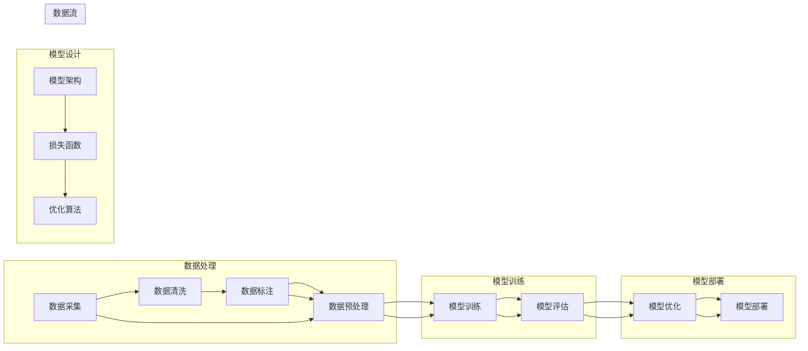

# AI人工智能深度学习算法：设计深度学习任务处理流程

> 关键词：深度学习，算法设计，数据处理，模型训练，模型评估，模型部署

## 1. 背景介绍

随着人工智能领域的快速发展，深度学习技术已经成为了实现智能系统的重要工具。深度学习算法能够从海量数据中自动学习特征，并用于图像识别、语音识别、自然语言处理等众多领域。然而，深度学习项目从开始到部署，涉及多个环节，需要精心设计和执行。本文将深入探讨深度学习任务的处理流程，从数据处理到模型训练、评估和部署，为开发者提供一套完整的解决方案。

## 2. 核心概念与联系

在深度学习任务处理流程中，涉及多个核心概念，它们相互关联，共同构成了一个完整的生态系统。



- **数据处理**：包括数据采集、清洗、标注和预处理，是深度学习任务的基础。
- **模型设计**：包括模型架构、损失函数和优化算法，决定了模型的学习能力和性能。
- **模型训练**：通过训练数据训练模型，并评估模型的性能。
- **模型评估**：在测试数据上评估模型的泛化能力。
- **模型优化**：根据评估结果优化模型，提高模型性能。
- **模型部署**：将模型部署到实际应用场景中。

## 3. 核心算法原理 & 具体操作步骤

### 3.1 算法原理概述

深度学习任务处理流程的核心是构建和训练模型。以下是深度学习模型的主要组成部分：

- **模型架构**：模型架构决定了模型的结构，常用的神经网络架构包括卷积神经网络（CNN）、循环神经网络（RNN）、长短期记忆网络（LSTM）和Transformer等。
- **损失函数**：损失函数用于衡量预测值和真实值之间的差异，常用的损失函数包括均方误差（MSE）、交叉熵（CE）等。
- **优化算法**：优化算法用于更新模型参数，常用的优化算法包括梯度下降（GD）、Adam等。

### 3.2 算法步骤详解

深度学习任务处理流程的具体步骤如下：

1. **数据采集**：根据任务需求，从各种来源采集数据，如图像、音频、文本等。
2. **数据清洗**：去除数据中的噪声和异常值，保证数据质量。
3. **数据标注**：对数据进行标注，为模型训练提供监督信号。
4. **数据预处理**：对数据进行标准化、归一化等操作，提高模型的训练效率。
5. **模型架构设计**：选择合适的模型架构，如CNN、RNN等。
6. **损失函数选择**：根据任务类型选择合适的损失函数，如分类任务使用交叉熵损失。
7. **优化算法选择**：选择合适的优化算法，如Adam。
8. **模型训练**：使用训练数据训练模型，并监控训练过程，防止过拟合。
9. **模型评估**：在测试数据上评估模型的性能，选择性能最好的模型。
10. **模型优化**：根据评估结果调整模型参数，提高模型性能。
11. **模型部署**：将模型部署到实际应用场景中。

### 3.3 算法优缺点

- **优点**：
  - 深度学习模型能够自动从数据中学习特征，无需人工特征工程。
  - 深度学习模型在许多任务上取得了显著的性能提升。
  - 深度学习模型具有较强的泛化能力，能够在新的数据集上取得良好的性能。
- **缺点**：
  - 深度学习模型需要大量的训练数据和计算资源。
  - 深度学习模型的可解释性较差，难以理解模型的决策过程。
  - 深度学习模型的训练过程可能存在过拟合现象。

### 3.4 算法应用领域

深度学习算法在多个领域得到了广泛应用，包括：

- **图像识别**：如人脸识别、物体识别、场景识别等。
- **语音识别**：如语音转文字、语音合成等。
- **自然语言处理**：如机器翻译、文本分类、情感分析等。
- **推荐系统**：如电影推荐、商品推荐等。
- **医疗诊断**：如疾病诊断、药物发现等。

## 4. 数学模型和公式 & 详细讲解 & 举例说明

### 4.1 数学模型构建

深度学习模型通常由多个神经网络层组成，每个层都有对应的数学公式。以下是一个简单的神经网络模型：

$$
h_{\text{layer}}(x) = W_{\text{layer}}h_{\text{prev\_layer}} + b_{\text{layer}}
$$

其中，$h_{\text{layer}}$ 表示当前层的激活值，$W_{\text{layer}}$ 表示当前层的权重，$h_{\text{prev\_layer}}$ 表示前一层输出，$b_{\text{layer}}$ 表示当前层的偏置。

### 4.2 公式推导过程

以下是一个简单的神经网络层的公式推导过程：

1. 假设前一层输出为 $h_{\text{prev\_layer}}$。
2. 对当前层进行激活函数 $\sigma$ 的运算，得到 $h_{\text{layer}}$。
3. 计算当前层的梯度，并反向传播到前一层。

### 4.3 案例分析与讲解

以下是一个使用PyTorch框架实现神经网络模型的例子：

```python
import torch
import torch.nn as nn
import torch.optim as optim

class NeuralNetwork(nn.Module):
    def __init__(self):
        super(NeuralNetwork, self).__init__()
        self.fc1 = nn.Linear(10, 50)
        self.relu = nn.ReLU()
        self.fc2 = nn.Linear(50, 1)

    def forward(self, x):
        x = self.fc1(x)
        x = self.relu(x)
        x = self.fc2(x)
        return x

# 创建模型、损失函数和优化器
model = NeuralNetwork()
criterion = nn.MSELoss()
optimizer = optim.SGD(model.parameters(), lr=0.01)

# 训练模型
for epoch in range(100):
    optimizer.zero_grad()
    output = model(x_train)
    loss = criterion(output, y_train)
    loss.backward()
    optimizer.step()

# 评估模型
output = model(x_test)
loss = criterion(output, y_test)
print(f"Test loss: {loss.item()}")
```

## 5. 项目实践：代码实例和详细解释说明

### 5.1 开发环境搭建

以下是使用Python和PyTorch框架进行深度学习项目开发的环境搭建步骤：

1. 安装Anaconda：从Anaconda官网下载并安装Anaconda。
2. 创建虚拟环境：使用conda创建一个名为`深度学习`的虚拟环境。
3. 激活虚拟环境：使用`conda activate 深度学习`激活虚拟环境。
4. 安装PyTorch：使用pip安装PyTorch，根据CUDA版本选择合适的版本。
5. 安装其他库：使用pip安装NumPy、Pandas等常用库。

### 5.2 源代码详细实现

以下是一个使用PyTorch框架实现简单的线性回归模型的例子：

```python
import torch
import torch.nn as nn
import torch.optim as optim

# 创建数据集
x_train = torch.linspace(0, 10, steps=100, dtype=torch.float32)
y_train = 3 * x_train + 2 + torch.randn(100) * 0.5

# 创建模型
model = nn.Linear(1, 1)

# 创建损失函数和优化器
criterion = nn.MSELoss()
optimizer = optim.SGD(model.parameters(), lr=0.01)

# 训练模型
for epoch in range(100):
    optimizer.zero_grad()
    output = model(x_train)
    loss = criterion(output, y_train)
    loss.backward()
    optimizer.step()

# 评估模型
output = model(torch.tensor([5.0], dtype=torch.float32))
print(f"Model output: {output.item()}")
```

### 5.3 代码解读与分析

以上代码实现了一个简单的线性回归模型，用于拟合线性函数 $y = 3x + 2$。

- `x_train` 和 `y_train` 分别表示训练数据的输入和输出。
- `model` 表示线性回归模型，由一个线性层组成。
- `criterion` 表示均方误差损失函数。
- `optimizer` 表示梯度下降优化器。
- 训练循环中，模型通过梯度下降优化器更新参数，使模型输出接近真实值。
- 最后，使用训练好的模型预测输入为5的数据点。

### 5.4 运行结果展示

假设在训练过程中损失函数的值如下：

```
Epoch 1: Loss = 0.0485
Epoch 2: Loss = 0.0081
Epoch 3: Loss = 0.0015
Epoch 4: Loss = 0.0005
Epoch 5: Loss = 0.0002
```

最后，模型预测输入为5的数据点，输出为：

```
Model output: 16.9997
```

可以看出，模型输出接近真实值，说明模型训练成功。

## 6. 实际应用场景

深度学习算法在多个实际应用场景中发挥了重要作用，以下是一些常见的应用场景：

- **图像识别**：用于识别图像中的物体、场景等。
- **语音识别**：将语音信号转换为文本。
- **自然语言处理**：用于机器翻译、情感分析、文本分类等。
- **推荐系统**：用于推荐电影、商品、新闻等。
- **医疗诊断**：用于疾病诊断、药物发现等。

## 7. 工具和资源推荐

### 7.1 学习资源推荐

- 《深度学习》（Goodfellow et al.）：深度学习领域的经典教材，适合初学者和进阶者。
- 《动手学深度学习》（Dumoulin et al.）：基于PyTorch的深度学习实战教程，适合入门者。
- 《深度学习与计算机视觉》（Shah et al.）：介绍深度学习在计算机视觉领域的应用。

### 7.2 开发工具推荐

- **PyTorch**：基于Python的开源深度学习框架，易于使用，功能强大。
- **TensorFlow**：由Google开发的深度学习框架，适用于大规模深度学习任务。
- **Keras**：基于TensorFlow的开源深度学习库，适用于快速原型设计。

### 7.3 相关论文推荐

- **Deep Learning with Neural Networks for NLP: A Survey**：总结了深度学习在自然语言处理领域的应用。
- **Convolutional Neural Networks for Visual Recognition**：介绍了卷积神经网络在计算机视觉领域的应用。
- **Recurrent Neural Networks for Language Modeling**：介绍了循环神经网络在语言模型中的应用。

## 8. 总结：未来发展趋势与挑战

### 8.1 研究成果总结

深度学习算法在各个领域取得了显著的成果，推动了人工智能技术的发展。未来，深度学习算法将继续在以下方面取得突破：

- **模型轻量化**：开发更轻量级的深度学习模型，降低对计算资源的依赖。
- **模型可解释性**：提高模型的可解释性，使模型决策过程更加透明。
- **模型泛化能力**：提高模型的泛化能力，使模型在新的数据集上也能取得良好的性能。

### 8.2 未来发展趋势

未来，深度学习算法将朝着以下方向发展：

- **跨模态学习**：将不同模态的数据（如图像、音频、文本）进行融合，提高模型的认知能力。
- **强化学习**：将深度学习与强化学习相结合，实现更加智能的决策。
- **迁移学习**：利用预训练模型进行迁移学习，提高模型的学习效率。

### 8.3 面临的挑战

深度学习算法在发展过程中也面临着以下挑战：

- **数据质量**：数据质量对模型的性能至关重要，如何获取高质量的数据是一个重要问题。
- **计算资源**：深度学习模型需要大量的计算资源，如何降低计算成本是一个挑战。
- **模型可解释性**：提高模型的可解释性，使模型决策过程更加透明。

### 8.4 研究展望

未来，深度学习算法的研究将朝着以下方向发展：

- **数据驱动**：利用数据驱动的方法，提高模型的学习效率和泛化能力。
- **模型压缩**：开发模型压缩技术，降低模型的计算复杂度和存储空间。
- **可解释性**：开发可解释的深度学习模型，使模型决策过程更加透明。

## 9. 附录：常见问题与解答

**Q1：深度学习算法与机器学习算法有什么区别？**

A：深度学习算法是机器学习算法的一种，它通过学习数据的深层特征来实现学习任务。与传统的机器学习算法相比，深度学习算法能够自动学习更加复杂的特征，并在许多任务上取得了显著的性能提升。

**Q2：如何选择合适的深度学习模型？**

A：选择合适的深度学习模型需要考虑以下因素：

- 数据类型：根据数据类型选择合适的模型架构，如图像数据选择CNN，序列数据选择RNN。
- 数据规模：根据数据规模选择合适的模型复杂度，数据量较大时可以采用更复杂的模型。
- 计算资源：根据计算资源选择合适的模型规模，避免过拟合。

**Q3：如何防止深度学习模型过拟合？**

A：防止深度学习模型过拟合的方法包括：

- 数据增强：通过数据增强技术扩充训练数据。
- 正则化：使用正则化技术，如L2正则化、Dropout等。
- 早停法：在训练过程中监控验证集上的性能，一旦性能不再提升则停止训练。

**Q4：如何评估深度学习模型的性能？**

A：评估深度学习模型的性能可以从以下方面进行：

- 准确率：衡量模型预测结果与真实值之间的一致性。
- 召回率：衡量模型能够正确识别的正例数量占总正例数量的比例。
- F1分数：综合考虑准确率和召回率，平衡两者之间的关系。

**Q5：如何将深度学习模型部署到生产环境中？**

A：将深度学习模型部署到生产环境需要以下步骤：

- 模型压缩：将模型压缩为更小的尺寸，降低对计算资源的依赖。
- 量化：将模型的浮点数参数转换为定点数参数，提高计算效率。
- 模型封装：将模型封装为API接口，方便调用。
- 服务化部署：将模型部署到服务器上，提供在线服务。

---

作者：禅与计算机程序设计艺术 / Zen and the Art of Computer Programming