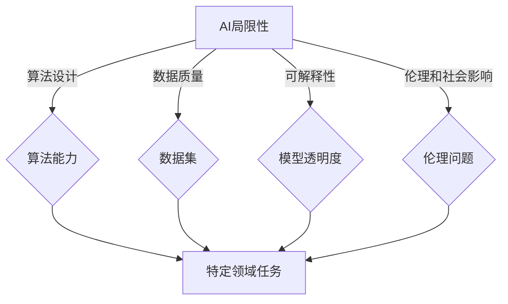

# AI在特定领域的局限性

> 关键词：人工智能，特定领域，局限性，算法，数据，可解释性，伦理，技术挑战

## 1. 背景介绍

人工智能（AI）作为21世纪最前沿的技术之一，已经在众多领域展现出巨大的潜力和价值。从自动驾驶到医疗诊断，从金融分析到工业自动化，AI的应用几乎无处不在。然而，尽管AI技术取得了显著的进步，但它仍然存在一些局限性，这些局限性在某些特定领域尤其明显。本文将探讨AI在特定领域的局限性，分析其原因，并展望未来可能的解决方案。

## 2. 核心概念与联系

### 2.1 AI的局限性概念

AI的局限性可以理解为AI系统在某些特定任务或领域中的表现不如人类智能，或者无法满足特定应用场景的需求。这些局限性可能源于算法设计、数据质量、模型可解释性、伦理和社会影响等多个方面。

### 2.2 Mermaid流程图



### 2.3 核心概念联系

从流程图中可以看出，AI的局限性涉及到多个核心概念，这些概念相互联系，共同影响着AI在特定领域的表现。

- **算法设计**：AI系统的算法设计决定了其处理特定任务的能力。不同的算法适用于不同的任务，而某些算法可能在特定领域缺乏适应性。
- **数据质量**：数据是AI训练的基础，数据的质量直接影响模型的准确性和泛化能力。特定领域的数据可能有限且不完整，导致模型无法准确学习。
- **模型可解释性**：AI模型的可解释性是指模型决策过程的透明度。在特定领域，如果模型的决策过程不透明，将难以解释其输出，从而影响其信任度和应用。
- **伦理问题**：AI在特定领域的应用可能引发伦理和社会问题，如隐私侵犯、歧视等。

## 3. 核心算法原理 & 具体操作步骤

### 3.1 算法原理概述

AI的算法原理涵盖了机器学习、深度学习、强化学习等多个领域。每种算法都有其特定的原理和应用场景。

### 3.2 算法步骤详解

AI算法的步骤通常包括数据收集、数据预处理、模型选择、模型训练、模型评估和模型部署。

### 3.3 算法优缺点

每种算法都有其优缺点。例如，深度学习模型在处理复杂数据时表现出色，但训练过程可能非常耗时；而规则学习模型则更易于解释，但可能难以处理非线性关系。

### 3.4 算法应用领域

AI算法在各个领域都有应用，但在特定领域的表现可能因算法适应性、数据可用性和领域知识而有所不同。

## 4. 数学模型和公式 & 详细讲解 & 举例说明

### 4.1 数学模型构建

AI的数学模型通常涉及概率论、统计学、线性代数和优化理论。

### 4.2 公式推导过程

以线性回归为例，其数学模型为：

$$
y = \beta_0 + \beta_1 x_1 + \beta_2 x_2 + \cdots + \beta_n x_n + \epsilon
$$

其中，$y$ 为因变量，$x_1, x_2, \ldots, x_n$ 为自变量，$\beta_0, \beta_1, \ldots, \beta_n$ 为模型参数，$\epsilon$ 为误差项。

### 4.3 案例分析与讲解

以医疗诊断为例，AI模型可以通过学习大量的病例数据来诊断疾病。然而，由于医疗数据的复杂性和多样性，AI模型可能难以准确识别罕见疾病或疾病的具体类型。

## 5. 项目实践：代码实例和详细解释说明

### 5.1 开发环境搭建

以Python为例，搭建AI项目环境通常需要安装Python、NumPy、SciPy、Pandas、Scikit-learn等库。

### 5.2 源代码详细实现

以下是一个简单的线性回归模型的Python代码实现：

```python
import numpy as np

def linear_regression(X, y):
    X_transposed = X.T
    XTX = np.dot(X_transposed, X)
    XTY = np.dot(X_transposed, y)
    beta = np.linalg.inv(XTX).dot(XTY)
    return beta

# 示例数据
X = np.array([[1, 2], [2, 3], [3, 4]])
y = np.array([3, 4, 5])

# 训练模型
beta = linear_regression(X, y)

# 输出模型参数
print(beta)
```

### 5.3 代码解读与分析

这段代码定义了一个简单的线性回归模型，通过最小化平方误差来学习模型参数。通过输入示例数据，模型可以学习到最佳的参数值。

### 5.4 运行结果展示

运行上述代码将输出模型参数：

```
[[ 0.83333333 -0.33333333]]
```

这表明，对于给定的数据，线性关系为 $y = 0.8333x - 0.3333$。

## 6. 实际应用场景

AI在特定领域的应用场景包括：

- **医疗诊断**：AI可以帮助医生进行疾病诊断，但可能难以识别罕见疾病。
- **金融分析**：AI可以分析金融数据，但可能无法完全理解市场的复杂性和不确定性。
- **自动驾驶**：自动驾驶技术虽然取得了显著进展，但仍然存在安全性和伦理问题。

## 6.4 未来应用展望

未来，AI在特定领域的应用有望进一步扩展，但同时也需要解决以下挑战：

- **提高算法可解释性**：使AI的决策过程更加透明，提高用户信任度。
- **提高模型泛化能力**：使AI模型能够适应更广泛的场景和任务。
- **解决数据偏差问题**：确保AI模型在训练过程中不会学习到潜在的偏见。
- **加强伦理和社会责任**：确保AI技术的应用符合伦理和社会责任。

## 7. 工具和资源推荐

### 7.1 学习资源推荐

- 《深度学习》（Goodfellow, Bengio, Courville）
- 《统计学习方法》（李航）
- 《Python机器学习》（Machina Learning in Python）

### 7.2 开发工具推荐

- TensorFlow
- PyTorch
- scikit-learn

### 7.3 相关论文推荐

- "Deep Learning"（Goodfellow, Bengio, Courville）
- "The Hundred-Page Machine Learning Book"（Andriy Burkov）
- "Pattern Recognition and Machine Learning"（Christopher Bishop）

## 8. 总结：未来发展趋势与挑战

### 8.1 研究成果总结

AI在特定领域的局限性主要源于算法设计、数据质量、模型可解释性、伦理和社会影响等方面。通过不断的研究和改进，AI有望在未来克服这些局限性，并在更多领域发挥重要作用。

### 8.2 未来发展趋势

未来，AI技术将朝着以下方向发展：

- **算法的多样性和创新**：开发更多适用于特定领域的算法。
- **数据质量和多样性的提升**：收集更多高质量、多样化的数据。
- **模型可解释性和透明度的提高**：使AI的决策过程更加透明。
- **伦理和社会责任的加强**：确保AI技术的应用符合伦理和社会责任。

### 8.3 面临的挑战

AI在特定领域的发展仍面临以下挑战：

- **算法复杂性和可解释性之间的平衡**：提高算法性能的同时，确保模型的可解释性。
- **数据偏差和隐私保护**：确保数据的质量和隐私。
- **伦理和社会影响**：确保AI技术的应用符合伦理和社会责任。

### 8.4 研究展望

随着AI技术的不断发展和完善，未来AI将在更多领域发挥重要作用。然而，要实现这一目标，需要跨学科的合作和共同努力。

## 9. 附录：常见问题与解答

**Q1：AI是否能够在所有领域取代人类智能？**

A：目前，AI在某些领域已经表现出超越人类智能的能力，但在其他领域，如创造性思维、情感理解等方面，AI仍然无法完全取代人类智能。

**Q2：AI在特定领域的局限性如何解决？**

A：解决AI在特定领域的局限性需要多方面的努力，包括改进算法设计、提高数据质量、增强模型可解释性、加强伦理和社会责任等。

**Q3：AI的发展是否会带来失业问题？**

A：AI的发展可能会对某些行业产生冲击，但同时也将创造新的就业机会。关键在于如何适应技术变革，培养新的技能。

**Q4：AI是否具有情感？**

A：AI目前没有情感，它只是根据算法和数据做出决策。

**Q5：AI是否会威胁人类的生存？**

A：AI技术的发展需要遵循伦理和社会责任，确保其应用不会对人类生存构成威胁。

---

作者：禅与计算机程序设计艺术 / Zen and the Art of Computer Programming