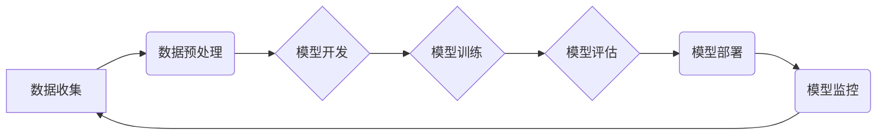

# AI工程最佳实践原理与代码实战案例讲解

> 关键词：AI工程，最佳实践，代码实战，模型部署，数据工程，持续集成，持续部署，MLOps

## 1. 背景介绍

随着人工智能技术的迅猛发展，AI工程已经成为推动技术落地和应用的关键。AI工程不仅仅是编写代码和训练模型，它涵盖了从数据收集到模型部署的整个生命周期。本文将深入探讨AI工程的最佳实践，并提供代码实战案例讲解，帮助读者理解并应用这些实践。

### 1.1 问题的由来

在AI项目中，从概念验证到产品化落地，往往面临着诸多挑战，如数据质量问题、模型性能瓶颈、部署难度大等问题。这些挑战导致了许多AI项目失败，或者无法达到预期效果。因此，制定一套最佳实践对于确保AI项目的成功至关重要。

### 1.2 研究现状

目前，AI工程的最佳实践已经形成了一套较为成熟的体系，包括数据工程、模型开发、模型训练、模型评估、模型部署和持续集成/持续部署（CI/CD）等方面。这些实践涵盖了从数据预处理到模型监控的整个流程。

### 1.3 研究意义

理解和应用AI工程的最佳实践，可以帮助开发者和团队：
- 提高数据质量，确保模型训练效果。
- 提升模型性能，减少过拟合和欠拟合。
- 降低部署难度，加快产品上市速度。
- 提高团队协作效率，实现持续迭代。

### 1.4 本文结构

本文将分为以下几个部分：
- 介绍AI工程的核心概念和流程。
- 深入讲解数据工程、模型开发、模型训练、模型评估等关键环节的最佳实践。
- 提供代码实战案例，展示如何在实际项目中应用这些实践。
- 探讨AI工程的实际应用场景和未来发展趋势。

## 2. 核心概念与联系

### 2.1 Mermaid流程图



### 2.2 核心概念

- 数据工程：涉及数据的收集、清洗、转换和存储等过程，是AI工程的基础。
- 模型开发：包括模型设计、实现和优化等环节，是AI工程的核心。
- 模型训练：使用训练数据对模型进行训练，提高模型性能。
- 模型评估：评估模型性能，包括准确性、召回率、F1分数等指标。
- 模型部署：将训练好的模型部署到生产环境中，供实际使用。
- 模型监控：监控模型性能，及时发现和解决潜在问题。
- 持续集成/持续部署：自动化的软件开发流程，确保模型持续迭代。

## 3. 核心算法原理 & 具体操作步骤

### 3.1 算法原理概述

AI工程的核心是构建和部署有效的机器学习模型。以下是一些常用的机器学习算法及其原理：

- **监督学习**：使用标注数据进行训练，学习输入和输出之间的映射关系。
- **无监督学习**：使用未标注数据进行训练，发现数据中的模式和无监督结构。
- **强化学习**：通过试错和奖励机制来学习最优策略。

### 3.2 算法步骤详解

1. **数据收集**：从各种来源收集数据，如数据库、传感器、网页等。
2. **数据预处理**：清洗、转换和格式化数据，确保数据质量。
3. **模型开发**：选择合适的模型架构，如神经网络、决策树、支持向量机等。
4. **模型训练**：使用训练数据对模型进行训练，调整模型参数。
5. **模型评估**：使用测试数据评估模型性能，调整模型参数。
6. **模型部署**：将训练好的模型部署到生产环境中，供实际使用。
7. **模型监控**：监控模型性能，及时发现和解决潜在问题。

### 3.3 算法优缺点

- **监督学习**：优点是能够学习复杂的数据关系，缺点是需要大量标注数据。
- **无监督学习**：优点是不需要标注数据，缺点是难以学习复杂关系。
- **强化学习**：优点是能够学习最优策略，缺点是需要大量计算资源。

### 3.4 算法应用领域

- **监督学习**：图像识别、语音识别、文本分类等。
- **无监督学习**：聚类、降维、异常检测等。
- **强化学习**：自动驾驶、游戏AI、推荐系统等。

## 4. 数学模型和公式 & 详细讲解 & 举例说明

### 4.1 数学模型构建

以神经网络为例，其数学模型可以表示为：

$$
y = f(W \cdot x + b)
$$

其中，$y$ 是输出，$x$ 是输入，$W$ 是权重，$b$ 是偏置，$f$ 是激活函数。

### 4.2 公式推导过程

以梯度下降算法为例，其更新公式为：

$$
W_{new} = W_{old} - \alpha \cdot \nabla_{W}J(W)
$$

其中，$W_{new}$ 是新的权重，$W_{old}$ 是旧的权重，$\alpha$ 是学习率，$J(W)$ 是损失函数。

### 4.3 案例分析与讲解

以下是一个使用Python和PyTorch实现的简单神经网络模型：

```python
import torch
import torch.nn as nn

class SimpleNN(nn.Module):
    def __init__(self):
        super(SimpleNN, self).__init__()
        self.fc1 = nn.Linear(10, 50)
        self.relu = nn.ReLU()
        self.fc2 = nn.Linear(50, 1)

    def forward(self, x):
        x = self.fc1(x)
        x = self.relu(x)
        x = self.fc2(x)
        return x

model = SimpleNN()
```

这是一个简单的单层神经网络，用于回归任务。其中，`fc1` 是输入层到隐藏层的线性变换，`relu` 是ReLU激活函数，`fc2` 是隐藏层到输出层的线性变换。

## 5. 项目实践：代码实例和详细解释说明

### 5.1 开发环境搭建

首先，需要安装Python环境和PyTorch库：

```bash
pip install python==3.8 torch
```

### 5.2 源代码详细实现

以下是一个使用PyTorch实现和训练神经网络模型的完整代码示例：

```python
import torch
import torch.nn as nn
import torch.optim as optim

# 定义模型
class SimpleNN(nn.Module):
    def __init__(self):
        super(SimpleNN, self).__init__()
        self.fc1 = nn.Linear(10, 50)
        self.relu = nn.ReLU()
        self.fc2 = nn.Linear(50, 1)

    def forward(self, x):
        x = self.fc1(x)
        x = self.relu(x)
        x = self.fc2(x)
        return x

# 创建模型实例
model = SimpleNN()

# 定义损失函数和优化器
criterion = nn.MSELoss()
optimizer = optim.Adam(model.parameters(), lr=0.001)

# 创建随机数据集
x = torch.randn(100, 10)
y = torch.randn(100, 1)

# 训练模型
for epoch in range(100):
    optimizer.zero_grad()
    output = model(x)
    loss = criterion(output, y)
    loss.backward()
    optimizer.step()
    if epoch % 10 == 0:
        print(f'Epoch {epoch+1}, Loss: {loss.item()}')
```

### 5.3 代码解读与分析

- `SimpleNN` 类定义了一个简单的神经网络模型，包括两个全连接层和一个ReLU激活函数。
- `forward` 方法实现了前向传播过程。
- 损失函数和优化器用于计算损失和更新模型参数。
- 数据集使用随机数生成，实际应用中应使用真实数据集。
- 训练过程中，模型参数通过反向传播和优化器更新来最小化损失。

### 5.4 运行结果展示

运行上述代码，可以看到模型在每个epoch的损失逐渐减小，最终收敛。

## 6. 实际应用场景

AI工程的最佳实践可以应用于各种实际场景，以下是一些例子：

- **推荐系统**：使用机器学习模型预测用户可能感兴趣的商品或内容。
- **自动驾驶**：使用计算机视觉和机器学习技术实现车辆的自主导航。
- **金融风控**：使用机器学习模型识别欺诈交易和信用风险。
- **医疗诊断**：使用深度学习模型辅助医生进行疾病诊断。

## 7. 工具和资源推荐

### 7.1 学习资源推荐

- 《深度学习》 - Ian Goodfellow, Yoshua Bengio, Aaron Courville
- 《Python机器学习》 - Sebastian Raschka
- 《动手学深度学习》 - 洪嘉安，李航，李沐

### 7.2 开发工具推荐

- PyTorch
- TensorFlow
- scikit-learn
- Jupyter Notebook

### 7.3 相关论文推荐

- "Playing for Data: Learning to Beat a Policy Gradient Agent" - OpenAI
- "BERT: Pre-training of Deep Bidirectional Transformers for Language Understanding" - Google AI
- "Generative Adversarial Nets" - Ian Goodfellow et al.

## 8. 总结：未来发展趋势与挑战

### 8.1 研究成果总结

本文介绍了AI工程的最佳实践，包括数据工程、模型开发、模型训练、模型评估、模型部署和持续集成/持续部署等方面。通过代码实战案例，展示了如何在实际项目中应用这些实践。

### 8.2 未来发展趋势

- 自动化：AI工程将更加自动化，减少人工干预。
- 云计算：云计算将为AI工程提供更强大的算力支持。
- 多模态：AI工程将融合多模态数据，如文本、图像、语音等。
- 伦理：AI工程的伦理问题将得到更多关注。

### 8.3 面临的挑战

- 数据隐私：如何保护用户数据隐私是一个重要挑战。
- 模型可解释性：如何提高模型的可解释性是一个挑战。
- 模型鲁棒性：如何提高模型的鲁棒性是一个挑战。

### 8.4 研究展望

- 开源社区将更加活跃，提供更多开源工具和资源。
- AI工程将与其他领域（如软件工程、数据科学等）更加紧密结合。
- AI工程将推动人工智能技术的广泛应用。

## 9. 附录：常见问题与解答

**Q1：AI工程与传统软件开发有什么区别？**

A: AI工程与传统软件开发的主要区别在于：
- AI工程更注重数据质量和数据处理。
- AI工程更注重模型开发和训练。
- AI工程更注重模型的评估和部署。

**Q2：如何选择合适的机器学习模型？**

A: 选择合适的机器学习模型需要考虑以下因素：
- 数据类型：分类、回归、聚类等。
- 数据量：大量数据可以使用复杂模型，小量数据可以使用简单模型。
- 特征工程：特征工程对模型性能有很大影响。

**Q3：如何优化模型性能？**

A: 优化模型性能可以通过以下方法：
- 特征工程：选择和构建合适的特征。
- 模型选择：选择合适的模型架构。
- 模型训练：调整模型参数和优化器。
- 数据增强：使用数据增强技术扩充数据集。

**Q4：如何部署机器学习模型？**

A: 部署机器学习模型可以通过以下方法：
- 模型打包：将训练好的模型打包成可部署的形式。
- 模型容器化：使用容器技术将模型和依赖打包。
- 部署平台：选择合适的部署平台，如云平台、边缘计算等。

**Q5：MLOps是什么？**

A: MLOps（Machine Learning Operations）是机器学习操作的缩写，它将机器学习与软件开发的最佳实践相结合，以确保机器学习模型可以高效、可靠地部署到生产环境中。

作者：禅与计算机程序设计艺术 / Zen and the Art of Computer Programming