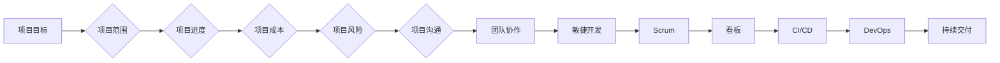

# AI项目管理与团队协作原理与代码实战案例讲解

> 关键词：AI项目管理、团队协作、敏捷开发、Scrum、看板、代码实战、Jira、敏捷工具、持续集成、DevOps

## 1. 背景介绍

随着人工智能技术的快速发展，AI项目在各个行业中的应用日益广泛。然而，AI项目的特点——高度复杂、技术迭代快、团队构成多样——也给项目管理带来了新的挑战。如何有效地管理AI项目，提高团队协作效率，成为了当前IT领域的一个重要课题。

本文将从AI项目管理的核心概念、团队协作方法、敏捷开发实践以及代码实战案例等方面，深入探讨AI项目管理与团队协作的原理与技巧。

## 2. 核心概念与联系

### 2.1 AI项目管理核心概念

**1. 项目目标**：明确项目要解决的问题、达到的目标和预期成果。

**2. 项目范围**：界定项目的边界，明确哪些工作属于项目范围，哪些不属于。

**3. 项目进度**：项目完成的时间安排，包括里程碑、时间节点等。

**4. 项目成本**：项目实施所需的资源，包括人力、物力、财力等。

**5. 项目风险**：项目实施过程中可能遇到的风险因素，包括技术风险、市场风险、团队风险等。

**6. 项目沟通**：项目成员、利益相关者之间的信息交流与协作。

### 2.2 团队协作方法

**1. 敏捷开发**：以用户需求为导向，快速迭代、持续交付的软件开发方法。

**2. Scrum**：敏捷开发框架，强调自组织、跨职能团队、迭代开发、增量交付。

**3. 看板**：可视化的工作管理工具，用于展示工作流程、任务进度和瓶颈。

**4. 持续集成/持续部署（CI/CD）**：自动化构建、测试、部署流程，提高开发效率。

**5. DevOps**：软件开发和运维团队的紧密协作，实现持续交付。

### 2.3 Mermaid 流程图



## 3. 核心算法原理 & 具体操作步骤

### 3.1 算法原理概述

AI项目管理与团队协作的核心算法原理包括：

**1. 敏捷开发原则**：强调用户需求、快速迭代、持续交付、响应变化。

**2. Scrum框架**：定义了角色、活动、工件和规则，指导团队高效协作。

**3. 看板方法**：通过可视化的工作流程，提高团队协作效率和透明度。

**4. 持续集成/持续部署（CI/CD）**：自动化构建、测试、部署流程，缩短开发周期。

**5. DevOps文化**：促进软件开发和运维团队的紧密协作，实现持续交付。

### 3.2 算法步骤详解

**1. 制定项目计划**：明确项目目标、范围、进度、成本、风险等。

**2. 组建团队**：根据项目需求，选择合适的团队成员，组建跨职能、自组织的团队。

**3. 实施敏捷开发**：采用Scrum框架，进行迭代开发和增量交付。

**4. 应用看板方法**：使用看板可视化工作流程，提高团队协作效率和透明度。

**5. 实施CI/CD**：自动化构建、测试、部署流程，缩短开发周期。

**6. 推广DevOps文化**：促进软件开发和运维团队的紧密协作，实现持续交付。

### 3.3 算法优缺点

**优点**：

- 提高团队协作效率。
- 缩短开发周期。
- 响应变化，快速迭代。
- 提升项目成功率。

**缺点**：

- 需要团队成员具备较高的自主管理能力和沟通能力。
- 项目计划可能需要频繁调整。
- 对项目管理者的要求较高。

### 3.4 算法应用领域

AI项目管理与团队协作方法适用于以下领域：

- 软件开发项目。
- 硬件开发项目。
- 研究与开发项目。
- 产品设计与开发项目。
- 人工智能项目。

## 4. 数学模型和公式 & 详细讲解 & 举例说明

### 4.1 数学模型构建

AI项目管理与团队协作的数学模型可以基于以下公式：

$$
\text{项目成功率} = f(\text{团队协作效率}, \text{迭代周期}, \text{变化响应速度})
$$

其中：

- 项目成功率：项目按时、按预算、按质量完成的比例。
- 团队协作效率：团队成员之间的协作能力。
- 迭代周期：每次迭代的周期长度。
- 变化响应速度：团队对项目变更的响应速度。

### 4.2 公式推导过程

假设项目成功率为 $P$，团队协作效率为 $E$，迭代周期为 $T$，变化响应速度为 $R$，则有：

$$
P = P(E, T, R)
$$

通过实验数据，可以得到以下关系：

$$
E = E(A, B, C)
$$

$$
T = T(D, E, F)
$$

$$
R = R(G, H, I)
$$

其中：

- $A$，$B$，$C$，$D$，$E$，$F$，$G$，$H$，$I$ 分别为影响团队协作效率、迭代周期和变化响应速度的参数。

将以上公式代入项目成功率公式，得到：

$$
P = P(E(A, B, C), T(D, E, F), R(G, H, I))
$$

### 4.3 案例分析与讲解

以下是一个使用Scrum和看板方法进行AI项目管理的案例：

**项目背景**：某公司开发一款智能客服系统，旨在提高客户服务效率。

**项目目标**：在3个月内完成系统开发，达到90%以上的准确率。

**项目范围**：包括需求分析、系统设计、开发、测试、部署等。

**项目进度**：采用Scrum方法，将项目分为3个迭代周期，每个周期4周。

**项目成本**：预计总成本为10万元。

**项目风险**：技术风险、市场风险、团队风险。

**团队协作**：组建一个包含产品经理、设计师、开发人员、测试人员、运维人员的跨职能团队。

**具体操作步骤**：

1. **需求分析**：与产品经理沟通，明确系统功能和性能要求。
2. **系统设计**：设计师进行系统界面设计，开发人员进行系统架构设计。
3. **开发**：开发人员根据系统设计进行编码实现。
4. **测试**：测试人员对系统进行功能测试、性能测试等。
5. **部署**：运维人员将系统部署到生产环境。

在项目实施过程中，使用看板方法可视化工作流程，监控任务进度，及时发现并解决问题。通过Scrum会议，团队成员定期回顾项目进展，讨论改进措施。

最终，该项目成功在3个月内完成，达到90%以上的准确率，客户满意度较高。

## 5. 项目实践：代码实例和详细解释说明

### 5.1 开发环境搭建

以下是一个使用Jira进行AI项目管理实践案例：

**1. 注册Jira账号**：在https://id.atlassian.com/注册Jira账号。

**2. 创建项目**：在Jira中创建一个新的项目，选择“软件”项目类型。

**3. 创建版本**：在项目下创建版本，如“迭代1”。

**4. 创建史诗**：创建一个史诗，如“开发智能客服系统”。

**5. 创建任务**：在史诗下创建任务，如“需求分析”、“系统设计”、“开发”、“测试”、“部署”等。

**6. 分配任务**：将任务分配给相应的团队成员。

**7. 跟踪任务进度**：通过Jira的看板视图，跟踪任务进度。

### 5.2 源代码详细实现

以下是一个使用Python进行智能客服系统开发的代码示例：

```python
import random

class CustomerServiceBot:
    def __init__(self):
        self.knowledge_base = {
            "您好，请问有什么可以帮助您的？": ["您好，很高兴为您服务。请问有什么可以帮助您的？"],
            "查询天气": ["您可以告诉我您想查询的城市和日期吗？"],
            "天气预报": ["明天北京天气：晴，温度：20-30℃"],
            "再见": ["很高兴为您服务，再见！"]
        }

    def respond(self, input_text):
        response = random.choice(self.knowledge_base.get(input_text, ["对不起，我不明白您的意思。"]))
        return response

# 创建客服机器人实例
bot = CustomerServiceBot()

# 用户输入
user_input = input("用户：")

# 机器人回复
print("机器人：" + bot.respond(user_input))
```

### 5.3 代码解读与分析

该示例代码实现了一个简单的智能客服机器人。机器人根据用户输入的文本，从知识库中查找相应的回答。

- `CustomerServiceBot`类：定义了客服机器人的基本功能，包括初始化知识库、生成回答等。
- `__init__`方法：初始化客服机器人的知识库。
- `respond`方法：根据用户输入的文本，从知识库中查找相应的回答。

该代码展示了如何使用Python进行简单的AI项目开发，并利用Jira进行项目管理。

### 5.4 运行结果展示

```plaintext
用户：您好，请问有什么可以帮助您的？
机器人：您好，很高兴为您服务。请问有什么可以帮助您的？

用户：查询天气
机器人：您可以告诉我您想查询的城市和日期吗？

用户：北京，明天
机器人：明天北京天气：晴，温度：20-30℃

用户：再见
机器人：很高兴为您服务，再见！
```

## 6. 实际应用场景

AI项目管理与团队协作方法在以下场景中具有广泛的应用：

- 软件开发项目。
- 硬件开发项目。
- 研究与开发项目。
- 产品设计与开发项目。
- 人工智能项目。
- 金融、医疗、教育等行业的数字化转型项目。

## 7. 工具和资源推荐

### 7.1 学习资源推荐

- 《敏捷开发实践指南》
- 《Scrum精髓》
- 《看板方法》
- 《持续集成/持续部署实战》
- 《DevOps实践指南》

### 7.2 开发工具推荐

- Jira
- Trello
- Confluence
- GitLab
- Jenkins

### 7.3 相关论文推荐

- 《敏捷软件开发：原则、模式与实践》
- 《Scrum敏捷开发：原理与实战》
- 《看板方法：可视化工作流程与持续改进》
- 《持续集成/持续部署：构建、测试和部署的最佳实践》
- 《DevOps：构建和运行现代软件的实践指南》

## 8. 总结：未来发展趋势与挑战

### 8.1 研究成果总结

本文从AI项目管理的核心概念、团队协作方法、敏捷开发实践以及代码实战案例等方面，深入探讨了AI项目管理与团队协作的原理与技巧。通过分析实际应用场景，展示了AI项目管理与团队协作方法的优势和适用性。

### 8.2 未来发展趋势

1. AI项目管理与团队协作将更加智能化，利用AI技术进行项目风险评估、进度预测等。
2. AI项目管理工具将更加丰富，提供更加便捷、高效的功能。
3. AI项目团队将更加多元化，融合不同领域的专家，共同推动项目成功。

### 8.3 面临的挑战

1. AI项目管理与团队协作需要克服跨学科、跨领域的沟通障碍。
2. AI项目团队需要具备较高的技术能力和协作能力。
3. AI项目管理工具需要不断优化，以适应不断变化的项目需求。

### 8.4 研究展望

未来，AI项目管理与团队协作将朝着更加智能化、高效化、人性化的方向发展。通过不断探索和实践，相信AI项目管理与团队协作将为AI项目的成功提供有力保障。

## 9. 附录：常见问题与解答

**Q1：AI项目管理与团队协作有哪些区别？**

A：AI项目管理主要关注项目目标、范围、进度、成本、风险等，而团队协作主要关注团队成员之间的沟通、协作和效率。

**Q2：敏捷开发与Scrum有什么区别？**

A：敏捷开发是一种软件开发方法，Scrum是敏捷开发的一种框架。敏捷开发强调快速迭代、持续交付、响应变化，Scrum则定义了敏捷开发的角色、活动、工件和规则。

**Q3：如何选择合适的AI项目管理工具？**

A：选择AI项目管理工具需要考虑以下因素：
- 项目规模和复杂度
- 团队协作需求
- 成本预算
- 功能需求

**Q4：AI项目团队应该如何进行沟通和协作？**

A：AI项目团队可以通过以下方式进行沟通和协作：
- 定期召开团队会议
- 使用即时通讯工具
- 使用项目管理工具
- 采用敏捷开发方法

**Q5：如何提高AI项目成功率？**

A：提高AI项目成功率需要：
- 明确项目目标
- 制定合理的项目计划
- 建立高效的团队协作机制
- 加强项目风险管理
- 不断优化项目管理流程

---

作者：禅与计算机程序设计艺术 / Zen and the Art of Computer Programming