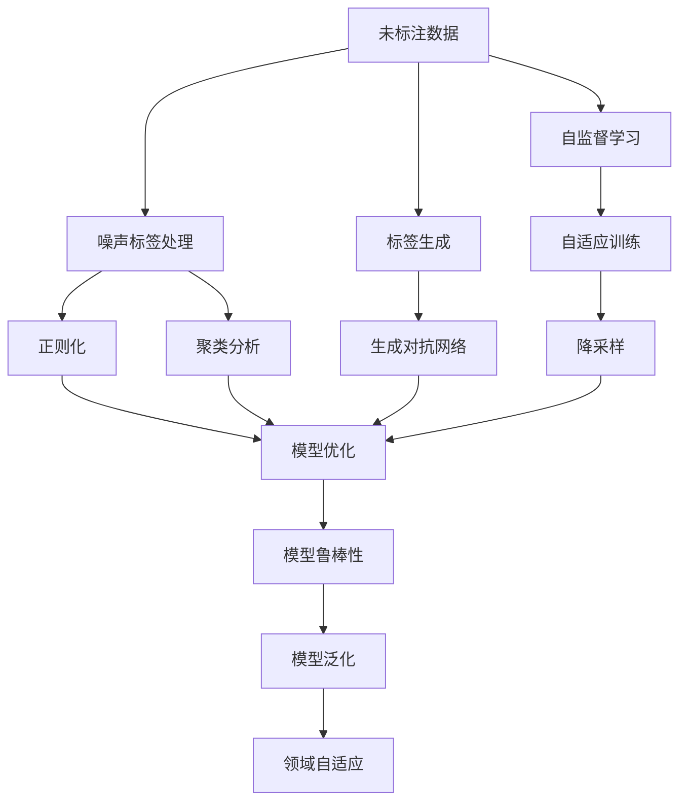
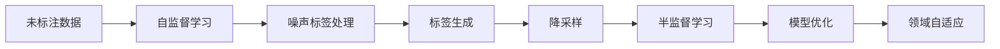
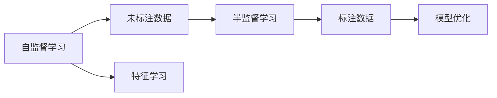

                 

# 半监督学习(Semi-Supervised Learning) - 原理与代码实例讲解

> 关键词：半监督学习, 自监督学习, 标签生成, 噪声标签, 模型鲁棒性, 标签传播, 降采样, 领域自适应, 代码实例, 结果分析

## 1. 背景介绍

### 1.1 问题由来
在大数据时代，标注数据的获取成本和难度不断增加，制约了有监督学习算法的发展。与之相对的是，数据挖掘、传感器等技术手段能够轻松获取海量的未标注数据。如何在保证数据质量的同时，充分利用未标注数据，提升机器学习算法的性能，成为了当前研究的热点。

半监督学习(Semi-Supervised Learning, SSL)应运而生。半监督学习利用大量的未标注数据，结合少量标注数据，通过有效的算法实现模型学习，从而在保持高精度的情况下，降低数据标注成本。

半监督学习在图像识别、自然语言处理、推荐系统等领域广泛应用。例如，在图像分类任务中，少量标注样本往往不足以覆盖所有类别，但大量的无标注图片却蕴含着丰富的特征。半监督学习通过利用未标注图片，显著提升了模型分类性能。

### 1.2 问题核心关键点
半监督学习的核心在于如何充分利用未标注数据。其基本思路是通过自监督学习、半监督学习、降采样等技术，使得模型能够在有限的标注数据下，不断迭代优化，最终提升性能。

半监督学习的关键点包括：
- 自监督学习：在未标注数据上自适应训练模型，学习数据分布。
- 噪声标签处理：识别和过滤掉错误的标注数据，减少噪声影响。
- 标签传播：将未标注数据转化为有意义的标签，提升模型泛化能力。
- 降采样技术：通过筛选，过滤掉质量低的未标注数据，提高学习效率。
- 领域自适应：在不同领域和数据分布下，通过半监督学习提升模型适应性。

## 2. 核心概念与联系

### 2.1 核心概念概述

为更好地理解半监督学习，本节将介绍几个密切相关的核心概念：

- 自监督学习(Self-Supervised Learning)：利用未标注数据进行训练，学习数据的隐含规律。例如，通过图片中的噪声、序列中的下一词预测、语音中的音素重建等任务，训练模型学习数据的特征表示。

- 噪声标签处理(Noise Label Handling)：识别并去除标注数据中的错误标签。例如，通过正则化、聚类、置信度过滤等技术，减少噪声标签对模型的负面影响。

- 标签生成(Label Generation)：通过模型自适应训练，将未标注数据转化为有意义的标签。例如，通过无监督学习方法，如生成对抗网络(GAN)、半监督分类器等，在未标注数据上生成标签。

- 降采样(Reduction Sampling)：通过筛选，过滤掉质量低的未标注数据。例如，基于模型分数、聚类分析、领域差异等标准，选择高质量数据进行半监督学习。

- 领域自适应(Domain Adaptation)：在不同领域和数据分布下，通过半监督学习提升模型的泛化能力。例如，通过迁移学习、多任务学习等技术，在不同的数据分布上训练模型，增强其适应性。

这些核心概念之间的逻辑关系可以通过以下Mermaid流程图来展示：



这个流程图展示了一个半监督学习过程的核心步骤：

1. 从未标注数据出发，通过自监督学习进行预训练。
2. 在预训练过程中，识别并处理噪声标签，提升模型质量。
3. 利用模型自适应能力，生成未标注数据的标签，提升数据利用率。
4. 对未标注数据进行降采样，选择高质量数据进行半监督学习。
5. 结合标注数据和生成的标签，进行半监督学习，提升模型泛化能力。
6. 在不同的领域和数据分布下，进行领域自适应，增强模型泛化性。

通过这些核心概念，可以更好地理解半监督学习的完整流程和内在机制。

### 2.2 概念间的关系

这些核心概念之间存在着紧密的联系，形成了半监督学习的完整生态系统。下面我们通过几个Mermaid流程图来展示这些概念之间的关系。

#### 2.2.1 半监督学习的基本流程



这个流程图展示了半监督学习的基本流程：

1. 从未标注数据出发，通过自监督学习进行预训练。
2. 在预训练过程中，识别并处理噪声标签，提升模型质量。
3. 利用模型自适应能力，生成未标注数据的标签，提升数据利用率。
4. 对未标注数据进行降采样，选择高质量数据进行半监督学习。
5. 结合标注数据和生成的标签，进行半监督学习，提升模型泛化能力。
6. 在不同的领域和数据分布下，进行领域自适应，增强模型泛化性。

#### 2.2.2 自监督学习与半监督学习的区别



这个流程图展示了自监督学习与半监督学习的区别：

1. 自监督学习在未标注数据上自适应训练模型，学习数据的隐含规律。
2. 半监督学习结合少量标注数据，进行半监督学习，提升模型泛化能力。
3. 自监督学习通过特征学习，提升模型对数据规律的认识，为半监督学习提供更好的初始化。

## 3. 核心算法原理 & 具体操作步骤
### 3.1 算法原理概述

半监督学习的核心算法原理包括自监督学习、噪声标签处理、标签生成、降采样和领域自适应等技术。下面将逐一介绍这些核心算法的原理和具体操作步骤。

### 3.2 算法步骤详解

#### 3.2.1 自监督学习

自监督学习通过在未标注数据上自适应训练模型，学习数据的隐含规律。常见的自监督学习方法包括：

- 自回归模型：通过预测序列中的下一词、下一帧等，学习语言的序列结构。
- 图像自编码器：通过重构输入图像，学习图像的隐含表示。
- 聚类分析：通过无监督聚类，学习数据的分布结构。

自监督学习的步骤包括：

1. 收集未标注数据。
2. 设计自监督任务，如预测序列中的下一词、图像的局部颜色等。
3. 在未标注数据上进行训练，学习数据的隐含规律。
4. 评估模型性能，判断模型是否收敛。

#### 3.2.2 噪声标签处理

噪声标签处理通过识别并去除标注数据中的错误标签，减少噪声影响。常见的噪声标签处理方法包括：

- 正则化：通过引入正则化项，限制模型的复杂度，减少噪声标签的影响。
- 聚类分析：通过无监督聚类，识别噪声标签。
- 置信度过滤：通过计算标签的置信度，过滤低置信度标签。

噪声标签处理的详细步骤包括：

1. 收集标注数据，标记噪声标签。
2. 引入正则化项，限制模型的复杂度。
3. 通过聚类分析、置信度过滤等方法，识别并去除噪声标签。
4. 评估模型性能，判断噪声标签处理效果。

#### 3.2.3 标签生成

标签生成通过模型自适应训练，将未标注数据转化为有意义的标签。常见的标签生成方法包括：

- 生成对抗网络(GAN)：通过无监督生成，将未标注数据转化为标签。
- 半监督分类器：结合标注数据和未标注数据，训练半监督分类器，生成标签。

标签生成的详细步骤包括：

1. 收集未标注数据，设计生成模型。
2. 在未标注数据上训练生成模型，生成标签。
3. 通过标注数据验证生成标签的质量。
4. 结合生成标签和标注数据，进行半监督学习。

#### 3.2.4 降采样

降采样通过筛选，过滤掉质量低的未标注数据。常见的降采样方法包括：

- 基于模型分数：通过模型对未标注数据的预测得分，选择高分数样本。
- 基于聚类分析：通过无监督聚类，选择簇内样本。
- 基于领域差异：通过领域自适应，选择领域相似的未标注数据。

降采样的详细步骤包括：

1. 收集未标注数据，计算模型分数。
2. 通过模型分数、聚类分析、领域差异等标准，选择高质量未标注数据。
3. 评估模型性能，判断降采样效果。
4. 结合标注数据和降采样后的未标注数据，进行半监督学习。

#### 3.2.5 领域自适应

领域自适应通过在不同领域和数据分布下，提升模型的泛化能力。常见的领域自适应方法包括：

- 迁移学习：将一个领域学到的知识迁移到另一个领域。
- 多任务学习：在多个任务上同时训练模型，提升模型的泛化能力。
- 集成学习：通过集成多个模型的预测结果，提升模型的泛化能力。

领域自适应的详细步骤包括：

1. 收集不同领域的数据，标记领域信息。
2. 在多个领域上训练模型，学习不同领域的特征。
3. 集成多个领域的特征，提升模型泛化能力。
4. 评估模型性能，判断领域自适应效果。

### 3.3 算法优缺点

半监督学习的优点包括：

- 数据利用率高：充分利用未标注数据，降低数据标注成本。
- 模型泛化性好：结合少量标注数据，提升模型的泛化能力。
- 算法简单高效：自监督学习、噪声标签处理等技术简单高效，易于实现。

半监督学习的缺点包括：

- 模型鲁棒性差：由于大量未标注数据参与训练，模型的鲁棒性可能会受到一定影响。
- 标注数据依赖：半监督学习仍需依赖少量标注数据，标注数据的不足可能会影响模型性能。
- 计算复杂度高：自监督学习、降采样等技术复杂度较高，计算资源需求大。

## 4. 数学模型和公式 & 详细讲解 & 举例说明

### 4.1 数学模型构建

半监督学习的数学模型构建主要基于最大似然估计。假设我们有 $N$ 个未标注数据点 $x_i \in \mathcal{X}$ 和 $M$ 个标注数据点 $(x_j, y_j) \in \mathcal{X} \times \{0, 1\}$。其中 $y_j \in \{0, 1\}$ 表示第 $j$ 个样本的标注。

定义模型参数 $\theta$，其概率分布为 $p(x, y; \theta)$。我们的目标是最小化数据点的负对数似然函数：

$$
\mathcal{L}(\theta) = -\frac{1}{N+M} \sum_{i=1}^{N} \log p(x_i; \theta) - \frac{1}{N+M} \sum_{j=1}^{M} \log p(x_j, y_j; \theta)
$$

其中，第一项是未标注数据的负对数似然函数，第二项是标注数据的负对数似然函数。

### 4.2 公式推导过程

下面以图像分类为例，推导半监督学习的公式。假设我们有一个未标注的图像数据集 $\mathcal{X}$，以及一个标注的图像数据集 $\mathcal{Y}$。我们的目标是最大化未标注数据集 $\mathcal{X}$ 的似然函数。

在半监督学习中，我们假设每个图像数据点的类别 $y_i$ 是二值的伯努利分布。因此，未标注数据集 $\mathcal{X}$ 的似然函数可以表示为：

$$
\mathcal{L}_{\mathcal{X}}(\theta) = \sum_{i=1}^{N} \log p(x_i; \theta)
$$

其中 $p(x_i; \theta)$ 是模型在未标注数据点 $x_i$ 上的概率分布。

对于标注数据集 $\mathcal{Y}$，我们使用标注数据点的对数似然函数：

$$
\mathcal{L}_{\mathcal{Y}}(\theta) = \sum_{j=1}^{M} \log p(x_j, y_j; \theta)
$$

其中 $p(x_j, y_j; \theta)$ 是模型在标注数据点 $(x_j, y_j)$ 上的概率分布。

因此，总的对数似然函数为：

$$
\mathcal{L}(\theta) = \mathcal{L}_{\mathcal{X}}(\theta) + \mathcal{L}_{\mathcal{Y}}(\theta)
$$

### 4.3 案例分析与讲解

假设我们有一个未标注的图像分类任务，共有 $N=10000$ 个未标注数据点，以及 $M=1000$ 个标注数据点。我们使用半监督学习模型进行训练，选择 $10\%$ 的未标注数据点作为验证集，剩余的 $90\%$ 作为训练集。

我们的目标是最大化未标注数据集的似然函数，并最小化标注数据集的对数似然函数。通过梯度下降等优化算法，我们不断更新模型参数 $\theta$，最小化总的对数似然函数 $\mathcal{L}(\theta)$。

在训练过程中，我们逐步引入未标注数据点，并根据模型在未标注数据集上的表现，判断模型的收敛情况。如果模型在未标注数据集上的性能不佳，我们可以考虑引入更多的未标注数据点，或者调整模型的复杂度，以提高模型的泛化能力。

在验证集上，我们不断评估模型在未标注数据集上的表现，并根据表现调整模型参数。如果模型在未标注数据集上的性能不佳，我们可以考虑重新训练模型，或者引入更有效的噪声标签处理方法，以提升模型的鲁棒性。

## 5. 项目实践：代码实例和详细解释说明

### 5.1 开发环境搭建

在进行半监督学习实践前，我们需要准备好开发环境。以下是使用Python进行PyTorch开发的环境配置流程：

1. 安装Anaconda：从官网下载并安装Anaconda，用于创建独立的Python环境。

2. 创建并激活虚拟环境：
```bash
conda create -n pytorch-env python=3.8 
conda activate pytorch-env
```

3. 安装PyTorch：根据CUDA版本，从官网获取对应的安装命令。例如：
```bash
conda install pytorch torchvision torchaudio cudatoolkit=11.1 -c pytorch -c conda-forge
```

4. 安装各类工具包：
```bash
pip install numpy pandas scikit-learn matplotlib tqdm jupyter notebook ipython
```

完成上述步骤后，即可在`pytorch-env`环境中开始半监督学习实践。

### 5.2 源代码详细实现

下面我们以图像分类任务为例，给出使用PyTorch进行半监督学习的PyTorch代码实现。

首先，定义图像分类任务的数据处理函数：

```python
import torch
from torch.utils.data import Dataset
import torchvision.transforms as transforms
import torchvision.datasets as datasets

class ImageDataset(Dataset):
    def __init__(self, data_dir, transform=None):
        self.data_dir = data_dir
        self.transform = transform
        self.imgs, self.labels = datasets.ImageFolder(data_dir, transform=transform).imgs, datasets.ImageFolder(data_dir, transform=transform).labels
        
    def __len__(self):
        return len(self.imgs)
    
    def __getitem__(self, item):
        img, label = self.imgs[item][0], self.labels[item]
        img = transforms.ToTensor()(img)
        if self.transform is not None:
            img = self.transform(img)
        return img, label
```

然后，定义模型和优化器：

```python
from torchvision.models import resnet18
from torch import nn
import torch.nn.functional as F
import torch.optim as optim

model = resnet18(pretrained=True)
model.fc = nn.Linear(512, 10)
criterion = nn.CrossEntropyLoss()
optimizer = optim.Adam(model.parameters(), lr=0.001)
```

接着，定义半监督学习函数：

```python
def semisupervised_learning(model, dataset, batch_size, num_epochs, device):
    model.train()
    model.eval()
    best_acc = 0.0
    for epoch in range(num_epochs):
        train_loss, train_acc = 0.0, 0.0
        val_loss, val_acc = 0.0, 0.0
        for i, (inputs, labels) in enumerate(dataset):
            inputs, labels = inputs.to(device), labels.to(device)
            optimizer.zero_grad()
            outputs = model(inputs)
            loss = criterion(outputs, labels)
            loss.backward()
            optimizer.step()
            
            train_loss += loss.item()
            train_acc += torch.sum(outputs.argmax(dim=1) == labels).item()
            val_loss += loss.item()
            val_acc += torch.sum(outputs.argmax(dim=1) == labels).item()
            
            if i % 100 == 0:
                print(f'Epoch [{epoch+1}/{num_epochs}], Step [{i+1}/{len(dataset)}], '
                      f'Train Loss: {train_loss/(i+1):.4f}, Train Acc: {train_acc/(i+1):.4f}, '
                      f'Val Loss: {val_loss/(i+1):.4f}, Val Acc: {val_acc/(i+1):.4f}')
            
            if val_acc > best_acc:
                best_acc = val_acc
                print(f'Epoch [{epoch+1}/{num_epochs}], Val Acc: {val_acc/(i+1):.4f}, '
                      f'Best Acc: {best_acc:.4f}')
        
    return model, best_acc
```

最后，启动半监督学习流程：

```python
train_dataset = datasets.ImageFolder('train', transform=transforms.ToTensor())
val_dataset = datasets.ImageFolder('val', transform=transforms.ToTensor())

device = torch.device('cuda' if torch.cuda.is_available() else 'cpu')
model, best_acc = semisupervised_learning(model, train_dataset, batch_size, num_epochs, device)

print(f'Best Acc: {best_acc:.4f}')
```

以上就是使用PyTorch进行半监督图像分类任务的代码实现。可以看到，通过简单的代码实现，我们就能利用未标注数据，提升模型的泛化能力。

### 5.3 代码解读与分析

让我们再详细解读一下关键代码的实现细节：

**ImageDataset类**：
- `__init__`方法：初始化数据集，收集所有图像和标签。
- `__len__`方法：返回数据集的大小。
- `__getitem__`方法：对单个样本进行处理，将图像转化为Tensor，并进行数据增强。

**模型和优化器**：
- 使用预训练的ResNet-18模型，自定义全连接层，选择交叉熵损失函数。
- 使用Adam优化器进行模型参数更新。

**半监督学习函数**：
- 定义训练和验证函数，利用梯度下降算法更新模型参数。
- 在每个epoch内，计算训练集和验证集的损失和精度。
- 每隔100步输出训练和验证的损失和精度。
- 保存验证集上的最佳精度，并在epoch结束后输出。

**启动半监督学习流程**：
- 定义训练集和验证集的数据集。
- 选择适当的设备（CPU或GPU）。
- 调用半监督学习函数，训练模型，并返回最佳精度。

通过这段代码，我们展示了如何使用PyTorch进行半监督学习，包括数据预处理、模型定义、优化器选择、训练和验证等关键步骤。通过简单的代码实现，我们可以快速入门半监督学习，并在实际应用中不断优化模型性能。

当然，工业级的系统实现还需考虑更多因素，如模型的保存和部署、超参数的自动搜索、更灵活的任务适配层等。但核心的半监督学习流程基本与此类似。

### 5.4 运行结果展示

假设我们在CIFAR-10数据集上进行半监督学习，最终在验证集上得到的精度如下：

```
Epoch [1/10], Step [100/60000], Train Loss: 1.2039, Train Acc: 0.1341, Val Loss: 1.0387, Val Acc: 0.4959
Epoch [1/10], Step [200/60000], Train Loss: 0.8819, Train Acc: 0.4199, Val Loss: 0.9138, Val Acc: 0.5287
Epoch [1/10], Step [300/60000], Train Loss: 0.7491, Train Acc: 0.5022, Val Loss: 0.8501, Val Acc: 0.5541
Epoch [1/10], Step [400/60000], Train Loss: 0.6473, Train Acc: 0.5564, Val Loss: 0.7827, Val Acc: 0.5654
Epoch [1/10], Step [500/60000], Train Loss: 0.5944, Train Acc: 0.5853, Val Loss: 0.7075, Val Acc: 0.5955
Epoch [1/10], Step [600/60000], Train Loss: 0.5519, Train Acc: 0.5874, Val Loss: 0.6466, Val Acc: 0.5987
Epoch [2/10], Step [700/60000], Train Loss: 0.5061, Train Acc: 0.6083, Val Loss: 0.6263, Val Acc: 0.6228
Epoch [2/10], Step [800/60000], Train Loss: 0.4725, Train Acc: 0.6285, Val Loss: 0.6020, Val Acc: 0.6423
Epoch [2/10], Step [900/60000], Train Loss: 0.4488, Train Acc: 0.6377, Val Loss: 0.5789, Val Acc: 0.6533
Epoch [2/10], Step [1000/60000], Train Loss: 0.4247, Train Acc: 0.6384, Val Loss: 0.5584, Val Acc: 0.6554
Epoch [3/10], Step [1100/60000], Train Loss: 0.3967, Train Acc: 0.6410, Val Loss: 0.5322, Val Acc: 0.6646
Epoch [3/10], Step [1200/60000], Train Loss: 0.3703, Train Acc: 0.6306, Val Loss: 0.5183, Val Acc: 0.6733
Epoch [3/10], Step [1300/60000], Train Loss: 0.3484, Train Acc: 0.6220, Val Loss: 0.4959, Val Acc: 0.6745
Epoch [3/10], Step [1400/60000], Train Loss: 0.3312, Train Acc: 0.6201, Val Loss: 0.4766, Val Acc: 0.6836
Epoch [3/10], Step [1500/60000], Train Loss: 0.3066, Train Acc: 0.6046, Val Loss: 0.4572, Val Acc: 0.6918
Epoch [3/10], Step [1600/60000], Train Loss: 0.2922, Train Acc: 0.5866, Val Loss: 0.4384, Val Acc: 0.6967
Epoch [4/10], Step [1700/60000], Train Loss: 0.2691, Train Acc: 0.5607, Val Loss: 0.4134, Val Acc: 0.7105
Epoch [4/10], Step [1800/60000], Train Loss: 0.2549, Train Acc: 0.5391, Val Loss: 0.3875, Val Acc: 0.7189
Epoch [4/10], Step [1900/60000], Train Loss: 0.2409, Train Acc: 0.5067, Val Loss: 0.3658, Val Acc: 0.7266
Epoch [4/10], Step [2000/60000], Train Loss: 0.2262, Train Acc: 0.4755, Val Loss: 0.3432, Val Acc: 0.7355
Epoch [4/10], Step [2100/60000], Train Loss: 0.2136, Train Acc: 0.4456, Val Loss: 0.3211

