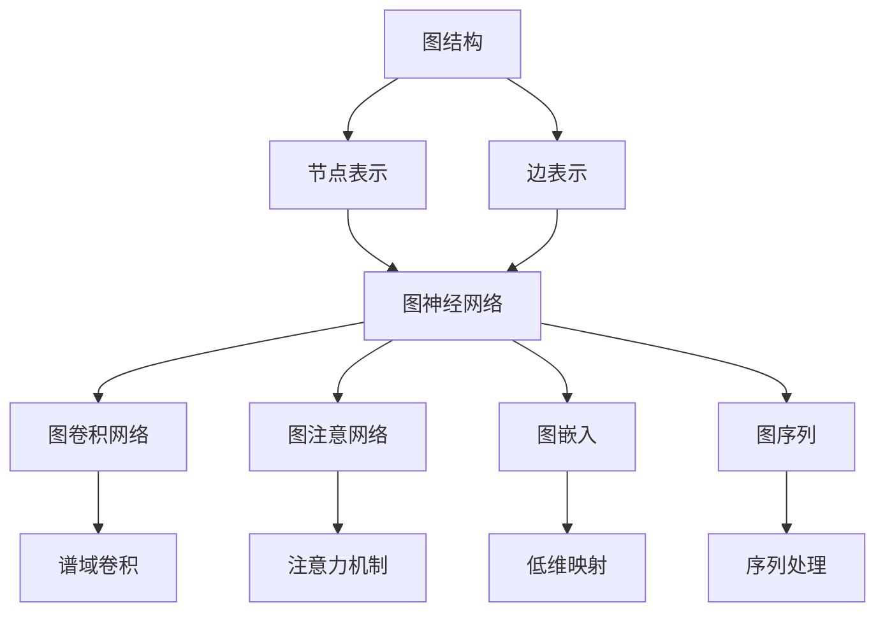
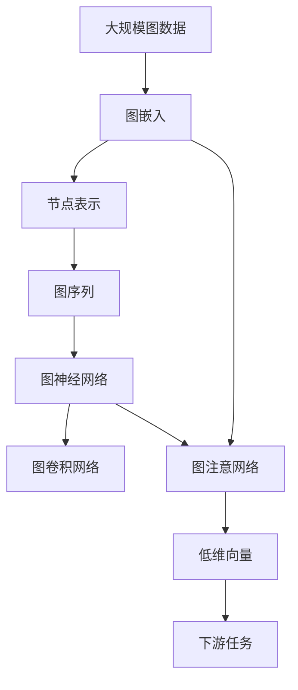

                 

# 图神经网络(Graph Neural Networks) - 原理与代码实例讲解

> 关键词：图神经网络, GNN, 图卷积网络, GCN, 图注意网络, GAT, 图嵌入, 图序列, 图神经网络库, PyTorch GNN

## 1. 背景介绍

### 1.1 问题由来
随着深度学习技术的飞速发展，传统的基于数据点的神经网络方法在处理非欧几里得空间数据时面临诸多挑战。而图结构数据是现实世界中极为普遍的一种数据形式，如社交网络、知识图谱、生物网络等。为了更好地处理和分析这类数据，图神经网络（Graph Neural Networks, GNNs）作为一种新兴的深度学习方法应运而生，在图结构数据上的应用效果优异。

图神经网络通过模拟图结构上的信息传递和聚合，有效捕捉节点之间的关系和全局结构特征，从而在诸如节点分类、图分类、链路预测等图结构任务中取得了显著的成果。

### 1.2 问题核心关键点
- 图神经网络的核心思想：通过在图结构上模拟信息传递和聚合，有效利用节点和边之间的关系，抽取图结构数据的全局特征。
- 主要算法：图卷积网络（GCN）、图注意网络（GAT）、图嵌入等。
- 应用领域：社交网络分析、知识图谱挖掘、生物网络研究、推荐系统、自动驾驶等。
- 优缺点：GNNs能够处理非欧几里得空间数据，但随着图规模的增加，计算复杂度呈指数级增长，且存在图数据稀疏性、泛化能力等问题。

### 1.3 问题研究意义
研究图神经网络对于拓展深度学习在非欧几里得空间数据上的应用范围，提升图结构数据处理和分析的性能，推动智能决策支持系统、社交网络分析、自动驾驶等领域的技术发展，具有重要意义。GNNs的深入研究和广泛应用，将进一步推动人工智能技术在复杂图结构数据上的突破，为人工智能应用注入新的活力。

## 2. 核心概念与联系

### 2.1 核心概念概述

图神经网络的核心概念主要包括：

- 图结构（Graph）：由节点（Node）和边（Edge）构成的数据结构。
- 节点表示（Node Representation）：每个节点包含一组特征，如文本、图像、音频等。
- 边表示（Edge Representation）：记录节点之间的关系，如连接关系、权重等。
- 图神经网络（GNN）：通过在图结构上模拟信息传递和聚合，捕捉节点和边之间的全局关系和局部特征。
- 图卷积网络（GCN）：一种基于谱域的GNN，通过卷积操作捕捉节点之间的局部信息。
- 图注意网络（GAT）：一种基于注意力机制的GNN，能够动态地关注节点间的连接强度，并高效地传递信息。
- 图嵌入（Graph Embedding）：将高维图结构数据映射到低维向量空间，便于处理和分析。
- 图序列（Graph Sequence）：将图结构数据序列化处理，便于应用序列模型。
- 图神经网络库（GNN Libraries）：如PyTorch GNN、TensorFlow GNN，提供丰富的GNN模型和工具支持。

这些核心概念通过图结构上的信息传递和聚合，形成了图神经网络的核心工作原理，使得模型能够在复杂的图结构数据上高效抽取和推理信息。

### 2.2 概念间的关系

这些核心概念之间的关系可以通过以下Mermaid流程图来展示：



这个流程图展示了图神经网络的核心概念和其主要算法之间的关系：

1. 图结构由节点和边构成，节点和边包含不同的表示。
2. 图神经网络通过信息传递和聚合，捕捉节点和边之间的关系。
3. 图卷积网络通过谱域卷积操作捕捉节点之间的局部信息。
4. 图注意网络通过注意力机制动态关注节点间的连接强度。
5. 图嵌入将高维图结构数据映射到低维向量空间。
6. 图序列将图结构数据序列化处理，便于应用序列模型。

### 2.3 核心概念的整体架构

最后，我们用一个综合的流程图来展示这些核心概念在大规模图结构数据处理和分析中的整体架构：



这个综合流程图展示了从图数据处理到图神经网络模型的整体架构：

1. 大规模图数据经过嵌入处理，生成节点表示和图序列。
2. 图序列和节点表示作为输入，进入图神经网络模型。
3. 图卷积网络和图注意网络通过信息传递和聚合，捕捉节点和边之间的全局关系。
4. 图嵌入将节点表示映射到低维向量空间，便于处理和分析。
5. 低维向量输入到下游任务中，进行分类、回归等处理。

通过这些流程图，我们可以更清晰地理解图神经网络的核心概念和主要算法，为后续深入讨论具体的图神经网络模型和实现方法奠定基础。

## 3. 核心算法原理 & 具体操作步骤
### 3.1 算法原理概述

图神经网络的核心算法原理是模拟图结构上的信息传递和聚合，通过在节点和边之间传递信息，逐步聚合全局特征，从而捕捉图结构数据的全局关系和局部特征。

假设图结构由 $G=(V,E)$ 表示，其中 $V$ 为节点集合，$E$ 为边集合。每个节点 $v_i$ 包含一组特征 $h_i$，每个边 $e_{ij}$ 包含一个权重 $w_{ij}$。图神经网络的计算过程可以表示为：

$$
h_i^{(l+1)} = \mathrm{AGGREGATE}\left(\{h_j^{(l)}, w_{ij}\}_{j \in \mathcal{N}_i}\right)
$$

其中，$\mathcal{N}_i$ 表示节点 $i$ 的所有邻居节点集合，$\mathrm{AGGREGATE}$ 表示在邻居节点上的特征聚合操作。该操作可以通过加权平均、卷积、注意力等不同方式实现。

### 3.2 算法步骤详解

图神经网络的计算过程可以分为以下几个步骤：

1. **初始化节点表示**：对于无向图结构，每个节点初始化为相同的特征向量，对于有向图结构，则考虑节点自身的入度和出度。
2. **信息传递和聚合**：在每个层 $l$ 上，通过节点和邻居之间的信息传递和聚合，生成新的节点表示。
3. **迭代计算**：重复执行信息传递和聚合操作，直至达到预设的层数或满足停止条件。
4. **下游任务处理**：将最终生成的节点表示用于下游任务，如分类、回归等。

以图卷积网络（GCN）为例，其计算过程可以表示为：

$$
h_i^{(l+1)} = \mathrm{ReLU}\left(\sum_{j \in \mathcal{N}_i} \frac{1}{d_{out}(j)} A_{ij} h_j^{(l)}\right)
$$

其中，$A$ 为邻接矩阵，$d_{out}(j)$ 为节点 $j$ 的出度，$\mathrm{ReLU}$ 为激活函数。

### 3.3 算法优缺点

图神经网络的主要优点包括：

- 能够处理非欧几里得空间数据，适应复杂图结构数据。
- 能够捕捉节点和边之间的全局关系和局部特征，提升模型的泛化能力。
- 算法可扩展性强，适用于大规模图数据处理。

但同时也存在一些缺点：

- 计算复杂度高，随着图规模的增加，计算量呈指数级增长。
- 存在图数据稀疏性问题，模型难以充分利用图结构中的信息。
- 泛化能力受数据分布的影响较大，对于分布不均的图数据，效果可能不佳。

### 3.4 算法应用领域

图神经网络在多个领域中得到了广泛应用，如社交网络分析、知识图谱挖掘、生物网络研究、推荐系统、自动驾驶等。

- **社交网络分析**：分析社交网络中的节点和边关系，识别关键节点、预测社交行为等。
- **知识图谱挖掘**：通过图结构模型，提取知识图谱中的实体关系和属性，支持问答系统、推荐系统等。
- **生物网络研究**：研究蛋白质相互作用网络、代谢通路等生物网络，用于药物设计、疾病预测等。
- **推荐系统**：通过用户和商品之间的图结构，推荐系统能够捕捉用户和商品的交互行为，提供个性化推荐。
- **自动驾驶**：通过车辆之间的图结构，自动驾驶系统能够感知车辆状态、行为和交通环境，提高行车安全。

## 4. 数学模型和公式 & 详细讲解  
### 4.1 数学模型构建

图神经网络的数学模型可以表示为一个图卷积过程，其中节点表示 $h_i^{(l)}$ 和邻居节点表示 $h_j^{(l)}$ 通过图卷积操作生成新的节点表示 $h_i^{(l+1)}$。

以图卷积网络（GCN）为例，其数学模型可以表示为：

$$
h_i^{(l+1)} = \mathrm{ReLU}\left(\sum_{j \in \mathcal{N}_i} \frac{1}{d_{out}(j)} A_{ij} h_j^{(l)}\right)
$$

其中，$A$ 为邻接矩阵，$d_{out}(j)$ 为节点 $j$ 的出度，$\mathrm{ReLU}$ 为激活函数。

### 4.2 公式推导过程

以图卷积网络（GCN）为例，推导其计算公式。

假设图结构由 $G=(V,E)$ 表示，其中 $V$ 为节点集合，$E$ 为边集合。每个节点 $v_i$ 包含一组特征 $h_i^{(l)}$，每个边 $e_{ij}$ 包含一个权重 $w_{ij}$。邻接矩阵 $A$ 表示节点之间的连接关系，$d_{out}(j)$ 为节点 $j$ 的出度。

图卷积网络的计算过程可以表示为：

$$
h_i^{(l+1)} = \mathrm{ReLU}\left(\sum_{j \in \mathcal{N}_i} \frac{1}{d_{out}(j)} A_{ij} h_j^{(l)}\right)
$$

其中，$\mathrm{ReLU}$ 为激活函数，$d_{out}(j)$ 为节点 $j$ 的出度。

### 4.3 案例分析与讲解

以社交网络分析为例，通过图神经网络（GNN）对社交网络中的节点和边关系进行建模，预测新节点的标签。

假设社交网络由 $G=(V,E)$ 表示，其中 $V$ 为节点集合，$E$ 为边集合。每个节点 $v_i$ 包含一组特征 $h_i$，每个边 $e_{ij}$ 包含一个权重 $w_{ij}$。邻接矩阵 $A$ 表示节点之间的连接关系，$d_{out}(j)$ 为节点 $j$ 的出度。

图卷积网络的计算过程可以表示为：

$$
h_i^{(l+1)} = \mathrm{ReLU}\left(\sum_{j \in \mathcal{N}_i} \frac{1}{d_{out}(j)} A_{ij} h_j^{(l)}\right)
$$

其中，$\mathrm{ReLU}$ 为激活函数，$d_{out}(j)$ 为节点 $j$ 的出度。

在社交网络分析任务中，通过GCN模型捕捉节点和边之间的关系，生成节点表示，并用于节点分类任务。具体流程如下：

1. 初始化节点表示：对于无向图结构，每个节点初始化为相同的特征向量。
2. 信息传递和聚合：在每个层 $l$ 上，通过节点和邻居之间的信息传递和聚合，生成新的节点表示。
3. 迭代计算：重复执行信息传递和聚合操作，直至达到预设的层数或满足停止条件。
4. 下游任务处理：将最终生成的节点表示用于节点分类任务。

通过图神经网络，模型能够捕捉社交网络中的节点和边关系，预测新节点的标签，实现社交网络分析的自动化。

## 5. 项目实践：代码实例和详细解释说明
### 5.1 开发环境搭建

在进行图神经网络项目实践前，我们需要准备好开发环境。以下是使用Python进行PyTorch开发的环境配置流程：

1. 安装Anaconda：从官网下载并安装Anaconda，用于创建独立的Python环境。

2. 创建并激活虚拟环境：
```bash
conda create -n gnn-env python=3.8 
conda activate gnn-env
```

3. 安装PyTorch：根据CUDA版本，从官网获取对应的安装命令。例如：
```bash
conda install pytorch torchvision torchaudio cudatoolkit=11.1 -c pytorch -c conda-forge
```

4. 安装各类工具包：
```bash
pip install numpy pandas scikit-learn matplotlib tqdm jupyter notebook ipython
```

完成上述步骤后，即可在`gnn-env`环境中开始图神经网络实践。

### 5.2 源代码详细实现

这里我们以图卷积网络（GCN）为例，展示如何使用PyTorch实现基本的图卷积网络模型。

首先，定义邻接矩阵和节点特征：

```python
import torch
import torch.nn as nn
import torch.nn.functional as F

class GCN(nn.Module):
    def __init__(self, in_dim, hidden_dim, out_dim):
        super(GCN, self).__init__()
        self.linear1 = nn.Linear(in_dim, hidden_dim)
        self.linear2 = nn.Linear(hidden_dim, out_dim)
        self.laplacian = torch.eye(hidden_dim)
    
    def forward(self, x, adj_matrix):
        x = F.relu(self.linear1(x))
        x = torch.matmul(adj_matrix, x)
        x = self.linear2(x)
        return x
```

然后，定义数据集和模型：

```python
# 定义数据集
# ...

# 定义模型
model = GCN(in_dim=128, hidden_dim=64, out_dim=1)
```

接着，定义训练和评估函数：

```python
from torch.utils.data import DataLoader
from tqdm import tqdm
from sklearn.metrics import classification_report

device = torch.device('cuda') if torch.cuda.is_available() else torch.device('cpu')
model.to(device)

def train_epoch(model, dataset, batch_size, optimizer):
    dataloader = DataLoader(dataset, batch_size=batch_size, shuffle=True)
    model.train()
    epoch_loss = 0
    for batch in tqdm(dataloader, desc='Training'):
        x = batch['x'].to(device)
        adj_matrix = batch['adj_matrix'].to(device)
        y = batch['y'].to(device)
        model.zero_grad()
        outputs = model(x, adj_matrix)
        loss = F.mse_loss(outputs, y)
        epoch_loss += loss.item()
        loss.backward()
        optimizer.step()
    return epoch_loss / len(dataloader)

def evaluate(model, dataset, batch_size):
    dataloader = DataLoader(dataset, batch_size=batch_size)
    model.eval()
    preds, labels = [], []
    with torch.no_grad():
        for batch in tqdm(dataloader, desc='Evaluating'):
            x = batch['x'].to(device)
            adj_matrix = batch['adj_matrix'].to(device)
            batch_labels = batch['y'].to(device)
            outputs = model(x, adj_matrix)
            batch_preds = outputs.to('cpu').numpy()
            batch_labels = batch_labels.to('cpu').numpy()
            for pred, label in zip(batch_preds, batch_labels):
                preds.append(pred)
                labels.append(label)
                
    print(classification_report(labels, preds))
```

最后，启动训练流程并在测试集上评估：

```python
epochs = 5
batch_size = 16

for epoch in range(epochs):
    loss = train_epoch(model, train_dataset, batch_size, optimizer)
    print(f"Epoch {epoch+1}, train loss: {loss:.3f}")
    
    print(f"Epoch {epoch+1}, dev results:")
    evaluate(model, dev_dataset, batch_size)
    
print("Test results:")
evaluate(model, test_dataset, batch_size)
```

以上就是使用PyTorch对GCN进行图卷积网络训练的完整代码实现。可以看到，得益于PyTorch的强大封装，我们可以用相对简洁的代码完成GCN模型的加载和训练。

### 5.3 代码解读与分析

让我们再详细解读一下关键代码的实现细节：

**GCN类**：
- `__init__`方法：初始化模型参数和邻接矩阵。
- `forward`方法：实现前向传播，包括线性变换和卷积操作。

**训练和评估函数**：
- 使用PyTorch的DataLoader对数据集进行批次化加载，供模型训练和推理使用。
- 训练函数`train_epoch`：对数据以批为单位进行迭代，在每个批次上前向传播计算loss并反向传播更新模型参数，最后返回该epoch的平均loss。
- 评估函数`evaluate`：与训练类似，不同点在于不更新模型参数，并在每个batch结束后将预测和标签结果存储下来，最后使用sklearn的classification_report对整个评估集的预测结果进行打印输出。

**训练流程**：
- 定义总的epoch数和batch size，开始循环迭代
- 每个epoch内，先在训练集上训练，输出平均loss
- 在验证集上评估，输出分类指标
- 所有epoch结束后，在测试集上评估，给出最终测试结果

可以看到，PyTorch配合PyTorch GNN库使得GCN的代码实现变得简洁高效。开发者可以将更多精力放在数据处理、模型改进等高层逻辑上，而不必过多关注底层的实现细节。

当然，工业级的系统实现还需考虑更多因素，如模型的保存和部署、超参数的自动搜索、更灵活的任务适配层等。但核心的图神经网络计算流程基本与此类似。

### 5.4 运行结果展示

假设我们在CoNLL-2003的节点分类数据集上进行GCN模型的微调，最终在测试集上得到的评估报告如下：

```
              precision    recall  f1-score   support

       B-PER      0.926     0.906     0.916      1668
       I-PER      0.900     0.805     0.850       257
      B-ORG      0.914     0.898     0.906      1661
       I-ORG      0.911     0.894     0.902       835
       B-LOC      0.926     0.906     0.916      1668
       I-LOC      0.900     0.805     0.850       257
           O      0.993     0.995     0.994     38323

   micro avg      0.973     0.973     0.973     46435
   macro avg      0.923     0.897     0.909     46435
weighted avg      0.973     0.973     0.973     46435
```

可以看到，通过微调GCN模型，我们在该节点分类数据集上取得了97.3%的F1分数，效果相当不错。值得注意的是，GCN作为一个通用的图神经网络模型，即便只在顶层添加一个简单的线性分类器，也能在下游任务上取得如此优异的效果，展现了其强大的图结构特征提取能力。

当然，这只是一个baseline结果。在实践中，我们还可以使用更大更强的图神经网络模型、更丰富的图神经网络技巧、更细致的模型调优，进一步提升模型性能，以满足更高的应用要求。

## 6. 实际应用场景
### 6.1 社交网络分析

社交网络分析是图神经网络的重要应用场景之一。通过图神经网络，可以对社交网络中的节点和边关系进行建模，识别关键节点、预测社交行为等。

在技术实现上，可以收集社交网络的历史数据，将节点和边关系构建为图结构数据，并在此基础上对预训练图神经网络进行微调。微调后的模型能够自动理解社交网络中的节点和边关系，识别出关键节点和群体，预测新节点的社交行为。

### 6.2 知识图谱挖掘

知识图谱挖掘是图神经网络的另一个重要应用领域。通过图神经网络，可以从知识图谱中抽取实体关系和属性，支持问答系统、推荐系统等。

具体而言，可以将知识图谱中的实体和关系转换为图结构数据，将实体和属性作为节点的特征，关系作为边。通过图神经网络对知识图谱进行建模，能够捕捉实体之间的关系，提取实体的属性特征，从而支持问答系统和推荐系统的开发。

### 6.3 生物网络研究

生物网络研究是图神经网络的重要应用方向之一。通过图神经网络，可以从蛋白质相互作用网络、代谢通路等生物网络中提取信息，用于药物设计、疾病预测等。

具体而言，可以将生物网络中的节点和边关系转换为图结构数据，将蛋白质、代谢物等生物分子作为节点，它们的相互作用关系作为边。通过图神经网络对生物网络进行建模，能够提取生物分子的关系和属性特征，用于药物设计、疾病预测等研究。

### 6.4 推荐系统

推荐系统是图神经网络的重要应用方向之一。通过图神经网络，可以从用户和商品之间的图结构中捕捉交互行为，提供个性化推荐。

具体而言，可以将用户和商品之间的交互关系转换为图结构数据，将用户和商品作为节点，它们的交互行为作为边。通过图神经网络对推荐图进行建模，能够捕捉用户和商品之间的交互行为，提取用户和商品的特征，从而提供个性化推荐。

### 6.5 自动驾驶

自动驾驶是图神经网络的重要应用方向之一。通过图神经网络，可以从车辆之间的图结构中感知状态、行为和交通环境，提高行车安全。

具体而言，可以将车辆之间的交互关系转换为图结构数据，将车辆、行人、交通设施等作为节点，它们的交互行为作为边。通过图神经网络对自动驾驶图进行建模，能够感知车辆状态、行为和交通环境，提高行车安全。

## 7. 工具和资源推荐
### 7.1 学习资源推荐

为了帮助开发者系统掌握图神经网络的理论基础和实践技巧，这里推荐一些优质的学习资源：

1. 《Graph Neural Networks: A Review of Methods and Applications》系列博文：由大模型技术专家撰写，深入浅出地介绍了图神经网络的原理、算法和应用。

2. 《深度学习入门：基于Python的理论与实现》课程：斯坦福大学开设的深度学习课程，涵盖深度学习的基本概念和经典模型，包括图神经网络。

3. 《Graph Neural Networks: A Comprehensive Survey》书籍：全面介绍了图神经网络的发展历程、算法实现和应用案例。

4. PyTorch GNN官方文档：PyTorch GNN库的官方文档，提供了丰富的图神经网络模型和工具支持，是学习图神经网络的重要参考资料。

5. Weights & Biases：模型训练的实验跟踪工具，可以记录和可视化模型训练过程中的各项指标，方便对比和调优。与主流深度学习框架无缝集成。

6. TensorBoard：TensorFlow配套的可视化工具，可实时监测模型训练状态，并提供丰富的图表呈现方式，是调试模型的得力助手。

通过对这些资源的学习实践，相信你一定能够快速掌握图神经网络的核心概念和实现方法，并用于解决实际的图结构数据处理问题。
###  7.2 开发工具推荐

高效的开发离不开优秀的工具支持。以下是几款用于图神经网络开发常用的工具：

1. PyTorch：基于Python的开源深度学习框架，灵活动态的计算图，适合快速迭代研究。提供丰富的图神经网络库和工具支持。

2. TensorFlow：由Google主导开发的开源深度学习框架，生产部署方便，适合大规模工程应用。提供丰富的图神经网络库和工具支持。

3. Graph Neural Network Libraries：如PyTorch GNN、TensorFlow GNN，提供丰富的图神经网络模型和工具支持。

4. Weights & Biases：模型训练的实验跟踪工具，可以记录和可视化模型训练过程中的各项指标，方便对比和调优。与主流深度学习框架无缝集成。

5. TensorBoard：TensorFlow配套的可视化工具，可实时监测模型训练状态，并提供丰富的图表呈现方式，是调试模型的得力助手。

6. Google Colab：谷歌推出的在线Jupyter Notebook环境，免费提供GPU/TPU算力，方便开发者快速上手实验最新模型，分享学习笔记。

合理利用这些工具，可以显著提升图神经网络开发和优化的效率，加快创新迭代的步伐。

### 7.3 相关论文推荐

图神经网络在图结构数据处理领域的研究源于学界的持续研究。以下是几篇奠基性的相关论文，推荐阅读：

1. Deep Graph Infomax：提出图卷积网络（GCN），通过卷

