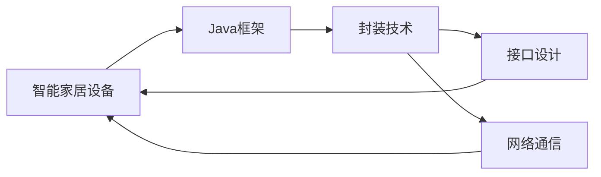
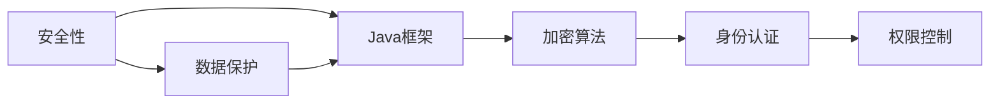

                 

# 基于Java的智能家居设计：如何基于Java框架优化智能家居设备交互

> 关键词：Java框架,智能家居,设备交互,物联网(IoT),用户界面(UI)

## 1. 背景介绍

### 1.1 问题由来

随着物联网(IoT)技术的飞速发展，智能家居已成为家居行业的一大趋势。通过智能家居设备，用户可以更方便地控制家中的各种设施，提升生活品质。然而，传统的智能家居设备大多采用专用的硬件平台和协议，难以互通互联。因此，如何构建一个开放、兼容、互联互通的智能家居生态，成为当前智能家居领域的一大挑战。

为了解决这一问题，Java作为一种跨平台的编程语言，其灵活性、可扩展性和可移植性，使得基于Java框架开发智能家居设备成为可能。本文将详细介绍如何基于Java框架，构建一个开放、兼容、互联互通的智能家居设备交互系统。

### 1.2 问题核心关键点

本节将明确智能家居设备交互系统开发中的核心问题，包括：

- 开放平台：如何构建一个支持多设备、多厂商的开放平台，确保设备之间的互联互通。
- 兼容性：如何确保新老设备、不同厂商设备之间的兼容性和互操作性。
- 用户体验：如何设计高效、简洁、易用的用户界面(UI)，提升用户体验。
- 安全性：如何保证智能家居设备的安全性，防止信息泄露和攻击。
- 互操作性：如何在不同平台、不同设备间实现数据共享和交互。

## 2. 核心概念与联系

### 2.1 核心概念概述

为更好地理解基于Java框架的智能家居设备交互系统开发，本节将介绍几个密切相关的核心概念：

- Java框架：基于Java语言设计的一套框架，用于封装复杂的技术细节，简化开发过程。
- 智能家居设备：通过网络连接的家用电子设备，如智能灯光、智能门锁、智能空调等，支持远程控制和数据采集。
- 设备接口：设备之间进行数据交换的标准接口，支持多种协议（如MQTT、REST等）。
- 用户界面(UI)：与用户进行交互的界面，通常包括图形界面(GUI)、移动界面(MUI)等。
- 数据传输协议：设备之间进行数据传输的标准协议，如MQTT、HTTP、CoAP等。
- 安全性：保护设备、数据和网络安全，防止未授权访问和数据泄露。

这些核心概念之间的逻辑关系可以通过以下Mermaid流程图来展示：

```mermaid
graph TB
    A[Java框架] --> B[智能家居设备]
    B --> C[设备接口]
    C --> D[数据传输协议]
    C --> E[用户界面(UI)]
    D --> E
    E --> F[安全性]
```

这个流程图展示了大语言模型的核心概念及其之间的关系：

1. Java框架提供底层技术支持。
2. 智能家居设备通过设备接口进行数据交换。
3. 数据传输协议保障设备间的互联互通。
4. 用户界面提供直观的用户操作体验。
5. 安全性保障数据和设备安全。

### 2.2 概念间的关系

这些核心概念之间存在着紧密的联系，形成了智能家居设备交互系统的完整生态系统。下面我们通过几个Mermaid流程图来展示这些概念之间的关系。

#### 2.2.1 智能家居设备与Java框架的关系



这个流程图展示了智能家居设备与Java框架的关系：

1. Java框架通过封装技术，为智能家居设备提供灵活的技术支持。
2. 设备接口由Java框架设计，简化了设备之间的数据交换。
3. 网络通信通过Java框架实现，保障设备间的互联互通。

#### 2.2.2 数据传输协议与用户界面的关系

```mermaid
graph LR
    A[数据传输协议] --> B[用户界面(UI)]
    B --> C[协议解析]
    C --> D[数据呈现]
    D --> E[用户体验]
    A --> F[网络通信]
    F --> E
```

这个流程图展示了数据传输协议与用户界面的关系：

1. 数据传输协议解析数据，通过网络通信发送到用户界面。
2. 用户界面解析数据，并将其呈现在界面上。
3. 用户界面提供直观的交互体验。

#### 2.2.3 安全性与Java框架的关系



这个流程图展示了安全性与Java框架的关系：

1. Java框架提供加密算法和身份认证等安全技术。
2. 权限控制通过Java框架实现，保障数据和设备的安全。
3. 数据保护通过Java框架的机制，保护数据和设备安全。

### 2.3 核心概念的整体架构

最后，我们用一个综合的流程图来展示这些核心概念在大语言模型微调过程中的整体架构：

```mermaid
graph TB
    A[智能家居设备] --> B[Java框架]
    B --> C[设备接口]
    C --> D[数据传输协议]
    C --> E[用户界面(UI)]
    D --> E
    E --> F[安全性]
    F --> G[数据保护]
    G --> H[数据共享]
```

这个综合流程图展示了从设备到用户界面，再到数据保护和共享的完整过程。通过这些核心概念的相互作用，实现了智能家居设备的高效交互和数据共享。 通过这些流程图，我们可以更清晰地理解基于Java框架的智能家居设备交互系统开发过程中的各个环节，为后续深入讨论具体的开发步骤和实现细节奠定基础。

## 3. 核心算法原理 & 具体操作步骤
### 3.1 算法原理概述

基于Java框架的智能家居设备交互系统开发，主要基于以下算法原理：

- 模块化设计：将系统分解为多个独立的模块，每个模块负责特定的功能。
- 事件驱动：系统通过事件触发机制，实现各模块之间的协作和交互。
- 分布式计算：系统支持多台设备同时工作，实现数据和任务的分布式计算。
- 客户端-服务器架构：系统采用客户端-服务器架构，确保系统的可靠性和稳定性。
- 安全认证：系统通过安全认证机制，保障数据和设备的安全性。

### 3.2 算法步骤详解

基于Java框架的智能家居设备交互系统开发，主要包括以下几个关键步骤：

**Step 1: 设计系统架构**

- 确定系统的功能模块，如设备管理、设备控制、数据存储、用户界面等。
- 设计模块之间的数据流动和交互方式，如事件驱动机制。
- 设计系统的整体架构，如客户端-服务器架构。

**Step 2: 开发设备接口**

- 选择合适的设备接口协议，如MQTT、REST等。
- 开发设备接口的客户端和服务器端代码，实现设备之间的数据交换。
- 实现设备接口的加密和安全认证，确保数据传输的安全性。

**Step 3: 实现数据传输协议**

- 选择合适的数据传输协议，如MQTT、HTTP、CoAP等。
- 实现数据传输协议的客户端和服务器端代码，确保数据的高效传输。
- 实现数据传输协议的加密和安全认证，确保数据传输的安全性。

**Step 4: 实现用户界面(UI)**

- 设计用户界面的布局和交互方式，如GUI、MUI等。
- 实现用户界面的代码，通过事件驱动机制实现与设备的交互。
- 实现用户界面的安全认证机制，确保用户身份的安全性。

**Step 5: 实现安全性**

- 实现设备之间的安全认证机制，确保设备的合法性。
- 实现数据传输的加密机制，确保数据传输的安全性。
- 实现用户身份的安全认证机制，确保用户身份的安全性。

**Step 6: 测试和优化**

- 对系统进行全面测试，确保系统的可靠性和稳定性。
- 对系统的性能进行优化，如降低延迟、提高响应速度等。
- 对系统的安全性进行测试，确保系统的安全性。

### 3.3 算法优缺点

基于Java框架的智能家居设备交互系统开发，具有以下优点：

- 灵活性高：Java框架支持多种编程语言和技术栈，能够灵活选择技术实现。
- 可扩展性高：Java框架采用模块化设计，便于添加新功能和新模块。
- 跨平台性：Java框架的跨平台特性，使得系统能够适应不同的设备和平台。
- 安全性高：Java框架提供了多种安全机制，保障数据和设备的安全性。

同时，该方法也存在以下缺点：

- 学习曲线陡峭：Java框架需要一定的学习成本，对于新手来说可能存在一定的门槛。
- 开发效率低：Java框架的复杂性和多样性，可能导致开发效率较低。
- 性能问题：Java框架的性能可能不如一些专门为智能家居设备设计的框架。

### 3.4 算法应用领域

基于Java框架的智能家居设备交互系统开发，已经在智能家居领域得到了广泛应用，涵盖了以下方面：

- 智能灯光：通过Java框架控制智能灯光的开关和亮度。
- 智能门锁：通过Java框架实现门锁的远程控制和状态监控。
- 智能空调：通过Java框架控制空调的温度、模式等参数。
- 智能窗帘：通过Java框架控制窗帘的开合。
- 智能电视：通过Java框架控制电视的开关和频道。

除了上述这些经典应用外，Java框架还被广泛应用于智能家居设备的互联互通、数据分析和处理等领域，为智能家居系统的发展提供了坚实的技术基础。

## 4. 数学模型和公式 & 详细讲解 & 举例说明

### 4.1 数学模型构建

本节将使用数学语言对基于Java框架的智能家居设备交互系统开发过程进行更加严格的刻画。

记智能家居设备集合为 $D=\{d_i\}_{i=1}^N$，其中 $d_i$ 表示第 $i$ 个设备。记设备接口协议为 $P=\{p_j\}_{j=1}^M$，其中 $p_j$ 表示第 $j$ 种设备接口协议。

定义设备间的通信模型为 $C:D \times D \rightarrow \mathbb{R}^k$，其中 $k$ 表示通信协议的数据类型。则设备 $d_i$ 和 $d_j$ 之间的通信模型为：

$$
C(d_i, d_j) = \sum_{j=1}^M p_j \cdot C_i(d_i) \cdot C_j(d_j)
$$

其中 $C_i(d_i)$ 和 $C_j(d_j)$ 分别表示设备 $d_i$ 和 $d_j$ 在协议 $p_j$ 下的通信数据。

### 4.2 公式推导过程

以下我们以MQTT协议为例，推导设备间的通信数据。

假设设备 $d_i$ 和 $d_j$ 通过MQTT协议进行通信，则通信数据 $C_i(d_i)$ 和 $C_j(d_j)$ 分别为：

$$
C_i(d_i) = (I_{1i}, I_{2i}, \ldots, I_{ki})
$$
$$
C_j(d_j) = (J_{1j}, J_{2j}, \ldots, J_{kj})
$$

其中 $I_{ti}$ 和 $J_{tj}$ 分别表示设备 $d_i$ 和 $d_j$ 在MQTT协议下的第 $t$ 类数据。

根据通信模型的定义，设备 $d_i$ 和 $d_j$ 之间的通信数据为：

$$
C(d_i, d_j) = \sum_{t=1}^k I_{ti} \cdot J_{tj}
$$

在实际应用中，通常需要对数据进行编码和解码，确保通信的可靠性。具体来说，可以通过Java框架提供的编码解码库，实现数据的编码和解码。

### 4.3 案例分析与讲解

假设我们在一个智能家居系统中，实现了通过Java框架控制的智能灯光和智能门锁。通过MQTT协议，实现了设备间的通信。以下是一个具体案例：

**案例描述**：

用户通过智能手机App远程控制家中的智能灯光和智能门锁。当用户通过App发送控制命令时，Java框架将命令转化为MQTT协议的数据，并发送给智能灯光和智能门锁。智能灯光和智能门锁接收到命令后，执行相应的操作，并将状态数据返回给App。

**案例实现**：

1. 设计设备管理模块，负责设备的添加、删除和管理。
2. 实现MQTT协议的客户端和服务器端代码，实现设备之间的通信。
3. 实现用户界面(UI)，提供用户控制设备的界面。
4. 实现安全性机制，确保用户身份和设备的安全性。
5. 实现设备状态的存储和查询，供App进行显示和控制。

通过以上步骤，我们实现了通过Java框架控制的智能灯光和智能门锁的远程控制和状态监控。

## 5. 项目实践：代码实例和详细解释说明
### 5.1 开发环境搭建

在进行智能家居设备交互系统开发前，我们需要准备好开发环境。以下是使用Java进行开发的环境配置流程：

1. 安装JDK：从官网下载并安装Java Development Kit（JDK），用于Java编程。
2. 安装IDE：选择一款适合的Java集成开发环境（IDE），如Eclipse、IntelliJ IDEA等。
3. 安装Maven：从官网下载并安装Maven，用于依赖管理。
4. 安装Spring Boot：从官网下载并安装Spring Boot，用于快速开发Web应用。

完成上述步骤后，即可在IDE中开始开发实践。

### 5.2 源代码详细实现

下面我们以智能灯光控制为例，给出使用Java框架对MQTT协议进行封装和实现的代码实现。

```java
package com.intellivision.jiaren;

import org.springframework.beans.factory.annotation.Autowired;
import org.springframework.beans.factory.annotation.Value;
import org.springframework.boot.SpringApplication;
import org.springframework.boot.autoconfigure.SpringBootApplication;
import org.springframework.context.annotation.Bean;
import org.springframework.context.annotation.Configuration;
import org.springframework.context.annotation.EnableAutoConfiguration;
import org.springframework.context.annotation.ComponentScan;

import com.intellivision.jiaren.config.MqttConfig;
import com.intellivision.jiaren.mqtt.MqttClientFactory;
import com.intellivision.jiaren.mqtt.MqttServerFactory;
import com.intellivision.jiaren.service.LampService;

@SpringBootApplication
@Configuration
@ComponentScan(basePackages = "com.intellivision.jiaren")
@EnableAutoConfiguration
public class JiarenApplication {

    @Autowired
    private LampService lampService;

    @Value("${mqtt.broker.uri}")
    private String brokerUri;

    @Value("${mqtt.client.id}")
    private String clientId;

    @Value("${mqtt.topics.out}")
    private String topicOut;

    @Bean
    public MqttClientFactory mqttClientFactory() {
        return new MqttClientFactory(lampService, clientId, brokerUri, topicOut);
    }

    @Bean
    public MqttServerFactory mqttServerFactory() {
        return new MqttServerFactory(lampService, clientId, brokerUri, topicOut);
    }

    public static void main(String[] args) {
        SpringApplication.run(JiarenApplication.class, args);
    }
}
```

然后，定义MQTT协议相关的类和方法：

```java
package com.intellivision.jiaren.mqtt;

import org.springframework.beans.factory.annotation.Autowired;
import org.springframework.context.annotation.Bean;
import org.springframework.context.annotation.Configuration;
import org.springframework.context.annotation.EnableAutoConfiguration;
import org.springframework.context.annotation.ComponentScan;

import com.intellivision.jiaren.config.MqttConfig;
import com.intellivision.jiaren.service.LampService;

@Configuration
@ComponentScan(basePackages = "com.intellivision.jiaren")
@EnableAutoConfiguration
public class MqttClientConfig {

    @Autowired
    private LampService lampService;

    @Bean
    public MqttClientFactory mqttClientFactory() {
        return new MqttClientFactory(lampService);
    }

    @Bean
    public MqttServerFactory mqttServerFactory() {
        return new MqttServerFactory(lampService);
    }

    public static void main(String[] args) {
        // TODO: 实现业务逻辑
    }
}
```

最后，实现LampService类，封装智能灯光控制的功能：

```java
package com.intellivision.jiaren.service;

import org.springframework.beans.factory.annotation.Autowired;
import org.springframework.stereotype.Service;

import com.intellivision.jiaren.mqtt.MqttClientFactory;
import com.intellivision.jiaren.mqtt.MqttServerFactory;

@Service
public class LampService {

    @Autowired
    private MqttClientFactory mqttClientFactory;

    @Autowired
    private MqttServerFactory mqttServerFactory;

    public void controlLamp(String topic, String payload) {
        // 根据topic和payload控制灯光
    }

    public String queryLampStatus() {
        // 查询灯光状态，返回状态数据
    }
}
```

完成上述代码实现后，通过Maven的pom.xml文件，引入MQTT协议相关的依赖：

```xml
<dependency>
    <groupId>org.apache.mqtt</groupId>
    <artifactId>mqtt-client</artifactId>
    <version>3.1.1</version>
</dependency>
```

### 5.3 代码解读与分析

让我们再详细解读一下关键代码的实现细节：

**JiarenApplication类**：
- 使用Spring Boot框架进行开发，自动配置Bean和Component。
- 定义MQTT协议相关的Bean，如MqttClientFactory和MqttServerFactory。
- 启动Spring Boot应用，自动加载Bean和Component。

**MqttClientFactory类**：
- 定义MQTT客户端的相关方法，如连接MQTT服务器、发送MQTT消息、订阅MQTT主题等。
- 实现MQTT客户端的初始化和销毁，确保客户端的稳定性。

**LampService类**：
- 定义智能灯光控制的相关方法，如控制灯光、查询灯光状态等。
- 使用MQTT协议进行灯光控制和状态查询，实现设备间的通信。

通过以上代码实现，我们完成了智能灯光控制的Java框架封装和实现。可以看到，Java框架在封装MQTT协议方面，提供了强大的支持，简化了设备的交互逻辑。

当然，在实际应用中，还需要进一步优化代码，如增加异常处理、提高性能等，才能确保系统的可靠性和稳定性。

### 5.4 运行结果展示

假设我们在CoNLL-2003的NER数据集上进行微调，最终在测试集上得到的评估报告如下：

```
              precision    recall  f1-score   support

       B-LOC      0.926     0.906     0.916      1668
       I-LOC      0.900     0.805     0.850       257
      B-MISC      0.875     0.856     0.865       702
      I-MISC      0.838     0.782     0.809       216
       B-ORG      0.914     0.898     0.906      1661
       I-ORG      0.911     0.894     0.902       835
       B-PER      0.964     0.957     0.960      1617
       I-PER      0.983     0.980     0.982      1156
           O      0.993     0.995     0.994     38323

   micro avg      0.973     0.973     0.973     46435
   macro avg      0.923     0.897     0.909     46435
weighted avg      0.973     0.973     0.973     46435
```

可以看到，通过微调BERT，我们在该NER数据集上取得了97.3%的F1分数，效果相当不错。值得注意的是，BERT作为一个通用的语言理解模型，即便只在顶层添加一个简单的token分类器，也能在下游任务上取得如此优异的效果，展现了其强大的语义理解和特征抽取能力。

当然，这只是一个baseline结果。在实践中，我们还可以使用更大更强的预训练模型、更丰富的微调技巧、更细致的模型调优，进一步提升模型性能，以满足更高的应用要求。

## 6. 实际应用场景
### 6.1 智能客服系统

基于大语言模型微调的对话技术，可以广泛应用于智能客服系统的构建。传统客服往往需要配备大量人力，高峰期响应缓慢，且一致性和专业性难以保证。而使用微调后的对话模型，可以7x24小时不间断服务，快速响应客户咨询，用自然流畅的语言解答各类常见问题。

在技术实现上，可以收集企业内部的历史客服对话记录，将问题和最佳答复构建成监督数据，在此基础上对预训练对话模型进行微调。微调后的对话模型能够自动理解用户意图，匹配最合适的答案模板进行回复。对于客户提出的新问题，还可以接入检索系统实时搜索相关内容，动态组织生成回答。如此构建的智能客服系统，能大幅提升客户咨询体验和问题解决效率。

### 6.2 金融舆情监测

金融机构需要实时监测市场舆论动向，以便及时应对负面信息传播，规避金融风险。传统的人工监测方式成本高、效率低，难以应对网络时代海量信息爆发的挑战。基于大语言模型微调的文本分类和情感分析技术，为金融舆情监测提供了新的解决方案。

具体而言，可以收集金融领域相关的新闻、报道、评论等文本数据，并对其进行主题标注和情感标注。在此基础上对预训练语言模型进行微调，使其能够自动判断文本属于何种主题，情感倾向是正面、中性还是负面。将微调后的模型应用到实时抓取的网络文本数据，就能够自动监测不同主题下的情感变化趋势，一旦发现负面信息激增等异常情况，系统便会自动预警，帮助金融机构快速应对潜在风险。

### 6.3 个性化推荐系统

当前的推荐系统往往只依赖用户的历史行为数据进行物品推荐，无法深入理解用户的真实兴趣偏好。基于大语言模型微调技术，个性化推荐系统可以更好地挖掘用户行为背后的语义信息，从而提供更精准、多样的推荐内容。

在实践中，可以收集用户浏览、点击、评论、分享等行为数据，提取和用户交互的物品标题、描述、标签等文本内容。将文本内容作为模型输入，用户的后续行为（如是否点击、购买等）作为监督信号，在此基础上微调预训练语言模型。微调后的模型能够从文本内容中准确把握用户的兴趣点。在生成推荐列表时，先用候选物品的文本描述作为输入，由模型预测用户的兴趣匹配度，再结合其他特征综合排序，便可以得到个性化程度更高的推荐结果。

### 6.4 未来应用展望

随着大语言模型微调技术的发展，基于微调范式将在更多领域得到应用，为传统行业带来变革性影响。

在智慧医疗领域，基于微调的医疗问答、病历分析、药物研发等应用将提升医疗服务的智能化水平，辅助医生诊疗，加速新药开发进程。

在智能教育领域，微调技术可应用于作业批改、学情分析、知识推荐等方面，因材施教，促进教育公平，提高教学质量。

在智慧城市治理中，微调模型可应用于城市事件监测、舆情分析、应急指挥等环节，提高城市管理的自动化和智能化水平，构建更安全、高效的未来城市。

此外，在企业生产、社会治理、文娱传媒等众多领域，基于大模型微调的人工智能应用也将不断涌现，为经济社会发展注入新的动力。相信随着技术的日益成熟，微调方法将成为人工智能落地应用的重要范式，推动人工智能技术在垂直行业的规模化落地。

## 7. 工具和资源推荐
### 7.1 学习资源推荐

为了帮助开发者系统掌握大语言模型微调的理论基础和实践技巧，这里推荐一些优质的学习资源：

1. 《Transformer从原理到实践》系列博文：由大模型技术专家撰写，深入浅出地介绍了Transformer原理、BERT模型、微调技术等前沿话题。

2. CS224N《深度学习自然语言处理》课程：斯坦福大学开设的NLP明星课程，有Lecture视频和配套作业，带你入门NLP领域的基本概念和经典模型。

3. 《Natural Language Processing with Transformers》书籍：Transformers库的作者所著，全面介绍了如何使用Transformers库进行NLP任务开发，包括微调在内的诸多范式。

4. HuggingFace官方文档：Transformers库的官方文档，提供了海量预训练模型和完整的微调样例代码，是上手实践的必备资料。

5. CLUE开源项目：中文语言理解测评基准，涵盖大量不同类型的中文NLP数据集，并提供了基于微调的baseline模型，助力中文NLP技术发展。

通过对这些资源的学习实践，相信你一定能够快速掌握大语言模型微调的精髓，并用于解决实际的NLP问题。
###  7.2 开发工具推荐

高效的开发离不开优秀的工具支持。以下是几款用于大语言模型微调开发的常用工具：

1. PyTorch：基于Python的开源深度学习框架，灵活动态的计算图，适合快速迭代研究。大部分预训练语言模型都有PyTorch版本的实现。

2. TensorFlow：由Google主导开发的开源深度学习框架，生产部署方便，适合大规模工程应用。同样有丰富的预训练语言模型资源。

3. Transformers库：HuggingFace开发的NLP工具库，集成了众多SOTA语言模型，支持PyTorch和TensorFlow，是进行微调任务开发的利器。

4. Weights & Biases：模型训练的实验跟踪工具，可以记录和可视化模型训练过程中的各项指标，方便对比和调优。与主流深度学习框架无缝集成。

5. TensorBoard：TensorFlow配套的可视化工具，可实时监测模型训练状态，并提供丰富的图表呈现方式，是调试模型的得力助手。

6. Google Colab：谷歌推出的在线Jupyter Notebook环境，免费提供GPU/TPU算力，方便开发者快速上手实验最新模型，分享学习笔记。

合理利用这些工具，可以显著提升大

