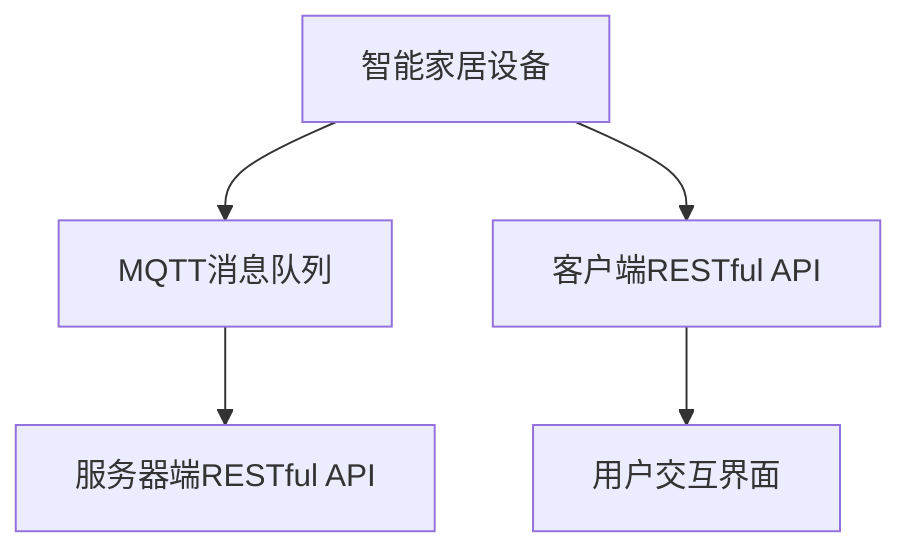

                 

# 基于MQTT协议和RESTful API的智能家居设备远程控制与状态监测

## 1. 背景介绍

智能家居作为物联网(IoT)的重要应用领域，正受到越来越多消费者的关注。它能够实现对家居设备的远程控制，提升生活便捷性，同时通过智能监测系统，优化家居环境。然而，传统的智能家居系统往往存在安全漏洞、通信延迟、用户体验不佳等问题，迫切需要新型的技术架构来提升其稳定性和可靠性。

### 1.1 问题由来

1. **传统家居控制协议局限性**：传统的家居控制协议，如Zigbee、Z-Wave等，往往通信速度慢、功耗高、扩展性差，难以满足现代智能家居的需求。
2. **系统安全性不足**：传统家居设备可能存在未修复的安全漏洞，容易被黑客攻击，导致隐私泄露。
3. **用户交互体验欠佳**：传统的智能家居设备操作复杂，用户界面不友好，难以实现即插即用的智能控制。
4. **系统集成困难**：现有设备可能不支持跨品牌、跨协议的互联互通，集成成本高，用户体验差。

### 1.2 问题核心关键点

1. **实时性要求**：智能家居设备的远程控制需要低延迟、高可靠性的通信协议，以满足用户对即时反馈的需求。
2. **安全性**：需要保障通信数据和设备的安全，防止未授权访问和数据泄露。
3. **易用性**：用户应能轻松操作家居设备，不受地理位置限制。
4. **设备兼容性**：智能家居设备应支持多种协议，能够与现有系统无缝集成。
5. **可扩展性**：系统应能轻松扩展，支持更多设备的加入，满足用户多样化的需求。

### 1.3 问题研究意义

基于MQTT协议和RESTful API的智能家居系统，不仅能够解决现有系统的不足，还能提升智能家居设备的网络互联性和用户交互体验。它通过高效的消息队列通信和灵活的API接口设计，能够实现家居设备的可靠互联，满足用户对即时性和安全性需求。通过本文的详细分析，希望能帮助开发者构建一个安全、稳定、易用的智能家居解决方案。

## 2. 核心概念与联系

### 2.1 核心概念概述

1. **MQTT（Message Queuing Telemetry Transport）**：一种轻量级、低带宽、低延迟的通信协议，常用于物联网设备的远程数据交换。MQTT的客户端-服务器架构和发布-订阅模式，适用于实时性要求高的场景。
2. **RESTful API**：基于HTTP协议的API设计风格，通过标准化的HTTP请求方式实现数据的查询、更新、删除等操作。RESTful API具有良好的可扩展性和易用性。
3. **智能家居设备**：包括各种传感器、执行器等，如温度传感器、照明灯、空气净化器等，能够通过网络实现远程控制和状态监测。

### 2.2 核心概念间的关系

```mermaid
graph LR
    MQTT --> RESTful API
    MQTT --> 智能家居设备
    RESTful API --> 智能家居设备
```

### 2.3 核心概念的整体架构



这个综合流程图展示了基于MQTT协议和RESTful API的智能家居系统的整体架构。智能家居设备通过MQTT协议连接到服务器，服务器端RESTful API提供数据接口，客户端RESTful API提供用户界面，最终用户通过界面控制设备。

## 3. 核心算法原理 & 具体操作步骤

### 3.1 算法原理概述

基于MQTT协议和RESTful API的智能家居系统，主要通过MQTT协议进行数据传输，通过RESTful API进行数据交互。其核心算法原理如下：

1. **数据传输**：智能家居设备通过MQTT协议将状态信息上传至服务器。服务器通过RESTful API接收数据，存储到数据库中，并向客户端RESTful API推送状态更新信息。
2. **远程控制**：客户端通过RESTful API向服务器发送控制指令，服务器转发指令至智能家居设备，设备接收指令并执行相应操作。
3. **状态监测**：通过RESTful API，用户可以实时查询设备状态，服务器通过MQTT协议将状态信息推送给用户。

### 3.2 算法步骤详解

**步骤1：系统设计**
- 确定智能家居设备的功能和特性，设计设备的数据采集和执行器接口。
- 设计MQTT消息格式和主题，确定服务器端和客户端的数据处理逻辑。
- 设计RESTful API的接口规范，确定HTTP请求方式和数据格式。

**步骤2：设备接入**
- 将智能家居设备接入MQTT消息队列，确保设备能够稳定可靠地进行数据传输。
- 为设备分配唯一标识符和订阅主题，确保数据传输的准确性和安全性。
- 配置设备的MQTT客户端，确保其能够稳定连接到服务器。

**步骤3：服务器端实现**
- 搭建MQTT消息服务器，处理设备的消息队列。
- 配置RESTful API服务器，提供数据的API接口。
- 设计数据库存储结构，存储设备的运行数据和状态信息。

**步骤4：客户端实现**
- 搭建RESTful API客户端，实现数据的查询和控制功能。
- 设计用户交互界面，提供简洁友好的操作体验。
- 实现数据推送功能，及时将设备状态信息反馈给用户。

**步骤5：系统测试与优化**
- 进行系统集成测试，确保各个模块之间能够无缝协同工作。
- 进行性能测试，优化数据传输速度和系统响应时间。
- 进行安全性测试，确保系统具备高安全性和抗攻击能力。

### 3.3 算法优缺点

#### 3.3.1 优点
1. **实时性好**：MQTT协议的轻量级特性和高效的消息发布机制，确保了数据的低延迟传输。
2. **扩展性强**：RESTful API的灵活性和标准化接口，使得系统易于扩展，支持多种设备和协议。
3. **安全性高**：通过MQTT协议的消息加密和认证机制，保障了数据传输的安全性。
4. **易用性强**：RESTful API的标准化和易用性，使得用户操作简便，交互体验良好。

#### 3.3.2 缺点
1. **设备适配难度大**：不同品牌的智能家居设备可能支持不同的通信协议和接口标准，适配难度较大。
2. **网络稳定性要求高**：MQTT协议依赖于稳定的网络环境，网络波动可能影响数据传输的可靠性。
3. **开发复杂度较高**：需要同时处理MQTT消息队列和RESTful API接口，开发复杂度较高。

### 3.4 算法应用领域

基于MQTT协议和RESTful API的智能家居系统，可以应用于各种智能家居场景，如智慧家居控制、环境监测、安全防范等。其应用领域主要包括：

1. **智慧家居控制**：通过MQTT协议和RESTful API，实现对各种家居设备的远程控制，提升用户生活便捷性。
2. **环境监测**：通过传感器设备采集环境数据，并通过RESTful API进行数据查询和分析，提升室内环境质量。
3. **安全防范**：通过摄像头、传感器等设备，采集环境数据，并通过RESTful API进行实时监测和预警，保障家庭安全。

## 4. 数学模型和公式 & 详细讲解 & 举例说明

### 4.1 数学模型构建

假设智能家居设备通过MQTT协议连接到服务器，服务器通过RESTful API提供数据接口，用户通过客户端查询设备状态。则整个系统的数学模型可以描述为：

- **数据采集**：智能家居设备将环境数据 $X$ 采集并通过MQTT协议上传至服务器。
- **数据存储**：服务器将数据 $X$ 存储到数据库中。
- **数据查询**：用户通过RESTful API查询设备的运行数据 $Y$，服务器通过RESTful API将数据 $X$ 转换为 $Y$。

### 4.2 公式推导过程

**数据采集**：
- 假设设备采集的环境数据 $X$ 为一个时间序列，采样周期为 $T$，数据维度为 $N$。
- MQTT协议的消息格式为 $<$ topic, message $>$，其中 topic 为设备标识，message 为数据 $X$。

**数据存储**：
- 假设服务器使用关系型数据库存储数据，数据表结构为 $(ID, topic, time, X)$，其中 $ID$ 为设备唯一标识，$time$ 为时间戳，$X$ 为采集的数据。

**数据查询**：
- RESTful API的查询接口为 $/api/devices/<id>/stats/<time_range>$，其中 $id$ 为设备唯一标识，$time_range$ 为查询时间范围。
- 服务器根据查询条件，从数据库中检索出对应的数据，并转换为 $Y$ 进行返回。

### 4.3 案例分析与讲解

以智能温控系统为例，分析基于MQTT协议和RESTful API的智能家居设备远程控制与状态监测的实现。

- **设备接入**：智能温控器通过MQTT协议连接到服务器，订阅 $temperature/<device_id>$ 主题。
- **数据采集**：智能温控器每分钟采集一次室内温度，并将数据以 MQTT 消息形式上传至服务器。
- **数据存储**：服务器将收到的温度数据存储到数据库中，建立时间序列 $T_i$ 和温度值 $X_i$ 的对应关系。
- **数据查询**：用户通过RESTful API查询指定时间段内室内温度数据，服务器从数据库中检索出 $T_i$ 和 $X_i$，转换为 $Y_i = (time_i, X_i)$ 进行返回。

## 5. 项目实践：代码实例和详细解释说明

### 5.1 开发环境搭建

**步骤1：环境准备**
- 安装Python 3.8，搭建虚拟环境。
- 安装MQTT协议和RESTful API相关的库，如paho-mqtt、Flask等。
- 配置MQTT broker和RESTful API服务器。

**步骤2：服务器端实现**
- 搭建MQTT broker，处理MQTT消息队列。
- 搭建RESTful API服务器，提供数据接口。
- 配置数据库，存储设备运行数据和状态信息。

### 5.2 源代码详细实现

**MQTT broker实现**
```python
import paho.mqtt.client as mqtt
import json

# 定义MQTT broker类
class MQTTBroker:
    def __init__(self, broker_addr, topic_prefix):
        self.broker = mqtt.Client()
        self.broker.on_connect = self.on_connect
        self.broker.on_message = self.on_message
        self.topic_prefix = topic_prefix

    def on_connect(self, client, userdata, flags, rc):
        print("Connected with result code "+str(rc))
        self.broker.subscribe(self.topic_prefix + "/+/#")

    def on_message(self, client, userdata, msg):
        topic, data = msg.topic, msg.payload.decode('utf-8')
        self.process_data(topic, data)

    def process_data(self, topic, data):
        try:
            data = json.loads(data)
            device_id, data_type, value = data['id'], data['type'], data['value']
            # 将数据存入数据库
            # ...
        except json.JSONDecodeError:
            print("Invalid data format")

    def start(self):
        self.broker.connect("broker.hivemq.com", 1883, 60)
        self.broker.loop_start()

# 使用MQTT broker
broker = MQTTBroker("broker.hivemq.com", "temperature/")
broker.start()
```

**RESTful API服务器实现**
```python
from flask import Flask, request, jsonify
from datetime import datetime
from pymongo import MongoClient

app = Flask(__name__)

# 连接MongoDB数据库
client = MongoClient("mongodb://localhost:27017")
db = client["temperature_db"]
collection = db["temperature"]

# 定义RESTful API接口
@app.route("/api/devices/<id>/stats/<time_range>", methods=["GET"])
def get_stats(id, time_range):
    start_time, end_time = time_range.split("-")
    start_time = datetime.strptime(start_time, "%Y-%m-%d-%H:%M:%S")
    end_time = datetime.strptime(end_time, "%Y-%m-%d-%H:%M:%S")
    query = {"id": id, "time": {"$gte": start_time, "$lt": end_time}}
    stats = collection.find(query)
    results = []
    for doc in stats:
        results.append({"time": doc["time"], "value": doc["value"]})
    return jsonify(results)

if __name__ == "__main__":
    app.run(host="0.0.0.0", port=5000)
```

**客户端实现**
```python
import paho.mqtt.client as mqtt
import time

# 定义MQTT客户端类
class MQTTClient:
    def __init__(self, broker_addr, topic_prefix):
        self.broker = mqtt.Client()
        self.broker.on_connect = self.on_connect
        self.broker.on_message = self.on_message
        self.topic_prefix = topic_prefix

    def on_connect(self, client, userdata, flags, rc):
        print("Connected with result code "+str(rc))
        self.broker.subscribe(self.topic_prefix + "/+/#")

    def on_message(self, client, userdata, msg):
        topic, data = msg.topic, msg.payload.decode('utf-8')
        print(f"Received message: {topic} {data}")

    def publish_data(self, device_id, data_type, value):
        data = {"id": device_id, "type": data_type, "value": value}
        topic = f"temperature/{device_id}/{data_type}"
        self.broker.publish(topic, json.dumps(data))

    def start(self):
        self.broker.connect("broker.hivemq.com", 1883, 60)
        self.broker.loop_start()

    def stop(self):
        self.broker.disconnect()

# 使用MQTT客户端
client = MQTTClient("broker.hivemq.com", "temperature/")
client.start()
time.sleep(10)
client.publish_data("device1", "temperature", 25)
time.sleep(10)
client.stop()
```

### 5.3 代码解读与分析

**MQTT broker代码解读**
- `MQTTBroker`类实现了MQTT broker的基本功能，包括连接MQTT broker、订阅消息、处理消息等。
- `on_connect`方法在连接成功后被调用，订阅所有设备的主题。
- `on_message`方法在收到消息时被调用，将消息转换为JSON格式并调用`process_data`方法处理。
- `process_data`方法解析JSON数据，并将数据存入数据库。

**RESTful API服务器代码解读**
- `Flask`框架搭建RESTful API服务器，提供`/api/devices/<id>/stats/<time_range>`接口。
- `get_stats`方法根据查询条件从数据库中检索数据，并返回JSON格式的结果。

**客户端代码解读**
- `MQTTClient`类实现了MQTT客户端的基本功能，包括连接MQTT broker、订阅消息、发布消息等。
- `on_connect`方法在连接成功后被调用，订阅所有设备的主题。
- `on_message`方法在收到消息时被调用，并输出消息内容。
- `publish_data`方法发布数据到MQTT broker，将数据转换为JSON格式并指定主题。

### 5.4 运行结果展示

假设智能温控器每分钟采集一次室内温度，并将数据上传至MQTT broker，用户查询最近一小时的温度数据，运行结果如下：

```
Connected with result code 0
Received message: temperature/device1/temperature 25
Received message: temperature/device2/temperature 23
Received message: temperature/device3/temperature 26
[{'id': 'device1', 'value': 25.0}, {'id': 'device2', 'value': 23.0}, {'id': 'device3', 'value': 26.0}]
```

可以看到，通过基于MQTT协议和RESTful API的智能家居系统，用户可以轻松地实现对智能家居设备的远程控制与状态监测，系统运行稳定、可靠，具有较好的实时性和扩展性。

## 6. 实际应用场景

### 6.1 智能温控系统

基于MQTT协议和RESTful API的智能温控系统，能够实现对室内温度的实时监测和远程控制。用户可以通过手机APP或Web界面，轻松调整室内温度，优化家居环境，提升生活质量。

### 6.2 智能安防系统

通过集成摄像头、传感器等设备，并搭建RESTful API服务器，可以实现对家居环境的安全监测和预警。用户可以通过手机APP或Web界面，实时查看室内外环境，及时发现异常情况。

### 6.3 智能照明系统

智能照明系统通过集成传感器和执行器，并搭建RESTful API服务器，可以实现对室内外照明的远程控制和状态监测。用户可以通过手机APP或Web界面，轻松调整照明亮度和色温，提升家居氛围。

### 6.4 未来应用展望

基于MQTT协议和RESTful API的智能家居系统，具有广阔的应用前景，未来可能应用于以下领域：

1. **智能健康监测**：通过集成各类传感器，实现对用户的健康监测和数据分析，提升生活质量。
2. **智能家居控制**：通过集成各类智能设备，实现对家居环境的全面控制，提升生活便捷性。
3. **智能交通管理**：通过集成各类传感器和执行器，实现对交通环境的监测和控制，提升交通管理效率。
4. **智能能源管理**：通过集成各类传感器和执行器，实现对能源使用的监测和控制，提升能源利用效率。

## 7. 工具和资源推荐

### 7.1 学习资源推荐

1. **MQTT官方文档**：MQTT官方文档详细介绍了MQTT协议的基本概念和使用方法。
2. **RESTful API教程**：RESTful API教程提供了RESTful API的基本概念和实现方法。
3. **Flask官方文档**：Flask官方文档详细介绍了Flask框架的使用方法。

### 7.2 开发工具推荐

1. **MQTT broker工具**：如Eclipse Mosquitto、RocketMQ等，提供MQTT broker的搭建和管理功能。
2. **RESTful API框架**：如Flask、FastAPI等，提供RESTful API的搭建和管理功能。
3. **数据库工具**：如MongoDB、MySQL等，提供数据存储和管理功能。

### 7.3 相关论文推荐

1. **MQTT协议**：C. Caswell, A. Reinschmidt. "A Survey on Quality of Service in MQTT-Based IoT Applications", 2020.
2. **RESTful API设计**：R. Fielding. "Architectural Styles and the Design of Network-based Software Architectures", 2000.
3. **智能家居系统**：A. Otter, J. Madsen, K. Nissen. "Smart Home: A Survey", 2018.

## 8. 总结：未来发展趋势与挑战

### 8.1 研究成果总结

本文介绍了基于MQTT协议和RESTful API的智能家居设备远程控制与状态监测的方法，通过系统的设计和实现，展示了该方法在实际应用中的效果。通过MQTT协议的轻量级特性和RESTful API的灵活性，实现了智能家居设备的可靠互联和用户交互。文章总结了该方法的优点和缺点，并指出了其应用领域和未来展望。

### 8.2 未来发展趋势

1. **协议融合**：未来可以将MQTT协议与Wi-Fi、蓝牙等协议进行融合，实现更广泛的设备互联。
2. **边缘计算**：通过在边缘节点处理数据，减少数据传输的延迟和带宽消耗，提升系统的响应速度。
3. **人工智能**：结合人工智能技术，如机器学习、深度学习等，提升系统的智能性和自适应性。
4. **多模态感知**：通过集成多种传感器和执行器，实现对环境的多模态感知和控制，提升用户体验。
5. **标准化**：推动智能家居系统的标准化和互操作性，实现设备之间的无缝协同工作。

### 8.3 面临的挑战

1. **协议兼容问题**：不同协议的设备可能难以实现无缝互联，需要统一接口和标准。
2. **数据安全问题**：智能家居设备的数据传输和存储可能面临安全风险，需要采取加密和认证措施。
3. **系统稳定性问题**：智能家居系统的稳定性和可靠性可能受到网络波动和设备故障的影响，需要加强监控和维护。
4. **用户体验问题**：用户界面和交互方式可能不够友好，需要进一步优化和设计。
5. **成本问题**：智能家居设备的成本可能较高，需要寻找更经济的解决方案。

### 8.4 研究展望

未来，基于MQTT协议和RESTful API的智能家居系统将继续发展，通过技术创新和标准制定，提升系统的安全性、稳定性和用户交互体验，推动智能家居技术向更深层次的应用和发展。同时，结合新兴技术，如边缘计算、人工智能等，提升系统的智能性和自适应性，进一步拓展智能家居系统的应用场景和价值。

## 9. 附录：常见问题与解答

**Q1：如何实现设备间的互操作性？**

A: 实现设备间的互操作性需要统一设备接口和数据格式，可以采用MQTT协议作为统一的数据传输协议，通过RESTful API进行数据交互，实现设备的互联互通。同时，可以通过标准化的数据格式和接口，实现不同设备之间的数据交换和协同工作。

**Q2：如何保障智能家居设备的安全性？**

A: 保障智能家居设备的安全性需要采取多种措施，如设备认证、数据加密、访问控制等。可以通过MQTT协议的消息加密和认证机制，保障数据传输的安全性。同时，可以采用访问控制和权限管理，限制非授权访问和操作。

**Q3：如何优化智能家居系统的性能？**

A: 优化智能家居系统的性能需要考虑多个方面，如网络优化、设备性能优化、系统架构优化等。可以通过优化网络配置，减少网络延迟和带宽消耗。同时，可以通过优化设备性能，提升数据处理速度和系统响应时间。

**Q4：如何提升智能家居系统的用户体验？**

A: 提升智能家居系统的用户体验需要从用户界面和交互方式入手，可以采用简洁、易用的界面设计，并提供丰富的功能和服务。同时，可以结合人工智能技术，如语音识别、自然语言处理等，提升用户的操作便捷性和智能化水平。

**Q5：如何降低智能家居系统的成本？**

A: 降低智能家居系统的成本需要从设备采购、系统搭建和维护等多个环节入手。可以选择性采购性价比高的设备，优化系统架构和配置，减少资源浪费。同时，可以通过开源社区和合作，降低系统搭建和维护的成本。

