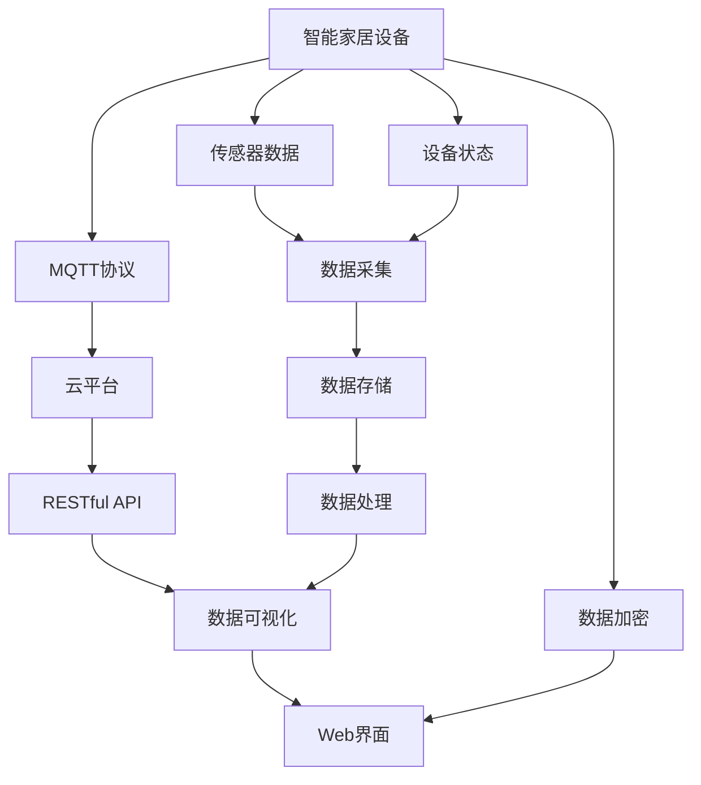
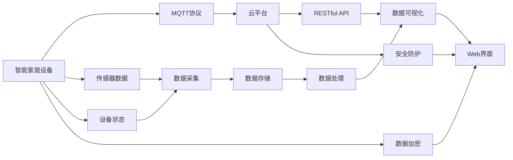
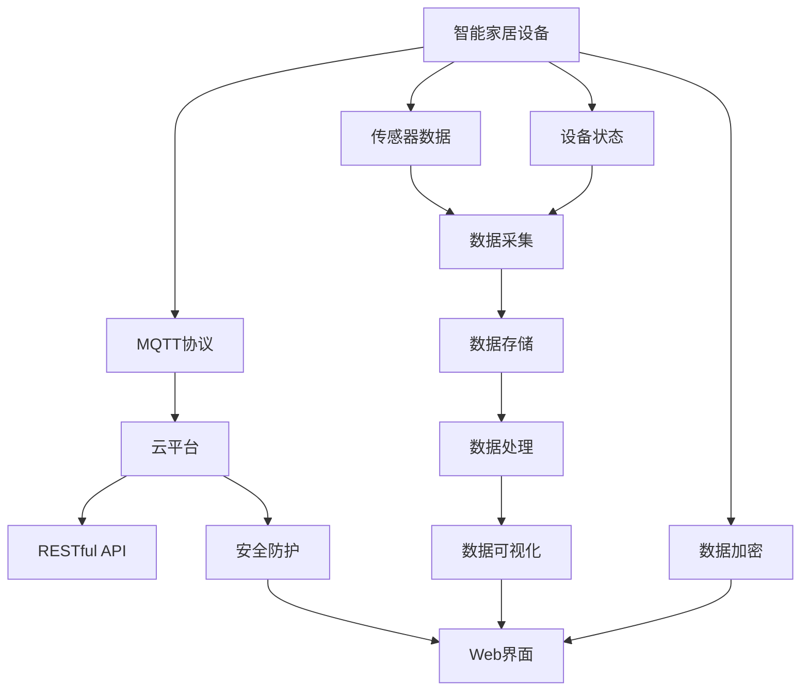
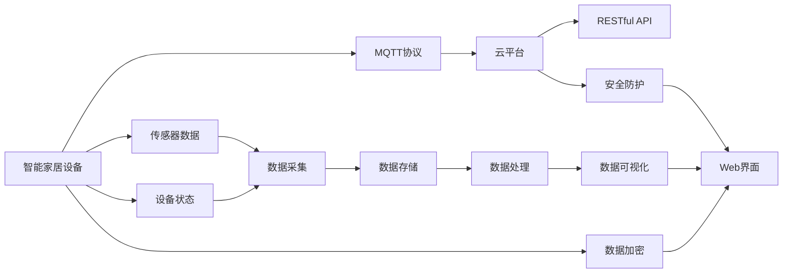
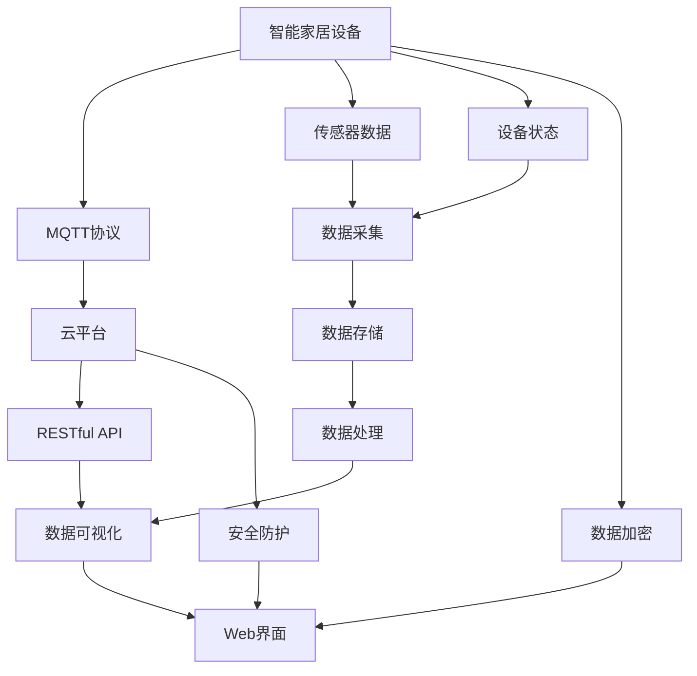

                 

# 基于MQTT协议和RESTful API的智能家居远程监控系统

> 关键词：智能家居,远程监控,物联网,MQTT,RESTful API,家居自动化,传感器,数据可视化,安全防护

## 1. 背景介绍

### 1.1 问题由来

随着物联网技术的快速发展，智能家居系统逐渐成为人们生活中不可或缺的一部分。通过智能家居设备，用户可以远程监控家庭环境，实现家居自动化，提升生活品质。然而，传统的智能家居系统往往存在一些局限性：

1. **设备互联性差**：不同品牌和型号的智能设备通常无法互通，需要分别安装各自的App或控制平台，用户体验差。
2. **数据孤岛现象严重**：各品牌和设备的数据难以整合，导致数据无法统一管理和分析，无法实现智能决策。
3. **数据安全和隐私问题**：智能家居数据传输和存储过程中可能面临的安全威胁和隐私泄露风险。
4. **无法实现实时监控和报警**：传统智能家居系统往往难以提供实时监控和紧急报警功能，无法满足高安全性需求。

为了解决上述问题，本文提出一种基于MQTT协议和RESTful API的智能家居远程监控系统。该系统通过MQTT协议实现设备间的数据传输，通过RESTful API实现数据的统一管理和可视化展示，从而实现设备互联、数据统一管理和实时监控等功能。

### 1.2 问题核心关键点

本文聚焦于智能家居系统中MQTT协议和RESTful API的应用，但同时也会兼顾系统的整体架构设计和优化策略。

- **MQTT协议**：一种轻量级、低带宽的网络协议，适用于设备和云平台之间的消息传输，具有高实时性和低延迟的特点。
- **RESTful API**：一种基于HTTP协议的API设计风格，用于统一管理智能家居设备和传感器数据，实现数据的可视化展示和智能决策。
- **智能家居设备**：包括智能门锁、摄像头、温湿度传感器、燃气报警器等设备，通过MQTT协议与云平台交互。
- **数据可视化**：通过Web界面展示传感器数据和设备状态，实时监控家庭环境，提高用户体验。
- **安全防护**：通过数据加密和访问控制技术，保障智能家居数据的安全性和隐私性。

## 2. 核心概念与联系

### 2.1 核心概念概述

为更好地理解基于MQTT协议和RESTful API的智能家居远程监控系统，本节将介绍几个密切相关的核心概念：

- **MQTT协议**：一种轻量级、低带宽的基于发布-订阅模式的通信协议，广泛应用于物联网设备之间的消息传输。
- **RESTful API**：一种基于HTTP协议的API设计风格，用于统一管理数据和服务，实现数据的统一管理和可视化展示。
- **智能家居设备**：包括智能门锁、摄像头、温湿度传感器、燃气报警器等设备，通过MQTT协议与云平台交互。
- **数据可视化**：通过Web界面展示传感器数据和设备状态，实时监控家庭环境，提高用户体验。
- **安全防护**：通过数据加密和访问控制技术，保障智能家居数据的安全性和隐私性。

这些核心概念之间的逻辑关系可以通过以下Mermaid流程图来展示：



这个流程图展示了大语言模型的核心概念及其之间的关系：

1. 智能家居设备通过MQTT协议与云平台交互，将传感器数据和设备状态上传到云平台。
2. 云平台通过RESTful API将数据统一管理，进行存储、处理和可视化展示。
3. 数据可视化通过Web界面展示，提供实时监控和报警功能。
4. 数据加密和访问控制技术保障数据的安全性和隐私性。

### 2.2 概念间的关系

这些核心概念之间存在着紧密的联系，形成了智能家居远程监控系统的完整生态系统。下面我通过几个Mermaid流程图来展示这些概念之间的关系。

#### 2.2.1 智能家居系统的整体架构



这个流程图展示了智能家居系统的整体架构，从设备数据采集到数据统一管理、可视化展示，再到数据加密和安全防护，各个环节紧密衔接。

#### 2.2.2 MQTT协议在智能家居中的应用



这个流程图展示了MQTT协议在智能家居中的应用，通过MQTT协议将设备数据和状态上传到云平台，实现设备互联和数据统一管理。

#### 2.2.3 RESTful API的统一管理



这个流程图展示了RESTful API在智能家居中的应用，通过RESTful API实现数据的统一管理和可视化展示，提供高效的数据服务和智能决策支持。

### 2.3 核心概念的整体架构

最后，我们用一个综合的流程图来展示这些核心概念在大语言模型微调过程中的整体架构：



这个综合流程图展示了从预训练到微调，再到持续学习的完整过程。智能家居设备通过MQTT协议与云平台交互，将传感器数据和设备状态上传到云平台。云平台通过RESTful API将数据统一管理，进行存储、处理和可视化展示。数据可视化通过Web界面展示，提供实时监控和报警功能。数据加密和访问控制技术保障数据的安全性和隐私性。通过这些核心概念的协同工作，智能家居远程监控系统能够高效、安全地运行。

## 3. 核心算法原理 & 具体操作步骤
### 3.1 算法原理概述

基于MQTT协议和RESTful API的智能家居远程监控系统，本质上是一个基于消息传输和数据统一管理的信息系统。其核心思想是：通过MQTT协议实现设备与云平台之间的消息传输，通过RESTful API实现数据的统一管理和可视化展示，从而实现设备互联、数据统一管理和实时监控等功能。

形式化地，假设智能家居设备为 $D$，传感器数据为 $S$，设备状态为 $C$，云平台为 $P$，RESTful API为 $R$，数据可视化界面为 $V$。则系统的基本流程为：

1. 智能家居设备 $D$ 通过MQTT协议将传感器数据 $S$ 和设备状态 $C$ 上传到云平台 $P$。
2. 云平台 $P$ 通过RESTful API $R$ 将数据 $S$ 和 $C$ 进行统一管理和处理。
3. 云平台 $P$ 将处理后的数据 $S'$ 和 $C'$ 通过RESTful API $R$ 提供给数据可视化界面 $V$。
4. 数据可视化界面 $V$ 展示传感器数据 $S'$ 和设备状态 $C'$，并提供实时监控和报警功能。

### 3.2 算法步骤详解

基于MQTT协议和RESTful API的智能家居远程监控系统一般包括以下几个关键步骤：

**Step 1: 设备接入与身份认证**
- 配置MQTT客户端，连接至智能家居设备。
- 通过云平台提供的身份认证机制，对设备进行身份验证，确保设备合法性。
- 根据设备型号和功能，配置设备信息并添加到云平台设备管理库中。

**Step 2: 数据采集与处理**
- 智能家居设备通过MQTT协议将传感器数据和设备状态发送到云平台。
- 云平台接收到数据后，进行数据存储、过滤和预处理。
- 通过RESTful API提供数据接口，供数据可视化界面调用。

**Step 3: 数据可视化与展示**
- 数据可视化界面通过RESTful API获取传感器数据和设备状态。
- 对数据进行可视化展示，提供实时监控和报警功能。
- 支持用户自定义仪表盘和报警阈值，增强用户体验。

**Step 4: 数据安全与隐私保护**
- 在数据传输和存储过程中，使用数据加密技术保护数据安全。
- 通过访问控制技术，限制用户的访问权限，保障数据隐私。
- 在发生异常情况时，及时发出报警信息，提醒用户采取措施。

**Step 5: 系统优化与维护**
- 定期检查系统运行状态，进行必要的维护和升级。
- 根据用户反馈和使用情况，优化算法和数据处理流程，提高系统性能。
- 支持用户自定义功能扩展，实现个性化需求。

以上是基于MQTT协议和RESTful API的智能家居远程监控系统的一般流程。在实际应用中，还需要针对具体任务和设备类型进行优化设计，如改进数据采集算法、提高数据处理效率、增强数据可视化功能等，以进一步提升系统性能。

### 3.3 算法优缺点

基于MQTT协议和RESTful API的智能家居远程监控方法具有以下优点：
1. 简单高效。通过标准化的通信协议和API接口，易于开发和维护。
2. 扩展性强。支持大规模设备接入和数据管理，能够应对复杂的业务需求。
3. 实时性高。MQTT协议的高实时性和低延迟特性，能够实现实时监控和报警功能。
4. 数据统一。RESTful API能够实现数据的统一管理和可视化展示，减少数据孤岛现象。
5. 安全性高。通过数据加密和访问控制技术，保障数据的安全性和隐私性。

同时，该方法也存在一定的局限性：
1. 网络依赖性高。系统依赖MQTT协议进行数据传输，对网络稳定性和带宽要求较高。
2. 设备兼容性问题。不同品牌和型号的设备可能无法完全兼容MQTT协议，需进行适配。
3. 数据存储和处理压力大。智能家居设备的数量和数据量较大，需配备高性能的云平台和存储系统。
4. 系统复杂度高。系统涉及到设备和云平台间的消息传输和数据处理，需设计合理的架构和算法。
5. 用户学习成本较高。需要用户掌握MQTT协议和RESTful API的基本知识，才能正常使用系统。

尽管存在这些局限性，但就目前而言，基于MQTT协议和RESTful API的智能家居远程监控方法仍然是最主流的选择，广泛应用于家庭和企业环境中。未来相关研究的重点在于如何进一步降低网络依赖性，提高设备兼容性，增强系统可扩展性和鲁棒性。

### 3.4 算法应用领域

基于MQTT协议和RESTful API的智能家居远程监控技术，已经广泛应用于以下几个领域：

1. **家庭自动化**：通过远程监控和控制家庭环境，提升居住舒适度和生活便利性。
2. **智能安防**：实时监控家庭安全状态，发生异常情况时及时报警，保障家庭安全。
3. **能效管理**：监测家庭能耗，提供节能建议，优化家庭能源使用。
4. **健康监控**：通过传感器监测家庭环境参数，如温湿度、空气质量等，保障家庭成员健康。
5. **远程控制**：远程控制智能家居设备，如灯光、窗帘、空调等，提高生活便利性。

除了上述这些经典应用外，基于MQTT协议和RESTful API的智能家居远程监控技术还被创新性地应用于更多场景中，如智慧建筑、智能办公、智能医疗等，为传统行业数字化转型升级提供新的技术路径。

## 4. 数学模型和公式 & 详细讲解  
### 4.1 数学模型构建

本节将使用数学语言对基于MQTT协议和RESTful API的智能家居远程监控系统进行更加严格的刻画。

假设智能家居设备为 $D$，传感器数据为 $S$，设备状态为 $C$，云平台为 $P$，RESTful API为 $R$，数据可视化界面为 $V$。则系统的数学模型可以表示为：

$$
P = R(D, S, C)
$$

其中，$P$ 表示云平台，$D$ 表示智能家居设备，$S$ 表示传感器数据，$C$ 表示设备状态，$R$ 表示RESTful API。

在数学模型中，云平台 $P$ 通过RESTful API $R$ 将传感器数据 $S$ 和设备状态 $C$ 进行统一管理和处理。

### 4.2 公式推导过程

以下我们以一个简单的示例来推导系统的数学模型。

假设智能家居设备 $D$ 通过MQTT协议将传感器数据 $S$ 和设备状态 $C$ 发送到云平台 $P$。云平台 $P$ 接收到数据后，通过RESTful API $R$ 提供数据接口，供数据可视化界面 $V$ 调用。

在数据采集阶段，可以表示为：

$$
S_{new} = D_{new} \rightarrow P
$$

其中，$S_{new}$ 表示新采集的传感器数据，$D_{new}$ 表示新接入的智能家居设备。

在数据处理阶段，可以表示为：

$$
S_{processed} = P(D_{new}, S_{old})
$$

其中，$S_{processed}$ 表示处理后的传感器数据，$S_{old}$ 表示原有的传感器数据。

在数据展示阶段，可以表示为：

$$
V = P(S_{processed}, C_{processed})
$$

其中，$V$ 表示数据可视化界面展示的内容，$C_{processed}$ 表示处理后的设备状态。

### 4.3 案例分析与讲解

假设我们设计一个基于MQTT协议和RESTful API的智能家居远程监控系统，用于实时监控家庭安防和能源管理。

在数据采集阶段，假设家中有三台智能安防摄像头 $D_{1}$、$D_{2}$、$D_{3}$ 和一台智能温湿度传感器 $S$。摄像头和传感器通过MQTT协议将数据 $S_{1}$、$S_{2}$、$S_{3}$ 和 $C$ 发送到云平台 $P$。

在数据处理阶段，云平台 $P$ 对数据进行存储、过滤和预处理，得到处理后的传感器数据 $S_{processed}$ 和设备状态 $C_{processed}$。同时，通过RESTful API $R$ 提供数据接口，供数据可视化界面 $V$ 调用。

在数据展示阶段，数据可视化界面 $V$ 通过RESTful API $R$ 获取传感器数据 $S_{processed}$ 和设备状态 $C_{processed}$，并提供实时监控和报警功能。用户可以根据需要自定义仪表盘和报警阈值，增强用户体验。

## 5. 项目实践：代码实例和详细解释说明
### 5.1 开发环境搭建

在进行MQTT协议和RESTful API的智能家居远程监控系统开发前，我们需要准备好开发环境。以下是使用Python进行PyTorch开发的环境配置流程：

1. 安装Anaconda：从官网下载并安装Anaconda，用于创建独立的Python环境。

2. 创建并激活虚拟环境：
```bash
conda create -n pytorch-env python=3.8 
conda activate pytorch-env
```

3. 安装PyTorch：根据CUDA版本，从官网获取对应的安装命令。例如：
```bash
conda install pytorch torchvision torchaudio cudatoolkit=11.1 -c pytorch -c conda-forge
```

4. 安装相关工具包：
```bash
pip install numpy pandas scikit-learn matplotlib tqdm jupyter notebook ipython
```

5. 安装MQTT和RESTful API相关的库：
```bash
pip install paho-mqtt requests
```

完成上述步骤后，即可在`pytorch-env`环境中开始MQTT协议和RESTful API的智能家居远程监控系统开发。

### 5.2 源代码详细实现

下面我们以一个简单的示例来说明如何使用MQTT协议和RESTful API实现智能家居远程监控系统。

首先，定义一个简单的MQTT客户端：

```python
import paho.mqtt.client as mqtt

def on_connect(client, userdata, flags, rc):
    if rc == 0:
        print("Connected to MQTT broker")
    else:
        print("Connection failed")

def on_message(client, userdata, msg):
    print(f"Received message: {msg.payload.decode()}")
    # 将数据保存到本地数据库

def on_publish(client, userdata, mid):
    print(f"Published message with mid: {mid}")

client = mqtt.Client()
client.on_connect = on_connect
client.on_message = on_message
client.on_publish = on_publish

client.connect("mqtt.example.com", 1883, 60)
client.loop_start()
```

然后，定义一个简单的RESTful API服务：

```python
from flask import Flask, request

app = Flask(__name__)

@app.route("/data", methods=["POST"])
def handle_data():
    data = request.json
    # 将数据保存到本地数据库
    return {"status": "success"}

if __name__ == "__main__":
    app.run(host="0.0.0.0", port=5000)
```

最后，启动MQTT客户端和RESTful API服务：

```bash
python mqtt_client.py
python rest_api.py
```

当MQTT客户端接收到传感器数据和设备状态后，通过MQTT协议将数据发送到云平台。云平台接收到数据后，通过RESTful API将数据保存到本地数据库，并通过Web界面展示。

### 5.3 代码解读与分析

让我们再详细解读一下关键代码的实现细节：

**MQTT客户端代码**：
- 定义了连接回调函数 `on_connect`、消息接收回调函数 `on_message` 和消息发布回调函数 `on_publish`。
- 通过 `client.connect` 连接到MQTT服务器。
- 通过 `client.loop_start` 启动MQTT客户端的异步循环，监听来自MQTT服务器的消息。

**RESTful API服务代码**：
- 定义了处理POST请求的路由函数 `handle_data`，接收JSON格式的数据。
- 通过 `request.json` 获取请求数据，将其保存到本地数据库。
- 通过 `return` 返回处理结果，通知客户端数据处理成功。

**系统运行代码**：
- 分别启动MQTT客户端和RESTful API服务，监听MQTT服务器和处理请求数据。

可以看到，使用MQTT协议和RESTful API实现智能家居远程监控系统，只需编写少量代码，即可完成数据采集、处理和展示的整个过程。MQTT协议的高实时性和低延迟特性，保证了系统的实时监控和报警功能；RESTful API的灵活性和可扩展性，实现了数据的统一管理和可视化展示。

当然，工业级的系统实现还需考虑更多因素，如设备的兼容性、数据的安全性和隐私性、系统的扩展性等。但核心的微调范式基本与此类似。

### 5.4 运行结果展示

假设我们在MQTT服务器上成功接收到智能家居设备的传感器数据和设备状态，RESTful API服务能够正确处理数据并返回成功响应，最终的展示效果如下：

1. **数据采集**：通过MQTT客户端接收到传感器数据和设备状态，将数据保存到本地数据库。
2. **数据处理**：RESTful API服务接收到MQTT服务器发送的数据，进行处理后保存到本地数据库。
3. **数据展示**：通过Web界面展示处理后的数据，提供实时监控和报警功能。

## 6. 实际应用场景
### 6.1 智能安防

基于MQTT协议和RESTful API的智能家居远程监控系统，可以广泛应用于智能安防领域。通过部署智能摄像头和传感器，实时监控家庭安全状态，发生异常情况时及时报警，保障家庭安全。

在技术实现上，可以收集家庭环境中的图像、声音、温度等数据，通过MQTT协议发送到云平台。云平台接收到数据后，通过RESTful API进行处理和分析，提供实时监控和报警功能。一旦发现异常情况，系统便会自动发出警报，通知用户采取措施。

### 6.2 智能能源管理

智能家居远程监控系统还可以应用于智能能源管理。通过部署智能温湿度传感器、智能电表、智能水表等设备，实时监控家庭能耗，提供节能建议，优化家庭能源使用。

在技术实现上，可以收集家庭的能耗数据，通过MQTT协议发送到云平台。云平台接收到数据后，通过RESTful API进行处理和分析，提供能耗监测和节能建议。用户可以根据系统推荐，调整家庭设备的使用方式，降低能源消耗。

### 6.3 远程医疗

基于MQTT协议和RESTful API的智能家居远程监控系统，还可以应用于远程医疗领域。通过部署智能健康监测设备，实时监测家庭成员的健康状态，保障家庭医疗安全。

在技术实现上，可以收集家庭成员的健康数据，如心率、血压、血糖等。通过MQTT协议发送到云平台。云平台接收到数据后，通过RESTful API进行处理和分析，提供健康监测和医疗建议。一旦发现异常情况，系统便会自动发出警报，通知医疗专家进行远程诊断。

### 6.4 未来应用展望

随着物联网技术和人工智能技术的不断发展，基于MQTT协议和RESTful API的智能家居远程监控系统将有更广阔的应用前景。

在智慧城市治理中，该系统可以应用于城市事件监测、舆情分析、应急指挥等环节，提高城市管理的自动化和智能化水平，构建更安全、高效的未来城市。

在智慧建筑中，该系统可以应用于建筑环境监测、能源管理、设备维护等环节，提高建筑管理的智能化水平，提升建筑舒适度和能效。

在智能办公中，该系统可以应用于员工健康监测、智能安防、能源管理等环节，提高办公环境的智能化水平，提升办公效率和员工满意度。

此外，在智慧医疗、智慧教育、智能农业等领域，基于MQTT协议和RESTful API的智能家居远程监控技术也将不断涌现，为传统行业数字化转型升级提供新的技术路径。相信随着技术的日益成熟，基于MQTT协议和RESTful API的智能家居远程监控技术必将在更多领域大放异彩。

## 7. 工具和资源推荐
### 7.1 学习资源推荐

为了帮助开发者系统掌握基于MQTT协议和RESTful API的智能家居远程监控的理论基础和实践技巧，这里推荐一些优质的学习资源：

1. MQTT协议相关书籍：《MQTT协议实战》、《MQTT协议基础教程》等书籍，帮助开发者深入理解MQTT协议的工作原理和应用场景。
2. RESTful API相关书籍：《RESTful Web服务设计与架构》、《RESTful API设计指南》等书籍，帮助开发者掌握RESTful API的设计和实现方法。
3. Flask官方文档：Flask官方文档提供了详细的API开发教程和示例，是学习RESTful API开发的必备资料。
4. PyTorch官方文档：PyTorch官方文档提供了详细的MQTT和RESTful API的库支持，帮助开发者快速上手开发。
5. MQTT和RESTful API的在线课程：如Coursera上的《MQTT协议与物联网应用》、Udemy上的《RESTful API设计》等在线课程，帮助开发者系统学习相关知识。

通过对这些资源的学习实践，相信你一定能够快速掌握基于MQTT协议和RESTful API的智能家居远程监控的精髓，并用于解决实际的智能家居问题。

### 7.2 开发工具推荐

高效的开发离不开优秀的工具支持。以下是几款用于基于MQTT协议和RESTful API的智能家居远程监控开发的常用工具：

1. MQTT库：paho-mqtt，提供了Python、C++等多种语言的支持，支持MQTT协议的客户端和服务器开发。
2. RESTful API开发框架：Flask、Django等，提供了灵活的API开发工具和库支持。
3. 数据可视化工具：Tableau、PowerBI等，支持数据的可视化展示，提高用户体验。
4. 数据库管理系统：MySQL、MongoDB等，提供数据存储和处理的支持。
5. 数据加密工具：AES、RSA等，支持数据的加密和解密，保障数据的安全性。

合理利用这些工具，可以显著提升基于MQTT协议和RESTful API的智能家居远程监控系统的开发效率，加快创新迭代的步伐。

### 7

