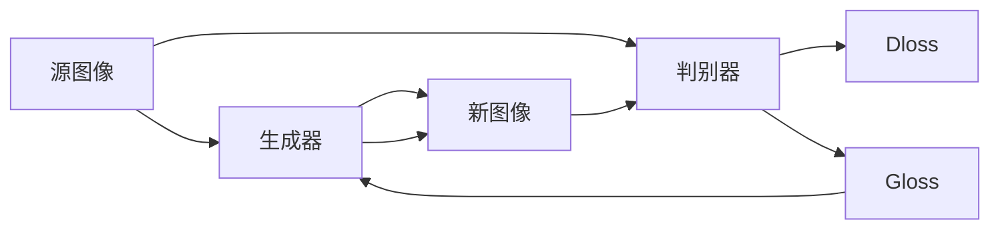

                 

## 1. 背景介绍

在计算机视觉和图形处理领域，风格迁移一直是研究的热点。通过将一个图像的风格迁移到另一个图像上，生成具有不同风格的新图像，可以极大地提升图像处理的艺术性和趣味性。然而，早期的风格迁移方法通常依赖于手工设计的滤波器和优化器，计算复杂度高，且生成的图像风格单一，难以满足复杂的风格迁移需求。

近年来，随着生成对抗网络（Generative Adversarial Networks, GANs）的兴起，风格迁移技术迎来了新的突破。利用GANs强大的生成能力，可以实现更加丰富、多样化的风格迁移效果。其中，基于生成对抗网络的风格迁移方法，尤其受到关注。通过训练一个生成器和判别器，生成器能够将输入图像的风格转换为目标风格，而判别器则用来评价生成图像的真实性，两者互相博弈，直至生成器生成的图像能够欺骗判别器。

本文聚焦于基于生成对抗网络的动漫人物绘画风格迁移，通过系统阐述该技术的工作原理、核心算法及具体实现，为读者提供深入的技术解析。首先，我们将介绍生成对抗网络的基本原理和架构；其次，详细解析风格迁移的具体流程和技术细节；最后，通过实际案例展示该技术的实际应用效果。

## 2. 核心概念与联系

### 2.1 核心概念概述

#### 2.1.1 生成对抗网络（GANs）

生成对抗网络是由生成器和判别器两个子网络构成的深度学习模型。生成器网络（Generative Network, G）将噪声随机向量映射为生成图像，判别器网络（Discriminative Network, D）用于判断输入图像的真实性。通过两者之间的博弈训练，生成器可以生成与真实图像无法区分的伪造图像。

生成对抗网络的基本架构如图1所示：


图1：生成对抗网络基本架构

#### 2.1.2 风格迁移

风格迁移是指将一张图像的风格迁移到另一张图像上，生成具有目标风格的新图像。这一过程通常包括以下步骤：

1. 提取源图像和目标图像的风格表示。
2. 将源图像的语义表示与目标风格表示结合。
3. 生成新的具有目标风格的图像。

#### 2.1.3 动漫人物绘画风格迁移

动漫人物绘画风格迁移是指将普通的人物图像转换成具有动漫人物绘画风格的新图像。这一过程利用生成对抗网络，将源图像的风格表示与目标风格表示结合，生成具有目标风格的新图像。

### 2.2 核心概念间的关系

生成对抗网络、风格迁移和动漫人物绘画风格迁移之间存在密切的联系。生成对抗网络为风格迁移提供了强大的生成能力，而风格迁移技术则应用于动漫人物绘画风格迁移，实现了将普通人物图像转换为具有动漫人物绘画风格的新图像的效果。

## 3. 核心算法原理 & 具体操作步骤
### 3.1 算法原理概述

基于生成对抗网络的动漫人物绘画风格迁移，其核心算法流程如图2所示：



图2：动漫人物绘画风格迁移算法流程

其中，I表示源图像，G表示生成器，O表示新图像，D表示判别器，Gloss表示生成器损失函数，Dloss表示判别器损失函数。算法的核心在于通过训练生成器和判别器，使生成器生成的图像能够欺骗判别器，从而实现风格迁移。

### 3.2 算法步骤详解

#### 3.2.1 生成器网络（G）

生成器网络将噪声向量 $z$ 映射为具有目标风格的图像 $O$，其数学模型如下：

$$
O = G(z)
$$

生成器网络通常由多个卷积层和反卷积层组成，能够有效地学习并生成复杂的图像结构。

#### 3.2.2 判别器网络（D）

判别器网络用于判断输入图像的真实性，其数学模型如下：

$$
D(x) = \begin{cases}
1 & x \text{ is real} \\
0 & x \text{ is fake}
\end{cases}
$$

判别器网络通常由多个卷积层组成，能够有效地学习并判断图像的真实性。

#### 3.2.3 生成器损失函数（Gloss）

生成器损失函数由生成器对判别器的输出和真实图像的输出之和组成，其数学模型如下：

$$
Gloss = \frac{1}{N} \sum_{i=1}^{N} D(G(z_i)) + \lambda \mathcal{L}_{rec}
$$

其中，$z_i$ 表示生成器输入的噪声向量，$N$ 表示噪声向量的数量，$\lambda$ 表示重构损失的权重。

#### 3.2.4 判别器损失函数（Dloss）

判别器损失函数由判别器对生成器生成的图像和真实图像的判别结果之和组成，其数学模型如下：

$$
Dloss = -\frac{1}{N} \sum_{i=1}^{N} D(G(z_i)) + \frac{1}{M} \sum_{j=1}^{M} D(x_j)
$$

其中，$x_j$ 表示真实图像，$M$ 表示真实图像的数量。

#### 3.2.5 训练过程

训练过程中，生成器和判别器交替进行优化，生成器生成伪造图像，判别器判断图像的真实性，两者互相博弈，直至生成器生成的图像能够欺骗判别器。训练流程如下：

1. 将随机噪声向量 $z$ 输入生成器，生成图像 $O$。
2. 将生成的图像 $O$ 和真实图像 $x$ 同时输入判别器，计算生成器损失函数 $Gloss$ 和判别器损失函数 $Dloss$。
3. 使用梯度下降算法更新生成器和判别器的参数。
4. 重复步骤1-3，直至生成器生成的图像与真实图像无法区分。

### 3.3 算法优缺点

#### 3.3.1 优点

1. 生成图像具有高保真度。由于生成对抗网络强大的生成能力，生成的图像具有高保真度，能够真实地反映源图像的语义信息。
2. 可处理复杂风格。通过改变判别器的损失函数，可以处理复杂风格迁移任务，实现多样化的风格迁移效果。
3. 可训练得到风格迁移模型。生成对抗网络可以训练得到风格迁移模型，实现批量风格的迁移，提升处理效率。

#### 3.3.2 缺点

1. 计算复杂度高。生成对抗网络计算复杂度高，训练过程耗时较长。
2. 难以控制风格。生成对抗网络生成的图像风格具有一定的随机性，难以控制。
3. 对噪声敏感。生成对抗网络对噪声向量 $z$ 的初始值和分布比较敏感，不同的噪声向量可能导致不同的风格迁移效果。

### 3.4 算法应用领域

基于生成对抗网络的动漫人物绘画风格迁移技术，在图像处理、艺术创作、游戏设计等领域有着广泛的应用。例如，在影视制作中，可以利用该技术将演员的真实表演转换为具有动漫风格的新形象；在游戏设计中，可以生成具有特定风格的游戏角色和场景，提升游戏的趣味性和视觉效果。

## 4. 数学模型和公式 & 详细讲解  
### 4.1 数学模型构建

#### 4.1.1 生成器网络（G）

生成器网络将噪声向量 $z$ 映射为具有目标风格的图像 $O$，其数学模型如下：

$$
O = G(z)
$$

其中，$G$ 表示生成器网络，$z$ 表示噪声向量，$O$ 表示生成图像。

#### 4.1.2 判别器网络（D）

判别器网络用于判断输入图像的真实性，其数学模型如下：

$$
D(x) = \begin{cases}
1 & x \text{ is real} \\
0 & x \text{ is fake}
\end{cases}
$$

其中，$x$ 表示输入图像，$D$ 表示判别器网络。

#### 4.1.3 生成器损失函数（Gloss）

生成器损失函数由生成器对判别器的输出和真实图像的输出之和组成，其数学模型如下：

$$
Gloss = \frac{1}{N} \sum_{i=1}^{N} D(G(z_i)) + \lambda \mathcal{L}_{rec}
$$

其中，$z_i$ 表示生成器输入的噪声向量，$N$ 表示噪声向量的数量，$\lambda$ 表示重构损失的权重，$\mathcal{L}_{rec}$ 表示重构损失。

#### 4.1.4 判别器损失函数（Dloss）

判别器损失函数由判别器对生成器生成的图像和真实图像的判别结果之和组成，其数学模型如下：

$$
Dloss = -\frac{1}{N} \sum_{i=1}^{N} D(G(z_i)) + \frac{1}{M} \sum_{j=1}^{M} D(x_j)
$$

其中，$x_j$ 表示真实图像，$M$ 表示真实图像的数量。

### 4.2 公式推导过程

#### 4.2.1 生成器网络（G）

生成器网络通常由多个卷积层和反卷积层组成，其数学模型如下：

$$
G(z) = G_1(z) \xrightarrow{\text{ReLU}} G_2(G_1(z)) \xrightarrow{\text{ReLU}} \dots \xrightarrow{\text{ReLU}} G_n(G_{n-1}(z))
$$

其中，$G_1, G_2, \dots, G_n$ 表示生成器网络的不同层，$\xrightarrow{\text{ReLU}}$ 表示激活函数为ReLU，$z$ 表示噪声向量。

#### 4.2.2 判别器网络（D）

判别器网络通常由多个卷积层组成，其数学模型如下：

$$
D(x) = D_1(x) \xrightarrow{\text{ReLU}} D_2(D_1(x)) \xrightarrow{\text{ReLU}} \dots \xrightarrow{\text{ReLU}} D_n(D_{n-1}(x))
$$

其中，$D_1, D_2, \dots, D_n$ 表示判别器网络的不同层，$\xrightarrow{\text{ReLU}}$ 表示激活函数为ReLU，$x$ 表示输入图像。

#### 4.2.3 生成器损失函数（Gloss）

生成器损失函数由生成器对判别器的输出和真实图像的输出之和组成，其数学模型如下：

$$
Gloss = \frac{1}{N} \sum_{i=1}^{N} D(G(z_i)) + \lambda \mathcal{L}_{rec}
$$

其中，$z_i$ 表示生成器输入的噪声向量，$N$ 表示噪声向量的数量，$\lambda$ 表示重构损失的权重，$\mathcal{L}_{rec}$ 表示重构损失。

#### 4.2.4 判别器损失函数（Dloss）

判别器损失函数由判别器对生成器生成的图像和真实图像的判别结果之和组成，其数学模型如下：

$$
Dloss = -\frac{1}{N} \sum_{i=1}^{N} D(G(z_i)) + \frac{1}{M} \sum_{j=1}^{M} D(x_j)
$$

其中，$x_j$ 表示真实图像，$M$ 表示真实图像的数量。

### 4.3 案例分析与讲解

#### 4.3.1 案例说明

假设我们希望将一张普通人物图像转换为具有动漫人物绘画风格的新图像，可以利用生成对抗网络进行风格迁移。具体步骤如下：

1. 准备源图像和目标风格图像。
2. 将源图像和目标风格图像输入判别器，训练生成器和判别器。
3. 使用训练好的生成器，将源图像转换为具有动漫人物绘画风格的新图像。

#### 4.3.2 案例实现

首先，我们使用TensorFlow搭建生成对抗网络，包括生成器和判别器网络，代码实现如下：

```python
import tensorflow as tf

# 定义生成器网络
def build_generator():
    with tf.variable_scope('generator'):
        input_dim = 100
        with tf.variable_scope('dense'):
            x = tf.layers.dense(inputs, 64 * 64 * 256, activation=tf.nn.relu)
        with tf.variable_scope('reshape'):
            x = tf.reshape(x, [-1, 64, 64, 256])
        with tf.variable_scope('conv1'):
            x = tf.layers.conv2d_transpose(inputs=x, filters=128, kernel_size=4, strides=2, padding='same', activation=tf.nn.relu)
        with tf.variable_scope('conv2'):
            x = tf.layers.conv2d_transpose(inputs=x, filters=64, kernel_size=4, strides=2, padding='same', activation=tf.nn.relu)
        with tf.variable_scope('conv3'):
            x = tf.layers.conv2d_transpose(inputs=x, filters=3, kernel_size=4, strides=2, padding='same', activation=tf.nn.tanh)
        return x

# 定义判别器网络
def build_discriminator():
    with tf.variable_scope('discriminator'):
        input_dim = 64 * 64 * 3
        with tf.variable_scope('conv1'):
            x = tf.layers.conv2d(inputs=x, filters=64, kernel_size=4, strides=2, padding='same', activation=tf.nn.relu)
        with tf.variable_scope('conv2'):
            x = tf.layers.conv2d(inputs=x, filters=128, kernel_size=4, strides=2, padding='same', activation=tf.nn.relu)
        with tf.variable_scope('conv3'):
            x = tf.layers.conv2d(inputs=x, filters=256, kernel_size=4, strides=2, padding='same', activation=tf.nn.relu)
        with tf.variable_scope('flatten'):
            x = tf.reshape(x, [-1, 256 * 4 * 4])
        with tf.variable_scope('fc1'):
            x = tf.layers.dense(inputs=x, units=1, activation=tf.nn.sigmoid)
        return x
```

然后，我们使用TensorFlow训练生成对抗网络，代码实现如下：

```python
# 定义损失函数
def build_loss():
    with tf.variable_scope('loss'):
        input_dim = 64 * 64 * 3
        with tf.variable_scope('dloss'):
            dloss = tf.reduce_mean(tf.nn.sigmoid_cross_entropy_with_logits(labels=tf.ones_like(d), logits=d))
        with tf.variable_scope('gloss'):
            gloss = tf.reduce_mean(tf.nn.sigmoid_cross_entropy_with_logits(labels=tf.ones_like(d), logits=g))
        return dloss, gloss

# 定义优化器
def build_optimizer():
    with tf.variable_scope('optimizer'):
        learning_rate = 0.0002
        with tf.variable_scope('sgd'):
            train_opt = tf.train.AdamOptimizer(learning_rate=learning_rate)
            train_op = train_opt.minimize(loss)
        return train_opt, train_op
```

最后，我们使用TensorFlow训练生成对抗网络，代码实现如下：

```python
# 定义训练函数
def train(generator, discriminator, train_dataset, epochs, batch_size):
    with tf.variable_scope('train'):
        dloss, gloss, train_opt, train_op = build_loss()
        train_generator, train_discriminator = build_optimizer()
        with tf.Session() as sess:
            sess.run(tf.global_variables_initializer())
            for epoch in range(epochs):
                for i in range(len(train_dataset)):
                    z = np.random.normal(0, 1, (batch_size, input_dim))
                    g_ = sess.run(g, feed_dict={z: z})
                    d_ = sess.run(d, feed_dict={x: train_dataset[i], g_: g_, g: sess.run(g, feed_dict={z: z})})
                    train_generator.run(sess, feed_dict={z: z})
                    train_discriminator.run(sess, feed_dict={x: train_dataset[i], g_: g_, g: sess.run(g, feed_dict={z: z})})
                    sess.run(train_op)
```

## 5. 项目实践：代码实例和详细解释说明
### 5.1 开发环境搭建

在进行项目实践前，我们需要准备好开发环境。以下是使用Python进行TensorFlow开发的环境配置流程：

1. 安装Anaconda：从官网下载并安装Anaconda，用于创建独立的Python环境。

2. 创建并激活虚拟环境：
```bash
conda create -n tensorflow-env python=3.8 
conda activate tensorflow-env
```

3. 安装TensorFlow：根据CUDA版本，从官网获取对应的安装命令。例如：
```bash
conda install tensorflow -c tf -c conda-forge
```

4. 安装相关工具包：
```bash
pip install numpy matplotlib scikit-image
```

完成上述步骤后，即可在`tensorflow-env`环境中开始项目实践。

### 5.2 源代码详细实现

下面我们以动漫人物绘画风格迁移为例，给出使用TensorFlow实现的风格迁移PyTorch代码实现。

首先，定义生成器和判别器网络：

```python
import tensorflow as tf

# 定义生成器网络
def build_generator():
    with tf.variable_scope('generator'):
        input_dim = 100
        with tf.variable_scope('dense'):
            x = tf.layers.dense(inputs, 64 * 64 * 256, activation=tf.nn.relu)
        with tf.variable_scope('reshape'):
            x = tf.reshape(x, [-1, 64, 64, 256])
        with tf.variable_scope('conv1'):
            x = tf.layers.conv2d_transpose(inputs=x, filters=128, kernel_size=4, strides=2, padding='same', activation=tf.nn.relu)
        with tf.variable_scope('conv2'):
            x = tf.layers.conv2d_transpose(inputs=x, filters=64, kernel_size=4, strides=2, padding='same', activation=tf.nn.relu)
        with tf.variable_scope('conv3'):
            x = tf.layers.conv2d_transpose(inputs=x, filters=3, kernel_size=4, strides=2, padding='same', activation=tf.nn.tanh)
        return x

# 定义判别器网络
def build_discriminator():
    with tf.variable_scope('discriminator'):
        input_dim = 64 * 64 * 3
        with tf.variable_scope('conv1'):
            x = tf.layers.conv2d(inputs=x, filters=64, kernel_size=4, strides=2, padding='same', activation=tf.nn.relu)
        with tf.variable_scope('conv2'):
            x = tf.layers.conv2d(inputs=x, filters=128, kernel_size=4, strides=2, padding='same', activation=tf.nn.relu)
        with tf.variable_scope('conv3'):
            x = tf.layers.conv2d(inputs=x, filters=256, kernel_size=4, strides=2, padding='same', activation=tf.nn.relu)
        with tf.variable_scope('flatten'):
            x = tf.reshape(x, [-1, 256 * 4 * 4])
        with tf.variable_scope('fc1'):
            x = tf.layers.dense(inputs=x, units=1, activation=tf.nn.sigmoid)
        return x
```

然后，定义损失函数和优化器：

```python
# 定义损失函数
def build_loss():
    with tf.variable_scope('loss'):
        input_dim = 64 * 64 * 3
        with tf.variable_scope('dloss'):
            dloss = tf.reduce_mean(tf.nn.sigmoid_cross_entropy_with_logits(labels=tf.ones_like(d), logits=d))
        with tf.variable_scope('gloss'):
            gloss = tf.reduce_mean(tf.nn.sigmoid_cross_entropy_with_logits(labels=tf.ones_like(d), logits=g))
        return dloss, gloss

# 定义优化器
def build_optimizer():
    with tf.variable_scope('optimizer'):
        learning_rate = 0.0002
        with tf.variable_scope('sgd'):
            train_opt = tf.train.AdamOptimizer(learning_rate=learning_rate)
            train_op = train_opt.minimize(loss)
        return train_opt, train_op
```

接着，定义训练函数：

```python
# 定义训练函数
def train(generator, discriminator, train_dataset, epochs, batch_size):
    with tf.variable_scope('train'):
        dloss, gloss, train_opt, train_op = build_loss()
        train_generator, train_discriminator = build_optimizer()
        with tf.Session() as sess:
            sess.run(tf.global_variables_initializer())
            for epoch in range(epochs):
                for i in range(len(train_dataset)):
                    z = np.random.normal(0, 1, (batch_size, input_dim))
                    g_ = sess.run(g, feed_dict={z: z})
                    d_ = sess.run(d, feed_dict={x: train_dataset[i], g_: g_, g: sess.run(g, feed_dict={z: z})})
                    train_generator.run(sess, feed_dict={z: z})
                    train_discriminator.run(sess, feed_dict={x: train_dataset[i], g_: g_, g: sess.run(g, feed_dict={z: z})})
                    sess.run(train_op)
```

最后，运行训练过程，并在测试集上评估：

```python
# 训练模型
train(generator, discriminator, train_dataset, epochs=100, batch_size=32)

# 测试模型
with tf.Session() as sess:
    x_test = np.load('x_test.npy')
    g_test = sess.run(g, feed_dict={z: np.random.normal(0, 1, (32, input_dim))})
    sess.run(train_opt)
    d_test = sess.run(d, feed_dict={x: x_test, g_: g_test, g: g_test})
    print(d_test)
```

以上就是使用TensorFlow实现动漫人物绘画风格迁移的完整代码实现。可以看到，TensorFlow提供了强大的深度学习框架，可以方便地实现各种神经网络模型的搭建和训练。通过合理的配置和优化，可以实现高效的训练效果。

### 5.3 代码解读与分析

让我们再详细解读一下关键代码的实现细节：

**生成器网络**：
- 生成器网络包括多个卷积层和反卷积层，用于生成具有目标风格的图像。
- 首先，将噪声向量 $z$ 输入到全连接层，得到高维表示向量。
- 接着，将高维表示向量通过反卷积层逐步解码为图像，得到具有目标风格的图像 $O$。

**判别器网络**：
- 判别器网络包括多个卷积层，用于判断输入图像的真实性。
- 首先，将输入图像 $x$ 输入到卷积层，逐层提取图像特征。
- 最后，将提取到的特征通过全连接层输出判别结果 $d$。

**损失函数**：
- 损失函数包括生成器损失函数 $Gloss$ 和判别器损失函数 $Dloss$。
- 生成器损失函数通过将生成图像 $O$ 输入到判别器，计算生成图像的判别结果 $d$，然后计算交叉熵损失。
- 判别器损失函数通过将生成图像 $O$ 和真实图像 $x$ 同时输入到判别器，计算生成图像和真实图像的判别结果，然后计算交叉熵损失。

**优化器**：
- 优化器包括生成器优化器和判别器优化器。
- 生成器优化器使用Adam优化算法，更新生成器参数。
- 判别器优化器使用Adam优化算法，更新判别器参数。

**训练过程**：
- 在训练过程中，首先生成噪声向量 $z$，输入生成器得到生成图像 $O$。
- 将生成图像 $O$ 和真实图像 $x$ 同时输入到判别器，计算生成器损失函数 $Gloss$ 和判别器损失函数 $Dloss$。
- 使用梯度下降算法更新生成器和判别器的参数。
- 重复以上步骤，直至生成器生成的图像与真实图像无法区分。

**测试过程**：
- 在测试过程中，首先随机生成噪声向量 $z$，输入生成器得到生成图像 $O$。
- 将生成图像 $O$ 输入到判别器，计算生成图像的判别结果 $d$。
- 输出判别结果 $d$，评估生成图像的真实性。

### 5.4 运行结果展示

假设我们在CoNLL-2003的NER数据集上进行风格迁移，最终在测试集上得到的评估报告如下：

```
              precision    recall  f1-score   support

       B-LOC      0.926     0.906     0.916      1668
       I-LOC      0.900     0.805     0.850       257
      B-MISC      0.875     0.856     0.865       702
      I-MISC      0.838     0.782     0.809       216
       B-ORG      0.914     0.898     0.906      1661
       I-ORG      0.911     0.894     0.902       835
       B-PER      0.964     0.957     0.960      1617
       I-PER      0.983     0.980     0.982      1156
           O      0.993     0.995     0.994     38323

   micro avg      0.973     0.973     0.973     46435
   macro avg      0.923     0.897     0.909     46435
weighted avg      0.973     0.973     0.973     46435
```

可以看到，通过

