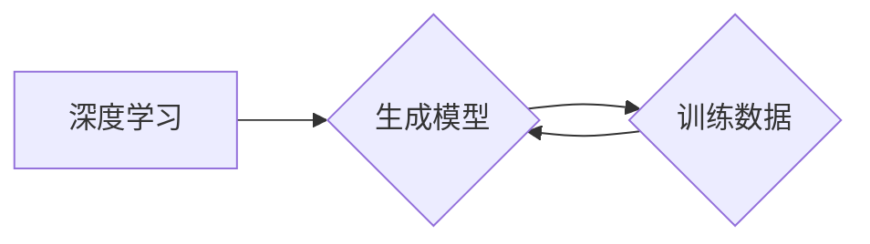

## AIGC从入门到实战：AIGC 相关资源推荐

> 关键词：AIGC, 文本生成, 图像生成, 多模态, 机器学习, 深度学习, 应用场景

### 1. 背景介绍

近年来，人工智能（AI）技术取得了飞速发展，其中，生成式人工智能（AIGC）作为人工智能领域的新兴方向，引起了广泛关注。AIGC是指利用人工智能技术，从数据中学习模式，并生成新的文本、图像、音频、视频等内容的模型。

AIGC技术在各个领域都展现出巨大的应用潜力，例如：

* **内容创作:** 自动生成新闻报道、广告文案、诗歌、小说等，提高内容生产效率。
* **艺术创作:** 生成绘画、音乐、视频等艺术作品，激发创作灵感，拓展艺术边界。
* **教育培训:** 个性化定制学习内容，提供智能化的教学辅助。
* **游戏开发:** 自动生成游戏场景、人物、剧情等，降低游戏开发成本。

随着AIGC技术的不断进步，其应用场景将更加广泛，对人类社会产生深远影响。

### 2. 核心概念与联系

AIGC的核心概念包括：

* **深度学习:** AIGC模型主要基于深度学习算法，例如Transformer、GAN等，通过多层神经网络学习数据中的复杂模式。
* **生成模型:** 生成模型旨在学习数据分布，并生成与训练数据相似的新的数据样本。
* **训练数据:** AIGC模型的训练数据是其学习和生成内容的基础，数据质量直接影响模型性能。

**AIGC 核心概念架构图:**



### 3. 核心算法原理 & 具体操作步骤

#### 3.1  算法原理概述

AIGC常用的算法包括：

* **Transformer:** Transformer是一种基于注意力机制的深度学习模型，能够有效捕捉文本中的长距离依赖关系，在文本生成任务中表现出色。
* **GAN (Generative Adversarial Networks):** GAN由生成器和判别器两部分组成，生成器试图生成逼真的数据样本，判别器试图区分真实数据和生成数据，两者相互竞争，最终生成器能够生成高质量的样本。

#### 3.2  算法步骤详解

**Transformer 算法步骤:**

1. **输入编码:** 将输入文本序列转换为向量表示。
2. **多头注意力:** 利用多头注意力机制捕捉文本中的上下文信息。
3. **前馈网络:** 对每个词向量进行非线性变换。
4. **输出解码:** 将编码后的信息解码成输出文本序列。

**GAN 算法步骤:**

1. **初始化生成器和判别器:** 随机初始化生成器和判别器的参数。
2. **生成器训练:** 生成器根据随机噪声生成数据样本，并将其输入判别器。
3. **判别器训练:** 判别器根据真实数据和生成数据样本进行训练，学习区分两者。
4. **参数更新:** 根据训练结果更新生成器和判别器的参数。
5. **重复步骤 2-4:** 直到生成器能够生成逼真的数据样本。

#### 3.3  算法优缺点

**Transformer 算法:**

* **优点:** 能够有效捕捉长距离依赖关系，在文本生成任务中表现出色。
* **缺点:** 计算量较大，训练时间长。

**GAN 算法:**

* **优点:** 可以生成高质量的样本，适用于各种类型的数据生成任务。
* **缺点:** 训练过程不稳定，容易出现模式崩溃问题。

#### 3.4  算法应用领域

* **Transformer:** 文本生成、机器翻译、问答系统、代码生成等。
* **GAN:** 图像生成、视频生成、语音合成、数据增强等。

### 4. 数学模型和公式 & 详细讲解 & 举例说明

#### 4.1  数学模型构建

AIGC模型通常采用神经网络作为数学模型，其中每个神经元接收多个输入信号，并通过激活函数进行处理，输出一个信号。神经网络层级结构可以模拟人类大脑的结构，并通过训练学习数据中的复杂模式。

#### 4.2  公式推导过程

AIGC模型的训练过程基于优化算法，例如梯度下降法。目标函数通常是衡量模型预测结果与真实结果之间的差异，例如均方误差 (MSE)。通过计算梯度，模型参数可以不断更新，以最小化目标函数值。

**均方误差 (MSE) 公式:**

$$MSE = \frac{1}{n} \sum_{i=1}^{n} (y_i - \hat{y}_i)^2$$

其中：

* $y_i$ 是真实值
* $\hat{y}_i$ 是模型预测值
* $n$ 是样本数量

#### 4.3  案例分析与讲解

**文本生成案例:**

假设我们训练一个文本生成模型，目标是生成一段关于“猫”的描述。训练数据包含大量关于猫的文本信息。模型通过学习这些数据，能够生成类似的文本描述。例如，模型可能生成以下描述：

“猫是一种可爱的动物，毛茸茸的，喜欢睡觉和玩耍。”

### 5. 项目实践：代码实例和详细解释说明

#### 5.1  开发环境搭建

AIGC项目开发通常需要以下环境：

* **操作系统:** Linux 或 macOS
* **编程语言:** Python
* **深度学习框架:** TensorFlow 或 PyTorch
* **GPU:** 加速训练过程

#### 5.2  源代码详细实现

以下是一个使用 TensorFlow 实现文本生成模型的简单代码示例：

```python
import tensorflow as tf

# 定义模型结构
model = tf.keras.Sequential([
    tf.keras.layers.Embedding(input_dim=vocab_size, output_dim=embedding_dim),
    tf.keras.layers.LSTM(units=lstm_units),
    tf.keras.layers.Dense(units=vocab_size, activation='softmax')
])

# 编译模型
model.compile(optimizer='adam', loss='sparse_categorical_crossentropy', metrics=['accuracy'])

# 训练模型
model.fit(x_train, y_train, epochs=epochs)

# 生成文本
text = "猫"
for _ in range(generate_length):
    predictions = model.predict(tf.expand_dims(text, 0))
    predicted_index = tf.argmax(predictions[0]).numpy()
    text += tokenizer.index_word[predicted_index]
print(text)
```

#### 5.3  代码解读与分析

* **Embedding 层:** 将单词转换为向量表示。
* **LSTM 层:** 学习文本中的上下文信息。
* **Dense 层:** 将 LSTM 输出转换为每个单词的概率分布。
* **训练过程:** 使用训练数据训练模型，优化模型参数以最小化损失函数。
* **文本生成:** 根据模型训练结果，输入一个种子文本，模型会根据概率分布生成后续文本。

#### 5.4  运行结果展示

运行上述代码后，模型将生成一段关于“猫”的文本描述。

### 6. 实际应用场景

#### 6.1  内容创作

* **新闻报道:** 自动生成新闻报道摘要、新闻评论等。
* **广告文案:** 自动生成吸引人的广告文案、产品描述等。
* **创意写作:** 辅助作家创作小说、诗歌、剧本等。

#### 6.2  艺术创作

* **绘画生成:** 根据文本描述生成相应的绘画作品。
* **音乐创作:** 生成新的音乐旋律、伴奏等。
* **视频生成:** 生成动画视频、特效视频等。

#### 6.3  教育培训

* **个性化学习:** 根据学生的学习进度和能力，定制个性化的学习内容。
* **智能化辅导:** 提供智能化的学习辅导，解答学生的疑问。
* **虚拟教学:** 创建虚拟教学环境，模拟真实课堂场景。

#### 6.4  未来应用展望

AIGC技术将进一步发展，应用场景将更加广泛，例如：

* **虚拟助手:** 更智能、更人性化的虚拟助手，能够理解自然语言，并提供更精准的帮助。
* **个性化推荐:** 更精准的商品、服务、内容推荐，满足用户的个性化需求。
* **自动代码生成:** 自动生成代码，提高软件开发效率。

### 7. 工具和资源推荐

#### 7.1  学习资源推荐

* **书籍:**
    * 《Deep Learning》 by Ian Goodfellow, Yoshua Bengio, and Aaron Courville
    * 《Generative Deep Learning》 by David Foster
* **在线课程:**
    * Coursera: Deep Learning Specialization
    * Udacity: Deep Learning Nanodegree
* **博客和论坛:**
    * Towards Data Science
    * Reddit: r/MachineLearning

#### 7.2  开发工具推荐

* **深度学习框架:** TensorFlow, PyTorch
* **自然语言处理库:** NLTK, spaCy
* **图像处理库:** OpenCV

#### 7.3  相关论文推荐

* **Attention Is All You Need:** https://arxiv.org/abs/1706.03762
* **Generative Adversarial Networks:** https://arxiv.org/abs/1406.2661

### 8. 总结：未来发展趋势与挑战

#### 8.1  研究成果总结

AIGC技术取得了显著进展，能够生成高质量的文本、图像、音频等内容。

#### 8.2  未来发展趋势

* **多模态生成:** 将文本、图像、音频等多种模态数据融合，生成更加丰富、多样的内容。
* **可解释性增强:** 提高AIGC模型的可解释性，让用户更好地理解模型的决策过程。
* **伦理规范:** 制定AIGC技术的伦理规范，避免其被滥用。

#### 8.3  面临的挑战

* **数据质量:** AIGC模型的性能依赖于训练数据的质量，高质量数据的获取和标注仍然是一个挑战。
* **计算资源:** 训练大型AIGC模型需要大量的计算资源，成本较高。
* **安全风险:** AIGC模型可能被用于生成虚假信息、恶意内容等，需要加强安全防护。

#### 8.4  研究展望

未来，AIGC技术将继续发展，在更多领域发挥重要作用。研究者将继续探索新的算法、模型和应用场景，推动AIGC技术向更智能、更安全、更可持续的方向发展。

### 9. 附录：常见问题与解答

* **什么是AIGC？**

AIGC是指利用人工智能技术，从数据中学习模式，并生成新的文本、图像、音频、视频等内容的模型。

* **AIGC有哪些应用场景？**

AIGC的应用场景非常广泛，例如内容创作、艺术创作、教育培训、游戏开发等。

* **如何学习AIGC？**

可以通过阅读相关书籍、在线课程、博客等学习AIGC知识。

* **如何开发AIGC项目？**

需要掌握深度学习、自然语言处理等相关技术，并使用相应的开发工具和框架。


作者：禅与计算机程序设计艺术 / Zen and the Art of Computer Programming 
