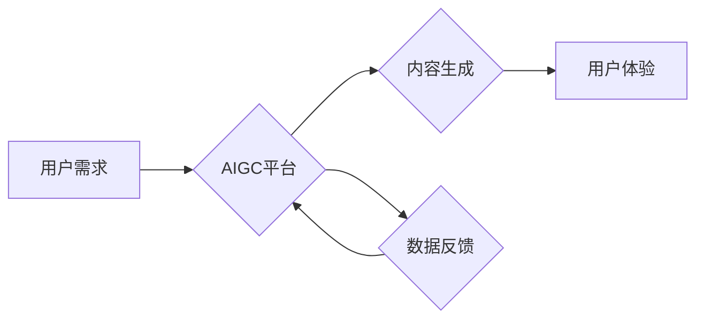

## AIGC创业的回归与商业本质

> 关键词：AIGC, 商业模式, 价值创造, 技术趋势, 伦理挑战

### 1. 背景介绍

近年来，人工智能生成内容（AIGC）技术突飞猛进，从文本生成、图像创作到视频制作，AIGC已经展现出强大的能力，并开始渗透到各个行业。这引发了广泛的讨论和关注，也催生了一批AIGC创业公司。然而，随着市场竞争的加剧，许多AIGC创业公司面临着生存和发展难题。

AIGC创业的初期，往往被视为技术创新的浪潮，许多公司专注于开发先进的算法模型和技术平台，希望通过技术领先占据市场先机。然而，随着技术的成熟，单纯依靠技术优势已经不足以保证企业的成功。AIGC创业的回归，意味着企业需要更加关注商业本质，寻找可持续的商业模式，并解决AIGC技术带来的伦理挑战。

### 2. 核心概念与联系

**2.1 AIGC 的核心概念**

AIGC是指利用人工智能技术自动生成各种类型的内容，包括文本、图像、音频、视频等。其核心技术包括：

* **自然语言处理 (NLP):** 用于理解和生成人类语言。
* **计算机视觉 (CV):** 用于理解和生成图像和视频。
* **深度学习 (DL):** 用于训练强大的机器学习模型。

**2.2 AIGC 与商业模式的联系**

AIGC技术可以为企业提供多种商业价值，例如：

* **内容生产效率提升:** 自动化内容创作，降低人力成本和时间成本。
* **个性化内容定制:** 根据用户需求生成个性化的内容，提升用户体验。
* **新产品和服务创新:** 基于AIGC技术开发新的产品和服务，开拓新的市场。

**2.3 AIGC 商业模式架构**



**2.4 价值创造与商业模式**

AIGC创业的核心在于如何将AIGC技术转化为商业价值。常见的商业模式包括：

* **订阅制:** 用户付费订阅AIGC平台，获得内容生成和使用权限。
* **按需付费:** 用户根据使用量付费，例如每生成一篇文本或一张图片收费。
* **平台服务:** 提供AIGC平台和工具，帮助企业和个人进行内容创作。
* **数据服务:** 收集和分析用户生成的内容数据，提供数据分析和 insights 服务。

### 3. 核心算法原理 & 具体操作步骤

**3.1 算法原理概述**

AIGC的核心算法主要基于深度学习技术，包括：

* **生成对抗网络 (GAN):** 通过两个神经网络对抗训练，生成逼真的内容。
* **变分自编码器 (VAE):** 学习数据的潜在表示，并根据潜在表示生成新的内容。
* **Transformer:** 用于处理序列数据，例如文本和音频，能够捕捉长距离依赖关系。

**3.2 算法步骤详解**

以文本生成为例，使用Transformer模型进行AIGC文本生成的基本步骤如下：

1. **数据预处理:** 将文本数据进行清洗、分词、词向量化等预处理操作。
2. **模型训练:** 使用预处理后的数据训练Transformer模型，学习文本的语法和语义规律。
3. **文本生成:** 根据用户输入的提示或上下文信息，利用训练好的模型生成新的文本内容。

**3.3 算法优缺点**

**优点:**

* 生成内容质量高，能够生成逼真、流畅的文本、图像、音频等内容。
* 可扩展性强，可以应用于多种类型的AIGC任务。
* 能够学习复杂的模式和关系，生成更具创意和个性化的内容。

**缺点:**

* 训练成本高，需要大量的计算资源和数据。
* 模型解释性差，难以理解模型是如何生成内容的。
* 存在生成虚假信息和偏见等伦理问题。

**3.4 算法应用领域**

AIGC算法广泛应用于以下领域：

* **内容创作:** 自动生成新闻报道、广告文案、小说、诗歌等。
* **教育培训:** 生成个性化学习内容、自动批改作业。
* **娱乐休闲:** 生成游戏场景、虚拟角色、音乐作品等。
* **客户服务:** 自动回复用户咨询、提供个性化服务。

### 4. 数学模型和公式 & 详细讲解 & 举例说明

**4.1 数学模型构建**

AIGC算法通常基于概率模型，例如条件概率分布。

**条件概率分布:**

$$P(y|x)$$

其中，$x$是输入数据，$y$是输出内容。

**4.2 公式推导过程**

AIGC算法的训练过程通常使用最大似然估计 (MLE) 或变分自编码器 (VAE) 等方法，通过优化模型参数，使得模型生成的输出内容与真实数据尽可能接近。

**最大似然估计 (MLE):**

$$ \theta = \arg \max_{ \theta } \prod_{i=1}^{N} P(y_i|x_i, \theta) $$

其中，$\theta$是模型参数，$N$是训练数据的数量。

**4.3 案例分析与讲解**

以文本生成为例，可以使用Transformer模型学习文本的条件概率分布。

假设我们有一个训练数据集，包含许多文本对$(x, y)$，其中$x$是输入文本，$y$是输出文本。

通过训练Transformer模型，我们可以学习到一个条件概率分布$P(y|x)$，该分布可以用来生成新的文本内容。

例如，如果输入文本是“今天天气很好”，则模型可以根据训练数据学习到相应的条件概率分布，并生成输出文本“适合出去散步”。

### 5. 项目实践：代码实例和详细解释说明

**5.1 开发环境搭建**

AIGC项目开发通常需要以下环境：

* **操作系统:** Linux 或 macOS
* **编程语言:** Python
* **深度学习框架:** TensorFlow 或 PyTorch
* **GPU:** 加速模型训练

**5.2 源代码详细实现**

以下是一个使用PyTorch训练文本生成模型的简单代码示例：

```python
import torch
import torch.nn as nn

class TextGenerator(nn.Module):
    def __init__(self, vocab_size, embedding_dim, hidden_dim):
        super(TextGenerator, self).__init__()
        self.embedding = nn.Embedding(vocab_size, embedding_dim)
        self.lstm = nn.LSTM(embedding_dim, hidden_dim)
        self.fc = nn.Linear(hidden_dim, vocab_size)

    def forward(self, x):
        embedded = self.embedding(x)
        output, (hidden, cell) = self.lstm(embedded)
        output = self.fc(output[:, -1, :])
        return output

#... 模型训练代码...
```

**5.3 代码解读与分析**

该代码定义了一个简单的文本生成模型，包含嵌入层、LSTM层和全连接层。

* 嵌入层将单词转换为向量表示。
* LSTM层用于处理文本序列，捕捉长距离依赖关系。
* 全连接层将LSTM输出映射到单词的概率分布。

**5.4 运行结果展示**

训练完成后，可以使用模型生成新的文本内容。

例如，可以输入一个单词作为提示，模型会根据训练数据生成后续的单词序列，从而生成一段完整的文本。

### 6. 实际应用场景

**6.1 内容创作**

AIGC可以用于自动生成各种类型的文本内容，例如：

* **新闻报道:** 根据事件数据自动生成新闻报道。
* **广告文案:** 根据产品信息自动生成广告文案。
* **小说、诗歌:** 根据用户提供的主题或风格自动生成小说、诗歌等创意内容。

**6.2 教育培训**

AIGC可以用于个性化学习内容和自动批改作业，例如：

* **个性化学习内容:** 根据学生的学习进度和知识点自动生成个性化的学习内容。
* **自动批改作业:** 根据学生的作业内容自动批改，并提供反馈建议。

**6.3 娱乐休闲**

AIGC可以用于生成游戏场景、虚拟角色、音乐作品等娱乐内容，例如：

* **游戏场景:** 根据游戏设定自动生成游戏场景。
* **虚拟角色:** 根据角色设定自动生成虚拟角色形象和对话。
* **音乐作品:** 根据用户提供的音乐风格自动生成音乐作品。

**6.4 客户服务**

AIGC可以用于自动回复用户咨询，提供个性化服务，例如：

* **聊天机器人:** 根据用户的聊天内容自动回复，提供信息和服务。
* **个性化推荐:** 根据用户的购买历史和浏览记录自动推荐产品或服务。

**6.5 未来应用展望**

AIGC技术的发展将带来更多新的应用场景，例如：

* **科学研究:** 自动生成实验数据、分析研究结果。
* **艺术创作:** 与人类艺术家合作，创作新的艺术作品。
* **医疗诊断:** 辅助医生进行疾病诊断和治疗方案制定。

### 7. 工具和资源推荐

**7.1 学习资源推荐**

* **书籍:**
    * 《深度学习》
    * 《自然语言处理》
    * 《机器学习》
* **在线课程:**
    * Coursera
    * edX
    * Udacity
* **博客和论坛:**
    * Towards Data Science
    * Machine Learning Mastery
    * Reddit

**7.2 开发工具推荐**

* **深度学习框架:** TensorFlow, PyTorch
* **自然语言处理库:** NLTK, spaCy
* **图像处理库:** OpenCV
* **云计算平台:** AWS, Azure, GCP

**7.3 相关论文推荐**

* 《Attention Is All You Need》
* 《Generative Adversarial Networks》
* 《Variational Autoencoders》

### 8. 总结：未来发展趋势与挑战

**8.1 研究成果总结**

近年来，AIGC技术取得了显著进展，能够生成高质量的文本、图像、音频等内容。

**8.2 未来发展趋势**

* **模型能力提升:** 模型规模和能力将继续提升，能够生成更复杂、更具创意的内容。
* **多模态生成:** 将文本、图像、音频等多种模态内容融合生成，实现更丰富的表达。
* **个性化定制:** 根据用户需求进行个性化内容定制，提升用户体验。
* **伦理规范:** 发展AIGC伦理规范，解决AIGC技术带来的伦理挑战。

**8.3 面临的挑战**

* **数据安全和隐私:** AIGC模型训练需要大量数据，如何保证数据安全和隐私是一个重要挑战。
* **算法偏见:** AIGC模型可能存在算法偏见，需要进行算法调优和数据清洗，避免生成歧视性内容。
* **内容原创性:** 如何保证AIGC生成的內容原创性，避免抄袭和剽窃是一个重要问题。

**8.4 研究展望**

未来，AIGC技术将继续发展，并应用于更多领域。

需要加强对AIGC伦理规范的研究，制定相应的法律法规，引导AIGC技术健康发展。

### 9. 附录：常见问题与解答

**9.1 如何选择合适的AIGC模型？**

选择合适的AIGC模型需要根据具体应用场景和需求进行选择。

例如，如果需要生成高质量的文本内容，可以选择Transformer模型；如果需要生成逼真的图像，可以选择GAN模型。

**9.2 如何解决AIGC模型的偏见问题？**

可以通过以下方法解决AIGC模型的偏见问题：

* 使用更加多元化的训练数据。
* 对训练数据进行清洗和标注，去除偏见信息。
* 使用公平性评估指标，评估模型的公平性。

**9.3 如何保证AIGC生成的內容原创性？**

可以通过以下方法保证AIGC生成的內容原创性：

* 使用训练数据进行内容检测，避免生成重复内容。
* 使用对抗训练方法，提高模型的生成能力，